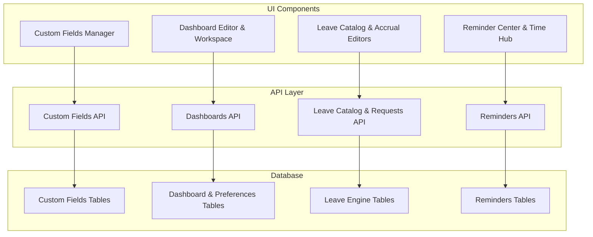
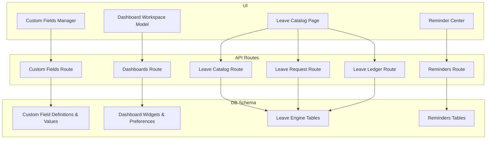
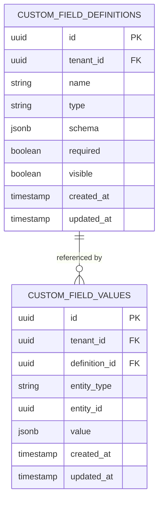
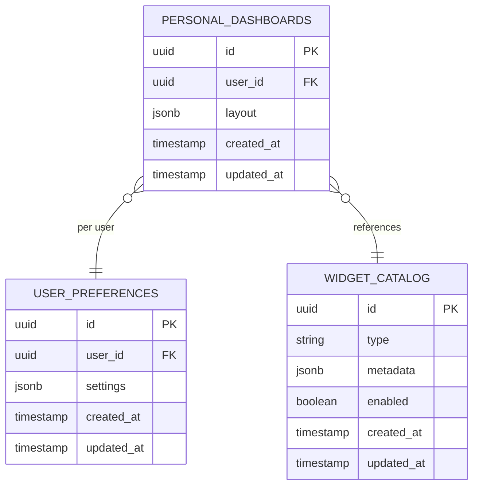
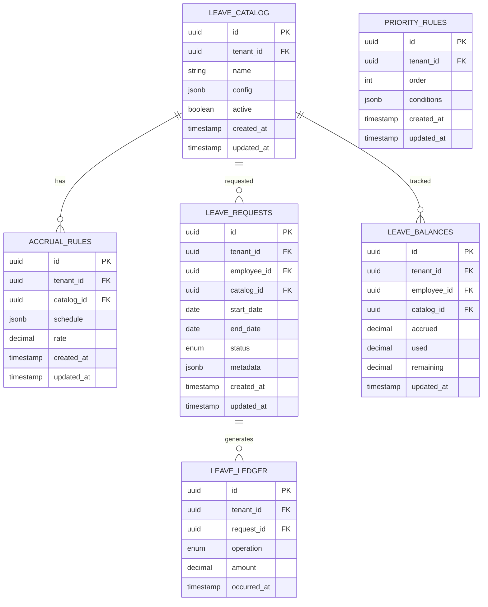
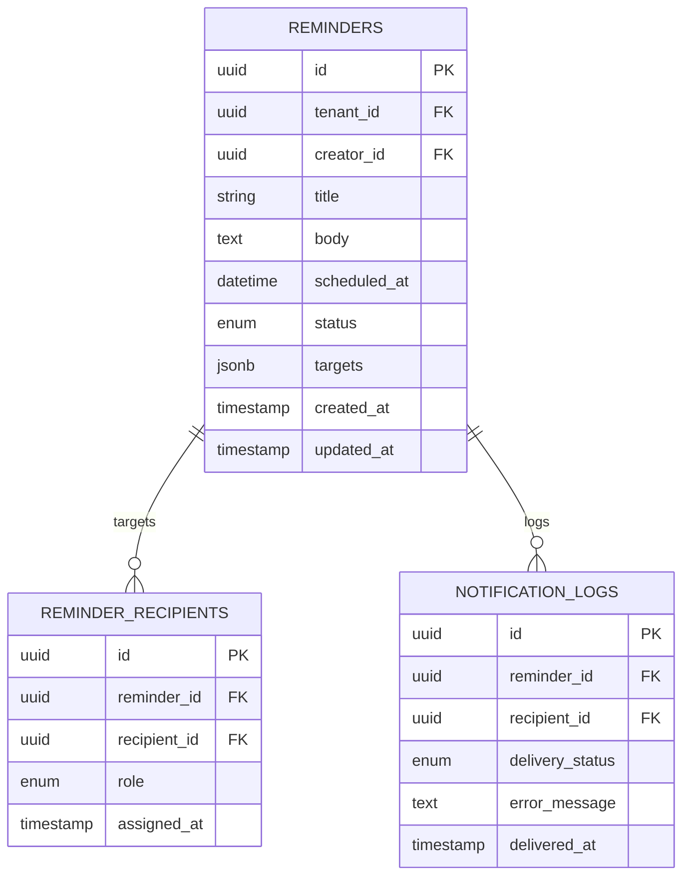
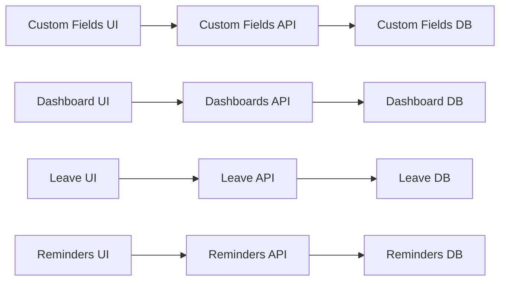

# Advanced Features Tables

<cite>
**Referenced Files in This Document**
- [20260715122802_add_custom_field_definitions.sql](file://apps/hr-suite/supabase/migrations/20260715122802_add_custom_field_definitions.sql)
- [20260715123119_add_custom_field_value_rpc.sql](file://apps/hr-suite/supabase/migrations/20260715123119_add_custom_field_value_rpc.sql)
- [20260715123927_harden_custom_field_values.sql](file://apps/hr-suite/supabase/migrations/20260715123927_harden_custom_field_values.sql)
- [20260718170000_add_dashboard_widget_catalog.sql](file://apps/hr-suite/supabase/migrations/20260718170000_add_dashboard_widget_catalog.sql)
- [20260718171000_relax_dashboard_widget_read_scope.sql](file://apps/hr-suite/supabase/migrations/20260718171000_relax_dashboard_widget_read_scope.sql)
- [20260718172000_expand_personal_dashboard_widget_types.sql](file://apps/hr-suite/supabase/migrations/20260718172000_expand_personal_dashboard_widget_types.sql)
- [20260718172051_grant_dashboard_widget_admin_permissions.sql](file://apps/hr-suite/supabase/migrations/20260718172051_grant_dashboard_widget_admin_permissions.sql)
- [20260718173000_tune_dashboard_widget_policies.sql](file://apps/hr-suite/supabase/migrations/20260718173000_tune_dashboard_widget_policies.sql)
- [20260718180354_add_date_time_user_preferences.sql](file://apps/hr-suite/supabase/migrations/20260718180354_add_date_time_user_preferences.sql)
- [20260715070404_add_user_preferences.sql](file://apps/hr-suite/supabase/migrations/20260715070404_add_user_preferences.sql)
- [20260722142551_add_leave_engine_foundation.sql](file://apps/hr-suite/supabase/migrations/20260722142551_add_leave_engine_foundation.sql)
- [20260722144232_add_leave_engine_fk_indexes.sql](file://apps/hr-suite/supabase/migrations/20260722144232_add_leave_engine_fk_indexes.sql)
- [20260722144344_add_leave_transaction_bucket_fk_index.sql](file://apps/hr-suite/supabase/migrations/20260722144344_add_leave_transaction_bucket_fk_index.sql)
- [20260722151920_add_leave_configuration_mutation_functions.sql](file://apps/hr-suite/supabase/migrations/20260722151920_add_leave_configuration_mutation_functions.sql)
- [20260722190000_add_leave_request_booking_engine.sql](file://apps/hr-suite/supabase/migrations/20260722190000_add_leave_request_booking_engine.sql)
- [20260722191500_add_leave_request_fk_indexes.sql](file://apps/hr-suite/supabase/migrations/20260722191500_add_leave_request_fk_indexes.sql)
- [20260722192000_add_leave_ledger_operations.sql](file://apps/hr-suite/supabase/migrations/20260722192000_add_leave_ledger_operations.sql)
- [20260716081000_add_time_hub_reminders.sql](file://apps/hr-suite/supabase/migrations/20260716081000_add_time_hub_reminders.sql)
- [20260718132000_split_reminder_target_write_policy.sql](file://apps/hr-suite/supabase/migrations/20260718132000_split_reminder_target_write_policy.sql)
- [custom-field-manager.tsx](file://apps/hr-suite/components/custom-fields/custom-field-manager.tsx)
- [employee-custom-fields.tsx](file://apps/hr-suite/components/custom-fields/employee-custom-fields.tsx)
- [dashboard-editor.tsx](file://apps/hr-suite/components/dashboard/dashboard-editor.tsx)
- [dashboard-workspace-model.ts](file://apps/hr-suite/components/dashboard/dashboard-workspace-model.ts)
- [dashboard-progress-model.ts](file://apps/hr-suite/components/dashboard/dashboard-progress-model.ts)
- [widget-picker-model.ts](file://apps/hr-suite/components/dashboard/widget-picker-model.ts)
- [leave-catalog-page.tsx](file://apps/hr-suite/components/leave/leave-catalog-page.tsx)
- [accrual-rule-editor.tsx](file://apps/hr-suite/components/leave/accrual-rule-editor.tsx)
- [priority-rule-editor.tsx](file://apps/hr-suite/components/leave/priority-rule-editor.tsx)
- [leave-ledger-panel.tsx](file://apps/hr-suite/components/leave/leave-ledger-panel.tsx)
- [reminder-center.tsx](file://apps/hr-suite/components/reminders/reminder-center.tsx)
- [time-hub.tsx](file://apps/hr-suite/components/reminders/time-hub.tsx)
- [route.ts (Custom Fields API)](file://apps/hr-suite/app/api/custom-fields/route.ts)
- [route.ts (Custom Field Definition)](file://apps/hr-suite/app/api/custom-fields/[definitionId]/route.ts)
- [route.ts (Dashboards API)](file://apps/hr-suite/app/api/dashboards/route.ts)
- [route.ts (Dashboard by ID)](file://apps/hr-suite/app/api/dashboards/[dashboardId]/route.ts)
- [route.ts (Leave Catalog)](file://apps/hr-suite/app/api/leave/catalog/route.ts)
- [route.ts (Leave Request)](file://apps/hr-suite/app/api/leave/request/route.ts)
- [route.ts (Leave Ledger)](file://apps/hr-suite/app/api/leave/ledger/route.ts)
- [route.ts (Reminders)](file://apps/hr-suite/app/api/reminders/route.ts)
- [route.ts (Reminder by ID)](file://apps/hr-suite/app/api/reminders/[reminderId]/route.ts)
</cite>

## Table of Contents
1. [Introduction](#introduction)
2. [Project Structure](#project-structure)
3. [Core Components](#core-components)
4. [Architecture Overview](#architecture-overview)
5. [Detailed Component Analysis](#detailed-component-analysis)
6. [Dependency Analysis](#dependency-analysis)
7. [Performance Considerations](#performance-considerations)
8. [Troubleshooting Guide](#troubleshooting-guide)
9. [Conclusion](#conclusion)

## Introduction
This document provides a comprehensive data model and implementation overview for LiquidHR’s advanced feature tables: Custom Fields, Dashboard Engine, Leave Management, and Reminder System. It explains how dynamic schemas are modeled with JSON, how real-time data structures are composed across UI components and APIs, and how complex business logic is enforced through database functions, policies, and application code. Migration strategies, validation rules, and performance considerations are included to guide safe evolution and optimization.

## Project Structure
The advanced features span multiple layers:
- Database schema and migrations define the canonical data model, constraints, indexes, and stored procedures.
- API routes expose REST endpoints for CRUD and domain operations.
- UI components implement user workflows and interact with APIs and local state models.

[No sources needed since this diagram shows conceptual workflow, not actual code structure]

## Core Components
- Custom Fields system: Dynamic attribute definitions and values attached to entities using JSON-based schemas.
- Dashboard engine: Widget catalog, personal dashboards, layouts, and user preferences.
- Leave management: Catalogs, accrual rules, priority rules, requests, balances, and ledger operations.
- Reminder system: Scheduling, recipients, notifications, and publish/cancel flows.

**Section sources**
- [20260715122802_add_custom_field_definitions.sql](file://apps/hr-suite/supabase/migrations/20260715122802_add_custom_field_definitions.sql)
- [20260715123119_add_custom_field_value_rpc.sql](file://apps/hr-suite/supabase/migrations/20260715123119_add_custom_field_value_rpc.sql)
- [20260715123927_harden_custom_field_values.sql](file://apps/hr-suite/supabase/migrations/20260715123927_harden_custom_field_values.sql)
- [20260718170000_add_dashboard_widget_catalog.sql](file://apps/hr-suite/supabase/migrations/20260718170000_add_dashboard_widget_catalog.sql)
- [20260718171000_relax_dashboard_widget_read_scope.sql](file://apps/hr-suite/supabase/migrations/20260718171000_relax_dashboard_widget_read_scope.sql)
- [20260718172000_expand_personal_dashboard_widget_types.sql](file://apps/hr-suite/supabase/migrations/20260718172000_expand_personal_dashboard_widget_types.sql)
- [20260718172051_grant_dashboard_widget_admin_permissions.sql](file://apps/hr-suite/supabase/migrations/20260718172051_grant_dashboard_widget_admin_permissions.sql)
- [20260718173000_tune_dashboard_widget_policies.sql](file://apps/hr-suite/supabase/migrations/20260718173000_tune_dashboard_widget_policies.sql)
- [20260718180354_add_date_time_user_preferences.sql](file://apps/hr-suite/supabase/migrations/20260718180354_add_date_time_user_preferences.sql)
- [20260715070404_add_user_preferences.sql](file://apps/hr-suite/supabase/migrations/20260715070404_add_user_preferences.sql)
- [20260722142551_add_leave_engine_foundation.sql](file://apps/hr-suite/supabase/migrations/20260722142551_add_leave_engine_foundation.sql)
- [20260722144232_add_leave_engine_fk_indexes.sql](file://apps/hr-suite/supabase/migrations/20260722144232_add_leave_engine_fk_indexes.sql)
- [20260722144344_add_leave_transaction_bucket_fk_index.sql](file://apps/hr-suite/supabase/migrations/20260722144344_add_leave_transaction_bucket_fk_index.sql)
- [20260722151920_add_leave_configuration_mutation_functions.sql](file://apps/hr-suite/supabase/migrations/20260722151920_add_leave_configuration_mutation_functions.sql)
- [20260722190000_add_leave_request_booking_engine.sql](file://apps/hr-suite/supabase/migrations/20260722190000_add_leave_request_booking_engine.sql)
- [20260722191500_add_leave_request_fk_indexes.sql](file://apps/hr-suite/supabase/migrations/20260722191500_add_leave_request_fk_indexes.sql)
- [20260722192000_add_leave_ledger_operations.sql](file://apps/hr-suite/supabase/migrations/20260722192000_add_leave_ledger_operations.sql)
- [20260716081000_add_time_hub_reminders.sql](file://apps/hr-suite/supabase/migrations/20260716081000_add_time_hub_reminders.sql)
- [20260718132000_split_reminder_target_write_policy.sql](file://apps/hr-suite/supabase/migrations/20260718132000_split_reminder_target_write_policy.sql)

## Architecture Overview
High-level architecture connects UI components to API routes and database tables/functions:

**Diagram sources**
- [custom-field-manager.tsx](file://apps/hr-suite/components/custom-fields/custom-field-manager.tsx)
- [dashboard-workspace-model.ts](file://apps/hr-suite/components/dashboard/dashboard-workspace-model.ts)
- [leave-catalog-page.tsx](file://apps/hr-suite/components/leave/leave-catalog-page.tsx)
- [reminder-center.tsx](file://apps/hr-suite/components/reminders/reminder-center.tsx)
- [route.ts (Custom Fields API)](file://apps/hr-suite/app/api/custom-fields/route.ts)
- [route.ts (Dashboards API)](file://apps/hr-suite/app/api/dashboards/route.ts)
- [route.ts (Leave Catalog)](file://apps/hr-suite/app/api/leave/catalog/route.ts)
- [route.ts (Leave Request)](file://apps/hr-suite/app/api/leave/request/route.ts)
- [route.ts (Leave Ledger)](file://apps/hr-suite/app/api/leave/ledger/route.ts)
- [route.ts (Reminders)](file://apps/hr-suite/app/api/reminders/route.ts)

## Detailed Component Analysis

### Custom Fields System
Purpose: Provide a flexible, tenant-scoped mechanism to attach arbitrary attributes to HR entities via JSON schemas and values.

Key data model elements:
- Custom field definitions: type, validation schema, labels, visibility, scope.
- Custom field values: entity references, definition IDs, typed values validated against schemas.
- RPC helpers: efficient read/write operations for custom field values.

**Diagram sources**
- [20260715122802_add_custom_field_definitions.sql](file://apps/hr-suite/supabase/migrations/20260715122802_add_custom_field_definitions.sql)
- [20260715123119_add_custom_field_value_rpc.sql](file://apps/hr-suite/supabase/migrations/20260715123119_add_custom_field_value_rpc.sql)
- [20260715123927_harden_custom_field_values.sql](file://apps/hr-suite/supabase/migrations/20260715123927_harden_custom_field_values.sql)

Processing logic and validation:
- Schema-driven validation ensures values conform to defined types and constraints.
- Tenant isolation enforced via foreign keys and policies.
- RPC functions encapsulate common operations like upserting values and bulk reads.

API interactions:
- Create/update definitions and values via dedicated routes.
- Scoped access controls ensure only authorized tenants/users can modify or view fields.

Migration strategy:
- Introduce new field types and schemas incrementally.
- Backfill existing records where necessary; use safe defaults.
- Harden policies and indexes as usage grows.

Performance considerations:
- Indexes on tenant_id, definition_id, entity_type, and entity_id for fast lookups.
- Use RPC functions to reduce round-trips and enforce consistency.
- Validate schemas at write time to avoid costly re-validation later.

**Section sources**
- [20260715122802_add_custom_field_definitions.sql](file://apps/hr-suite/supabase/migrations/20260715122802_add_custom_field_definitions.sql)
- [20260715123119_add_custom_field_value_rpc.sql](file://apps/hr-suite/supabase/migrations/20260715123119_add_custom_field_value_rpc.sql)
- [20260715123927_harden_custom_field_values.sql](file://apps/hr-suite/supabase/migrations/20260715123927_harden_custom_field_values.sql)
- [custom-field-manager.tsx](file://apps/hr-suite/components/custom-fields/custom-field-manager.tsx)
- [employee-custom-fields.tsx](file://apps/hr-suite/components/custom-fields/employee-custom-fields.tsx)
- [route.ts (Custom Fields API)](file://apps/hr-suite/app/api/custom-fields/route.ts)
- [route.ts (Custom Field Definition)](file://apps/hr-suite/app/api/custom-fields/[definitionId]/route.ts)

### Dashboard Engine
Purpose: Enable personalized dashboards with widgets, layouts, and user preferences.

Key data model elements:
- Widget catalog: predefined widget types and metadata.
- Personal dashboards: per-user layout configurations referencing catalog entries.
- User preferences: date/time formats, week numbering, theme settings.

**Diagram sources**
- [20260718170000_add_dashboard_widget_catalog.sql](file://apps/hr-suite/supabase/migrations/20260718170000_add_dashboard_widget_catalog.sql)
- [20260718171000_relax_dashboard_widget_read_scope.sql](file://apps/hr-suite/supabase/migrations/20260718171000_relax_dashboard_widget_read_scope.sql)
- [20260718172000_expand_personal_dashboard_widget_types.sql](file://apps/hr-suite/supabase/migrations/20260718172000_expand_personal_dashboard_widget_types.sql)
- [20260718172051_grant_dashboard_widget_admin_permissions.sql](file://apps/hr-suite/supabase/migrations/20260718172051_grant_dashboard_widget_admin_permissions.sql)
- [20260718173000_tune_dashboard_widget_policies.sql](file://apps/hr-suite/supabase/migrations/20260718173000_tune_dashboard_widget_policies.sql)
- [20260718180354_add_date_time_user_preferences.sql](file://apps/hr-suite/supabase/migrations/20260718180354_add_date_time_user_preferences.sql)
- [20260715070404_add_user_preferences.sql](file://apps/hr-suite/supabase/migrations/20260715070404_add_user_preferences.sql)

Processing logic and validation:
- Layout JSON validated against widget catalog metadata.
- Policies restrict writes to owner users and admins.
- Preferences merged with defaults for consistent UX.

API interactions:
- Manage widget catalog entries and permissions.
- Read/write personal dashboard layouts and preferences.

Migration strategy:
- Expand widget types safely without breaking existing layouts.
- Tune policies gradually to relax read scopes while maintaining write security.

Performance considerations:
- Cache widget catalog metadata client-side when possible.
- Minimize layout updates; batch changes where feasible.
- Index user_id on dashboards and preferences for fast retrieval.

**Section sources**
- [20260718170000_add_dashboard_widget_catalog.sql](file://apps/hr-suite/supabase/migrations/20260718170000_add_dashboard_widget_catalog.sql)
- [20260718171000_relax_dashboard_widget_read_scope.sql](file://apps/hr-suite/supabase/migrations/20260718171000_relax_dashboard_widget_read_scope.sql)
- [20260718172000_expand_personal_dashboard_widget_types.sql](file://apps/hr-suite/supabase/migrations/20260718172000_expand_personal_dashboard_widget_types.sql)
- [20260718172051_grant_dashboard_widget_admin_permissions.sql](file://apps/hr-suite/supabase/migrations/20260718172051_grant_dashboard_widget_admin_permissions.sql)
- [20260718173000_tune_dashboard_widget_policies.sql](file://apps/hr-suite/supabase/migrations/20260718173000_tune_dashboard_widget_policies.sql)
- [20260718180354_add_date_time_user_preferences.sql](file://apps/hr-suite/supabase/migrations/20260718180354_add_date_time_user_preferences.sql)
- [20260715070404_add_user_preferences.sql](file://apps/hr-suite/supabase/migrations/20260715070404_add_user_preferences.sql)
- [dashboard-editor.tsx](file://apps/hr-suite/components/dashboard/dashboard-editor.tsx)
- [dashboard-workspace-model.ts](file://apps/hr-suite/components/dashboard/dashboard-workspace-model.ts)
- [dashboard-progress-model.ts](file://apps/hr-suite/components/dashboard/dashboard-progress-model.ts)
- [widget-picker-model.ts](file://apps/hr-suite/components/dashboard/widget-picker-model.ts)
- [route.ts (Dashboards API)](file://apps/hr-suite/app/api/dashboards/route.ts)
- [route.ts (Dashboard by ID)](file://apps/hr-suite/app/api/dashboards/[dashboardId]/route.ts)

### Leave Management
Purpose: Manage leave catalogs, accrual rules, priority rules, requests, balances, and ledger operations.

Key data model elements:
- Leave catalogs: types, entitlements, and rules.
- Accrual rules: schedules, rates, and conditions.
- Priority rules: ordering and conflict resolution.
- Requests: employee submissions, approvals, and status tracking.
- Balances: current and historical accruals and usage.
- Ledger: immutable transaction records for auditability.

**Diagram sources**
- [20260722142551_add_leave_engine_foundation.sql](file://apps/hr-suite/supabase/migrations/20260722142551_add_leave_engine_foundation.sql)
- [20260722144232_add_leave_engine_fk_indexes.sql](file://apps/hr-suite/supabase/migrations/20260722144232_add_leave_engine_fk_indexes.sql)
- [20260722144344_add_leave_transaction_bucket_fk_index.sql](file://apps/hr-suite/supabase/migrations/20260722144344_add_leave_transaction_bucket_fk_index.sql)
- [20260722151920_add_leave_configuration_mutation_functions.sql](file://apps/hr-suite/supabase/migrations/20260722151920_add_leave_configuration_mutation_functions.sql)
- [20260722190000_add_leave_request_booking_engine.sql](file://apps/hr-suite/supabase/migrations/20260722190000_add_leave_request_booking_engine.sql)
- [20260722191500_add_leave_request_fk_indexes.sql](file://apps/hr-suite/supabase/migrations/20260722191500_add_leave_request_fk_indexes.sql)
- [20260722192000_add_leave_ledger_operations.sql](file://apps/hr-suite/supabase/migrations/20260722192000_add_leave_ledger_operations.sql)

Processing logic and validation:
- Accrual calculations driven by schedules and rates; validated against policy rules.
- Request booking enforces availability and balance checks before committing ledger entries.
- Priority rules determine approval order and conflict resolution.

API interactions:
- Catalog configuration and rule management.
- Submit and manage leave requests; query balances and ledger history.

Migration strategy:
- Introduce new accrual schedules and priority rules with backward compatibility.
- Add indexes to support high-volume ledger queries.
- Use mutation functions to encapsulate complex transactions.

Performance considerations:
- Precompute balances periodically; refresh on significant events.
- Partition ledger by date ranges if volume grows significantly.
- Batch request validations to minimize round-trips.

**Section sources**
- [20260722142551_add_leave_engine_foundation.sql](file://apps/hr-suite/supabase/migrations/20260722142551_add_leave_engine_foundation.sql)
- [20260722144232_add_leave_engine_fk_indexes.sql](file://apps/hr-suite/supabase/migrations/20260722144232_add_leave_engine_fk_indexes.sql)
- [20260722144344_add_leave_transaction_bucket_fk_index.sql](file://apps/hr-suite/supabase/migrations/20260722144344_add_leave_transaction_bucket_fk_index.sql)
- [20260722151920_add_leave_configuration_mutation_functions.sql](file://apps/hr-suite/supabase/migrations/20260722151920_add_leave_configuration_mutation_functions.sql)
- [20260722190000_add_leave_request_booking_engine.sql](file://apps/hr-suite/supabase/migrations/20260722190000_add_leave_request_booking_engine.sql)
- [20260722191500_add_leave_request_fk_indexes.sql](file://apps/hr-suite/supabase/migrations/20260722191500_add_leave_request_fk_indexes.sql)
- [20260722192000_add_leave_ledger_operations.sql](file://apps/hr-suite/supabase/migrations/20260722192000_add_leave_ledger_operations.sql)
- [leave-catalog-page.tsx](file://apps/hr-suite/components/leave/leave-catalog-page.tsx)
- [accrual-rule-editor.tsx](file://apps/hr-suite/components/leave/accrual-rule-editor.tsx)
- [priority-rule-editor.tsx](file://apps/hr-suite/components/leave/priority-rule-editor.tsx)
- [leave-ledger-panel.tsx](file://apps/hr-suite/components/leave/leave-ledger-panel.tsx)
- [route.ts (Leave Catalog)](file://apps/hr-suite/app/api/leave/catalog/route.ts)
- [route.ts (Leave Request)](file://apps/hr-suite/app/api/leave/request/route.ts)
- [route.ts (Leave Ledger)](file://apps/hr-suite/app/api/leave/ledger/route.ts)

### Reminder System
Purpose: Schedule reminders, target recipients, and manage notification lifecycle including publish and cancel actions.

Key data model elements:
- Reminders: scheduled tasks with targets, recurrence, and status.
- Recipients: employees or groups receiving notifications.
- Notification logs: delivery attempts and outcomes.

**Diagram sources**
- [20260716081000_add_time_hub_reminders.sql](file://apps/hr-suite/supabase/migrations/20260716081000_add_time_hub_reminders.sql)
- [20260718132000_split_reminder_target_write_policy.sql](file://apps/hr-suite/supabase/migrations/20260718132000_split_reminder_target_write_policy.sql)

Processing logic and validation:
- Scheduler evaluates upcoming reminders and dispatches notifications.
- Recipient resolution supports individuals and groups with fallbacks.
- Publish/cancel endpoints update status atomically.

API interactions:
- Create, update, publish, and cancel reminders.
- Query recipient assignments and delivery logs.

Migration strategy:
- Evolve target resolution logic with backward-compatible schemas.
- Add indexes on scheduled_at and status for efficient scheduling.

Performance considerations:
- Batch recipient processing to reduce overhead.
- Use background jobs for heavy notification delivery.
- Monitor delivery logs for retries and error handling.

**Section sources**
- [20260716081000_add_time_hub_reminders.sql](file://apps/hr-suite/supabase/migrations/20260716081000_add_time_hub_reminders.sql)
- [20260718132000_split_reminder_target_write_policy.sql](file://apps/hr-suite/supabase/migrations/20260718132000_split_reminder_target_write_policy.sql)
- [reminder-center.tsx](file://apps/hr-suite/components/reminders/reminder-center.tsx)
- [time-hub.tsx](file://apps/hr-suite/components/reminders/time-hub.tsx)
- [route.ts (Reminders)](file://apps/hr-suite/app/api/reminders/route.ts)
- [route.ts (Reminder by ID)](file://apps/hr-suite/app/api/reminders/[reminderId]/route.ts)

## Dependency Analysis
Inter-component dependencies and relationships:

**Diagram sources**
- [route.ts (Custom Fields API)](file://apps/hr-suite/app/api/custom-fields/route.ts)
- [route.ts (Dashboards API)](file://apps/hr-suite/app/api/dashboards/route.ts)
- [route.ts (Leave Catalog)](file://apps/hr-suite/app/api/leave/catalog/route.ts)
- [route.ts (Leave Request)](file://apps/hr-suite/app/api/leave/request/route.ts)
- [route.ts (Leave Ledger)](file://apps/hr-suite/app/api/leave/ledger/route.ts)
- [route.ts (Reminders)](file://apps/hr-suite/app/api/reminders/route.ts)

**Section sources**
- [custom-field-manager.tsx](file://apps/hr-suite/components/custom-fields/custom-field-manager.tsx)
- [dashboard-workspace-model.ts](file://apps/hr-suite/components/dashboard/dashboard-workspace-model.ts)
- [leave-catalog-page.tsx](file://apps/hr-suite/components/leave/leave-catalog-page.tsx)
- [reminder-center.tsx](file://apps/hr-suite/components/reminders/reminder-center.tsx)

## Performance Considerations
- Custom Fields: Validate schemas at write time; index tenant and entity identifiers; use RPC functions for batch operations.
- Dashboards: Cache widget catalog metadata; minimize layout mutations; prefer optimistic updates with rollback on failure.
- Leave Management: Precompute balances; partition ledger tables by time; batch request validations; leverage indexes on foreign keys.
- Reminders: Schedule background jobs; batch recipient processing; monitor delivery logs for retries and errors.

[No sources needed since this section provides general guidance]

## Troubleshooting Guide
Common issues and resolutions:
- Custom Fields: Schema mismatch errors indicate invalid values; review definition schemas and input validation.
- Dashboards: Layout rendering failures often stem from missing widget metadata; verify catalog entries and permissions.
- Leave Management: Balance discrepancies may arise from incomplete ledger entries; audit recent transactions and recalculate balances.
- Reminders: Delivery failures logged in notification logs; check recipient resolution and retry policies.

**Section sources**
- [20260715123927_harden_custom_field_values.sql](file://apps/hr-suite/supabase/migrations/20260715123927_harden_custom_field_values.sql)
- [20260718173000_tune_dashboard_widget_policies.sql](file://apps/hr-suite/supabase/migrations/20260718173000_tune_dashboard_widget_policies.sql)
- [20260722192000_add_leave_ledger_operations.sql](file://apps/hr-suite/supabase/migrations/20260722192000_add_leave_ledger_operations.sql)
- [20260718132000_split_reminder_target_write_policy.sql](file://apps/hr-suite/supabase/migrations/20260718132000_split_reminder_target_write_policy.sql)

## Conclusion
LiquidHR’s advanced features provide robust, extensible capabilities for dynamic data modeling, personalized dashboards, comprehensive leave management, and reliable reminder systems. By leveraging JSON schemas, well-defined APIs, and carefully engineered database structures, the platform ensures flexibility, performance, and maintainability. Adhering to migration strategies, validation rules, and performance best practices will sustain growth and reliability as usage scales.

[No sources needed since this section summarizes without analyzing specific files]