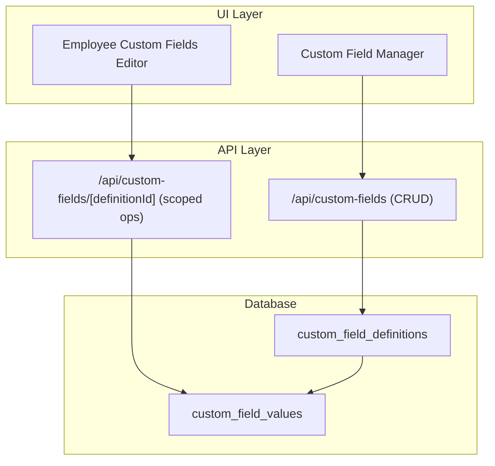
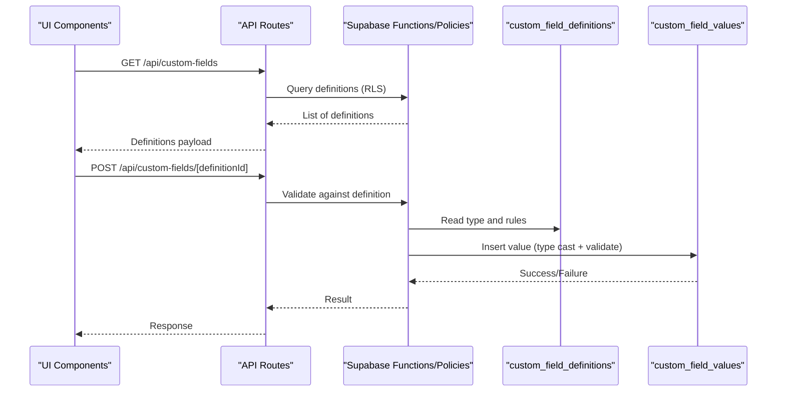
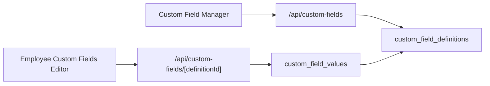

# Custom Fields Tables

<cite>
**Referenced Files in This Document**
- [20260715122802_add_custom_field_definitions.sql](file://apps/hr-suite/supabase/migrations/20260715122802_add_custom_field_definitions.sql)
- [20260715123119_add_custom_field_value_rpc.sql](file://apps/hr-suite/supabase/migrations/20260715123119_add_custom_field_value_rpc.sql)
- [20260715123927_harden_custom_field_values.sql](file://apps/hr-suite/supabase/migrations/20260715123927_harden_custom_field_values.sql)
- [20260715131230_seed_custom_fields_and_tenant_roles.sql](file://apps/hr-suite/supabase/migrations/20260715131230_seed_custom_fields_and_tenant_roles.sql)
- [custom_fields_isolation.sql](file://apps/hr-suite/supabase/tests/custom_fields_isolation.sql)
- [route.ts](file://apps/hr-suite/app/api/custom-fields/route.ts)
- [route.ts](file://apps/hr-suite/app/api/custom-fields/[definitionId]/route.ts)
- [employee-custom-fields.tsx](file://apps/hr-suite/components/custom-fields/employee-custom-fields.tsx)
- [custom-field-manager.tsx](file://apps/hr-suite/components/custom-fields/custom-field-manager.tsx)
</cite>

## Table of Contents
1. [Introduction](#introduction)
2. [Project Structure](#project-structure)
3. [Core Components](#core-components)
4. [Architecture Overview](#architecture-overview)
5. [Detailed Component Analysis](#detailed-component-analysis)
6. [Dependency Analysis](#dependency-analysis)
7. [Performance Considerations](#performance-considerations)
8. [Troubleshooting Guide](#troubleshooting-guide)
9. [Conclusion](#conclusion)
10. [Appendices](#appendices)

## Introduction
This document provides comprehensive data model documentation for LiquidHR’s custom fields system. It covers the schema and behavior of the custom field definitions and values tables, supported field types, validation rules, dynamic schema management, RPC functions for operations, relationship mappings to employees and other entities, and security policies. It also includes examples for creating definitions, managing values, querying dynamic data, and guidance on performance, indexing, and migration patterns for evolving schemas.

## Project Structure
The custom fields feature spans database migrations, API routes, and UI components:
- Database schema and policies are defined in Supabase migrations.
- API endpoints expose CRUD operations for custom field definitions and values.
- UI components provide managers and editors for defining and editing custom fields at the employee level.

[No sources needed since this diagram shows conceptual workflow, not actual code structure]

## Core Components
- custom_field_definitions: Defines metadata for a custom field including name, type, validation rules, visibility, and scope.
- custom_field_values: Stores typed JSON values linked to a definition and a target entity (e.g., employee).

Key responsibilities:
- Definitions drive dynamic form rendering and validation.
- Values store flexible, typed payloads per entity instance.
- Policies enforce tenant isolation and role-based access.

**Section sources**
- [20260715122802_add_custom_field_definitions.sql](file://apps/hr-suite/supabase/migrations/20260715122802_add_custom_field_definitions.sql)
- [20260715123119_add_custom_field_value_rpc.sql](file://apps/hr-suite/supabase/migrations/20260715123119_add_custom_field_value_rpc.sql)
- [20260715123927_harden_custom_field_values.sql](file://apps/hr-suite/supabase/migrations/20260715123927_harden_custom_field_values.sql)

## Architecture Overview
The custom fields architecture follows a schema-on-read pattern with server-side validation and secure storage:
- Definitions define allowed types and constraints.
- Values are stored as JSON with type casting and validation enforced by RPCs and triggers.
- API routes orchestrate requests and delegate to DB functions/policies.
- UI components render forms based on definitions and submit validated values.

**Diagram sources**
- [route.ts](file://apps/hr-suite/app/api/custom-fields/route.ts)
- [route.ts](file://apps/hr-suite/app/api/custom-fields/[definitionId]/route.ts)
- [20260715123119_add_custom_field_value_rpc.sql](file://apps/hr-suite/supabase/migrations/20260715123119_add_custom_field_value_rpc.sql)

## Detailed Component Analysis

### Data Model: custom_field_definitions
Purpose:
- Define the shape and behavior of each custom field.
- Control validation, display hints, and scoping.

Key attributes (conceptual):
- id: Primary key
- name: Unique identifier for the field
- label: Human-readable label
- type: Supported field type (e.g., string, number, boolean, date, enum)
- config: JSON configuration for options (e.g., enum choices, min/max, regex)
- required: Boolean flag
- visible: Boolean flag for UI visibility
- created_at, updated_at: Timestamps

Validation and rules:
- Type enforcement is applied when storing values.
- Config-driven constraints (e.g., length, range, pattern) are enforced by DB functions or triggers.

Relationships:
- One-to-many with custom_field_values via definition_id.

**Section sources**
- [20260715122802_add_custom_field_definitions.sql](file://apps/hr-suite/supabase/migrations/20260715122802_add_custom_field_definitions.sql)

### Data Model: custom_field_values
Purpose:
- Store dynamic, typed values for any entity that supports custom fields (e.g., employees).

Key attributes (conceptual):
- id: Primary key
- definition_id: Foreign key to custom_field_definitions
- entity_type: Discriminator for the related entity (e.g., 'employee')
- entity_id: Identifier of the specific entity row
- value: JSON column holding the typed value
- created_at, updated_at: Timestamps

Type casting and validation:
- Values are validated against the associated definition’s type and config.
- Casting ensures consistent storage and retrieval semantics.

Indexes and queries:
- Indexes on definition_id, entity_type, and entity_id enable efficient lookups and filtering.

**Section sources**
- [20260715123119_add_custom_field_value_rpc.sql](file://apps/hr-suite/supabase/migrations/20260715123119_add_custom_field_value_rpc.sql)
- [20260715123927_harden_custom_field_values.sql](file://apps/hr-suite/supabase/migrations/20260715123927_harden_custom_field_values.sql)

### RPC Functions for Custom Field Operations
Responsibilities:
- Create, update, delete, and read custom field values with strict validation.
- Enforce tenant isolation and role-based access.
- Provide safe interfaces for application code and UI.

Typical operations:
- set_custom_field_value(definition_id, entity_type, entity_id, value)
- get_custom_field_value(definition_id, entity_type, entity_id)
- list_custom_field_values(entity_type, entity_id)
- manage definitions (create/update/delete) through admin APIs

Security:
- RLS policies restrict access to tenant-scoped data.
- Admin-only roles can modify definitions; regular users can only manage their own or permitted entities’ values.

**Section sources**
- [20260715123119_add_custom_field_value_rpc.sql](file://apps/hr-suite/supabase/migrations/20260715123119_add_custom_field_value_rpc.sql)
- [20260715123927_harden_custom_field_values.sql](file://apps/hr-suite/supabase/migrations/20260715123927_harden_custom_field_values.sql)

### API Routes and Client Integration
Endpoints:
- GET /api/custom-fields: Retrieve available definitions for the current tenant/context.
- POST /api/custom-fields/[definitionId]: Set or update a value for a given entity.

Flow:
- The route validates the request context (tenant, user role).
- It calls DB functions to perform type-safe operations.
- Responses include success status and optionally the persisted value.

**Section sources**
- [route.ts](file://apps/hr-suite/app/api/custom-fields/route.ts)
- [route.ts](file://apps/hr-suite/app/api/custom-fields/[definitionId]/route.ts)

### UI Components
- Custom Field Manager: Allows administrators to create and edit definitions, configure types, and set validation rules.
- Employee Custom Fields Editor: Renders dynamic forms based on definitions and submits values via API routes.

Behavior:
- Fetch definitions from the API.
- Render appropriate input widgets per type.
- Validate client-side before submission.
- Submit to API routes which delegate to DB functions.

**Section sources**
- [custom-field-manager.tsx](file://apps/hr-suite/components/custom-fields/custom-field-manager.tsx)
- [employee-custom-fields.tsx](file://apps/hr-suite/components/custom-fields/employee-custom-fields.tsx)

### Relationship Mappings
- custom_field_definitions.id -> custom_field_values.definition_id
- custom_field_values.entity_type + entity_id -> target entity rows (e.g., employees)
- Tenant isolation enforced via policies on both tables

Example mapping:
- An employee record is referenced by entity_type = 'employee' and entity_id = employee.id.

**Section sources**
- [20260715123119_add_custom_field_value_rpc.sql](file://apps/hr-suite/supabase/migrations/20260715123119_add_custom_field_value_rpc.sql)
- [20260715123927_harden_custom_field_values.sql](file://apps/hr-suite/supabase/migrations/20260715123927_harden_custom_field_values.sql)

### Security Policies
- Row-level security (RLS) ensures tenants cannot access each other’s definitions and values.
- Role checks prevent unauthorized modifications to definitions.
- Value mutations require valid definitions and correct entity ownership.

Isolation testing:
- Tests verify that cross-tenant reads/writes are blocked and that scoped access works correctly.

**Section sources**
- [custom_fields_isolation.sql](file://apps/hr-suite/supabase/tests/custom_fields_isolation.sql)
- [20260715123927_harden_custom_field_values.sql](file://apps/hr-suite/supabase/migrations/20260715123927_harden_custom_field_values.sql)

## Dependency Analysis

**Diagram sources**
- [custom-field-manager.tsx](file://apps/hr-suite/components/custom-fields/custom-field-manager.tsx)
- [employee-custom-fields.tsx](file://apps/hr-suite/components/custom-fields/employee-custom-fields.tsx)
- [route.ts](file://apps/hr-suite/app/api/custom-fields/route.ts)
- [route.ts](file://apps/hr-suite/app/api/custom-fields/[definitionId]/route.ts)
- [20260715122802_add_custom_field_definitions.sql](file://apps/hr-suite/supabase/migrations/20260715122802_add_custom_field_definitions.sql)
- [20260715123119_add_custom_field_value_rpc.sql](file://apps/hr-suite/supabase/migrations/20260715123119_add_custom_field_value_rpc.sql)

**Section sources**
- [route.ts](file://apps/hr-suite/app/api/custom-fields/route.ts)
- [route.ts](file://apps/hr-suite/app/api/custom-fields/[definitionId]/route.ts)
- [20260715122802_add_custom_field_definitions.sql](file://apps/hr-suite/supabase/migrations/20260715122802_add_custom_field_definitions.sql)
- [20260715123119_add_custom_field_value_rpc.sql](file://apps/hr-suite/supabase/migrations/20260715123119_add_custom_field_value_rpc.sql)

## Performance Considerations
- Indexing strategies:
  - Ensure indexes exist on definition_id, entity_type, and entity_id in custom_field_values for fast lookups and joins.
  - Consider composite indexes for common query patterns (e.g., entity_type + entity_id).
- JSON handling:
  - Use typed JSON columns and server-side casting to avoid runtime parsing overhead in clients.
  - Keep value payloads minimal and structured to reduce storage and transfer costs.
- Query optimization:
  - Prefer targeted reads using definition_id and entity identifiers.
  - Avoid scanning all values; filter early in SQL where possible.
- Concurrency:
  - Use atomic updates via RPCs to prevent race conditions during concurrent edits.

[No sources needed since this section provides general guidance]

## Troubleshooting Guide
Common issues and resolutions:
- Validation errors:
  - Check definition type and config; ensure value matches expected format.
  - Review RPC error messages for specifics (e.g., invalid enum, out-of-range number).
- Access denied:
  - Verify tenant context and user roles; ensure policies allow the operation.
  - Confirm entity ownership and permissions for the target entity.
- Missing definitions:
  - Ensure definitions are seeded and visible in the current tenant.
  - Check migration execution and seed scripts.

Use tests and logs:
- Run isolation tests to validate tenant boundaries.
- Inspect API responses and DB function outputs for detailed diagnostics.

**Section sources**
- [custom_fields_isolation.sql](file://apps/hr-suite/supabase/tests/custom_fields_isolation.sql)
- [20260715123927_harden_custom_field_values.sql](file://apps/hr-suite/supabase/migrations/20260715123927_harden_custom_field_values.sql)

## Conclusion
LiquidHR’s custom fields system provides a robust, type-safe, and secure mechanism for extending entity schemas dynamically. By separating definitions from values and enforcing validation at the database layer, it ensures consistency and performance while allowing flexible customization across tenants. Proper indexing, careful JSON handling, and well-defined RPCs make the system scalable and maintainable.

[No sources needed since this section summarizes without analyzing specific files]

## Appendices

### Examples: Creating and Managing Custom Fields

- Create a new custom field definition:
  - Use the Custom Field Manager UI to add a definition with a chosen type and validation config.
  - Alternatively, call the definitions API to create programmatically.

- Set a value for an employee:
  - Use the employee editor to fill in the field; the UI validates and submits via the API route.
  - Or call the value API endpoint with definition_id, entity_type='employee', entity_id, and value.

- Query dynamic data:
  - Retrieve values for an employee by definition_id and entity identifiers.
  - Filter results using definition metadata to build reports or dashboards.

- Migration patterns for evolving schemas:
  - Add new definitions via migrations; keep backward compatibility by avoiding breaking changes to existing definitions.
  - Introduce new value formats gradually with versioned configs if necessary.
  - Update indexes and policies as needed to support new query patterns.

**Section sources**
- [custom-field-manager.tsx](file://apps/hr-suite/components/custom-fields/custom-field-manager.tsx)
- [employee-custom-fields.tsx](file://apps/hr-suite/components/custom-fields/employee-custom-fields.tsx)
- [route.ts](file://apps/hr-suite/app/api/custom-fields/route.ts)
- [route.ts](file://apps/hr-suite/app/api/custom-fields/[definitionId]/route.ts)
- [20260715131230_seed_custom_fields_and_tenant_roles.sql](file://apps/hr-suite/supabase/migrations/20260715131230_seed_custom_fields_and_tenant_roles.sql)