# Dashboard Engine Tables

<cite>
**Referenced Files in This Document**
- [20260718170000_add_dashboard_widget_catalog.sql](file://apps/hr-suite/supabase/migrations/20260718170000_add_dashboard_widget_catalog.sql)
- [20260718171000_relax_dashboard_widget_read_scope.sql](file://apps/hr-suite/supabase/migrations/20260718171000_relax_dashboard_widget_read_scope.sql)
- [20260718172000_expand_personal_dashboard_widget_types.sql](file://apps/hr-suite/supabase/migrations/20260718172000_expand_personal_dashboard_widget_types.sql)
- [20260718172051_grant_dashboard_widget_admin_permissions.sql](file://apps/hr-suite/supabase/migrations/20260718172051_grant_dashboard_widget_admin_permissions.sql)
- [20260718173000_tune_dashboard_widget_policies.sql](file://apps/hr-suite/supabase/migrations/20260718173000_tune_dashboard_widget_policies.sql)
- [20260718120000_add_hr_change_event_projection.sql](file://apps/hr-suite/supabase/migrations/20260718120000_add_hr_change_event_projection.sql)
- [20260718121308_add_settings_modules_work_patterns_holidays.sql](file://apps/hr-suite/supabase/migrations/20260718121308_add_settings_modules_work_patterns_holidays.sql)
- [20260718122138_harden_settings_rosters_holidays.sql](file://apps/hr-suite/supabase/migrations/20260718122138_harden_settings_rosters_holidays.sql)
- [20260718122614_enforce_optional_module_guards.sql](file://apps/hr-suite/supabase/migrations/20260718122614_enforce_optional_module_guards.sql)
- [20260718122751_expose_module_state_to_tenant_users.sql](file://apps/hr-suite/supabase/migrations/20260718122751_expose_module_state_to_tenant_users.sql)
- [20260718123742_add_holiday_snapshot_import.sql](file://apps/hr-suite/supabase/migrations/20260718123742_add_holiday_snapshot_import.sql)
- [20260718124240_allow_hr_calendar_recipient_read.sql](file://apps/hr-suite/supabase/migrations/20260718124240_allow_hr_calendar_recipient_read.sql)
- [20260718130000_add_hr_calendar_permission.sql](file://apps/hr-suite/supabase/migrations/20260718130000_add_hr_calendar_permission.sql)
- [20260718131000_harden_hr_master_data_document_policies.sql](file://apps/hr-suite/supabase/migrations/20260718131000_harden_hr_master_data_document_policies.sql)
- [20260718132000_split_reminder_target_write_policy.sql](file://apps/hr-suite/supabase/migrations/20260718132000_split_reminder_target_write_policy.sql)
- [20260718150000_add_employee_archive_and_avatar_state.sql](file://apps/hr-suite/supabase/migrations/20260718150000_add_employee_archive_and_avatar_state.sql)
- [20260718170949_harden_organization_authorization.sql](file://apps/hr-suite/supabase/migrations/20260718170949_harden_organization_authorization.sql)
- [20260718171241_link_employees_from_auth_trigger.sql](file://apps/hr-suite/supabase/migrations/20260718171241_link_employees_from_auth_trigger.sql)
- [20260718174305_add_multitenancy_administrations.sql](file://apps/hr-suite/supabase/migrations/20260718174305_add_multitenancy_administrations.sql)
- [20260718175659_seed_multitenancy_demo.sql](file://apps/hr-suite/supabase/migrations/20260718175659_seed_multitenancy_demo.sql)
- [20260718180142_enforce_administration_management_scope.sql](file://apps/hr-suite/supabase/migrations/20260718180142_enforce_administration_management_scope.sql)
- [20260718180309_index_employee_organization_scope_foreign_keys.sql](file://apps/hr-suite/supabase/migrations/20260718180309_index_employee_organization_scope_foreign_keys.sql)
- [20260718170000_add_user_preferences.sql](file://apps/hr-suite/supabase/migrations/20260718170000_add_user_preferences.sql)
- [20260718180354_add_date_time_user_preferences.sql](file://apps/hr-suite/supabase/migrations/20260718180354_add_date_time_user_preferences.sql)
- [20260718191500_add_leave_request_booking_engine.sql](file://apps/hr-suite/supabase/migrations/20260718191500_add_leave_request_booking_engine.sql)
- [20260718192000_add_leave_ledger_operations.sql](file://apps/hr-suite/supabase/migrations/20260718192000_add_leave_ledger_operations.sql)
- [20260718192100_seed_leave_demo_year_controls.sql](file://apps/hr-suite/supabase/migrations/20260718192100_seed_leave_demo_year_controls.sql)
- [20260718192500_skip_holidays_in_leave_requests.sql](file://apps/hr-suite/supabase/migrations/20260718192500_skip_holidays_in_leave_requests.sql)
- [20260718193000_optimize_employee_overview.sql](file://apps/hr-suite/supabase/migrations/20260718193000_optimize_employee_overview.sql)
- [20260718194000_add_week_numbering_user_preference.sql](file://apps/hr-suite/supabase/migrations/20260718194000_add_week_numbering_user_preference.sql)
- [dashboard-workspace-model.ts](file://apps/hr-suite/components/dashboard/dashboard-workspace-model.ts)
- [dashboard-workspace.tsx](file://apps/hr-suite/components/dashboard/dashboard-workspace.tsx)
- [dashboard-widget-stream.tsx](file://apps/hr-suite/components/dashboard/dashboard-widget-stream.tsx)
- [widget-renderer.tsx](file://apps/hr-suite/components/dashboard/widget-renderer.tsx)
- [employee-dashboard-layout.tsx](file://apps/hr-suite/components/employees/employee-dashboard-layout.tsx)
- [employee-dashboard.tsx](file://apps/hr-suite/components/employees/employee-dashboard.tsx)
- [update-user-preferences.ts](file://apps/hr-suite/app/actions/update-user-preferences.ts)
- [route.ts (dashboards)](file://apps/hr-suite/app/api/dashboards/route.ts)
- [route.ts (dashboards/[dashboardId])](file://apps/hr-suite/app/api/dashboards/[dashboardId]/route.ts)
- [route.ts (settings/dashboard-widgets)](file://apps/hr-suite/app/api/settings/dashboard-widgets/route.ts)
- [route.ts (preferences/employee-dashboard)](file://apps/hr-suite/app/api/preferences/employee-dashboard/route.ts)
</cite>

## Table of Contents
1. [Introduction](#introduction)
2. [Project Structure](#project-structure)
3. [Core Components](#core-components)
4. [Architecture Overview](#architecture-overview)
5. [Detailed Component Analysis](#detailed-component-analysis)
6. [Dependency Analysis](#dependency-analysis)
7. [Performance Considerations](#performance-considerations)
8. [Troubleshooting Guide](#troubleshooting-guide)
9. [Conclusion](#conclusion)
10. [Appendices](#appendices)

## Introduction
This document provides a comprehensive data model and runtime architecture for LiquidHR’s dashboard engine. It focuses on:
- Widget catalog system for reusable dashboard components
- Personal dashboard layouts and configurations
- User-specific widget preferences
- Widget type system, layout serialization, and real-time update mechanisms
- Relationships between widgets, dashboards, and user preferences
- Security policies for widget access, admin permissions, and tenant isolation
- Performance optimizations for widget rendering and data streaming

The documentation is grounded in the repository’s database migrations, API routes, and frontend components that implement the dashboard engine.

## Project Structure
The dashboard engine spans multiple layers:
- Database schema and security policies are defined in Supabase migrations under apps/hr-suite/supabase/migrations.
- API endpoints for dashboards, settings, and preferences live under apps/hr-suite/app/api.
- Frontend components for workspace orchestration, widget rendering, and streaming updates are under apps/hr-suite/components/dashboard and related feature folders.

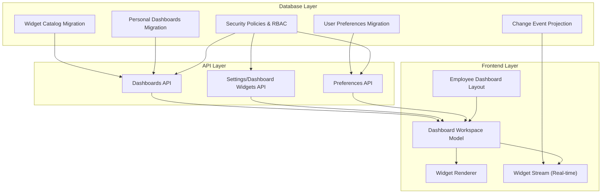

**Diagram sources**
- [20260718170000_add_dashboard_widget_catalog.sql](file://apps/hr-suite/supabase/migrations/20260718170000_add_dashboard_widget_catalog.sql)
- [20260718171000_relax_dashboard_widget_read_scope.sql](file://apps/hr-suite/supabase/migrations/20260718171000_relax_dashboard_widget_read_scope.sql)
- [20260718172000_expand_personal_dashboard_widget_types.sql](file://apps/hr-suite/supabase/migrations/20260718172000_expand_personal_dashboard_widget_types.sql)
- [20260718172051_grant_dashboard_widget_admin_permissions.sql](file://apps/hr-suite/supabase/migrations/20260718172051_grant_dashboard_widget_admin_permissions.sql)
- [20260718173000_tune_dashboard_widget_policies.sql](file://apps/hr-suite/supabase/migrations/20260718173000_tune_dashboard_widget_policies.sql)
- [20260718120000_add_hr_change_event_projection.sql](file://apps/hr-suite/supabase/migrations/20260718120000_add_hr_change_event_projection.sql)
- [dashboard-workspace-model.ts](file://apps/hr-suite/components/dashboard/dashboard-workspace-model.ts)
- [dashboard-workspace.tsx](file://apps/hr-suite/components/dashboard/dashboard-workspace.tsx)
- [dashboard-widget-stream.tsx](file://apps/hr-suite/components/dashboard/dashboard-widget-stream.tsx)
- [widget-renderer.tsx](file://apps/hr-suite/components/dashboard/widget-renderer.tsx)
- [employee-dashboard-layout.tsx](file://apps/hr-suite/components/employees/employee-dashboard-layout.tsx)
- [route.ts (dashboards)](file://apps/hr-suite/app/api/dashboards/route.ts)
- [route.ts (settings/dashboard-widgets)](file://apps/hr-suite/app/api/settings/dashboard-widgets/route.ts)
- [route.ts (preferences/employee-dashboard)](file://apps/hr-suite/app/api/preferences/employee-dashboard/route.ts)

**Section sources**
- [20260718170000_add_dashboard_widget_catalog.sql](file://apps/hr-suite/supabase/migrations/20260718170000_add_dashboard_widget_catalog.sql)
- [20260718171000_relax_dashboard_widget_read_scope.sql](file://apps/hr-suite/supabase/migrations/20260718171000_relax_dashboard_widget_read_scope.sql)
- [20260718172000_expand_personal_dashboard_widget_types.sql](file://apps/hr-suite/supabase/migrations/20260718172000_expand_personal_dashboard_widget_types.sql)
- [20260718172051_grant_dashboard_widget_admin_permissions.sql](file://apps/hr-suite/supabase/migrations/20260718172051_grant_dashboard_widget_admin_permissions.sql)
- [20260718173000_tune_dashboard_widget_policies.sql](file://apps/hr-suite/supabase/migrations/20260718173000_tune_dashboard_widget_policies.sql)
- [20260718120000_add_hr_change_event_projection.sql](file://apps/hr-suite/supabase/migrations/20260718120000_add_hr_change_event_projection.sql)
- [dashboard-workspace-model.ts](file://apps/hr-suite/components/dashboard/dashboard-workspace-model.ts)
- [dashboard-workspace.tsx](file://apps/hr-suite/components/dashboard/dashboard-workspace.tsx)
- [dashboard-widget-stream.tsx](file://apps/hr-suite/components/dashboard/dashboard-widget-stream.tsx)
- [widget-renderer.tsx](file://apps/hr-suite/components/dashboard/widget-renderer.tsx)
- [employee-dashboard-layout.tsx](file://apps/hr-suite/components/employees/employee-dashboard-layout.tsx)
- [route.ts (dashboards)](file://apps/hr-suite/app/api/dashboards/route.ts)
- [route.ts (settings/dashboard-widgets)](file://apps/hr-suite/app/api/settings/dashboard-widgets/route.ts)
- [route.ts (preferences/employee-dashboard)](file://apps/hr-suite/app/api/preferences/employee-dashboard/route.ts)

## Core Components
- Widget Catalog: Defines reusable widget types, metadata, and configuration schemas used across dashboards.
- Personal Dashboards: Stores per-user dashboard layouts, including widget placement, sizing, and visibility.
- User Preferences: Captures user-specific widget behavior and display preferences (e.g., date/time formats, week numbering).
- Real-time Updates: Change event projection feeds live updates to widgets without full page reloads.
- Security Policies: Row-level security and role-based access control ensure tenant isolation and admin-only operations.

Key responsibilities:
- Widget catalog serves as the source of truth for available widgets and their schemas.
- Personal dashboards serialize layout state into a structured format consumed by the frontend workspace.
- User preferences are scoped to tenants and users, enabling personalized experiences while maintaining isolation.
- Real-time updates leverage change events to refresh widget data efficiently.

**Section sources**
- [20260718170000_add_dashboard_widget_catalog.sql](file://apps/hr-suite/supabase/migrations/20260718170000_add_dashboard_widget_catalog.sql)
- [20260718172000_expand_personal_dashboard_widget_types.sql](file://apps/hr-suite/supabase/migrations/20260718172000_expand_personal_dashboard_widget_types.sql)
- [20260718170000_add_user_preferences.sql](file://apps/hr-suite/supabase/migrations/20260718170000_add_user_preferences.sql)
- [20260718120000_add_hr_change_event_projection.sql](file://apps/hr-suite/supabase/migrations/20260718120000_add_hr_change_event_projection.sql)
- [20260718173000_tune_dashboard_widget_policies.sql](file://apps/hr-suite/supabase/migrations/20260718173000_tune_dashboard_widget_policies.sql)

## Architecture Overview
The dashboard engine integrates database models, API endpoints, and frontend components to deliver a dynamic, secure, and performant experience.

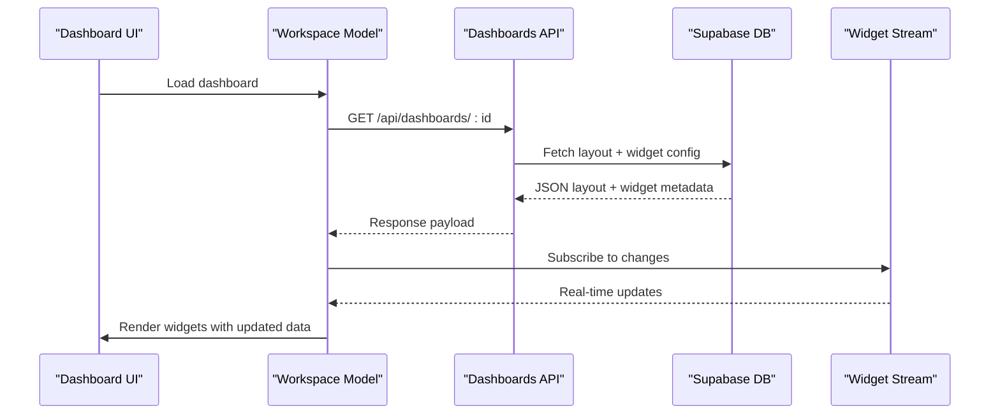

**Diagram sources**
- [dashboard-workspace-model.ts](file://apps/hr-suite/components/dashboard/dashboard-workspace-model.ts)
- [dashboard-widget-stream.tsx](file://apps/hr-suite/components/dashboard/dashboard-widget-stream.tsx)
- [route.ts (dashboards)](file://apps/hr-suite/app/api/dashboards/route.ts)
- [route.ts (dashboards/[dashboardId])](file://apps/hr-suite/app/api/dashboards/[dashboardId]/route.ts)

## Detailed Component Analysis

### Widget Catalog System
The widget catalog defines reusable components with metadata and configuration schemas. It supports:
- Widget type enumeration and versioning
- Schema validation for widget configuration
- Tenant-scoped availability and visibility rules

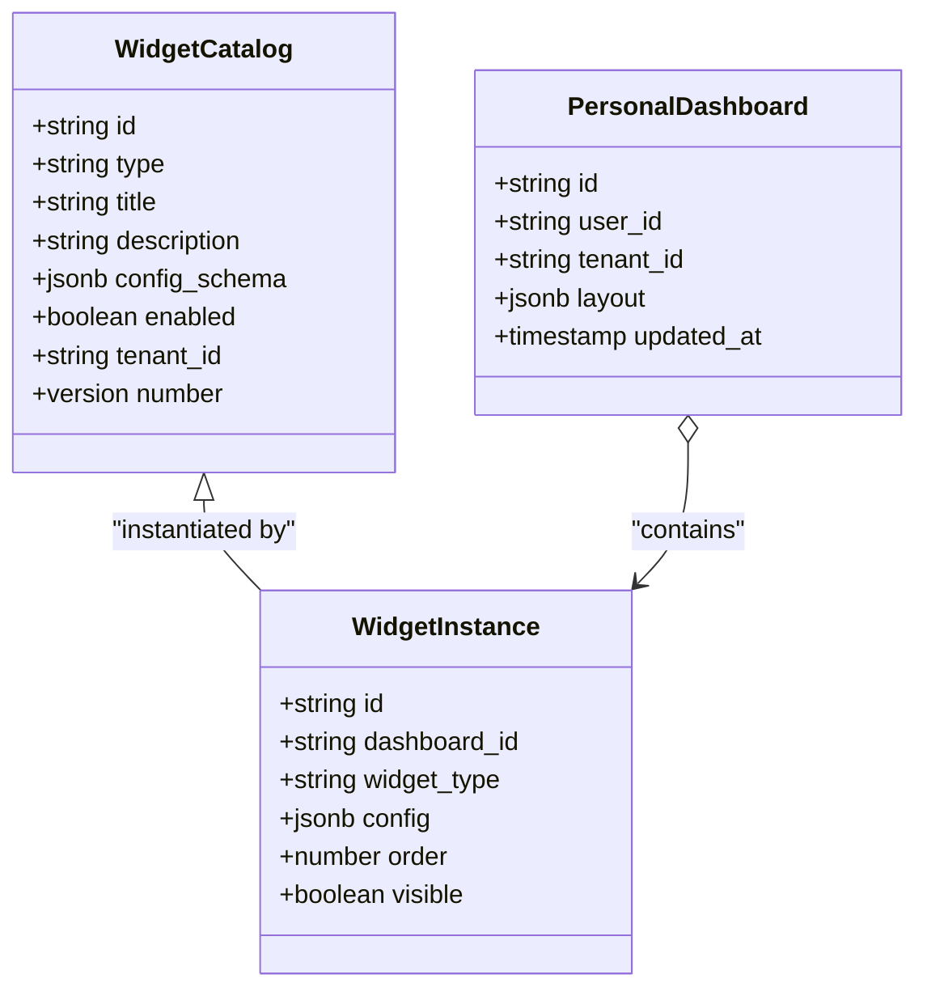

**Diagram sources**
- [20260718170000_add_dashboard_widget_catalog.sql](file://apps/hr-suite/supabase/migrations/20260718170000_add_dashboard_widget_catalog.sql)
- [20260718172000_expand_personal_dashboard_widget_types.sql](file://apps/hr-suite/supabase/migrations/20260718172000_expand_personal_dashboard_widget_types.sql)

**Section sources**
- [20260718170000_add_dashboard_widget_catalog.sql](file://apps/hr-suite/supabase/migrations/20260718170000_add_dashboard_widget_catalog.sql)
- [20260718172000_expand_personal_dashboard_widget_types.sql](file://apps/hr-suite/supabase/migrations/20260718172000_expand_personal_dashboard_widget_types.sql)

### Personal Dashboard Layouts and Configurations
Personal dashboards store serialized layout structures that define widget placement, sizing, and visibility per user. The layout is typically represented as a JSON structure containing:
- Grid or flex-based positioning
- Widget instance references
- Per-widget configuration overrides

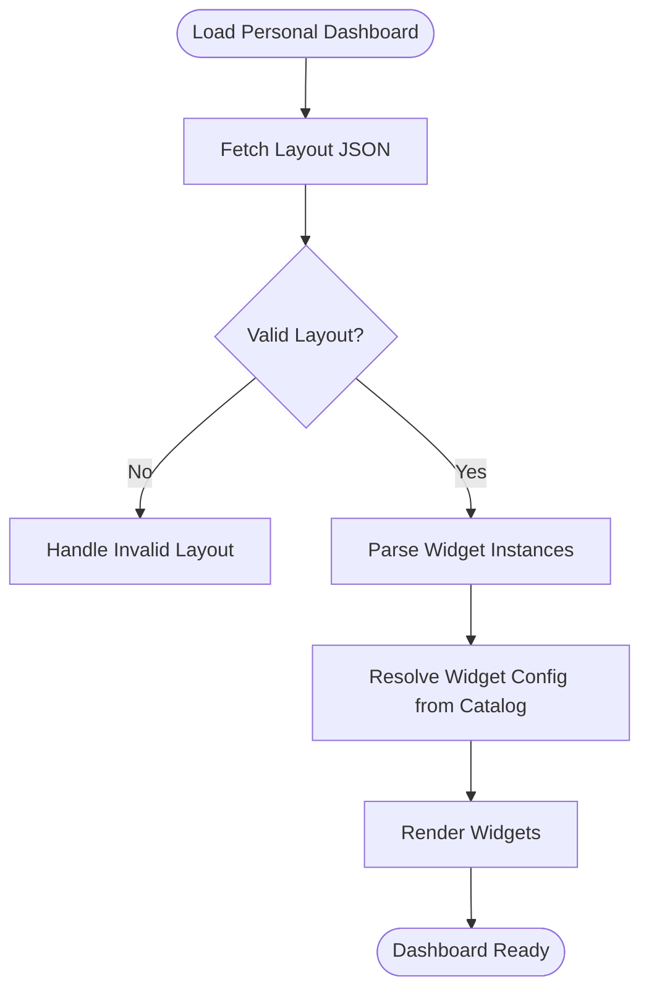

**Diagram sources**
- [employee-dashboard-layout.tsx](file://apps/hr-suite/components/employees/employee-dashboard-layout.tsx)
- [dashboard-workspace-model.ts](file://apps/hr-suite/components/dashboard/dashboard-workspace-model.ts)

**Section sources**
- [employee-dashboard-layout.tsx](file://apps/hr-suite/components/employees/employee-dashboard-layout.tsx)
- [dashboard-workspace-model.ts](file://apps/hr-suite/components/dashboard/dashboard-workspace-model.ts)

### User-Specific Widget Preferences
User preferences capture individualized settings such as date/time formats, week numbering, and widget-specific toggles. These preferences are scoped to tenants and users to ensure isolation and personalization.

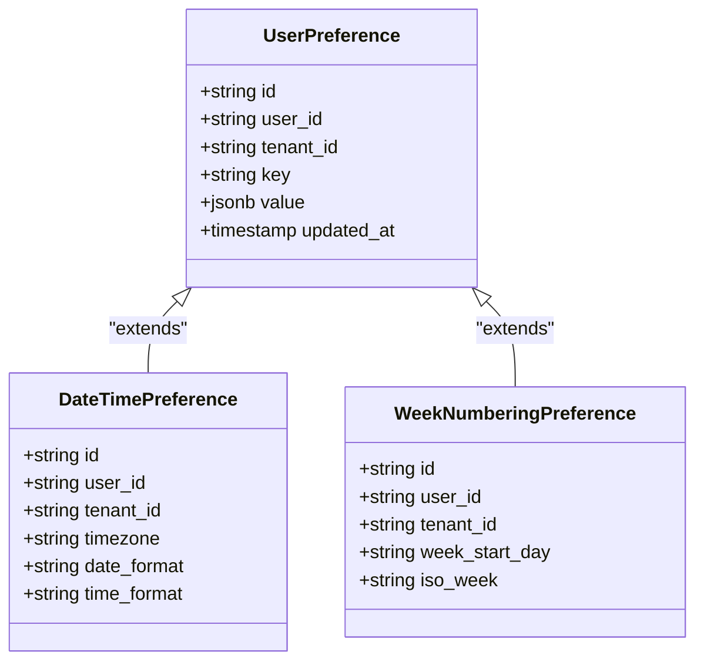

**Diagram sources**
- [20260718170000_add_user_preferences.sql](file://apps/hr-suite/supabase/migrations/20260718170000_add_user_preferences.sql)
- [20260718180354_add_date_time_user_preferences.sql](file://apps/hr-suite/supabase/migrations/20260718180354_add_date_time_user_preferences.sql)
- [20260718194000_add_week_numbering_user_preference.sql](file://apps/hr-suite/supabase/migrations/20260718194000_add_week_numbering_user_preference.sql)

**Section sources**
- [20260718170000_add_user_preferences.sql](file://apps/hr-suite/supabase/migrations/20260718170000_add_user_preferences.sql)
- [20260718180354_add_date_time_user_preferences.sql](file://apps/hr-suite/supabase/migrations/20260718180354_add_date_time_user_preferences.sql)
- [20260718194000_add_week_numbering_user_preference.sql](file://apps/hr-suite/supabase/migrations/20260718194000_add_week_numbering_user_preference.sql)

### Widget Type System
The widget type system enables extensibility by defining new widget categories and behaviors. Types are validated against schemas stored in the catalog, ensuring consistent configuration across instances.

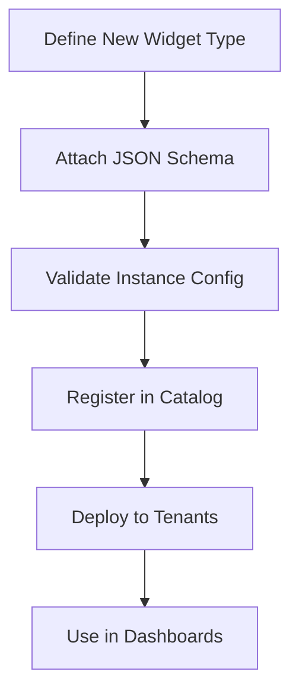

**Diagram sources**
- [20260718170000_add_dashboard_widget_catalog.sql](file://apps/hr-suite/supabase/migrations/20260718170000_add_dashboard_widget_catalog.sql)
- [20260718172000_expand_personal_dashboard_widget_types.sql](file://apps/hr-suite/supabase/migrations/20260718172000_expand_personal_dashboard_widget_types.sql)

**Section sources**
- [20260718170000_add_dashboard_widget_catalog.sql](file://apps/hr-suite/supabase/migrations/20260718170000_add_dashboard_widget_catalog.sql)
- [20260718172000_expand_personal_dashboard_widget_types.sql](file://apps/hr-suite/supabase/migrations/20260718172000_expand_personal_dashboard_widget_types.sql)

### Layout Serialization
Layout serialization converts visual dashboard arrangements into structured JSON for persistence and rehydration. The process includes:
- Capturing widget positions and sizes
- Serializing per-widget configuration overrides
- Validating against schema constraints

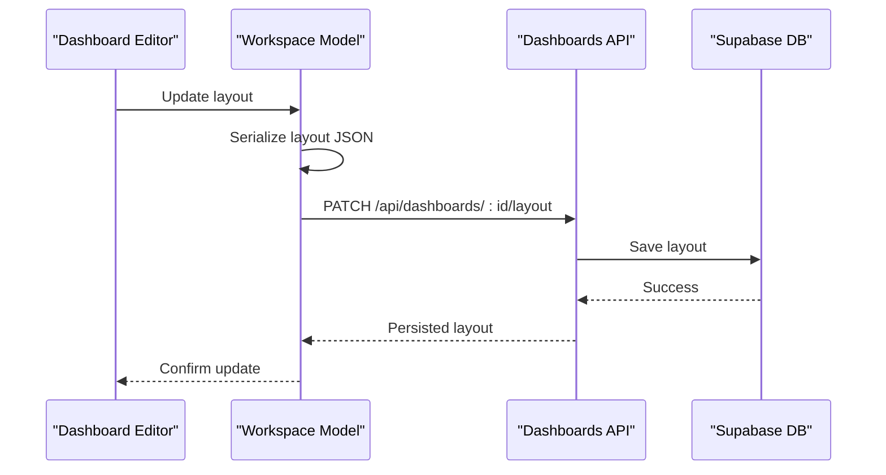

**Diagram sources**
- [dashboard-workspace-model.ts](file://apps/hr-suite/components/dashboard/dashboard-workspace-model.ts)
- [route.ts (dashboards/[dashboardId])](file://apps/hr-suite/app/api/dashboards/[dashboardId]/route.ts)

**Section sources**
- [dashboard-workspace-model.ts](file://apps/hr-suite/components/dashboard/dashboard-workspace-model.ts)
- [route.ts (dashboards/[dashboardId])](file://apps/hr-suite/app/api/dashboards/[dashboardId]/route.ts)

### Real-Time Update Mechanisms
Real-time updates are driven by change event projections that push incremental updates to widgets without full page reloads. This ensures responsive dashboards with minimal bandwidth usage.

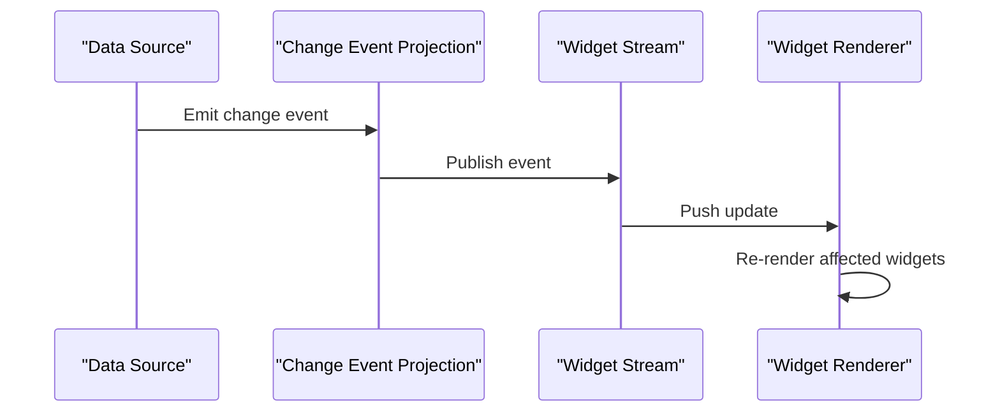

**Diagram sources**
- [20260718120000_add_hr_change_event_projection.sql](file://apps/hr-suite/supabase/migrations/20260718120000_add_hr_change_event_projection.sql)
- [dashboard-widget-stream.tsx](file://apps/hr-suite/components/dashboard/dashboard-widget-stream.tsx)
- [widget-renderer.tsx](file://apps/hr-suite/components/dashboard/widget-renderer.tsx)

**Section sources**
- [20260718120000_add_hr_change_event_projection.sql](file://apps/hr-suite/supabase/migrations/20260718120000_add_hr_change_event_projection.sql)
- [dashboard-widget-stream.tsx](file://apps/hr-suite/components/dashboard/dashboard-widget-stream.tsx)
- [widget-renderer.tsx](file://apps/hr-suite/components/dashboard/widget-renderer.tsx)

### Relationship Between Widgets, Dashboards, and User Preferences
Widgets are instantiated within dashboards and can be customized via user preferences. The relationships ensure:
- Widgets belong to specific dashboards
- Dashboards are owned by users within tenants
- Preferences override default widget behavior per user

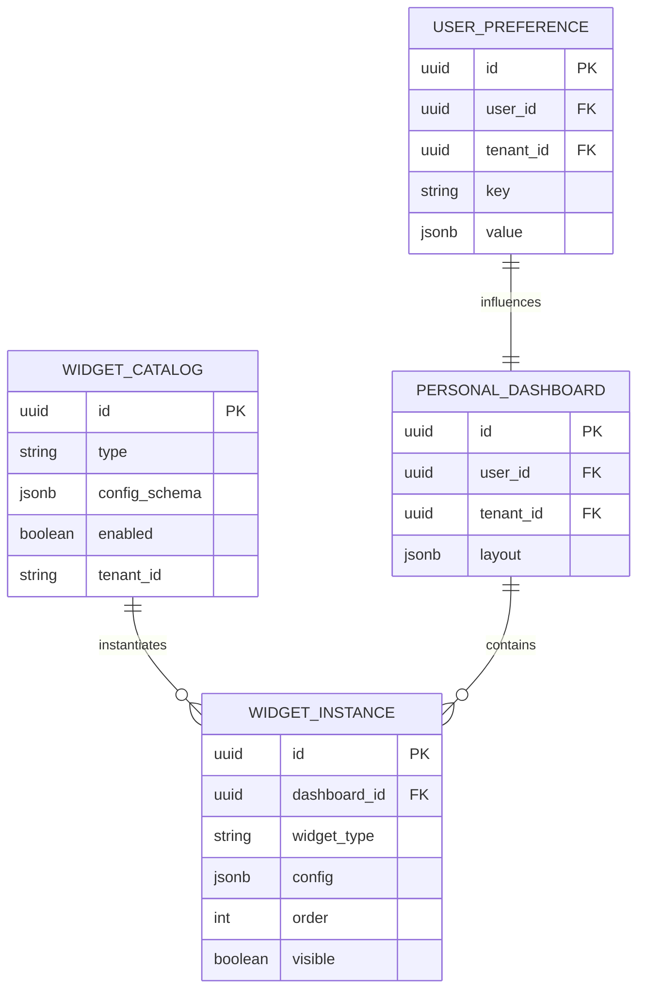

**Diagram sources**
- [20260718170000_add_dashboard_widget_catalog.sql](file://apps/hr-suite/supabase/migrations/20260718170000_add_dashboard_widget_catalog.sql)
- [20260718172000_expand_personal_dashboard_widget_types.sql](file://apps/hr-suite/supabase/migrations/20260718172000_expand_personal_dashboard_widget_types.sql)
- [20260718170000_add_user_preferences.sql](file://apps/hr-suite/supabase/migrations/20260718170000_add_user_preferences.sql)

**Section sources**
- [20260718170000_add_dashboard_widget_catalog.sql](file://apps/hr-suite/supabase/migrations/20260718170000_add_dashboard_widget_catalog.sql)
- [20260718172000_expand_personal_dashboard_widget_types.sql](file://apps/hr-suite/supabase/migrations/20260718172000_expand_personal_dashboard_widget_types.sql)
- [20260718170000_add_user_preferences.sql](file://apps/hr-suite/supabase/migrations/20260718170000_add_user_preferences.sql)

### Security Policies for Widget Access, Admin Permissions, and Tenant Isolation
Security is enforced through row-level policies and role-based access control:
- Widget catalog reads are relaxed for broader access while writes remain restricted
- Admin permissions allow management of widget catalogs and dashboard settings
- Tenant isolation ensures data separation across organizations

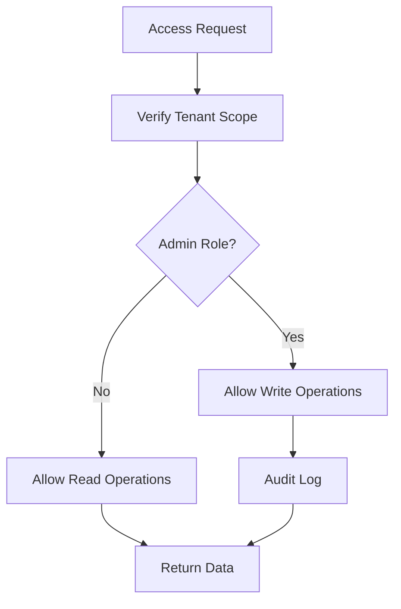

**Diagram sources**
- [20260718171000_relax_dashboard_widget_read_scope.sql](file://apps/hr-suite/supabase/migrations/20260718171000_relax_dashboard_widget_read_scope.sql)
- [20260718172051_grant_dashboard_widget_admin_permissions.sql](file://apps/hr-suite/supabase/migrations/20260718172051_grant_dashboard_widget_admin_permissions.sql)
- [20260718173000_tune_dashboard_widget_policies.sql](file://apps/hr-suite/supabase/migrations/20260718173000_tune_dashboard_widget_policies.sql)

**Section sources**
- [20260718171000_relax_dashboard_widget_read_scope.sql](file://apps/hr-suite/supabase/migrations/20260718171000_relax_dashboard_widget_read_scope.sql)
- [20260718172051_grant_dashboard_widget_admin_permissions.sql](file://apps/hr-suite/supabase/migrations/20260718172051_grant_dashboard_widget_admin_permissions.sql)
- [20260718173000_tune_dashboard_widget_policies.sql](file://apps/hr-suite/supabase/migrations/20260718173000_tune_dashboard_widget_policies.sql)

## Dependency Analysis
The dashboard engine dependencies span database migrations, API routes, and frontend components. Key relationships include:
- Widget catalog migrations enable API endpoints for widget management
- Personal dashboard migrations support layout persistence via API routes
- User preference migrations integrate with preference APIs
- Change event projections feed real-time updates to the frontend stream

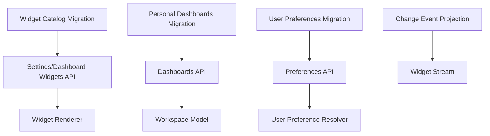

**Diagram sources**
- [20260718170000_add_dashboard_widget_catalog.sql](file://apps/hr-suite/supabase/migrations/20260718170000_add_dashboard_widget_catalog.sql)
- [20260718172000_expand_personal_dashboard_widget_types.sql](file://apps/hr-suite/supabase/migrations/20260718172000_expand_personal_dashboard_widget_types.sql)
- [20260718170000_add_user_preferences.sql](file://apps/hr-suite/supabase/migrations/20260718170000_add_user_preferences.sql)
- [20260718120000_add_hr_change_event_projection.sql](file://apps/hr-suite/supabase/migrations/20260718120000_add_hr_change_event_projection.sql)
- [route.ts (settings/dashboard-widgets)](file://apps/hr-suite/app/api/settings/dashboard-widgets/route.ts)
- [route.ts (dashboards)](file://apps/hr-suite/app/api/dashboards/route.ts)
- [route.ts (preferences/employee-dashboard)](file://apps/hr-suite/app/api/preferences/employee-dashboard/route.ts)
- [dashboard-widget-stream.tsx](file://apps/hr-suite/components/dashboard/dashboard-widget-stream.tsx)
- [widget-renderer.tsx](file://apps/hr-suite/components/dashboard/widget-renderer.tsx)
- [dashboard-workspace-model.ts](file://apps/hr-suite/components/dashboard/dashboard-workspace-model.ts)

**Section sources**
- [20260718170000_add_dashboard_widget_catalog.sql](file://apps/hr-suite/supabase/migrations/20260718170000_add_dashboard_widget_catalog.sql)
- [20260718172000_expand_personal_dashboard_widget_types.sql](file://apps/hr-suite/supabase/migrations/20260718172000_expand_personal_dashboard_widget_types.sql)
- [20260718170000_add_user_preferences.sql](file://apps/hr-suite/supabase/migrations/20260718170000_add_user_preferences.sql)
- [20260718120000_add_hr_change_event_projection.sql](file://apps/hr-suite/supabase/migrations/20260718120000_add_hr_change_event_projection.sql)
- [route.ts (settings/dashboard-widgets)](file://apps/hr-suite/app/api/settings/dashboard-widgets/route.ts)
- [route.ts (dashboards)](file://apps/hr-suite/app/api/dashboards/route.ts)
- [route.ts (preferences/employee-dashboard)](file://apps/hr-suite/app/api/preferences/employee-dashboard/route.ts)
- [dashboard-widget-stream.tsx](file://apps/hr-suite/components/dashboard/dashboard-widget-stream.tsx)
- [widget-renderer.tsx](file://apps/hr-suite/components/dashboard/widget-renderer.tsx)
- [dashboard-workspace-model.ts](file://apps/hr-suite/components/dashboard/dashboard-workspace-model.ts)

## Performance Considerations
- Widget rendering optimization: Lazy loading and skeleton placeholders improve perceived performance.
- Data streaming efficiency: Incremental updates reduce bandwidth and avoid full re-renders.
- Caching strategies: Cache widget configurations and frequently accessed data at the API layer.
- Indexing: Database indexes on foreign keys and tenant scopes enhance query performance.
- Concurrency control: Optimistic updates with rollback handling prevent UI inconsistencies.

[No sources needed since this section provides general guidance]

## Troubleshooting Guide
Common issues and resolutions:
- Widget not rendering: Verify widget type exists in catalog and configuration schema matches.
- Layout corruption: Validate layout JSON against schema constraints before saving.
- Permission errors: Check tenant scope and admin roles for write operations.
- Real-time updates not appearing: Ensure change event projection is active and stream subscription is established.

**Section sources**
- [20260718170000_add_dashboard_widget_catalog.sql](file://apps/hr-suite/supabase/migrations/20260718170000_add_dashboard_widget_catalog.sql)
- [20260718173000_tune_dashboard_widget_policies.sql](file://apps/hr-suite/supabase/migrations/20260718173000_tune_dashboard_widget_policies.sql)
- [20260718120000_add_hr_change_event_projection.sql](file://apps/hr-suite/supabase/migrations/20260718120000_add_hr_change_event_projection.sql)

## Conclusion
LiquidHR’s dashboard engine provides a robust, scalable foundation for building personalized, real-time dashboards. The widget catalog system enables reusable components, while personal dashboards and user preferences offer customization at scale. Security policies ensure tenant isolation and proper access control, and performance optimizations deliver a smooth user experience.

[No sources needed since this section summarizes without analyzing specific files]

## Appendices
- Example widget definition schemas: Refer to migration files for schema definitions.
- Layout structures: Inspect frontend components for serialization patterns.
- Preference configurations: Review user preference migrations for supported keys and values.

[No sources needed since this section provides general guidance]