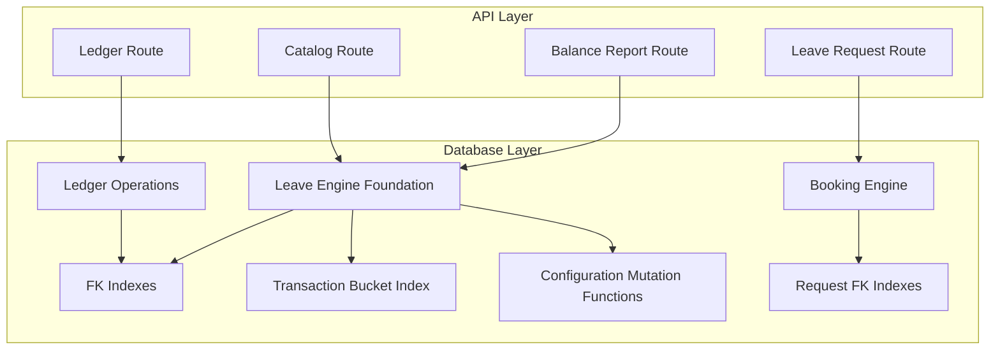
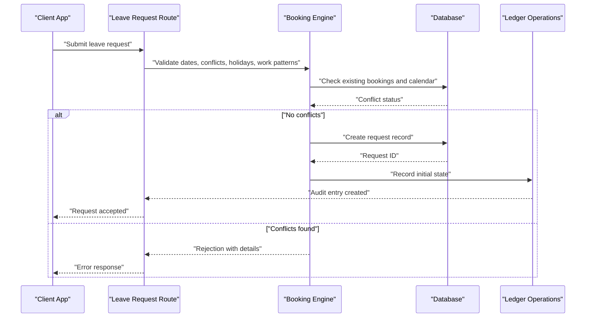
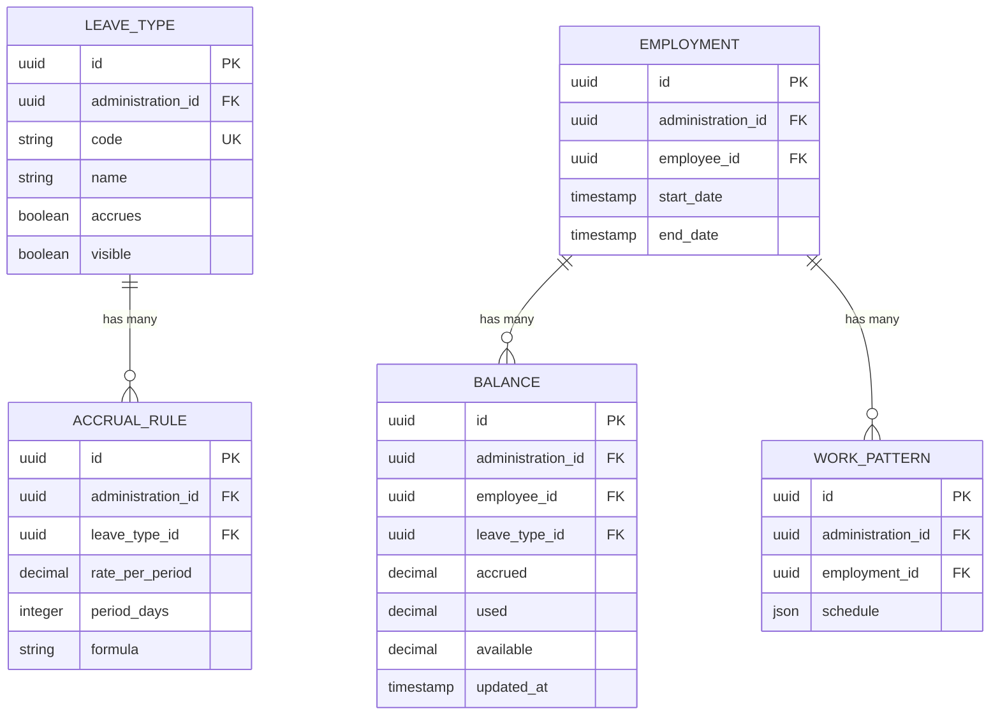
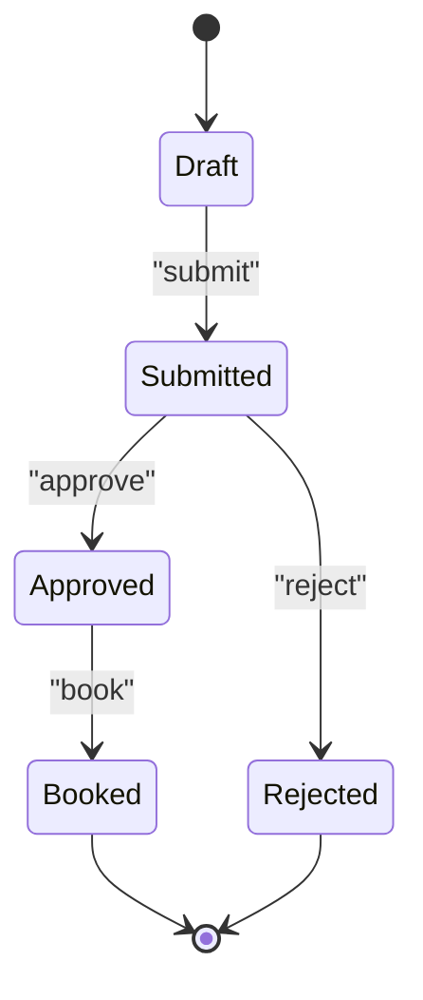
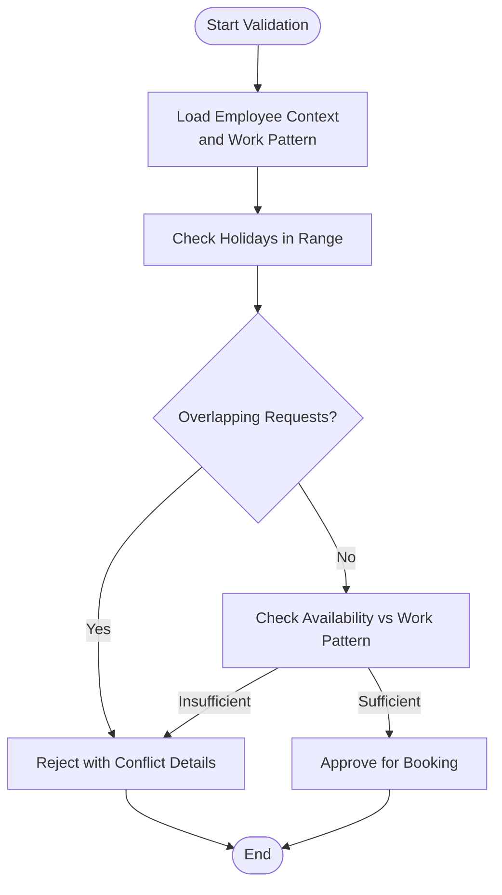
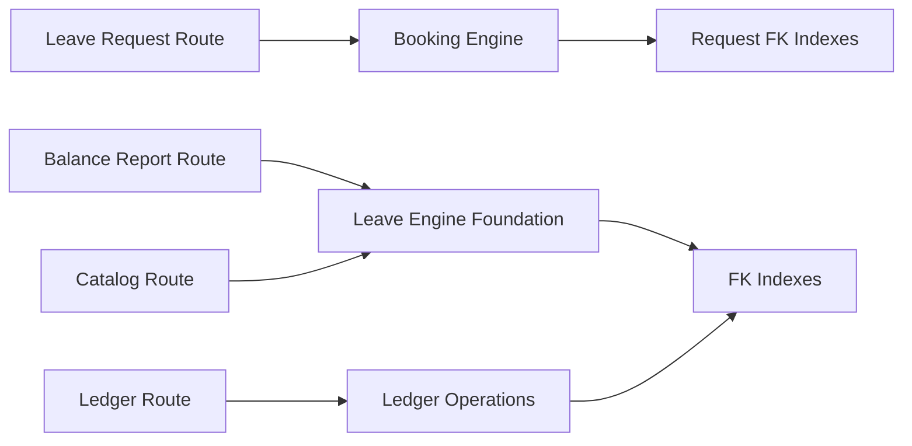

# Leave Management Tables

<cite>
**Referenced Files in This Document**
- [20260722142551_add_leave_engine_foundation.sql](file://apps/hr-suite/supabase/migrations/20260722142551_add_leave_engine_foundation.sql)
- [20260722144232_add_leave_engine_fk_indexes.sql](file://apps/hr-suite/supabase/migrations/20260722144232_add_leave_engine_fk_indexes.sql)
- [20260722144344_add_leave_transaction_bucket_fk_index.sql](file://apps/hr-suite/supabase/migrations/20260722144344_add_leave_transaction_bucket_fk_index.sql)
- [20260722151920_add_leave_configuration_mutation_functions.sql](file://apps/hr-suite/supabase/migrations/20260722151920_add_leave_configuration_mutation_functions.sql)
- [20260722190000_add_leave_request_booking_engine.sql](file://apps/hr-suite/supabase/migrations/20260722190000_add_leave_request_booking_engine.sql)
- [20260722191500_add_leave_request_fk_indexes.sql](file://apps/hr-suite/supabase/migrations/20260722191500_add_leave_request_fk_indexes.sql)
- [20260722192000_add_leave_ledger_operations.sql](file://apps/hr-suite/supabase/migrations/20260722192000_add_leave_ledger_operations.sql)
- [leave_engine_foundation.sql](file://apps/hr-suite/supabase/tests/leave_engine_foundation.sql)
- [route.ts](file://apps/hr-suite/app/api/leave/request/route.ts)
- [route.ts](file://apps/hr-suite/app/api/leave/balance-report/route.ts)
- [route.ts](file://apps/hr-suite/app/api/leave/catalog/route.ts)
- [route.ts](file://apps/hr-suite/app/api/leave/ledger/route.ts)
</cite>

## Table of Contents
1. [Introduction](#introduction)
2. [Project Structure](#project-structure)
3. [Core Components](#core-components)
4. [Architecture Overview](#architecture-overview)
5. [Detailed Component Analysis](#detailed-component-analysis)
6. [Dependency Analysis](#dependency-analysis)
7. [Performance Considerations](#performance-considerations)
8. [Troubleshooting Guide](#troubleshooting-guide)
9. [Conclusion](#conclusion)
10. [Appendices](#appendices)

## Introduction
This document provides comprehensive data model documentation for LiquidHR’s leave management system. It focuses on the leave engine foundation, including leave types, accrual rules, and balance calculations; the leave request workflow with approval states; the booking engine for conflict detection; and ledger operations for audit trails. It also explains the transaction bucket system for batch processing, configuration mutation functions for rule updates, and foreign key indexes for query optimization. Examples are provided for leave type configurations, accrual rule definitions, and request lifecycle states. The document addresses complex business logic such as holiday handling, work pattern integration, and multi-tenant data isolation, and concludes with performance considerations for large-scale leave calculations and real-time balance updates.

## Project Structure
The leave management feature spans database migrations, API routes, and UI components within the HR Suite application:
- Database schema and behavior are defined through Supabase migrations under apps/hr-suite/supabase/migrations.
- API endpoints for leave requests, balances, catalog, and ledger live under apps/hr-suite/app/api/leave.
- UI components for leave configuration and editing reside under apps/hr-suite/components/leave.

**Diagram sources**
- [20260722142551_add_leave_engine_foundation.sql](file://apps/hr-suite/supabase/migrations/20260722142551_add_leave_engine_foundation.sql)
- [20260722144232_add_leave_engine_fk_indexes.sql](file://apps/hr-suite/supabase/migrations/20260722144232_add_leave_engine_fk_indexes.sql)
- [20260722144344_add_leave_transaction_bucket_fk_index.sql](file://apps/hr-suite/supabase/migrations/20260722144344_add_leave_transaction_bucket_fk_index.sql)
- [20260722151920_add_leave_configuration_mutation_functions.sql](file://apps/hr-suite/supabase/migrations/20260722151920_add_leave_configuration_mutation_functions.sql)
- [20260722190000_add_leave_request_booking_engine.sql](file://apps/hr-suite/supabase/migrations/20260722190000_add_leave_request_booking_engine.sql)
- [20260722191500_add_leave_request_fk_indexes.sql](file://apps/hr-suite/supabase/migrations/20260722191500_add_leave_request_fk_indexes.sql)
- [20260722192000_add_leave_ledger_operations.sql](file://apps/hr-suite/supabase/migrations/20260722192000_add_leave_ledger_operations.sql)

**Section sources**
- [20260722142551_add_leave_engine_foundation.sql](file://apps/hr-suite/supabase/migrations/20260722142551_add_leave_engine_foundation.sql)
- [20260722144232_add_leave_engine_fk_indexes.sql](file://apps/hr-suite/supabase/migrations/20260722144232_add_leave_engine_fk_indexes.sql)
- [20260722144344_add_leave_transaction_bucket_fk_index.sql](file://apps/hr-suite/supabase/migrations/20260722144344_add_leave_transaction_bucket_fk_index.sql)
- [20260722151920_add_leave_configuration_mutation_functions.sql](file://apps/hr-suite/supabase/migrations/20260722151920_add_leave_configuration_mutation_functions.sql)
- [20260722190000_add_leave_request_booking_engine.sql](file://apps/hr-suite/supabase/migrations/20260722190000_add_leave_request_booking_engine.sql)
- [20260722191500_add_leave_request_fk_indexes.sql](file://apps/hr-suite/supabase/migrations/20260722191500_add_leave_request_fk_indexes.sql)
- [20260722192000_add_leave_ledger_operations.sql](file://apps/hr-suite/supabase/migrations/20260722192000_add_leave_ledger_operations.sql)

## Core Components
- Leave Types: Define categories of leave (e.g., vacation, sick, parental) with attributes that control accrual eligibility, visibility, and reporting.
- Accrual Rules: Specify how leave entitlements accumulate over time based on employment tenure, work patterns, and policy parameters.
- Balance Calculations: Compute current and projected balances by aggregating accruals, bookings, and adjustments per employee and leave type.
- Leave Requests: Capture employee intent to take leave, including date ranges, type, and reason, progressing through an approval workflow.
- Booking Engine: Validates conflicts against existing bookings, holidays, and work patterns before committing a request.
- Ledger Operations: Immutable audit trail entries recording every change to balances and bookings for compliance and reconciliation.
- Transaction Buckets: Batch containers grouping related transactions to support efficient processing and rollback semantics.
- Configuration Mutations: Safe functions to update leave types, accrual rules, and policies without manual schema changes.
- FK Indexes: Optimized indexes on foreign keys to accelerate queries across employees, employments, leave types, and requests.

**Section sources**
- [20260722142551_add_leave_engine_foundation.sql](file://apps/hr-suite/supabase/migrations/20260722142551_add_leave_engine_foundation.sql)
- [20260722190000_add_leave_request_booking_engine.sql](file://apps/hr-suite/supabase/migrations/20260722190000_add_leave_request_booking_engine.sql)
- [20260722192000_add_leave_ledger_operations.sql](file://apps/hr-suite/supabase/migrations/20260722192000_add_leave_ledger_operations.sql)
- [20260722151920_add_leave_configuration_mutation_functions.sql](file://apps/hr-suite/supabase/migrations/20260722151920_add_leave_configuration_mutation_functions.sql)

## Architecture Overview
The leave management architecture integrates API routes with database-level logic to ensure consistency, performance, and auditability.

**Diagram sources**
- [route.ts](file://apps/hr-suite/app/api/leave/request/route.ts)
- [20260722190000_add_leave_request_booking_engine.sql](file://apps/hr-suite/supabase/migrations/20260722190000_add_leave_request_booking_engine.sql)
- [20260722192000_add_leave_ledger_operations.sql](file://apps/hr-suite/supabase/migrations/20260722192000_add_leave_ledger_operations.sql)

## Detailed Component Analysis

### Leave Engine Foundation
The foundation establishes core tables for leave types, accrual rules, and balances. It includes multi-tenant scoping via administration identifiers and enforces referential integrity.

Key aspects:
- Leave types define category metadata and policy flags.
- Accrual rules specify accumulation logic tied to employment periods and work patterns.
- Balances aggregate accruals and deductions per employee and leave type.
- Multi-tenancy is enforced using administration IDs to isolate data across tenants.

**Diagram sources**
- [20260722142551_add_leave_engine_foundation.sql](file://apps/hr-suite/supabase/migrations/20260722142551_add_leave_engine_foundation.sql)

**Section sources**
- [20260722142551_add_leave_engine_foundation.sql](file://apps/hr-suite/supabase/migrations/20260722142551_add_leave_engine_foundation.sql)

### Foreign Key Indexes for Query Optimization
Indexes on foreign keys improve join performance across employees, employments, leave types, and requests. They reduce latency for balance reports and request validations.

Highlights:
- Indexes on administration_id for tenant-scoped queries.
- Indexes on employee_id and employment_id for rapid lookups.
- Indexes on leave_type_id to optimize accrual and balance aggregation.

**Section sources**
- [20260722144232_add_leave_engine_fk_indexes.sql](file://apps/hr-suite/supabase/migrations/20260722144232_add_leave_engine_fk_indexes.sql)

### Transaction Bucket System for Batch Processing
Transaction buckets group related ledger entries and booking changes to enable atomic batch operations. This supports high-throughput scenarios where multiple leave events must be processed together.

Benefits:
- Atomicity: All entries succeed or fail as a unit.
- Performance: Bulk inserts reduce overhead.
- Auditability: Clear grouping for reconciliation.

**Section sources**
- [20260722144344_add_leave_transaction_bucket_fk_index.sql](file://apps/hr-suite/supabase/migrations/20260722144344_add_leave_transaction_bucket_fk_index.sql)

### Configuration Mutation Functions for Rule Updates
Safe mutation functions allow administrators to update leave types, accrual rules, and policies without direct SQL manipulation. These functions enforce validation and maintain referential integrity.

Capabilities:
- Create/update/delete leave types with validation.
- Adjust accrual rates and formulas safely.
- Enforce tenant isolation during mutations.

**Section sources**
- [20260722151920_add_leave_configuration_mutation_functions.sql](file://apps/hr-suite/supabase/migrations/20260722151920_add_leave_configuration_mutation_functions.sql)

### Leave Request Workflow and Approval States
Requests progress through states such as draft, submitted, approved, rejected, and booked. Each transition is validated and recorded in the ledger.

Workflow highlights:
- Draft: Initial creation by employee.
- Submitted: Sent for approval.
- Approved: Manager authorization granted.
- Rejected: Denied with reason.
- Booked: Confirmed and deducted from balance.

**Section sources**
- [20260722190000_add_leave_request_booking_engine.sql](file://apps/hr-suite/supabase/migrations/20260722190000_add_leave_request_booking_engine.sql)

### Booking Engine for Conflict Detection
The booking engine validates new requests against existing bookings, holidays, and work patterns to prevent overlaps and ensure compliance.

Validation steps:
- Check overlapping requests for the same employee and leave type.
- Exclude non-working days and public holidays.
- Respect work pattern schedules (e.g., part-time availability).

**Diagram sources**
- [20260722190000_add_leave_request_booking_engine.sql](file://apps/hr-suite/supabase/migrations/20260722190000_add_leave_request_booking_engine.sql)

**Section sources**
- [20260722190000_add_leave_request_booking_engine.sql](file://apps/hr-suite/supabase/migrations/20260722190000_add_leave_request_booking_engine.sql)

### Ledger Operations for Audit Trails
Ledger operations create immutable records for every change to balances and bookings. This ensures full traceability and supports compliance audits.

Operations include:
- Accrual postings when entitlements increase.
- Deductions when requests are booked.
- Adjustments due to corrections or policy changes.

**Section sources**
- [20260722192000_add_leave_ledger_operations.sql](file://apps/hr-suite/supabase/migrations/20260722192000_add_leave_ledger_operations.sql)

### FK Indexes for Request Queries
Additional indexes on request-related foreign keys optimize queries for approval workflows and reporting.

Focus areas:
- Indexes on employee_id and leave_type_id for fast filtering.
- Indexes on administration_id for tenant-scoped searches.

**Section sources**
- [20260722191500_add_leave_request_fk_indexes.sql](file://apps/hr-suite/supabase/migrations/20260722191500_add_leave_request_fk_indexes.sql)

### Complex Business Logic: Holiday Handling and Work Patterns
Holiday handling excludes non-working days from leave calculations. Work pattern integration ensures partial availability is respected, especially for part-time employees.

Considerations:
- Public holidays and company-specific holidays are excluded automatically.
- Work patterns define valid working days and hours.
- Accruals may be prorated based on work patterns.

**Section sources**
- [20260722190000_add_leave_request_booking_engine.sql](file://apps/hr-suite/supabase/migrations/20260722190000_add_leave_request_booking_engine.sql)

### Multi-Tenant Data Isolation
Multi-tenancy is enforced via administration_id on all core tables. API routes and database policies ensure data isolation between tenants.

Mechanisms:
- Row-level security policies scoped by administration_id.
- API context injection of tenant identifier.
- Migrations seed tenant-specific demo data.

**Section sources**
- [20260722142551_add_leave_engine_foundation.sql](file://apps/hr-suite/supabase/migrations/20260722142551_add_leave_engine_foundation.sql)

## Dependency Analysis
The leave system exhibits clear layering: API routes depend on database functions and tables, which are optimized by indexes. Configuration mutations provide safe updates without breaking dependencies.

**Diagram sources**
- [route.ts](file://apps/hr-suite/app/api/leave/request/route.ts)
- [route.ts](file://apps/hr-suite/app/api/balance-report/route.ts)
- [route.ts](file://apps/hr-suite/app/api/catalog/route.ts)
- [route.ts](file://apps/hr-suite/app/api/ledger/route.ts)
- [20260722142551_add_leave_engine_foundation.sql](file://apps/hr-suite/supabase/migrations/20260722142551_add_leave_engine_foundation.sql)
- [20260722144232_add_leave_engine_fk_indexes.sql](file://apps/hr-suite/supabase/migrations/20260722144232_add_leave_engine_fk_indexes.sql)
- [20260722191500_add_leave_request_fk_indexes.sql](file://apps/hr-suite/supabase/migrations/20260722191500_add_leave_request_fk_indexes.sql)
- [20260722192000_add_leave_ledger_operations.sql](file://apps/hr-suite/supabase/migrations/20260722192000_add_leave_ledger_operations.sql)

**Section sources**
- [route.ts](file://apps/hr-suite/app/api/leave/request/route.ts)
- [route.ts](file://apps/hr-suite/app/api/leave/balance-report/route.ts)
- [route.ts](file://apps/hr-suite/app/api/leave/catalog/route.ts)
- [route.ts](file://apps/hr-suite/app/api/leave/ledger/route.ts)
- [20260722142551_add_leave_engine_foundation.sql](file://apps/hr-suite/supabase/migrations/20260722142551_add_leave_engine_foundation.sql)
- [20260722144232_add_leave_engine_fk_indexes.sql](file://apps/hr-suite/supabase/migrations/20260722144232_add_leave_engine_fk_indexes.sql)
- [20260722191500_add_leave_request_fk_indexes.sql](file://apps/hr-suite/supabase/migrations/20260722191500_add_leave_request_fk_indexes.sql)
- [20260722192000_add_leave_ledger_operations.sql](file://apps/hr-suite/supabase/migrations/20260722192000_add_leave_ledger_operations.sql)

## Performance Considerations
- Use FK indexes to minimize join costs on large datasets.
- Batch process transactions via buckets to reduce write amplification.
- Cache frequently accessed catalog data (leave types, accrual rules) at the API layer when appropriate.
- Partition balances and ledger entries by administration_id and year for scalable queries.
- Avoid recalculating entire balance histories; compute deltas based on recent ledger entries.
- Optimize booking validations with targeted indexes on employee_id, leave_type_id, and date ranges.

[No sources needed since this section provides general guidance]

## Troubleshooting Guide
Common issues and resolutions:
- Conflict errors during booking: Review overlapping requests and holiday exclusions.
- Balance discrepancies: Inspect ledger entries for missing accruals or incorrect deductions.
- Tenant data leakage: Verify RLS policies and administration_id scoping in queries.
- Slow queries: Ensure FK indexes exist and consider adding composite indexes for frequent filters.

**Section sources**
- [20260722190000_add_leave_request_booking_engine.sql](file://apps/hr-suite/supabase/migrations/20260722190000_add_leave_request_booking_engine.sql)
- [20260722192000_add_leave_ledger_operations.sql](file://apps/hr-suite/supabase/migrations/20260722192000_add_leave_ledger_operations.sql)

## Conclusion
LiquidHR’s leave management system combines robust data modeling, secure configuration mutations, and efficient indexing to deliver accurate leave calculations, reliable booking validation, and comprehensive audit trails. By leveraging transaction buckets, multi-tenant isolation, and optimized queries, the system scales effectively for large organizations while maintaining clarity and compliance.

[No sources needed since this section summarizes without analyzing specific files]

## Appendices

### Example Leave Type Configuration
- Code: Unique identifier for the leave category.
- Name: Human-readable label.
- Accrues: Boolean indicating if accrual applies.
- Visible: Boolean controlling visibility in UI and reports.

**Section sources**
- [20260722142551_add_leave_engine_foundation.sql](file://apps/hr-suite/supabase/migrations/20260722142551_add_leave_engine_foundation.sql)

### Example Accrual Rule Definition
- Rate per period: Amount added per accrual period.
- Period days: Length of accrual cycle.
- Formula: Expression defining calculation logic.

**Section sources**
- [20260722142551_add_leave_engine_foundation.sql](file://apps/hr-suite/supabase/migrations/20260722142551_add_leave_engine_foundation.sql)

### Request Lifecycle States
- Draft: Created but not submitted.
- Submitted: Pending approval.
- Approved: Authorized by manager.
- Rejected: Denied with reason.
- Booked: Confirmed and deducted.

**Section sources**
- [20260722190000_add_leave_request_booking_engine.sql](file://apps/hr-suite/supabase/migrations/20260722190000_add_leave_request_booking_engine.sql)