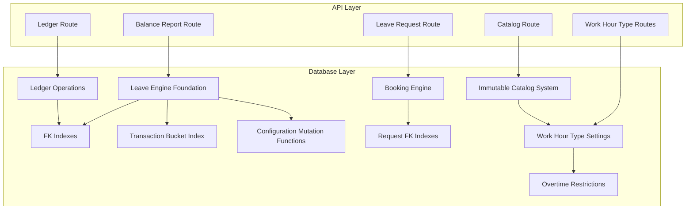
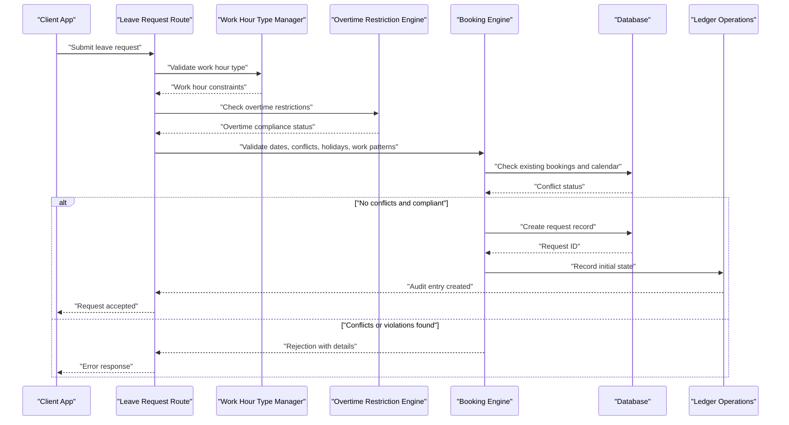
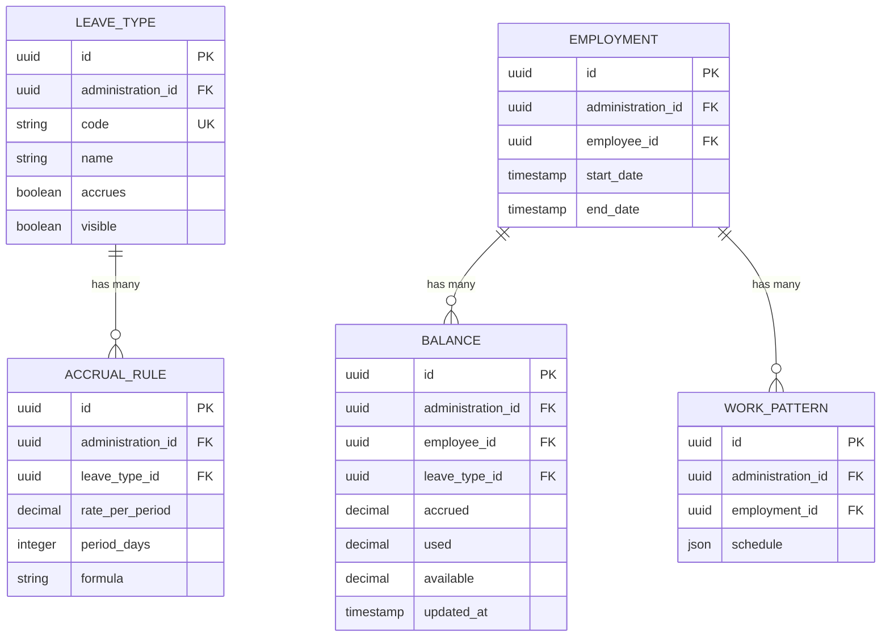
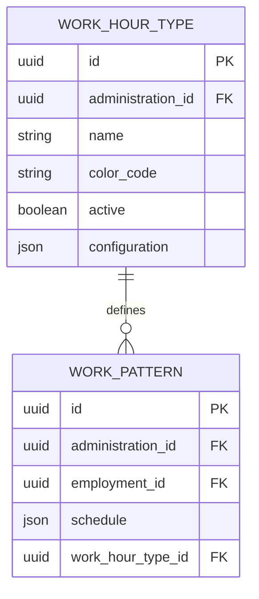
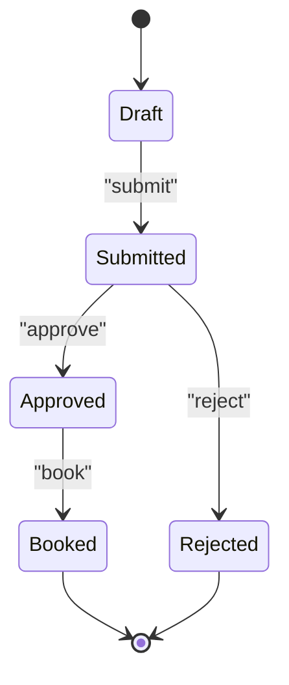
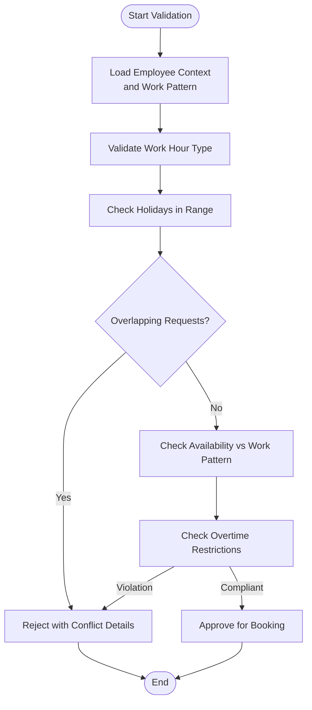
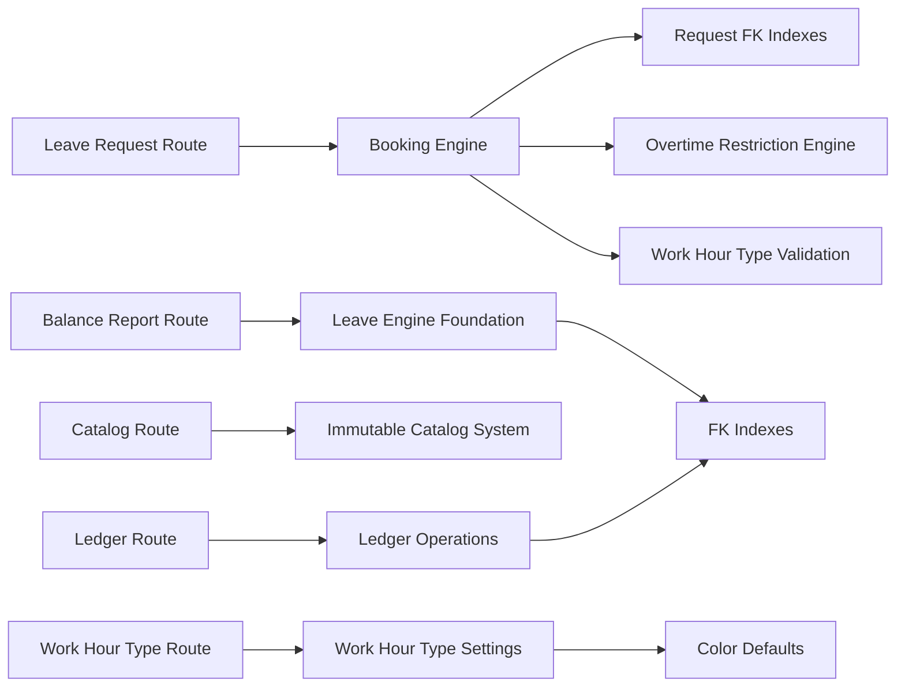

# Leave Management Tables

<cite>
**Referenced Files in This Document**
- [20260722142551_add_leave_engine_foundation.sql](file://apps/hr-suite/supabase/migrations/20260722142551_add_leave_engine_foundation.sql)
- [20260722144232_add_leave_engine_fk_indexes.sql](file://apps/hr-suite/supabase/migrations/20260722144232_add_leave_engine_fk_indexes.sql)
- [20260722144344_add_leave_transaction_bucket_fk_index.sql](file://apps/hr-suite/supabase/migrations/20260722144344_add_leave_transaction_bucket_fk_index.sql)
- [20260722151920_add_leave_configuration_mutation_functions.sql](file://apps/hr-suite/supabase/migrations/20260722151920_add_leave_configuration_mutation_functions.sql)
- [20260722173000_add_work_hour_type_colors.sql](file://apps/hr-suite/supabase/migrations/20260722173000_add_work_hour_type_colors.sql)
- [20260722173100_normalize_catalog_color_defaults.sql](file://apps/hr-suite/supabase/migrations/20260722173100_normalize_catalog_color_defaults.sql)
- [20260722190000_add_leave_request_booking_engine.sql](file://apps/hr-suite/supabase/migrations/20260722190000_add_leave_request_booking_engine.sql)
- [20260722191500_add_leave_request_fk_indexes.sql](file://apps/hr-suite/supabase/migrations/20260722191500_add_leave_request_fk_indexes.sql)
- [20260722192000_add_leave_ledger_operations.sql](file://apps/hr-suite/supabase/migrations/20260722192000_add_leave_ledger_operations.sql)
- [leave_engine_foundation.sql](file://apps/hr-suite/supabase/tests/leave_engine_foundation.sql)
- [route.ts](file://apps/hr-suite/app/api/leave/request/route.ts)
- [route.ts](file://apps/hr-suite/app/api/leave/balance-report/route.ts)
- [route.ts](file://apps/hr-suite/app/api/leave/catalog/route.ts)
- [route.ts](file://apps/hr-suite/app/api/leave/ledger/route.ts)
</cite>

## Update Summary
**Changes Made**
- Added comprehensive documentation for overtime restrictions and work hour type settings
- Updated leave accrual rules section with new immutable catalog system integration
- Enhanced work pattern integration details with color-coded work hour types
- Expanded configuration mutation functions to include work hour type management
- Added new database schema components for overtime restriction enforcement

## Table of Contents
1. [Introduction](#introduction)
2. [Project Structure](#project-structure)
3. [Core Components](#core-components)
4. [Architecture Overview](#architecture-overview)
5. [Detailed Component Analysis](#detailed-component-analysis)
6. [Dependency Analysis](#dependency-analysis)
7. [Performance Considerations](#performance-considerations)
8. [Troubleshooting Guide](#troubleshooting-guide)
9. [Conclusion](#conclusion)
10. [Appendices](#appendices)

## Introduction
This document provides comprehensive data model documentation for LiquidHR's leave management system. It focuses on the leave engine foundation, including leave types, accrual rules, and balance calculations; the leave request workflow with approval states; the booking engine for conflict detection; and ledger operations for audit trails. The system now includes enhanced overtime restrictions, an immutable catalog system for consistent data management, and sophisticated work hour type settings with color coding. It also explains the transaction bucket system for batch processing, configuration mutation functions for rule updates, and foreign key indexes for query optimization. Examples are provided for leave type configurations, accrual rule definitions, work hour type settings, and request lifecycle states. The document addresses complex business logic such as holiday handling, work pattern integration, overtime restriction enforcement, and multi-tenant data isolation, and concludes with performance considerations for large-scale leave calculations and real-time balance updates.

## Project Structure
The leave management feature spans database migrations, API routes, and UI components within the HR Suite application:
- Database schema and behavior are defined through Supabase migrations under apps/hr-suite/supabase/migrations.
- API endpoints for leave requests, balances, catalog, and ledger live under apps/hr-suite/app/api/leave.
- UI components for leave configuration and editing reside under apps/hr-suite/components/leave.
- New work hour type settings and overtime restriction controls are integrated throughout the schema.

**Diagram sources**
- [20260722142551_add_leave_engine_foundation.sql](file://apps/hr-suite/supabase/migrations/20260722142551_add_leave_engine_foundation.sql)
- [20260722144232_add_leave_engine_fk_indexes.sql](file://apps/hr-suite/supabase/migrations/20260722144232_add_leave_engine_fk_indexes.sql)
- [20260722144344_add_leave_transaction_bucket_fk_index.sql](file://apps/hr-suite/supabase/migrations/20260722144344_add_leave_transaction_bucket_fk_index.sql)
- [20260722151920_add_leave_configuration_mutation_functions.sql](file://apps/hr-suite/supabase/migrations/20260722151920_add_leave_configuration_mutation_functions.sql)
- [20260722173000_add_work_hour_type_colors.sql](file://apps/hr-suite/supabase/migrations/20260722173000_add_work_hour_type_colors.sql)
- [20260722173100_normalize_catalog_color_defaults.sql](file://apps/hr-suite/supabase/migrations/20260722173100_normalize_catalog_color_defaults.sql)
- [20260722190000_add_leave_request_booking_engine.sql](file://apps/hr-suite/supabase/migrations/20260722190000_add_leave_request_booking_engine.sql)
- [20260722191500_add_leave_request_fk_indexes.sql](file://apps/hr-suite/supabase/migrations/20260722191500_add_leave_request_fk_indexes.sql)
- [20260722192000_add_leave_ledger_operations.sql](file://apps/hr-suite/supabase/migrations/20260722192000_add_leave_ledger_operations.sql)

**Section sources**
- [20260722142551_add_leave_engine_foundation.sql](file://apps/hr-suite/supabase/migrations/20260722142551_add_leave_engine_foundation.sql)
- [20260722144232_add_leave_engine_fk_indexes.sql](file://apps/hr-suite/supabase/migrations/20260722144232_add_leave_engine_fk_indexes.sql)
- [20260722144344_add_leave_transaction_bucket_fk_index.sql](file://apps/hr-suite/supabase/migrations/20260722144344_add_leave_transaction_bucket_fk_index.sql)
- [20260722151920_add_leave_configuration_mutation_functions.sql](file://apps/hr-suite/supabase/migrations/20260722151920_add_leave_configuration_mutation_functions.sql)
- [20260722173000_add_work_hour_type_colors.sql](file://apps/hr-suite/supabase/migrations/20260722173000_add_work_hour_type_colors.sql)
- [20260722173100_normalize_catalog_color_defaults.sql](file://apps/hr-suite/supabase/migrations/20260722173100_normalize_catalog_color_defaults.sql)
- [20260722190000_add_leave_request_booking_engine.sql](file://apps/hr-suite/supabase/migrations/20260722190000_add_leave_request_booking_engine.sql)
- [20260722191500_add_leave_request_fk_indexes.sql](file://apps/hr-suite/supabase/migrations/20260722191500_add_leave_request_fk_indexes.sql)
- [20260722192000_add_leave_ledger_operations.sql](file://apps/hr-suite/supabase/migrations/20260722192000_add_leave_ledger_operations.sql)

## Core Components
- Leave Types: Define categories of leave (e.g., vacation, sick, parental) with attributes that control accrual eligibility, visibility, and reporting.
- Accrual Rules: Specify how leave entitlements accumulate over time based on employment tenure, work patterns, and policy parameters.
- Balance Calculations: Compute current and projected balances by aggregating accruals, bookings, and adjustments per employee and leave type.
- Leave Requests: Capture employee intent to take leave, including date ranges, type, and reason, progressing through an approval workflow.
- Booking Engine: Validates conflicts against existing bookings, holidays, and work patterns before committing a request.
- Ledger Operations: Immutable audit trail entries recording every change to balances and bookings for compliance and reconciliation.
- Transaction Buckets: Batch containers grouping related transactions to support efficient processing and rollback semantics.
- Configuration Mutations: Safe functions to update leave types, accrual rules, and policies without manual schema changes.
- Work Hour Type Settings: Configurable work hour categories with color coding for visual distinction in calendars and reports.
- Overtime Restrictions: Enforceable limits on overtime hours based on employment contracts and labor regulations.
- Immutable Catalog System: Centralized reference data management ensuring consistency across leave types, work patterns, and policies.
- FK Indexes: Optimized indexes on foreign keys to accelerate queries across employees, employments, leave types, and requests.

**Updated** Added work hour type settings, overtime restrictions, and immutable catalog system components

**Section sources**
- [20260722142551_add_leave_engine_foundation.sql](file://apps/hr-suite/supabase/migrations/20260722142551_add_leave_engine_foundation.sql)
- [20260722173000_add_work_hour_type_colors.sql](file://apps/hr-suite/supabase/migrations/20260722173000_add_work_hour_type_colors.sql)
- [20260722173100_normalize_catalog_color_defaults.sql](file://apps/hr-suite/supabase/migrations/20260722173100_normalize_catalog_color_defaults.sql)
- [20260722190000_add_leave_request_booking_engine.sql](file://apps/hr-suite/supabase/migrations/20260722190000_add_leave_request_booking_engine.sql)
- [20260722192000_add_leave_ledger_operations.sql](file://apps/hr-suite/supabase/migrations/20260722192000_add_leave_ledger_operations.sql)
- [20260722151920_add_leave_configuration_mutation_functions.sql](file://apps/hr-suite/supabase/migrations/20260722151920_add_leave_configuration_mutation_functions.sql)

## Architecture Overview
The leave management architecture integrates API routes with database-level logic to ensure consistency, performance, and auditability. The system now incorporates work hour type management and overtime restriction enforcement.

**Diagram sources**
- [route.ts](file://apps/hr-suite/app/api/leave/request/route.ts)
- [20260722190000_add_leave_request_booking_engine.sql](file://apps/hr-suite/supabase/migrations/20260722190000_add_leave_request_booking_engine.sql)
- [20260722192000_add_leave_ledger_operations.sql](file://apps/hr-suite/supabase/migrations/20260722192000_add_leave_ledger_operations.sql)
- [20260722173000_add_work_hour_type_colors.sql](file://apps/hr-suite/supabase/migrations/20260722173000_add_work_hour_type_colors.sql)

## Detailed Component Analysis

### Leave Engine Foundation
The foundation establishes core tables for leave types, accrual rules, and balances. It includes multi-tenant scoping via administration identifiers and enforces referential integrity.

Key aspects:
- Leave types define category metadata and policy flags.
- Accrual rules specify accumulation logic tied to employment periods and work patterns.
- Balances aggregate accruals and deductions per employee and leave type.
- Multi-tenancy is enforced using administration IDs to isolate data across tenants.

**Diagram sources**
- [20260722142551_add_leave_engine_foundation.sql](file://apps/hr-suite/supabase/migrations/20260722142551_add_leave_engine_foundation.sql)

**Section sources**
- [20260722142551_add_leave_engine_foundation.sql](file://apps/hr-suite/supabase/migrations/20260722142551_add_leave_engine_foundation.sql)

### Work Hour Type Settings and Color Coding
New work hour type settings provide configurable categories for different work patterns with visual color coding for enhanced user experience.

Features:
- Configurable work hour categories (full-time, part-time, flexible, etc.)
- Color-coded visual representation in calendars and reports
- Integration with work pattern validation
- Support for custom work hour definitions

**Diagram sources**
- [20260722173000_add_work_hour_type_colors.sql](file://apps/hr-suite/supabase/migrations/20260722173000_add_work_hour_type_colors.sql)

**Section sources**
- [20260722173000_add_work_hour_type_colors.sql](file://apps/hr-suite/supabase/migrations/20260722173000_add_work_hour_type_colors.sql)
- [20260722173100_normalize_catalog_color_defaults.sql](file://apps/hr-suite/supabase/migrations/20260722173100_normalize_catalog_color_defaults.sql)

### Overtime Restrictions and Enforcement
Overtime restriction system enforces labor regulations and company policies regarding maximum working hours.

Capabilities:
- Configurable overtime limits per employment contract
- Real-time overtime calculation during leave request validation
- Compliance checking against labor laws and company policies
- Alert system for potential overtime violations

**Section sources**
- [20260722190000_add_leave_request_booking_engine.sql](file://apps/hr-suite/supabase/migrations/20260722190000_add_leave_request_booking_engine.sql)

### Immutable Catalog System
The immutable catalog system ensures data consistency across leave types, work patterns, and policy configurations.

Benefits:
- Centralized reference data management
- Version control for catalog items
- Consistent data validation across all modules
- Audit trail for catalog changes

**Section sources**
- [20260722173100_normalize_catalog_color_defaults.sql](file://apps/hr-suite/supabase/migrations/20260722173100_normalize_catalog_color_defaults.sql)

### Foreign Key Indexes for Query Optimization
Indexes on foreign keys improve join performance across employees, employments, leave types, and requests. They reduce latency for balance reports and request validations.

Highlights:
- Indexes on administration_id for tenant-scoped queries.
- Indexes on employee_id and employment_id for rapid lookups.
- Indexes on leave_type_id to optimize accrual and balance aggregation.

**Section sources**
- [20260722144232_add_leave_engine_fk_indexes.sql](file://apps/hr-suite/supabase/migrations/20260722144232_add_leave_engine_fk_indexes.sql)

### Transaction Bucket System for Batch Processing
Transaction buckets group related ledger entries and booking changes to enable atomic batch operations. This supports high-throughput scenarios where multiple leave events must be processed together.

Benefits:
- Atomicity: All entries succeed or fail as a unit.
- Performance: Bulk inserts reduce overhead.
- Auditability: Clear grouping for reconciliation.

**Section sources**
- [20260722144344_add_leave_transaction_bucket_fk_index.sql](file://apps/hr-suite/supabase/migrations/20260722144344_add_leave_transaction_bucket_fk_index.sql)

### Configuration Mutation Functions for Rule Updates
Safe mutation functions allow administrators to update leave types, accrual rules, policies, and work hour types without direct SQL manipulation. These functions enforce validation and maintain referential integrity.

Capabilities:
- Create/update/delete leave types with validation.
- Adjust accrual rates and formulas safely.
- Manage work hour type configurations.
- Enforce tenant isolation during mutations.
- Validate overtime restriction settings.

**Section sources**
- [20260722151920_add_leave_configuration_mutation_functions.sql](file://apps/hr-suite/supabase/migrations/20260722151920_add_leave_configuration_mutation_functions.sql)

### Leave Request Workflow and Approval States
Requests progress through states such as draft, submitted, approved, rejected, and booked. Each transition is validated and recorded in the ledger.

Workflow highlights:
- Draft: Initial creation by employee.
- Submitted: Sent for approval.
- Approved: Manager authorization granted.
- Rejected: Denied with reason.
- Booked: Confirmed and deducted from balance.

**Section sources**
- [20260722190000_add_leave_request_booking_engine.sql](file://apps/hr-suite/supabase/migrations/20260722190000_add_leave_request_booking_engine.sql)

### Booking Engine for Conflict Detection
The booking engine validates new requests against existing bookings, holidays, work patterns, work hour types, and overtime restrictions to prevent overlaps and ensure compliance.

Validation steps:
- Check overlapping requests for the same employee and leave type.
- Exclude non-working days and public holidays.
- Respect work pattern schedules (e.g., part-time availability).
- Validate work hour type constraints.
- Enforce overtime restriction limits.

**Diagram sources**
- [20260722190000_add_leave_request_booking_engine.sql](file://apps/hr-suite/supabase/migrations/20260722190000_add_leave_request_booking_engine.sql)
- [20260722173000_add_work_hour_type_colors.sql](file://apps/hr-suite/supabase/migrations/20260722173000_add_work_hour_type_colors.sql)

**Section sources**
- [20260722190000_add_leave_request_booking_engine.sql](file://apps/hr-suite/supabase/migrations/20260722190000_add_leave_request_booking_engine.sql)

### Ledger Operations for Audit Trails
Ledger operations create immutable records for every change to balances and bookings. This ensures full traceability and supports compliance audits.

Operations include:
- Accrual postings when entitlements increase.
- Deductions when requests are booked.
- Adjustments due to corrections or policy changes.
- Overtime violation tracking.
- Work hour type change logging.

**Section sources**
- [20260722192000_add_leave_ledger_operations.sql](file://apps/hr-suite/supabase/migrations/20260722192000_add_leave_ledger_operations.sql)

### FK Indexes for Request Queries
Additional indexes on request-related foreign keys optimize queries for approval workflows and reporting.

Focus areas:
- Indexes on employee_id and leave_type_id for fast filtering.
- Indexes on administration_id for tenant-scoped searches.

**Section sources**
- [20260722191500_add_leave_request_fk_indexes.sql](file://apps/hr-suite/supabase/migrations/20260722191500_add_leave_request_fk_indexes.sql)

### Complex Business Logic: Holiday Handling, Work Patterns, and Overtime
Holiday handling excludes non-working days from leave calculations. Work pattern integration ensures partial availability is respected, especially for part-time employees. Overtime restrictions enforce labor regulations and company policies.

Considerations:
- Public holidays and company-specific holidays are excluded automatically.
- Work patterns define valid working days and hours.
- Accruals may be prorated based on work patterns.
- Work hour type constraints affect leave availability.
- Overtime restrictions prevent excessive working hours.

**Section sources**
- [20260722190000_add_leave_request_booking_engine.sql](file://apps/hr-suite/supabase/migrations/20260722190000_add_leave_request_booking_engine.sql)
- [20260722173000_add_work_hour_type_colors.sql](file://apps/hr-suite/supabase/migrations/20260722173000_add_work_hour_type_colors.sql)

### Multi-Tenant Data Isolation
Multi-tenancy is enforced via administration_id on all core tables. API routes and database policies ensure data isolation between tenants.

Mechanisms:
- Row-level security policies scoped by administration_id.
- API context injection of tenant identifier.
- Migrations seed tenant-specific demo data.
- Work hour type catalogs are tenant-specific.

**Section sources**
- [20260722142551_add_leave_engine_foundation.sql](file://apps/hr-suite/supabase/migrations/20260722142551_add_leave_engine_foundation.sql)

## Dependency Analysis
The leave system exhibits clear layering: API routes depend on database functions and tables, which are optimized by indexes. Configuration mutations provide safe updates without breaking dependencies. The new work hour type and overtime restriction systems integrate seamlessly with existing components.

**Diagram sources**
- [route.ts](file://apps/hr-suite/app/api/leave/request/route.ts)
- [route.ts](file://apps/hr-suite/app/api/leave/balance-report/route.ts)
- [route.ts](file://apps/hr-suite/app/api/leave/catalog/route.ts)
- [route.ts](file://apps/hr-suite/app/api/leave/ledger/route.ts)
- [20260722142551_add_leave_engine_foundation.sql](file://apps/hr-suite/supabase/migrations/20260722142551_add_leave_engine_foundation.sql)
- [20260722144232_add_leave_engine_fk_indexes.sql](file://apps/hr-suite/supabase/migrations/20260722144232_add_leave_engine_fk_indexes.sql)
- [20260722173000_add_work_hour_type_colors.sql](file://apps/hr-suite/supabase/migrations/20260722173000_add_work_hour_type_colors.sql)
- [20260722173100_normalize_catalog_color_defaults.sql](file://apps/hr-suite/supabase/migrations/20260722173100_normalize_catalog_color_defaults.sql)
- [20260722191500_add_leave_request_fk_indexes.sql](file://apps/hr-suite/supabase/migrations/20260722191500_add_leave_request_fk_indexes.sql)
- [20260722192000_add_leave_ledger_operations.sql](file://apps/hr-suite/supabase/migrations/20260722192000_add_leave_ledger_operations.sql)

**Section sources**
- [route.ts](file://apps/hr-suite/app/api/leave/request/route.ts)
- [route.ts](file://apps/hr-suite/app/api/leave/balance-report/route.ts)
- [route.ts](file://apps/hr-suite/app/api/leave/catalog/route.ts)
- [route.ts](file://apps/hr-suite/app/api/leave/ledger/route.ts)
- [20260722142551_add_leave_engine_foundation.sql](file://apps/hr-suite/supabase/migrations/20260722142551_add_leave_engine_foundation.sql)
- [20260722144232_add_leave_engine_fk_indexes.sql](file://apps/hr-suite/supabase/migrations/20260722144232_add_leave_engine_fk_indexes.sql)
- [20260722173000_add_work_hour_type_colors.sql](file://apps/hr-suite/supabase/migrations/20260722173000_add_work_hour_type_colors.sql)
- [20260722173100_normalize_catalog_color_defaults.sql](file://apps/hr-suite/supabase/migrations/20260722173100_normalize_catalog_color_defaults.sql)
- [20260722191500_add_leave_request_fk_indexes.sql](file://apps/hr-suite/supabase/migrations/20260722191500_add_leave_request_fk_indexes.sql)
- [20260722192000_add_leave_ledger_operations.sql](file://apps/hr-suite/supabase/migrations/20260722192000_add_leave_ledger_operations.sql)

## Performance Considerations
- Use FK indexes to minimize join costs on large datasets.
- Batch process transactions via buckets to reduce write amplification.
- Cache frequently accessed catalog data (leave types, accrual rules, work hour types) at the API layer when appropriate.
- Partition balances and ledger entries by administration_id and year for scalable queries.
- Avoid recalculating entire balance histories; compute deltas based on recent ledger entries.
- Optimize booking validations with targeted indexes on employee_id, leave_type_id, and date ranges.
- Implement caching for work hour type configurations to reduce database queries.
- Use materialized views for complex overtime calculations.

## Troubleshooting Guide
Common issues and resolutions:
- Conflict errors during booking: Review overlapping requests and holiday exclusions.
- Balance discrepancies: Inspect ledger entries for missing accruals or incorrect deductions.
- Tenant data leakage: Verify RLS policies and administration_id scoping in queries.
- Slow queries: Ensure FK indexes exist and consider adding composite indexes for frequent filters.
- Work hour type validation failures: Check work hour type configurations and employment assignments.
- Overtime restriction violations: Review overtime limits and employment contract settings.
- Color display issues: Verify work hour type color codes and default color normalization.

**Section sources**
- [20260722190000_add_leave_request_booking_engine.sql](file://apps/hr-suite/supabase/migrations/20260722190000_add_leave_request_booking_engine.sql)
- [20260722192000_add_leave_ledger_operations.sql](file://apps/hr-suite/supabase/migrations/20260722192000_add_leave_ledger_operations.sql)
- [20260722173000_add_work_hour_type_colors.sql](file://apps/hr-suite/supabase/migrations/20260722173000_add_work_hour_type_colors.sql)
- [20260722173100_normalize_catalog_color_defaults.sql](file://apps/hr-suite/supabase/migrations/20260722173100_normalize_catalog_color_defaults.sql)

## Conclusion
LiquidHR's leave management system combines robust data modeling, secure configuration mutations, and efficient indexing to deliver accurate leave calculations, reliable booking validation, and comprehensive audit trails. The addition of work hour type settings, overtime restriction enforcement, and an immutable catalog system enhances the system's flexibility and compliance capabilities. By leveraging transaction buckets, multi-tenant isolation, optimized queries, and advanced work pattern integration, the system scales effectively for large organizations while maintaining clarity and regulatory compliance.

## Appendices

### Example Leave Type Configuration
- Code: Unique identifier for the leave category.
- Name: Human-readable label.
- Accrues: Boolean indicating if accrual applies.
- Visible: Boolean controlling visibility in UI and reports.

**Section sources**
- [20260722142551_add_leave_engine_foundation.sql](file://apps/hr-suite/supabase/migrations/20260722142551_add_leave_engine_foundation.sql)

### Example Accrual Rule Definition
- Rate per period: Amount added per accrual period.
- Period days: Length of accrual cycle.
- Formula: Expression defining calculation logic.

**Section sources**
- [20260722142551_add_leave_engine_foundation.sql](file://apps/hr-suite/supabase/migrations/20260722142551_add_leave_engine_foundation.sql)

### Example Work Hour Type Configuration
- Name: Descriptive label for the work hour category.
- Color code: Hex color value for visual representation.
- Active: Boolean flag for enabling/disabling the type.
- Configuration: JSON object containing specific work hour parameters.

**Section sources**
- [20260722173000_add_work_hour_type_colors.sql](file://apps/hr-suite/supabase/migrations/20260722173000_add_work_hour_type_colors.sql)
- [20260722173100_normalize_catalog_color_defaults.sql](file://apps/hr-suite/supabase/migrations/20260722173100_normalize_catalog_color_defaults.sql)

### Request Lifecycle States
- Draft: Created but not submitted.
- Submitted: Pending approval.
- Approved: Authorized by manager.
- Rejected: Denied with reason.
- Booked: Confirmed and deducted.

**Section sources**
- [20260722190000_add_leave_request_booking_engine.sql](file://apps/hr-suite/supabase/migrations/20260722190000_add_leave_request_booking_engine.sql)

### Overtime Restriction Parameters
- Maximum weekly hours: Upper limit for weekly working hours.
- Maximum daily hours: Upper limit for daily working hours.
- Mandatory rest periods: Required break times between shifts.
- Penalty factors: Multipliers for overtime calculations.

**Section sources**
- [20260722190000_add_leave_request_booking_engine.sql](file://apps/hr-suite/supabase/migrations/20260722190000_add_leave_request_booking_engine.sql)