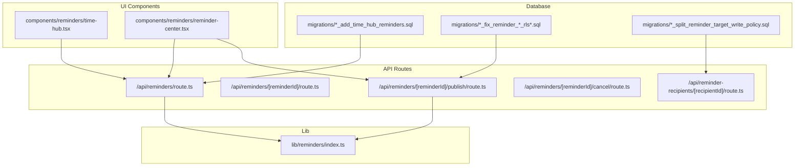
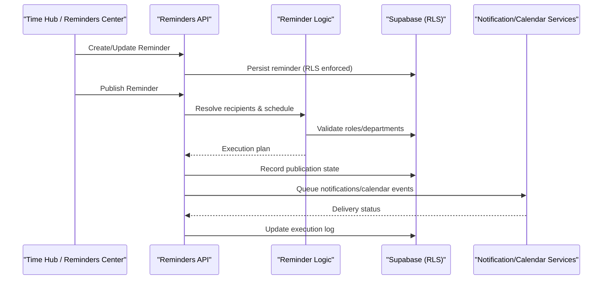
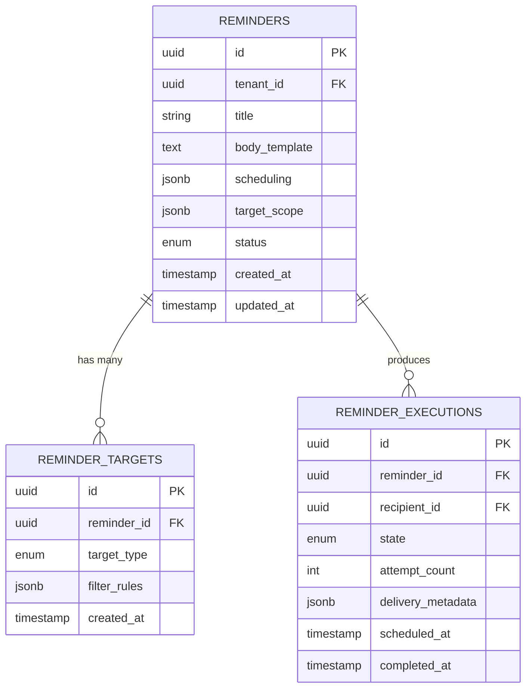
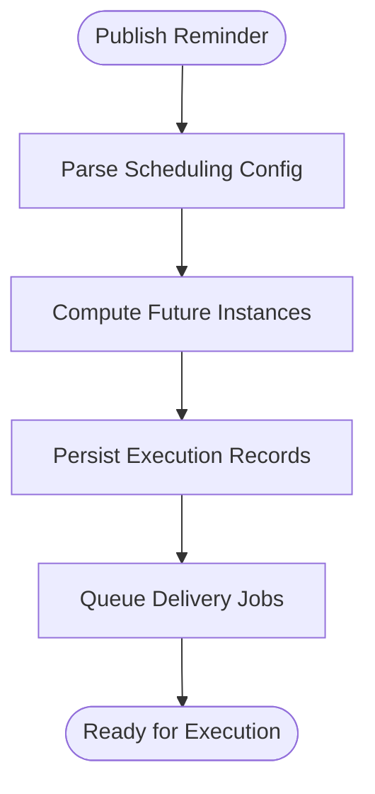
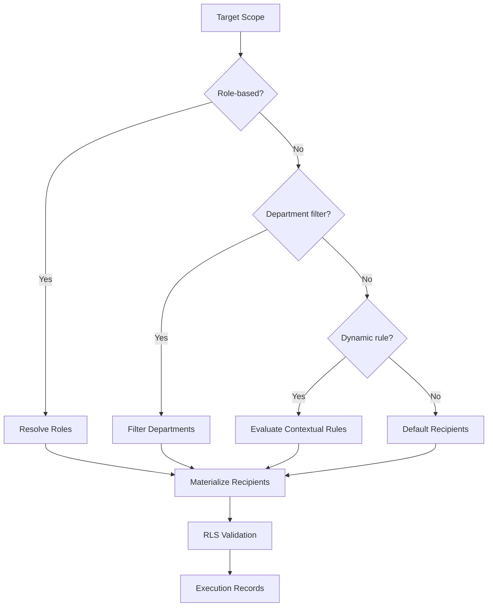
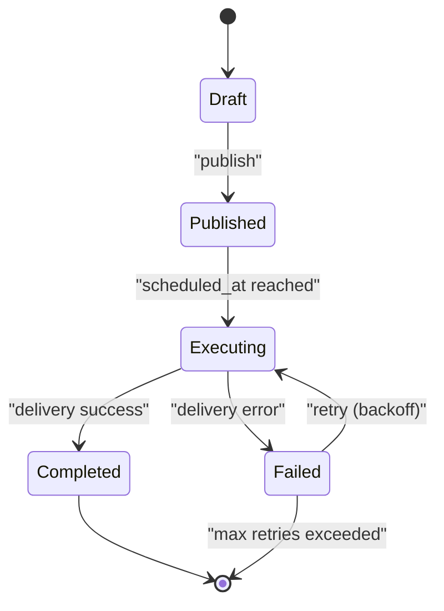
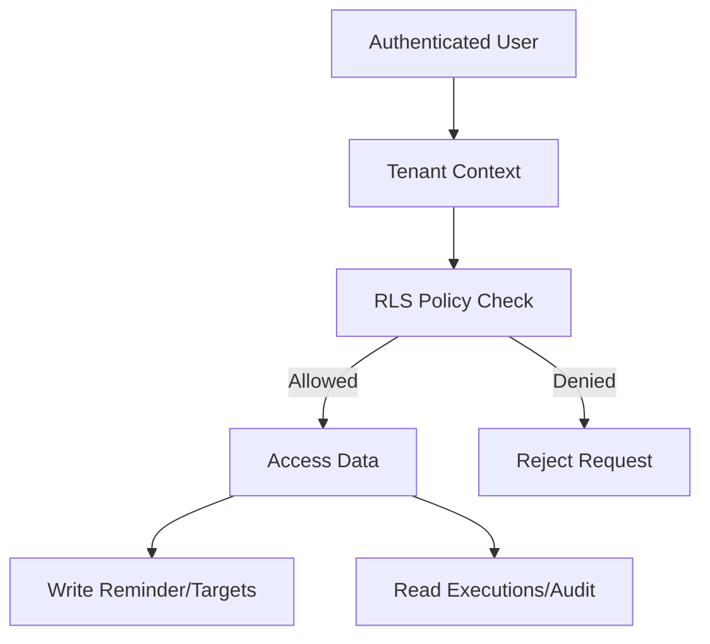
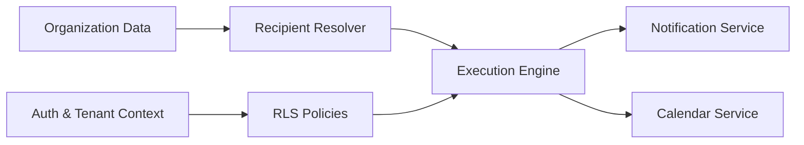

# Reminder System Tables

<cite>
**Referenced Files in This Document**
- [20260716081000_add_time_hub_reminders.sql](file://apps/hr-suite/supabase/migrations/20260716081000_add_time_hub_reminders.sql)
- [20260716090000_fix_reminder_recipient_rls_recursion.sql](file://apps/hr-suite/supabase/migrations/20260716090000_fix_reminder_recipient_rls_recursion.sql)
- [20260716092000_fix_reminder_publish_auth_lookup.sql](file://apps/hr-suite/supabase/migrations/20260716092000_fix_reminder_publish_auth_lookup.sql)
- [20260718110100_fix_document_reminder_recipient_resolution.sql](file://apps/hr-suite/supabase/migrations/20260718110100_fix_document_reminder_recipient_resolution.sql)
- [20260718132000_split_reminder_target_write_policy.sql](file://apps/hr-suite/supabase/migrations/20260718132000_split_reminder_target_write_policy.sql)
- [reminders.ts](file://apps/hr-suite/lib/reminders/index.ts)
- [time-hub.tsx](file://apps/hr-suite/components/reminders/time-hub.tsx)
- [reminder-center.tsx](file://apps/hr-suite/components/reminders/reminder-center.tsx)
- [route.ts](file://apps/hr-suite/app/api/reminders/route.ts)
- [route.ts](file://apps/hr-suite/app/api/reminders/[reminderId]/route.ts)
- [route.ts](file://apps/hr-suite/app/api/reminders/[reminderId]/publish/route.ts)
- [route.ts](file://apps/hr-suite/app/api/reminders/[reminderId]/cancel/route.ts)
- [route.ts](file://apps/hr-suite/app/api/reminder-recipients/[recipientId]/route.ts)
- [reminders.json](file://apps/hr-suite/messages/en/reminders.json)
- [FDR-0001-document-en-reminderdoelgroepen.md](file://docs/decisions/FDR-0001-document-en-reminderdoelgroepen.md)
- [2026-07-15-tijdhub-klokken-en-reminders-design.md](file://docs/superpowers/plans/2026-07-15-tijdhub-klokken-en-reminders-design.md)
</cite>

## Table of Contents
1. [Introduction](#introduction)
2. [Project Structure](#project-structure)
3. [Core Components](#core-components)
4. [Architecture Overview](#architecture-overview)
5. [Detailed Component Analysis](#detailed-component-analysis)
6. [Dependency Analysis](#dependency-analysis)
7. [Performance Considerations](#performance-considerations)
8. [Troubleshooting Guide](#troubleshooting-guide)
9. [Conclusion](#conclusion)
10. [Appendices](#appendices)

## Introduction
This document provides a comprehensive data model and operational guide for LiquidHR’s reminder system, focusing on the Time Hub reminders architecture. It explains how reminders are defined, scheduled, resolved to recipients, executed, and governed by Row-Level Security (RLS). It also covers lifecycle states, retry logic, recipient targeting rules, performance considerations, and integration points with external notification services and calendar systems.

## Project Structure
The reminder system spans database migrations, API routes, UI components, and design documents:
- Database schema and policies are defined in Supabase migrations under apps/hr-suite/supabase/migrations.
- Business logic and utilities live in apps/hr-suite/lib/reminders.
- User interfaces for Time Hub and Reminders Center are implemented in apps/hr-suite/components/reminders.
- API endpoints for CRUD, publishing, and cancellation are exposed via Next.js route handlers under apps/hr-suite/app/api/reminders.
- Internationalization messages for reminders are located in apps/hr-suite/messages/en/reminders.json.
- Design and feature decisions are captured in docs/decisions and docs/superpowers/plans.

**Diagram sources**
- [20260716081000_add_time_hub_reminders.sql](file://apps/hr-suite/supabase/migrations/20260716081000_add_time_hub_reminders.sql)
- [20260716090000_fix_reminder_recipient_rls_recursion.sql](file://apps/hr-suite/supabase/migrations/20260716090000_fix_reminder_recipient_rls_recursion.sql)
- [20260718132000_split_reminder_target_write_policy.sql](file://apps/hr-suite/supabase/migrations/20260718132000_split_reminder_target_write_policy.sql)
- [route.ts](file://apps/hr-suite/app/api/reminders/route.ts)
- [route.ts](file://apps/hr-suite/app/api/reminders/[reminderId]/route.ts)
- [route.ts](file://apps/hr-suite/app/api/reminders/[reminderId]/publish/route.ts)
- [route.ts](file://apps/hr-suite/app/api/reminders/[reminderId]/cancel/route.ts)
- [route.ts](file://apps/hr-suite/app/api/reminder-recipients/[recipientId]/route.ts)
- [time-hub.tsx](file://apps/hr-suite/components/reminders/time-hub.tsx)
- [reminder-center.tsx](file://apps/hr-suite/components/reminders/reminder-center.tsx)
- [reminders.ts](file://apps/hr-suite/lib/reminders/index.ts)

**Section sources**
- [20260716081000_add_time_hub_reminders.sql](file://apps/hr-suite/supabase/migrations/20260716081000_add_time_hub_reminders.sql)
- [20260716090000_fix_reminder_recipient_rls_recursion.sql](file://apps/hr-suite/supabase/migrations/20260716090000_fix_reminder_recipient_rls_recursion.sql)
- [20260716092000_fix_reminder_publish_auth_lookup.sql](file://apps/hr-suite/supabase/migrations/20260716092000_fix_reminder_publish_auth_lookup.sql)
- [20260718110100_fix_document_reminder_recipient_resolution.sql](file://apps/hr-suite/supabase/migrations/20260718110100_fix_document_reminder_recipient_resolution.sql)
- [20260718132000_split_reminder_target_write_policy.sql](file://apps/hr-suite/supabase/migrations/20260718132000_split_reminder_target_write_policy.sql)
- [route.ts](file://apps/hr-suite/app/api/reminders/route.ts)
- [route.ts](file://apps/hr-suite/app/api/reminders/[reminderId]/route.ts)
- [route.ts](file://apps/hr-suite/app/api/reminders/[reminderId]/publish/route.ts)
- [route.ts](file://apps/hr-suite/app/api/reminders/[reminderId]/cancel/route.ts)
- [route.ts](file://apps/hr-suite/app/api/reminder-recipients/[recipientId]/route.ts)
- [time-hub.tsx](file://apps/hr-suite/components/reminders/time-hub.tsx)
- [reminder-center.tsx](file://apps/hr-suite/components/reminders/reminder-center.tsx)
- [reminders.ts](file://apps/hr-suite/lib/reminders/index.ts)

## Core Components
- Reminder definitions: Store template content, scheduling parameters, target scope, and execution metadata.
- Scheduling mechanisms: Define when and how often reminders should run, including cron-like expressions or relative offsets.
- Recipient resolution: Determine who receives reminders using role-based targeting, department filtering, and dynamic calculation based on context (e.g., document events).
- Lifecycle management: Track states from creation through publication to execution, including retries and audit logs.
- Access control: Enforce RLS policies for reading/writing reminders and resolving recipients securely.

Key responsibilities:
- API routes handle CRUD operations, publish actions, and cancellation flows.
- UI components provide interfaces for configuring reminders and viewing upcoming executions.
- Library modules encapsulate business logic for recipient resolution and scheduling.

**Section sources**
- [route.ts](file://apps/hr-suite/app/api/reminders/route.ts)
- [route.ts](file://apps/hr-suite/app/api/reminders/[reminderId]/route.ts)
- [route.ts](file://apps/hr-suite/app/api/reminders/[reminderId]/publish/route.ts)
- [route.ts](file://apps/hr-suite/app/api/reminders/[reminderId]/cancel/route.ts)
- [time-hub.tsx](file://apps/hr-suite/components/reminders/time-hub.tsx)
- [reminder-center.tsx](file://apps/hr-suite/components/reminders/reminder-center.tsx)
- [reminders.ts](file://apps/hr-suite/lib/reminders/index.ts)

## Architecture Overview
The reminder system follows a layered architecture:
- Data layer: Relational tables for reminders, targets, and execution logs; enforced by RLS policies.
- Service layer: API routes orchestrate validation, authorization, and persistence.
- Logic layer: Library functions implement recipient resolution, scheduling, and retry strategies.
- Presentation layer: UI components allow users to create, manage, and monitor reminders.

**Diagram sources**
- [route.ts](file://apps/hr-suite/app/api/reminders/route.ts)
- [route.ts](file://apps/hr-suite/app/api/reminders/[reminderId]/publish/route.ts)
- [reminders.ts](file://apps/hr-suite/lib/reminders/index.ts)
- [20260716081000_add_time_hub_reminders.sql](file://apps/hr-suite/supabase/migrations/20260716081000_add_time_hub_reminders.sql)

## Detailed Component Analysis

### Data Model: Reminder Entities
The reminder system centers around several core entities:
- Reminder definition: Contains template text, subject, channel preferences, and scheduling configuration.
- Target scope: Defines which roles, departments, or contextual filters apply to recipients.
- Execution record: Tracks each scheduled instance, its state, attempts, and outcomes.
- Audit log: Records changes and access events for compliance and debugging.

**Diagram sources**
- [20260716081000_add_time_hub_reminders.sql](file://apps/hr-suite/supabase/migrations/20260716081000_add_time_hub_reminders.sql)

**Section sources**
- [20260716081000_add_time_hub_reminders.sql](file://apps/hr-suite/supabase/migrations/20260716081000_add_time_hub_reminders.sql)

### Scheduling Mechanisms
Scheduling is configured via structured JSON that supports:
- Cron expressions for recurring schedules.
- Relative offsets tied to HR events (e.g., “3 days before contract start”).
- Timezone-aware execution windows.

Execution planning:
- On publish, the system computes future execution instances based on the current time and schedule.
- Each instance is persisted with a scheduled_at timestamp and initial state.

**Diagram sources**
- [route.ts](file://apps/hr-suite/app/api/reminders/[reminderId]/publish/route.ts)
- [reminders.ts](file://apps/hr-suite/lib/reminders/index.ts)

**Section sources**
- [20260716081000_add_time_hub_reminders.sql](file://apps/hr-suite/supabase/migrations/20260716081000_add_time_hub_reminders.sql)
- [route.ts](file://apps/hr-suite/app/api/reminders/[reminderId]/publish/route.ts)
- [reminders.ts](file://apps/hr-suite/lib/reminders/index.ts)

### Recipient Resolution
Recipient resolution combines multiple targeting strategies:
- Role-based targeting: Select users with specific roles within the tenant.
- Department filtering: Restrict recipients to employees in specified departments.
- Dynamic calculation: Evaluate contextual rules at execution time (e.g., managers of employees affected by a document event).

Resolution flow:
- Validate target scope against organizational data.
- Materialize recipient IDs into execution records.
- Apply RLS to ensure only authorized recipients are included.

**Diagram sources**
- [20260718110100_fix_document_reminder_recipient_resolution.sql](file://apps/hr-suite/supabase/migrations/20260718110100_fix_document_reminder_recipient_resolution.sql)
- [reminders.ts](file://apps/hr-suite/lib/reminders/index.ts)

**Section sources**
- [20260718110100_fix_document_reminder_recipient_resolution.sql](file://apps/hr-suite/supabase/migrations/20260718110100_fix_document_reminder_recipient_resolution.sql)
- [reminders.ts](file://apps/hr-suite/lib/reminders/index.ts)

### Lifecycle Management and Retry Logic
Lifecycle states include:
- Draft: Created but not yet published.
- Published: Scheduled instances exist and are queued for execution.
- Executing: Currently being processed.
- Completed: Successfully delivered.
- Failed: Delivery failed; may be retried.

Retry strategy:
- Exponential backoff with configurable maximum attempts.
- Idempotent updates to avoid duplicate deliveries.
- Audit logging for all state transitions and failures.

**Diagram sources**
- [20260716081000_add_time_hub_reminders.sql](file://apps/hr-suite/supabase/migrations/20260716081000_add_time_hub_reminders.sql)

**Section sources**
- [20260716081000_add_time_hub_reminders.sql](file://apps/hr-suite/supabase/migrations/20260716081000_add_time_hub_reminders.sql)

### RLS Policies and Authentication Lookups
Row-Level Security ensures:
- Tenants can only access their own reminders and executions.
- Users can read reminders relevant to their role and department.
- Recursive permission checks prevent privilege escalation during recipient resolution.

Authentication lookups:
- Validate user identity and tenant context before processing.
- Enforce write permissions on reminder definitions and targets.
- Allow read access to executions for audit purposes within scope.

**Diagram sources**
- [20260716090000_fix_reminder_recipient_rls_recursion.sql](file://apps/hr-suite/supabase/migrations/20260716090000_fix_reminder_recipient_rls_recursion.sql)
- [20260716092000_fix_reminder_publish_auth_lookup.sql](file://apps/hr-suite/supabase/migrations/20260716092000_fix_reminder_publish_auth_lookup.sql)
- [20260718132000_split_reminder_target_write_policy.sql](file://apps/hr-suite/supabase/migrations/20260718132000_split_reminder_target_write_policy.sql)

**Section sources**
- [20260716090000_fix_reminder_recipient_rls_recursion.sql](file://apps/hr-suite/supabase/migrations/20260716090000_fix_reminder_recipient_rls_recursion.sql)
- [20260716092000_fix_reminder_publish_auth_lookup.sql](file://apps/hr-suite/supabase/migrations/20260716092000_fix_reminder_publish_auth_lookup.sql)
- [20260718132000_split_reminder_target_write_policy.sql](file://apps/hr-suite/supabase/migrations/20260718132000_split_reminder_target_write_policy.sql)

### API Endpoints
Core endpoints:
- POST /api/reminders: Create new reminder definitions.
- GET/PUT /api/reminders/:id: Retrieve and update reminder details.
- POST /api/reminders/:id/publish: Transition to published state and schedule executions.
- POST /api/reminders/:id/cancel: Cancel scheduled executions.
- GET/POST /api/reminder-recipients/:recipientId: Manage recipient-specific settings.

Validation and error handling:
- Input sanitization and schema validation.
- Authorization checks via RLS and service-layer guards.
- Consistent error responses with actionable messages.

**Section sources**
- [route.ts](file://apps/hr-suite/app/api/reminders/route.ts)
- [route.ts](file://apps/hr-suite/app/api/reminders/[reminderId]/route.ts)
- [route.ts](file://apps/hr-suite/app/api/reminders/[reminderId]/publish/route.ts)
- [route.ts](file://apps/hr-suite/app/api/reminders/[reminderId]/cancel/route.ts)
- [route.ts](file://apps/hr-suite/app/api/reminder-recipients/[recipientId]/route.ts)

### UI Components
- Time Hub: Displays upcoming reminders and allows quick actions like reschedule or cancel.
- Reminders Center: Provides full CRUD interface for managing reminder definitions and targets.

User interactions:
- Form validations for scheduling and targeting.
- Real-time feedback on publication status and execution results.
- Audit trail visibility for compliance.

**Section sources**
- [time-hub.tsx](file://apps/hr-suite/components/reminders/time-hub.tsx)
- [reminder-center.tsx](file://apps/hr-suite/components/reminders/reminder-center.tsx)

## Dependency Analysis
The reminder system depends on:
- Organizational data for role and department resolution.
- Authentication and tenant context for RLS enforcement.
- External services for notification delivery and calendar synchronization.

**Diagram sources**
- [reminders.ts](file://apps/hr-suite/lib/reminders/index.ts)
- [20260716081000_add_time_hub_reminders.sql](file://apps/hr-suite/supabase/migrations/20260716081000_add_time_hub_reminders.sql)

**Section sources**
- [reminders.ts](file://apps/hr-suite/lib/reminders/index.ts)
- [20260716081000_add_time_hub_reminders.sql](file://apps/hr-suite/supabase/migrations/20260716081000_add_time_hub_reminders.sql)

## Performance Considerations
- Bulk processing: Batch recipient resolution and execution creation to minimize database round-trips.
- Indexing: Ensure indexes on frequently queried columns (tenant_id, status, scheduled_at).
- Backpressure: Implement rate limiting for external service calls to avoid overloading providers.
- Audit logging: Use asynchronous logging to prevent blocking critical paths.
- Caching: Cache static reference data (roles, departments) to reduce lookup latency.

[No sources needed since this section provides general guidance]

## Troubleshooting Guide
Common issues and resolutions:
- RLS recursion errors: Review policy definitions and ensure no circular dependencies in recipient resolution.
- Authentication lookup failures: Verify tenant context propagation and user session validity.
- Delivery failures: Inspect execution logs for error codes and adjust retry policies accordingly.
- Performance bottlenecks: Monitor query plans and add missing indexes for high-cardinality filters.

**Section sources**
- [20260716090000_fix_reminder_recipient_rls_recursion.sql](file://apps/hr-suite/supabase/migrations/20260716090000_fix_reminder_recipient_rls_recursion.sql)
- [20260716092000_fix_reminder_publish_auth_lookup.sql](file://apps/hr-suite/supabase/migrations/20260716092000_fix_reminder_publish_auth_lookup.sql)

## Conclusion
LiquidHR’s reminder system provides a robust foundation for automated, role-aware communications within the Time Hub. By combining flexible scheduling, precise recipient resolution, and strict access controls, it enables reliable automation while maintaining security and performance. Proper configuration and monitoring ensure optimal operation across diverse HR workflows.

[No sources needed since this section summarizes without analyzing specific files]

## Appendices

### Example Reminder Configurations
- Contract renewal reminder: Schedule 30 days before contract end, target all employees with active contracts, send email and calendar invite.
- Performance review reminder: Trigger quarterly for managers in specific departments, include personalized templates.

### Recipient Rules Examples
- Role-based: All HR admins in tenant.
- Department-filtered: Engineering managers only.
- Dynamic: Direct reports of a manager when they submit a leave request.

### Scheduling Patterns
- Cron-based: Every Monday at 9 AM.
- Event-relative: 2 days after employment start date.
- Hybrid: Weekly recurrence excluding holidays.

### Integration Points
- Notification services: Email, SMS, in-app notifications.
- Calendar systems: Google Calendar, Outlook integration for event creation.
- Audit systems: Centralized logging for compliance reporting.

**Section sources**
- [reminders.json](file://apps/hr-suite/messages/en/reminders.json)
- [FDR-0001-document-en-reminderdoelgroepen.md](file://docs/decisions/FDR-0001-document-en-reminderdoelgroepen.md)
- [2026-07-15-tijdhub-klokken-en-reminders-design.md](file://docs/superpowers/plans/2026-07-15-tijdhub-klokken-en-reminders-design.md)