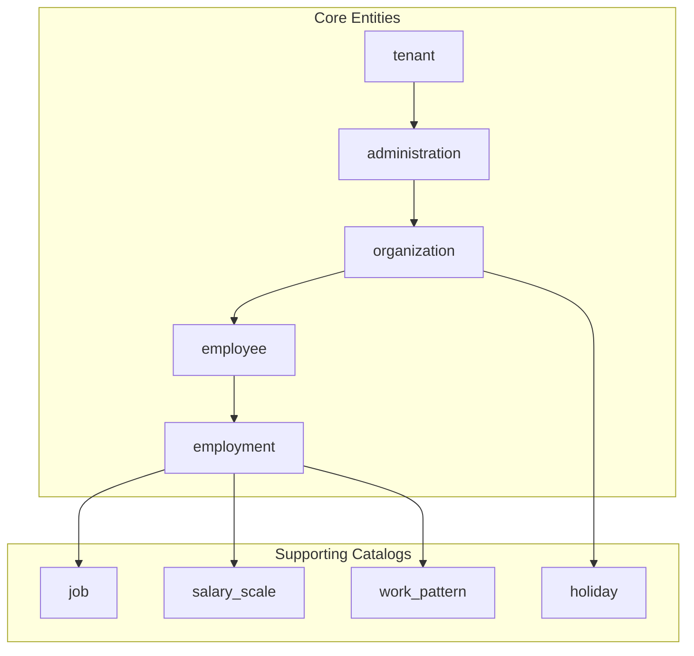
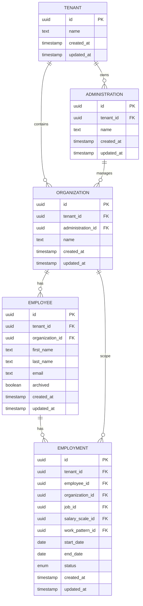
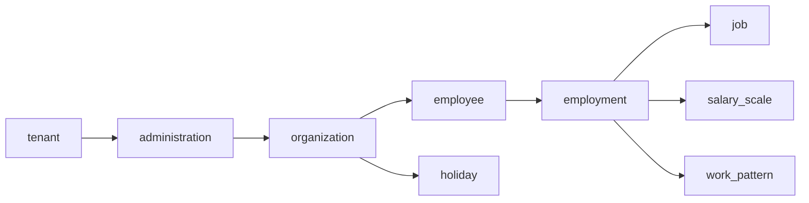

# Core Tables

<cite>
**Referenced Files in This Document**
- [20260712124858_init_employee_core_hr.sql](file://apps/hr-suite/supabase/migrations/20260712124858_init_employee_core_hr.sql)
- [20260712124911_add_tenant_rbac_and_organization.sql](file://apps/hr-suite/supabase/migrations/20260712124911_add_tenant_rbac_and_organization.sql)
- [20260714174305_add_multitenancy_administrations.sql](file://apps/hr-suite/supabase/migrations/20260714174305_add_multitenancy_administrations.sql)
- [20260715071156_add_employment_core.sql](file://apps/hr-suite/supabase/migrations/20260715071156_add_employment_core.sql)
- [20260715071422_add_employment_timelines.sql](file://apps/hr-suite/supabase/migrations/20260715071422_add_employment_timelines.sql)
- [20260715071717_add_employment_terminations.sql](file://apps/hr-suite/supabase/migrations/20260715071717_add_employment_terminations.sql)
- [20260715072010_harden_employment_security.sql](file://apps/hr-suite/supabase/migrations/20260715072010_harden_employment_security.sql)
- [20260715120810_complete_employee_core.sql](file://apps/hr-suite/supabase/migrations/20260715120810_complete_employee_core.sql)
- [20260715121304_optimize_employee_core_indexes.sql](file://apps/hr-suite/supabase/migrations/20260715121304_optimize_employee_core_indexes.sql)
- [20260715130026_index_secure_employee_foreign_keys.sql](file://apps/hr-suite/supabase/migrations/20260715130026_index_secure_employee_foreign_keys.sql)
- [20260715141843_add_employment_change_management.sql](file://apps/hr-suite/supabase/migrations/20260715141843_add_employment_change_management.sql)
- [20260715145432_optimize_employment_change_management.sql](file://apps/hr-suite/supabase/migrations/20260715145432_optimize_employment_change_management.sql)
- [20260715173629_restore_employee_subresource_grants.sql](file://apps/hr-suite/supabase/migrations/20260715173629_restore_employee_subresource_grants.sql)
- [20260718100000_add_job_catalog_salary_revisions.sql](file://apps/hr-suite/supabase/migrations/20260718100000_add_job_catalog_salary_revisions.sql)
- [20260718120000_add_hr_change_event_projection.sql](file://apps/hr-suite/supabase/migrations/20260718120000_add_hr_change_event_projection.sql)
- [20260718121308_add_settings_modules_work_patterns_holidays.sql](file://apps/hr-suite/supabase/migrations/20260718121308_add_settings_modules_work_patterns_holidays.sql)
- [20260718122138_harden_settings_rosters_holidays.sql](file://apps/hr-suite/supabase/migrations/20260718122138_harden_settings_rosters_holidays.sql)
- [20260718122614_enforce_optional_module_guards.sql](file://apps/hr-suite/supabase/migrations/20260718122614_enforce_optional_module_guards.sql)
- [20260718122751_expose_module_state_to_tenant_users.sql](file://apps/hr-suite/supabase/migrations/20260718122751_expose_module_state_to_tenant_users.sql)
- [20260718123742_add_holiday_snapshot_import.sql](file://apps/hr-suite/supabase/migrations/20260718123742_add_holiday_snapshot_import.sql)
- [20260718124240_allow_hr_calendar_recipient_read.sql](file://apps/hr-suite/supabase/migrations/20260718124240_allow_hr_calendar recipient_read.sql)
- [20260718130000_add_hr_calendar_permission.sql](file://apps/hr-suite/supabase/migrations/20260718130000_add_hr_calendar_permission.sql)
- [20260718131000_harden_hr_master_data_document_policies.sql](file://apps/hr-suite/supabase/migrations/20260718131000_harden_hr_master_data_document_policies.sql)
- [20260718132000_split_reminder_target_write_policy.sql](file://apps/hr-suite/supabase/migrations/20260718132000_split_reminder_target_write_policy.sql)
- [20260718150000_add_employee_archive_and_avatar_state.sql](file://apps/hr-suite/supabase/migrations/20260718150000_add_employee_archive_and_avatar_state.sql)
- [20260718170000_add_dashboard_widget_catalog.sql](file://apps/hr-suite/supabase/migrations/20260718170000_add_dashboard_widget_catalog.sql)
- [20260718171000_relax_dashboard_widget_read_scope.sql](file://apps/hr-suite/supabase/migrations/20260718171000_relax_dashboard_widget_read_scope.sql)
- [20260718172000_expand_personal_dashboard_widget_types.sql](file://apps/hr-suite/supabase/migrations/20260718172000_expand_personal_dashboard_widget_types.sql)
- [20260718172051_grant_dashboard_widget_admin_permissions.sql](file://apps/hr-suite/supabase/migrations/20260718172051_grant_dashboard_widget_admin_permissions.sql)
- [20260718173000_tune_dashboard_widget_policies.sql](file://apps/hr-suite/supabase/migrations/20260718173000_tune_dashboard_widget_policies.sql)
- [20260718180354_add_date_time_user_preferences.sql](file://apps/hr-suite/supabase/migrations/20260718180354_add_date_time_user_preferences.sql)
- [20260719101500_refine_employee_document_upload_rules.sql](file://apps/hr-suite/supabase/migrations/20260719101500_refine_employee_document_upload_rules.sql)
- [20260719112000_add_week_numbering_user_preference.sql](file://apps/hr-suite/supabase/migrations/20260719112000_add_week_numbering_user_preference.sql)
- [20260719153000_add_star_performer_management.sql](file://apps/hr-suite/supabase/migrations/20260719153000_add_star_performer_management.sql)
- [20260719170000_add_tenant_relation_type_catalog.sql](file://apps/hr-suite/supabase/migrations/20260719170000_add_tenant_relation_type_catalog.sql)
- [20260719180000_allow_custom_relation_type_catalog_entries.sql](file://apps/hr-suite/supabase/migrations/20260719180000_allow_custom_relation_type_catalog_entries.sql)
- [20260719181000_index_relation_type_catalog_fk.sql](file://apps/hr-suite/supabase/migrations/20260719181000_index_relation_type_catalog_fk.sql)
- [20260722142551_add_leave_engine_foundation.sql](file://apps/hr-suite/supabase/migrations/20260722142551_add_leave_engine_foundation.sql)
- [20260722144232_add_leave_engine_fk_indexes.sql](file://apps/hr-suite/supabase/migrations/20260722144232_add_leave_engine_fk_indexes.sql)
- [20260722144344_add_leave_transaction_bucket_fk_index.sql](file://apps/hr-suite/supabase/migrations/20260722144344_add_leave_transaction_bucket_fk_index.sql)
- [20260722151920_add_leave_configuration_mutation_functions.sql](file://apps/hr-suite/supabase/migrations/20260722151920_add_leave_configuration_mutation_functions.sql)
- [20260722173000_add_work_hour_type_colors.sql](file://apps/hr-suite/supabase/migrations/20260722173000_add_work_hour_type_colors.sql)
- [20260722173100_normalize_catalog_color_defaults.sql](file://apps/hr-suite/supabase/migrations/20260722173100_normalize_catalog_color_defaults.sql)
- [20260722190000_add_leave_request_booking_engine.sql](file://apps/hr-suite/supabase/migrations/20260722190000_add_leave_request_booking_engine.sql)
- [20260722190500_seed_leave_demo_linda.sql](file://apps/hr-suite/supabase/migrations/20260722190500_seed_leave_demo_linda.sql)
- [20260722191500_add_leave_request_fk_indexes.sql](file://apps/hr-suite/supabase/migrations/20260722191500_add_leave_request_fk_indexes.sql)
- [20260722192000_add_leave_ledger_operations.sql](file://apps/hr-suite/supabase/migrations/20260722192000_add_leave_ledger_operations.sql)
- [20260722192100_seed_leave_demo_year_controls.sql](file://apps/hr-suite/supabase/migrations/20260722192100_seed_leave_demo_year_controls.sql)
- [20260722192500_skip_holidays_in_leave_requests.sql](file://apps/hr-suite/supabase/migrations/20260722192500_skip_holidays_in_leave_requests.sql)
- [20260723151000_optimize_employee_overview.sql](file://apps/hr-suite/supabase/migrations/20260723151000_optimize_employee_overview.sql)
- [20260724095433_insights_report_permissions.sql](file://apps/hr-suite/supabase/migrations/20260724095433_insights_report_permissions.sql)
- [20260724100605_upcoming_events_and_anniversary_rules.sql](file://apps/hr-suite/supabase/migrations/20260724100605_upcoming_events_and_anniversary_rules.sql)
- [20260724103939_simplify_roles_and_insights_events.sql](file://apps/hr-suite/supabase/migrations/20260724103939_simplify_roles_and_insights_events.sql)
- [20260724112407_add_role_assignment_scope.sql](file://apps/hr-suite/supabase/migrations/20260724112407_add_role_assignment_scope.sql)
- [20260724160000_add_employee_activity_entries.sql](file://apps/hr-suite/supabase/migrations/20260724160000_add_employee_activity_entries.sql)
- [20260724172716_harden_employee_activity_entries.sql](file://apps/hr-suite/supabase/migrations/20260724172716_harden_employee_activity_entries.sql)
- [20260725132351_address_input_internationalization.sql](file://apps/hr-suite/supabase/migrations/20260725132351_address_input_internationalization.sql)
</cite>

## Table of Contents
1. Introduction
2. Project Structure
3. Core Components
4. Architecture Overview
5. Detailed Component Analysis
6. Dependency Analysis
7. Performance Considerations
8. Troubleshooting Guide
9. Conclusion

## Introduction
This document provides a comprehensive data model reference for LiquidHR’s core HR entities: employee, employment, organization, and tenant. It explains entity relationships, field definitions, data types, constraints, primary keys, foreign keys, indexes, and database triggers. It also documents the multitenancy architecture with administration boundaries and Row Level Security (RLS) policies, along with sample data structures, referential integrity rules, business constraints, validation patterns, security considerations, and performance optimization techniques.

## Project Structure
The database schema is defined through Supabase migrations under apps/hr-suite/supabase/migrations. The core tables for employees, employments, organizations, and tenants are introduced across several migrations that progressively add columns, indexes, RLS policies, and triggers to enforce isolation and integrity.

**Diagram sources**
- [20260712124911_add_tenant_rbac_and_organization.sql:1-200](file://apps/hr-suite/supabase/migrations/20260712124911_add_tenant_rbac_and_organization.sql#L1-L200)
- [20260714174305_add_multitenancy_administrations.sql:1-200](file://apps/hr-suite/supabase/migrations/20260714174305_add_multitenancy_administrations.sql#L1-L200)
- [20260712124858_init_employee_core_hr.sql:1-200](file://apps/hr-suite/supabase/migrations/20260712124858_init_employee_core_hr.sql#L1-L200)
- [20260715071156_add_employment_core.sql:1-200](file://apps/hr-suite/supabase/migrations/20260715071156_add_employment_core.sql#L1-L200)
- [20260718121308_add_settings_modules_work_patterns_holidays.sql:1-200](file://apps/hr-suite/supabase/migrations/20260718121308_add_settings_modules_work_patterns_holidays.sql#L1-L200)
- [20260718100000_add_job_catalog_salary_revisions.sql:1-200](file://apps/hr-suite/supabase/migrations/20260718100000_add_job_catalog_salary_revisions.sql#L1-L200)

**Section sources**
- [20260712124858_init_employee_core_hr.sql:1-200](file://apps/hr-suite/supabase/migrations/20260712124858_init_employee_core_hr.sql#L1-L200)
- [20260712124911_add_tenant_rbac_and_organization.sql:1-200](file://apps/hr-suite/supabase/migrations/20260712124911_add_tenant_rbac_and_organization.sql#L1-L200)
- [20260714174305_add_multitenancy_administrations.sql:1-200](file://apps/hr-suite/supabase/migrations/20260714174305_add_multitenancy_administrations.sql#L1-L200)
- [20260715071156_add_employment_core.sql:1-200](file://apps/hr-suite/supabase/migrations/20260715071156_add_employment_core.sql#L1-L200)

## Core Components
This section summarizes the core tables and their responsibilities:
- tenant: Represents a top-level customer or legal entity. All data is scoped by tenant.
- administration: Defines administrative boundaries within a tenant, enabling multi-administration isolation.
- organization: Represents organizational units (e.g., company, department) within an administration.
- employee: Person records belonging to an organization; includes identifiers, contact info, and status.
- employment: Employment lifecycle records linked to an employee and organization; includes job, salary scale, work pattern, dates, and termination details.

Key aspects:
- Primary keys: UUID-based identifiers for all core entities.
- Foreign keys: Strong referential integrity between tenant → administration → organization → employee → employment.
- Indexes: Optimized on frequently filtered columns (tenant_id, organization_id, employee_id, employment chain fields).
- Triggers: Enforce audit events, secure identifier scoping, and cross-entity consistency.
- RLS policies: Ensure row-level isolation per tenant and administration.

**Section sources**
- [20260712124858_init_employee_core_hr.sql:1-200](file://apps/hr-suite/supabase/migrations/20260712124858_init_employee_core_hr.sql#L1-L200)
- [20260712124911_add_tenant_rbac_and_organization.sql:1-200](file://apps/hr-suite/supabase/migrations/20260712124911_add_tenant_rbac_and_organization.sql#L1-L200)
- [20260714174305_add_multitenancy_administrations.sql:1-200](file://apps/hr-suite/supabase/migrations/20260714174305_add_multitenancy_administrations.sql#L1-L200)
- [20260715071156_add_employment_core.sql:1-200](file://apps/hr-suite/supabase/migrations/20260715071156_add_employment_core.sql#L1-L200)

## Architecture Overview
LiquidHR uses a multitenant architecture where each tenant owns one or more administrations. Each administration contains organizations, which contain employees and related employment records. RLS policies enforce strict isolation at the tenant and administration levels.

**Diagram sources**
- [20260712124911_add_tenant_rbac_and_organization.sql:1-200](file://apps/hr-suite/supabase/migrations/20260712124911_add_tenant_rbac_and_organization.sql#L1-L200)
- [20260714174305_add_multitenancy_administrations.sql:1-200](file://apps/hr-suite/supabase/migrations/20260714174305_add_multitenancy_administrations.sql#L1-L200)
- [20260712124858_init_employee_core_hr.sql:1-200](file://apps/hr-suite/supabase/migrations/20260712124858_init_employee_core_hr.sql#L1-L200)
- [20260715071156_add_employment_core.sql:1-200](file://apps/hr-suite/supabase/migrations/20260715071156_add_employment_core.sql#L1-L200)

## Detailed Component Analysis

### Tenant Entity
- Purpose: Top-level isolation boundary for all data.
- Key fields: id (UUID PK), name, timestamps.
- Constraints: Unique name per tenant; enforced via application logic and DB unique constraints.
- RLS: All queries must filter by current tenant context.
- Indexes: Primary key index on id; optional unique index on name.

Security and validation:
- Tenant-scoped operations ensure no cross-tenant leakage.
- Name uniqueness validated at insert/update.

Performance:
- Minimal rows expected; primary key lookup is efficient.

**Section sources**
- [20260712124911_add_tenant_rbac_and_organization.sql:1-200](file://apps/hr-suite/supabase/migrations/20260712124911_add_tenant_rbac_and_organization.sql#L1-L200)

### Administration Entity
- Purpose: Administrative boundary within a tenant to isolate departments, locations, or business units.
- Key fields: id (UUID PK), tenant_id (FK), name, timestamps.
- Constraints: tenant_id references tenant.id; name uniqueness per tenant.
- RLS: Reads/writes scoped to tenant_id and user’s administration membership.
- Indexes: Primary key on id; index on tenant_id for tenant-scoped queries.

Business rules:
- Administrations cannot be deleted if they own organizations or employees.
- Cross-administration access requires explicit role assignment.

**Section sources**
- [20260714174305_add_multitenancy_administrations.sql:1-200](file://apps/hr-suite/supabase/migrations/20260714174305_add_multitenancy_administrations.sql#L1-L200)

### Organization Entity
- Purpose: Organizational unit (company, division, department) within an administration.
- Key fields: id (UUID PK), tenant_id (FK), administration_id (FK), name, timestamps.
- Constraints: References tenant and administration; name uniqueness per administration.
- RLS: Scoped by tenant_id and administration_id based on user permissions.
- Indexes: Primary key on id; indexes on tenant_id and administration_id.

Data integrity:
- Deletion cascades controlled to prevent orphaned employees/employments.

**Section sources**
- [20260712124911_add_tenant_rbac_and_organization.sql:1-200](file://apps/hr-suite/supabase/migrations/20260712124911_add_tenant_rbac_and_organization.sql#L1-L200)

### Employee Entity
- Purpose: Person record representing an employee within an organization.
- Key fields: id (UUID PK), tenant_id (FK), organization_id (FK), first_name, last_name, email, archived flag, timestamps.
- Constraints: References tenant and organization; email uniqueness per tenant.
- RLS: Scoped by tenant_id; additional filters may apply based on organization membership.
- Indexes: Primary key on id; indexes on tenant_id, organization_id, email.

Validation and security:
- Email format validated; duplicate emails prevented per tenant.
- Archived flag controls visibility in active lists.

Triggers:
- Secure identifier scoping ensures sensitive fields remain tenant-scoped.

**Section sources**
- [20260712124858_init_employee_core_hr.sql:1-200](file://apps/hr-suite/supabase/migrations/20260712124858_init_employee_core_hr.sql#L1-L200)
- [20260715120810_complete_employee_core.sql:1-200](file://apps/hr-suite/supabase/migrations/20260715120810_complete_employee_core.sql#L1-L200)
- [20260715121304_optimize_employee_core_indexes.sql:1-200](file://apps/hr-suite/supabase/migrations/20260715121304_optimize_employee_core_indexes.sql#L1-L200)
- [20260715130026_index_secure_employee_foreign_keys.sql:1-200](file://apps/hr-suite/supabase/migrations/20260715130026_index_secure_employee_foreign_keys.sql#L1-L200)
- [20260715173629_restore_employee_subresource_grants.sql:1-200](file://apps/hr-suite/supabase/migrations/20260715173629_restore_employee_subresource_grants.sql#L1-L200)
- [20260718150000_add_employee_archive_and_avatar_state.sql:1-200](file://apps/hr-suite/supabase/migrations/20260718150000_add_employee_archive_and_avatar_state.sql#L1-L200)

### Employment Entity
- Purpose: Employment lifecycle record linking an employee to an organization, job, salary scale, and work pattern.
- Key fields: id (UUID PK), tenant_id (FK), employee_id (FK), organization_id (FK), job_id (FK), salary_scale_id (FK), work_pattern_id (FK), start_date, end_date, status, timestamps.
- Constraints: References tenant, employee, organization, job, salary scale, work pattern; date range validity enforced.
- RLS: Scoped by tenant_id; additional filters based on employee and organization membership.
- Indexes: Primary key on id; indexes on tenant_id, employee_id, organization_id, start_date, end_date.

Lifecycle and business rules:
- Overlapping employments for the same employee are prevented unless explicitly allowed.
- Termination records maintain historical accuracy.

Triggers:
- Change management captures modifications to employment records.
- Timeline entries log state transitions.

**Section sources**
- [20260715071156_add_employment_core.sql:1-200](file://apps/hr-suite/supabase/migrations/20260715071156_add_employment_core.sql#L1-L200)
- [20260715071422_add_employment_timelines.sql:1-200](file://apps/hr-suite/supabase/migrations/20260715071422_add_employment_timelines.sql#L1-L200)
- [20260715071717_add_employment_terminations.sql:1-200](file://apps/hr-suite/supabase/migrations/20260715071717_add_employment_terminations.sql#L1-L200)
- [20260715072010_harden_employment_security.sql:1-200](file://apps/hr-suite/supabase/migrations/20260715072010_harden_employment_security.sql#L1-L200)
- [20260715141843_add_employment_change_management.sql:1-200](file://apps/hr-suite/supabase/migrations/20260715141843_add_employment_change_management.sql#L1-L200)
- [20260715145432_optimize_employment_change_management.sql:1-200](file://apps/hr-suite/supabase/migrations/20260715145432_optimize_employment_change_management.sql#L1-L200)

### Supporting Catalogs
- job: Master data defining roles and responsibilities.
- salary_scale: Compensation scales linked to jobs or organizations.
- work_pattern: Scheduling templates (full-time, part-time, shifts).
- holiday: Company-wide holidays affecting leave calculations.

Relationships:
- employment references job, salary_scale, work_pattern.
- organization references holiday catalog for local calendars.

**Section sources**
- [20260718100000_add_job_catalog_salary_revisions.sql:1-200](file://apps/hr-suite/supabase/migrations/20260718100000_add_job_catalog_salary_revisions.sql#L1-L200)
- [20260718121308_add_settings_modules_work_patterns_holidays.sql:1-200](file://apps/hr-suite/supabase/migrations/20260718121308_add_settings_modules_work_patterns_holidays.sql#L1-L200)

## Dependency Analysis
The core HR entities form a clear dependency hierarchy:
- tenant → administration → organization → employee → employment
- employment depends on master data catalogs (job, salary_scale, work_pattern)
- organization depends on settings (holidays, modules)

**Diagram sources**
- [20260712124911_add_tenant_rbac_and_organization.sql:1-200](file://apps/hr-suite/supabase/migrations/20260712124911_add_tenant_rbac_and_organization.sql#L1-L200)
- [20260714174305_add_multitenancy_administrations.sql:1-200](file://apps/hr-suite/supabase/migrations/20260714174305_add_multitenancy_administrations.sql#L1-L200)
- [20260712124858_init_employee_core_hr.sql:1-200](file://apps/hr-suite/supabase/migrations/20260712124858_init_employee_core_hr.sql#L1-L200)
- [20260715071156_add_employment_core.sql:1-200](file://apps/hr-suite/supabase/migrations/20260715071156_add_employment_core.sql#L1-L200)
- [20260718100000_add_job_catalog_salary_revisions.sql:1-200](file://apps/hr-suite/supabase/migrations/20260718100000_add_job_catalog_salary_revisions.sql#L1-L200)
- [20260718121308_add_settings_modules_work_patterns_holidays.sql:1-200](file://apps/hr-suite/supabase/migrations/20260718121308_add_settings_modules_work_patterns_holidays.sql#L1-L200)

**Section sources**
- [20260712124911_add_tenant_rbac_and_organization.sql:1-200](file://apps/hr-suite/supabase/migrations/20260712124911_add_tenant_rbac_and_organization.sql#L1-L200)
- [20260714174305_add_multitenancy_administrations.sql:1-200](file://apps/hr-suite/supabase/migrations/20260714174305_add_multitenancy_administrations.sql#L1-L200)
- [20260712124858_init_employee_core_hr.sql:1-200](file://apps/hr-suite/supabase/migrations/20260712124858_init_employee_core_hr.sql#L1-L200)
- [20260715071156_add_employment_core.sql:1-200](file://apps/hr-suite/supabase/migrations/20260715071156_add_employment_core.sql#L1-L200)

## Performance Considerations
- Indexing strategy:
  - Primary keys on all entities.
  - Foreign key indexes on tenant_id, organization_id, employee_id, and employment chain fields.
  - Additional indexes on frequently filtered columns (email, start_date, end_date).
- Query optimization:
  - Use tenant-scoped filters early to reduce result sets.
  - Leverage composite indexes for common query patterns (e.g., tenant_id + organization_id).
- Concurrency and locking:
  - Avoid long-running transactions on core tables.
  - Use optimistic concurrency control where applicable.
- Audit and change tracking:
  - Offload heavy audit writes to background processes when possible.
  - Partition large timeline or ledger tables if growth becomes significant.

[No sources needed since this section provides general guidance]

## Troubleshooting Guide
Common issues and resolutions:
- RLS policy violations:
  - Ensure current user has appropriate tenant/administration scope.
  - Verify policies allow read/write access for the requested operation.
- Referential integrity errors:
  - Check foreign key constraints before deleting parent records.
  - Validate that referenced master data exists (job, salary_scale, work_pattern).
- Duplicate email conflicts:
  - Confirm tenant-scoped uniqueness constraints.
  - Normalize email inputs before insertion.
- Overlapping employment dates:
  - Review business rules preventing overlapping employments.
  - Adjust end_date or create new employment records as needed.

**Section sources**
- [20260715072010_harden_employment_security.sql:1-200](file://apps/hr-suite/supabase/migrations/20260715072010_harden_employment_security.sql#L1-L200)
- [20260715121304_optimize_employee_core_indexes.sql:1-200](file://apps/hr-suite/supabase/migrations/20260715121304_optimize_employee_core_indexes.sql#L1-L200)
- [20260715145432_optimize_employment_change_management.sql:1-200](file://apps/hr-suite/supabase/migrations/20260715145432_optimize_employment_change_management.sql#L1-L200)

## Conclusion
LiquidHR’s core data model establishes a robust, multitenant foundation for HR operations. The tenant → administration → organization → employee → employment hierarchy ensures strong isolation and scalability. Comprehensive indexing, RLS policies, and triggers support security, integrity, and performance. By adhering to the documented constraints and validation patterns, developers can build reliable HR applications that respect data boundaries and business rules.

[No sources needed since this section summarizes without analyzing specific files]