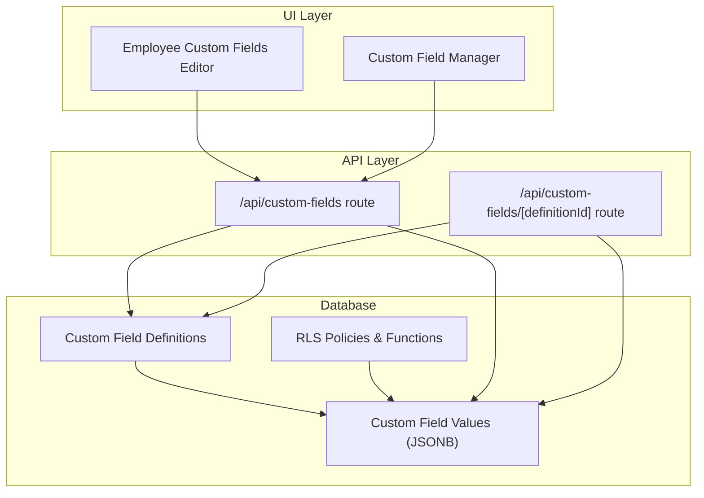
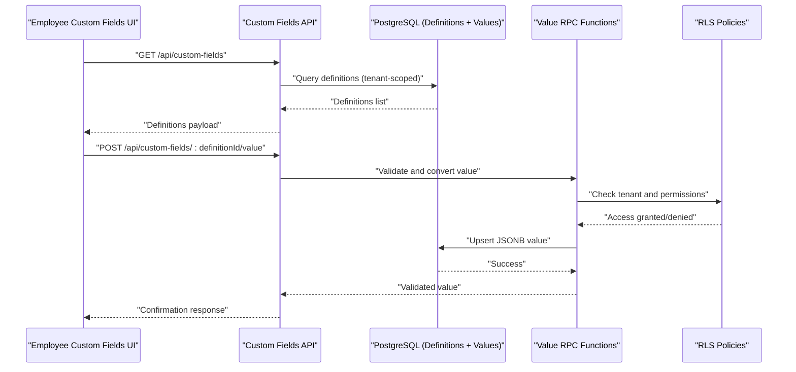
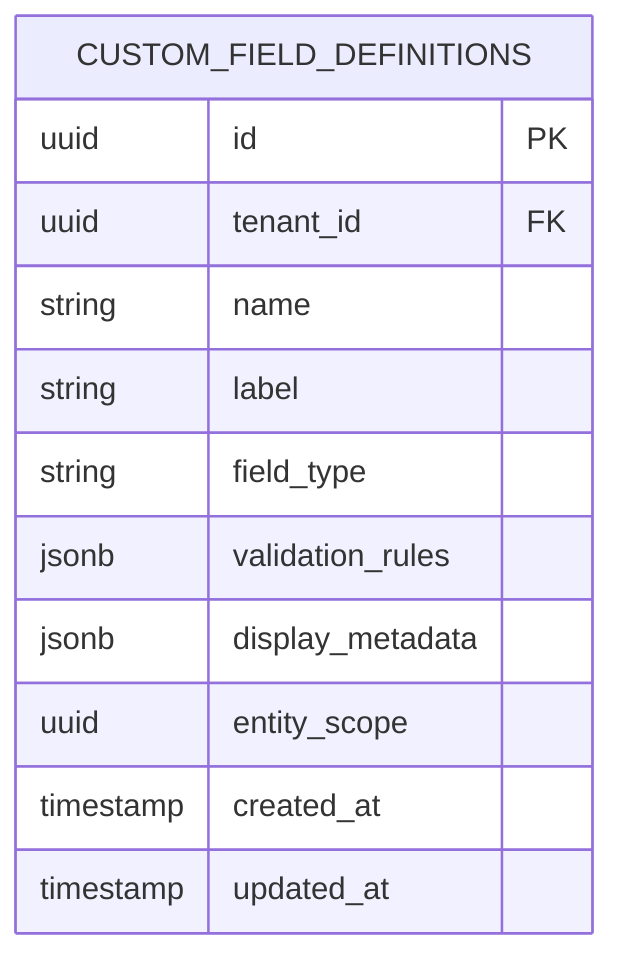
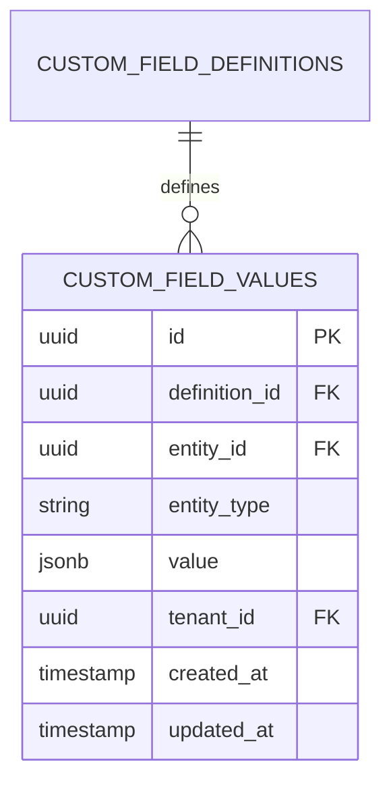
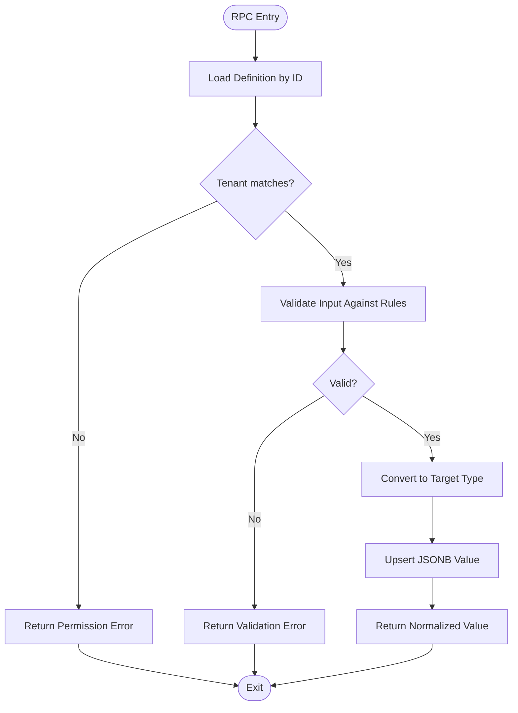
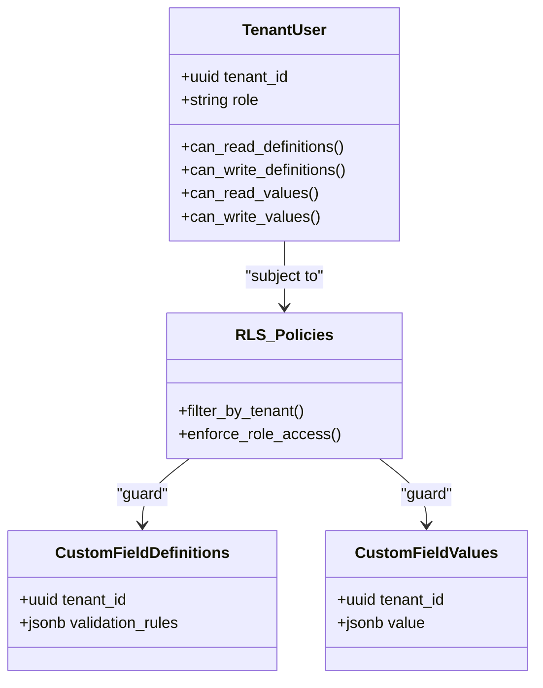
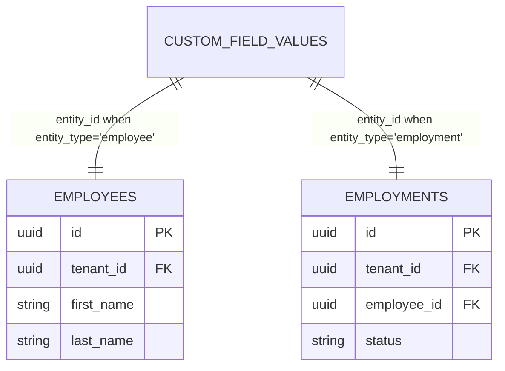
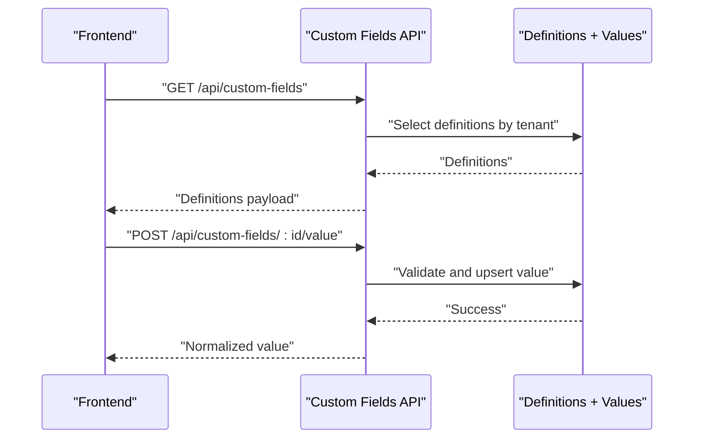
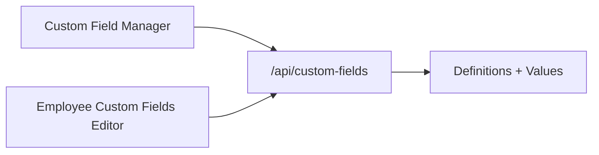
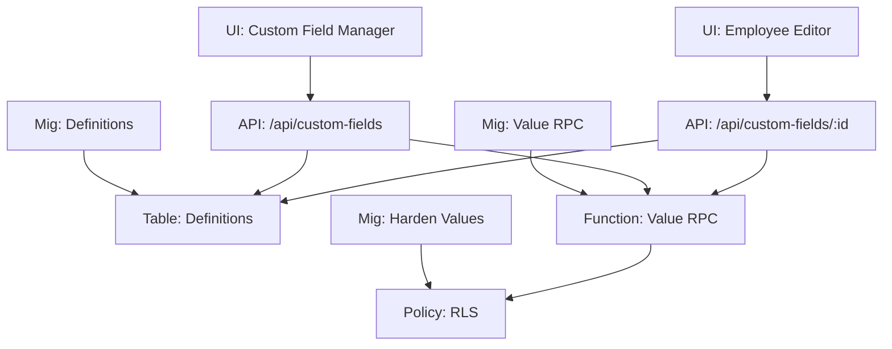

# Custom Fields Tables

<cite>
**Referenced Files in This Document**
- [20260715122802_add_custom_field_definitions.sql](file://apps/hr-suite/supabase/migrations/20260715122802_add_custom_field_definitions.sql)
- [20260715123119_add_custom_field_value_rpc.sql](file://apps/hr-suite/supabase/migrations/20260715123119_add_custom_field_value_rpc.sql)
- [20260715123927_harden_custom_field_values.sql](file://apps/hr-suite/supabase/migrations/20260715123927_harden_custom_field_values.sql)
- [20260715131230_seed_custom_fields_and_tenant_roles.sql](file://apps/hr-suite/supabase/migrations/20260715131230_seed_custom_fields_and_tenant_roles.sql)
- [custom_fields_isolation.sql](file://apps/hr-suite/supabase/tests/custom_fields_isolation.sql)
- [route.ts](file://apps/hr-suite/app/api/custom-fields/route.ts)
- [route.ts](file://apps/hr-suite/app/api/custom-fields/[definitionId]/route.ts)
- [employee-custom-fields.tsx](file://apps/hr-suite/components/custom-fields/employee-custom-fields.tsx)
- [custom-field-manager.tsx](file://apps/hr-suite/components/custom-fields/custom-field-manager.tsx)
- [VRIJE_VELDEN.md](file://docs/requirements/custom-fields/VRIJE_VELDEN.md)
</cite>

## Table of Contents
1. [Introduction](#introduction)
2. [Project Structure](#project-structure)
3. [Core Components](#core-components)
4. [Architecture Overview](#architecture-overview)
5. [Detailed Component Analysis](#detailed-component-analysis)
6. [Dependency Analysis](#dependency-analysis)
7. [Performance Considerations](#performance-considerations)
8. [Troubleshooting Guide](#troubleshooting-guide)
9. [Conclusion](#conclusion)
10. [Appendices](#appendices)

## Introduction
This document provides comprehensive data model documentation for LiquidHR’s custom fields system. It explains the schema for custom field definitions, dynamic value storage using JSONB, RPC functions for value retrieval and validation, security model with tenant isolation and permissions, relationships to HR entities (employees, employments), and operational guidance including creation patterns, validation strategies, performance optimization, migration, and backup considerations.

## Project Structure
The custom fields feature spans database migrations, API routes, UI components, and requirements documentation:
- Database schema and policies are defined in Supabase migrations under apps/hr-suite/supabase/migrations.
- API endpoints for custom fields live under apps/hr-suite/app/api/custom-fields.
- UI components for managing and editing custom fields are under apps/hr-suite/components/custom-fields.
- Requirements and design context are documented under docs/requirements/custom-fields.

**Diagram sources**
- [20260715122802_add_custom_field_definitions.sql](file://apps/hr-suite/supabase/migrations/20260715122802_add_custom_field_definitions.sql)
- [20260715123119_add_custom_field_value_rpc.sql](file://apps/hr-suite/supabase/migrations/20260715123119_add_custom_field_value_rpc.sql)
- [20260715123927_harden_custom_field_values.sql](file://apps/hr-suite/supabase/migrations/20260715123927_harden_custom_field_values.sql)
- [route.ts](file://apps/hr-suite/app/api/custom-fields/route.ts)
- [route.ts](file://apps/hr-suite/app/api/custom-fields/[definitionId]/route.ts)
- [employee-custom-fields.tsx](file://apps/hr-suite/components/custom-fields/employee-custom-fields.tsx)
- [custom-field-manager.tsx](file://apps/hr-suite/components/custom-fields/custom-field-manager.tsx)

**Section sources**
- [20260715122802_add_custom_field_definitions.sql](file://apps/hr-suite/supabase/migrations/20260715122802_add_custom_field_definitions.sql)
- [20260715123119_add_custom_field_value_rpc.sql](file://apps/hr-suite/supabase/migrations/20260715123119_add_custom_field_value_rpc.sql)
- [20260715123927_harden_custom_field_values.sql](file://apps/hr-suite/supabase/migrations/20260715123927_harden_custom_field_values.sql)
- [route.ts](file://apps/hr-suite/app/api/custom-fields/route.ts)
- [route.ts](file://apps/hr-suite/app/api/custom-fields/[definitionId]/route.ts)
- [employee-custom-fields.tsx](file://apps/hr-suite/components/custom-fields/employee-custom-fields.tsx)
- [custom-field-manager.tsx](file://apps/hr-suite/components/custom-fields/custom-field-manager.tsx)

## Core Components
- Custom Field Definitions table stores metadata about each custom field, including field type, validation rules, labels, visibility, and scoping to HR entity types.
- Custom Field Values table stores dynamic values per entity instance using a JSONB column, enabling flexible data typing while preserving definition-driven validation at write time.
- RPC functions encapsulate value retrieval, validation, and conversion logic based on the associated definition.
- RLS policies enforce tenant isolation and role-based access control for both definitions and values.

Key responsibilities:
- Definitions: define schema-like constraints for otherwise unstructured JSONB values.
- Values: store typed payloads per entity reference (e.g., employee_id, employment_id).
- RPCs: centralize validation and conversion to ensure consistency across clients.
- Security: isolate data by tenant and restrict mutations via RBAC.

**Section sources**
- [20260715122802_add_custom_field_definitions.sql](file://apps/hr-suite/supabase/migrations/20260715122802_add_custom_field_definitions.sql)
- [20260715123119_add_custom_field_value_rpc.sql](file://apps/hr-suite/supabase/migrations/20260715123119_add_custom_field_value_rpc.sql)
- [20260715123927_harden_custom_field_values.sql](file://apps/hr-suite/supabase/migrations/20260715123927_harden_custom_field_values.sql)

## Architecture Overview
The custom fields architecture combines a rigid metadata layer (definitions) with a flexible data layer (JSONB values), enforced by server-side RPCs and RLS policies.

**Diagram sources**
- [route.ts](file://apps/hr-suite/app/api/custom-fields/route.ts)
- [route.ts](file://apps/hr-suite/app/api/custom-fields/[definitionId]/route.ts)
- [20260715123119_add_custom_field_value_rpc.sql](file://apps/hr-suite/supabase/migrations/20260715123119_add_custom_field_value_rpc.sql)
- [20260715123927_harden_custom_field_values.sql](file://apps/hr-suite/supabase/migrations/20260715123927_harden_custom_field_values.sql)

## Detailed Component Analysis

### Data Model: Custom Field Definitions
- Purpose: Define the shape and behavior of custom fields.
- Attributes typically include:
  - Unique identifier and tenant scope
  - Human-readable label and description
  - Field type (string, number, boolean, date, enum, etc.)
  - Validation rules (required, min/max, regex, allowed values)
  - Display settings (order, visibility flags)
  - Entity scope (which HR entities can use the field)
- Indexing and constraints ensure efficient lookups and uniqueness within a tenant.

**Diagram sources**
- [20260715122802_add_custom_field_definitions.sql](file://apps/hr-suite/supabase/migrations/20260715122802_add_custom_field_definitions.sql)

**Section sources**
- [20260715122802_add_custom_field_definitions.sql](file://apps/hr-suite/supabase/migrations/20260715122802_add_custom_field_definitions.sql)

### Data Model: Custom Field Values (JSONB)
- Purpose: Store dynamic, typed values per entity instance.
- Key attributes:
  - Reference to the definition
  - Reference to the target entity (e.g., employee_id or employment_id)
  - JSONB payload holding the actual value
  - Tenant isolation key
- JSONB enables flexible schemas while definitions enforce validation at write time.

**Diagram sources**
- [20260715123119_add_custom_field_value_rpc.sql](file://apps/hr-suite/supabase/migrations/20260715123119_add_custom_field_value_rpc.sql)
- [20260715123927_harden_custom_field_values.sql](file://apps/hr-suite/supabase/migrations/20260715123927_harden_custom_field_values.sql)

**Section sources**
- [20260715123119_add_custom_field_value_rpc.sql](file://apps/hr-suite/supabase/migrations/20260715123119_add_custom_field_value_rpc.sql)
- [20260715123927_harden_custom_field_values.sql](file://apps/hr-suite/supabase/migrations/20260715123927_harden_custom_field_values.sql)

### RPC Functions: Value Retrieval, Validation, and Conversion
- Value retrieval:
  - Fetches values for a given entity and definition set.
  - Returns normalized payloads according to definition types.
- Validation:
  - Enforces required fields, type checks, and rule constraints from definitions.
  - Rejects invalid inputs early to maintain data integrity.
- Type conversion:
  - Converts raw JSONB values into application-friendly types.
  - Ensures consistent serialization across UI and services.

**Diagram sources**
- [20260715123119_add_custom_field_value_rpc.sql](file://apps/hr-suite/supabase/migrations/20260715123119_add_custom_field_value_rpc.sql)
- [20260715123927_harden_custom_field_values.sql](file://apps/hr-suite/supabase/migrations/20260715123927_harden_custom_field_values.sql)

**Section sources**
- [20260715123119_add_custom_field_value_rpc.sql](file://apps/hr-suite/supabase/migrations/20260715123119_add_custom_field_value_rpc.sql)
- [20260715123927_harden_custom_field_values.sql](file://apps/hr-suite/supabase/migrations/20260715123927_harden_custom_field_values.sql)

### Security Model: Tenant Isolation and Permissions
- Tenant isolation:
  - All queries and mutations filter by tenant_id.
  - RLS policies prevent cross-tenant data access.
- Role-based access:
  - Roles determine who can read/write definitions and values.
  - Fine-grained policies protect sensitive fields and bulk operations.
- Auditability:
  - Timestamps and optional audit trails support compliance.

**Diagram sources**
- [20260715123927_harden_custom_field_values.sql](file://apps/hr-suite/supabase/migrations/20260715123927_harden_custom_field_values.sql)
- [custom_fields_isolation.sql](file://apps/hr-suite/supabase/tests/custom_fields_isolation.sql)

**Section sources**
- [20260715123927_harden_custom_field_values.sql](file://apps/hr-suite/supabase/migrations/20260715123927_harden_custom_field_values.sql)
- [custom_fields_isolation.sql](file://apps/hr-suite/supabase/tests/custom_fields_isolation.sql)

### Relationships to HR Entities
- Custom fields attach to HR entities such as employees and employments through foreign keys and entity_type discriminator.
- This allows per-entity customization without altering core tables.
- UI components render relevant fields based on entity context.

**Diagram sources**
- [20260715123119_add_custom_field_value_rpc.sql](file://apps/hr-suite/supabase/migrations/20260715123119_add_custom_field_value_rpc.sql)
- [employee-custom-fields.tsx](file://apps/hr-suite/components/custom-fields/employee-custom-fields.tsx)

**Section sources**
- [20260715123119_add_custom_field_value_rpc.sql](file://apps/hr-suite/supabase/migrations/20260715123119_add_custom_field_value_rpc.sql)
- [employee-custom-fields.tsx](file://apps/hr-suite/components/custom-fields/employee-custom-fields.tsx)

### API Endpoints and Client Integration
- GET /api/custom-fields:
  - Returns available definitions scoped to the current tenant and user roles.
- POST /api/custom-fields/:definitionId/value:
  - Validates input against definition rules.
  - Persists normalized JSONB value.
- UI components consume these endpoints to render editors and managers.

**Diagram sources**
- [route.ts](file://apps/hr-suite/app/api/custom-fields/route.ts)
- [route.ts](file://apps/hr-suite/app/api/custom-fields/[definitionId]/route.ts)

**Section sources**
- [route.ts](file://apps/hr-suite/app/api/custom-fields/route.ts)
- [route.ts](file://apps/hr-suite/app/api/custom-fields/[definitionId]/route.ts)

### UI Components: Editing and Management
- Employee Custom Fields Editor:
  - Renders fields based on definitions for an employee context.
  - Submits validated values via API.
- Custom Field Manager:
  - Admin interface to create/edit definitions and assign entity scopes.

**Diagram sources**
- [custom-field-manager.tsx](file://apps/hr-suite/components/custom-fields/custom-field-manager.tsx)
- [employee-custom-fields.tsx](file://apps/hr-suite/components/custom-fields/employee-custom-fields.tsx)
- [route.ts](file://apps/hr-suite/app/api/custom-fields/route.ts)

**Section sources**
- [custom-field-manager.tsx](file://apps/hr-suite/components/custom-fields/custom-field-manager.tsx)
- [employee-custom-fields.tsx](file://apps/hr-suite/components/custom-fields/employee-custom-fields.tsx)
- [route.ts](file://apps/hr-suite/app/api/custom-fields/route.ts)

## Dependency Analysis
- Migrations establish schema, policies, and RPCs.
- API routes depend on definitions/values tables and invoke RPCs for validation/conversion.
- UI components depend on API endpoints and rely on definition metadata for rendering.

**Diagram sources**
- [20260715122802_add_custom_field_definitions.sql](file://apps/hr-suite/supabase/migrations/20260715122802_add_custom_field_definitions.sql)
- [20260715123119_add_custom_field_value_rpc.sql](file://apps/hr-suite/supabase/migrations/20260715123119_add_custom_field_value_rpc.sql)
- [20260715123927_harden_custom_field_values.sql](file://apps/hr-suite/supabase/migrations/20260715123927_harden_custom_field_values.sql)
- [route.ts](file://apps/hr-suite/app/api/custom-fields/route.ts)
- [route.ts](file://apps/hr-suite/app/api/custom-fields/[definitionId]/route.ts)

**Section sources**
- [20260715122802_add_custom_field_definitions.sql](file://apps/hr-suite/supabase/migrations/20260715122802_add_custom_field_definitions.sql)
- [20260715123119_add_custom_field_value_rpc.sql](file://apps/hr-suite/supabase/migrations/20260715123119_add_custom_field_value_rpc.sql)
- [20260715123927_harden_custom_field_values.sql](file://apps/hr-suite/supabase/migrations/20260715123927_harden_custom_field_values.sql)
- [route.ts](file://apps/hr-suite/app/api/custom-fields/route.ts)
- [route.ts](file://apps/hr-suite/app/api/custom-fields/[definitionId]/route.ts)

## Performance Considerations
- Use indexes on frequently queried columns (tenant_id, entity_id, entity_type, definition_id).
- Prefer batched reads/writes where possible to reduce round trips.
- Keep JSONB payloads small and structured; avoid deeply nested structures unless necessary.
- Leverage RPCs to perform validation and conversion server-side to minimize client overhead.
- Cache definition metadata on the client for faster rendering, with invalidation on updates.

[No sources needed since this section provides general guidance]

## Troubleshooting Guide
Common issues and resolutions:
- Permission denied:
  - Verify tenant_id alignment and user roles.
  - Inspect RLS policies for correct filters.
- Validation errors:
  - Ensure input conforms to definition validation_rules.
  - Check type conversions in RPCs.
- Missing values:
  - Confirm entity references and entity_type match expectations.
  - Validate that upsert paths are executed successfully.

**Section sources**
- [custom_fields_isolation.sql](file://apps/hr-suite/supabase/tests/custom_fields_isolation.sql)
- [20260715123927_harden_custom_field_values.sql](file://apps/hr-suite/supabase/migrations/20260715123927_harden_custom_field_values.sql)

## Conclusion
LiquidHR’s custom fields system balances flexibility and rigor by combining definition-driven metadata with JSONB-backed dynamic values. Server-side RPCs enforce validation and conversion, while RLS policies secure tenant isolation and role-based access. The design supports scalable extension of HR entity attributes without schema churn, enabling robust customization across tenants.

[No sources needed since this section summarizes without analyzing specific files]

## Appendices

### Examples: Creating Custom Fields and Validating Data
- Create a new definition with appropriate field_type and validation_rules.
- Assign entity_scope to limit applicability (e.g., employee or employment).
- Submit values via the API endpoint; the RPC validates and converts before persisting.

**Section sources**
- [20260715122802_add_custom_field_definitions.sql](file://apps/hr-suite/supabase/migrations/20260715122802_add_custom_field_definitions.sql)
- [20260715123119_add_custom_field_value_rpc.sql](file://apps/hr-suite/supabase/migrations/20260715123119_add_custom_field_value_rpc.sql)
- [route.ts](file://apps/hr-suite/app/api/custom-fields/route.ts)

### Migration Strategies and Backup Considerations
- Migrate definitions incrementally; test validation rules thoroughly before rollout.
- Back up both definitions and values to preserve tenant-specific configurations.
- Use versioned migrations to track changes and enable rollback if needed.

**Section sources**
- [20260715122802_add_custom_field_definitions.sql](file://apps/hr-suite/supabase/migrations/20260715122802_add_custom_field_definitions.sql)
- [20260715123119_add_custom_field_value_rpc.sql](file://apps/hr-suite/supabase/migrations/20260715123119_add_custom_field_value_rpc.sql)
- [20260715123927_harden_custom_field_values.sql](file://apps/hr-suite/supabase/migrations/20260715123927_harden_custom_field_values.sql)
- [20260715131230_seed_custom_fields_and_tenant_roles.sql](file://apps/hr-suite/supabase/migrations/20260715131230_seed_custom_fields_and_tenant_roles.sql)

### Requirements Context
- Refer to the custom fields requirements document for business context and usage patterns.

**Section sources**
- [VRIJE_VELDEN.md](file://docs/requirements/custom-fields/VRIJE_VELDEN.md)