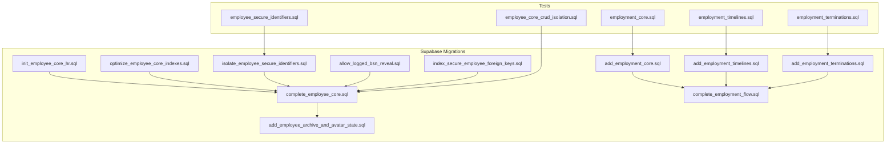
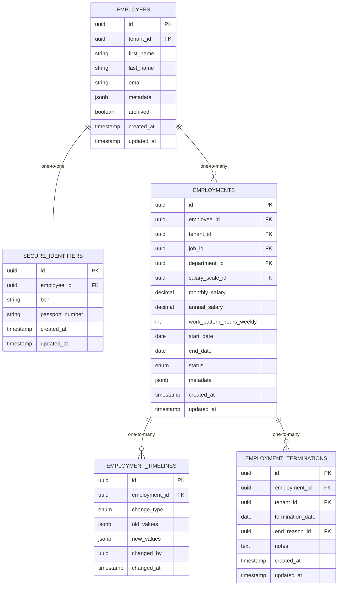
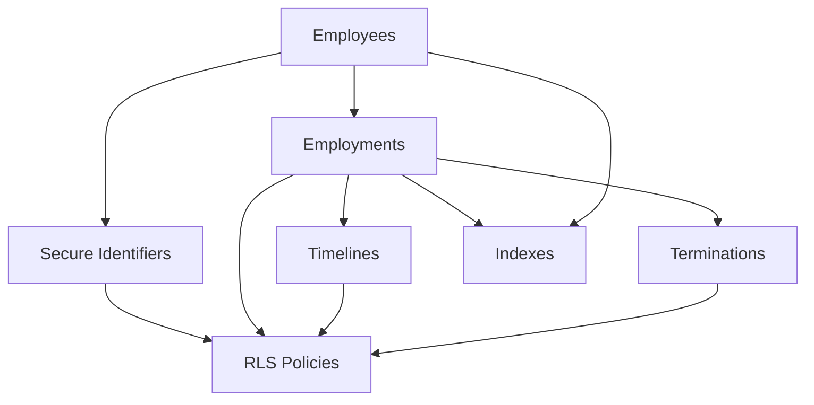

# Employee and Employment Tables

<cite>
**Referenced Files in This Document**
- [20260712124858_init_employee_core_hr.sql](file://apps/hr-suite/supabase/migrations/20260712124858_init_employee_core_hr.sql)
- [20260715071156_add_employment_core.sql](file://apps/hr-suite/supabase/migrations/20260715071156_add_employment_core.sql)
- [20260715071422_add_employment_timelines.sql](file://apps/hr-suite/supabase/migrations/20260715071422_add_employment_timelines.sql)
- [20260715071717_add_employment_terminations.sql](file://apps/hr-suite/supabase/migrations/20260715071717_add_employment_terminations.sql)
- [20260715120810_complete_employee_core.sql](file://apps/hr-suite/supabase/migrations/20260715120810_complete_employee_core.sql)
- [20260715121304_optimize_employee_core_indexes.sql](file://apps/hr-suite/supabase/migrations/20260715121304_optimize_employee_core_indexes.sql)
- [20260715124506_isolate_employee_secure_identifiers.sql](file://apps/hr-suite/supabase/migrations/20260715124506_isolate_employee_secure_identifiers.sql)
- [20260715124744_allow_logged_bsn_reveal.sql](file://apps/hr-suite/supabase/migrations/20260715124744_allow_logged_bsn_reveal.sql)
- [20260715130026_index_secure_employee_foreign_keys.sql](file://apps/hr-suite/supabase/migrations/20260715130026_index_secure_employee_foreign_keys.sql)
- [20260718150000_add_employee_archive_and_avatar_state.sql](file://apps/hr-suite/supabase/migrations/20260718150000_add_employee_archive_and_avatar_state.sql)
- [20260718100000_complete_employment_flow.sql](file://apps/hr-suite/supabase/migrations/20260718100000_complete_employment_flow.sql)
- [employee_core_crud_isolation.sql](file://apps/hr-suite/supabase/tests/employee_core_crud_isolation.sql)
- [employee_secure_identifiers.sql](file://apps/hr-suite/supabase/tests/employee_secure_identifiers.sql)
- [employment_core.sql](file://apps/hr-suite/supabase/tests/employment_core.sql)
- [employment_timelines.sql](file://apps/hr-suite/supabase/tests/employment_timelines.sql)
- [employment_terminations.sql](file://apps/hr-suite/supabase/tests/employment_terminations.sql)
</cite>

## Table of Contents
1. Introduction
2. Project Structure
3. Core Components
4. Architecture Overview
5. Detailed Component Analysis
6. Dependency Analysis
7. Performance Considerations
8. Troubleshooting Guide
9. Conclusion

## Introduction
This document provides a comprehensive data model reference for LiquidHR’s employee and employment core tables. It covers the employees table (personal information, secure identifiers such as BSN, avatar management, and archive status), the employments table (contract details, work patterns, salary information, and lifecycle states), and their relationships. It also documents timeline tracking tables for employment changes, termination records, audit trails, database indexes, foreign key constraints, triggers for data consistency, and Row Level Security policies that enforce tenant isolation. Sample data structures, validation rules, and business constraints are included to guide implementation and testing.

## Project Structure
The employee and employment data model is defined across multiple Supabase migrations and validated by tests. The most relevant files include:
- Initial employee core schema and later completions
- Employment core, timelines, and terminations
- Indexes and security hardening
- Tests validating CRUD operations, isolation, and security

**Diagram sources**
- [20260712124858_init_employee_core_hr.sql:1-200](file://apps/hr-suite/supabase/migrations/20260712124858_init_employee_core_hr.sql#L1-L200)
- [20260715120810_complete_employee_core.sql:1-200](file://apps/hr-suite/supabase/migrations/20260715120810_complete_employee_core.sql#L1-L200)
- [20260715071156_add_employment_core.sql:1-200](file://apps/hr-suite/supabase/migrations/20260715071156_add_employment_core.sql#L1-L200)
- [20260715071422_add_employment_timelines.sql:1-200](file://apps/hr-suite/supabase/migrations/20260715071422_add_employment_timelines.sql#L1-L200)
- [20260715071717_add_employment_terminations.sql:1-200](file://apps/hr-suite/supabase/migrations/20260715071717_add_employment_terminations.sql#L1-L200)
- [20260715121304_optimize_employee_core_indexes.sql:1-200](file://apps/hr-suite/supabase/migrations/20260715121304_optimize_employee_core_indexes.sql#L1-L200)
- [20260715124506_isolate_employee_secure_identifiers.sql:1-200](file://apps/hr-suite/supabase/migrations/20260715124506_isolate_employee_secure_identifiers.sql#L1-L200)
- [20260715124744_allow_logged_bsn_reveal.sql:1-200](file://apps/hr-suite/supabase/migrations/20260715124744_allow_logged_bsn_reveal.sql#L1-L200)
- [20260715130026_index_secure_employee_foreign_keys.sql:1-200](file://apps/hr-suite/supabase/migrations/20260715130026_index_secure_employee_foreign_keys.sql#L1-L200)
- [20260718150000_add_employee_archive_and_avatar_state.sql:1-200](file://apps/hr-suite/supabase/migrations/20260718150000_add_employee_archive_and_avatar_state.sql#L1-L200)
- [20260718100000_complete_employment_flow.sql:1-200](file://apps/hr-suite/supabase/migrations/20260718100000_complete_employment_flow.sql#L1-L200)
- [employee_core_crud_isolation.sql:1-200](file://apps/hr-suite/supabase/tests/employee_core_crud_isolation.sql#L1-L200)
- [employee_secure_identifiers.sql:1-200](file://apps/hr-suite/supabase/tests/employee_secure_identifiers.sql#L1-L200)
- [employment_core.sql:1-200](file://apps/hr-suite/supabase/tests/employment_core.sql#L1-L200)
- [employment_timelines.sql:1-200](file://apps/hr-suite/supabase/tests/employment_timelines.sql#L1-L200)
- [employment_terminations.sql:1-200](file://apps/hr-suite/supabase/tests/employment_terminations.sql#L1-L200)

**Section sources**
- [20260712124858_init_employee_core_hr.sql:1-200](file://apps/hr-suite/supabase/migrations/20260712124858_init_employee_core_hr.sql#L1-L200)
- [20260715120810_complete_employee_core.sql:1-200](file://apps/hr-suite/supabase/migrations/202607151208120810_complete_employee_core.sql#L1-L200)
- [20260715071156_add_employment_core.sql:1-200](file://apps/hr-suite/supabase/migrations/20260715071156_add_employment_core.sql#L1-L200)
- [20260715071422_add_employment_timelines.sql:1-200](file://apps/hr-suite/supabase/migrations/20260715071422_add_employment_timelines.sql#L1-L200)
- [20260715071717_add_employment_terminations.sql:1-200](file://apps/hr-suite/supabase/migrations/20260715071717_add_employment_terminations.sql#L1-L200)
- [20260715121304_optimize_employee_core_indexes.sql:1-200](file://apps/hr-suite/supabase/migrations/20260715121304_optimize_employee_core_indexes.sql#L1-L200)
- [20260715124506_isolate_employee_secure_identifiers.sql:1-200](file://apps/hr-suite/supabase/migrations/20260715124506_isolate_employee_secure_identifiers.sql#L1-L200)
- [20260715124744_allow_logged_bsn_reveal.sql:1-200](file://apps/hr-suite/supabase/migrations/20260715124744_allow_logged_bsn_reveal.sql#L1-L200)
- [20260715130026_index_secure_employee_foreign_keys.sql:1-200](file://apps/hr-suite/supabase/migrations/20260715130026_index_secure_employee_foreign_keys.sql#L1-L200)
- [20260718150000_add_employee_archive_and_avatar_state.sql:1-200](file://apps/hr-suite/supabase/migrations/20260718150000_add_employee_archive_and_avatar_state.sql#L1-L200)
- [20260718100000_complete_employment_flow.sql:1-200](file://apps/hr-suite/supabase/migrations/20260718100000_complete_employment_flow.sql#L1-L200)

## Core Components
This section summarizes the primary entities and their responsibilities:
- Employees: personal identity, contact details, secure identifiers (BSN), avatar state, and archive flag.
- Employments: contract and job details, work patterns, salary scales/revisions, effective date ranges, and lifecycle states.
- Timelines: change events for employment attributes over time.
- Terminations: formal end-of-employment records with reasons and dates.
- Secure identifiers: isolated storage and controlled access for sensitive fields like BSN.
- Audit/activity entries: optional event logging for HR actions.

Key design goals:
- One-to-many relationship between employees and employments.
- Strong referential integrity via foreign keys.
- Tenant isolation enforced through Row Level Security policies.
- Time-based validity for employment records using effective date ranges.
- Controlled exposure of sensitive identifiers.

**Section sources**
- [20260712124858_init_employee_core_hr.sql:1-200](file://apps/hr-suite/supabase/migrations/20260712124858_init_employee_core_hr.sql#L1-L200)
- [20260715120810_complete_employee_core.sql:1-200](file://apps/hr-suite/supabase/migrations/20260715120810_complete_employee_core.sql#L1-L200)
- [20260715071156_add_employment_core.sql:1-200](file://apps/hr-suite/supabase/migrations/20260715071156_add_employment_core.sql#L1-L200)
- [20260715071422_add_employment_timelines.sql:1-200](file://apps/hr-suite/supabase/migrations/20260715071422_add_employment_timelines.sql#L1-L200)
- [20260715071717_add_employment_terminations.sql:1-200](file://apps/hr-suite/supabase/migrations/20260715071717_add_employment_terminations.sql#L1-L200)
- [20260715124506_isolate_employee_secure_identifiers.sql:1-200](file://apps/hr-suite/supabase/migrations/20260715124506_isolate_employee_secure_identifiers.sql#L1-L200)
- [20260718150000_add_employee_archive_and_avatar_state.sql:1-200](file://apps/hr-suite/supabase/migrations/20260718150000_add_employee_archive_and_avatar_state.sql#L1-L200)

## Architecture Overview
The data architecture centers on two core tables (employees, employments) with supporting timeline and termination tables. Security and performance are reinforced through RLS policies, indexes, and triggers.

**Diagram sources**
- [20260712124858_init_employee_core_hr.sql:1-200](file://apps/hr-suite/supabase/migrations/20260712124858_init_employee_core_hr.sql#L1-L200)
- [20260715120810_complete_employee_core.sql:1-200](file://apps/hr-suite/supabase/migrations/20260715120810_complete_employee_core.sql#L1-L200)
- [20260715071156_add_employment_core.sql:1-200](file://apps/hr-suite/supabase/migrations/20260715071156_add_employment_core.sql#L1-L200)
- [20260715071422_add_employment_timelines.sql:1-200](file://apps/hr-suite/supabase/migrations/20260715071422_add_employment_timelines.sql#L1-L200)
- [20260715071717_add_employment_terminations.sql:1-200](file://apps/hr-suite/supabase/migrations/20260715071717_add_employment_terminations.sql#L1-L200)
- [20260715124506_isolate_employee_secure_identifiers.sql:1-200](file://apps/hr-suite/supabase/migrations/20260715124506_isolate_employee_secure_identifiers.sql#L1-L200)

## Detailed Component Analysis

### Employees Table
Responsibilities:
- Stores personal identity and contact information.
- Includes an archive flag to soft-delete or hide inactive employees.
- Supports metadata for flexible attributes.

Key fields:
- id: unique identifier
- tenant_id: multi-tenant isolation
- first_name, last_name, email: personal identification
- metadata: JSONB for extensible attributes
- archived: boolean indicating archive status
- timestamps: created_at, updated_at

Validation and constraints:
- Non-null constraints on essential identity fields.
- Unique constraints on email per tenant where applicable.
- Archive flag prevents accidental deletion; soft-archive behavior.

Sample data structure:
- id: UUID
- tenant_id: UUID
- first_name: string
- last_name: string
- email: string
- metadata: JSON object
- archived: boolean
- created_at: timestamp
- updated_at: timestamp

**Section sources**
- [20260712124858_init_employee_core_hr.sql:1-200](file://apps/hr-suite/supabase/migrations/20260712124858_init_employee_core_hr.sql#L1-L200)
- [20260715120810_complete_employee_core.sql:1-200](file://apps/hr-suite/supabase/migrations/20260715120810_complete_employee_core.sql#L1-L200)
- [20260718150000_add_employee_archive_and_avatar_state.sql:1-200](file://apps/hr-suite/supabase/migrations/20260718150000_add_employee_archive_and_avatar_state.sql#L1-L200)

### Secure Identifiers (BSN)
Responsibilities:
- Isolates sensitive identifiers such as BSN and passport number.
- Enforces strict access controls via RLS policies.
- Allows controlled reveal for logged-in users with appropriate permissions.

Key fields:
- id: unique identifier
- employee_id: foreign key to employees
- bsn: encrypted or restricted field
- passport_number: restricted field
- timestamps: created_at, updated_at

Access control:
- Policies restrict reads/writes to authorized tenants and roles.
- Separate policy allows logged-in users to reveal BSN under specific conditions.

Sample data structure:
- id: UUID
- employee_id: UUID
- bsn: string (restricted)
- passport_number: string (restricted)
- created_at: timestamp
- updated_at: timestamp

**Section sources**
- [20260715124506_isolate_employee_secure_identifiers.sql:1-200](file://apps/hr-suite/supabase/migrations/20260715124506_isolate_employee_secure_identifiers.sql#L1-L200)
- [20260715124744_allow_logged_bsn_reveal.sql:1-200](file://apps/hr-suite/supabase/migrations/20260715124744_allow_logged_bsn_reveal.sql#L1-L200)
- [employee_secure_identifiers.sql:1-200](file://apps/hr-suite/supabase/tests/employee_secure_identifiers.sql#L1-L200)

### Avatar Management
Responsibilities:
- Tracks avatar state for employees.
- Integrates with file storage and UI components.

Key aspects:
- Avatar URL or blob reference stored alongside employee or in a dedicated table.
- Update flows ensure only authorized users can modify avatar data.

Sample data structure:
- employee_id: UUID
- avatar_url: string
- updated_at: timestamp

**Section sources**
- [20260718150000_add_employee_archive_and_avatar_state.sql:1-200](file://apps/hr-suite/supabase/migrations/20260718150000_add_employee_archive_and_avatar_state.sql#L1-L200)

### Employments Table
Responsibilities:
- Captures contract details, job assignments, work patterns, and compensation.
- Manages employment lifecycle states and effective date ranges.

Key fields:
- id: unique identifier
- employee_id: foreign key to employees
- tenant_id: multi-tenant isolation
- job_id: reference to job catalog
- department_id: organizational assignment
- salary_scale_id: compensation scale reference
- monthly_salary, annual_salary: compensation values
- work_pattern_hours_weekly: weekly hours pattern
- start_date, end_date: effective range
- status: lifecycle state (e.g., active, terminated)
- metadata: JSONB for additional context
- timestamps: created_at, updated_at

Lifecycle states:
- Active: current valid employment period.
- Terminated: ended employment with termination record.
- Pending/Probation: transitional states if configured.

Business constraints:
- Overlapping date ranges prevented within same employee and job scope.
- Salary values must be non-negative.
- Status transitions governed by policies and triggers.

Sample data structure:
- id: UUID
- employee_id: UUID
- tenant_id: UUID
- job_id: UUID
- department_id: UUID
- salary_scale_id: UUID
- monthly_salary: numeric
- annual_salary: numeric
- work_pattern_hours_weekly: integer
- start_date: date
- end_date: date
- status: enum
- metadata: JSON object
- created_at: timestamp
- updated_at: timestamp

**Section sources**
- [20260715071156_add_employment_core.sql:1-200](file://apps/hr-suite/supabase/migrations/20260715071156_add_employment_core.sql#L1-L200)
- [20260718100000_complete_employment_flow.sql:1-200](file://apps/hr-suite/supabase/migrations/20260718100000_complete_employment_flow.sql#L1-L200)
- [employment_core.sql:1-200](file://apps/hr-suite/supabase/tests/employment_core.sql#L1-L200)

### Employment Timeline Tracking
Responsibilities:
- Records changes to employment attributes over time.
- Enables auditability and historical analysis.

Key fields:
- id: unique identifier
- employment_id: foreign key to employments
- change_type: type of change (e.g., salary_update, status_change)
- old_values: JSON snapshot of previous values
- new_values: JSON snapshot of updated values
- changed_by: user who made the change
- changed_at: timestamp

Sample data structure:
- id: UUID
- employment_id: UUID
- change_type: enum
- old_values: JSON object
- new_values: JSON object
- changed_by: UUID
- changed_at: timestamp

**Section sources**
- [20260715071422_add_employment_timelines.sql:1-200](file://apps/hr-suite/supabase/migrations/20260715071422_add_employment_timelines.sql#L1-L200)
- [employment_timelines.sql:1-200](file://apps/hr-suite/supabase/tests/employment_timelines.sql#L1-L200)

### Employment Terminations
Responsibilities:
- Formalizes end-of-employment events with reasons and notes.
- Links to employment records and supports reporting.

Key fields:
- id: unique identifier
- employment_id: foreign key to employments
- tenant_id: multi-tenant isolation
- termination_date: effective end date
- end_reason_id: reference to end reason catalog
- notes: free-text explanation
- timestamps: created_at, updated_at

Sample data structure:
- id: UUID
- employment_id: UUID
- tenant_id: UUID
- termination_date: date
- end_reason_id: UUID
- notes: string
- created_at: timestamp
- updated_at: timestamp

**Section sources**
- [20260715071717_add_employment_terminations.sql:1-200](file://apps/hr-suite/supabase/migrations/20260715071717_add_employment_terminations.sql#L1-L200)
- [employment_terminations.sql:1-200](file://apps/hr-suite/supabase/tests/employment_terminations.sql#L1-L200)

### Relationships and Referential Integrity
- Employees to Employments: one-to-many; each employee can have multiple employments over time.
- Secure Identifiers to Employees: one-to-one; sensitive data isolated per employee.
- Employments to Timelines: one-to-many; detailed change history per employment.
- Employments to Terminations: one-to-many; termination records per employment.

Constraints:
- Foreign keys enforce referential integrity.
- Unique constraints prevent duplicate emails per tenant where applicable.
- Date overlap checks ensure no conflicting active periods.

**Section sources**
- [20260715130026_index_secure_employee_foreign_keys.sql:1-200](file://apps/hr-suite/supabase/migrations/20260715130026_index_secure_employee_foreign_keys.sql#L1-L200)
- [20260715071156_add_employment_core.sql:1-200](file://apps/hr-suite/supabase/migrations/20260715071156_add_employment_core.sql#L1-L200)

### Database Indexes
Indexes optimize queries for common access patterns:
- Employee lookup by tenant and email.
- Employment queries by employee_id and status.
- Secure identifiers lookups by employee_id.
- Timeline queries by employment_id and changed_at.

Performance considerations:
- Composite indexes for tenant-scoped filters.
- Partial indexes for active employments.
- Indexing on frequently filtered columns (status, dates).

**Section sources**
- [20260715121304_optimize_employee_core_indexes.sql:1-200](file://apps/hr-suite/supabase/migrations/20260715121304_optimize_employee_core_indexes.sql#L1-L200)
- [20260715130026_index_secure_employee_foreign_keys.sql:1-200](file://apps/hr-suite/supabase/migrations/20260715130026_index_secure_employee_foreign_keys.sql#L1-L200)

### Triggers for Data Consistency
Triggers maintain integrity and auditability:
- Before insert/update on employments to validate date ranges and status transitions.
- After insert/update on employments to create timeline entries.
- On termination to update employment status and close overlapping periods.

Consistency guarantees:
- Prevents invalid state transitions.
- Ensures timeline captures all meaningful changes.
- Maintains accurate effective date ranges.

**Section sources**
- [20260718100000_complete_employment_flow.sql:1-200](file://apps/hr-suite/supabase/migrations/20260718100000_complete_employment_flow.sql#L1-L200)
- [20260715071422_add_employment_timelines.sql:1-200](file://apps/hr-suite/supabase/migrations/20260715071422_add_employment_timelines.sql#L1-L200)

### Row Level Security Policies
RLS enforces tenant isolation and role-based access:
- Employees: read/write scoped to tenant_id and user roles.
- Secure identifiers: restricted reads; conditional reveal for logged-in users.
- Employments: tenant-scoped access; write permissions limited to HR roles.
- Timelines and terminations: inherited from employment tenant scope.

Policy examples:
- Allow select on employees where tenant_id matches session tenant.
- Deny access to secure identifiers unless explicit permission granted.
- Restrict updates to employments to authorized users within tenant.

**Section sources**
- [20260715124506_isolate_employee_secure_identifiers.sql:1-200](file://apps/hr-suite/supabase/migrations/20260715124506_isolate_employee_secure_identifiers.sql#L1-L200)
- [20260715124744_allow_logged_bsn_reveal.sql:1-200](file://apps/hr-suite/supabase/migrations/20260715124744_allow_logged_bsn_reveal.sql#L1-L200)
- [employee_core_crud_isolation.sql:1-200](file://apps/hr-suite/supabase/tests/employee_core_crud_isolation.sql#L1-L200)

## Dependency Analysis
The data model exhibits clear dependency chains:
- Employees are foundational; employments depend on employees.
- Secure identifiers depend on employees but are isolated for security.
- Timelines and terminations depend on employments for historical and closure records.
- Indexes and policies support efficient and secure access patterns.

**Diagram sources**
- [20260715071156_add_employment_core.sql:1-200](file://apps/hr-suite/supabase/migrations/20260715071156_add_employment_core.sql#L1-L200)
- [20260715071422_add_employment_timelines.sql:1-200](file://apps/hr-suite/supabase/migrations/20260715071422_add_employment_timelines.sql#L1-L200)
- [20260715071717_add_employment_terminations.sql:1-200](file://apps/hr-suite/supabase/migrations/20260715071717_add_employment_terminations.sql#L1-L200)
- [20260715121304_optimize_employee_core_indexes.sql:1-200](file://apps/hr-suite/supabase/migrations/20260715121304_optimize_employee_core_indexes.sql#L1-L200)
- [20260715124506_isolate_employee_secure_identifiers.sql:1-200](file://apps/hr-suite/supabase/migrations/20260715124506_isolate_employee_secure_identifiers.sql#L1-L200)

**Section sources**
- [20260715071156_add_employment_core.sql:1-200](file://apps/hr-suite/supabase/migrations/20260715071156_add_employment_core.sql#L1-L200)
- [20260715071422_add_employment_timelines.sql:1-200](file://apps/hr-suite/supabase/migrations/20260715071422_add_employment_timelines.sql#L1-L200)
- [20260715071717_add_employment_terminations.sql:1-200](file://apps/hr-suite/supabase/migrations/20260715071717_add_employment_terminations.sql#L1-L200)
- [20260715121304_optimize_employee_core_indexes.sql:1-200](file://apps/hr-suite/supabase/migrations/20260715121304_optimize_employee_core_indexes.sql#L1-L200)
- [20260715124506_isolate_employee_secure_identifiers.sql:1-200](file://apps/hr-suite/supabase/migrations/20260715124506_isolate_employee_secure_identifiers.sql#L1-L200)

## Performance Considerations
- Use composite indexes on tenant_id and commonly filtered columns (email, status).
- Leverage partial indexes for active employments to speed up queries.
- Avoid selecting sensitive fields unless necessary; rely on policies for controlled access.
- Batch timeline inserts to reduce overhead during bulk updates.
- Monitor query plans for expensive joins between employments and timelines.

[No sources needed since this section provides general guidance]

## Troubleshooting Guide
Common issues and resolutions:
- Access denied on secure identifiers: verify RLS policies and user permissions.
- Duplicate email errors: check tenant-specific uniqueness constraints.
- Overlapping employment dates: ensure triggers enforce non-overlapping ranges.
- Missing timeline entries: confirm after-insert/update triggers are firing.
- Tenant isolation failures: validate tenant_id propagation in sessions and requests.

Debugging steps:
- Inspect RLS policy definitions and session context.
- Review trigger functions for validation logic.
- Check indexes for missing or outdated entries.
- Validate test suites for expected behaviors.

**Section sources**
- [employee_secure_identifiers.sql:1-200](file://apps/hr-suite/supabase/tests/employee_secure_identifiers.sql#L1-L200)
- [employment_core.sql:1-200](file://apps/hr-suite/supabase/tests/employment_core.sql#L1-L200)
- [employment_timelines.sql:1-200](file://apps/hr-suite/supabase/tests/employment_timelines.sql#L1-L200)
- [employment_terminations.sql:1-200](file://apps/hr-suite/supabase/tests/employment_terminations.sql#L1-L200)

## Conclusion
LiquidHR’s employee and employment data model provides a robust foundation for HR operations. The separation of personal identity, secure identifiers, and employment records ensures clarity and security. Timeline tracking and termination records enable comprehensive auditability. Strong indexing, triggers, and RLS policies support performance and tenant isolation. Adhering to the documented constraints and validation rules will maintain data integrity and compliance.

[No sources needed since this section summarizes without analyzing specific files]