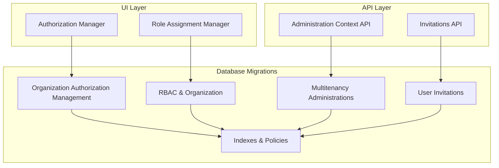
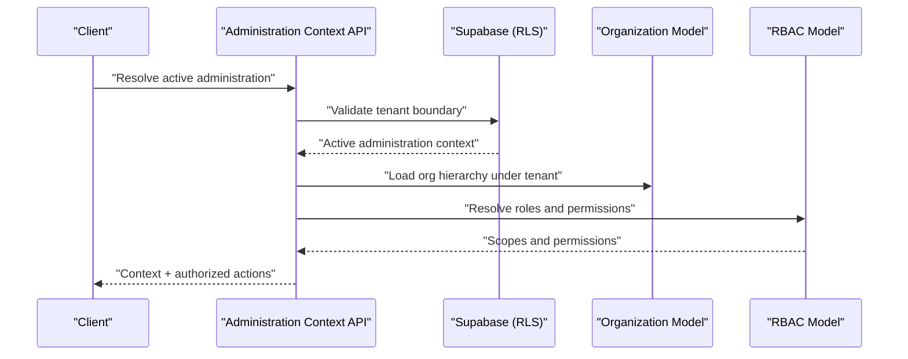
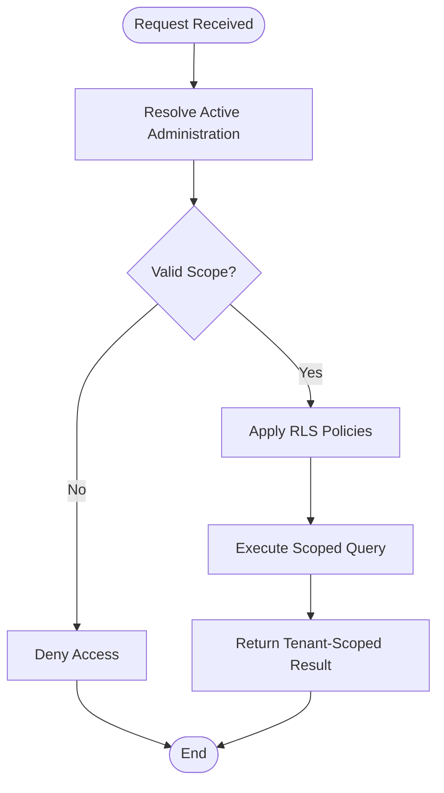
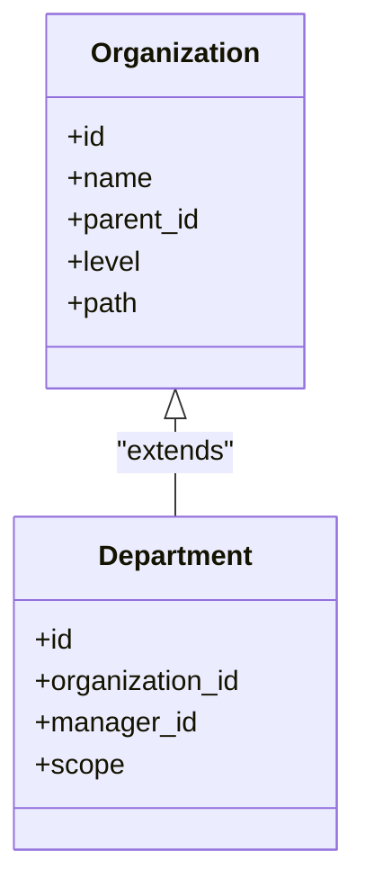
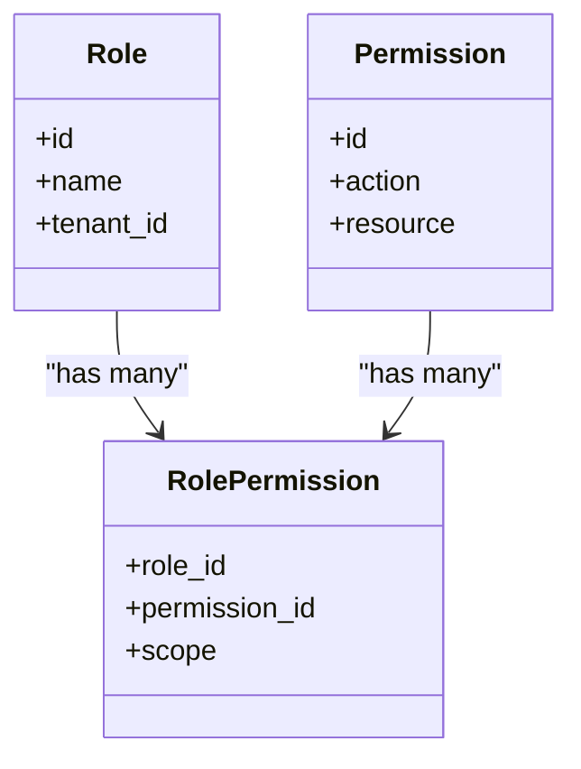
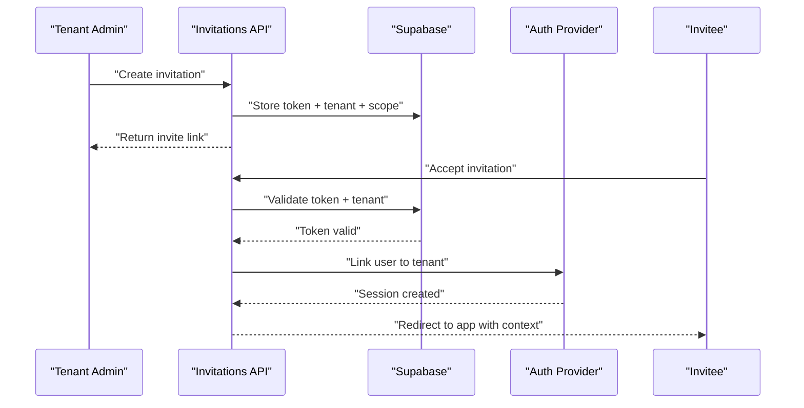
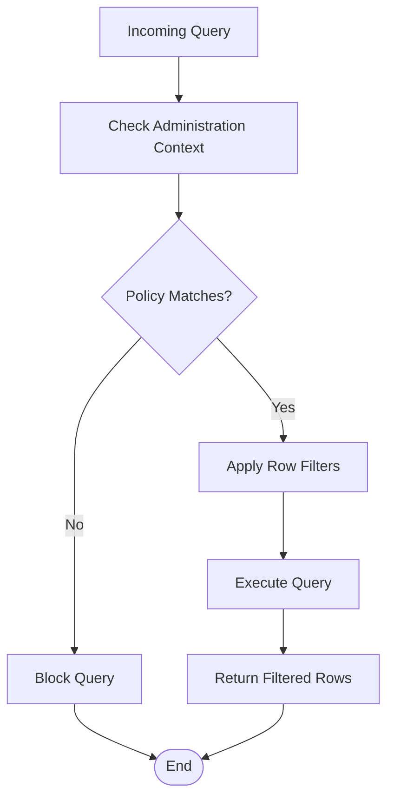
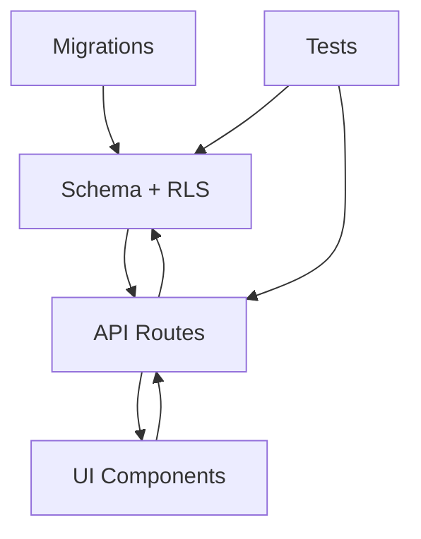

# Organization and Tenant Tables

<cite>
**Referenced Files in This Document**
- [20260714174305_add_multitenancy_administrations.sql](file://apps/hr-suite/supabase/migrations/20260714174305_add_multitenancy_administrations.sql)
- [20260714175659_seed_multitenancy_demo.sql](file://apps/hr-suite/supabase/migrations/20260714175659_seed_multitenancy_demo.sql)
- [20260714180142_enforce_administration_management_scope.sql](file://apps/hr-suite/supabase/migrations/20260714180142_enforce_administration_management_scope.sql)
- [20260714180309_index_employee_organization_scope_foreign_keys.sql](file://apps/hr-suite/supabase/migrations/20260714180309_index_employee_organization_scope_foreign_keys.sql)
- [20260715064245_add_user_invitations.sql](file://apps/hr-suite/supabase/migrations/20260715064245_add_user_invitations.sql)
- [20260715064924_harden_user_invitation_acceptance.sql](file://apps/hr-suite/supabase/migrations/20260715064924_harden_user_invitation_acceptance.sql)
- [20260712124911_add_tenant_rbac_and_organization.sql](file://apps/hr-suite/supabase/migrations/20260712124911_add_tenant_rbac_and_organization.sql)
- [20260714170949_harden_organization_authorization.sql](file://apps/hr-suite/supabase/migrations/20260714170949_harden_organization_authorization.sql)
- [20260715123639_add_organization_authorization_management.sql](file://apps/hr-suite/supabase/migrations/20260715123639_add_organization_authorization_management.sql)
- [multitenancy_isolation.sql](file://apps/hr-suite/supabase/tests/multitenancy_isolation.sql)
- [user_invitation_isolation.sql](file://apps/hr-suite/supabase/tests/user_invitation_isolation.sql)
- [organization_authorization_management.sql](file://apps/hr-suite/supabase/tests/organization_authorization_management.sql)
- [route.ts](file://apps/hr-suite/app/api/context/administration/route.ts)
- [route.ts](file://apps/hr-suite/app/api/invitations/route.ts)
- [page.tsx](file://apps/hr-suite/app/invite/[token]/page.tsx)
- [actions.ts](file://apps/hr-suite/app/invite/[token]/actions.ts)
- [authorization-manager.tsx](file://apps/hr-suite/components/organization/authorization-manager.tsx)
- [role-assignment-manager.tsx](file://apps/hr-suite/components/organization/role-assignment-manager.tsx)
</cite>

## Table of Contents
1. [Introduction](#introduction)
2. [Project Structure](#project-structure)
3. [Core Components](#core-components)
4. [Architecture Overview](#architecture-overview)
5. [Detailed Component Analysis](#detailed-component-analysis)
6. [Dependency Analysis](#dependency-analysis)
7. [Performance Considerations](#performance-considerations)
8. [Troubleshooting Guide](#troubleshooting-guide)
9. [Conclusion](#conclusion)
10. [Appendices](#appendices)

## Introduction
This document provides comprehensive data model documentation for LiquidHR’s organization and multitenancy tables. It focuses on:
- The administrations table for tenant isolation, boundaries, and scope management
- The organizations table for department hierarchy, organizational structure, and reporting relationships
- Roles and permissions system including role definitions, permission assignments, and authorization scopes
- User-invitation mechanisms, authentication integration, and session management
- Row Level Security (RLS) policies enforcing tenant isolation and data segregation
- Performance considerations for multi-tenant queries, indexing strategies for hierarchies, and security implications of tenant boundaries
- Practical examples for tenant setup, role assignment workflows, and authorization patterns

## Project Structure
The relevant implementation spans database migrations, API routes, UI components, and tests that validate isolation and authorization behavior. Key areas include:
- Database schema and RLS policies defined in Supabase migrations
- API endpoints for administration context and invitations
- UI components for authorization and role assignment
- Tests validating tenant isolation and invitation flows

**Diagram sources**
- [20260714174305_add_multitenancy_administrations.sql](file://apps/hr-suite/supabase/migrations/20260714174305_add_multitenancy_administrations.sql)
- [20260712124911_add_tenant_rbac_and_organization.sql](file://apps/hr-suite/supabase/migrations/20260712124911_add_tenant_rbac_and_organization.sql)
- [20260715123639_add_organization_authorization_management.sql](file://apps/hr-suite/supabase/migrations/20260715123639_add_organization_authorization_management.sql)
- [20260715064245_add_user_invitations.sql](file://apps/hr-suite/supabase/migrations/20260715064245_add_user_invitations.sql)
- [20260714180309_index_employee_organization_scope_foreign_keys.sql](file://apps/hr-suite/supabase/migrations/20260714180309_index_employee_organization_scope_foreign_keys.sql)
- [route.ts](file://apps/hr-suite/app/api/context/administration/route.ts)
- [route.ts](file://apps/hr-suite/app/api/invitations/route.ts)
- [authorization-manager.tsx](file://apps/hr-suite/components/organization/authorization-manager.tsx)
- [role-assignment-manager.tsx](file://apps/hr-suite/components/organization/role-assignment-manager.tsx)

**Section sources**
- [20260714174305_add_multitenancy_administrations.sql](file://apps/hr-suite/supabase/migrations/20260714174305_add_multitenancy_administrations.sql)
- [20260712124911_add_tenant_rbac_and_organization.sql](file://apps/hr-suite/supabase/migrations/20260712124911_add_tenant_rbac_and_organization.sql)
- [20260715123639_add_organization_authorization_management.sql](file://apps/hr-suite/supabase/migrations/20260715123639_add_organization_authorization_management.sql)
- [20260715064245_add_user_invitations.sql](file://apps/hr-suite/supabase/migrations/20260715064245_add_user_invitations.sql)
- [20260714180309_index_employee_organization_scope_foreign_keys.sql](file://apps/hr-suite/supabase/migrations/20260714180309_index_employee_organization_scope_foreign_keys.sql)
- [route.ts](file://apps/hr-suite/app/api/context/administration/route.ts)
- [route.ts](file://apps/hr-suite/app/api/invitations/route.ts)
- [authorization-manager.tsx](file://apps/hr-suite/components/organization/authorization-manager.tsx)
- [role-assignment-manager.tsx](file://apps/hr-suite/components/organization/role-assignment-manager.tsx)

## Core Components
- Multitenancy Administrations: Defines tenant boundaries and scope enforcement for all operations within a tenant context.
- RBAC & Organization: Establishes roles, permissions, and organizational entities such as departments and their hierarchical relationships.
- Organization Authorization Management: Provides mechanisms to manage authorization scopes across the organization.
- User Invitations: Supports secure user onboarding into a specific tenant with scoped access.
- Indexes & Policies: Ensures performance and enforces tenant isolation via Row Level Security.

Key responsibilities:
- Enforce strict tenant isolation at the database layer using RLS policies
- Provide APIs to switch or resolve active administration context per request
- Manage role definitions and permission assignments scoped to tenants and organization units
- Support invitation-based user onboarding with tokenized acceptance flows

**Section sources**
- [20260714174305_add_multitenancy_administrations.sql](file://apps/hr-suite/supabase/migrations/20260714174305_add_multitenancy_administrations.sql)
- [20260712124911_add_tenant_rbac_and_organization.sql](file://apps/hr-suite/supabase/migrations/20260712124911_add_tenant_rbac_and_organization.sql)
- [20260715123639_add_organization_authorization_management.sql](file://apps/hr-suite/supabase/migrations/20260715123639_add_organization_authorization_management.sql)
- [20260715064245_add_user_invitations.sql](file://apps/hr-suite/supabase/migrations/20260715064245_add_user_invitations.sql)
- [20260714180309_index_employee_organization_scope_foreign_keys.sql](file://apps/hr-suite/supabase/migrations/20260714180309_index_employee_organization_scope_foreign_keys.sql)

## Architecture Overview
The architecture integrates tenant-scoped data models with RBAC and organization structures, enforced by RLS policies. Requests flow through API routes that resolve the active administration context and apply tenant scoping to all downstream operations.

**Diagram sources**
- [route.ts](file://apps/hr-suite/app/api/context/administration/route.ts)
- [20260714174305_add_multitenancy_administrations.sql](file://apps/hr-suite/supabase/migrations/20260714174305_add_multitenancy_administrations.sql)
- [20260712124911_add_tenant_rbac_and_organization.sql](file://apps/hr-suite/supabase/migrations/20260712124911_add_tenant_rbac_and_organization.sql)

## Detailed Component Analysis

### Administrations Table (Tenant Isolation and Scope)
Purpose:
- Define tenant boundaries and enforce isolation across all data operations
- Provide scope management for administrative actions within a tenant

Key aspects:
- Each record represents a distinct tenant (administration)
- All queries must be filtered by the active administration context
- RLS policies ensure users can only access data belonging to their assigned administration

Security implications:
- Strict tenant isolation prevents cross-tenant data leakage
- Scope validation is enforced at the database layer, reducing risk of application-level bypass

Performance considerations:
- Indexing on foreign keys related to employee and organization scope improves query performance
- Avoid broad scans by always filtering on administration identifiers

**Diagram sources**
- [20260714174305_add_multitenancy_administrations.sql](file://apps/hr-suite/supabase/migrations/20260714174305_add_multitenancy_administrations.sql)
- [20260714180142_enforce_administration_management_scope.sql](file://apps/hr-suite/supabase/migrations/20260714180142_enforce_administration_management_scope.sql)
- [20260714180309_index_employee_organization_scope_foreign_keys.sql](file://apps/hr-suite/supabase/migrations/20260714180309_index_employee_organization_scope_foreign_keys.sql)

**Section sources**
- [20260714174305_add_multitenancy_administrations.sql](file://apps/hr-suite/supabase/migrations/20260714174305_add_multitenancy_administrations.sql)
- [20260714180142_enforce_administration_management_scope.sql](file://apps/hr-suite/supabase/migrations/20260714180142_enforce_administration_management_scope.sql)
- [20260714180309_index_employee_organization_scope_foreign_keys.sql](file://apps/hr-suite/supabase/migrations/20260714180309_index_employee_organization_scope_foreign_keys.sql)

### Organizations Table (Department Hierarchy and Reporting)
Purpose:
- Model organizational structure including departments and reporting relationships
- Support hierarchical navigation and scope-based visibility

Key aspects:
- Hierarchical relationships enable parent-child department modeling
- Reporting lines define managerial authority and data access scopes
- Queries should traverse hierarchy efficiently using indexed relationships

Performance considerations:
- Indexes on foreign keys support fast joins and hierarchy traversal
- Use recursive queries cautiously; consider materialized views for deep hierarchies if needed

**Diagram sources**
- [20260712124911_add_tenant_rbac_and_organization.sql](file://apps/hr-suite/supabase/migrations/20260712124911_add_tenant_rbac_and_organization.sql)
- [20260714170949_harden_organization_authorization.sql](file://apps/hr-suite/supabase/migrations/20260714170949_harden_organization_authorization.sql)

**Section sources**
- [20260712124911_add_tenant_rbac_and_organization.sql](file://apps/hr-suite/supabase/migrations/20260712124911_add_tenant_rbac_and_organization.sql)
- [20260714170949_harden_organization_authorization.sql](file://apps/hr-suite/supabase/migrations/20260714170949_harden_organization_authorization.sql)

### Roles and Permissions System
Purpose:
- Define roles and assign granular permissions within tenant and organizational scopes
- Control authorization based on role membership and scope boundaries

Key aspects:
- Role definitions specify allowed actions and resources
- Permission assignments are scoped to tenants and optionally to organization units
- Authorization checks combine role membership with scope validation

**Diagram sources**
- [20260712124911_add_tenant_rbac_and_organization.sql](file://apps/hr-suite/supabase/migrations/20260712124911_add_tenant_rbac_and_organization.sql)
- [20260715123639_add_organization_authorization_management.sql](file://apps/hr-suite/supabase/migrations/20260715123639_add_organization_authorization_management.sql)

**Section sources**
- [20260712124911_add_tenant_rbac_and_organization.sql](file://apps/hr-suite/supabase/migrations/20260712124911_add_tenant_rbac_and_organization.sql)
- [20260715123639_add_organization_authorization_management.sql](file://apps/hr-suite/supabase/migrations/20260715123639_add_organization_authorization_management.sql)

### User Invitations, Authentication, and Session Management
Purpose:
- Securely onboard users into a specific tenant via invitation tokens
- Integrate with authentication providers and manage session context

Key aspects:
- Invitation tokens link users to a target tenant and optional role
- Acceptance flow validates token integrity and assigns appropriate scopes
- Session management ensures consistent tenant context across requests

**Diagram sources**
- [20260715064245_add_user_invitations.sql](file://apps/hr-suite/supabase/migrations/20260715064245_add_user_invitations.sql)
- [20260715064924_harden_user_invitation_acceptance.sql](file://apps/hr-suite/supabase/migrations/20260715064924_harden_user_invitation_acceptance.sql)
- [route.ts](file://apps/hr-suite/app/api/invitations/route.ts)
- [page.tsx](file://apps/hr-suite/app/invite/[token]/page.tsx)
- [actions.ts](file://apps/hr-suite/app/invite/[token]/actions.ts)

**Section sources**
- [20260715064245_add_user_invitations.sql](file://apps/hr-suite/supabase/migrations/20260715064245_add_user_invitations.sql)
- [20260715064924_harden_user_invitation_acceptance.sql](file://apps/hr-suite/supabase/migrations/20260715064924_harden_user_invitation_acceptance.sql)
- [route.ts](file://apps/hr-suite/app/api/invitations/route.ts)
- [page.tsx](file://apps/hr-suite/app/invite/[token]/page.tsx)
- [actions.ts](file://apps/hr-suite/app/invite/[token]/actions.ts)

### Row Level Security Policies
Purpose:
- Enforce tenant isolation and data segregation at the database level
- Ensure users can only access data within their authorized scope

Key aspects:
- Policies filter queries by administration context
- Additional filters may apply based on organization hierarchy and role permissions
- Policies prevent cross-tenant data exposure even if application logic fails

**Diagram sources**
- [20260714174305_add_multitenancy_administrations.sql](file://apps/hr-suite/supabase/migrations/20260714174305_add_multitenancy_administrations.sql)
- [20260714180142_enforce_administration_management_scope.sql](file://apps/hr-suite/supabase/migrations/20260714180142_enforce_administration_management_scope.sql)

**Section sources**
- [20260714174305_add_multitenancy_administrations.sql](file://apps/hr-suite/supabase/migrations/20260714174305_add_multitenancy_administrations.sql)
- [20260714180142_enforce_administration_management_scope.sql](file://apps/hr-suite/supabase/migrations/20260714180142_enforce_administration_management_scope.sql)

## Dependency Analysis
The system exhibits clear separation between database schema, API layer, and UI components, with strong dependencies on RLS policies for security.

**Diagram sources**
- [20260714174305_add_multitenancy_administrations.sql](file://apps/hr-suite/supabase/migrations/20260714174305_add_multitenancy_administrations.sql)
- [20260712124911_add_tenant_rbac_and_organization.sql](file://apps/hr-suite/supabase/migrations/20260712124911_add_tenant_rbac_and_organization.sql)
- [route.ts](file://apps/hr-suite/app/api/context/administration/route.ts)
- [authorization-manager.tsx](file://apps/hr-suite/components/organization/authorization-manager.tsx)

**Section sources**
- [20260714174305_add_multitenancy_administrations.sql](file://apps/hr-suite/supabase/migrations/20260714174305_add_multitenancy_administrations.sql)
- [20260712124911_add_tenant_rbac_and_organization.sql](file://apps/hr-suite/supabase/migrations/20260712124911_add_tenant_rbac_and_organization.sql)
- [route.ts](file://apps/hr-suite/app/api/context/administration/route.ts)
- [authorization-manager.tsx](file://apps/hr-suite/components/organization/authorization-manager.tsx)

## Performance Considerations
- Always filter queries by administration context to avoid full-table scans
- Leverage indexes on foreign keys for efficient joins and hierarchy traversal
- Use materialized views for complex hierarchical queries when necessary
- Minimize cross-tenant operations to reduce contention and improve isolation
- Monitor query plans for RLS policy evaluation overhead

[No sources needed since this section provides general guidance]

## Troubleshooting Guide
Common issues and resolutions:
- Cross-tenant data access errors: Verify RLS policies and administration context resolution
- Invitation acceptance failures: Check token validity and tenant linkage
- Slow hierarchy queries: Review indexes and consider denormalization for frequently accessed paths
- Authorization denials: Confirm role assignments and scope boundaries

Validation references:
- Tenant isolation tests confirm proper data segregation
- Invitation isolation tests validate secure onboarding flows
- Organization authorization tests verify scope enforcement

**Section sources**
- [multitenancy_isolation.sql](file://apps/hr-suite/supabase/tests/multitenancy_isolation.sql)
- [user_invitation_isolation.sql](file://apps/hr-suite/supabase/tests/user_invitation_isolation.sql)
- [organization_authorization_management.sql](file://apps/hr-suite/supabase/tests/organization_authorization_management.sql)

## Conclusion
LiquidHR’s organization and multitenancy architecture provides robust tenant isolation, flexible organizational modeling, and secure role-based access control. By enforcing policies at the database layer and providing clear APIs for context resolution and invitation management, the system ensures both security and scalability. Proper indexing and query design further enhance performance for multi-tenant scenarios.

[No sources needed since this section summarizes without analyzing specific files]

## Appendices

### Example: Tenant Setup Workflow
1. Create a new administration record representing the tenant
2. Configure initial roles and permissions scoped to the tenant
3. Set up organizational hierarchy with departments and reporting lines
4. Invite users with appropriate scopes and roles
5. Validate RLS policies through test cases

### Example: Role Assignment Workflow
1. Define roles with specific permissions and scopes
2. Assign roles to users within the tenant context
3. Validate authorization through API calls and UI interactions
4. Monitor access patterns and adjust scopes as needed

### Example: Authorization Patterns
- Resource-based authorization: Check permissions against specific resources
- Scope-based authorization: Validate user access within organizational boundaries
- Context-aware authorization: Combine tenant, organization, and role information

[No sources needed since this section provides conceptual examples]