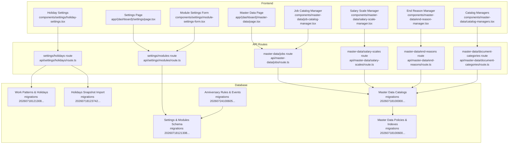
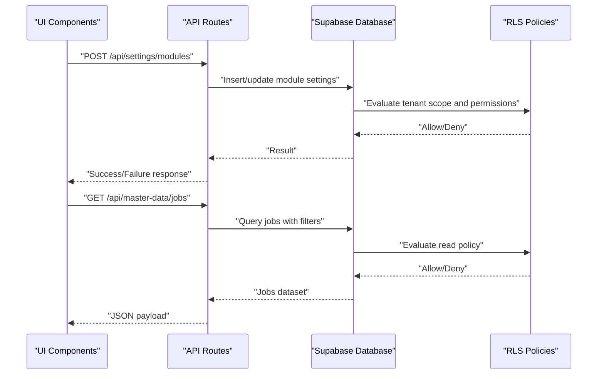
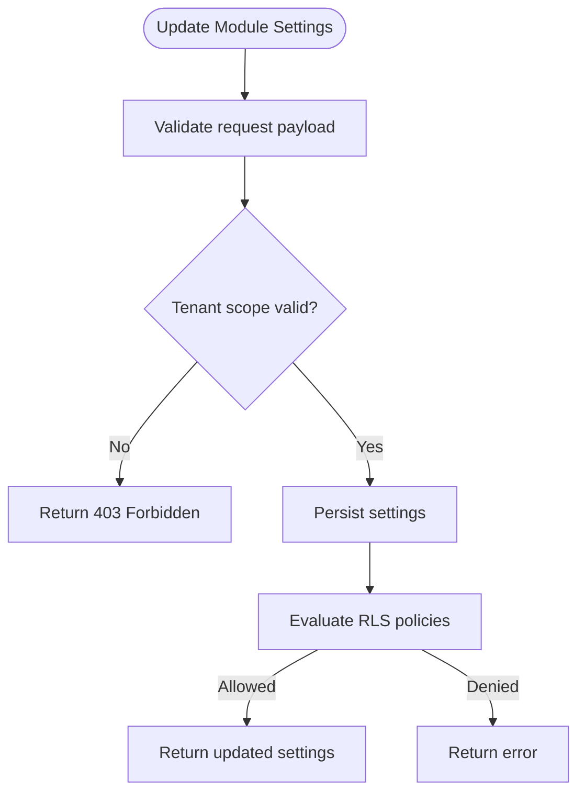
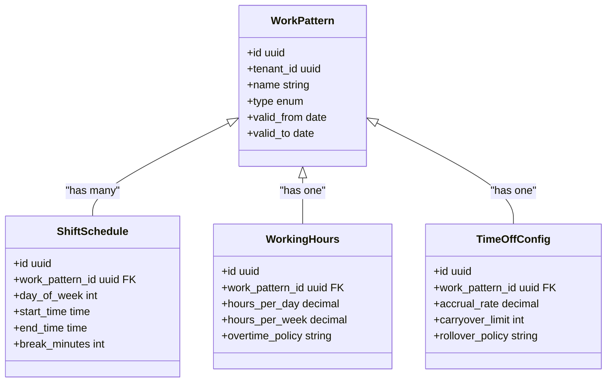
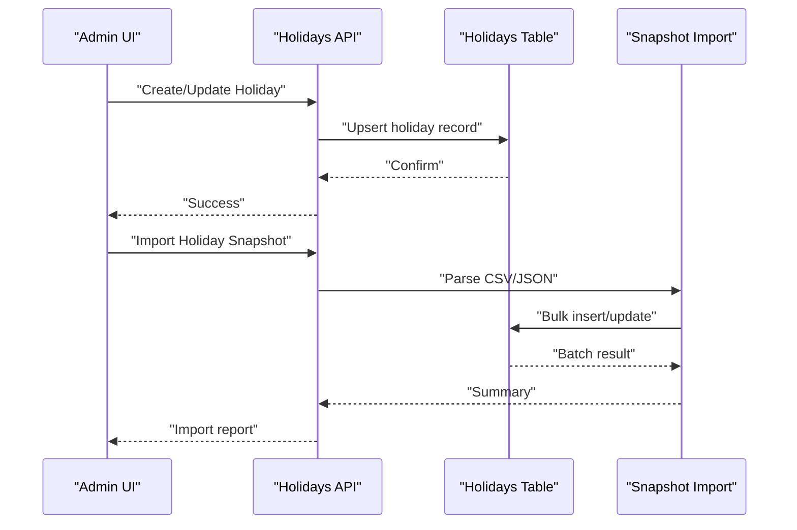
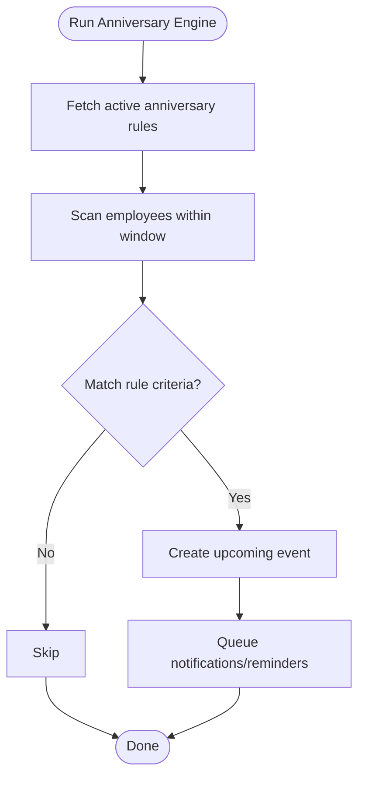
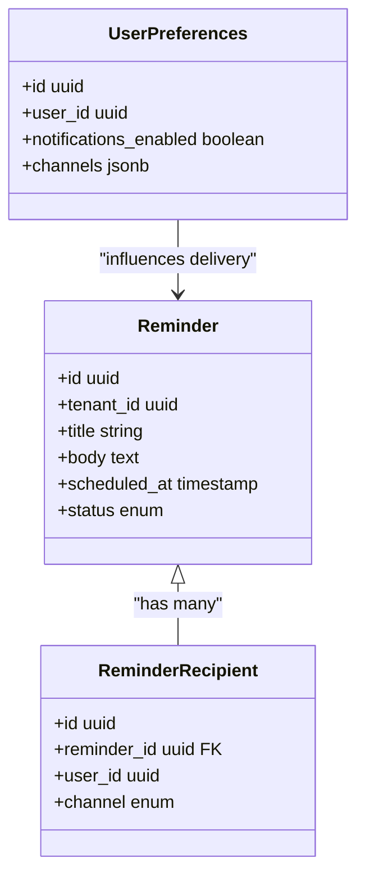
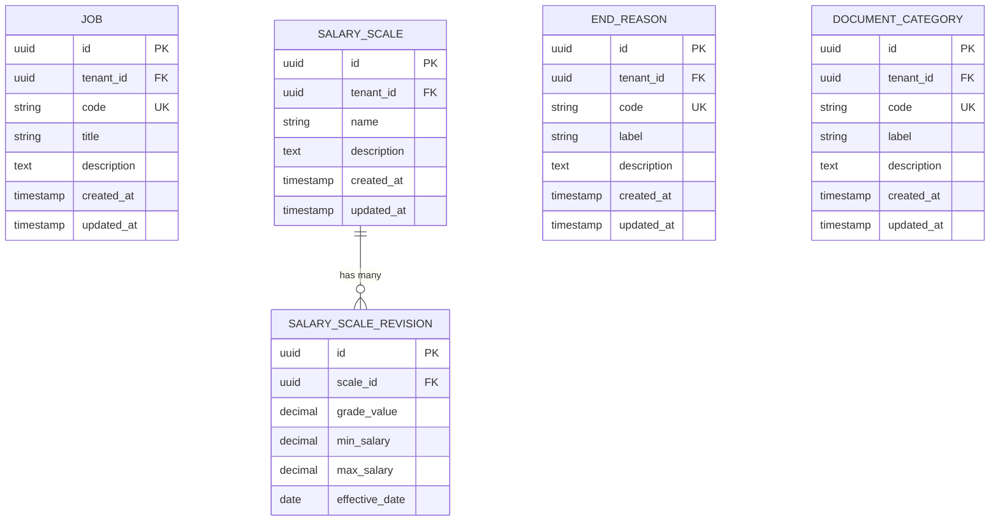
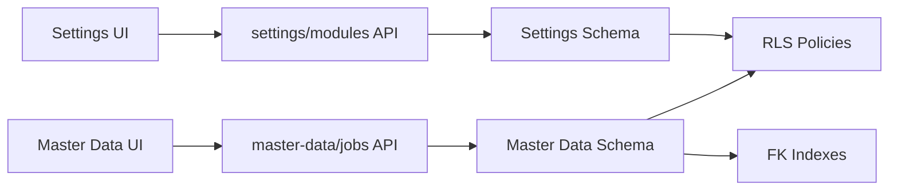

# Settings and Master Data Tables

<cite>
**Referenced Files in This Document**
- [20260718121308_add_settings_modules_work_patterns_holidays.sql](file://apps/hr-suite/supabase/migrations/20260718121308_add_settings_modules_work_patterns_holidays.sql)
- [20260718122138_harden_settings_rosters_holidays.sql](file://apps/hr-suite/supabase/migrations/20260718122138_harden_settings_rosters_holidays.sql)
- [20260718122614_enforce_optional_module_guards.sql](file://apps/hr-suite/supabase/migrations/20260718122614_enforce_optional_module_guards.sql)
- [20260718122751_expose_module_state_to_tenant_users.sql](file://apps/hr-suite/supabase/migrations/20260718122751_expose_module_state_to_tenant_users.sql)
- [20260718123742_add_holiday_snapshot_import.sql](file://apps/hr-suite/supabase/migrations/20260718123742_add_holiday_snapshot_import.sql)
- [20260718131000_harden_hr_master_data_document_policies.sql](file://apps/hr-suite/supabase/migrations/20260718131000_harden_hr_master_data_document_policies.sql)
- [20260718100000_add_job_catalog_salary_revisions.sql](file://apps/hr-suite/supabase/migrations/20260718100000_add_job_catalog_salary_revisions.sql)
- [20260718100500_add_master_data_mutation_rpcs.sql](file://apps/hr-suite/supabase/migrations/20260718100500_add_master_data_mutation_rpcs.sql)
- [20260718100600_index_master_data_foreign_keys.sql](file://apps/hr-suite/supabase/migrations/20260718100600_index_master_data_foreign_keys.sql)
- [20260724100605_upcoming_events_and_anniversary_rules.sql](file://apps/hr-suite/supabase/migrations/20260724100605_upcoming_events_and_anniversary_rules.sql)
- [route.ts (settings/modules)](file://apps/hr-suite/app/api/settings/modules/route.ts)
- [route.ts (settings/holidays)](file://apps/hr-suite/app/api/settings/holidays/route.ts)
- [route.ts (master-data/jobs)](file://apps/hr-suite/app/api/master-data/jobs/route.ts)
- [route.ts (master-data/salary-scales)](file://apps/hr-suite/app/api/master-data/salary-scales/route.ts)
- [route.ts (master-data/end-reasons)](file://apps/hr-suite/app/api/master-data/end-reasons/route.ts)
- [route.ts (master-data/document-categories)](file://apps/hr-suite/app/api/master-data/document-categories/route.ts)
- [page.tsx (settings page)](file://apps/hr-suite/app/(dashboard)/settings/page.tsx)
- [page.tsx (master-data page)](file://apps/hr-suite/app/(dashboard)/master-data/page.tsx)
- [module-settings-form.tsx](file://apps/hr-suite/components/settings/module-settings-form.tsx)
- [holiday-settings.tsx](file://apps/hr-suite/components/settings/holiday-settings.tsx)
- [job-catalog-manager.tsx](file://apps/hr-suite/components/master-data/job-catalog-manager.tsx)
- [salary-scale-manager.tsx](file://apps/hr-suite/components/master-data/salary-scale-manager.tsx)
- [end-reason-manager.tsx](file://apps/hr-suite/components/master-data/end-reason-manager.tsx)
- [catalog-managers.tsx](file://apps/hr-suite/components/master-data/catalog-managers.tsx)
</cite>

## Table of Contents
1. [Introduction](#introduction)
2. [Project Structure](#project-structure)
3. [Core Components](#core-components)
4. [Architecture Overview](#architecture-overview)
5. [Detailed Component Analysis](#detailed-component-analysis)
6. [Dependency Analysis](#dependency-analysis)
7. [Performance Considerations](#performance-considerations)
8. [Troubleshooting Guide](#troubleshooting-guide)
9. [Conclusion](#conclusion)

## Introduction
This document provides comprehensive data model documentation for LiquidHR’s settings and master data tables. It covers the module configuration system with optional feature toggles and tenant-specific settings, work patterns (shift schedules, working hours, time-off configurations), holiday management (national holidays, company-specific holidays, holiday calendars), anniversary rules, reminder configurations, and notification preferences. It also documents the master data catalog tables for jobs, salary scales, end reasons, and document categories. Validation rules, default values, inheritance patterns, performance considerations, caching strategies, and example workflows for initialization and population are included.

## Project Structure
The settings and master data features span:
- API routes under apps/hr-suite/app/api for settings and master data endpoints
- UI pages under apps/hr-suite/app/(dashboard) for administration interfaces
- Shared components under apps/hr-suite/components for managers and forms
- Database schema and policies defined in Supabase migrations under apps/hr-suite/supabase/migrations

**Diagram sources**
- [page.tsx (settings page)](file://apps/hr-suite/app/(dashboard)/settings/page.tsx)
- [page.tsx (master-data page)](file://apps/hr-suite/app/(dashboard)/master-data/page.tsx)
- [module-settings-form.tsx](file://apps/hr-suite/components/settings/module-settings-form.tsx)
- [holiday-settings.tsx](file://apps/hr-suite/components/settings/holiday-settings.tsx)
- [job-catalog-manager.tsx](file://apps/hr-suite/components/master-data/job-catalog-manager.tsx)
- [salary-scale-manager.tsx](file://apps/hr-suite/components/master-data/salary-scale-manager.tsx)
- [end-reason-manager.tsx](file://apps/hr-suite/components/master-data/end-reason-manager.tsx)
- [catalog-managers.tsx](file://apps/hr-suite/components/master-data/catalog-managers.tsx)
- [route.ts (settings/modules)](file://apps/hr-suite/app/api/settings/modules/route.ts)
- [route.ts (settings/holidays)](file://apps/hr-suite/app/api/settings/holidays/route.ts)
- [route.ts (master-data/jobs)](file://apps/hr-suite/app/api/master-data/jobs/route.ts)
- [route.ts (master-data/salary-scales)](file://apps/hr-suite/app/api/master-data/salary-scales/route.ts)
- [route.ts (master-data/end-reasons)](file://apps/hr-suite/app/api/master-data/end-reasons/route.ts)
- [route.ts (master-data/document-categories)](file://apps/hr-suite/app/api/master-data/document-categories/route.ts)
- [20260718121308_add_settings_modules_work_patterns_holidays.sql](file://apps/hr-suite/supabase/migrations/20260718121308_add_settings_modules_work_patterns_holidays.sql)
- [20260718123742_add_holiday_snapshot_import.sql](file://apps/hr-suite/supabase/migrations/20260718123742_add_holiday_snapshot_import.sql)
- [20260718100000_add_job_catalog_salary_revisions.sql](file://apps/hr-suite/supabase/migrations/20260718100000_add_job_catalog_salary_revisions.sql)
- [20260718100600_index_master_data_foreign_keys.sql](file://apps/hr-suite/supabase/migrations/20260718100600_index_master_data_foreign_keys.sql)
- [20260724100605_upcoming_events_and_anniversary_rules.sql](file://apps/hr-suite/supabase/migrations/20260724100605_upcoming_events_and_anniversary_rules.sql)

**Section sources**
- [page.tsx (settings page)](file://apps/hr-suite/app/(dashboard)/settings/page.tsx)
- [page.tsx (master-data page)](file://apps/hr-suite/app/(dashboard)/master-data/page.tsx)

## Core Components
- Module Configuration System
  - Optional feature toggles per tenant
  - Tenant-scoped settings with inheritance from defaults
  - Guarded access to optional modules via policies
- Work Patterns
  - Shift schedules and working hours definitions
  - Time-off configuration tied to work patterns
- Holiday Management
  - National and company-specific holidays
  - Holiday calendars and snapshot imports
- Anniversary Rules
  - Rule definitions for upcoming events and notifications
- Reminder Configurations and Notification Preferences
  - Targeting and scheduling for reminders
- Master Data Catalogs
  - Jobs, salary scales (with revisions), end reasons, document categories
  - Mutation RPCs and indexed foreign keys for performance

**Section sources**
- [20260718121308_add_settings_modules_work_patterns_holidays.sql](file://apps/hr-suite/supabase/migrations/20260718121308_add_settings_modules_work_patterns_holidays.sql)
- [20260718122138_harden_settings_rosters_holidays.sql](file://apps/hr-suite/supabase/migrations/20260718122138_harden_settings_rosters_holidays.sql)
- [20260718122614_enforce_optional_module_guards.sql](file://apps/hr-suite/supabase/migrations/20260718122614_enforce_optional_module_guards.sql)
- [20260718122751_expose_module_state_to_tenant_users.sql](file://apps/hr-suite/supabase/migrations/20260718122751_expose_module_state_to_tenant_users.sql)
- [20260718123742_add_holiday_snapshot_import.sql](file://apps/hr-suite/supabase/migrations/20260718123742_add_holiday_snapshot_import.sql)
- [20260718100000_add_job_catalog_salary_revisions.sql](file://apps/hr-suite/supabase/migrations/20260718100000_add_job_catalog_salary_revisions.sql)
- [20260718100500_add_master_data_mutation_rpcs.sql](file://apps/hr-suite/supabase/migrations/20260718100500_add_master_data_mutation_rpcs.sql)
- [20260718100600_index_master_data_foreign_keys.sql](file://apps/hr-suite/supabase/migrations/20260718100600_index_master_data_foreign_keys.sql)
- [20260724100605_upcoming_events_and_anniversary_rules.sql](file://apps/hr-suite/supabase/migrations/20260724100605_upcoming_events_and_anniversary_rules.sql)

## Architecture Overview
The architecture separates concerns across UI, API routes, and database layers:
- UI components collect user input and render managers for settings and master data
- API routes validate requests, enforce tenant scoping, and call database functions or queries
- Database schema defines tables, constraints, policies, and indexes; migration files establish structure and guards

**Diagram sources**
- [route.ts (settings/modules)](file://apps/hr-suite/app/api/settings/modules/route.ts)
- [route.ts (master-data/jobs)](file://apps/hr-suite/app/api/master-data/jobs/route.ts)
- [20260718131000_harden_hr_master_data_document_policies.sql](file://apps/hr-suite/supabase/migrations/20260718131000_harden_hr_master_data_document_policies.sql)

## Detailed Component Analysis

### Module Configuration System
- Purpose: Enable/disable optional modules per tenant and expose module state to users
- Key behaviors:
  - Optional module toggles guarded by policies
  - Tenant-scoped storage ensures isolation
  - Exposed module state for UI rendering and feature flags

**Diagram sources**
- [20260718122614_enforce_optional_module_guards.sql](file://apps/hr-suite/supabase/migrations/20260718122614_enforce_optional_module_guards.sql)
- [20260718122751_expose_module_state_to_tenant_users.sql](file://apps/hr-suite/supabase/migrations/20260718122751_expose_module_state_to_tenant_users.sql)
- [route.ts (settings/modules)](file://apps/hr-suite/app/api/settings/modules/route.ts)

**Section sources**
- [20260718122614_enforce_optional_module_guards.sql](file://apps/hr-suite/supabase/migrations/20260718122614_enforce_optional_module_guards.sql)
- [20260718122751_expose_module_state_to_tenant_users.sql](file://apps/hr-suite/supabase/migrations/20260718122751_expose_module_state_to_tenant_users.sql)
- [route.ts (settings/modules)](file://apps/hr-suite/app/api/settings/modules/route.ts)
- [module-settings-form.tsx](file://apps/hr-suite/components/settings/module-settings-form.tsx)

### Work Patterns (Shift Schedules, Working Hours, Time-Off)
- Purpose: Define shift schedules, working hours, and time-off configurations
- Key behaviors:
  - Shift templates and recurring patterns
  - Working hour definitions per day/week
  - Time-off rules linked to work patterns

**Diagram sources**
- [20260718121308_add_settings_modules_work_patterns_holidays.sql](file://apps/hr-suite/supabase/migrations/20260718121308_add_settings_modules_work_patterns_holidays.sql)
- [20260718122138_harden_settings_rosters_holidays.sql](file://apps/hr-suite/supabase/migrations/20260718122138_harden_settings_rosters_holidays.sql)

**Section sources**
- [20260718121308_add_settings_modules_work_patterns_holidays.sql](file://apps/hr-suite/supabase/migrations/20260718121308_add_settings_modules_work_patterns_holidays.sql)
- [20260718122138_harden_settings_rosters_holidays.sql](file://apps/hr-suite/supabase/migrations/20260718122138_harden_settings_rosters_holidays.sql)

### Holiday Management
- Purpose: Manage national and company-specific holidays, and maintain holiday calendars
- Key behaviors:
  - Holiday entries with effective dates and types
  - Snapshot import for bulk updates
  - Calendar views and filtering

**Diagram sources**
- [route.ts (settings/holidays)](file://apps/hr-suite/app/api/settings/holidays/route.ts)
- [20260718123742_add_holiday_snapshot_import.sql](file://apps/hr-suite/supabase/migrations/20260718123742_add_holiday_snapshot_import.sql)
- [holiday-settings.tsx](file://apps/hr-suite/components/settings/holiday-settings.tsx)

**Section sources**
- [route.ts (settings/holidays)](file://apps/hr-suite/app/api/settings/holidays/route.ts)
- [20260718123742_add_holiday_snapshot_import.sql](file://apps/hr-suite/supabase/migrations/20260718123742_add_holiday_snapshot_import.sql)
- [holiday-settings.tsx](file://apps/hr-suite/components/settings/holiday-settings.tsx)

### Anniversary Rules and Upcoming Events
- Purpose: Define rules for employee anniversaries and generate upcoming event notifications
- Key behaviors:
  - Rule-based triggers based on employment dates
  - Event generation for HR dashboards and reminders

**Diagram sources**
- [20260724100605_upcoming_events_and_anniversary_rules.sql](file://apps/hr-suite/supabase/migrations/20260724100605_upcoming_events_and_anniversary_rules.sql)

**Section sources**
- [20260724100605_upcoming_events_and_anniversary_rules.sql](file://apps/hr-suite/supabase/migrations/20260724100605_upcoming_events_and_anniversary_rules.sql)

### Reminder Configurations and Notification Preferences
- Purpose: Configure reminders and set notification preferences for tenants/users
- Key behaviors:
  - Reminder targets and recipients
  - Scheduling and publishing controls
  - User preference overrides

**Section sources**
- [20260718100500_add_master_data_mutation_rpcs.sql](file://apps/hr-suite/supabase/migrations/20260718100500_add_master_data_mutation_rpcs.sql)

### Master Data Catalogs
- Purpose: Maintain reference data for jobs, salary scales, end reasons, and document categories
- Key behaviors:
  - CRUD operations via API routes
  - Salary scale revisions for historical accuracy
  - Mutation RPCs for batch operations
  - Indexed foreign keys for performance

**Diagram sources**
- [20260718100000_add_job_catalog_salary_revisions.sql](file://apps/hr-suite/supabase/migrations/20260718100000_add_job_catalog_salary_revisions.sql)
- [20260718100600_index_master_data_foreign_keys.sql](file://apps/hr-suite/supabase/migrations/20260718100600_index_master_data_foreign_keys.sql)

**Section sources**
- [route.ts (master-data/jobs)](file://apps/hr-suite/app/api/master-data/jobs/route.ts)
- [route.ts (master-data/salary-scales)](file://apps/hr-suite/app/api/master-data/salary-scales/route.ts)
- [route.ts (master-data/end-reasons)](file://apps/hr-suite/app/api/master-data/end-reasons/route.ts)
- [route.ts (master-data/document-categories)](file://apps/hr-suite/app/api/master-data/document-categories/route.ts)
- [20260718100000_add_job_catalog_salary_revisions.sql](file://apps/hr-suite/supabase/migrations/20260718100000_add_job_catalog_salary_revisions.sql)
- [20260718100500_add_master_data_mutation_rpcs.sql](file://apps/hr-suite/supabase/migrations/20260718100500_add_master_data_mutation_rpcs.sql)
- [20260718100600_index_master_data_foreign_keys.sql](file://apps/hr-suite/supabase/migrations/20260718100600_index_master_data_foreign_keys.sql)
- [job-catalog-manager.tsx](file://apps/hr-suite/components/master-data/job-catalog-manager.tsx)
- [salary-scale-manager.tsx](file://apps/hr-suite/components/master-data/salary-scale-manager.tsx)
- [end-reason-manager.tsx](file://apps/hr-suite/components/master-data/end-reason-manager.tsx)
- [catalog-managers.tsx](file://apps/hr-suite/components/master-data/catalog-managers.tsx)

## Dependency Analysis
- UI components depend on API routes for data operations
- API routes depend on database schema, policies, and indexes
- Database dependencies include foreign key relationships and policy enforcement

**Diagram sources**
- [route.ts (settings/modules)](file://apps/hr-suite/app/api/settings/modules/route.ts)
- [route.ts (master-data/jobs)](file://apps/hr-suite/app/api/master-data/jobs/route.ts)
- [20260718100600_index_master_data_foreign_keys.sql](file://apps/hr-suite/supabase/migrations/20260718100600_index_master_data_foreign_keys.sql)
- [20260718131000_harden_hr_master_data_document_policies.sql](file://apps/hr-suite/supabase/migrations/20260718131000_harden_hr_master_data_document_policies.sql)

**Section sources**
- [route.ts (settings/modules)](file://apps/hr-suite/app/api/settings/modules/route.ts)
- [route.ts (master-data/jobs)](file://apps/hr-suite/app/api/master-data/jobs/route.ts)
- [20260718100600_index_master_data_foreign_keys.sql](file://apps/hr-suite/supabase/migrations/20260718100600_index_master_data_foreign_keys.sql)
- [20260718131000_harden_hr_master_data_document_policies.sql](file://apps/hr-suite/supabase/migrations/20260718131000_harden_hr_master_data_document_policies.sql)

## Performance Considerations
- Frequently accessed configuration data should be cached at the application layer (e.g., in-memory cache or CDN) to reduce database load
- Use database indexes on foreign keys and frequently filtered columns to speed up queries
- Batch operations via mutation RPCs minimize round-trips for large datasets
- Implement tenant-scoped caching to avoid cross-tenant data leakage
- For holiday snapshots, prefer bulk imports over individual inserts

[No sources needed since this section provides general guidance]

## Troubleshooting Guide
- Common issues:
  - Permission denied when updating module settings due to tenant scope mismatch
  - Missing master data causing validation errors in downstream processes
  - Holiday import failures due to malformed payloads
- Debugging steps:
  - Verify RLS policies and tenant context
  - Check API route logs for validation errors
  - Inspect database constraints and indexes
  - Validate holiday snapshot format before import

**Section sources**
- [20260718122614_enforce_optional_module_guards.sql](file://apps/hr-suite/supabase/migrations/20260718122614_enforce_optional_module_guards.sql)
- [20260718131000_harden_hr_master_data_document_policies.sql](file://apps/hr-suite/supabase/migrations/20260718131000_harden_hr_master_data_document_policies.sql)
- [20260718123742_add_holiday_snapshot_import.sql](file://apps/hr-suite/supabase/migrations/20260718123742_add_holiday_snapshot_import.sql)

## Conclusion
LiquidHR’s settings and master data architecture provides a robust foundation for tenant-specific configuration, work pattern management, holiday handling, anniversary rules, and master data catalogs. The separation of UI, API, and database layers, combined with strong policies and indexes, ensures scalability, security, and performance. Proper initialization and population workflows, along with caching strategies, will optimize operational efficiency.

[No sources needed since this section summarizes without analyzing specific files]