# Database Schema

<cite>
**Referenced Files in This Document**
- [20260712124858_init_employee_core_hr.sql](file://apps/hr-suite/supabase/migrations/20260712124858_init_employee_core_hr.sql)
- [20260712124911_add_tenant_rbac_and_organization.sql](file://apps/hr-suite/supabase/migrations/20260712124911_add_tenant_rbac_and_organization.sql)
- [20260712125420_revoke_public_rls_trigger_execution.sql](file://apps/hr-suite/supabase/migrations/20260712125420_revoke_public_rls_trigger_execution.sql)
- [20260712125522_optimize_rbac_indexes_and_policies.sql](file://apps/hr-suite/supabase/migrations/20260712125522_optimize_rbac_indexes_and_policies.sql)
- [20260714170949_harden_organization_authorization.sql](file://apps/hr-suite/supabase/migrations/20260714170949_harden_organization_authorization.sql)
- [20260714171241_link_employees_from_auth_trigger.sql](file://apps/hr-suite/supabase/migrations/20260714171241_link_employees_from_auth_trigger.sql)
- [20260714174305_add_multitenancy_administrations.sql](file://apps/hr-suite/supabase/migrations/20260714174305_add_multitenancy_administrations.sql)
- [20260714175659_seed_multitenancy_demo.sql](file://apps/hr-suite/supabase/migrations/20260714175659_seed_multitenancy_demo.sql)
- [20260714180142_enforce_administration_management_scope.sql](file://apps/hr-suite/supabase/migrations/20260714180142_enforce_administration_management_scope.sql)
- [20260714180309_index_employee_organization_scope_foreign_keys.sql](file://apps/hr-suite/supabase/migrations/20260714180309_index_employee_organization_scope_foreign_keys.sql)
- [20260715064245_add_user_invitations.sql](file://apps/hr-suite/supabase/migrations/20260715064245_add_user_invitations.sql)
- [20260715064924_harden_user_invitation_acceptance.sql](file://apps/hr-suite/supabase/migrations/20260715064924_harden_user_invitation_acceptance.sql)
- [20260715070404_add_user_preferences.sql](file://apps/hr-suite/supabase/migrations/20260715070404_add_user_preferences.sql)
- [20260715071054_add_employee_identity_matching.sql](file://apps/hr-suite/supabase/migrations/20260715071054_add_employee_identity_matching.sql)
- [20260715071156_add_employment_core.sql](file://apps/hr-suite/supabase/migrations/20260715071156_add_employment_core.sql)
- [20260715071422_add_employment_timelines.sql](file://apps/hr-suite/supabase/migrations/20260715071422_add_employment_timelines.sql)
- [20260715071717_add_employment_terminations.sql](file://apps/hr-suite/supabase/migrations/20260715071717_add_employment_terminations.sql)
- [20260715072010_harden_employment_security.sql](file://apps/hr-suite/supabase/migrations/20260715072010_harden_employment_security.sql)
- [20260715072908_seed_employment_demo.sql](file://apps/hr-suite/supabase/migrations/20260715072908_seed_employment_demo.sql)
- [20260715120810_complete_employee_core.sql](file://apps/hr-suite/supabase/migrations/20260715120810_complete_employee_core.sql)
- [20260715121304_optimize_employee_core_indexes.sql](file://apps/hr-suite/supabase/migrations/20260715121304_optimize_employee_core_indexes.sql)
- [20260715122802_add_custom_field_definitions.sql](file://apps/hr-suite/supabase/migrations/20260715122802_add_custom_field_definitions.sql)
- [20260715123119_add_custom_field_value_rpc.sql](file://apps/hr-suite/supabase/migrations/20260715123119_add_custom_field_value_rpc.sql)
- [20260715123639_add_organization_authorization_management.sql](file://apps/hr-suite/supabase/migrations/20260715123639_add_organization_authorization_management.sql)
- [20260715123927_harden_custom_field_values.sql](file://apps/hr-suite/supabase/migrations/20260715123927_harden_custom_field_values.sql)
- [20260715124506_isolate_employee_secure_identifiers.sql](file://apps/hr-suite/supabase/migrations/20260715124506_isolate_employee_secure_identifiers.sql)
- [20260715124744_allow_logged_bsn_reveal.sql](file://apps/hr-suite/supabase/migrations/20260715124744_allow_logged_bsn_reveal.sql)
- [20260715130026_index_secure_employee_foreign_keys.sql](file://apps/hr-suite/supabase/migrations/20260715130026_index_secure_employee_foreign_keys.sql)
- [20260715131230_seed_custom_fields_and_tenant_roles.sql](file://apps/hr-suite/supabase/migrations/20260715131230_seed_custom_fields_and_tenant_roles.sql)
- [20260715141843_add_employment_change_management.sql](file://apps/hr-suite/supabase/migrations/20260715141843_add_employment_change_management.sql)
- [20260715145432_optimize_employment_change_management.sql](file://apps/hr-suite/supabase/migrations/20260715145432_optimize_employment_change_management.sql)
- [20260715173629_restore_employee_subresource_grants.sql](file://apps/hr-suite/supabase/migrations/20260715173629_restore_employee_subresource_grants.sql)
- [20260716081000_add_time_hub_reminders.sql](file://apps/hr-suite/supabase/migrations/20260716081000_add_time_hub_reminders.sql)
- [20260716090000_fix_reminder_recipient_rls_recursion.sql](file://apps/hr-suite/supabase/migrations/20260716090000_fix_reminder_recipient_rls_recursion.sql)
- [20260716092000_fix_reminder_publish_auth_lookup.sql](file://apps/hr-suite/supabase/migrations/20260716092000_fix_reminder_publish_auth_lookup.sql)
- [20260716092637_add_hera_ai_agent.sql](file://apps/hr-suite/supabase/migrations/20260716092637_add_hera_ai_agent.sql)
- [20260716100000_add_combined_employment_change_sets.sql](file://apps/hr-suite/supabase/migrations/20260716100000_add_combined_employment_change_sets.sql)
- [20260716110000_add_organization_chart_read_model.sql](file://apps/hr-suite/supabase/migrations/20260716110000_add_organization_chart_read model.sql)
- [20260716120000_add_personal_dashboards.sql](file://apps/hr-suite/supabase/migrations/20260716120000_add_personal_dashboards.sql)
- [20260717100000_harden_hera_memory_and_preferences.sql](file://apps/hr-suite/supabase/migrations/20260717100000_harden_hera_memory_and_preferences.sql)
- [20260717100500_index_hera_preferences.sql](file://apps/hr-suite/supabase/migrations/20260717100500_index_hera_preferences.sql)
- [20260717101000_add_hera_message_metadata.sql](file://apps/hr-suite/supabase/migrations/20260717101000_add_hera_message_metadata.sql)
- [20260718090000_complete_employment_flow.sql](file://apps/hr-suite/supabase/migrations/20260718090000_complete_employment_flow.sql)
- [20260718100000_add_job_catalog_salary_revisions.sql](file://apps/hr-suite/supabase/migrations/20260718100000_add_job_catalog_salary_revisions.sql)
- [20260718100500_add_master_data_mutation_rpcs.sql](file://apps/hr-suite/supabase/migrations/20260718100500_add_master_data_mutation_rpcs.sql)
- [20260718100600_index_master_data_foreign_keys.sql](file://apps/hr-suite/supabase/migrations/20260718100600_index_master_data_foreign_keys.sql)
- [20260718110000_add_employee_document_dossiers.sql](file://apps/hr-suite/supabase/migrations/20260718110000_add_employee_document_dossiers.sql)
- [20260718110100_fix_document_reminder_recipient_resolution.sql](file://apps/hr-suite/supabase/migrations/20260718110100_fix_document_reminder_recipient_resolution.sql)
- [20260718120000_add_hr_change_event_projection.sql](file://apps/hr-suite/supabase/migrations/20260718120000_add_hr_change_event_projection.sql)
- [20260718121308_add_settings_modules_work_patterns_holidays.sql](file://apps/hr-suite/supabase/migrations/20260718121308_add_settings_modules_work_patterns_holidays.sql)
- [20260718122138_harden_settings_rosters_holidays.sql](file://apps/hr-suite/supabase/migrations/20260718122138_harden_settings_rosters_holidays.sql)
- [20260718122614_enforce_optional_module_guards.sql](file://apps/hr-suite/supabase/migrations/20260718122614_enforce_optional_module_guards.sql)
- [20260718122751_expose_module_state_to_tenant_users.sql](file://apps/hr-suite/supabase/migrations/20260718122751_expose_module_state_to_tenant_users.sql)
- [20260718123742_add_holiday_snapshot_import.sql](file://apps/hr-suite/supabase/migrations/20260718123742_add_holiday_snapshot_import.sql)
- [20260718124240_allow_hr_calendar_recipient_read.sql](file://apps/hr-suite/supabase/migrations/20260718124240_allow_hr_calendar_recipient_read.sql)
- [20260718130000_add_hr_calendar_permission.sql](file://apps/hr-suite/supabase/migrations/20260718130000_add_hr_calendar_permission.sql)
- [20260718131000_harden_hr_master_data_document_policies.sql](file://apps/hr-suite/supabase/migrations/20260718131000_harden_hr_master_data_document_policies.sql)
- [20260718132000_split_reminder_target_write_policy.sql](file://apps/hr-suite/supabase/migrations/20260718132000_split_reminder_target_write_policy.sql)
- [20260718150000_add_employee_archive_and_avatar_state.sql](file://apps/hr-suite/supabase/migrations/20260718150000_add_employee_archive_and_avatar_state.sql)
- [20260718170000_add_dashboard_widget_catalog.sql](file://apps/hr-suite/supabase/migrations/20260718170000_add_dashboard_widget_catalog.sql)
- [20260718171000_relax_dashboard_widget_read_scope.sql](file://apps/hr-suite/supabase/migrations/20260718171000_relax_dashboard_widget_read_scope.sql)
- [20260718172000_expand_personal_dashboard_widget_types.sql](file://apps/hr-suite/supabase/migrations/20260718172000_expand_personal_dashboard_widget_types.sql)
- [20260718172051_grant_dashboard_widget_admin_permissions.sql](file://apps/hr-suite/supabase/migrations/20260718172051_grant_dashboard_widget_admin_permissions.sql)
- [20260718173000_tune_dashboard_widget_policies.sql](file://apps/hr-suite/supabase/migrations/20260718173000_tune_dashboard_widget_policies.sql)
- [20260718180354_add_date_time_user_preferences.sql](file://apps/hr-suite/supabase/migrations/20260718180354_add_date_time_user_preferences.sql)
- [20260719101500_refine_employee_document_upload_rules.sql](file://apps/hr-suite/supabase/migrations/20260719101500_refine_employee_document_upload_rules.sql)
- [20260719112000_add_week_numbering_user_preference.sql](file://apps/hr-suite/supabase/migrations/20260719112000_add_week_numbering_user_preference.sql)
- [20260719153000_add_star_performer_management.sql](file://apps/hr-suite/supabase/migrations/20260719153000_add_star_performer_management.sql)
- [20260719170000_add_tenant_relation_type_catalog.sql](file://apps/hr-suite/supabase/migrations/20260719170000_add_tenant_relation_type_catalog.sql)
- [20260719180000_allow_custom_relation_type_catalog_entries.sql](file://apps/hr-suite/supabase/migrations/20260719180000_allow_custom_relation_type_catalog_entries.sql)
- [20260719181000_index_relation_type_catalog_fk.sql](file://apps/hr-suite/supabase/migrations/20260719181000_index_relation_type_catalog_fk.sql)
- [20260722142551_add_leave_engine_foundation.sql](file://apps/hr-suite/supabase/migrations/20260722142551_add_leave_engine_foundation.sql)
- [20260722144232_add_leave_engine_fk_indexes.sql](file://apps/hr-suite/supabase/migrations/20260722144232_add_leave_engine_fk_indexes.sql)
- [220722144344_add_leave_transaction_bucket_fk_index.sql](file://apps/hr-suite/supabase/migrations/20260722144344_add_leave_transaction_bucket_fk_index.sql)
- [20260722151920_add_leave_configuration_mutation_functions.sql](file://apps/hr-suite/supabase/migrations/20260722151920_add_leave_configuration_mutation_functions.sql)
- [20260722173000_add_work_hour_type_colors.sql](file://apps/hr-suite/supabase/migrations/20260722173000_add_work_hour_type_colors.sql)
- [20260722173100_normalize_catalog_color_defaults.sql](file://apps/hr-suite/supabase/migrations/20260722173100_normalize_catalog_color_defaults.sql)
- [20260722190000_add_leave_request_booking_engine.sql](file://apps/hr-suite/supabase/migrations/20260722190000_add_leave_request_booking_engine.sql)
- [20260722190500_seed_leave_demo_linda.sql](file://apps/hr-suite/supabase/migrations/20260722190500_seed_leave_demo_linda.sql)
- [20260722191500_add_leave_request_fk_indexes.sql](file://apps/hr-suite/supabase/migrations/20260722191500_add_leave_request_fk_indexes.sql)
- [20260722192000_add_leave_ledger_operations.sql](file://apps/hr-suite/supabase/migrations/20260722192000_add_leave_ledger_operations.sql)
- [20260722192100_seed_leave_demo_year_controls.sql](file://apps/hr-suite/supabase/migrations/20260722192100_seed_leave_demo_year_controls.sql)
- [20260722192500_skip_holidays_in_leave_requests.sql](file://apps/hr-suite/supabase/migrations/20260722192500_skip_holidays_in_leave_requests.sql)
- [20260723151000_optimize_employee_overview.sql](file://apps/hr-suite/supabase/migrations/20260723151000_optimize_employee_overview.sql)
- [20260724095433_insights_report_permissions.sql](file://apps/hr-suite/supabase/migrations/20260724095433_insights_report_permissions.sql)
- [20260724100605_upcoming_events_and_anniversary_rules.sql](file://apps/hr-suite/supabase/migrations/20260724100605_upcoming_events_and_anniversary_rules.sql)
- [20260724103939_simplify_roles_and_insights_events.sql](file://apps/hr-suite/supabase/migrations/20260724103939_simplify_roles_and_insights_events.sql)
- [20260724112407_add_role_assignment_scope.sql](file://apps/hr-suite/supabase/migrations/20260724112407_add_role_assignment_scope.sql)
- [20260724160000_add_employee_activity_entries.sql](file://apps/hr-suite/supabase/migrations/20260724160000_add_employee_activity_entries.sql)
- [20260724172716_harden_employee_activity_entries.sql](file://apps/hr-suite/supabase/migrations/20260724172716_harden_employee_activity_entries.sql)
- [20260725132351_address_input_internationalization.sql](file://apps/hr-suite/supabase/migrations/20260725132351_address_input_internationalization.sql)
- [config.toml](file://apps/hr-suite/supabase/config.toml)
</cite>

## Table of Contents
1. [Introduction](#introduction)
2. [Project Structure](#project-structure)
3. [Core Components](#core-components)
4. [Architecture Overview](#architecture-overview)
5. [Detailed Component Analysis](#detailed-component-analysis)
6. [Dependency Analysis](#dependency-analysis)
7. [Performance Considerations](#performance-considerations)
8. [Troubleshooting Guide](#troubleshooting-guide)
9. [Conclusion](#conclusion)
10. [Appendices](#appendices)

## Introduction
This document provides a comprehensive database schema documentation for LiquidHR’s PostgreSQL database design. It covers core entities (employees, employments, organizations), advanced features (custom fields, dashboards, leave management), and supporting tables (settings, audit logs, integrations). It explains primary and foreign keys, indexes, constraints, triggers, data validation rules, business constraints, referential integrity, security policies including Row Level Security (RLS), migration strategies, backup procedures, performance optimization techniques, and data access patterns.

The schema is implemented via Supabase migrations under apps/hr-suite/supabase/migrations. The configuration file for Supabase is located at apps/hr-suite/supabase/config.toml.

## Project Structure
LiquidHR organizes its database schema as a series of versioned SQL migrations. Each migration introduces or modifies tables, views, functions, triggers, indexes, and RLS policies. The supabase directory also contains tests to validate behavior across domains such as employees, employment, custom fields, reminders, HR calendar, settings, and leave engine.

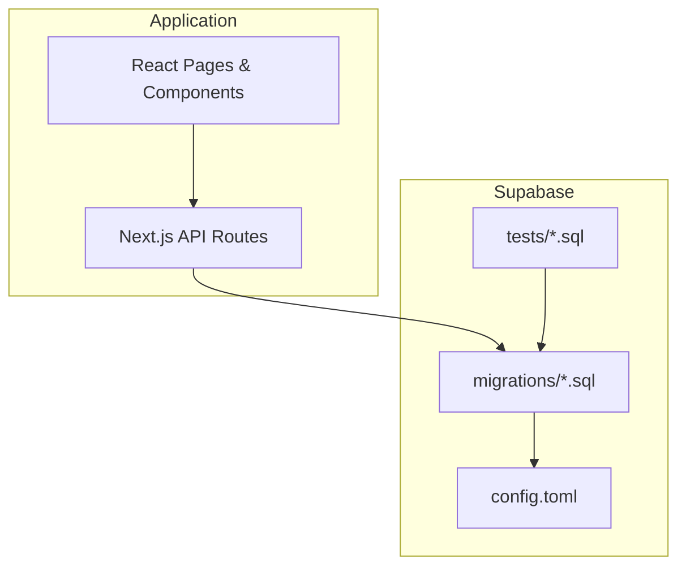

**Diagram sources**
- [config.toml](file://apps/hr-suite/supabase/config.toml)

**Section sources**
- [config.toml](file://apps/hr-suite/supabase/config.toml)

## Core Components
This section outlines the foundational tables and relationships that power LiquidHR’s HR operations.

- Employees: Identity and personal information with secure identifiers isolated for privacy. Includes archive state and avatar state.
- Employments: Employment lifecycle including timelines, terminations, change management, and combined change sets.
- Organizations: Multi-tenant structure with administrations, roles, RBAC, and authorization hardening.
- Custom Fields: Extensible key-value storage for employee attributes with typed values and RPC helpers.
- Dashboards: Personal dashboards and widget catalog with read/write policies tuned for tenant isolation.
- Leave Management: Engine foundation, transaction buckets, request booking, ledger operations, and year controls.
- Settings: Modules, work patterns, holidays, anniversary rules, and optional module guards.
- Audit Logs: Employee activity entries capturing changes and events.
- Integrations: Hera AI agent memory, preferences, and message metadata; master data mutation RPCs.

Key relationships:
- Employees belong to an organization and are scoped by administration.
- Employments link to employees and reference job catalogs, salary scales, and termination reasons.
- Custom field values reference definitions and target entities (e.g., employees).
- Dashboards and widgets are scoped per user and tenant.
- Leave transactions and requests reference employees and employments.
- Settings and catalogs are tenant-scoped.

**Section sources**
- [20260712124858_init_employee_core_hr.sql](file://apps/hr-suite/supabase/migrations/20260712124858_init_employee_core_hr.sql)
- [20260712124911_add_tenant_rbac_and_organization.sql](file://apps/hr-suite/supabase/migrations/20260712124911_add_tenant_rbac_and_organization.sql)
- [20260714174305_add_multitenancy_administrations.sql](file://apps/hr-suite/supabase/migrations/20260714174305_add_multitenancy_administrations.sql)
- [20260715122802_add_custom_field_definitions.sql](file://apps/hr-suite/supabase/migrations/20260715122802_add_custom_field_definitions.sql)
- [20260716120000_add_personal_dashboards.sql](file://apps/hr-suite/supabase/migrations/20260716120000_add_personal_dashboards.sql)
- [20260722142551_add_leave_engine_foundation.sql](file://apps/hr-suite/supabase/migrations/20260722142551_add_leave_engine_foundation.sql)
- [20260718121308_add_settings_modules_work_patterns_holidays.sql](file://apps/hr-suite/supabase/migrations/20260718121308_add_settings_modules_work_patterns_holidays.sql)
- [20260724160000_add_employee_activity_entries.sql](file://apps/hr-suite/supabase/migrations/20260724160000_add_employee_activity_entries.sql)
- [20260716092637_add_hera_ai_agent.sql](file://apps/hr-suite/supabase/migrations/20260716092637_add_hera_ai_agent.sql)

## Architecture Overview
The database architecture follows a multi-tenant model with strong tenant isolation enforced through RLS policies. Core HR entities are separated into focused modules (employees, employments, custom fields, dashboards, leave, settings, audit logs, integrations). Migrations evolve the schema incrementally while preserving backward compatibility and enforcing constraints.

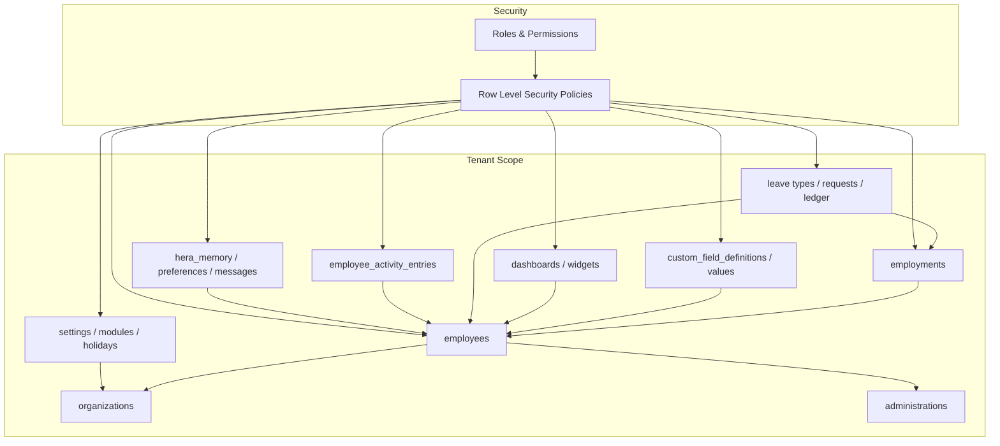

**Diagram sources**
- [20260712124911_add_tenant_rbac_and_organization.sql](file://apps/hr-suite/supabase/migrations/20260712124911_add_tenant_rbac_and_organization.sql)
- [20260714174305_add_multitenancy_administrations.sql](file://apps/hr-suite/supabase/migrations/20260714174305_add_multitenancy_administrations.sql)
- [20260712124858_init_employee_core_hr.sql](file://apps/hr-suite/supabase/migrations/20260712124858_init_employee_core_hr.sql)
- [20260715122802_add_custom_field_definitions.sql](file://apps/hr-suite/supabase/migrations/20260715122802_add_custom_field_definitions.sql)
- [20260716120000_add_personal_dashboards.sql](file://apps/hr-suite/supabase/migrations/20260716120000_add_personal_dashboards.sql)
- [20260722142551_add_leave_engine_foundation.sql](file://apps/hr-suite/supabase/migrations/20260722142551_add_leave_engine_foundation.sql)
- [20260718121308_add_settings_modules_work_patterns_holidays.sql](file://apps/hr-suite/supabase/migrations/20260718121308_add_settings_modules_work_patterns_holidays.sql)
- [20260724160000_add_employee_activity_entries.sql](file://apps/hr-suite/supabase/migrations/20260724160000_add_employee_activity_entries.sql)
- [20260716092637_add_hera_ai_agent.sql](file://apps/hr-suite/supabase/migrations/20260716092637_add_hera_ai_agent.sql)

## Detailed Component Analysis

### Employees
Employees store identity and personal details. Secure identifiers are isolated to limit exposure. Archive and avatar states manage lifecycle and presentation.

- Primary Key: employee_id
- Foreign Keys: organization_id, administration_id
- Constraints: Not null checks on essential fields; unique constraints where applicable
- Indexes: Optimized for lookups by organization, administration, and status
- Triggers: Linking from auth users; BSN reveal policy for logged-in users
- RLS: Scoped by organization and administration; restricted sensitive fields

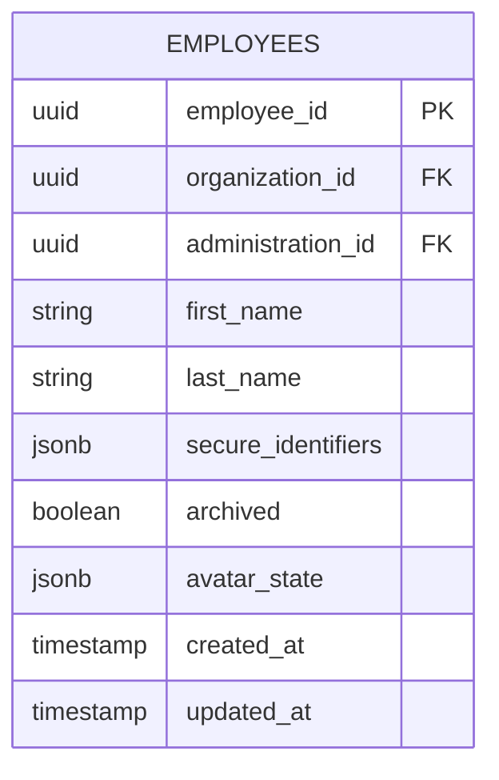

**Diagram sources**
- [20260712124858_init_employee_core_hr.sql](file://apps/hr-suite/supabase/migrations/20260712124858_init_employee_core_hr.sql)
- [20260714171241_link_employees_from_auth_trigger.sql](file://apps/hr-suite/supabase/migrations/20260714171241_link_employees_from_auth_trigger.sql)
- [20260715124506_isolate_employee_secure_identifiers.sql](file://apps/hr-suite/supabase/migrations/20260715124506_isolate_employee_secure_identifiers.sql)
- [20260715124744_allow_logged_bsn_reveal.sql](file://apps/hr-suite/supabase/migrations/20260715124744_allow_logged_bsn_reveal.sql)
- [20260718150000_add_employee_archive_and_avatar_state.sql](file://apps/hr-suite/supabase/migrations/20260718150000_add_employee_archive_and_avatar_state.sql)

**Section sources**
- [20260712124858_init_employee_core_hr.sql](file://apps/hr-suite/supabase/migrations/20260712124858_init_employee_core_hr.sql)
- [20260714171241_link_employees_from_auth_trigger.sql](file://apps/hr-suite/supabase/migrations/20260714171241_link_employees_from_auth_trigger.sql)
- [20260715124506_isolate_employee_secure_identifiers.sql](file://apps/hr-suite/supabase/migrations/20260715124506_isolate_employee_secure_identifiers.sql)
- [20260715124744_allow_logged_bsn_reveal.sql](file://apps/hr-suite/supabase/migrations/20260715124744_allow_logged_bsn_reveal.sql)
- [20260718150000_add_employee_archive_and_avatar_state.sql](file://apps/hr-suite/supabase/migrations/20260718150000_add_employee_archive_and_avatar_state.sql)

### Employments
Employments capture the lifecycle of an employee’s role within an organization, including timelines, terminations, and change management. Combined change sets allow atomic updates.

- Primary Key: employment_id
- Foreign Keys: employee_id, organization_id, administration_id, job_id, salary_scale_id, termination_reason_id
- Constraints: Date range validity; state transitions enforced via policies and functions
- Indexes: Optimized for timeline queries and filtering by employee and organization
- Triggers: Change event projection; termination enforcement
- RLS: Tenant-scoped; restricted write access based on roles

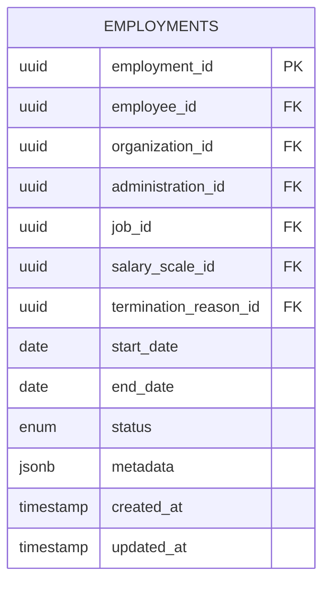

**Diagram sources**
- [20260715071156_add_employment_core.sql](file://apps/hr-suite/supabase/migrations/20260715071156_add_employment_core.sql)
- [20260715071422_add_employment_timelines.sql](file://apps/hr-suite/supabase/migrations/20260715071422_add_employment_timelines.sql)
- [20260715071717_add_employment_terminations.sql](file://apps/hr-suite/supabase/migrations/20260715071717_add_employment_terminations.sql)
- [20260715141843_add_employment_change_management.sql](file://apps/hr-suite/supabase/migrations/20260715141843_add_employment_change_management.sql)
- [20260716100000_add_combined_employment_change_sets.sql](file://apps/hr-suite/supabase/migrations/20260716100000_add_combined_employment_change_sets.sql)
- [20260718090000_complete_employment_flow.sql](file://apps/hr-suite/supabase/migrations/20260718090000_complete_employment_flow.sql)

**Section sources**
- [20260715071156_add_employment_core.sql](file://apps/hr-suite/supabase/migrations/20260715071156_add_employment_core.sql)
- [20260715071422_add_employment_timelines.sql](file://apps/hr-suite/supabase/migrations/20260715071422_add_employment_timelines.sql)
- [20260715071717_add_employment_terminations.sql](file://apps/hr-suite/supabase/migrations/20260715071717_add_employment_terminations.sql)
- [20260715141843_add_employment_change_management.sql](file://apps/hr-suite/supabase/migrations/20260715141843_add_employment_change_management.sql)
- [20260716100000_add_combined_employment_change_sets.sql](file://apps/hr-suite/supabase/migrations/20260716100000_add_combined_employment_change_sets.sql)
- [20260718090000_complete_employment_flow.sql](file://apps/hr-suite/supabase/migrations/20260718090000_complete_employment_flow.sql)

### Organizations and Multitenancy
Organizations define tenants and administrative boundaries. Administrations scope data access and permissions. RBAC and authorization policies enforce isolation.

- Primary Key: organization_id, administration_id
- Foreign Keys: Links to roles, assignments, and scopes
- Constraints: Unique names per tenant; hierarchical relationships validated
- Indexes: Optimized for tenant scoping and role lookups
- Triggers: Hardened authorization checks; enforcement of management scope
- RLS: Strict tenant isolation; admin overrides where permitted

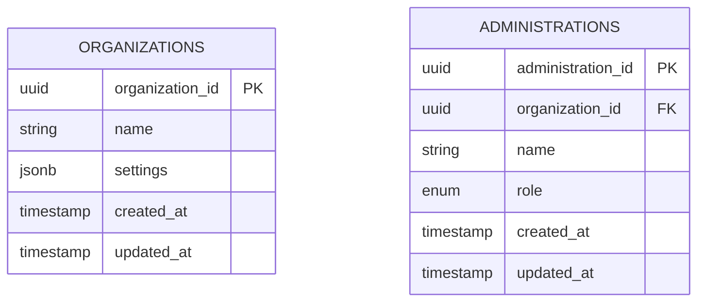

**Diagram sources**
- [20260712124911_add_tenant_rbac_and_organization.sql](file://apps/hr-suite/supabase/migrations/20260712124911_add_tenant_rbac_and_organization.sql)
- [20260714174305_add_multitenancy_administrations.sql](file://apps/hr-suite/supabase/migrations/20260714174305_add_multitenancy_administrations.sql)
- [20260714170949_harden_organization_authorization.sql](file://apps/hr-suite/supabase/migrations/20260714170949_harden_organization_authorization.sql)
- [20260714180142_enforce_administration_management_scope.sql](file://apps/hr-suite/supabase/migrations/20260714180142_enforce_administration_management_scope.sql)

**Section sources**
- [20260712124911_add_tenant_rbac_and_organization.sql](file://apps/hr-suite/supabase/migrations/20260712124911_add_tenant_rbac_and_organization.sql)
- [20260714174305_add_multitenancy_administrations.sql](file://apps/hr-suite/supabase/migrations/20260714174305_add_multitenancy_administrations.sql)
- [20260714170949_harden_organization_authorization.sql](file://apps/hr-suite/supabase/migrations/20260714170949_harden_organization_authorization.sql)
- [20260714180142_enforce_administration_management_scope.sql](file://apps/hr-suite/supabase/migrations/20260714180142_enforce_administration_management_scope.sql)

### Custom Fields
Custom fields enable extensible attribute storage for employees and other entities. Definitions specify types and constraints; values store typed JSONB payloads.

- Primary Key: definition_id, value_id
- Foreign Keys: definition_id references custom_field_definitions; entity references vary by target
- Constraints: Type validation enforced via functions and policies
- Indexes: Optimized for lookup by definition and entity
- Triggers: Validation and normalization on insert/update
- RLS: Tenant-scoped; restricted writes based on role and context

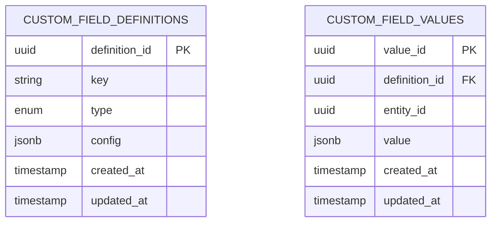

**Diagram sources**
- [20260715122802_add_custom_field_definitions.sql](file://apps/hr-suite/supabase/migrations/20260715122802_add_custom_field_definitions.sql)
- [20260715123119_add_custom_field_value_rpc.sql](file://apps/hr-suite/supabase/migrations/20260715123119_add_custom_field_value_rpc.sql)
- [20260715123927_harden_custom_field_values.sql](file://apps/hr-suite/supabase/migrations/20260715123927_harden_custom_field_values.sql)

**Section sources**
- [20260715122802_add_custom_field_definitions.sql](file://apps/hr-suite/supabase/migrations/20260715122802_add_custom_field_definitions.sql)
- [20260715123119_add_custom_field_value_rpc.sql](file://apps/hr-suite/supabase/migrations/20260715123119_add_custom_field_value_rpc.sql)
- [20260715123927_harden_custom_field_values.sql](file://apps/hr-suite/supabase/migrations/20260715123927_harden_custom_field_values.sql)

### Dashboards
Personal dashboards allow users to configure widgets and layouts. Widget catalog defines available components. Policies control read/write scope per tenant and user.

- Primary Key: dashboard_id, widget_id
- Foreign Keys: user_id, tenant_id, widget_catalog_id
- Constraints: Layout validation; widget type restrictions
- Indexes: Optimized for user and tenant queries
- Triggers: Update timestamps and layout normalization
- RLS: Scoped to user and tenant; admin privileges for catalog management

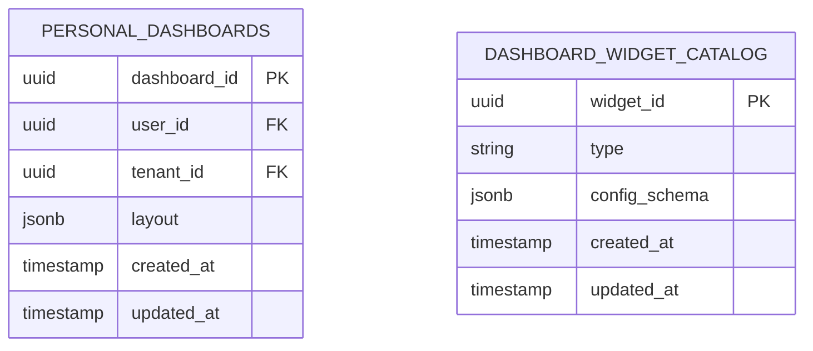

**Diagram sources**
- [20260716120000_add_personal_dashboards.sql](file://apps/hr-suite/supabase/migrations/20260716120000_add_personal_dashboards.sql)
- [20260718170000_add_dashboard_widget_catalog.sql](file://apps/hr-suite/supabase/migrations/20260718170000_add_dashboard_widget_catalog.sql)
- [20260718171000_relax_dashboard_widget_read_scope.sql](file://apps/hr-suite/supabase/migrations/20260718171000_relax_dashboard_widget_read_scope.sql)
- [20260718172000_expand_personal_dashboard_widget_types.sql](file://apps/hr-suite/supabase/migrations/20260718172000_expand_personal_dashboard_widget_types.sql)
- [20260718172051_grant_dashboard_widget_admin_permissions.sql](file://apps/hr-suite/supabase/migrations/20260718172051_grant_dashboard_widget_admin_permissions.sql)
- [20260718173000_tune_dashboard_widget_policies.sql](file://apps/hr-suite/supabase/migrations/20260718173000_tune_dashboard_widget_policies.sql)

**Section sources**
- [20260716120000_add_personal_dashboards.sql](file://apps/hr-suite/supabase/migrations/20260716120000_add_personal_dashboards.sql)
- [20260718170000_add_dashboard_widget_catalog.sql](file://apps/hr-suite/supabase/migrations/20260718170000_add_dashboard_widget_catalog.sql)
- [20260718171000_relax_dashboard_widget_read_scope.sql](file://apps/hr-suite/supabase/migrations/20260718171000_relax_dashboard_widget_read_scope.sql)
- [20260718172000_expand_personal_dashboard_widget_types.sql](file://apps/hr-suite/supabase/migrations/20260718172000_expand_personal_dashboard_widget_types.sql)
- [20260718172051_grant_dashboard_widget_admin_permissions.sql](file://apps/hr-suite/supabase/migrations/20260718172051_grant_dashboard_widget_admin_permissions.sql)
- [20260718173000_tune_dashboard_widget_policies.sql](file://apps/hr-suite/supabase/migrations/20260718173000_tune_dashboard_widget_policies.sql)

### Leave Management
Leave engine supports leave types, accrual rules, work hours, request booking, and ledger operations. Year controls manage annual balances.

- Primary Key: leave_type_id, request_id, ledger_id
- Foreign Keys: employee_id, employment_id, leave_type_id
- Constraints: Date overlap checks; balance validations; holiday skipping
- Indexes: Optimized for employee and employment queries; bucket indexing
- Triggers: Booking engine; ledger operations; demo seeding
- RLS: Tenant-scoped; restricted writes based on role and context

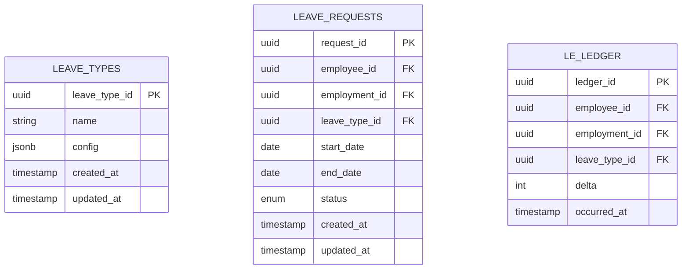

**Diagram sources**
- [20260722142551_add_leave_engine_foundation.sql](file://apps/hr-suite/supabase/migrations/20260722142551_add_leave_engine_foundation.sql)
- [20260722144232_add_leave_engine_fk_indexes.sql](file://apps/hr-suite/supabase/migrations/20260722144232_add_leave_engine_fk_indexes.sql)
- [20260722144344_add_leave_transaction_bucket_fk_index.sql](file://apps/hr-suite/supabase/migrations/20260722144344_add_leave_transaction_bucket_fk_index.sql)
- [20260722151920_add_leave_configuration_mutation_functions.sql](file://apps/hr-suite/supabase/migrations/20260722151920_add_leave_configuration_mutation_functions.sql)
- [20260722190000_add_leave_request_booking_engine.sql](file://apps/hr-suite/supabase/migrations/20260722190000_add_leave_request_booking_engine.sql)
- [20260722192000_add_leave_ledger_operations.sql](file://apps/hr-suite/supabase/migrations/20260722192000_add_leave_ledger_operations.sql)
- [20260722192100_seed_leave_demo_year_controls.sql](file://apps/hr-suite/supabase/migrations/20260722192100_seed_leave_demo_year_controls.sql)
- [20260722192500_skip_holidays_in_leave_requests.sql](file://apps/hr-suite/supabase/migrations/20260722192500_skip_holidays_in_leave_requests.sql)

**Section sources**
- [20260722142551_add_leave_engine_foundation.sql](file://apps/hr-suite/supabase/migrations/20260722142551_add_leave_engine_foundation.sql)
- [20260722144232_add_leave_engine_fk_indexes.sql](file://apps/hr-suite/supabase/migrations/20260722144232_add_leave_engine_fk_indexes.sql)
- [20260722144344_add_leave_transaction_bucket_fk_index.sql](file://apps/hr-suite/supabase/migrations/20260722144344_add_leave_transaction_bucket_fk_index.sql)
- [20260722151920_add_leave_configuration_mutation_functions.sql](file://apps/hr-suite/supabase/migrations/20260722151920_add_leave_configuration_mutation_functions.sql)
- [20260722190000_add_leave_request_booking_engine.sql](file://apps/hr-suite/supabase/migrations/20260722190000_add_leave_request_booking_engine.sql)
- [20260722192000_add_leave_ledger_operations.sql](file://apps/hr-suite/supabase/migrations/20260722192000_add_leave_ledger_operations.sql)
- [20260722192100_seed_leave_demo_year_controls.sql](file://apps/hr-suite/supabase/migrations/20260722192100_seed_leave_demo_year_controls.sql)
- [20260722192500_skip_holidays_in_leave_requests.sql](file://apps/hr-suite/supabase/migrations/20260722192500_skip_holidays_in_leave_requests.sql)

### Settings and Master Data
Settings include modules, work patterns, holidays, anniversary rules, and optional module guards. Master data includes job catalogs, salary scales, and document categories.

- Primary Key: setting_id, master_data_id
- Foreign Keys: organization_id, administration_id
- Constraints: Enum validations; uniqueness per tenant
- Indexes: Optimized for tenant and category queries
- Triggers: Snapshot imports; normalization
- RLS: Tenant-scoped; admin-only writes for critical settings

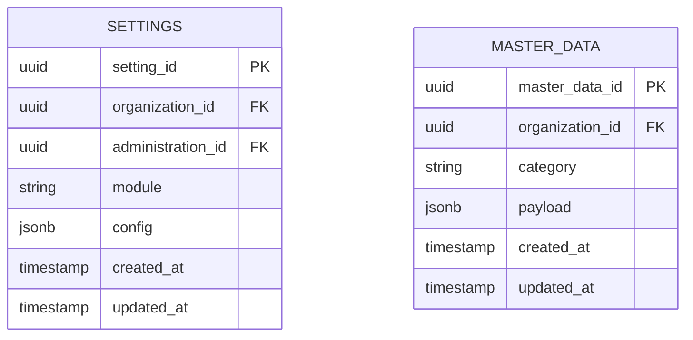

**Diagram sources**
- [20260718121308_add_settings_modules_work_patterns_holidays.sql](file://apps/hr-suite/supabase/migrations/20260718121308_add_settings_modules_work_patterns_holidays.sql)
- [20260718122138_harden_settings_rosters_holidays.sql](file://apps/hr-suite/supabase/migrations/20260718122138_harden_settings_rosters_holidays.sql)
- [20260718122614_enforce_optional_module_guards.sql](file://apps/hr-suite/supabase/migrations/20260718122614_enforce_optional_module_guards.sql)
- [20260718122751_expose_module_state_to_tenant_users.sql](file://apps/hr-suite/supabase/migrations/20260718122751_expose_module_state_to_tenant_users.sql)
- [20260718123742_add_holiday_snapshot_import.sql](file://apps/hr-suite/supabase/migrations/20260718123742_add_holiday_snapshot_import.sql)
- [20260718100000_add_job_catalog_salary_revisions.sql](file://apps/hr-suite/supabase/migrations/20260718100000_add_job_catalog_salary_revisions.sql)
- [20260718100500_add_master_data_mutation_rpcs.sql](file://apps/hr-suite/supabase/migrations/20260718100500_add_master_data_mutation_rpcs.sql)
- [20260718100600_index_master_data_foreign_keys.sql](file://apps/hr-suite/supabase/migrations/20260718100600_index_master_data_foreign_keys.sql)

**Section sources**
- [20260718121308_add_settings_modules_work_patterns_holidays.sql](file://apps/hr-suite/supabase/migrations/20260718121308_add_settings_modules_work_patterns_holidays.sql)
- [20260718122138_harden_settings_rosters_holidays.sql](file://apps/hr-suite/supabase/migrations/20260718122138_harden_settings_rosters_holidays.sql)
- [20260718122614_enforce_optional_module_guards.sql](file://apps/hr-suite/supabase/migrations/20260718122614_enforce_optional_module_guards.sql)
- [20260718122751_expose_module_state_to_tenant_users.sql](file://apps/hr-suite/supabase/migrations/20260718122751_expose_module_state_to_tenant_users.sql)
- [20260718123742_add_holiday_snapshot_import.sql](file://apps/hr-suite/supabase/migrations/20260718123742_add_holiday_snapshot_import.sql)
- [20260718100000_add_job_catalog_salary_revisions.sql](file://apps/hr-suite/supabase/migrations/20260718100000_add_job_catalog_salary_revisions.sql)
- [20260718100500_add_master_data_mutation_rpcs.sql](file://apps/hr-suite/supabase/migrations/20260718100500_add_master_data_mutation_rpcs.sql)
- [20260718100600_index_master_data_foreign_keys.sql](file://apps/hr-suite/supabase/migrations/20260718100600_index_master_data_foreign_keys.sql)

### Audit Logs and Activity Entries
Employee activity entries capture changes and events for auditing and insights.

- Primary Key: entry_id
- Foreign Keys: employee_id, administration_id
- Constraints: Event type validation; timestamp ordering
- Indexes: Optimized for employee and time-based queries
- Triggers: Auto-capture on mutations; hardening for consistency
- RLS: Tenant-scoped; restricted writes to system processes

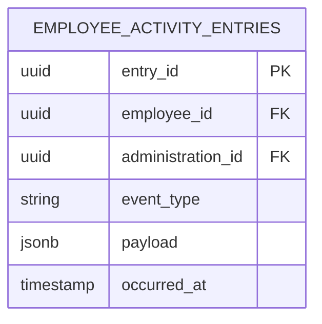

**Diagram sources**
- [20260724160000_add_employee_activity_entries.sql](file://apps/hr-suite/supabase/migrations/20260724160000_add_employee_activity_entries.sql)
- [20260724172716_harden_employee_activity_entries.sql](file://apps/hr-suite/supabase/migrations/20260724172716_harden_employee_activity_entries.sql)

**Section sources**
- [20260724160000_add_employee_activity_entries.sql](file://apps/hr-suite/supabase/migrations/20260724160000_add_employee_activity_entries.sql)
- [20260724172716_harden_employee_activity_entries.sql](file://apps/hr-suite/supabase/migrations/20260724172716_harden_employee_activity_entries.sql)

### Integrations (Hera AI Agent)
Hera AI agent stores memory, preferences, and message metadata for AI-driven interactions.

- Primary Key: memory_id, preference_id, message_id
- Foreign Keys: employee_id, administration_id
- Constraints: Metadata validation; preference schemas
- Indexes: Optimized for employee and tenant queries
- Triggers: Normalization and hardening
- RLS: Tenant-scoped; restricted writes based on role and context

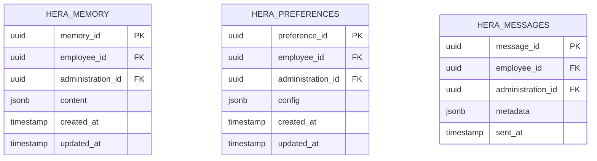

**Diagram sources**
- [20260716092637_add_hera_ai_agent.sql](file://apps/hr-suite/supabase/migrations/20260716092637_add_hera_ai_agent.sql)
- [20260717100000_harden_hera_memory_and_preferences.sql](file://apps/hr-suite/supabase/migrations/20260717100000_harden_hera_memory_and_preferences.sql)
- [20260717100500_index_hera_preferences.sql](file://apps/hr-suite/supabase/migrations/20260717100500_index_hera_preferences.sql)
- [20260717101000_add_hera_message_metadata.sql](file://apps/hr-suite/supabase/migrations/20260717101000_add_hera_message_metadata.sql)

**Section sources**
- [20260716092637_add_hera_ai_agent.sql](file://apps/hr-suite/supabase/migrations/20260716092637_add_hera_ai_agent.sql)
- [20260717100000_harden_hera_memory_and_preferences.sql](file://apps/hr-suite/supabase/migrations/20260717100000_harden_hera_memory_and_preferences.sql)
- [20260717100500_index_hera_preferences.sql](file://apps/hr-suite/supabase/migrations/20260717100500_index_hera_preferences.sql)
- [20260717101000_add_hera_message_metadata.sql](file://apps/hr-suite/supabase/migrations/20260717101000_add_hera_message_metadata.sql)

## Dependency Analysis
Dependencies between components are managed through foreign keys and RLS policies. Migrations introduce dependencies incrementally and optimize indexes to support query patterns.

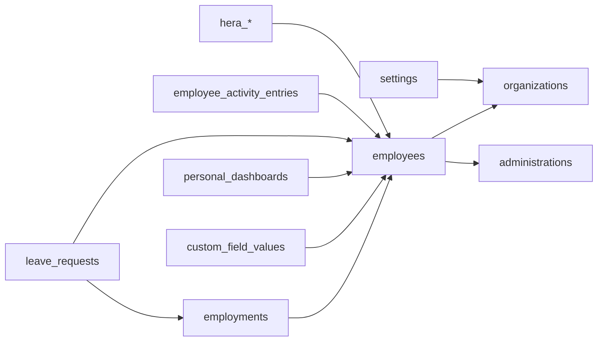

**Diagram sources**
- [20260712124858_init_employee_core_hr.sql](file://apps/hr-suite/supabase/migrations/20260712124858_init_employee_core_hr.sql)
- [20260712124911_add_tenant_rbac_and_organization.sql](file://apps/hr-suite/supabase/migrations/20260712124911_add_tenant_rbac_and_organization.sql)
- [20260714174305_add_multitenancy_administrations.sql](file://apps/hr-suite/supabase/migrations/20260714174305_add_multitenancy_administrations.sql)
- [20260715122802_add_custom_field_definitions.sql](file://apps/hr-suite/supabase/migrations/20260715122802_add_custom_field_definitions.sql)
- [20260716120000_add_personal_dashboards.sql](file://apps/hr-suite/supabase/migrations/20260716120000_add_personal_dashboards.sql)
- [20260722142551_add_leave_engine_foundation.sql](file://apps/hr-suite/supabase/migrations/20260722142551_add_leave_engine_foundation.sql)
- [20260718121308_add_settings_modules_work_patterns_holidays.sql](file://apps/hr-suite/supabase/migrations/20260718121308_add_settings_modules_work_patterns_holidays.sql)
- [20260724160000_add_employee_activity_entries.sql](file://apps/hr-suite/supabase/migrations/20260724160000_add_employee_activity_entries.sql)
- [20260716092637_add_hera_ai_agent.sql](file://apps/hr-suite/supabase/migrations/20260716092637_add_hera_ai_agent.sql)

**Section sources**
- [20260712124858_init_employee_core_hr.sql](file://apps/hr-suite/supabase/migrations/20260712124858_init_employee_core_hr.sql)
- [20260712124911_add_tenant_rbac_and_organization.sql](file://apps/hr-suite/supabase/migrations/20260712124911_add_tenant_rbac_and_organization.sql)
- [20260714174305_add_multitenancy_administrations.sql](file://apps/hr-suite/supabase/migrations/20260714174305_add_multitenancy_administrations.sql)
- [20260715122802_add_custom_field_definitions.sql](file://apps/hr-suite/supabase/migrations/20260715122802_add_custom_field_definitions.sql)
- [20260716120000_add_personal_dashboards.sql](file://apps/hr-suite/supabase/migrations/20260716120000_add_personal_dashboards.sql)
- [20260722142551_add_leave_engine_foundation.sql](file://apps/hr-suite/supabase/migrations/20260722142551_add_leave_engine_foundation.sql)
- [20260718121308_add_settings_modules_work_patterns_holidays.sql](file://apps/hr-suite/supabase/migrations/20260718121308_add_settings_modules_work_patterns_holidays.sql)
- [20260724160000_add_employee_activity_entries.sql](file://apps/hr-suite/supabase/migrations/20260724160000_add_employee_activity_entries.sql)
- [20260716092637_add_hera_ai_agent.sql](file://apps/hr-suite/supabase/migrations/20260716092637_add_hera_ai_agent.sql)

## Performance Considerations
- Indexing Strategy: Migrations add targeted indexes on foreign keys and frequently queried columns (e.g., employee organization scope, leave transaction buckets, hera preferences).
- Query Optimization: Use tenant-scoped filters to reduce scan size; leverage composite indexes for common predicates.
- Concurrency: Employ transactions for multi-step operations (e.g., employment change sets, leave booking).
- Partitioning: Consider partitioning large tables like activity entries and ledger by time if growth warrants it.
- Caching: Cache static master data and settings at the application layer to reduce DB load.

[No sources needed since this section provides general guidance]

## Troubleshooting Guide
Common issues and resolutions:
- RLS Policy Violations: Ensure current user has appropriate tenant and role; verify policy conditions.
- Constraint Failures: Check foreign key references and unique constraints; validate input payloads.
- Trigger Errors: Inspect trigger functions for validation logic; review error messages.
- Performance Degradation: Analyze query plans; add missing indexes; refine WHERE clauses.

**Section sources**
- [20260712125420_revoke_public_rls_trigger_execution.sql](file://apps/hr-suite/supabase/migrations/20260712125420_revoke_public_rls_trigger_execution.sql)
- [20260712125522_optimize_rbac_indexes_and_policies.sql](file://apps/hr-suite/supabase/migrations/20260712125522_optimize_rbac_indexes_and_policies.sql)
- [20260715121304_optimize_employee_core_indexes.sql](file://apps/hr-suite/supabase/migrations/20260715121304_optimize_employee_core_indexes.sql)
- [20260715130026_index_secure_employee_foreign_keys.sql](file://apps/hr-suite/supabase/migrations/20260715130026_index_secure_employee_foreign_keys.sql)
- [20260722144232_add_leave_engine_fk_indexes.sql](file://apps/hr-suite/supabase/migrations/20260722144232_add_leave_engine_fk_indexes.sql)
- [20260722144344_add_leave_transaction_bucket_fk_index.sql](file://apps/hr-suite/supabase/migrations/20260722144344_add_leave_transaction_bucket_fk_index.sql)
- [20260717100500_index_hera_preferences.sql](file://apps/hr-suite/supabase/migrations/20260717100500_index_hera_preferences.sql)

## Conclusion
LiquidHR’s PostgreSQL schema implements a robust, multi-tenant HR system with strong security, extensibility, and performance considerations. Core entities (employees, employments, organizations) are complemented by advanced features (custom fields, dashboards, leave management) and supporting tables (settings, audit logs, integrations). Migrations ensure incremental evolution, while RLS policies and constraints maintain data integrity and privacy.

[No sources needed since this section summarizes without analyzing specific files]

## Appendices

### Migration Strategies
- Versioned Migrations: Each SQL file represents a discrete change; apply in order.
- Backward Compatibility: Avoid breaking changes; use additive modifications.
- Testing: Validate migrations with provided tests in supabase/tests.

**Section sources**
- [config.toml](file://apps/hr-suite/supabase/config.toml)

### Backup Procedures
- Regular Snapshots: Schedule full backups of the database.
- Incremental Backups: Capture WAL logs for point-in-time recovery.
- Restore Testing: Periodically test restore procedures.

[No sources needed since this section provides general guidance]

### Data Security and Privacy
- RLS Policies: Enforce tenant isolation and role-based access.
- Sensitive Fields: Isolate secure identifiers; restrict visibility.
- Audit Logging: Capture changes for compliance and traceability.

**Section sources**
- [20260712125420_revoke_public_rls_trigger_execution.sql](file://apps/hr-suite/supabase/migrations/20260712125420_revoke_public_rls_trigger_execution.sql)
- [20260715124506_isolate_employee_secure_identifiers.sql](file://apps/hr-suite/supabase/migrations/20260715124506_isolate_employee_secure_identifiers.sql)
- [20260724160000_add_employee_activity_entries.sql](file://apps/hr-suite/supabase/migrations/20260724160000_add_employee_activity_entries.sql)

### Data Access Patterns
- Tenant-Scoped Queries: Always filter by organization_id and administration_id.
- Indexed Lookups: Use indexed columns for efficient retrieval.
- Transactions: Group related operations to maintain consistency.

**Section sources**
- [20260714180309_index_employee_organization_scope_foreign_keys.sql](file://apps/hr-suite/supabase/migrations/20260714180309_index_employee_organization_scope_foreign_keys.sql)
- [20260715121304_optimize_employee_core_indexes.sql](file://apps/hr-suite/supabase/migrations/20260715121304_optimize_employee_core_indexes.sql)
- [20260718100600_index_master_data_foreign_keys.sql](file://apps/hr-suite/supabase/migrations/20260718100600_index_master_data_foreign_keys.sql)