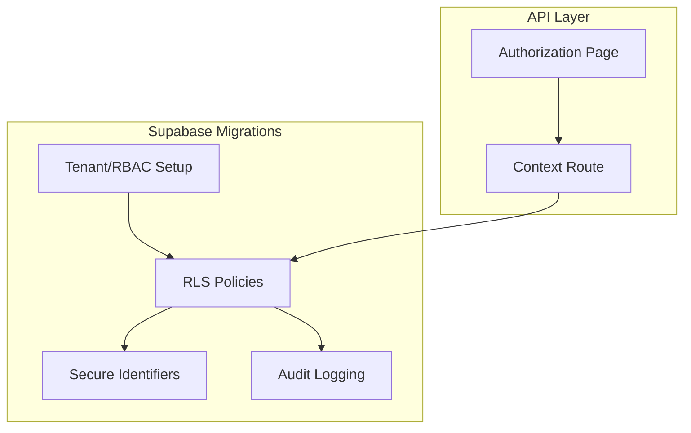
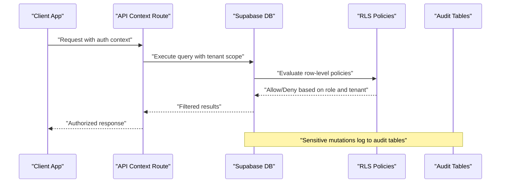
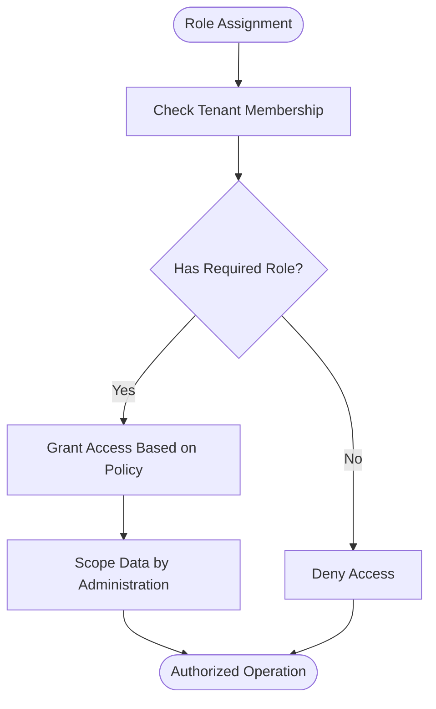
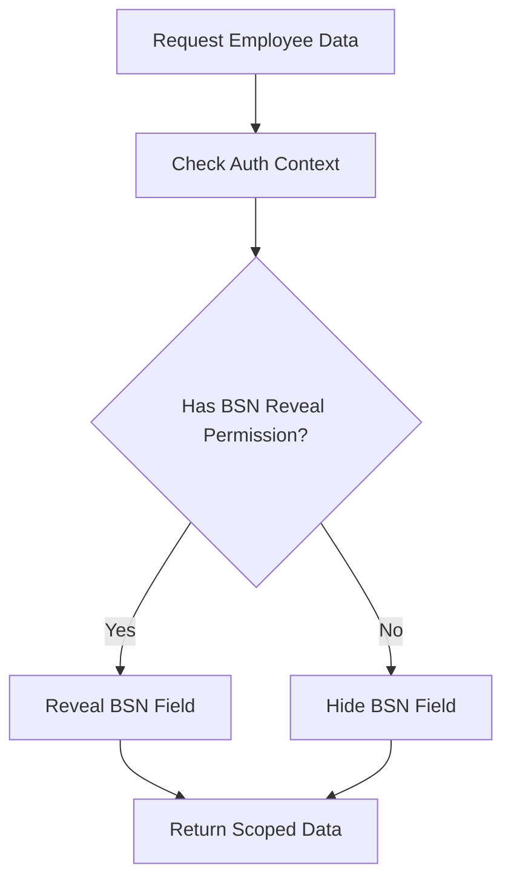
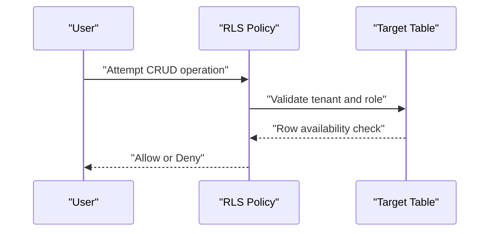
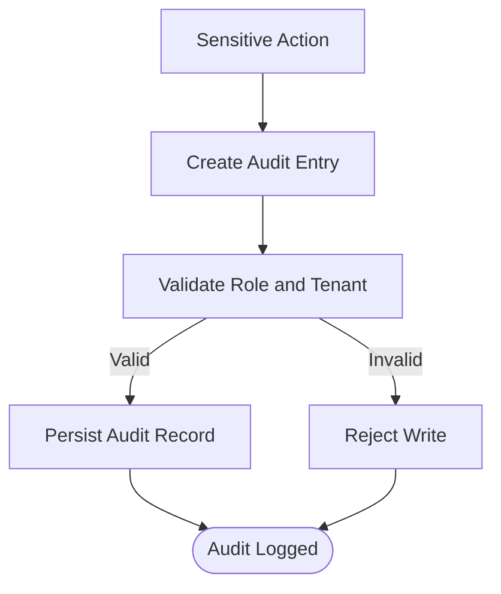
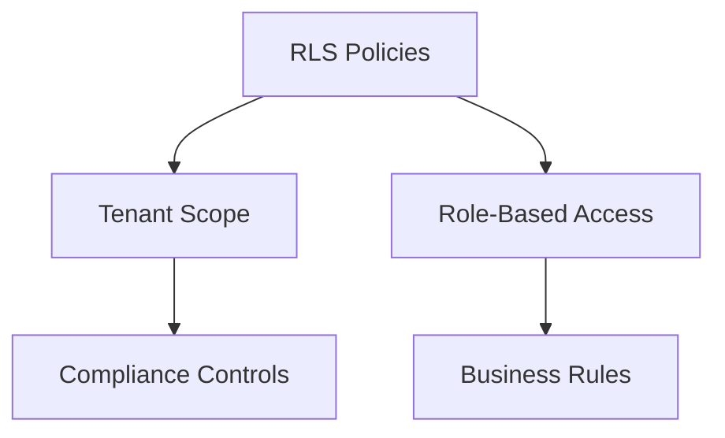
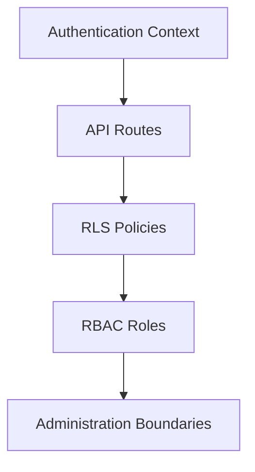

# Database Security & RLS Policies

<cite>
**Referenced Files in This Document**
- [20260712124911_add_tenant_rbac_and_organization.sql](file://apps/hr-suite/supabase/migrations/20260712124911_add_tenant_rbac_and_organization.sql)
- [20260712125420_revoke_public_rls_trigger_execution.sql](file://apps/hr-suite/supabase/migrations/20260712125420_revoke_public_rls_trigger_execution.sql)
- [20260712125522_optimize_rbac_indexes_and_policies.sql](file://apps/hr-suite/supabase/migrations/20260712125522_optimize_rbac_indexes_and_policies.sql)
- [20260714170949_harden_organization_authorization.sql](file://apps/hr-suite/supabase/migrations/20260714170949_harden_organization_authorization.sql)
- [20260714171241_link_employees_from_auth_trigger.sql](file://apps/hr-suite/supabase/migrations/20260714171241_link_employees_from_auth_trigger.sql)
- [20260714174305_add_multitenancy_administrations.sql](file://apps/hr-suite/supabase/migrations/20260714174305_add_multitenancy_administrations.sql)
- [20260714175659_seed_multitenancy_demo.sql](file://apps/hr-suite/supabase/migrations/20260714175659_seed_multitenancy_demo.sql)
- [20260714180142_enforce_administration_management_scope.sql](file://apps/hr-suite/supabase/migrations/20260714180142_enforce_administration_management_scope.sql)
- [20260714180309_index_employee_organization_scope_foreign_keys.sql](file://apps/hr-suite/supabase/migrations/20260714180309_index_employee_organization_scope_foreign_keys.sql)
- [20260715072010_harden_employment_security.sql](file://apps/hr-suite/supabase/migrations/20260715072010_harden_employment_security.sql)
- [20260715124506_isolate_employee_secure_identifiers.sql](file://apps/hr-suite/supabase/migrations/20260715124506_isolate_employee_secure_identifiers.sql)
- [20260715124744_allow_logged_bsn_reveal.sql](file://apps/hr-suite/supabase/migrations/20260715124744_allow_logged_bsn_reveal.sql)
- [20260715130026_index_secure_employee_foreign_keys.sql](file://apps/hr-suite/supabase/migrations/20260715130026_index_secure_employee_foreign_keys.sql)
- [20260715131230_seed_custom_fields_and_tenant_roles.sql](file://apps/hr-suite/supabase/migrations/20260715131230_seed_custom_fields_and_tenant_roles.sql)
- [20260716090000_fix_reminder_recipient_rls_recursion.sql](file://apps/hr-suite/supabase/migrations/20260716090000_fix_reminder_recipient_rls_recursion.sql)
- [20260716092000_fix_reminder_publish_auth_lookup.sql](file://apps/hr-suite/supabase/migrations/20260716092000_fix_reminder_publish_auth_lookup.sql)
- [20260718131000_harden_hr_master_data_document_policies.sql](file://apps/hr-suite/supabase/migrations/20260718131000_harden_hr_master_data_document_policies.sql)
- [20260718132000_split_reminder_target_write_policy.sql](file://apps/hr-suite/supabase/migrations/20260718132000_split_reminder_target_write_policy.sql)
- [20260718180354_add_date_time_user_preferences.sql](file://apps/hr-suite/supabase/migrations/20260718180354_add_date_time_user_preferences.sql)
- [20260719101500_refine_employee_document_upload_rules.sql](file://apps/hr-suite/supabase/migrations/20260719101500_refine_employee_document_upload_rules.sql)
- [20260724160000_add_employee_activity_entries.sql](file://apps/hr-suite/supabase/migrations/20260724160000_add_employee_activity_entries.sql)
- [20260724172716_harden_employee_activity_entries.sql](file://apps/hr-suite/supabase/migrations/20260724172716_harden_employee_activity_entries.sql)
- [multitenancy_isolation.sql](file://apps/hr-suite/supabase/tests/multitenancy_isolation.sql)
- [employee_core_crud_isolation.sql](file://apps/hr-suite/supabase/tests/employee_core_crud_isolation.sql)
- [employee_secure_identifiers.sql](file://apps/hr-suite/supabase/tests/employee_secure_identifiers.sql)
- [user_invitation_isolation.sql](file://apps/hr-suite/supabase/tests/user_invitation_isolation.sql)
- [hr_calendar_authorization.sql](file://apps/hr-suite/supabase/tests/hr_calendar_authorization.sql)
- [authorization page](file://apps/hr-suite/app/(dashboard)/authorization/page.tsx)
- [context route](file://apps/hr-suite/app/api/context/route.ts)
</cite>

## Table of Contents
1. [Introduction](#introduction)
2. [Project Structure](#project-structure)
3. [Core Components](#core-components)
4. [Architecture Overview](#architecture-overview)
5. [Detailed Component Analysis](#detailed-component-analysis)
6. [Dependency Analysis](#dependency-analysis)
7. [Performance Considerations](#performance-considerations)
8. [Troubleshooting Guide](#troubleshooting-guide)
9. [Conclusion](#conclusion)
10. [Appendices](#appendices)

## Introduction
This document explains LiquidHR’s database security model with a focus on Row Level Security (RLS), role-based access control (RBAC), and tenant isolation. It covers secure identifier handling, sensitive data protection, authorization patterns across tables, policy definitions, permission hierarchies, compliance considerations, audit logging requirements, and security testing procedures. It also provides examples of secure queries and common pitfalls to avoid.

## Project Structure
Security is implemented primarily through Supabase migrations that define:
- RBAC roles and permissions
- RLS policies for all core tables
- Tenant isolation via administration boundaries
- Secure identifier scoping and restricted BSN exposure
- Audit logging tables and hardened policies



[No sources needed since this diagram shows conceptual workflow, not actual code structure]

## Core Components
- RBAC Roles and Permissions: Centralized role definitions and permission grants scoped per tenant.
- RLS Policies: Fine-grained row-level access rules enforcing tenant isolation and role-based operations.
- Tenant Isolation: Administration-scoped boundaries ensuring users only access their organization’s data.
- Secure Identifier Handling: Strict scoping for identifiers like BSN; controlled reveal only when explicitly allowed.
- Audit Logging: Dedicated tables and hardened policies to record sensitive actions.

**Section sources**
- [20260712124911_add_tenant_rbac_and_organization.sql](file://apps/hr-suite/supabase/migrations/20260712124911_add_tenant_rbac_and_organization.sql)
- [20260712125522_optimize_rbac_indexes_and_policies.sql](file://apps/hr-suite/supabase/migrations/20260712125522_optimize_rbac_indexes_and_policies.sql)
- [20260714174305_add_multitenancy_administrations.sql](file://apps/hr-suite/supabase/migrations/20260714174305_add_multitenancy_administrations.sql)
- [20260715124506_isolate_employee_secure_identifiers.sql](file://apps/hr-suite/supabase/migrations/20260715124506_isolate_employee_secure_identifiers.sql)
- [20260724160000_add_employee_activity_entries.sql](file://apps/hr-suite/supabase/migrations/20260724160000_add_employee_activity_entries.sql)

## Architecture Overview
The security architecture enforces least privilege at the database layer using RLS and RBAC, while API routes provide contextual enforcement and user session context.



**Diagram sources**
- [context route](file://apps/hr-suite/app/api/context/route.ts)
- [20260712125420_revoke_public_rls_trigger_execution.sql](file://apps/hr-suite/supabase/migrations/20260712125420_revoke_public_rls_trigger_execution.sql)
- [20260724160000_add_employee_activity_entries.sql](file://apps/hr-suite/supabase/migrations/20260724160000_add_employee_activity_entries.sql)

**Section sources**
- [context route](file://apps/hr-suite/app/api/context/route.ts)
- [20260712125420_revoke_public_rls_trigger_execution.sql](file://apps/hr-suite/supabase/migrations/20260712125420_revoke_public_rls_trigger_execution.sql)

## Detailed Component Analysis

### RBAC and Permission Hierarchies
- Role definitions are created and indexed for efficient policy evaluation.
- Permissions are granted conditionally based on tenant membership and role attributes.
- Organization authorization is hardened to prevent lateral movement across tenants.



**Diagram sources**
- [20260712124911_add_tenant_rbac_and_organization.sql](file://apps/hr-suite/supabase/migrations/20260712124911_add_tenant_rbac_and_organization.sql)
- [20260712125522_optimize_rbac_indexes_and_policies.sql](file://apps/hr-suite/supabase/migrations/20260712125522_optimize_rbac_indexes_and_policies.sql)
- [20260714170949_harden_organization_authorization.sql](file://apps/hr-suite/supabase/migrations/20260714170949_harden_organization_authorization.sql)

**Section sources**
- [20260712124911_add_tenant_rbac_and_organization.sql](file://apps/hr-suite/supabase/migrations/20260712124911_add_tenant_rbac_and_organization.sql)
- [20260712125522_optimize_rbac_indexes_and_policies.sql](file://apps/hr-suite/supabase/migrations/20260712125522_optimize_rbac_indexes_and_policies.sql)
- [20260714170949_harden_organization_authorization.sql](file://apps/hr-suite/supabase/migrations/20260714170949_harden_organization_authorization.sql)

### Tenant Isolation Mechanisms
- Administrations define tenant boundaries.
- Employee and employment records are scoped to an administration.
- Foreign keys and indexes ensure efficient tenant-scoped queries.

```mermaid
classDiagram
class Administration {
+id
+name
+tenant_id
}
class Employee {
+id
+administration_id
+secure_identifiers
}
class Employment {
+id
+employee_id
+administration_id
}
Administration ||--o{ Employee : "owns"
Employee ||--o{ Employment : "has"
```

**Diagram sources**
- [20260714174305_add_multitenancy_administrations.sql](file://apps/hr-suite/supabase/migrations/20260714174305_add_multitenancy_administrations.sql)
- [20260714180309_index_employee_organization_scope_foreign_keys.sql](file://apps/hr-suite/supabase/migrations/20260714180309_index_employee_organization_scope_foreign_keys.sql)

**Section sources**
- [20260714174305_add_multitenancy_administrations.sql](file://apps/hr-suite/supabase/migrations/20260714174305_add_multitenancy_administrations.sql)
- [20260714180309_index_employee_organization_scope_foreign_keys.sql](file://apps/hr-suite/supabase/migrations/20260714180309_index_employee_organization_scope_foreign_keys.sql)

### Secure Identifier Handling and Sensitive Data Protection
- Secure identifiers are isolated from general employee views.
- BSN reveal is allowed only under explicit conditions (e.g., logged-in HR admin).
- Indexes on secure foreign keys optimize tenant-scoped lookups.



**Diagram sources**
- [20260715124506_isolate_employee_secure_identifiers.sql](file://apps/hr-suite/supabase/migrations/20260715124506_isolate_employee_secure_identifiers.sql)
- [20260715124744_allow_logged_bsn_reveal.sql](file://apps/hr-suite/supabase/migrations/20260715124744_allow_logged_bsn_reveal.sql)
- [20260715130026_index_secure_employee_foreign_keys.sql](file://apps/hr-suite/supabase/migrations/20260715130026_index_secure_employee_foreign_keys.sql)

**Section sources**
- [20260715124506_isolate_employee_secure_identifiers.sql](file://apps/hr-suite/supabase/migrations/20260715124506_isolate_employee_secure_identifiers.sql)
- [20260715124744_allow_logged_bsn_reveal.sql](file://apps/hr-suite/supabase/migrations/20260715124744_allow_logged_bsn_reveal.sql)
- [20260715130026_index_secure_employee_foreign_keys.sql](file://apps/hr-suite/supabase/migrations/20260715130026_index_secure_employee_foreign_keys.sql)

### Authorization Patterns Across Tables
- Employment security is hardened with strict read/write policies.
- Master data documents are protected by tenant-scoped policies.
- Reminder targets have split write policies to reduce attack surface.



**Diagram sources**
- [20260715072010_harden_employment_security.sql](file://apps/hr-suite/supabase/migrations/20260715072010_harden_employment_security.sql)
- [20260718131000_harden_hr_master_data_document_policies.sql](file://apps/hr-suite/supabase/migrations/20260718131000_harden_hr_master_data_document_policies.sql)
- [20260718132000_split_reminder_target_write_policy.sql](file://apps/hr-suite/supabase/migrations/20260718132000_split_reminder_target_write_policy.sql)

**Section sources**
- [20260715072010_harden_employment_security.sql](file://apps/hr-suite/supabase/migrations/20260715072010_harden_employment_security.sql)
- [20260718131000_harden_hr_master_data_document_policies.sql](file://apps/hr-suite/supabase/migrations/20260718131000_harden_hr_master_data_document_policies.sql)
- [20260718132000_split_reminder_target_write_policy.sql](file://apps/hr-suite/supabase/migrations/20260718132000_split_reminder_target_write_policy.sql)

### Audit Logging Requirements
- Employee activity entries capture sensitive actions.
- Hardened policies restrict who can write to audit tables.
- Queries should be tenant-scoped and role-gated.



**Diagram sources**
- [20260724160000_add_employee_activity_entries.sql](file://apps/hr-suite/supabase/migrations/20260724160000_add_employee_activity_entries.sql)
- [20260724172716_harden_employee_activity_entries.sql](file://apps/hr-suite/supabase/migrations/20260724172716_harden_employee_activity_entries.sql)

**Section sources**
- [20260724160000_add_employee_activity_entries.sql](file://apps/hr-suite/supabase/migrations/20260724160000_add_employee_activity_entries.sql)
- [20260724172716_harden_employee_activity_entries.sql](file://apps/hr-suite/supabase/migrations/20260724172716_harden_employee_activity_entries.sql)

### Conceptual Overview
- RLS ensures that even if a query lacks explicit filters, the database enforces tenant and role constraints.
- RBAC defines hierarchical permissions that map to business roles (e.g., HR Admin, Manager, Employee).
- Tenant isolation prevents cross-administration data leakage.



[No sources needed since this diagram shows conceptual workflow, not actual code structure]

## Dependency Analysis
RLS policies depend on RBAC roles and tenant administration boundaries. API routes supply authentication context to enforce policies consistently.



**Diagram sources**
- [context route](file://apps/hr-suite/app/api/context/route.ts)
- [20260712124911_add_tenant_rbac_and_organization.sql](file://apps/hr-suite/supabase/migrations/20260712124911_add_tenant_rbac_and_organization.sql)
- [20260714174305_add_multitenancy_administrations.sql](file://apps/hr-suite/supabase/migrations/20260714174305_add_multitenancy_administrations.sql)

**Section sources**
- [context route](file://apps/hr-suite/app/api/context/route.ts)
- [20260712124911_add_tenant_rbac_and_organization.sql](file://apps/hr-suite/supabase/migrations/20260712124911_add_tenant_rbac_and_organization.sql)
- [20260714174305_add_multitenancy_administrations.sql](file://apps/hr-suite/supabase/migrations/20260714174305_add_multitenancy_administrations.sql)

## Performance Considerations
- Use targeted indexes on tenant-scoped foreign keys to minimize full-table scans.
- Keep RLS policies simple and deterministic to avoid complex joins in row-level checks.
- Avoid exposing sensitive fields in default views; use explicit reveal endpoints.
- Partition large audit logs by time and tenant for efficient querying.

[No sources needed since this section provides general guidance]

## Troubleshooting Guide
Common issues and resolutions:
- Cross-tenant data leakage: Ensure all queries include administration scope and rely on RLS.
- Unauthorized BSN reveal: Verify role permissions and explicit allow-lists for sensitive fields.
- Slow policy evaluation: Review indexes and simplify policy logic where possible.
- Audit write failures: Confirm hardened policies and role grants for audit table writes.

**Section sources**
- [multitenancy_isolation.sql](file://apps/hr-suite/supabase/tests/multitenancy_isolation.sql)
- [employee_core_crud_isolation.sql](file://apps/hr-suite/supabase/tests/employee_core_crud_isolation.sql)
- [employee_secure_identifiers.sql](file://apps/hr-suite/supabase/tests/employee_secure_identifiers.sql)
- [user_invitation_isolation.sql](file://apps/hr-suite/supabase/tests/user_invitation_isolation.sql)
- [hr_calendar_authorization.sql](file://apps/hr-suite/supabase/tests/hr_calendar_authorization.sql)

## Conclusion
LiquidHR’s database security leverages RLS and RBAC to enforce tenant isolation, secure identifier handling, and sensitive data protection. Hardened policies and audit logging ensure compliance and accountability. Testing suites validate isolation and authorization behavior. Adhering to these patterns minimizes risks and maintains data privacy across tenants.

[No sources needed since this section summarizes without analyzing specific files]

## Appendices

### Examples of Secure Queries
- Tenant-scoped reads: Always filter by administration_id and rely on RLS to enforce visibility.
- Controlled field reveal: Only expose BSN when the authenticated user has explicit permission.
- Audit writes: Insert into audit tables only via authorized roles and validated contexts.

[No sources needed since this section provides general guidance]

### Common Security Pitfalls to Avoid
- Bypassing RLS by omitting tenant filters.
- Overly broad role grants leading to lateral movement.
- Exposing sensitive fields in default responses.
- Insufficient audit logging for high-risk operations.

[No sources needed since this section provides general guidance]