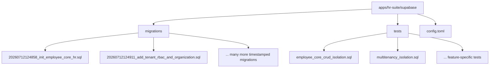
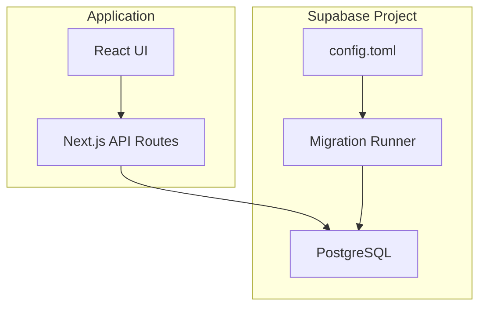
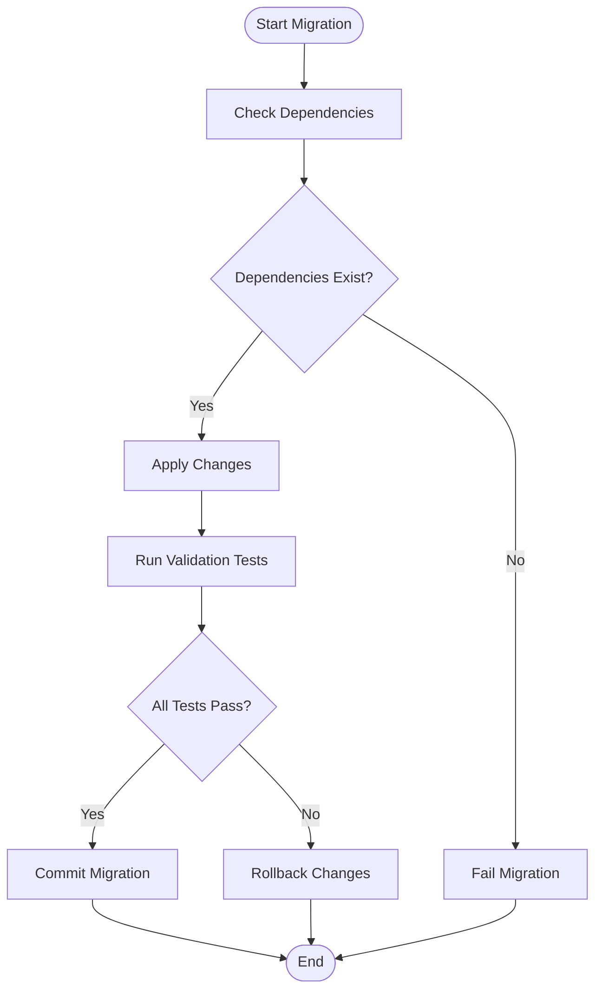
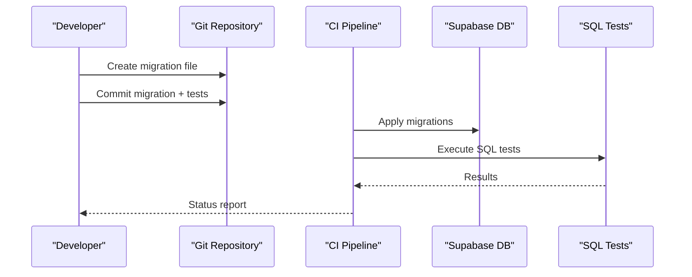

# Migrations & Database Maintenance

<cite>
**Referenced Files in This Document**
- [config.toml](file://apps/hr-suite/supabase/config.toml)
- [20260712124858_init_employee_core_hr.sql](file://apps/hr-suite/supabase/migrations/20260712124858_init_employee_core_hr.sql)
- [20260712124911_add_tenant_rbac_and_organization.sql](file://apps/hr-suite/supabase/migrations/20260712124911_add_tenant_rbac_and_organization.sql)
- [20260712125420_revoke_public_rls_trigger_execution.sql](file://apps/hr-suite/supabase/migrations/20260712125420_revoke_public_rls_trigger_execution.sql)
- [20260712125522_optimize_rbac_indexes_and_policies.sql](file://apps/hr-suite/supabase/migrations/20260712125522_optimize_rbac_indexes_and_policies.sql)
- [20260714170949_harden_organization_authorization.sql](file://apps/hr-suite/supabase/migrations/20260714170949_harden_organization_authorization.sql)
- [20260714171241_link_employees_from_auth_trigger.sql](file://apps/hr-suite/supabase/migrations/20260714171241_link_employees_from_auth_trigger.sql)
- [20260714174305_add_multitenancy_administrations.sql](file://apps/hr-suite/supabase/migrations/20260714174305_add_multitenancy_administrations.sql)
- [20260714175659_seed_multitenancy_demo.sql](file://apps/hr-suite/supabase/migrations/20260714175659_seed_multitenancy_demo.sql)
- [20260714180142_enforce_administration_management_scope.sql](file://apps/hr-suite/supabase/migrations/20260714180142_enforce_administration_management_scope.sql)
- [20260714180309_index_employee_organization_scope_foreign_keys.sql](file://apps/hr-suite/supabase/migrations/20260714180309_index_employee_organization_scope_foreign_keys.sql)
- [20260715064245_add_user_invitations.sql](file://apps/hr-suite/supabase/migrations/20260715064245_add_user_invitations.sql)
- [20260715064924_harden_user_invitation_acceptance.sql](file://apps/hr-suite/supabase/migrations/20260715064924_harden_user_invitation_acceptance.sql)
- [20260715070404_add_user_preferences.sql](file://apps/hr-suite/supabase/migrations/20260715070404_add_user_preferences.sql)
- [20260715071054_add_employee_identity_matching.sql](file://apps/hr-suite/supabase/migrations/20260715071054_add_employee_identity_matching.sql)
- [20260715071156_add_employment_core.sql](file://apps/hr-suite/supabase/migrations/20260715071156_add_employment_core.sql)
- [20260715071422_add_employment_timelines.sql](file://apps/hr-suite/supabase/migrations/20260715071422_add_employment_timelines.sql)
- [20260715071717_add_employment_terminations.sql](file://apps/hr-suite/supabase/migrations/20260715071717_add_employment_terminations.sql)
- [20260715072010_harden_employment_security.sql](file://apps/hr-suite/supabase/migrations/20260715072010_harden_employment_security.sql)
- [20260715072908_seed_employment_demo.sql](file://apps/hr-suite/supabase/migrations/20260715072908_seed_employment_demo.sql)
- [20260715120810_complete_employee_core.sql](file://apps/hr-suite/supabase/migrations/20260715120810_complete_employee_core.sql)
- [20260715121304_optimize_employee_core_indexes.sql](file://apps/hr-suite/supabase/migrations/20260715121304_optimize_employee_core_indexes.sql)
- [20260715122802_add_custom_field_definitions.sql](file://apps/hr-suite/supabase/migrations/20260715122802_add_custom_field_definitions.sql)
- [20260715123119_add_custom_field_value_rpc.sql](file://apps/hr-suite/supabase/migrations/20260715123119_add_custom_field_value_rpc.sql)
- [20260715123639_add_organization_authorization_management.sql](file://apps/hr-suite/supabase/migrations/20260715123639_add_organization_authorization_management.sql)
- [20260715123927_harden_custom_field_values.sql](file://apps/hr-suite/supabase/migrations/20260715123927_harden_custom_field_values.sql)
- [20260715124506_isolate_employee_secure_identifiers.sql](file://apps/hr-suite/supabase/migrations/20260715124506_isolate_employee_secure_identifiers.sql)
- [20260715124744_allow_logged_bsn_reveal.sql](file://apps/hr-suite/supabase/migrations/20260715124744_allow_logged_bsn_reveal.sql)
- [20260715130026_index_secure_employee_foreign_keys.sql](file://apps/hr-suite/supabase/migrations/20260715130026_index_secure_employee_foreign_keys.sql)
- [20260715131230_seed_custom_fields_and_tenant_roles.sql](file://apps/hr-suite/supabase/migrations/20260715131230_seed_custom_fields_and_tenant_roles.sql)
- [20260715141843_add_employment_change_management.sql](file://apps/hr-suite/supabase/migrations/20260715141843_add_employment_change_management.sql)
- [20260715145432_optimize_employment_change_management.sql](file://apps/hr-suite/supabase/migrations/20260715145432_optimize_employment_change_management.sql)
- [20260715173629_restore_employee_subresource_grants.sql](file://apps/hr-suite/supabase/migrations/20260715173629_restore_employee_subresource_grants.sql)
- [20260716081000_add_time_hub_reminders.sql](file://apps/hr-suite/supabase/migrations/20260716081000_add_time_hub_reminders.sql)
- [20260716090000_fix_reminder_recipient_rls_recursion.sql](file://apps/hr-suite/supabase/migrations/20260716090000_fix_reminder_recipient_rls_recursion.sql)
- [20260716092000_fix_reminder_publish_auth_lookup.sql](file://apps/hr-suite/supabase/migrations/20260716092000_fix_reminder_publish_auth_lookup.sql)
- [20260716092637_add_hera_ai_agent.sql](file://apps/hr-suite/supabase/migrations/20260716092637_add_hera_ai_agent.sql)
- [20260716100000_add_combined_employment_change_sets.sql](file://apps/hr-suite/supabase/migrations/20260716100000_add_combined_employment_change_sets.sql)
- [20260716110000_add_organization_chart_read_model.sql](file://apps/hr-suite/supabase/migrations/20260716110000_add_organization_chart_read_model.sql)
- [20260716120000_add_personal_dashboards.sql](file://apps/hr-suite/supabase/migrations/20260716120000_add_personal_dashboards.sql)
- [20260717100000_harden_hera_memory_and_preferences.sql](file://apps/hr-suite/supabase/migrations/20260717100000_harden_hera_memory_and_preferences.sql)
- [20260717100500_index_hera_preferences.sql](file://apps/hr-suite/supabase/migrations/20260717100500_index_hera_preferences.sql)
- [20260717101000_add_hera_message_metadata.sql](file://apps/hr-suite/supabase/migrations/20260717101000_add_hera_message_metadata.sql)
- [20260718090000_complete_employment_flow.sql](file://apps/hr-suite/supabase/migrations/20260718090000_complete_employment_flow.sql)
- [20260718100000_add_job_catalog_salary_revisions.sql](file://apps/hr-suite/supabase/migrations/20260718100000_add_job_catalog_salary_revisions.sql)
- [20260718100500_add_master_data_mutation_rpcs.sql](file://apps/hr-suite/supabase/migrations/20260718100500_add_master_data_mutation_rpcs.sql)
- [20260718100600_index_master_data_foreign_keys.sql](file://apps/hr-suite/supabase/migrations/20260718100600_index_master_data_foreign_keys.sql)
- [20260718110000_add_employee_document_dossiers.sql](file://apps/hr-suite/supabase/migrations/20260718110000_add_employee_document_dossiers.sql)
- [20260718110100_fix_document_reminder_recipient_resolution.sql](file://apps/hr-suite/supabase/migrations/20260718110100_fix_document_reminder_recipient_resolution.sql)
- [20260718120000_add_hr_change_event_projection.sql](file://apps/hr-suite/supabase/migrations/20260718120000_add_hr_change_event projection.sql)
- [20260718121308_add_settings_modules_work_patterns_holidays.sql](file://apps/hr-suite/supabase/migrations/20260718121308_add_settings_modules_work_patterns_holidays.sql)
- [20260718122138_harden_settings_rosters_holidays.sql](file://apps/hr-suite/supabase/migrations/20260718122138_harden_settings_rosters_holidays.sql)
- [20260718122614_enforce_optional_module_guards.sql](file://apps/hr-suite/supabase/migrations/20260718122614_enforce_optional_module_guards.sql)
- [20260718122751_expose_module_state_to_tenant_users.sql](file://apps/hr-suite/supabase/migrations/20260718122751_expose_module_state_to_tenant_users.sql)
- [20260718123742_add_holiday_snapshot_import.sql](file://apps/hr-suite/supabase/migrations/20260718123742_add_holiday_snapshot_import.sql)
- [20260718124240_allow_hr_calendar_recipient_read.sql](file://apps/hr-suite/supabase/migrations/20260718124240_allow_hr_calendar_recipient_read.sql)
- [20260718130000_add_hr_calendar_permission.sql](file://apps/hr-suite/supabase/migrations/20260718130000_add_hr_calendar_permission.sql)
- [20260718131000_harden_hr_master_data_document_policies.sql](file://apps/hr-suite/supabase/migrations/20260718131000_harden_hr_master_data_document_policies.sql)
- [20260718132000_split_reminder_target_write_policy.sql](file://apps/hr-suite/supabase/migrations/20260718132000_split_reminder_target_write_policy.sql)
- [20260718150000_add_employee_archive_and_avatar_state.sql](file://apps/hr-suite/supabase/migrations/20260718150000_add_employee_archive_and_avatar_state.sql)
- [20260718170000_add_dashboard_widget_catalog.sql](file://apps/hr-suite/supabase/migrations/20260718170000_add_dashboard_widget_catalog.sql)
- [20260718171000_relax_dashboard_widget_read_scope.sql](file://apps/hr-suite/supabase/migrations/20260718171000_relax_dashboard_widget_read_scope.sql)
- [20260718172000_expand_personal_dashboard_widget_types.sql](file://apps/hr-suite/supabase/migrations/20260718172000_expand_personal_dashboard_widget_types.sql)
- [20260718172051_grant_dashboard_widget_admin_permissions.sql](file://apps/hr-suite/supabase/migrations/20260718172051_grant_dashboard_widget_admin_permissions.sql)
- [20260718173000_tune_dashboard_widget_policies.sql](file://apps/hr-suite/supabase/migrations/20260718173000_tune_dashboard_widget_policies.sql)
- [20260718180354_add_date_time_user_preferences.sql](file://apps/hr-suite/supabase/migrations/20260718180354_add_date_time_user_preferences.sql)
- [20260719101500_refine_employee_document_upload_rules.sql](file://apps/hr-suite/supabase/migrations/20260719101500_refine_employee_document_upload_rules.sql)
- [20260719112000_add_week_numbering_user_preference.sql](file://apps/hr-suite/supabase/migrations/20260719112000_add_week_numbering_user_preference.sql)
- [20260719153000_add_star_performer_management.sql](file://apps/hr-suite/supabase/migrations/20260719153000_add_star_performer_management.sql)
- [20260719170000_add_tenant_relation_type_catalog.sql](file://apps/hr-suite/supabase/migrations/20260719170000_add_tenant_relation_type_catalog.sql)
- [20260719180000_allow_custom_relation_type_catalog_entries.sql](file://apps/hr-suite/supabase/migrations/20260719180000_allow_custom_relation_type_catalog_entries.sql)
- [20260719181000_index_relation_type_catalog_fk.sql](file://apps/hr-suite/supabase/migrations/20260719181000_index_relation_type_catalog_fk.sql)
- [20260722142551_add_leave_engine_foundation.sql](file://apps/hr-suite/supabase/migrations/20260722142551_add_leave_engine_foundation.sql)
- [20260722144232_add_leave_engine_fk_indexes.sql](file://apps/hr-suite/supabase/migrations/20260722144232_add_leave_engine_fk_indexes.sql)
- [20260722144344_add_leave_transaction_bucket_fk_index.sql](file://apps/hr-suite/supabase/migrations/20260722144344_add_leave_transaction_bucket_fk_index.sql)
- [20260722151920_add_leave_configuration_mutation_functions.sql](file://apps/hr-suite/supabase/migrations/20260722151920_add_leave_configuration_mutation_functions.sql)
- [20260722173000_add_work_hour_type_colors.sql](file://apps/hr-suite/supabase/migrations/20260722173000_add_work_hour_type_colors.sql)
- [20260722173100_normalize_catalog_color_defaults.sql](file://apps/hr-suite/supabase/migrations/20260722173100_normalize_catalog_color_defaults.sql)
- [20260722190000_add_leave_request_booking_engine.sql](file://apps/hr-suite/supabase/migrations/20260722190000_add_leave_request_booking_engine.sql)
- [20260722190500_seed_leave_demo_linda.sql](file://apps/hr-suite/supabase/migrations/20260722190500_seed_leave_demo_linda.sql)
- [20260722191500_add_leave_request_fk_indexes.sql](file://apps/hr-suite/supabase/migrations/20260722191500_add_leave_request_fk_indexes.sql)
- [20260722192000_add_leave_ledger_operations.sql](file://apps/hr-suite/supabase/migrations/202622192000_add_leave_ledger_operations.sql)
- [20260722192100_seed_leave_demo_year_controls.sql](file://apps/hr-suite/supabase/migrations/20260722192100_seed_leave_demo_year_controls.sql)
- [20260722192500_skip_holidays_in_leave_requests.sql](file://apps/hr-suite/supabase/migrations/20260722192500_skip_holidays_in_leave_requests.sql)
- [20260723151000_optimize_employee_overview.sql](file://apps/hr-suite/supabase/migrations/20260723151000_optimize_employee_overview.sql)
- [20260724095433_insights_report_permissions.sql](file://apps/hr-suite/supabase/migrations/20260724095433_insights_report_permissions.sql)
- [20260724100605_upcoming_events_and_anniversary_rules.sql](file://apps/hr-suite/supabase/migrations/20260724100605_upcoming_events_and_anniversary_rules.sql)
- [20260724103939_simplify_roles_and_insights_events.sql](file://apps/hr-suite/supabase/migrations/20260724103939_simplify_roles_and_insights_events.sql)
- [20260724112407_add_role_assignment_scope.sql](file://apps/hr-suite/supabase/migrations/20260724112407_add_role_assignment_scope.sql)
- [20260724160000_add_employee_activity_entries.sql](file://apps/hr-suite/supabase/migrations/20260724160000_add_employee_activity_entries.sql)
- [20260724172716_harden_employee_activity_entries.sql](file://apps/hr-suite/supabase/migrations/20260724172716_harden_employee_activity_entries.sql)
- [20260725132351_address_input_internationalization.sql](file://apps/hr-suite/supabase/migrations/20260725132351_address_input_internationalization.sql)
- [accept_user_invitation.sql](file://apps/hr-suite/supabase/tests/accept_user_invitation.sql)
- [custom_fields_isolation.sql](file://apps/hr-suite/supabase/tests/custom_fields_isolation.sql)
- [custom_relation_type_catalog.sql](file://apps/hr-suite/supabase/tests/custom_relation_type_catalog.sql)
- [employee_core_crud_isolation.sql](file://apps/hr-suite/supabase/tests/employee_core_crud_isolation.sql)
- [employee_document_dossiers.sql](file://apps/hr-suite/supabase/tests/employee_document_dossiers.sql)
- [employee_document_upload_rules.sql](file://apps/hr-suite/supabase/tests/employee_document_upload_rules.sql)
- [employee_identity_matching.sql](file://apps/hr-suite/supabase/tests/employee_identity_matching.sql)
- [employee_overview.sql](file://apps/hr-suite/supabase/tests/employee_overview.sql)
- [employee_secure_identifiers.sql](file://apps/hr-suite/supabase/tests/employee_secure_identifiers.sql)
- [employee_subresource_grants.sql](file://apps/hr-suite/supabase/tests/employee_subresource_grants.sql)
- [employment_change_management.sql](file://apps/hr-suite/supabase/tests/employment_change_management.sql)
- [employment_complete_flow.sql](file://apps/hr-suite/supabase/tests/employment_complete_flow.sql)
- [employment_core.sql](file://apps/hr-suite/supabase/tests/employment_core.sql)
- [employment_demo_counts.sql](file://apps/hr-suite/supabase/tests/employment_demo_counts.sql)
- [employment_terminations.sql](file://apps/hr-suite/supabase/tests/employment_terminations.sql)
- [employment_timelines.sql](file://apps/hr-suite/supabase/tests/employment_timelines.sql)
- [hera_ai_agent.sql](file://apps/hr-suite/supabase/tests/hera_ai_agent.sql)
- [hera_data_agent.sql](file://apps/hr-suite/supabase/tests/hera_data_agent.sql)
- [hr_calendar_authorization.sql](file://apps/hr-suite/supabase/tests/hr_calendar_authorization.sql)
- [hr_change_event_projection.sql](file://apps/hr-suite/supabase/tests/hr_change_event_projection.sql)
- [job_catalog_salary_revisions.sql](file://apps/hr-suite/supabase/tests/job_catalog_salary_revisions.sql)
- [leave_engine_foundation.sql](file://apps/hr-suite/supabase/tests/leave_engine_foundation.sql)
- [multitenancy_isolation.sql](file://apps/hr-suite/supabase/tests/multitenancy_isolation.sql)
- [organization_authorization_management.sql](file://apps/hr-suite/supabase/tests/organization_authorization_management.sql)
- [organization_chart.sql](file://apps/hr-suite/supabase/tests/organization_chart.sql)
- [personal_dashboards.sql](file://apps/hr-suite/supabase/tests/personal_dashboards.sql)
- [reminders.sql](file://apps/hr-suite/supabase/tests/reminders.sql)
- [settings_rosters_holidays.sql](file://apps/hr-suite/supabase/tests/settings_rosters_holidays.sql)
- [star_performer_management.sql](file://apps/hr-suite/supabase/tests/star_performer_management.sql)
- [tenant_relation_type_catalog.sql](file://apps/hr-suite/supabase/tests/tenant_relation_type_catalog.sql)
- [user_invitation_isolation.sql](file://apps/hr-suite/supabase/tests/user_invitation_isolation.sql)
- [user_preferences_isolation.sql](file://apps/hr-suite/supabase/tests/user_preferences_isolation.sql)
- [week_numbering_user_preference.sql](file://apps/hr-suite/supabase/tests/week_numbering_user_preference.sql)
</cite>

## Table of Contents
1. [Introduction](#introduction)
2. [Project Structure](#project-structure)
3. [Core Components](#core-components)
4. [Architecture Overview](#architecture-overview)
5. [Detailed Component Analysis](#detailed-component-analysis)
6. [Dependency Analysis](#dependency-analysis)
7. [Performance Considerations](#performance-considerations)
8. [Troubleshooting Guide](#troubleshooting-guide)
9. [Conclusion](#conclusion)
10. [Appendices](#appendices)

## Introduction
This document explains LiquidHR’s database migration strategy and maintenance procedures, focusing on the Supabase-managed PostgreSQL schema under apps/hr-suite/supabase. It covers naming conventions, version control practices, rollback strategies, configuration and connection pooling, performance tuning, backup and recovery, data export/import, monitoring, testing approaches for migrations, development workflow for schema changes, production deployment considerations, scaling, indexing strategies, and query optimization techniques.

## Project Structure
The database layer is organized under apps/hr-suite/supabase:
- migrations: timestamp-prefixed SQL files defining incremental schema changes.
- tests: SQL-based test suites validating behavior and isolation across tenants and features.
- config.toml: Supabase project configuration (e.g., environment settings, service toggles).

**Diagram sources**
- [config.toml](file://apps/hr-suite/supabase/config.toml)
- [20260712124858_init_employee_core_hr.sql](file://apps/hr-suite/supabase/migrations/20260712124858_init_employee_core_hr.sql)
- [20260712124911_add_tenant_rbac_and_organization.sql](file://apps/hr-suite/supabase/migrations/20260712124911_add_tenant_rbac_and_organization.sql)
- [employee_core_crud_isolation.sql](file://apps/hr-suite/supabase/tests/employee_core_crud_isolation.sql)
- [multitenancy_isolation.sql](file://apps/hr-suite/supabase/tests/multitenancy_isolation.sql)

**Section sources**
- [config.toml](file://apps/hr-suite/supabase/config.toml)

## Core Components
- Migration files: Each file is a self-contained, idempotent change set applied in order by timestamp prefix. They create tables, add constraints, define RLS policies, functions/RPCs, and indexes.
- Test suites: SQL scripts that assert expected behaviors, isolation guarantees, and policy correctness against the migrated schema.
- Configuration: Centralized Supabase configuration controlling runtime behavior and feature flags.

Key responsibilities:
- Schema evolution via ordered migrations.
- Security enforcement through Row Level Security (RLS) policies and role separation.
- Performance tuning via targeted indexes and function design.
- Data integrity via foreign keys, constraints, and transactional RPCs.

**Section sources**
- [20260712124858_init_employee_core_hr.sql](file://apps/hr-suite/supabase/migrations/20260712124858_init_employee_core_hr.sql)
- [20260712124911_add_tenant_rbac_and_organization.sql](file://apps/hr-suite/supabase/migrations/20260712124911_add_tenant_rbac_and_organization.sql)
- [20260712125420_revoke_public_rls_trigger_execution.sql](file://apps/hr-suite/supabase/migrations/20260712125420_revoke_public_rls_trigger_execution.sql)
- [20260712125522_optimize_rbac_indexes_and_policies.sql](file://apps/hr-suite/supabase/migrations/20260712125522_optimize_rbac_indexes_and_policies.sql)
- [employee_core_crud_isolation.sql](file://apps/hr-suite/supabase/tests/employee_core_crud_isolation.sql)
- [multitenancy_isolation.sql](file://apps/hr-suite/supabase/tests/multitenancy_isolation.sql)

## Architecture Overview
LiquidHR uses a Supabase-managed PostgreSQL database with application code accessing it via standard drivers or Supabase clients. The migration system enforces an ordered, versioned schema evolution. Tests validate both functional behavior and security boundaries.

[No sources needed since this diagram shows conceptual architecture]

## Detailed Component Analysis

### Migration Naming Conventions and Version Control
- Naming: Each migration file follows a YYYYMMDDHHMMSS_<description>.sql pattern. Timestamps ensure deterministic ordering and easy identification of when a change was introduced.
- Version control: All migrations are committed to Git alongside application code. Reviewers can trace schema evolution chronologically.
- Idempotency: Migrations should be safe to re-run locally without side effects; use conditional checks where necessary.

Examples of convention usage:
- Initial core schema: [20260712124858_init_employee_core_hr.sql](file://apps/hr-suite/supabase/migrations/20260712124858_init_employee_core_hr.sql)
- Adding tenant RBAC and organization model: [20260712124911_add_tenant_rbac_and_organization.sql](file://apps/hr-suite/supabase/migrations/20260712124911_add_tenant_rbac_and_organization.sql)
- Hardening authorization: [20260714170949_harden_organization_authorization.sql](file://apps/hr-suite/supabase/migrations/20260714170949_harden_organization_authorization.sql)

**Section sources**
- [20260712124858_init_employee_core_hr.sql](file://apps/hr-suite/supabase/migrations/20260712124858_init_employee_core_hr.sql)
- [20260712124911_add_tenant_rbac_and_organization.sql](file://apps/hr-suite/supabase/migrations/20260712124911_add_tenant_rbac_and_organization.sql)
- [20260714170949_harden_organization_authorization.sql](file://apps/hr-suite/supabase/migrations/20260714170949_harden_organization_authorization.sql)

### Rollback Procedures
- Preferred approach: Create a forward-only “undo” migration that reverses changes safely (e.g., drop columns, remove policies, revert indexes). Avoid destructive operations unless validated.
- Safe patterns:
  - Use transactions within migrations to ensure atomicity.
  - Guard drops with existence checks to prevent failures on repeated runs.
  - Preserve data by migrating before dropping columns or constraints.
- Example patterns in repository:
  - Revoke public trigger execution to harden security: [20260712125420_revoke_public_rls_trigger_execution.sql](file://apps/hr-suite/supabase/migrations/20260712125420_revoke_public_rls_trigger_execution.sql)
  - Optimize indexes and policies as corrective measures: [20260712125522_optimize_rbac_indexes_and_policies.sql](file://apps/hr-suite/supabase/migrations/20260712125522_optimize_rbac_indexes_and_policies.sql)

**Section sources**
- [20260712125420_revoke_public_rls_trigger_execution.sql](file://apps/hr-suite/supabase/migrations/20260712125420_revoke_public_rls_trigger_execution.sql)
- [20260712125522_optimize_rbac_indexes_and_policies.sql](file://apps/hr-suite/supabase/migrations/20260712125522_optimize_rbac_indexes_and_policies.sql)

### Database Configuration Options and Connection Pooling
- Configuration file: apps/hr-suite/supabase/config.toml defines project-level settings.
- Connection pooling: Managed by Supabase; applications should configure client-side pools according to workload characteristics (max connections, idle timeouts).
- Environment variables: Use environment-specific configurations for local, staging, and production environments.

Best practices:
- Keep sensitive credentials out of source control.
- Align pool sizes with expected concurrency and database capacity.
- Monitor connection usage and adjust pool parameters based on metrics.

**Section sources**
- [config.toml](file://apps/hr-suite/supabase/config.toml)

### Backup and Recovery Procedures
- Backups: Use Supabase-native backups or external tools compatible with PostgreSQL. Schedule regular full and incremental backups.
- Recovery: Validate restore procedures periodically using isolated environments. Ensure point-in-time recovery options are available if supported by your hosting provider.
- Data retention: Define retention policies aligned with compliance requirements.

Operational checklist:
- Automate backup scheduling and notifications.
- Test restore processes regularly.
- Document runbooks for disaster recovery scenarios.

[No sources needed since this section provides general guidance]

### Data Export and Import Processes
- Export: Use pg_dump or Supabase CLI to export schemas and data. For large datasets, consider partitioned exports or logical replication.
- Import: Load into target environments using psql or Supabase CLI. Validate data integrity post-import.
- Seeding: Use dedicated seed migrations for demo/reference data (e.g., multitenancy demo, employment demo, leave demo).

Examples:
- Seed multitenancy demo: [20260714175659_seed_multitenancy_demo.sql](file://apps/hr-suite/supabase/migrations/20260714175659_seed_multitenancy_demo.sql)
- Seed employment demo: [20260715072908_seed_employment_demo.sql](file://apps/hr-suite/supabase/migrations/20260715072908_seed_employment_demo.sql)
- Seed leave demo: [20260722190500_seed_leave_demo_linda.sql](file://apps/hr-suite/supabase/migrations/20260722190500_seed_leave_demo_linda.sql)

**Section sources**
- [20260714175659_seed_multitenancy_demo.sql](file://apps/hr-suite/supabase/migrations/20260714175659_seed_multitenancy_demo.sql)
- [20260715072908_seed_employment_demo.sql](file://apps/hr-suite/supabase/migrations/20260715072908_seed_employment_demo.sql)
- [20260722190500_seed_leave_demo_linda.sql](file://apps/hr-suite/supabase/migrations/20260722190500_seed_leave_demo_linda.sql)

### Monitoring Strategies
- Query performance: Monitor slow queries, index usage, and lock contention.
- Resource utilization: Track CPU, memory, disk I/O, and connection counts.
- Error tracking: Capture and alert on failed migrations, constraint violations, and policy denials.
- Observability: Integrate logs and metrics with centralized monitoring systems.

Recommended actions:
- Enable query logging in development/staging.
- Set up alerts for abnormal error rates and resource spikes.
- Regularly review execution plans for critical queries.

[No sources needed since this section provides general guidance]

### Testing Approaches for Migrations
- SQL-based tests: Each feature area has corresponding SQL tests asserting behavior, isolation, and policy correctness.
- Isolation: Tests verify tenant isolation, custom field scoping, and secure identifier handling.
- Coverage: Focus on critical paths like employee CRUD, employment lifecycle, reminders, HR calendar permissions, and leave engine operations.

Examples:
- Employee core CRUD isolation: [employee_core_crud_isolation.sql](file://apps/hr-suite/supabase/tests/employee_core_crud_isolation.sql)
- Multitenancy isolation: [multitenancy_isolation.sql](file://apps/hr-suite/supabase/tests/multitenancy_isolation.sql)
- Employment complete flow: [employment_complete_flow.sql](file://apps/hr-suite/supabase/tests/employment_complete_flow.sql)
- Leave engine foundation: [leave_engine_foundation.sql](file://apps/hr-suite/supabase/tests/leave_engine_foundation.sql)

**Section sources**
- [employee_core_crud_isolation.sql](file://apps/hr-suite/supabase/tests/employee_core_crud_isolation.sql)
- [multitenancy_isolation.sql](file://apps/hr-suite/supabase/tests/multitenancy_isolation.sql)
- [employment_complete_flow.sql](file://apps/hr-suite/supabase/tests/employment_complete_flow.sql)
- [leave_engine_foundation.sql](file://apps/hr-suite/supabase/tests/leave_engine_foundation.sql)

### Development Workflow for Schema Changes
- Create a new migration file with a descriptive name and timestamp prefix.
- Implement changes incrementally; prefer additive changes (new columns, tables) over destructive ones.
- Add or update SQL tests to cover new functionality and edge cases.
- Run local migrations and tests to validate behavior.
- Commit migration and tests together; include rationale in commit messages.

Example progression:
- Add user invitations: [20260715064245_add_user_invitations.sql](file://apps/hr-suite/supabase/migrations/20260715064245_add_user_invitations.sql)
- Harden invitation acceptance: [20260715064924_harden_user_invitation_acceptance.sql](file://apps/hr-suite/supabase/migrations/20260715064924_harden_user_invitation_acceptance.sql)
- Test invitation acceptance: [accept_user_invitation.sql](file://apps/hr-suite/supabase/tests/accept_user_invitation.sql)

**Section sources**
- [20260715064245_add_user_invitations.sql](file://apps/hr-suite/supabase/migrations/20260715064245_add_user_invitations.sql)
- [20260715064924_harden_user_invitation_acceptance.sql](file://apps/hr-suite/supabase/migrations/20260715064924_harden_user_invitation_acceptance.sql)
- [accept_user_invitation.sql](file://apps/hr-suite/supabase/tests/accept_user_invitation.sql)

### Production Deployment Considerations
- Pre-deployment validation: Run all migrations and tests in a staging environment mirroring production.
- Zero-downtime deployments: Prefer additive schema changes and backfill jobs to avoid blocking writes.
- Rollback readiness: Ensure undo migrations are tested and documented.
- Change windows: Schedule migrations during low-traffic periods when possible.
- Post-deployment verification: Confirm key queries perform within SLAs and no unexpected errors occur.

[No sources needed since this section provides general guidance]

### Database Scaling, Indexing Strategies, and Query Optimization
- Scaling:
  - Vertical scaling: Increase instance size for higher CPU/memory/disk.
  - Horizontal scaling: Read replicas for read-heavy workloads; consider sharding for extreme scale.
- Indexing:
  - Add indexes on frequently filtered/joined columns (e.g., foreign keys, scopes).
  - Examples:
    - Employee organization scope FK indexes: [20260714180309_index_employee_organization_scope_foreign_keys.sql](file://apps/hr-suite/supabase/migrations/20260714180309_index_employee_organization_scope_foreign_keys.sql)
    - Secure employee FK indexes: [20260715130026_index_secure_employee_foreign_keys.sql](file://apps/hr-suite/supabase/migrations/20260715130026_index_secure_employee_foreign_keys.sql)
    - Hera preferences index: [20260717100500_index_hera_preferences.sql](file://apps/hr-suite/supabase/migrations/20260717100500_index_hera_preferences.sql)
    - Master data FK indexes: [20260718100600_index_master_data_foreign_keys.sql](file://apps/hr-suite/supabase/migrations/20260718100600_index_master_data_foreign_keys.sql)
    - Leave engine FK indexes: [20260722144232_add_leave_engine_fk_indexes.sql](file://apps/hr-suite/supabase/migrations/20260722144232_add_leave_engine_fk_indexes.sql), [20260722144344_add_leave_transaction_bucket_fk_index.sql](file://apps/hr-suite/supabase/migrations/20260722144344_add_leave_transaction_bucket_fk_index.sql), [20260722191500_add_leave_request_fk_indexes.sql](file://apps/hr-suite/supabase/migrations/20260722191500_add_leave_request_fk_indexes.sql)
- Query optimization:
  - Analyze execution plans for slow queries.
  - Use appropriate joins, avoid unnecessary selects, and leverage materialized views for heavy aggregations.
  - Tune server parameters (work_mem, shared_buffers) based on workload.

**Section sources**
- [20260714180309_index_employee_organization_scope_foreign_keys.sql](file://apps/hr-suite/supabase/migrations/20260714180309_index_employee_organization_scope_foreign_keys.sql)
- [20260715130026_index_secure_employee_foreign_keys.sql](file://apps/hr-suite/supabase/migrations/20260715130026_index_secure_employee_foreign_keys.sql)
- [20260717100500_index_hera_preferences.sql](file://apps/hr-suite/supabase/migrations/20260717100500_index_hera_preferences.sql)
- [20260718100600_index_master_data_foreign_keys.sql](file://apps/hr-suite/supabase/migrations/20260718100600_index_master_data_foreign_keys.sql)
- [20260722144232_add_leave_engine_fk_indexes.sql](file://apps/hr-suite/supabase/migrations/20260722144232_add_leave_engine_fk_indexes.sql)
- [20260722144344_add_leave_transaction_bucket_fk_index.sql](file://apps/hr-suite/supabase/migrations/20260722144344_add_leave_transaction_bucket_fk_index.sql)
- [20260722191500_add_leave_request_fk_indexes.sql](file://apps/hr-suite/supabase/migrations/20260722191500_add_leave_request_fk_indexes.sql)

## Dependency Analysis
Migrations often depend on prior schema elements. Dependencies are implicit through timestamps and explicit through references to existing tables/columns.

[No sources needed since this diagram shows conceptual workflow]

**Section sources**
- [20260712124858_init_employee_core_hr.sql](file://apps/hr-suite/supabase/migrations/20260712124858_init_employee_core_hr.sql)
- [20260712124911_add_tenant_rbac_and_organization.sql](file://apps/hr-suite/supabase/migrations/20260712124911_add_tenant_rbac_and_organization.sql)

## Performance Considerations
- Index management: Regularly review index usage and remove unused indexes.
- Query patterns: Favor selective filters, avoid N+1 queries, and use batch operations.
- Lock contention: Minimize long-running transactions and avoid holding locks across multiple statements.
- Storage: Partition large tables if necessary; archive historical data appropriately.

[No sources needed since this section provides general guidance]

## Troubleshooting Guide
Common issues and resolutions:
- Migration failures due to missing dependencies: Ensure prerequisite migrations are applied first.
- Policy denials: Verify RLS policies allow intended access; audit policy logic.
- Slow queries: Analyze execution plans, add or refine indexes, and optimize joins.
- Test failures: Reproduce locally with clean schema; check data seeding and isolation assumptions.

Useful examples:
- Fixing recursion in reminder recipient RLS: [20260716090000_fix_reminder_recipient_rls_recursion.sql](file://apps/hr-suite/supabase/migrations/20260716090000_fix_reminder_recipient_rls_recursion.sql)
- Hardening employee activity entries: [20260724172716_harden_employee_activity_entries.sql](file://apps/hr-suite/supabase/migrations/20260724172716_harden_employee_activity_entries.sql)

**Section sources**
- [20260716090000_fix_reminder_recipient_rls_recursion.sql](file://apps/hr-suite/supabase/migrations/20260716090000_fix_reminder_recipient_rls_recursion.sql)
- [20260724172716_harden_employee_activity_entries.sql](file://apps/hr-suite/supabase/migrations/20260724172716_harden_employee_activity_entries.sql)

## Conclusion
LiquidHR’s database strategy centers on timestamped, incremental SQL migrations managed by Supabase, complemented by comprehensive SQL-based tests. The approach emphasizes safety, clarity, and maintainability, with strong emphasis on security (RLS), performance (indexes, query optimization), and operational reliability (backups, monitoring). Following the outlined workflows ensures consistent schema evolution and robust production deployments.

## Appendices

### Migration Sequence Flow

[No sources needed since this diagram shows conceptual workflow]