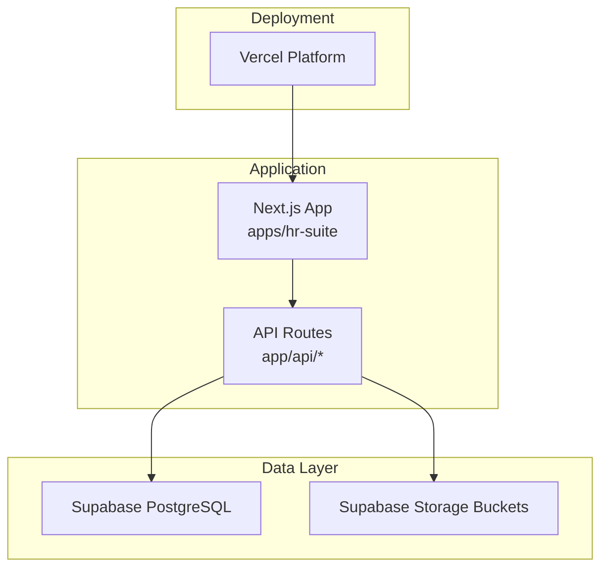
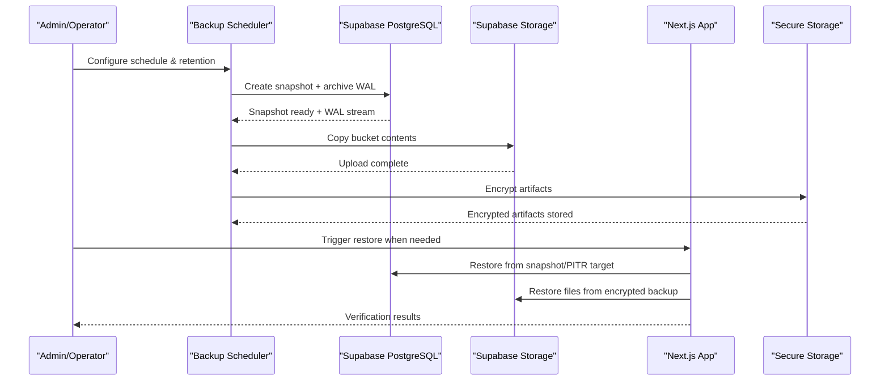
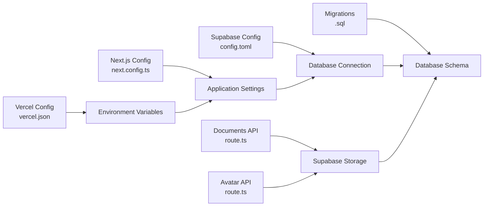

# Backup and Recovery

<cite>
**Referenced Files in This Document**
- [vercel.json](file://vercel.json)
- [package.json](file://package.json)
- [apps/hr-suite/supabase/config.toml](file://apps/hr-suite/supabase/config.toml)
- [apps/hr-suite/next.config.ts](file://apps/hr-suite/next.config.ts)
- [apps/hr-suite/app/api/employees/[employeeId]/documents/route.ts](file://apps/hr-suite/app/api/employees/[employeeId]/documents/route.ts)
- [apps/hr-suite/app/api/employees/[employeeId]/avatar/route.ts](file://apps/hr-suite/app/api/employees/[employeeId]/avatar/route.ts)
- [apps/hr-suite/supabase/migrations/20260718110000_add_employee_document_dossiers.sql](file://apps/hr-suite/supabase/migrations/20260718110000_add_employee_document_dossiers.sql)
- [apps/hr-suite/supabase/migrations/20260719101500_refine_employee_document_upload_rules.sql](file://apps/hr-suite/supabase/migrations/20260719101500_refine_employee_document_upload_rules.sql)
</cite>

## Table of Contents
1. [Introduction](#introduction)
2. [Project Structure](#project-structure)
3. [Core Components](#core-components)
4. [Architecture Overview](#architecture-overview)
5. [Detailed Component Analysis](#detailed-component-analysis)
6. [Dependency Analysis](#dependency-analysis)
7. [Performance Considerations](#performance-considerations)
8. [Troubleshooting Guide](#troubleshooting-guide)
9. [Conclusion](#conclusion)
10. [Appendices](#appendices)

## Introduction
This document provides comprehensive backup and recovery guidance for LiquidHR, covering:
- Database backups and point-in-time recovery (PITR)
- File storage backups for documents and user uploads
- Configuration backups (environment variables, application settings, custom fields)
- Disaster recovery procedures (restore, restart, verification)
- Scheduling, retention policies, and testing recovery
- Data migration between environments and encryption for security compliance

LiquidHR is a Next.js application deployed on Vercel with a Supabase-backed database and object storage for files. The guidance below aligns with these runtime characteristics to ensure reliable data protection and fast recovery.

## Project Structure
Key areas relevant to backup and recovery:
- Application deployment configuration (Vercel)
- Next.js runtime configuration
- Supabase project configuration and migrations
- API routes handling file uploads and metadata persistence

**Diagram sources**
- [vercel.json](file://vercel.json)
- [apps/hr-suite/next.config.ts](file://apps/hr-suite/next.config.ts)
- [apps/hr-suite/supabase/config.toml](file://apps/hr-suite/supabase/config.toml)

**Section sources**
- [vercel.json](file://vercel.json)
- [apps/hr-suite/next.config.ts](file://apps/hr-suite/next.config.ts)
- [apps/hr-suite/supabase/config.toml](file://apps/hr-suite/supabase/config.toml)

## Core Components
- Database: Supabase PostgreSQL with schema managed via migrations.
- File storage: Supabase Storage buckets used by employee document and avatar endpoints.
- Configuration: Environment variables configured at the platform level (Vercel), app-level config in Next.js, and Supabase project configuration.
- Custom fields: Stored as structured metadata in the database and exposed through API routes.

Backup scope must include:
- Database snapshots and WAL archives for PITR
- Storage bucket contents
- Configuration exports (env vars, settings, custom field definitions)

**Section sources**
- [apps/hr-suite/supabase/config.toml](file://apps/hr-suite/supabase/config.toml)
- [apps/hr-suite/supabase/migrations/20260718110000_add_employee_document_dossiers.sql](file://apps/hr-suite/supabase/migrations/20260718110000_add_employee_document_dossiers.sql)
- [apps/hr-suite/supabase/migrations/20260719101500_refine_employee_document_upload_rules.sql](file://apps/hr-suite/supabase/migrations/20260719101500_refine_employee_document_upload_rules.sql)

## Architecture Overview
The backup and recovery architecture integrates platform-native capabilities with application-level export utilities.

[No sources needed since this diagram shows conceptual workflow, not actual code structure]

## Detailed Component Analysis

### Database Backup Strategy
- Automated snapshots: Schedule periodic full backups of the Supabase PostgreSQL instance.
- Point-in-time recovery: Enable continuous WAL archiving to allow recovery to any second within the retention window.
- Export procedures: Use SQL dumps or logical export tools for selective data extraction and cross-environment migration.

Recommended practices:
- Retain multiple generations (daily, weekly, monthly) aligned with RPO/RTO targets.
- Validate integrity post-backup with checksums and sample queries.
- Automate rotation based on retention policy.

Operational steps:
- Configure automated snapshots and WAL archival in the Supabase dashboard or CLI.
- Verify that backups are created and archived successfully on schedule.
- Test restore to a staging environment periodically.

**Section sources**
- [apps/hr-suite/supabase/config.toml](file://apps/hr-suite/supabase/config.toml)

### File Storage Backup Strategy
- Scope: Employee documents and avatars uploaded via API routes.
- Mechanism: Periodically copy all objects from the relevant storage buckets to secure offsite storage.
- Metadata: Preserve object metadata and ACLs; consider exporting access rules if applicable.

Operational steps:
- Identify storage bucket names used by the application.
- Implement scheduled sync jobs to mirror bucket contents to an encrypted destination.
- Validate file counts and sizes after each sync.

**Section sources**
- [apps/hr-suite/app/api/employees/[employeeId]/documents/route.ts](file://apps/hr-suite/app/api/employees/[employeeId]/documents/route.ts)
- [apps/hr-suite/app/api/employees/[employeeId]/avatar/route.ts](file://apps/hr-suite/app/api/employees/[employeeId]/avatar/route.ts)
- [apps/hr-suite/supabase/migrations/20260718110000_add_employee_document_dossiers.sql](file://apps/hr-suite/supabase/migrations/20260718110000_add_employee_document_dossiers.sql)
- [apps/hr-suite/supabase/migrations/20260719101500_refine_employee_document_upload_rules.sql](file://apps/hr-suite/supabase/migrations/20260719101500_refine_employee_document_upload_rules.sql)

### Configuration Backup
- Environment variables: Export secrets and runtime configuration from the deployment platform (Vercel).
- Application settings: Capture module toggles, dashboard widgets, holidays, and other tenant-specific settings persisted in the database.
- Custom field definitions: Back up schema changes and seed data related to custom fields.

Operational steps:
- Use platform tools to export environment variables securely.
- Include database schema migrations and seed scripts in version control.
- Export current settings and custom field definitions as part of the regular backup job.

**Section sources**
- [vercel.json](file://vercel.json)
- [apps/hr-suite/next.config.ts](file://apps/hr-suite/next.config.ts)
- [apps/hr-suite/supabase/migrations/20260718110000_add_employee_document_dossiers.sql](file://apps/hr-suite/supabase/migrations/20260718110000_add_employee_document_dossiers.sql)

### Disaster Recovery Procedures
Restore sequence:
1. Prepare the target environment (database and storage).
2. Restore the database from the latest snapshot or PITR target.
3. Restore file storage contents from the corresponding backup set.
4. Reconfigure environment variables and application settings.
5. Restart services and run verification checks.

Verification checklist:
- Database connectivity and schema integrity.
- Sample queries across core tables (employees, employments, documents, settings).
- File retrieval for representative documents and avatars.
- Authentication and authorization flows.
- Scheduled jobs and background tasks operational.

**Section sources**
- [apps/hr-suite/supabase/config.toml](file://apps/hr-suite/supabase/config.toml)
- [apps/hr-suite/next.config.ts](file://apps/hr-suite/next.config.ts)

### Backup Scheduling and Retention Policies
- Frequency: Daily full snapshots; continuous WAL archival for PITR.
- Retention: Keep daily backups for 7–14 days, weekly for 4–8 weeks, monthly for 6–12 months depending on compliance needs.
- Rotation: Automate deletion of expired artifacts and enforce encryption at rest.

Implementation tips:
- Use platform-native scheduling where available.
- Monitor backup success/failure and alert on anomalies.
- Maintain a documented retention policy and review it regularly.

[No sources needed since this section provides general guidance]

### Testing Recovery Procedures
- Frequency: Quarterly at minimum; before major releases.
- Scope: Full restore to a non-production environment.
- Steps:
  - Provision isolated resources.
  - Restore database and storage.
  - Apply necessary configuration overrides.
  - Execute smoke tests and validation queries.
  - Record results and remediation actions.

[No sources needed since this section provides general guidance]

### Data Migration Between Environments
- Source: Production or staging database snapshot.
- Target: Development or staging environment.
- Process:
  - Export logical dump or use platform migration tools.
  - Apply schema migrations to the target.
  - Import data while preserving referential integrity.
  - Sync storage buckets selectively if needed.
  - Update environment variables and secrets appropriately.

Best practices:
- Mask or anonymize sensitive data for non-production environments.
- Validate data consistency post-migration.
- Document rollback procedures.

[No sources needed since this section provides general guidance]

### Backup Encryption and Security Compliance
- At-rest encryption: Ensure backups are encrypted using strong algorithms and managed keys.
- In-transit encryption: Use TLS for all backup transfers.
- Access control: Restrict backup storage access to authorized personnel and automation accounts.
- Auditability: Log backup operations and key usage for compliance.

Recommendations:
- Use platform-managed encryption where possible.
- Rotate keys periodically and maintain key lifecycle policies.
- Perform periodic audits of backup access and integrity.

[No sources needed since this section provides general guidance]

## Dependency Analysis
Backup and recovery depend on:
- Deployment platform configuration for environment variables and runtime settings.
- Application configuration for connection strings and feature flags.
- Supabase project configuration for database and storage behavior.
- API routes that interact with storage and database.

**Diagram sources**
- [vercel.json](file://vercel.json)
- [apps/hr-suite/next.config.ts](file://apps/hr-suite/next.config.ts)
- [apps/hr-suite/supabase/config.toml](file://apps/hr-suite/supabase/config.toml)
- [apps/hr-suite/app/api/employees/[employeeId]/documents/route.ts](file://apps/hr-suite/app/api/employees/[employeeId]/documents/route.ts)
- [apps/hr-suite/app/api/employees/[employeeId]/avatar/route.ts](file://apps/hr-suite/app/api/employees/[employeeId]/avatar/route.ts)
- [apps/hr-suite/supabase/migrations/20260718110000_add_employee_document_dossiers.sql](file://apps/hr-suite/supabase/migrations/20260718110000_add_employee_document_dossiers.sql)

**Section sources**
- [vercel.json](file://vercel.json)
- [apps/hr-suite/next.config.ts](file://apps/hr-suite/next.config.ts)
- [apps/hr-suite/supabase/config.toml](file://apps/hr-suite/supabase/config.toml)
- [apps/hr-suite/app/api/employees/[employeeId]/documents/route.ts](file://apps/hr-suite/app/api/employees/[employeeId]/documents/route.ts)
- [apps/hr-suite/app/api/employees/[employeeId]/avatar/route.ts](file://apps/hr-suite/app/api/employees/[employeeId]/avatar/route.ts)
- [apps/hr-suite/supabase/migrations/20260718110000_add_employee_document_dossiers.sql](file://apps/hr-suite/supabase/migrations/20260718110000_add_employee_document_dossiers.sql)

## Performance Considerations
- Schedule backups during low-traffic windows to minimize impact.
- Use incremental or differential strategies where supported to reduce I/O.
- Compress and encrypt backups efficiently; balance CPU usage with security requirements.
- Monitor backup duration and resource utilization; adjust schedules accordingly.

[No sources needed since this section provides general guidance]

## Troubleshooting Guide
Common issues and resolutions:
- Backup failures: Check network connectivity, permissions, and storage quotas.
- PITR gaps: Verify WAL archival continuity and retention settings.
- Restore errors: Validate schema compatibility and dependency order.
- File restoration mismatches: Confirm bucket names and object paths match application expectations.

Verification steps:
- Run targeted queries against restored database.
- Retrieve sample files via API endpoints.
- Validate authentication and authorization flows.

**Section sources**
- [apps/hr-suite/supabase/config.toml](file://apps/hr-suite/supabase/config.toml)
- [apps/hr-suite/app/api/employees/[employeeId]/documents/route.ts](file://apps/hr-suite/app/api/employees/[employeeId]/documents/route.ts)
- [apps/hr-suite/app/api/employees/[employeeId]/avatar/route.ts](file://apps/hr-suite/app/api/employees/[employeeId]/avatar/route.ts)

## Conclusion
A robust backup and recovery strategy for LiquidHR combines automated database snapshots, continuous WAL archival for PITR, synchronized file storage backups, and comprehensive configuration exports. By implementing strict retention policies, encryption, and regular recovery testing, organizations can achieve strong resilience and compliance. Clear disaster recovery procedures and migration workflows ensure rapid restoration and safe data movement across environments.

[No sources needed since this section summarizes without analyzing specific files]

## Appendices

### Appendix A: Backup Checklist
- Configure automated snapshots and WAL archival
- Set up storage bucket synchronization
- Export environment variables and application settings
- Encrypt and store backups securely
- Define and enforce retention policies
- Schedule and validate recovery tests

[No sources needed since this section provides general guidance]

### Appendix B: Recovery Checklist
- Provision target environment
- Restore database from snapshot or PITR target
- Restore storage contents
- Apply configuration overrides
- Restart services and verify functionality
- Document outcomes and lessons learned

[No sources needed since this section provides general guidance]