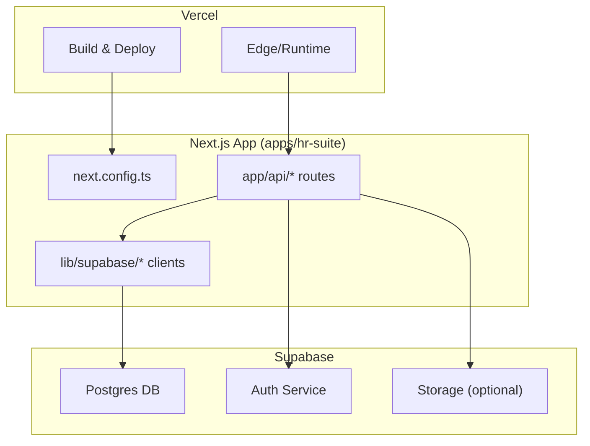
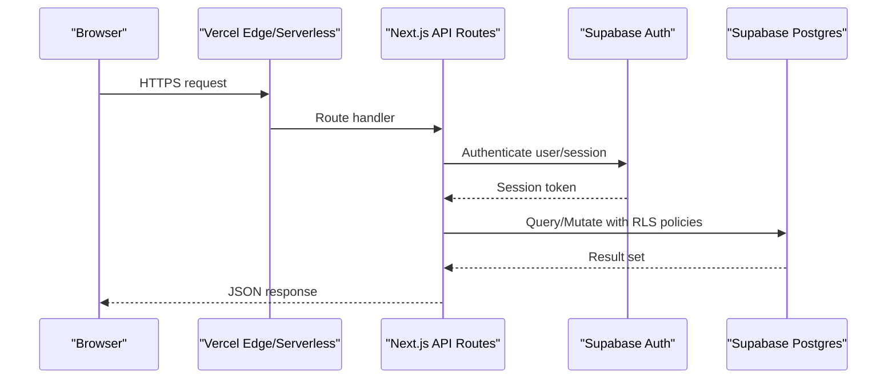
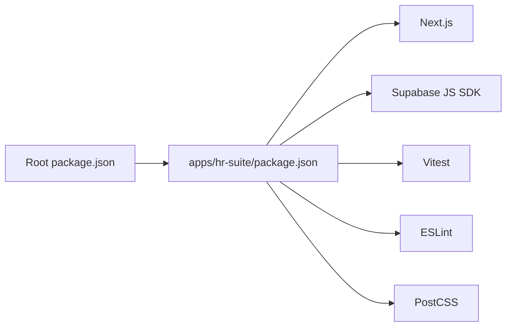

# Deployment Guide

<cite>
**Referenced Files in This Document**
- [vercel.json](file://vercel.json)
- [package.json](file://package.json)
- [apps/hr-suite/package.json](file://apps/hr-suite/package.json)
- [apps/hr-suite/next.config.ts](file://apps/hr-suite/next.config.ts)
- [apps/hr-suite/proxy.ts](file://apps/hr-suite/proxy.ts)
- [apps/hr-suite/supabase/config.toml](file://apps/hr-suite/supabase/config.toml)
- [apps/hr-suite/supabase/migrations/20260712124858_init_employee_core_hr.sql](file://apps/hr-suite/supabase/migrations/20260712124858_init_employee_core_hr.sql)
- [apps/hr-suite/app/api/context/route.ts](file://apps/hr-suite/app/api/context/route.ts)
- [apps/hr-suite/lib/supabase/client.ts](file://apps/hr-suite/lib/supabase/client.ts)
- [apps/hr-suite/lib/supabase/server.ts](file://apps/hr-suite/lib/supabase/server.ts)
- [apps/hr-suite/app/auth/callback/route.ts](file://apps/hr-suite/app/auth/callback/route.ts)
- [apps/hr-suite/app/login/page.tsx](file://apps/hr-suite/app/login/page.tsx)
- [apps/hr-suite/vitest.config.ts](file://apps/hr-suite/vitest.config.ts)
- [apps/hr-suite/eslint.config.mjs](file://apps/hr-suite/eslint.config.mjs)
- [apps/hr-suite/postcss.config.mjs](file://apps/hr-suite/postcss.config.mjs)
- [apps/hr-suite/tsconfig.json](file://apps/hr-suite/tsconfig.json)
- [.gitignore](file://.gitignore)
</cite>

## Table of Contents
1. [Introduction](#introduction)
2. [Project Structure](#project-structure)
3. [Core Components](#core-components)
4. [Architecture Overview](#architecture-overview)
5. [Detailed Component Analysis](#detailed-component-analysis)
6. [Dependency Analysis](#dependency-analysis)
7. [Performance Considerations](#performance-considerations)
8. [Troubleshooting Guide](#troubleshooting-guide)
9. [Conclusion](#conclusion)
10. [Appendices](#appendices)

## Introduction
This deployment guide provides production-ready instructions for deploying LiquidHR on Vercel with Supabase as the database and authentication provider. It covers environment configuration, migration procedures, CI/CD setup, monitoring, logging, backups, scaling, security hardening, performance optimization, and operational best practices. The goal is to enable reliable, secure, and scalable deployments with clear rollback strategies and troubleshooting guidance.

## Project Structure
LiquidHR is a Next.js application under apps/hr-suite with Supabase migrations and tests colocated for easy management. Key deployment-related files include:
- Vercel configuration for build/runtime behavior
- Next.js configuration for runtime settings and proxies
- Supabase client/server initialization and environment variables
- API routes for authentication callbacks and context resolution
- Package scripts for building, linting, testing, and running locally

**Diagram sources**
- [apps/hr-suite/next.config.ts](file://apps/hr-suite/next.config.ts)
- [apps/hr-suite/app/api/context/route.ts](file://apps/hr-suite/app/api/context/route.ts)
- [apps/hr-suite/lib/supabase/client.ts](file://apps/hr-suite/lib/supabase/client.ts)
- [apps/hr-suite/lib/supabase/server.ts](file://apps/hr-suite/lib/supabase/server.ts)

**Section sources**
- [vercel.json](file://vercel.json)
- [apps/hr-suite/next.config.ts](file://apps/hr-suite/next.config.ts)
- [apps/hr-suite/package.json](file://apps/hr-suite/package.json)
- [apps/hr-suite/supabase/config.toml](file://apps/hr-suite/supabase/config.toml)

## Core Components
- Vercel deployment configuration controls build commands, framework detection, and environment variable injection.
- Next.js app defines API routes for server-side operations and integrates with Supabase clients for data access and authentication.
- Supabase configuration and migrations define schema, policies, and seed data.
- Environment variables are consumed by Supabase clients and Next.js runtime.

Key responsibilities:
- Build and deploy pipeline via Vercel
- Runtime configuration via next.config.ts
- Database schema and policies via Supabase migrations
- Authentication flow via callback route and Supabase Auth
- Client/server Supabase SDK usage for secure data access

**Section sources**
- [vercel.json](file://vercel.json)
- [apps/hr-suite/next.config.ts](file://apps/hr-suite/next.config.ts)
- [apps/hr-suite/supabase/config.toml](file://apps/hr-suite/supabase/config.toml)
- [apps/hr-suite/app/auth/callback/route.ts](file://apps/hr-suite/app/auth/callback/route.ts)
- [apps/hr-suite/lib/supabase/client.ts](file://apps/hr-suite/lib/supabase/client.ts)
- [apps/hr-suite/lib/supabase/server.ts](file://apps/hr-suite/lib/supabase/server.ts)

## Architecture Overview
The production architecture consists of:
- Vercel hosting the Next.js app (serverless functions and edge runtime where applicable)
- Supabase Postgres for data persistence
- Supabase Auth for user identity and session management
- Optional Supabase Storage for file assets

**Diagram sources**
- [apps/hr-suite/app/auth/callback/route.ts](file://apps/hr-suite/app/auth/callback/route.ts)
- [apps/hr-suite/app/api/context/route.ts](file://apps/hr-suite/app/api/context/route.ts)
- [apps/hr-suite/lib/supabase/server.ts](file://apps/hr-suite/lib/supabase/server.ts)

## Detailed Component Analysis

### Vercel Deployment Configuration
- Framework detection and build settings are defined in vercel.json.
- Environment variables should be configured in Vercel project settings or .env files for local development.
- Ensure Node version compatibility and correct build output paths.

Operational steps:
- Connect repository to Vercel
- Configure environment variables (Supabase URL, anon key, service role key if needed)
- Set build command and output directory if not auto-detected
- Enable production builds and preview deployments

**Section sources**
- [vercel.json](file://vercel.json)
- [apps/hr-suite/package.json](file://apps/hr-suite/package.json)

### Next.js Configuration and Proxy
- next.config.ts sets runtime behavior, headers, redirects, and rewrites.
- proxy.ts may configure reverse proxy behavior for local development or specific routing needs.

Best practices:
- Use environment-specific configurations
- Avoid exposing secrets in config files
- Validate required environment variables at startup

**Section sources**
- [apps/hr-suite/next.config.ts](file://apps/hr-suite/next.config.ts)
- [apps/hr-suite/proxy.ts](file://apps/hr-suite/proxy.ts)

### Supabase Configuration and Migrations
- supabase/config.toml defines project settings and CLI behavior.
- Migrations under supabase/migrations contain SQL schema changes and policy definitions.

Migration procedure:
- Initialize Supabase CLI locally
- Apply migrations to target environments (dev/staging/prod)
- Verify schema and policies after each migration
- Maintain migration order and idempotency

Backup strategy:
- Use Supabase native backups or pg_dump for point-in-time recovery
- Schedule automated backups and retain versions per retention policy

**Section sources**
- [apps/hr-suite/supabase/config.toml](file://apps/hr-suite/supabase/config.toml)
- [apps/hr-suite/supabase/migrations/20260712124858_init_employee_core_hr.sql](file://apps/hr-suite/supabase/migrations/20260712124858_init_employee_core_hr.sql)

### Authentication Flow and Callbacks
- The auth callback route handles Supabase OAuth flows and sets sessions securely.
- Login page triggers authentication and redirects based on success/failure.

Security considerations:
- Validate redirect URLs
- Enforce HTTPS
- Use short-lived tokens and refresh mechanisms
- Restrict sensitive endpoints to authenticated users

**Section sources**
- [apps/hr-suite/app/auth/callback/route.ts](file://apps/hr-suite/app/auth/callback/route.ts)
- [apps/hr-suite/app/login/page.tsx](file://apps/hr-suite/app/login/page.tsx)

### Supabase Clients (Client vs Server)
- lib/supabase/client.ts initializes browser-facing client with anon key.
- lib/supabase/server.ts initializes server-side client using service role or secure keys.

Usage guidelines:
- Never expose service role keys to the browser
- Use RLS policies to enforce row-level security
- Cache queries appropriately to reduce load

**Section sources**
- [apps/hr-suite/lib/supabase/client.ts](file://apps/hr-suite/lib/supabase/client.ts)
- [apps/hr-suite/lib/supabase/server.ts](file://apps/hr-suite/lib/supabase/server.ts)

### API Context Resolution
- app/api/context/route.ts resolves tenant/administration context for multi-tenancy.
- Ensures requests are scoped correctly before accessing resources.

Operational notes:
- Validate context from headers or cookies
- Fail fast on invalid context
- Log context resolution for auditability

**Section sources**
- [apps/hr-suite/app/api/context/route.ts](file://apps/hr-suite/app/api/context/route.ts)

## Dependency Analysis
Dependencies are managed via package.json at root and app level. Ensure consistent Node versions and dependency locks across environments.

**Diagram sources**
- [package.json](file://package.json)
- [apps/hr-suite/package.json](file://apps/hr-suite/package.json)

**Section sources**
- [package.json](file://package.json)
- [apps/hr-suite/package.json](file://apps/hr-suite/package.json)

## Performance Considerations
- Enable Vercel’s built-in caching for static assets and API responses where appropriate.
- Use Supabase query optimizations: indexes, pagination, and selective field retrieval.
- Minimize bundle size by code-splitting and lazy loading components.
- Leverage edge functions for lightweight computations near users.
- Monitor cold starts and scale concurrency settings on Vercel.

[No sources needed since this section provides general guidance]

## Troubleshooting Guide
Common issues and resolutions:
- Missing environment variables: Ensure all required variables are set in Vercel and match expected names.
- Authentication failures: Verify Supabase Auth configuration, redirect URLs, and CORS settings.
- Migration errors: Review migration logs and ensure proper ordering; revert to last known good state if necessary.
- API timeouts: Check Supabase connection limits and optimize queries; consider adding retries with backoff.
- SSL/TLS errors: Confirm domain DNS records and certificate provisioning on Vercel.

Operational checks:
- Health endpoints for API readiness
- Error tracking integration (e.g., Sentry)
- Centralized logging with structured formats

**Section sources**
- [apps/hr-suite/vitest.config.ts](file://apps/hr-suite/vitest.config.ts)
- [apps/hr-suite/eslint.config.mjs](file://apps/hr-suite/eslint.config.mjs)
- [apps/hr-suite/postcss.config.mjs](file://apps/hr-suite/postcss.config.mjs)
- [apps/hr-suite/tsconfig.json](file://apps/hr-suite/tsconfig.json)

## Conclusion
Deploying LiquidHR on Vercel with Supabase provides a robust, scalable foundation. By following the configuration, migration, security, and operational guidelines outlined here, teams can achieve reliable production deployments with strong observability and safety nets for rollbacks and recovery.

[No sources needed since this section summarizes without analyzing specific files]

## Appendices

### Environment Variables Management
- Store secrets in Vercel environment variables
- Separate dev/staging/prod configurations
- Validate required variables at build/start time
- Rotate keys regularly and audit access

### CI/CD Pipeline Configuration
- Use GitHub Actions or Vercel integrations for automated builds
- Run linting, type checking, and unit tests in CI
- Promote artifacts through environments with approvals
- Automate Supabase migrations in CI with dry-run validation

### Automated Testing in Deployment
- Unit tests with Vitest
- Integration tests for API routes
- Database tests against isolated schemas
- Snapshot tests for UI components where applicable

### Rollback Strategies
- Keep previous deployment versions available on Vercel
- Maintain migration history and ability to revert schema changes
- Use feature flags to toggle risky changes
- Implement blue/green deployments for zero-downtime releases

### Security Considerations
- Enforce HTTPS and HSTS
- Configure firewall rules and IP allowlists where necessary
- Apply least-privilege access controls for service accounts
- Regularly audit permissions and secrets rotation

### Monitoring and Logging
- Integrate error tracking and performance monitoring
- Collect structured logs with correlation IDs
- Set up alerts for critical errors and latency spikes
- Dashboard for system health and business metrics

### Backup Procedures
- Automated daily backups with retention policies
- Test restore procedures periodically
- Document disaster recovery playbooks
- Ensure compliance with data residency requirements

[No sources needed since this section provides general guidance]