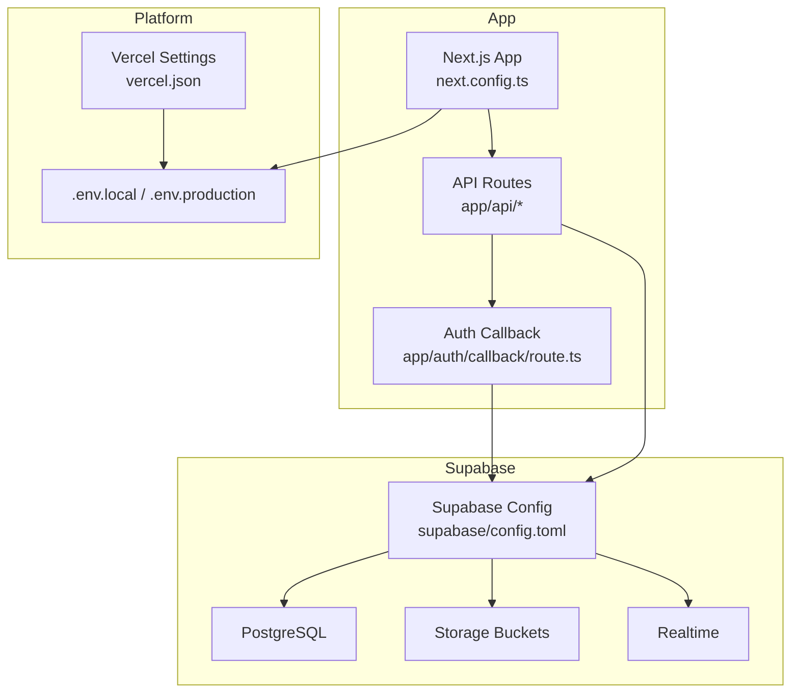
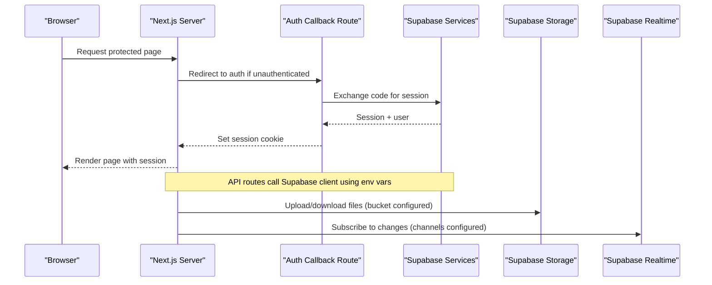
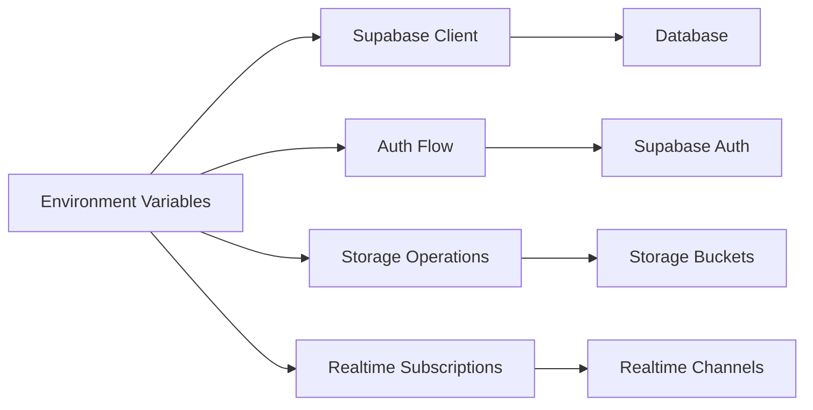

# Environment Configuration

<cite>
**Referenced Files in This Document**
- [config.toml](file://apps/hr-suite/supabase/config.toml)
- [next.config.ts](file://apps/hr-suite/next.config.ts)
- [package.json](file://apps/hr-suite/package.json)
- [vercel.json](file://vercel.json)
- [.gitignore](file://.gitignore)
- [route.ts (auth callback)](file://apps/hr-suite/app/auth/callback/route.ts)
- [proxy.ts](file://apps/hr-suite/proxy.ts)
- [ENVIRONMENT_AND_AI_RULES.md](file://docs/architecture/ENVIRONMENT_AND_AI_RULES.md)
</cite>

## Table of Contents
1. [Introduction](#introduction)
2. [Project Structure](#project-structure)
3. [Core Components](#core-components)
4. [Architecture Overview](#architecture-overview)
5. [Detailed Component Analysis](#detailed-component-analysis)
6. [Dependency Analysis](#dependency-analysis)
7. [Performance Considerations](#performance-considerations)
8. [Troubleshooting Guide](#troubleshooting-guide)
9. [Conclusion](#conclusion)
10. [Appendices](#appendices)

## Introduction
This document provides comprehensive environment configuration guidance for LiquidHR. It covers required environment variables, Supabase configuration via config.toml, Next.js runtime and build-time settings, security best practices for secrets management, multi-environment setup, configuration templates, default values, and troubleshooting common issues. The goal is to help developers and operators configure and operate LiquidHR reliably across development, staging, and production environments.

## Project Structure
LiquidHR uses a Next.js application with Supabase as the backend. Configuration is primarily managed through:
- Supabase configuration file for database, storage, and real-time settings
- Next.js configuration for runtime behavior and API routing
- Environment files for secrets and feature flags
- Platform configuration for deployment targets

**Diagram sources**
- [next.config.ts](file://apps/hr-suite/next.config.ts)
- [config.toml](file://apps/hr-suite/supabase/config.toml)
- [route.ts (auth callback)](file://apps/hr-suite/app/auth/callback/route.ts)
- [vercel.json](file://vercel.json)

**Section sources**
- [next.config.ts](file://apps/hr-suite/next.config.ts)
- [config.toml](file://apps/hr-suite/supabase/config.toml)
- [vercel.json](file://vercel.json)

## Core Components
- Supabase configuration (database, storage, realtime)
- Next.js runtime and build-time environment variables
- Authentication integration and callbacks
- Proxy and API routing configuration
- Deployment platform environment injection

Key responsibilities:
- Define connection strings and service tokens for Supabase
- Configure storage buckets and policies
- Enable or disable features via flags
- Securely manage secrets and validate required variables at startup
- Provide consistent configuration across environments

**Section sources**
- [config.toml](file://apps/hr-suite/supabase/config.toml)
- [next.config.ts](file://apps/hr-suite/next.config.ts)
- [package.json](file://apps/hr-suite/package.json)
- [vercel.json](file://vercel.json)

## Architecture Overview
The runtime architecture integrates Next.js serverless functions with Supabase services. Environment variables are injected by the platform and read at runtime. Authentication flows use Supabase Auth, while data access goes through Supabase clients configured from environment variables.

**Diagram sources**
- [route.ts (auth callback)](file://apps/hr-suite/app/auth/callback/route.ts)
- [config.toml](file://apps/hr-suite/supabase/config.toml)

## Detailed Component Analysis

### Supabase Configuration (config.toml)
Supabase configuration defines:
- Database connection parameters and migrations
- Storage bucket definitions and policies
- Realtime channel subscriptions and permissions
- JWT and service role tokens for secure server-side operations

Important areas:
- Database settings: host, port, user, password, schema, migration paths
- Storage: bucket names, allowed MIME types, size limits, CORS rules
- Realtime: enabled flags, publish/subscribe policies, presence channels
- Security: service role token separation, JWT secret rotation

Best practices:
- Use separate Supabase projects per environment
- Store sensitive tokens in platform secrets, not in repo
- Validate bucket policies match application needs
- Keep realtime channels minimal and scoped

**Section sources**
- [config.toml](file://apps/hr-suite/supabase/config.toml)

### Next.js Environment Configuration
Next.js reads environment variables at runtime and build time. Key aspects:
- Runtime variables: Supabase URLs, tokens, API keys, feature flags
- Build-time variables: static assets, external endpoints, feature toggles
- Middleware: authentication guards, request rewriting, headers
- API routes: server-side calls to Supabase and third-party APIs

Recommended variables:
- SUPABASE_URL, SUPABASE_ANON_KEY, SUPABASE_SERVICE_ROLE_KEY
- NEXT_PUBLIC_* for client-accessible settings only
- Feature flags like ENABLE_HERA, ENABLE_LEAVE_ENGINE
- External API keys for address lookup or email providers

Security considerations:
- Never expose secrets via NEXT_PUBLIC_ prefix
- Validate required variables on startup
- Use middleware to enforce authentication before route handlers

**Section sources**
- [next.config.ts](file://apps/hr-suite/next.config.ts)
- [package.json](file://apps/hr-suite/package.json)

### Authentication Integration
Authentication flows rely on Supabase Auth. The callback route handles:
- Code exchange and session creation
- User profile synchronization
- Role-based access control initialization

Configuration requirements:
- Correct Supabase URL and anon key
- Proper redirect URLs configured in Supabase dashboard
- Secure cookie settings and CSRF protection

Operational notes:
- Ensure callback URLs match deployed domains
- Rotate secrets regularly
- Monitor failed login attempts and lockouts

**Section sources**
- [route.ts (auth callback)](file://apps/hr-suite/app/auth/callback/route.ts)

### Proxy and API Routing
Proxy configuration can be used to forward requests to backend services during development or when bypassing CORS constraints. API routes should:
- Validate inputs and authenticate users
- Use service role keys only on the server
- Return standardized error responses

Development tips:
- Use local proxy for Supabase emulator
- Avoid exposing internal endpoints publicly
- Log request traces for debugging

**Section sources**
- [proxy.ts](file://apps/hr-suite/proxy.ts)

### Deployment Platform Configuration
Deployment platforms inject environment variables into the runtime. For Vercel:
- Configure project-level environment variables
- Separate variables per environment (dev/staging/prod)
- Use vercel.json for rewrites, headers, and build settings

Security tips:
- Restrict variable visibility to specific environments
- Use platform secret managers
- Audit variable access logs

**Section sources**
- [vercel.json](file://vercel.json)

## Dependency Analysis
Environment variables create dependencies between components:
- Supabase client depends on URL and keys
- Auth flow depends on callback URLs and secrets
- Storage operations depend on bucket policies
- Realtime subscriptions depend on channel configurations

**Diagram sources**
- [config.toml](file://apps/hr-suite/supabase/config.toml)
- [next.config.ts](file://apps/hr-suite/next.config.ts)

**Section sources**
- [config.toml](file://apps/hr-suite/supabase/config.toml)
- [next.config.ts](file://apps/hr-suite/next.config.ts)

## Performance Considerations
- Minimize environment variable lookups by caching configuration at startup
- Use connection pooling for database connections
- Enable compression and caching headers where appropriate
- Monitor Supabase usage metrics and optimize queries
- Avoid unnecessary realtime subscriptions

[No sources needed since this section provides general guidance]

## Troubleshooting Guide
Common issues and resolutions:
- Missing environment variables: Validate required variables on startup
- Incorrect Supabase URL: Verify domain and protocol
- Authentication failures: Check callback URLs and secrets
- Storage upload errors: Review bucket policies and MIME types
- Realtime connection drops: Inspect channel permissions and network

Debugging steps:
- Enable detailed logging in development
- Test endpoints with curl or Postman
- Use Supabase dashboard to inspect logs and errors
- Validate environment variables in deployment platform

**Section sources**
- [ENVIRONMENT_AND_AI_RULES.md](file://docs/architecture/ENVIRONMENT_AND_AI_RULES.md)

## Conclusion
Proper environment configuration is critical for LiquidHR’s reliability and security. By following the guidelines in this document, teams can ensure consistent setups across environments, protect sensitive data, and troubleshoot issues effectively. Regular audits and updates to configuration practices will maintain system integrity as the application evolves.

[No sources needed since this section summarizes without analyzing specific files]

## Appendices

### Environment Variables Reference
- SUPABASE_URL: Supabase project URL
- SUPABASE_ANON_KEY: Public anon key for client-side
- SUPABASE_SERVICE_ROLE_KEY: Service role key for server-side
- NEXT_PUBLIC_APP_NAME: Application name visible to clients
- FEATURE_FLAGS: Comma-separated list of enabled features
- EMAIL_PROVIDER_API_KEY: API key for email service
- ADDRESS_LOOKUP_API_KEY: API key for address lookup service

### Configuration Templates
- Development: Local Supabase instance with debug logging
- Staging: Mirrors production with test data
- Production: Hardened security with least privilege access

### Default Values
- Database connection timeout: 30 seconds
- Storage bucket size limit: 10 MB per file
- Realtime subscription retry: 3 attempts with exponential backoff

[No sources needed since this section provides general guidance]