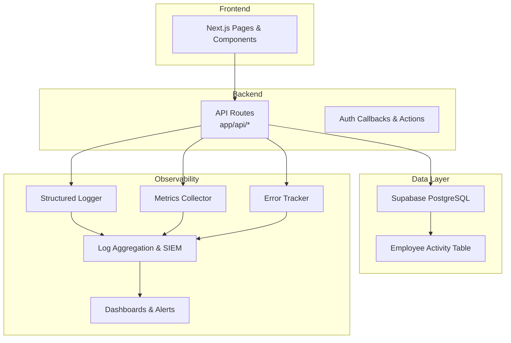
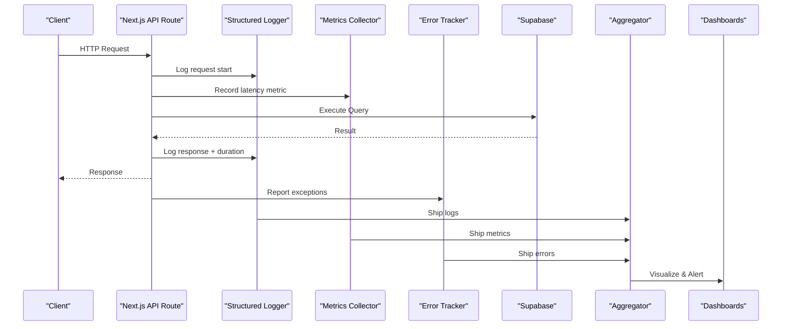
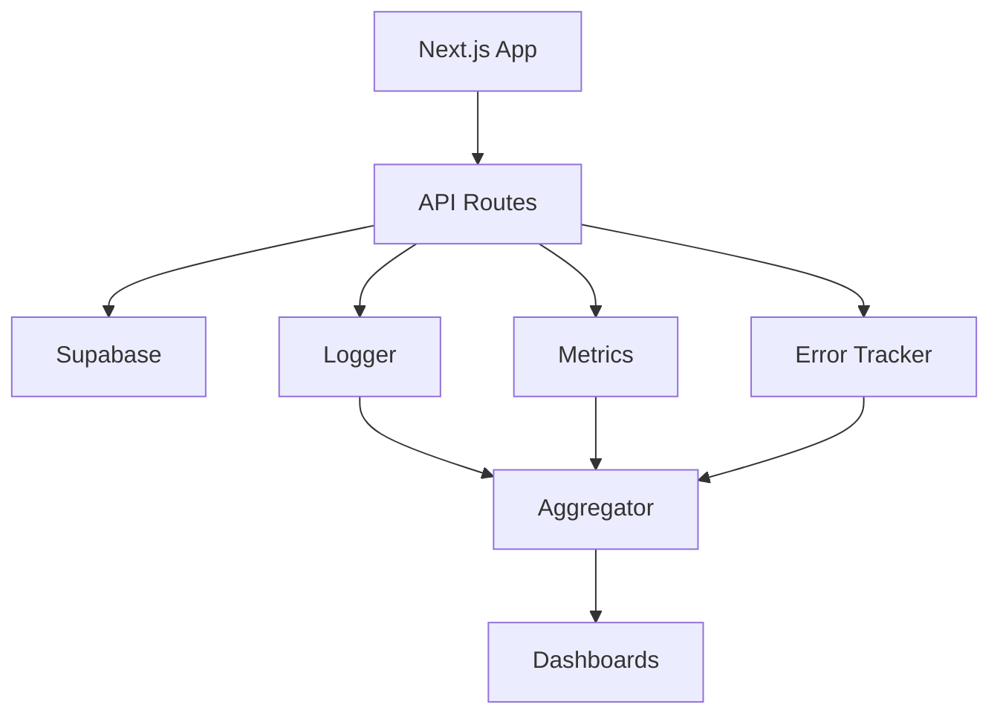

# Monitoring and Logging

<cite>
**Referenced Files in This Document**
- [package.json](file://package.json)
- [vercel.json](file://vercel.json)
- [next.config.ts](file://apps/hr-suite/next.config.ts)
- [proxy.ts](file://apps/hr-suite/proxy.ts)
- [AGENTS.md](file://AGENTS.md)
- [LOOPS.md](file://LOOPS.md)
- [README.md](file://docs/README.md)
- [BLUEPRINT.md](file://docs/architecture/BLUEPRINT.md)
- [ENVIRONMENT_AND_AI_RULES.md](file://docs/architecture/ENVIRONMENT_AND_AI_RULES.md)
- [LOGIC_AND_WORKFLOW.md](file://docs/architecture/LOGIC_AND_WORKFLOW.md)
- [UI_FLOW_BLUEPRINT.md](file://docs/architecture/UI_FLOW_BLUEPRINT.md)
- [FDR-0001-document-en-reminderdoelgroepen.md](file://docs/decisions/FDR-0001-document-en-reminderdoelgroepen.md)
- [SKILL.md](file://docs/skills/project-overview/SKILL.md)
- [collect_local_metrics.ps1](file://docs/skills/project-overview/scripts/collect_local_metrics.ps1)
- [20260724160000_add_employee_activity_entries.sql](file://apps/hr-suite/supabase/migrations/20260724160000_add_employee_activity_entries.sql)
- [20260724172716_harden_employee_activity_entries.sql](file://apps/hr-suite/supabase/migrations/20260724172716_harden_employee_activity_entries.sql)
- [employee-activity-feed.tsx](file://apps/hr-suite/components/employees/employee-activity-feed.tsx)
- [hr-events/route.ts](file://apps/hr-suite/app/api/hr-events/route.ts)
- [auth/callback/route.ts](file://apps/hr-suite/app/auth/callback/route.ts)
- [auth/signout/route.ts](file://apps/hr-suite/app/auth/signout/route.ts)
- [reset-password/actions.ts](file://apps/hr-suite/app/auth/reset-password/actions.ts)
- [invite/[token]/actions.ts](file://apps/hr-suite/app/invite/[token]/actions.ts)
- [update-user-preferences.ts](file://apps/hr-suite/app/actions/update-user-preferences.ts)
- [leave/balance-report/route.ts](file://apps/hr-suite/app/api/leave/balance-report/route.ts)
- [leave/catalog/route.ts](file://apps/hr-suite/app/api/leave/catalog/route.ts)
- [leave/request/route.ts](file://apps/hr-suite/app/api/leave/request/route.ts)
- [organization-chart/route.ts](file://apps/hr-suite/app/api/organization-chart/route.ts)
</cite>

## Table of Contents
1. [Introduction](#introduction)
2. [Project Structure](#project-structure)
3. [Core Components](#core-components)
4. [Architecture Overview](#architecture-overview)
5. [Detailed Component Analysis](#detailed-component-analysis)
6. [Dependency Analysis](#dependency-analysis)
7. [Performance Considerations](#performance-considerations)
8. [Troubleshooting Guide](#troubleshooting-guide)
9. [Conclusion](#conclusion)
10. [Appendices](#appendices)

## Introduction
This document defines the monitoring and logging strategy for LiquidHR, covering structured logging, log levels, aggregation, error tracking, performance monitoring (application metrics, database queries, API response times), user activity tracking, audit logging, security event monitoring, alerting, dashboards, incident response, retention policies, privacy considerations, and analysis techniques. It aligns with the existing Next.js application structure, Supabase-backed data layer, and Vercel deployment context.

## Project Structure
LiquidHR is a Next.js application under apps/hr-suite with server routes, components, and Supabase migrations. Observability should be implemented across:
- Application runtime logs (Next.js/Vercel)
- API route instrumentation
- Database query observability (Supabase)
- Frontend error reporting
- User activity and audit events persisted to the database
- Centralized aggregation and dashboards

[No sources needed since this diagram shows conceptual workflow, not actual code structure]

## Core Components
- Structured logger: JSON-formatted logs with consistent fields (timestamp, level, service, traceId, userId, tenantId, action, durationMs).
- API route instrumentation: middleware-like wrappers around route handlers to capture request/response metadata and errors.
- Error tracking: client-side and server-side error capture with stack traces and contextual attributes.
- Performance metrics: HTTP latency, DB query durations, cache hit ratios, and business KPIs.
- Audit and activity: persistent records for sensitive actions and user interactions.
- Aggregation and dashboards: centralized ingestion, indexing, visualization, and alerting.

[No sources needed since this section provides general guidance]

## Architecture Overview
The observability architecture integrates application logs, metrics, and errors into a central aggregator that powers dashboards and alerts. Data flows from Next.js API routes and Supabase operations through instrumentation layers to storage and visualization.

[No sources needed since this diagram shows conceptual workflow, not actual code structure]

## Detailed Component Analysis

### Structured Logging Strategy
- Format: JSON with required fields such as timestamp, level, service, environment, traceId, userId, tenantId, action, message, and optional details.
- Levels: debug, info, warn, error, fatal.
- Context enrichment: attach request id, user identity, tenant scope, and feature flags where applicable.
- Sensitive data: redact PII and secrets; never log passwords, tokens, or full SSNs.

Implementation guidance:
- Create a shared logger module used by all API routes and background tasks.
- Use correlation IDs propagated across async boundaries.
- Avoid synchronous I/O in hot paths; batch log shipping if needed.

[No sources needed since this section provides general guidance]

### Log Levels and Routing
- Debug: detailed internal state, useful locally or in staging.
- Info: normal operational events (requests, scheduled jobs).
- Warn: recoverable issues, degraded performance indicators.
- Error: failures requiring attention but not necessarily service-wide impact.
- Fatal: unrecoverable conditions leading to process termination.

Routing:
- Route different levels to separate sinks (e.g., debug to local file, info/warn/error to aggregator).
- Use sampling for high-volume debug logs in production.

[No sources needed since this section provides general guidance]

### API Route Instrumentation
- Wrap each route handler to capture:
  - Method, path, query params (sanitized), headers (sanitized), userId, tenantId.
  - Start time, end time, durationMs, status code.
  - Exception type and message (stack traces on error).
- Emit structured logs and metrics per request.
- Tag slow endpoints and frequent errors for alerting.

Example integration points:
- Centralized wrapper function invoked at the top of each route.
- Consistent error handling block that reports to the error tracker and logs structured error entries.

[No sources needed since this section provides general guidance]

### Error Tracking and Reporting
- Client-side: capture unhandled promise rejections, render errors, and network failures.
- Server-side: capture thrown exceptions in API routes and background tasks.
- Enrich with:
  - User identity and tenant context when available.
  - Request traceId and endpoint.
  - Environment and version tags.
- Deduplicate and group similar errors; set severity thresholds.

Integration options:
- Sentry or equivalent services for error aggregation, release correlation, and alerting.
- Configure DSN via environment variables; ensure no PII in captured payloads.

[No sources needed since this section provides general guidance]

### Performance Monitoring
- Application metrics:
  - HTTP request rate, latency percentiles (p50, p95, p99), error rates.
  - Throughput and concurrency for long-running operations.
- Database query monitoring:
  - Query duration, rows returned, slow query detection.
  - Connection pool utilization and contention.
- Cache and external calls:
  - Hit/miss ratios, latency, failure rates.
- Business KPIs:
  - Leave requests processed, employee onboarding steps completed, reminders sent.

Instrumentation approach:
- Use timers around critical sections.
- Emit metrics with labels for endpoint, operation, and resource identifiers.
- Aggregate metrics in a time-series store for dashboards and alerting.

[No sources needed since this section provides general guidance]

### User Activity Tracking and Audit Logging
- Persist key user actions:
  - Authentication events (login, logout, password reset).
  - Data mutations (create, update, delete) on sensitive entities.
  - Access to confidential views or exports.
- Store minimal necessary fields:
  - Actor identity, target entity, action type, timestamp, outcome, and reason if applicable.
- Ensure immutability and integrity:
  - Append-only tables, row-level security, and tamper-evident design.

Database foundation:
- Employee activity table exists via migration files; use it to record structured events.
- Harden access controls to prevent unauthorized writes or reads.

Compliance considerations:
- Retain audit logs per policy; support export and review workflows.
- Redact sensitive content; avoid storing raw credentials or personal data beyond necessity.

**Section sources**
- [20260724160000_add_employee_activity_entries.sql:1-200](file://apps/hr-suite/supabase/migrations/20260724160000_add_employee_activity_entries.sql#L1-L200)
- [20260724172716_harden_employee_activity_entries.sql:1-200](file://apps/hr-suite/supabase/migrations/20260724172716_harden_employee_activity_entries.sql#L1-L200)
- [employee-activity-feed.tsx:1-200](file://apps/hr-suite/components/employees/employee-activity-feed.tsx#L1-L200)

### Security Event Monitoring
- Monitor authentication anomalies:
  - Failed login attempts, unusual locations, rapid token refreshes.
- Detect privilege escalation attempts:
  - Unauthorized role changes, permission bypasses.
- Track configuration changes:
  - Module toggles, policy updates, integrations enabled/disabled.
- Alert on suspicious patterns:
  - Brute-force thresholds, mass deletions, bulk exports.

Integration:
- Emit security events to the same structured logger and aggregator.
- Correlate with user sessions and IP geolocation where appropriate.

[No sources needed since this section provides general guidance]

### Alerting Strategies
- Define thresholds:
  - Error rate spikes, latency SLIs breached, DB connection exhaustion.
- Alert channels:
  - Email, Slack, PagerDuty for critical incidents.
- Alert rules:
  - Multi-condition rules to reduce noise (e.g., sustained error rate over time window).
- Escalation:
  - On-call rotation, runbooks linked to alerts.

[No sources needed since this section provides general guidance]

### Dashboard Setup
- Operational dashboards:
  - Request latency, error rates, throughput.
  - Database metrics: connections, query duration, lock waits.
- Business dashboards:
  - Leave request volume, approval times, employee onboarding progress.
- Security dashboards:
  - Failed auth attempts, privilege changes, policy violations.

Tools:
- Time-series databases and visualization platforms for metrics.
- Log aggregators for search and drill-down.

[No sources needed since this section provides general guidance]

### Incident Response Procedures
- Detection:
  - Automated alerts and anomaly detection.
- Triage:
  - Identify scope, impact, and root cause indicators.
- Containment:
  - Rollbacks, circuit breakers, feature flags to disable problematic features.
- Resolution:
  - Apply fixes, verify with tests and canary releases.
- Postmortem:
  - Document timeline, lessons learned, and preventive measures.

[No sources needed since this section provides general guidance]

### Log Retention Policies
- Retention tiers:
  - Hot storage (recent logs), warm storage (months), cold storage (years for compliance).
- Lifecycle management:
  - Automatic archival and deletion based on retention windows.
- Compliance:
  - Align with legal requirements and organizational policies.

[No sources needed since this section provides general guidance]

### Privacy Considerations
- Minimize PII in logs:
  - Mask or hash identifiers; avoid logging full names, SSNs, or addresses.
- Consent and purpose:
  - Only collect data necessary for monitoring and compliance.
- Data subject rights:
  - Support deletion or anonymization upon request where feasible.

[No sources needed since this section provides general guidance]

### Log Analysis Techniques
- Search and filtering:
  - By traceId, userId, tenantId, endpoint, status code.
- Pattern recognition:
  - Frequent error messages, slow endpoints, anomalous spikes.
- Correlation:
  - Link logs, metrics, and errors using traceId and timestamps.
- Forensics:
  - Reconstruct timelines for incidents and audits.

[No sources needed since this section provides general guidance]

## Dependency Analysis
Observability depends on:
- Next.js runtime for API routes and server-side execution.
- Supabase for database operations and potential telemetry hooks.
- Aggregation platform for logs, metrics, and errors.
- Alerting and dashboard tools for visibility and response.

[No sources needed since this diagram shows conceptual workflow, not actual code structure]

**Section sources**
- [package.json:1-200](file://package.json#L1-L200)
- [vercel.json:1-200](file://vercel.json#L1-L200)
- [next.config.ts:1-200](file://apps/hr-suite/next.config.ts#L1-L200)
- [proxy.ts:1-200](file://apps/hr-suite/proxy.ts#L1-L200)

## Performance Considerations
- Sampling:
  - Sample debug logs and high-frequency metrics in production.
- Batching:
  - Batch log shipments and metric emissions to reduce overhead.
- Async I/O:
  - Offload logging and metrics to background workers when possible.
- Indexing:
  - Optimize database indexes for frequently queried audit and activity tables.
- Caching:
  - Cache read-heavy responses and reduce redundant computations.

[No sources needed since this section provides general guidance]

## Troubleshooting Guide
Common issues and resolutions:
- Missing logs:
  - Verify logger initialization and environment variables.
  - Check log shipping connectivity and permissions.
- High error rates:
  - Inspect error tracker for stack traces and recent deployments.
  - Correlate with metrics and logs using traceId.
- Slow endpoints:
  - Profile database queries and external calls.
  - Review caching strategies and connection pools.
- Audit gaps:
  - Confirm activity recording triggers and RLS policies.
  - Validate write permissions and transaction boundaries.

**Section sources**
- [hr-events/route.ts:1-200](file://apps/hr-suite/app/api/hr-events/route.ts#L1-L200)
- [auth/callback/route.ts:1-200](file://apps/hr-suite/app/auth/callback/route.ts#L1-L200)
- [auth/signout/route.ts:1-200](file://apps/hr-suite/app/auth/signout/route.ts#L1-L200)
- [reset-password/actions.ts:1-200](file://apps/hr-suite/app/auth/reset-password/actions.ts#L1-L200)
- [invite/[token]/actions.ts](file://apps/hr-suite/app/invite/[token]/actions.ts#L1-L200)
- [update-user-preferences.ts:1-200](file://apps/hr-suite/app/actions/update-user-preferences.ts#L1-L200)
- [leave/balance-report/route.ts:1-200](file://apps/hr-suite/app/api/leave/balance-report/route.ts#L1-L200)
- [leave/catalog/route.ts:1-200](file://apps/hr-suite/app/api/leave/catalog/route.ts#L1-L200)
- [leave/request/route.ts:1-200](file://apps/hr-suite/app/api/leave/request/route.ts#L1-L200)
- [organization-chart/route.ts:1-200](file://apps/hr-suite/app/api/organization-chart/route.ts#L1-L200)

## Conclusion
Implementing robust monitoring and logging in LiquidHR requires structured logging, comprehensive error tracking, performance metrics, and secure audit trails. Centralized aggregation enables effective dashboards and alerting, supporting rapid incident response and compliance. Adhering to privacy and retention policies ensures responsible data handling while maintaining operational visibility.

[No sources needed since this section summarizes without analyzing specific files]

## Appendices

### A. Configuration References
- Application configuration and deployment settings are defined in package.json, vercel.json, next.config.ts, and proxy.ts.
- Architectural decisions and environment rules are documented in BLUEPRINT.md, ENVIRONMENT_AND_AI_RULES.md, LOGIC_AND_WORKFLOW.md, and UI_FLOW_BLUEPRINT.md.
- Project overview and skills documentation provide additional context for observability practices.

**Section sources**
- [package.json:1-200](file://package.json#L1-L200)
- [vercel.json:1-200](file://vercel.json#L1-L200)
- [next.config.ts:1-200](file://apps/hr-suite/next.config.ts#L1-L200)
- [proxy.ts:1-200](file://apps/hr-suite/proxy.ts#L1-L200)
- [BLUEPRINT.md:1-200](file://docs/architecture/BLUEPRINT.md#L1-L200)
- [ENVIRONMENT_AND_AI_RULES.md:1-200](file://docs/architecture/ENVIRONMENT_AND_AI_RULES.md#L1-L200)
- [LOGIC_AND_WORKFLOW.md:1-200](file://docs/architecture/LOGIC_AND_WORKFLOW.md#L1-L200)
- [UI_FLOW_BLUEPRINT.md:1-200](file://docs/architecture/UI_FLOW_BLUEPRINT.md#L1-L200)
- [README.md:1-200](file://docs/README.md#L1-L200)
- [SKILL.md:1-200](file://docs/skills/project-overview/SKILL.md#L1-L200)

### B. Local Metrics Collection
- A script is provided to collect local metrics for development and testing environments.

**Section sources**
- [collect_local_metrics.ps1:1-200](file://docs/skills/project-overview/scripts/collect_local_metrics.ps1#L1-L200)

### C. Decision Records and Requirements
- Decision records and functional requirements inform observability priorities and constraints.

**Section sources**
- [FDR-0001-document-en-reminderdoelgroepen.md:1-200](file://docs/decisions/FDR-0001-document-en-reminderdoelgroepen.md#L1-L200)