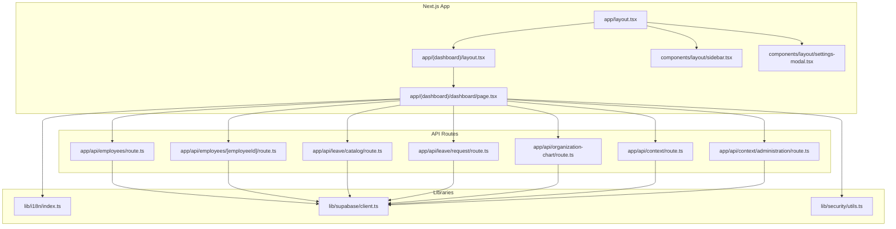
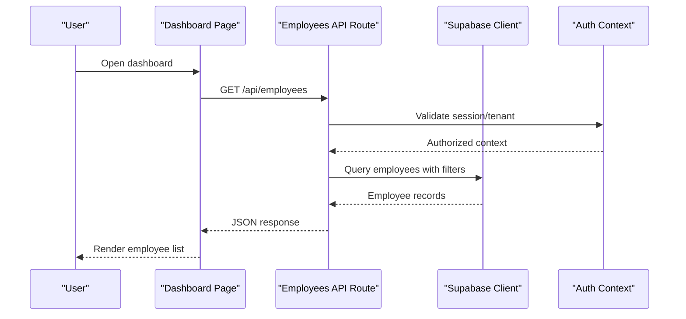
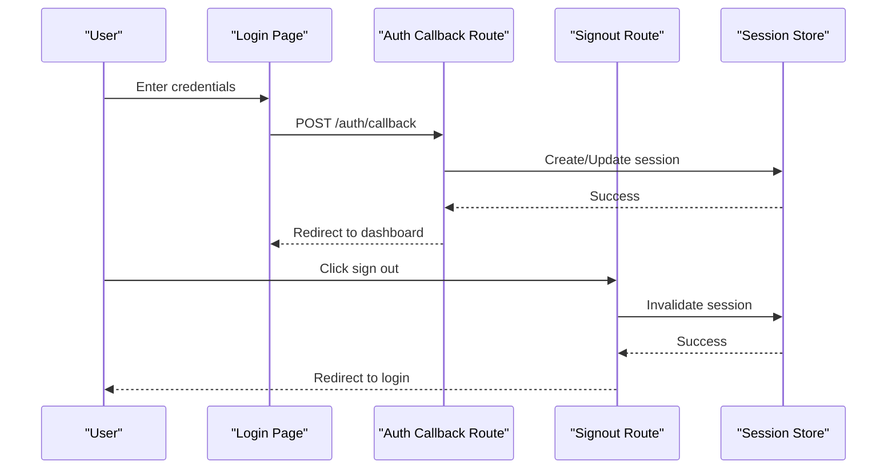
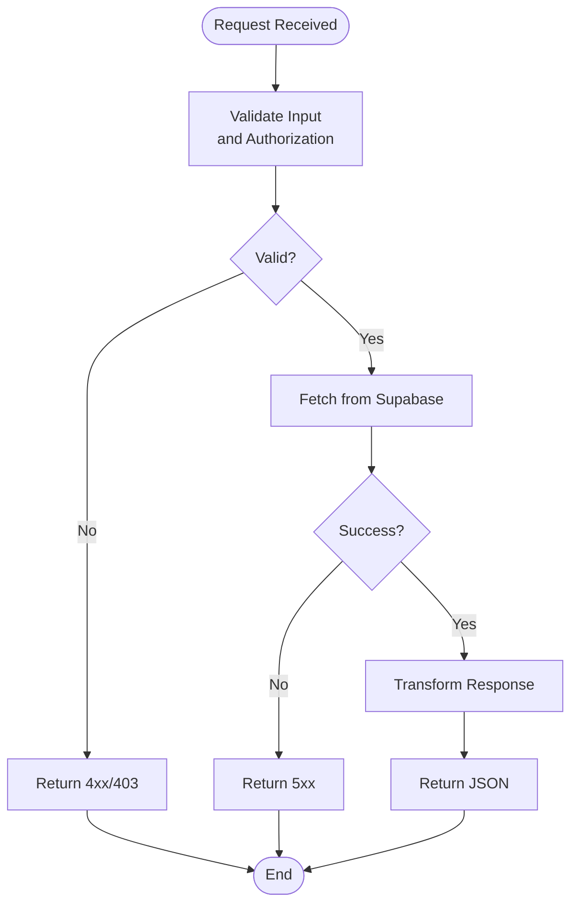
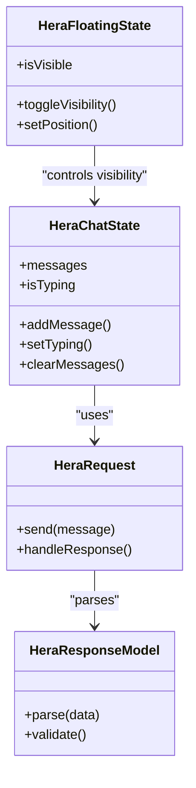
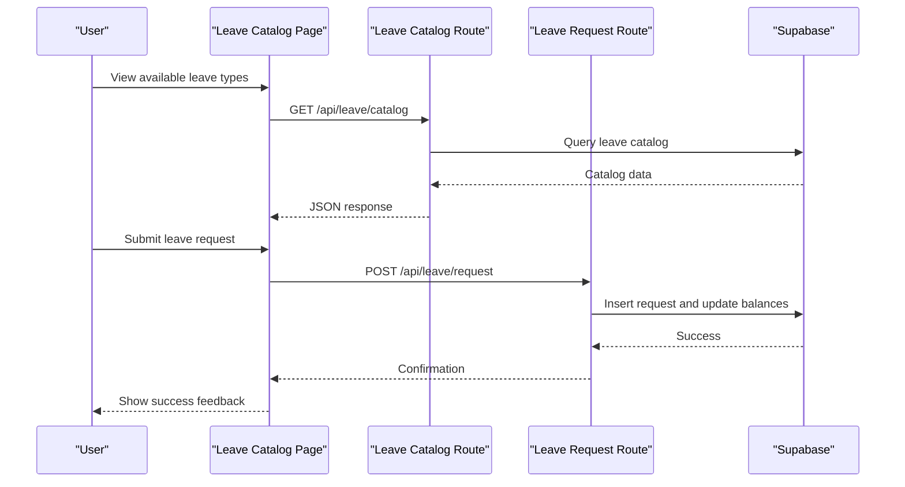
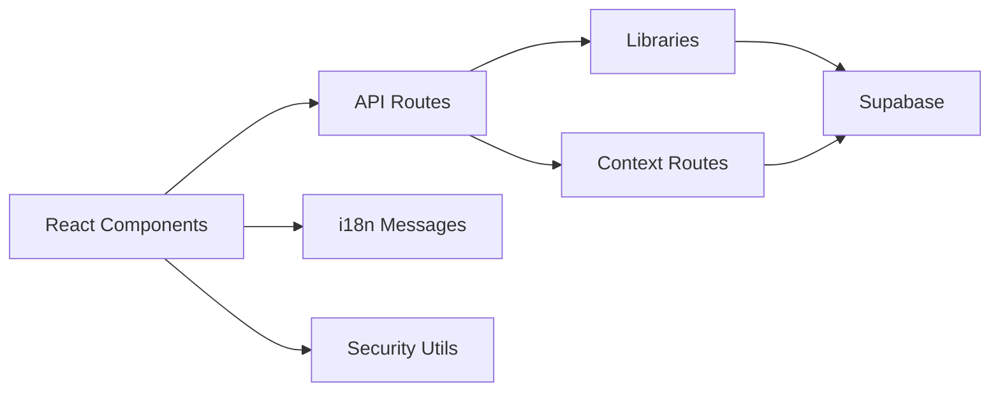

# Best Practices

<cite>
**Referenced Files in This Document**
- [package.json](file://apps/hr-suite/package.json)
- [next.config.ts](file://apps/hr-suite/next.config.ts)
- [tsconfig.json](file://apps/hr-suite/tsconfig.json)
- [eslint.config.mjs](file://apps/hr-suite/eslint.config.mjs)
- [vitest.config.ts](file://apps/hr-suite/vitest.config.ts)
- [layout.tsx](file://apps/hr-suite/app/layout.tsx)
- [page.tsx](file://apps/hr-suite/app/page.tsx)
- [update-user-preferences.ts](file://apps/hr-suite/app/actions/update-user-preferences.ts)
- [route.ts (auth callback)](file://apps/hr-suite/app/auth/callback/route.ts)
- [route.ts (signout)](file://apps/hr-suite/app/auth/signout/route.ts)
- [actions.ts (reset password)](file://apps/hr-suite/app/auth/reset-password/actions.ts)
- [page.tsx (login)](file://apps/hr-suite/app/login/page.tsx)
- [page.tsx (dashboard layout)](file://apps/hr-suite/app/(dashboard)/layout.tsx)
- [page.tsx (dashboard home)](file://apps/hr-suite/app/(dashboard)/dashboard/page.tsx)
- [loading.tsx (dashboard)](file://apps/hr-suite/app/(dashboard)/dashboard/loading.tsx)
- [employee-list.tsx](file://apps/hr-suite/components/employees/employee-list.tsx)
- [employee-create-wizard.tsx](file://apps/hr-suite/components/employees/employee-create-wizard.tsx)
- [employee-person-card.tsx](file://apps/hr-suite/components/employees/employee-person-card.tsx)
- [employment-create-form.tsx](file://apps/hr-suite/components/employment/employment-create-form.tsx)
- [confirmation-dialog.tsx](file://apps/hr-suite/components/employment/confirmation-dialog.tsx)
- [hera-chat-state.ts](file://apps/hr-suite/components/hera/hera-chat-state.ts)
- [hera-floating-state.ts](file://apps/hr-suite/components/hera/hera-floating-state.ts)
- [hera-request.ts](file://apps/hr-suite/components/hera/hera-request.ts)
- [hera-response-model.ts](file://apps/hr-suite/components/hera/hera-response-model.ts)
- [hr-month-calendar.tsx](file://apps/hr-suite/components/hr-calendar/hr-month-calendar.tsx)
- [leave-catalog-page.tsx](file://apps/hr-suite/components/leave/leave-catalog-page.tsx)
- [organization-chart-canvas.tsx](file://apps/hr-suite/components/organization-chart/organization-chart-canvas.tsx)
- [reminder-center.tsx](file://apps/hr-suite/components/reminders/reminder-center.tsx)
- [settings-modal.tsx](file://apps/hr-suite/components/layout/settings-modal.tsx)
- [sidebar.tsx](file://apps/hr-suite/components/layout/sidebar.tsx)
- [i18n index](file://apps/hr-suite/lib/i18n/index.ts)
- [supabase client](file://apps/hr-suite/lib/supabase/client.ts)
- [security utils](file://apps/hr-suite/lib/security/utils.ts)
- [app-version.ts](file://apps/hr-suite/lib/app-version.ts)
- [address lookup route](file://apps/hr-suite/app/api/address-lookup/route.ts)
- [address suggestions route](file://apps/hr-suite/app/api/address-suggestions/route.ts)
- [employees route](file://apps/hr-suite/app/api/employees/route.ts)
- [employees/[id] route](file://apps/hr-suite/app/api/employees/[employeeId]/route.ts)
- [leave catalog route](file://apps/hr-suite/app/api/leave/catalog/route.ts)
- [leave request route](file://apps/hr-suite/app/api/leave/request/route.ts)
- [organization chart route](file://apps/hr-suite/app/api/organization-chart/route.ts)
- [preferences employees route](file://apps/hr-suite/app/api/preferences/employees/route.ts)
- [reminders route](file://apps/hr-suite/app/api/reminders/route.ts)
- [roles route](file://apps/hr-suite/app/api/roles/route.ts)
- [settings modules route](file://apps/hr-suite/app/api/settings/modules/route.ts)
- [star performers assessments route](file://apps/hr-suite/app/api/star-performers/assessments/route.ts)
- [custom fields route](file://apps/hr-suite/app/api/custom-fields/route.ts)
- [departments route](file://apps/hr-suite/app/api/departments/route.ts)
- [master data jobs route](file://apps/hr-suite/app/api/master-data/jobs/route.ts)
- [master data salary scales route](file://apps/hr-suite/app/api/master-data/salary-scales/route.ts)
- [hr events route](file://apps/hr-suite/app/api/hr-events/route.ts)
- [insights employees route](file://apps/hr-suite/app/api/insights/employees/route.ts)
- [invitations route](file://apps/hr-suite/app/api/invitations/route.ts)
- [context administration route](file://apps/hr-suite/app/api/context/administration/route.ts)
- [context route](file://apps/hr-suite/app/api/context/route.ts)
- [proxy.ts](file://apps/hr-suite/proxy.ts)
- [AGENTS.md](file://AGENTS.md)
- [LOOPS.md](file://LOOPS.md)
- [vercel.json](file://vercel.json)
</cite>

## Table of Contents
1. [Introduction](#introduction)
2. [Project Structure](#project-structure)
3. [Core Components](#core-components)
4. [Architecture Overview](#architecture-overview)
5. [Detailed Component Analysis](#detailed-component-analysis)
6. [Dependency Analysis](#dependency-analysis)
7. [Performance Considerations](#performance-considerations)
8. [Troubleshooting Guide](#troubleshooting-guide)
9. [Conclusion](#conclusion)
10. [Appendices](#appendices)

## Introduction
This document establishes best practices for LiquidHR development across TypeScript usage, React component design, business logic organization, performance optimization, memory management, bundle size considerations, maintainability, error handling, logging, security, input validation, authentication patterns, accessibility, internationalization, and responsive design. It synthesizes patterns observed across the Next.js App Router application, server routes, shared components, and libraries to provide actionable guidance for consistent, secure, and high-performance development.

## Project Structure
LiquidHR is a Next.js App Router application with:
- Feature-based app directories under apps/hr-suite/app
- Shared UI components under apps/hr-suite/components
- Domain-specific libraries under apps/hr-suite/lib
- API routes under apps/hr-suite/app/api
- i18n messages under apps/hr-suite/messages
- Supabase migrations and tests under apps/hr-suite/supabase

**Diagram sources**
- [layout.tsx](file://apps/hr-suite/app/layout.tsx)
- [page.tsx (dashboard layout)](file://apps/hr-suite/app/(dashboard)/layout.tsx)
- [page.tsx (dashboard home)](file://apps/hr-suite/app/(dashboard)/dashboard/page.tsx)
- [sidebar.tsx](file://apps/hr-suite/components/layout/sidebar.tsx)
- [settings-modal.tsx](file://apps/hr-suite/components/layout/settings-modal.tsx)
- [employees route](file://apps/hr-suite/app/api/employees/route.ts)
- [employees/[id] route](file://apps/hr-suite/app/api/employees/[employeeId]/route.ts)
- [leave catalog route](file://apps/hr-suite/app/api/leave/catalog/route.ts)
- [leave request route](file://apps/hr-suite/app/api/leave/request/route.ts)
- [organization chart route](file://apps/hr-suite/app/api/organization-chart/route.ts)
- [context route](file://apps/hr-suite/app/api/context/route.ts)
- [context administration route](file://apps/hr-suite/app/api/context/administration/route.ts)
- [i18n index](file://apps/hr-suite/lib/i18n/index.ts)
- [supabase client](file://apps/hr-suite/lib/supabase/client.ts)
- [security utils](file://apps/hr-suite/lib/security/utils.ts)

**Section sources**
- [package.json](file://apps/hr-suite/package.json)
- [next.config.ts](file://apps/hr-suite/next.config.ts)
- [tsconfig.json](file://apps/hr-suite/tsconfig.json)
- [eslint.config.mjs](file://apps/hr-suite/eslint.config.mjs)
- [vitest.config.ts](file://apps/hr-suite/vitest.config.ts)
- [layout.tsx](file://apps/hr-suite/app/layout.tsx)
- [page.tsx (dashboard layout)](file://apps/hr-suite/app/(dashboard)/layout.tsx)
- [page.tsx (dashboard home)](file://apps/hr-suite/app/(dashboard)/dashboard/page.tsx)

## Core Components
Key UI building blocks include employee list and cards, employment forms, HR calendar, reminders, settings modal, and organization chart canvas. These components follow consistent patterns for props typing, state management, and accessibility.

Best practices:
- Use explicit TypeScript interfaces for props and data models.
- Separate presentational and container logic; keep components focused on rendering.
- Prefer controlled inputs with typed form values and centralized validation.
- Implement keyboard navigation and ARIA attributes for accessibility.
- Avoid inline styles; use theme tokens or CSS classes for consistency.

Examples of core components:
- Employee list and person card for data display and interactions
- Employment create form for complex multi-step workflows
- Confirmation dialog for destructive actions
- HR month calendar for scheduling views
- Reminder center for time hub notifications
- Settings modal for user preferences
- Organization chart canvas for visual hierarchy

**Section sources**
- [employee-list.tsx](file://apps/hr-suite/components/employees/employee-list.tsx)
- [employee-person-card.tsx](file://apps/hr-suite/components/employees/employee-person-card.tsx)
- [employment-create-form.tsx](file://apps/hr-suite/components/employment/employment-create-form.tsx)
- [confirmation-dialog.tsx](file://apps/hr-suite/components/employment/confirmation-dialog.tsx)
- [hr-month-calendar.tsx](file://apps/hr-suite/components/hr-calendar/hr-month-calendar.tsx)
- [reminder-center.tsx](file://apps/hr-suite/components/reminders/reminder-center.tsx)
- [settings-modal.tsx](file://apps/hr-suite/components/layout/settings-modal.tsx)
- [organization-chart-canvas.tsx](file://apps/hr-suite/components/organization-chart/organization-chart-canvas.tsx)

## Architecture Overview
LiquidHR follows a layered architecture:
- Presentation layer: Next.js pages and React components
- Business logic: domain libraries and component-level state machines
- Data access: API routes interacting with Supabase
- Security: middleware-like guards in routes and utilities
- Internationalization: message files per locale and i18n utilities

**Diagram sources**
- [page.tsx (dashboard home)](file://apps/hr-suite/app/(dashboard)/dashboard/page.tsx)
- [employees route](file://apps/hr-suite/app/api/employees/route.ts)
- [supabase client](file://apps/hr-suite/lib/supabase/client.ts)
- [context route](file://apps/hr-suite/app/api/context/route.ts)

**Section sources**
- [AGENTS.md](file://AGENTS.md)
- [LOOPS.md](file://LOOPS.md)
- [next.config.ts](file://apps/hr-suite/next.config.ts)

## Detailed Component Analysis

### Authentication Flow
Authentication uses Next.js API routes for callbacks and sign-out, with protected layouts and page-level guards.

**Diagram sources**
- [page.tsx (login)](file://apps/hr-suite/app/login/page.tsx)
- [route.ts (auth callback)](file://apps/hr-suite/app/auth/callback/route.ts)
- [route.ts (signout)](file://apps/hr-suite/app/auth/signout/route.ts)

**Section sources**
- [page.tsx (login)](file://apps/hr-suite/app/login/page.tsx)
- [route.ts (auth callback)](file://apps/hr-suite/app/auth/callback/route.ts)
- [route.ts (signout)](file://apps/hr-suite/app/auth/signout/route.ts)

### Employee CRUD Operations
Employee data operations are exposed via RESTful API routes and consumed by dashboard pages and components.

**Diagram sources**
- [employees route](file://apps/hr-suite/app/api/employees/route.ts)
- [employees/[id] route](file://apps/hr-suite/app/api/employees/[employeeId]/route.ts)
- [supabase client](file://apps/hr-suite/lib/supabase/client.ts)

**Section sources**
- [employees route](file://apps/hr-suite/app/api/employees/route.ts)
- [employees/[id] route](file://apps/hr-suite/app/api/employees/[employeeId]/route.ts)

### Hera AI Agent State Management
Hera chat uses dedicated state modules for chat sessions, floating behavior, and request/response modeling.

**Diagram sources**
- [hera-chat-state.ts](file://apps/hr-suite/components/hera/hera-chat-state.ts)
- [hera-floating-state.ts](file://apps/hr-suite/components/hera/hera-floating-state.ts)
- [hera-request.ts](file://apps/hr-suite/components/hera/hera-request.ts)
- [hera-response-model.ts](file://apps/hr-suite/components/hera/hera-response-model.ts)

**Section sources**
- [hera-chat-state.ts](file://apps/hr-suite/components/hera/hera-chat-state.ts)
- [hera-floating-state.ts](file://apps/hr-suite/components/hera/hera-floating-state.ts)
- [hera-request.ts](file://apps/hr-suite/components/hera/hera-request.ts)
- [hera-response-model.ts](file://apps/hr-suite/components/hera/hera-response-model.ts)

### Leave Catalog and Request Workflow
Leave operations involve catalog configuration and request submission through dedicated API routes.

**Diagram sources**
- [leave-catalog-page.tsx](file://apps/hr-suite/components/leave/leave-catalog-page.tsx)
- [leave catalog route](file://apps/hr-suite/app/api/leave/catalog/route.ts)
- [leave request route](file://apps/hr-suite/app/api/leave/request/route.ts)
- [supabase client](file://apps/hr-suite/lib/supabase/client.ts)

**Section sources**
- [leave-catalog-page.tsx](file://apps/hr-suite/components/leave/leave-catalog-page.tsx)
- [leave catalog route](file://apps/hr-suite/app/api/leave/catalog/route.ts)
- [leave request route](file://apps/hr-suite/app/api/leave/request/route.ts)

## Dependency Analysis
The application has clear separation between UI, API, and data layers. Dependencies flow from components to API routes, which interact with Supabase clients and security utilities.

**Diagram sources**
- [employees route](file://apps/hr-suite/app/api/employees/route.ts)
- [supabase client](file://apps/hr-suite/lib/supabase/client.ts)
- [security utils](file://apps/hr-suite/lib/security/utils.ts)
- [i18n index](file://apps/hr-suite/lib/i18n/index.ts)
- [context route](file://apps/hr-suite/app/api/context/route.ts)

**Section sources**
- [package.json](file://apps/hr-suite/package.json)
- [next.config.ts](file://apps/hr-suite/next.config.ts)

## Performance Considerations
Optimization strategies for LiquidHR:
- Code splitting: Leverage Next.js dynamic imports for heavy components like organization charts and calendars
- Data fetching: Use server-side caching and revalidation for API routes
- Bundle analysis: Monitor bundle sizes and remove unused dependencies
- Memory management: Clean up event listeners and timers in useEffect cleanup functions
- Rendering optimization: Use React.memo for expensive components and useMemo for derived data
- Image optimization: Utilize Next.js Image component with proper sizing and formats
- Database queries: Optimize SQL queries with proper indexing and selective field retrieval

## Troubleshooting Guide
Common issues and resolutions:
- Authentication failures: Check session validity and token expiration in auth routes
- API errors: Review error responses and status codes from API routes
- State synchronization: Ensure proper state updates in Hera chat and other complex components
- i18n issues: Verify message keys exist in all locale files
- Database connectivity: Test Supabase client configuration and RLS policies

**Section sources**
- [route.ts (auth callback)](file://apps/hr-suite/app/auth/callback/route.ts)
- [employees route](file://apps/hr-suite/app/api/employees/route.ts)
- [hera-chat-state.ts](file://apps/hr-suite/components/hera/hera-chat-state.ts)
- [i18n index](file://apps/hr-suite/lib/i18n/index.ts)

## Conclusion
LiquidHR follows modern Next.js patterns with clear separation of concerns, robust TypeScript usage, and comprehensive API routing. The codebase demonstrates strong architectural principles with feature-based organization, shared libraries, and consistent component design. Following the best practices outlined here will ensure maintainable, performant, and secure development across the application.

## Appendices

### TypeScript Usage Patterns
- Define strict interfaces for all data structures
- Use discriminated unions for state management
- Implement type guards for runtime validation
- Leverage utility types for common transformations

### React Component Design Principles
- Single responsibility principle for components
- Controlled vs uncontrolled component patterns
- Custom hooks for reusable logic
- Error boundaries for graceful degradation

### Business Logic Organization
- Domain-specific libraries for complex calculations
- State machines for complex workflows
- Validation schemas for input data
- Service layer abstraction for external APIs

### Security Best Practices
- Input validation on both client and server
- Proper authorization checks in API routes
- Secure session management
- Protection against XSS and CSRF attacks

### Accessibility Requirements
- Semantic HTML structure
- ARIA labels and roles
- Keyboard navigation support
- Screen reader compatibility

### Internationalization Patterns
- Message file organization by feature
- Pluralization and date formatting
- RTL language support preparation
- Dynamic content localization

### Responsive Design Principles
- Mobile-first approach
- Flexible grid systems
- Touch-friendly interactions
- Performance optimization for mobile devices

**Section sources**
- [tsconfig.json](file://apps/hr-suite/tsconfig.json)
- [eslint.config.mjs](file://apps/hr-suite/eslint.config.mjs)
- [vitest.config.ts](file://apps/hr-suite/vitest.config.ts)
- [AGENTS.md](file://AGENTS.md)
- [LOOPS.md](file://LOOPS.md)
- [vercel.json](file://vercel.json)