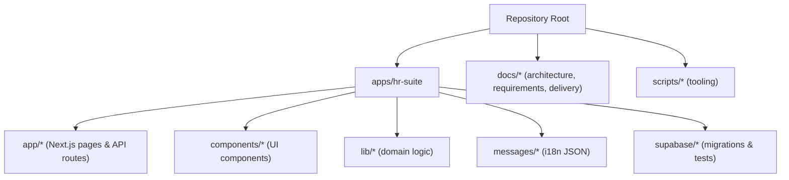
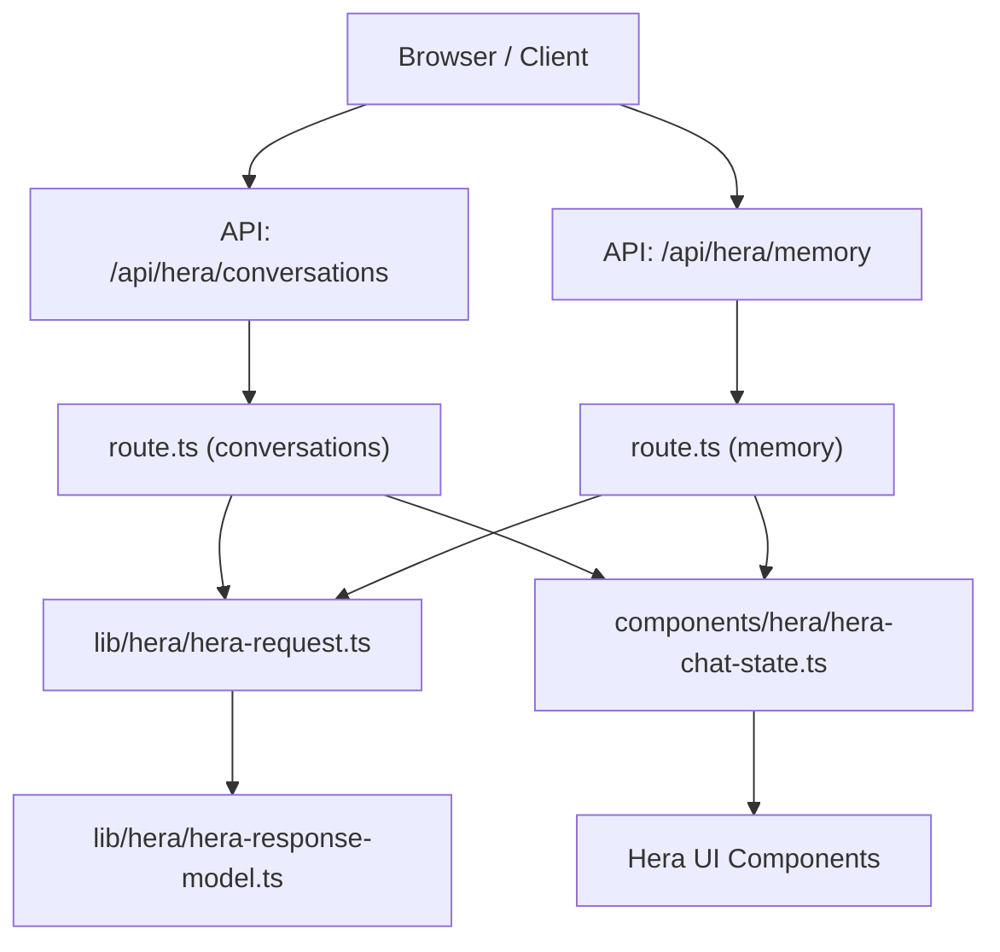
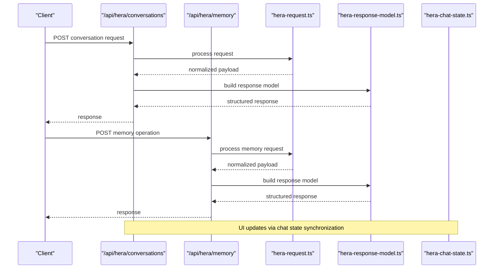
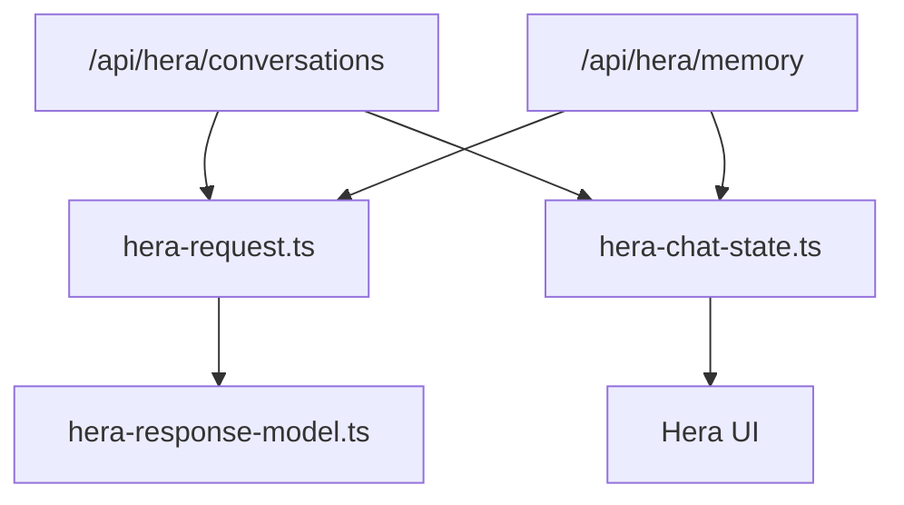

# Contributing Guidelines

<cite>
**Referenced Files in This Document**
- [AGENTS.md](file://AGENTS.md)
- [LOOPS.md](file://LOOPS.md)
- [package.json](file://package.json)
- [apps/hr-suite/package.json](file://apps/hr-suite/package.json)
- [apps/hr-suite/next.config.ts](file://apps/hr-suite/next.config.ts)
- [apps/hr-suite/vitest.config.ts](file://apps/hr-suite/vitest.config.ts)
- [apps/hr-suite/eslint.config.mjs](file://apps/hr-suite/eslint.config.mjs)
- [apps/hr-suite/supabase/config.toml](file://apps/hr-suite/supabase/config.toml)
- [apps/hr-suite/supabase/migrations/20260716092637_add_hera_ai_agent.sql](file://apps/hr-suite/supabase/migrations/20260716092637_add_hera_ai_agent.sql)
- [apps/hr-suite/app/api/hera/conversations/route.ts](file://apps/hr-suite/app/api/hera/conversations/route.ts)
- [apps/hr-suite/app/api/hera/memory/route.ts](file://apps/hr-suite/app/api/hera/memory/route.ts)
- [apps/hr-suite/components/hera/hera-chat-state.ts](file://apps/hr-suite/components/hera/hera-chat-state.ts)
- [apps/hr-suite/lib/hera/hera-request.ts](file://apps/hr-suite/lib/hera/hera-request.ts)
- [apps/hr-suite/lib/hera/hera-response-model.ts](file://apps/hr-suite/lib/hera/hera-response-model.ts)
- [apps/hr-suite/messages/en/common.json](file://apps/hr-suite/messages/en/common.json)
- [apps/hr-suite/scripts/check-i18n.mjs](file://apps/hr-suite/scripts/check-i18n.mjs)
- [docs/architecture/ENVIRONMENT_AND_AI_RULES.md](file://docs/architecture/ENVIRONMENT_AND_AI_RULES.md)
- [docs/requirements/chatbot/HERA_AI_AGENT.md](file://docs/requirements/chatbot/HERA_AI_AGENT.md)
- [docs/delivery/CURRENT_CONTEXT.md](file://docs/delivery/CURRENT_CONTEXT.md)
</cite>

## Table of Contents
1. [Introduction](#introduction)
2. [Project Structure](#project-structure)
3. [Core Components](#core-components)
4. [Architecture Overview](#architecture-overview)
5. [Detailed Component Analysis](#detailed-component-analysis)
6. [Dependency Analysis](#dependency-analysis)
7. [Performance Considerations](#performance-considerations)
8. [Troubleshooting Guide](#troubleshooting-guide)
9. [Conclusion](#conclusion)
10. [Appendices](#appendices)

## Introduction
This document provides comprehensive contributing guidelines for LiquidHR development. It covers the contribution workflow, branching strategy, commit message conventions, pull request procedures, code review expectations, testing requirements, and quality gates. It also explains how to report bugs, request features, and document changes. The guide includes guidance on the AI agent system integration (Hera), extending functionality with agents, and working within the loop-based development approach defined by the AGENTS.md system. Templates for issues, feature requests, and pull requests are provided. Finally, it outlines release procedures and version management practices.

## Project Structure
LiquidHR is a Next.js application under apps/hr-suite with shared packages and extensive documentation. Key areas:
- Frontend and API routes live under apps/hr-suite/app
- Shared components under apps/hr-suite/components
- Domain libraries under apps/hr-suite/lib
- Internationalization messages under apps/hr-suite/messages
- Database migrations and tests under apps/hr-suite/supabase
- Project-level scripts and configuration at the repository root

**Section sources**
- [apps/hr-suite/package.json](file://apps/hr-suite/package.json)
- [apps/hr-suite/next.config.ts](file://apps/hr-suite/next.config.ts)
- [apps/hr-suite/vitest.config.ts](file://apps/hr-suite/vitest.config.ts)
- [apps/hr-suite/eslint.config.mjs](file://apps/hr-suite/eslint.config.mjs)
- [apps/hr-suite/supabase/config.toml](file://apps/hr-suite/supabase/config.toml)

## Core Components
- Application entry and runtime configuration are managed via Next.js configuration files and package scripts.
- Testing is configured with Vitest; linting and formatting rules are enforced through ESLint.
- Database schema and policies are managed via Supabase migrations and tests.
- Internationalization is handled through JSON message files and a validation script.

Key responsibilities:
- apps/hr-suite/package.json: defines scripts for build, test, lint, and dev workflows.
- apps/hr-suite/next.config.ts: configures Next.js runtime behavior.
- apps/hr-suite/vitest.config.ts: configures unit and integration tests.
- apps/hr-suite/eslint.config.mjs: enforces code style and quality rules.
- apps/hr-suite/supabase/config.toml: configures local Supabase environment.

**Section sources**
- [apps/hr-suite/package.json](file://apps/hr-suite/package.json)
- [apps/hr-suite/next.config.ts](file://apps/hr-suite/next.config.ts)
- [apps/hr-suite/vitest.config.ts](file://apps/hr-suite/vitest.config.ts)
- [apps/hr-suite/eslint.config.mjs](file://apps/hr-suite/eslint.config.mjs)
- [apps/hr-suite/supabase/config.toml](file://apps/hr-suite/supabase/config.toml)

## Architecture Overview
The AI agent system centers around Hera, which exposes API endpoints for conversations and memory, and integrates with UI components and domain libraries.

**Diagram sources**
- [apps/hr-suite/app/api/hera/conversations/route.ts](file://apps/hr-suite/app/api/hera/conversations/route.ts)
- [apps/hr-suite/app/api/hera/memory/route.ts](file://apps/hr-suite/app/api/hera/memory/route.ts)
- [apps/hr-suite/lib/hera/hera-request.ts](file://apps/hr-suite/lib/hera/hera-request.ts)
- [apps/hr-suite/lib/hera/hera-response-model.ts](file://apps/hr-suite/lib/hera/hera-response-model.ts)
- [apps/hr-suite/components/hera/hera-chat-state.ts](file://apps/hr-suite/components/hera/hera-chat-state.ts)

## Detailed Component Analysis

### Contribution Workflow and Branching Strategy
- Use feature branches named after the feature or fix (e.g., feature/hera-memory, fix/leave-balance).
- Keep main stable; create short-lived branches for changes.
- Squash commits into logical units before merging.
- Follow conventional commit messages: type(scope): description (e.g., feat(api): add hera conversation endpoint).

[No sources needed since this section provides general guidance]

### Commit Message Conventions
- Types: feat, fix, docs, style, refactor, test, chore, ci, perf, build, revert
- Scope: module or area (e.g., api, her, ui, db, i18n)
- Format: type(scope): concise description
- Examples:
  - feat(api): add hera conversation route
  - fix(ui): correct hera chat state reset
  - docs: update contributing guidelines

[No sources needed since this section provides general guidance]

### Pull Request Procedures
- Create PRs from feature branches to main.
- Include a clear description, linked issues, and screenshots if applicable.
- Ensure all checks pass (lint, tests, build).
- Request reviews from maintainers familiar with the affected areas.
- Address review feedback promptly and re-run checks.

[No sources needed since this section provides general guidance]

### Code Review Process
- Focus on correctness, readability, performance, and security.
- Verify that tests cover new logic and edge cases.
- Confirm database migrations are safe and reversible where possible.
- Validate i18n keys and messages are consistent.

[No sources needed since this section provides general guidance]

### Testing Requirements
- Unit tests for domain logic and utilities using Vitest.
- Integration tests for API routes and critical flows.
- Database tests under supabase/tests for policies and functions.
- Run full test suite locally before submitting PRs.

**Section sources**
- [apps/hr-suite/vitest.config.ts](file://apps/hr-suite/vitest.config.ts)
- [apps/hr-suite/supabase/config.toml](file://apps/hr-suite/supabase/config.toml)

### Quality Gates
- Linting passes with ESLint configuration.
- All tests succeed.
- Build completes without errors.
- No regressions in i18n keys.
- Migrations validated against schema and tests.

**Section sources**
- [apps/hr-suite/eslint.config.mjs](file://apps/hr-suite/eslint.config.mjs)
- [apps/hr-suite/package.json](file://apps/hr-suite/package.json)

### Reporting Bugs
- Use issue templates to describe steps to reproduce, expected vs actual behavior, environment details, and logs.
- Attach screenshots or recordings when relevant.
- Tag severity and assign appropriate labels.

[No sources needed since this section provides general guidance]

### Requesting Features
- Provide a clear problem statement, proposed solution, and impact.
- Link related requirements or ADRs.
- Suggest implementation approach and risks.

[No sources needed since this section provides general guidance]

### Documenting Changes
- Update relevant docs under docs/* for architecture, requirements, and delivery notes.
- Keep migration comments clear and reference related tests.
- Maintain consistency in i18n messages and key naming.

**Section sources**
- [docs/architecture/ENVIRONMENT_AND_AI_RULES.md](file://docs/architecture/ENVIRONMENT_AND_AI_RULES.md)
- [docs/requirements/chatbot/HERA_AI_AGENT.md](file://docs/requirements/chatbot/HERA_AI_AGENT.md)
- [docs/delivery/CURRENT_CONTEXT.md](file://docs/delivery/CURRENT_CONTEXT.md)

### AI Agent System Integration (Hera)
Hera provides conversational capabilities and memory tools. To extend functionality:
- Add new API routes under apps/hr-suite/app/api/hera/* following existing patterns.
- Implement request handling and response modeling in lib/hera.
- Update UI state and components under components/hera as needed.
- Ensure database schema changes are captured in migrations under apps/hr-suite/supabase/migrations.

**Diagram sources**
- [apps/hr-suite/app/api/hera/conversations/route.ts](file://apps/hr-suite/app/api/hera/conversations/route.ts)
- [apps/hr-suite/app/api/hera/memory/route.ts](file://apps/hr-suite/app/api/hera/memory/route.ts)
- [apps/hr-suite/lib/hera/hera-request.ts](file://apps/hr-suite/lib/hera/hera-request.ts)
- [apps/hr-suite/lib/hera/hera-response-model.ts](file://apps/hr-suite/lib/hera/hera-response-model.ts)
- [apps/hr-suite/components/hera/hera-chat-state.ts](file://apps/hr-suite/components/hera/hera-chat-state.ts)

**Section sources**
- [apps/hr-suite/app/api/hera/conversations/route.ts](file://apps/hr-suite/app/api/hera/conversations/route.ts)
- [apps/hr-suite/app/api/hera/memory/route.ts](file://apps/hr-suite/app/api/hera/memory/route.ts)
- [apps/hr-suite/lib/hera/hera-request.ts](file://apps/hr-suite/lib/hera/hera-request.ts)
- [apps/hr-suite/lib/hera/hera-response-model.ts](file://apps/hr-suite/lib/hera/hera-response-model.ts)
- [apps/hr-suite/components/hera/hera-chat-state.ts](file://apps/hr-suite/components/hera/hera-chat-state.ts)

### Loop-Based Development and AGENTS.md
- Follow the loop-driven workflow described in LOOPS.md and AGENTS.md to iterate quickly and consistently.
- Use AGENTS.md to define agent behaviors, tool integrations, and constraints.
- Align changes with current context and delivery plans documented under docs/delivery.

**Section sources**
- [AGENTS.md](file://AGENTS.md)
- [LOOPS.md](file://LOOPS.md)
- [docs/delivery/CURRENT_CONTEXT.md](file://docs/delivery/CURRENT_CONTEXT.md)

### Extending Functionality Using Agents
- Define new agent capabilities in AGENTS.md and corresponding specs under docs/superpowers/specs.
- Implement API endpoints and models in apps/hr-suite/app/api and apps/hr-suite/lib.
- Update UI components and state under apps/hr-suite/components.
- Add database migrations and tests under apps/hr-suite/supabase.

**Section sources**
- [AGENTS.md](file://AGENTS.md)
- [apps/hr-suite/supabase/migrations/20260716092637_add_hera_ai_agent.sql](file://apps/hr-suite/supabase/migrations/20260716092637_add_hera_ai_agent.sql)

### Internationalization Guidelines
- Add new keys under apps/hr-suite/messages/en/* and corresponding translations.
- Run the i18n check script to validate consistency.
- Avoid hardcoding strings in components; use message keys.

**Section sources**
- [apps/hr-suite/messages/en/common.json](file://apps/hr-suite/messages/en/common.json)
- [apps/hr-suite/scripts/check-i18n.mjs](file://apps/hr-suite/scripts/check-i18n.mjs)

## Dependency Analysis
High-level dependencies between core modules:

**Diagram sources**
- [apps/hr-suite/app/api/hera/conversations/route.ts](file://apps/hr-suite/app/api/hera/conversations/route.ts)
- [apps/hr-suite/app/api/hera/memory/route.ts](file://apps/hr-suite/app/api/hera/memory/route.ts)
- [apps/hr-suite/lib/hera/hera-request.ts](file://apps/hr-suite/lib/hera/hera-request.ts)
- [apps/hr-suite/lib/hera/hera-response-model.ts](file://apps/hr-suite/lib/hera/hera-response-model.ts)
- [apps/hr-suite/components/hera/hera-chat-state.ts](file://apps/hr-suite/components/hera/hera-chat-state.ts)

**Section sources**
- [apps/hr-suite/app/api/hera/conversations/route.ts](file://apps/hr-suite/app/api/hera/conversations/route.ts)
- [apps/hr-suite/app/api/hera/memory/route.ts](file://apps/hr-suite/app/api/hera/memory/route.ts)
- [apps/hr-suite/lib/hera/hera-request.ts](file://apps/hr-suite/lib/hera/hera-request.ts)
- [apps/hr-suite/lib/hera/hera-response-model.ts](file://apps/hr-suite/lib/hera/hera-response-model.ts)
- [apps/hr-suite/components/hera/hera-chat-state.ts](file://apps/hr-suite/components/hera/hera-chat-state.ts)

## Performance Considerations
- Optimize API responses and minimize unnecessary data transfers.
- Use efficient database queries and indexes; validate with Supabase tests.
- Debounce heavy operations in UI components.
- Monitor bundle size and lazy-load non-critical modules.

[No sources needed since this section provides general guidance]

## Troubleshooting Guide
Common issues and resolutions:
- Linting failures: run the linter locally and fix reported issues.
- Test failures: ensure environment variables and Supabase local setup are correct.
- i18n inconsistencies: run the i18n check script and align keys across languages.
- Migration conflicts: review migration order and rollback strategies.

**Section sources**
- [apps/hr-suite/eslint.config.mjs](file://apps/hr-suite/eslint.config.mjs)
- [apps/hr-suite/vitest.config.ts](file://apps/hr-suite/vitest.config.ts)
- [apps/hr-suite/supabase/config.toml](file://apps/hr-suite/supabase/config.toml)
- [apps/hr-suite/scripts/check-i18n.mjs](file://apps/hr-suite/scripts/check-i18n.mjs)

## Conclusion
By following these guidelines, contributors can collaborate effectively, maintain high quality, and extend LiquidHR’s capabilities—especially the AI agent system—while ensuring robust testing, clear documentation, and smooth releases.

[No sources needed since this section summarizes without analyzing specific files]

## Appendices

### Issue Report Template
- Title: Concise summary
- Description: What happened
- Steps to Reproduce: Numbered steps
- Expected Behavior: What should happen
- Actual Behavior: What actually happens
- Environment: OS, browser, app version
- Logs/Screenshots: Attach relevant artifacts
- Severity: Critical/Major/Minor
- Labels: bug, frontend, backend, ai-agent, etc.

[No sources needed since this section provides general guidance]

### Feature Request Template
- Title: Clear feature name
- Problem Statement: Why this is needed
- Proposed Solution: How it should work
- Impact: Benefits and users affected
- Implementation Notes: Technical considerations
- Related Issues/Docs: Links to requirements or ADRs

[No sources needed since this section provides general guidance]

### Pull Request Description Template
- Title: Short summary of changes
- Motivation: Why this change is necessary
- Changes Made: Bullet list of modifications
- Testing: How changes were tested
- Screenshots/GIFs: Visual evidence if UI changed
- Checklist:
  - Lint passed
  - Tests added/updated
  - Documentation updated
  - Migrations reviewed

[No sources needed since this section provides general guidance]

### Release Procedures and Version Management
- Use semantic versioning for releases.
- Tag releases in Git and publish changelogs.
- Validate builds and tests in CI before tagging.
- Coordinate database migrations with deployment windows.
- Communicate breaking changes clearly in release notes.

[No sources needed since this section provides general guidance]