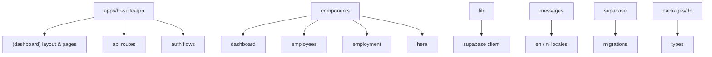
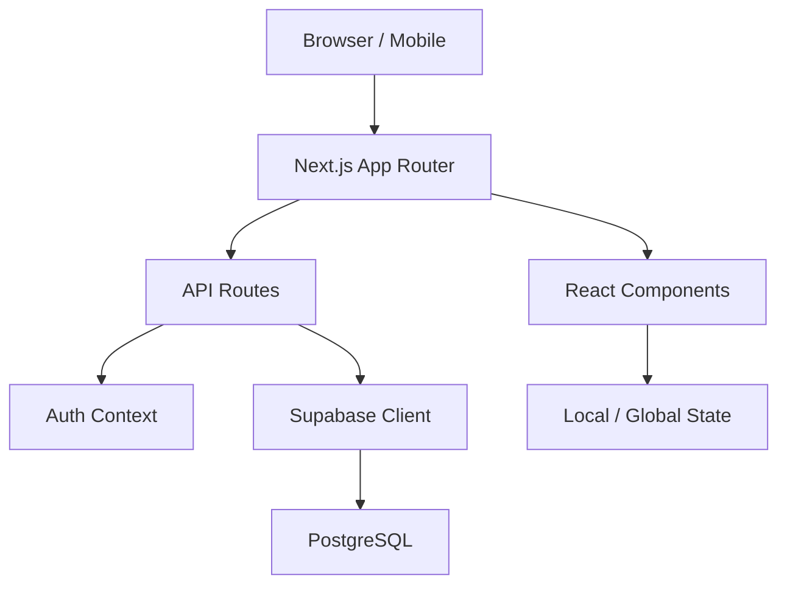
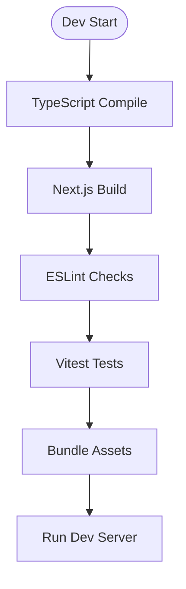
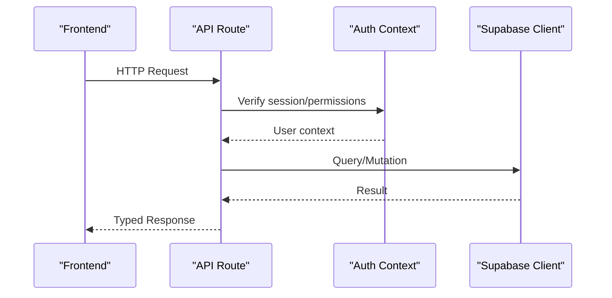
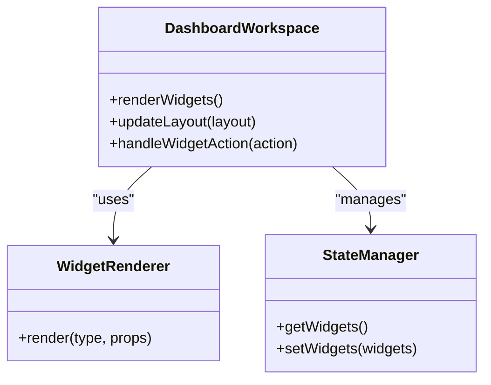
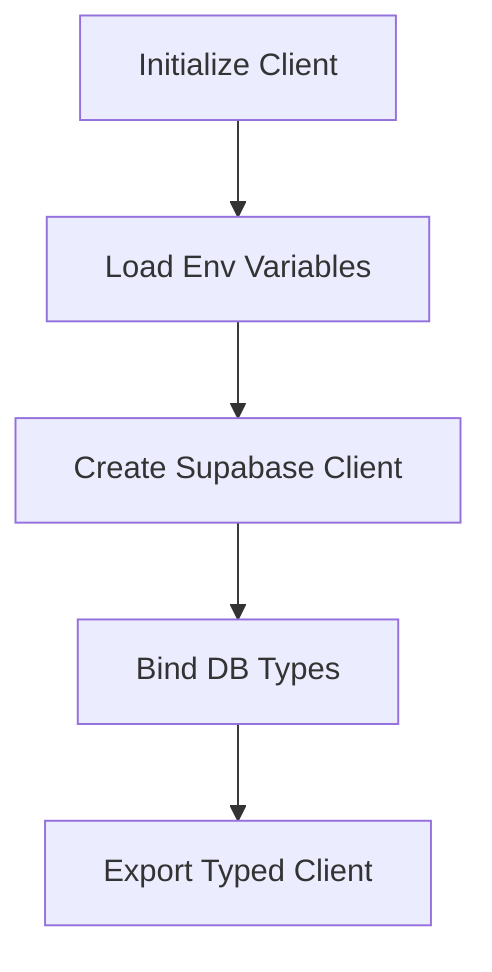
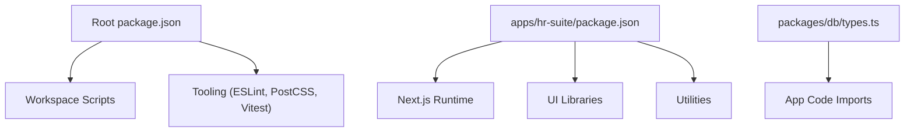

# Developer Guide

<cite>
**Referenced Files in This Document**
- [package.json](file://package.json)
- [apps/hr-suite/package.json](file://apps/hr-suite/package.json)
- [apps/hr-suite/tsconfig.json](file://apps/hr-suite/tsconfig.json)
- [apps/hr-suite/next.config.ts](file://apps/hr-suite/next.config.ts)
- [apps/hr-suite/eslint.config.mjs](file://apps/hr-suite/eslint.config.mjs)
- [apps/hr-suite/postcss.config.mjs](file://apps/hr-suite/postcss.config.mjs)
- [apps/hr-suite/vitest.config.ts](file://apps/hr-suite/vitest.config.ts)
- [apps/hr-suite/proxy.ts](file://apps/hr-suite/proxy.ts)
- [apps/hr-suite/app/layout.tsx](file://apps/hr-suite/app/layout.tsx)
- [apps/hr-suite/app/page.tsx](file://apps/hr-suite/app/page.tsx)
- [apps/hr-suite/app/(dashboard)/layout.tsx](file://apps/hr-suite/app/(dashboard)/layout.tsx)
- [apps/hr-suite/app/api/context/route.ts](file://apps/hr-suite/app/api/context/route.ts)
- [apps/hr-suite/app/api/employees/route.ts](file://apps/hr-suite/app/api/employees/route.ts)
- [apps/hr-suite/components/dashboard/dashboard-workspace.tsx](file://apps/hr-suite/components/dashboard/dashboard-workspace.tsx)
- [apps/hr-suite/lib/supabase/client.ts](file://apps/hr-suite/lib/supabase/client.ts)
- [packages/db/types.ts](file://packages/db/types.ts)
- [AGENTS.md](file://AGENTS.md)
- [LOOPS.md](file://LOOPS.md)
- [vercel.json](file://vercel.json)
</cite>

## Table of Contents
1. [Introduction](#introduction)
2. [Project Structure](#project-structure)
3. [Core Components](#core-components)
4. [Architecture Overview](#architecture-overview)
5. [Detailed Component Analysis](#detailed-component-analysis)
6. [Dependency Analysis](#dependency-analysis)
7. [Performance Considerations](#performance-considerations)
8. [Troubleshooting Guide](#troubleshooting-guide)
9. [Conclusion](#conclusion)
10. [Appendices](#appendices)

## Introduction
This developer guide explains how to contribute to LiquidHR effectively. It covers the development workflow, code organization patterns, TypeScript configuration, ESLint rules, coding standards, contribution process, pull request guidelines, code review procedures, debugging techniques, profiling tools, performance optimization strategies, build system, dependency management, package scripts, common scenarios, troubleshooting, and extension points for the AI agent system.

## Project Structure
LiquidHR is a Next.js application organized under apps/hr-suite with shared packages under packages/db. The app uses the App Router, server routes under app/api, UI components under components, feature libraries under lib, and Supabase migrations under supabase.

Key directories:
- apps/hr-suite/app: Next.js App Router pages, layouts, and API routes
- apps/hr-suite/components: Reusable UI components grouped by domain
- apps/hr-suite/lib: Feature-specific logic and utilities
- apps/hr-suite/messages: i18n JSON files per locale
- apps/hr-suite/supabase: Database migrations and tests
- packages/db: Shared database types and package metadata

**Section sources**
- [apps/hr-suite/app/layout.tsx](file://apps/hr-suite/app/layout.tsx)
- [apps/hr-suite/app/page.tsx](file://apps/hr-suite/app/page.tsx)
- [apps/hr-suite/app/(dashboard)/layout.tsx](file://apps/hr-suite/app/(dashboard)/layout.tsx)
- [apps/hr-suite/app/api/context/route.ts](file://apps/hr-suite/app/api/context/route.ts)
- [apps/hr-suite/app/api/employees/route.ts](file://apps/hr-suite/app/api/employees/route.ts)
- [apps/hr-suite/components/dashboard/dashboard-workspace.tsx](file://apps/hr-suite/components/dashboard/dashboard-workspace.tsx)
- [apps/hr-suite/lib/supabase/client.ts](file://apps/hr-suite/lib/supabase/client.ts)
- [packages/db/types.ts](file://packages/db/types.ts)

## Core Components
- Application shell and routing: Root layout defines global styles, providers, and navigation structure. Dashboard layout groups protected routes and shared state.
- API layer: Server routes implement REST endpoints for context, employees, and other features. They handle authentication, validation, and data access via Supabase.
- UI components: Domain-scoped components encapsulate business logic and presentation. Examples include dashboard workspace, employee list, and employment forms.
- Data access: Supabase client is configured centrally for typed queries and mutations. Shared DB types are maintained in packages/db/types.ts.

Best practices:
- Keep server routes focused on input validation, authorization, and orchestration.
- Encapsulate business logic in lib modules; avoid heavy computation in components.
- Use typed responses and errors consistently across API routes.
- Prefer feature-based folders (components, lib) aligned with domain boundaries.

**Section sources**
- [apps/hr-suite/app/layout.tsx](file://apps/hr-suite/app/layout.tsx)
- [apps/hr-suite/app/(dashboard)/layout.tsx](file://apps/hr-suite/app/(dashboard)/layout.tsx)
- [apps/hr-suite/app/api/context/route.ts](file://apps/hr-suite/app/api/context/route.ts)
- [apps/hr-suite/app/api/employees/route.ts](file://apps/hr-suite/app/api/employees/route.ts)
- [apps/hr-suite/components/dashboard/dashboard-workspace.tsx](file://apps/hr-suite/components/dashboard/dashboard-workspace.tsx)
- [apps/hr-suite/lib/supabase/client.ts](file://apps/hr-suite/lib/supabase/client.ts)
- [packages/db/types.ts](file://packages/db/types.ts)

## Architecture Overview
The system follows a layered architecture:
- Presentation layer: Next.js App Router pages and React components
- API layer: Route handlers for CRUD operations and workflows
- Data layer: Supabase Postgres with RLS policies and migrations
- Shared types: Centralized DB schema types for type safety

**Diagram sources**
- [apps/hr-suite/app/layout.tsx](file://apps/hr-suite/app/layout.tsx)
- [apps/hr-suite/app/api/context/route.ts](file://apps/hr-suite/app/api/context/route.ts)
- [apps/hr-suite/lib/supabase/client.ts](file://apps/hr-suite/lib/supabase/client.ts)

## Detailed Component Analysis

### Build System and Configuration
- TypeScript: Strict mode enabled, path aliases configured for clean imports.
- Next.js: App Router, server actions, middleware, and static/dynamic rendering options.
- ESLint: Centralized rules for consistency and quality.
- PostCSS: Tailwind integration and plugin chain.
- Vitest: Unit testing configuration for components and utilities.

**Section sources**
- [apps/hr-suite/tsconfig.json](file://apps/hr-suite/tsconfig.json)
- [apps/hr-suite/next.config.ts](file://apps/hr-suite/next.config.ts)
- [apps/hr-suite/eslint.config.mjs](file://apps/hr-suite/eslint.config.mjs)
- [apps/hr-suite/postcss.config.mjs](file://apps/hr-suite/postcss.config.mjs)
- [apps/hr-suite/vitest.config.ts](file://apps/hr-suite/vitest.config.ts)

### API Route Pattern
Typical flow:
- Validate request payload and parameters
- Authenticate and authorize user
- Execute business logic or call Supabase
- Return typed response or error

**Diagram sources**
- [apps/hr-suite/app/api/context/route.ts](file://apps/hr-suite/app/api/context/route.ts)
- [apps/hr-suite/app/api/employees/route.ts](file://apps/hr-suite/app/api/employees/route.ts)
- [apps/hr-suite/lib/supabase/client.ts](file://apps/hr-suite/lib/supabase/client.ts)

**Section sources**
- [apps/hr-suite/app/api/context/route.ts](file://apps/hr-suite/app/api/context/route.ts)
- [apps/hr-suite/app/api/employees/route.ts](file://apps/hr-suite/app/api/employees/route.ts)
- [apps/hr-suite/lib/supabase/client.ts](file://apps/hr-suite/lib/supabase/client.ts)

### Dashboard Workspace Component
The dashboard workspace orchestrates widget rendering, state synchronization, and user interactions. It composes smaller widgets and manages layout changes.

**Diagram sources**
- [apps/hr-suite/components/dashboard/dashboard-workspace.tsx](file://apps/hr-suite/components/dashboard/dashboard-workspace.tsx)

**Section sources**
- [apps/hr-suite/components/dashboard/dashboard-workspace.tsx](file://apps/hr-suite/components/dashboard/dashboard-workspace.tsx)

### Supabase Client Integration
Centralized client setup ensures consistent configuration, typing, and error handling across the app.

**Diagram sources**
- [apps/hr-suite/lib/supabase/client.ts](file://apps/hr-suite/lib/supabase/client.ts)
- [packages/db/types.ts](file://packages/db/types.ts)

**Section sources**
- [apps/hr-suite/lib/supabase/client.ts](file://apps/hr-suite/lib/supabase/client.ts)
- [packages/db/types.ts](file://packages/db/types.ts)

## Dependency Analysis
Dependencies are managed at the root and per-app level. The root package.json defines workspace scripts and tooling, while apps/hr-suite/package.json contains Next.js dependencies and local scripts.

**Diagram sources**
- [package.json](file://package.json)
- [apps/hr-suite/package.json](file://apps/hr-suite/package.json)
- [packages/db/types.ts](file://packages/db/types.ts)

**Section sources**
- [package.json](file://package.json)
- [apps/hr-suite/package.json](file://apps/hr-suite/package.json)
- [packages/db/types.ts](file://packages/db/types.ts)

## Performance Considerations
- Rendering: Prefer server components where possible; use client components only when interactivity is required.
- Data fetching: Implement caching and revalidation strategies in API routes; leverage Supabase indexes and query optimizations.
- Bundle size: Tree-shake unused libraries; lazy-load heavy components and routes.
- Profiling: Use browser dev tools and Next.js built-in metrics; instrument critical paths with timing logs.
- Database: Add appropriate indexes, avoid N+1 queries, and paginate large datasets.

[No sources needed since this section provides general guidance]

## Troubleshooting Guide
Common issues and resolutions:
- Environment variables: Ensure all required env vars are set locally and in deployment; verify proxy settings for local API calls.
- TypeScript errors: Run type checks and fix strict mode violations; ensure DB types match migrations.
- ESLint failures: Fix linting issues before committing; configure IDE to auto-fix where possible.
- Supabase connectivity: Check network access, RLS policies, and migration status; validate client initialization.
- Testing failures: Update test fixtures and mocks; run vitest with verbose output to diagnose.

Debugging tips:
- Use console logging sparingly; prefer structured logs with context.
- Leverage Next.js dev overlay and source maps.
- Inspect network requests and responses in browser dev tools.
- Use debugger statements in API routes for server-side breakpoints.

**Section sources**
- [apps/hr-suite/proxy.ts](file://apps/hr-suite/proxy.ts)
- [apps/hr-suite/vitest.config.ts](file://apps/hr-suite/vitest.config.ts)
- [apps/hr-suite/eslint.config.mjs](file://apps/hr-suite/eslint.config.mjs)
- [apps/hr-suite/tsconfig.json](file://apps/hr-suite/tsconfig.json)

## Conclusion
Contributing to LiquidHR involves following established patterns for code organization, TypeScript usage, ESLint rules, and testing. Maintain clear separation between UI, API, and data layers. Use the provided scripts and tools to ensure quality and consistency. For AI agent extensions, consult dedicated documentation and adhere to the agent design principles.

[No sources needed since this section summarizes without analyzing specific files]

## Appendices

### Development Workflow
- Setup: Install dependencies, configure environment variables, and run the dev server.
- Coding: Follow TypeScript strictness, ESLint rules, and component composition patterns.
- Testing: Write unit tests for utilities and components; add integration tests for API routes.
- Commit: Use descriptive messages; link related issues and PRs.
- Review: Address feedback promptly; ensure CI passes.

**Section sources**
- [package.json](file://package.json)
- [apps/hr-suite/package.json](file://apps/hr-suite/package.json)
- [apps/hr-suite/vitest.config.ts](file://apps/hr-suite/vitest.config.ts)
- [apps/hr-suite/eslint.config.mjs](file://apps/hr-suite/eslint.config.mjs)

### Contribution Process and Pull Requests
- Fork the repository and create a feature branch.
- Implement changes with tests and documentation updates.
- Open a PR with a clear description, affected areas, and verification steps.
- Request reviews from maintainers; address comments and iterate.
- Merge after approvals and successful CI.

**Section sources**
- [AGENTS.md](file://AGENTS.md)
- [LOOPS.md](file://LOOPS.md)

### AI Agent System Extension Guidelines
- Extend agents by adding new tools and prompts following existing patterns.
- Ensure secure handling of sensitive data and proper authorization checks.
- Document agent capabilities and usage examples.
- Test agent interactions thoroughly with mock data and edge cases.

**Section sources**
- [AGENTS.md](file://AGENTS.md)
- [LOOPS.md](file://LOOPS.md)

### Build and Deployment
- Local build: Use npm scripts to build and preview production builds.
- Deployment: Configure Vercel settings and environment variables; verify migrations and permissions.
- Monitoring: Enable performance monitoring and error tracking in production.

**Section sources**
- [vercel.json](file://vercel.json)
- [apps/hr-suite/package.json](file://apps/hr-suite/package.json)