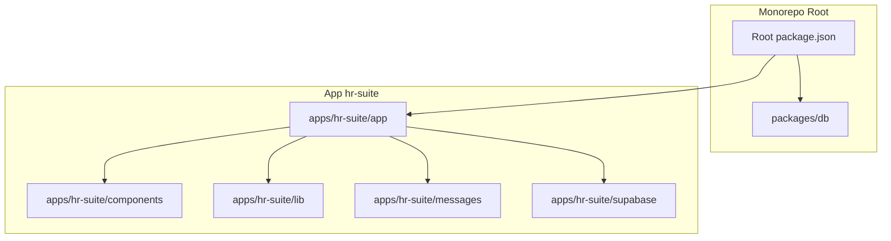
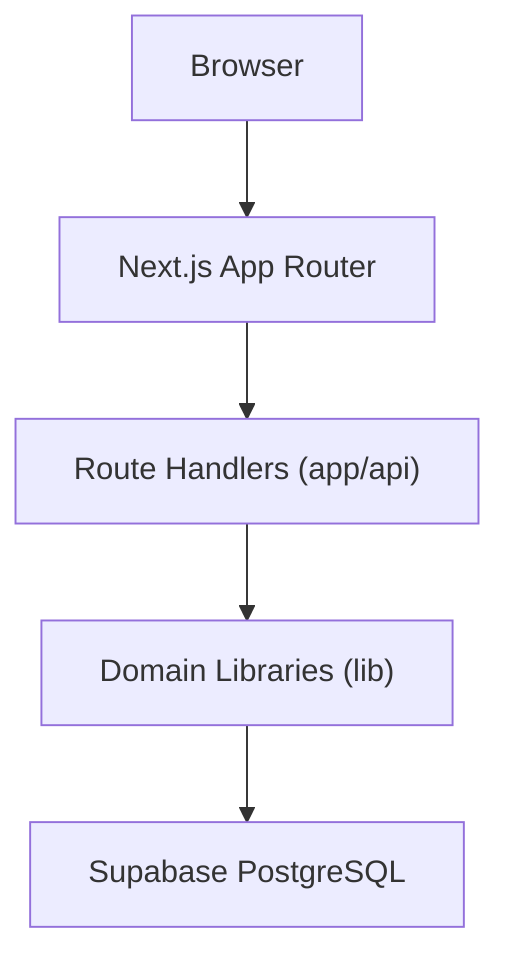
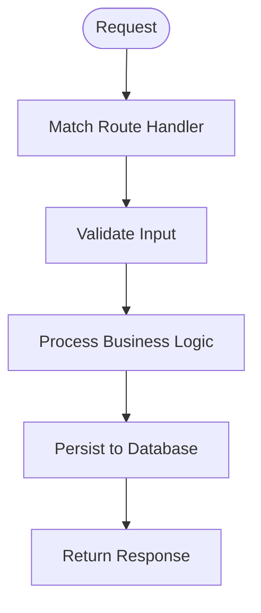
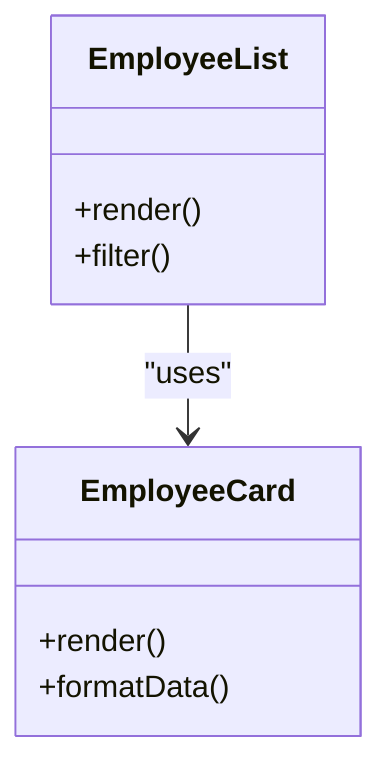
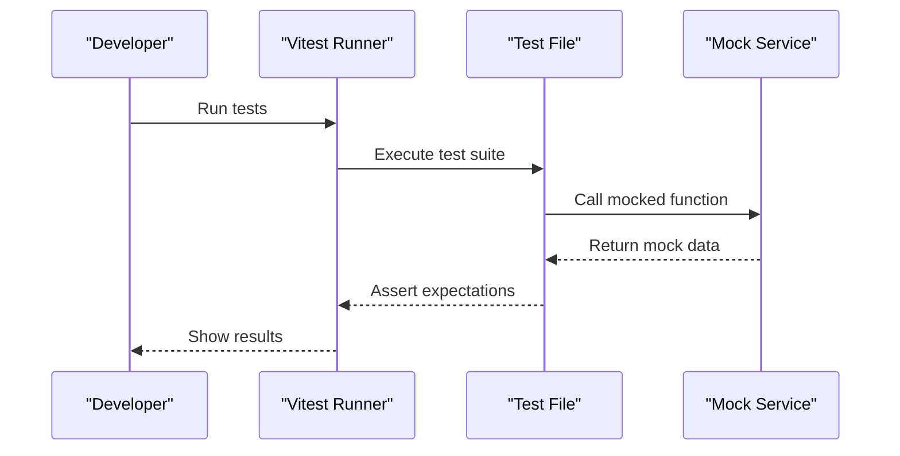
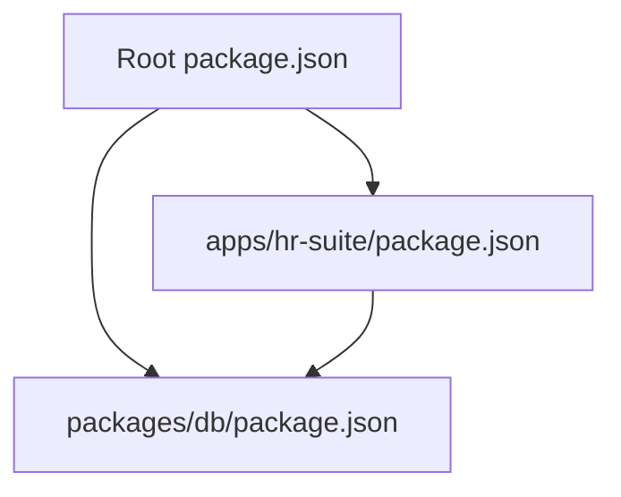

# Development Workflow

<cite>
**Referenced Files in This Document**
- [package.json](file://package.json)
- [apps/hr-suite/package.json](file://apps/hr-suite/package.json)
- [apps/hr-suite/next.config.ts](file://apps/hr-suite/next.config.ts)
- [apps/hr-suite/tsconfig.json](file://apps/hr-suite/tsconfig.json)
- [apps/hr-suite/eslint.config.mjs](file://apps/hr-suite/eslint.config.mjs)
- [apps/hr-suite/postcss.config.mjs](file://apps/hr-suite/postcss.config.mjs)
- [apps/hr-suite/vitest.config.ts](file://apps/hr-suite/vitest.config.ts)
- [apps/hr-suite/proxy.ts](file://apps/hr-suite/proxy.ts)
- [packages/db/package.json](file://packages/db/package.json)
- [packages/db/types.ts](file://packages/db/types.ts)
- [apps/hr-suite/app/layout.tsx](file://apps/hr-suite/app/layout.tsx)
- [apps/hr-suite/app/page.tsx](file://apps/hr-suite/app/page.tsx)
- [apps/hr-suite/app/(dashboard)/layout.tsx](file://apps/hr-suite/app/(dashboard)/layout.tsx)
- [apps/hr-suite/app/api/employees/route.ts](file://apps/hr-suite/app/api/employees/route.ts)
- [apps/hr-suite/supabase/config.toml](file://apps/hr-suite/supabase/config.toml)
</cite>

## Table of Contents
1. [Introduction](#introduction)
2. [Project Structure](#project-structure)
3. [Core Components](#core-components)
4. [Architecture Overview](#architecture-overview)
5. [Detailed Component Analysis](#detailed-component-analysis)
6. [Dependency Analysis](#dependency-analysis)
7. [Performance Considerations](#performance-considerations)
8. [Troubleshooting Guide](#troubleshooting-guide)
9. [Conclusion](#conclusion)
10. [Appendices](#appendices)

## Introduction
This document provides a comprehensive development workflow for LiquidHR, focusing on project structure, code organization patterns, directory conventions, TypeScript configuration, ESLint rules, coding standards, build system, dependency management with npm/pnpm, package scripts, Next.js App Router patterns, component architecture, file naming conventions, testing setup with Vitest, debugging techniques, and development tools configuration. It also includes guidance for setting up the local environment, database migrations, and running tests.

## Project Structure
LiquidHR is organized as a monorepo with a primary Next.js application under apps/hr-suite and shared packages under packages/db. The app follows the Next.js App Router convention with feature-based directories for pages, API routes, components, and libraries. Supabase migrations and tests are co-located within the app for easy access during development.

Key directories:
- apps/hr-suite/app: Next.js App Router pages, layouts, actions, and API routes
- apps/hr-suite/components: Feature-scoped UI components
- apps/hr-suite/lib: Shared business logic and utilities by domain
- apps/hr-suite/messages: i18n JSON files per locale
- apps/hr-suite/supabase: Database migrations and SQL tests
- packages/db: Shared database types and package metadata

**Diagram sources**
- [package.json](file://package.json)
- [apps/hr-suite/package.json](file://apps/hr-suite/package.json)
- [packages/db/package.json](file://packages/db/package.json)

**Section sources**
- [package.json](file://package.json)
- [apps/hr-suite/package.json](file://apps/hr-suite/package.json)
- [packages/db/package.json](file://packages/db/package.json)

## Core Components
The core development stack includes:
- Next.js App Router for routing and server-side rendering
- TypeScript for type safety across the codebase
- ESLint for linting and code quality enforcement
- PostCSS for CSS processing
- Vitest for unit and integration testing
- Supabase for database migrations and SQL tests
- pnpm or npm for dependency management

Configuration highlights:
- TypeScript configuration ensures strict mode and module resolution aligned with Next.js
- ESLint configuration enforces consistent coding standards
- PostCSS configuration enables modern CSS workflows
- Vitest configuration sets up test environments and resolvers

**Section sources**
- [apps/hr-suite/tsconfig.json](file://apps/hr-suite/tsconfig.json)
- [apps/hr-suite/eslint.config.mjs](file://apps/hr-suite/eslint.config.mjs)
- [apps/hr-suite/postcss.config.mjs](file://apps/hr-suite/postcss.config.mjs)
- [apps/hr-suite/vitest.config.ts](file://apps/hr-suite/vitest.config.ts)

## Architecture Overview
LiquidHR uses a layered architecture:
- Presentation layer: React components and Next.js pages
- Business logic: Domain-specific libraries under lib
- API layer: Next.js Route Handlers under app/api
- Data layer: Supabase-managed PostgreSQL with migrations and SQL tests

**Diagram sources**
- [apps/hr-suite/app/layout.tsx](file://apps/hr-suite/app/layout.tsx)
- [apps/hr-suite/app/api/employees/route.ts](file://apps/hr-suite/app/api/employees/route.ts)

**Section sources**
- [apps/hr-suite/app/layout.tsx](file://apps/hr-suite/app/layout.tsx)
- [apps/hr-suite/app/api/employees/route.ts](file://apps/hr-suite/app/api/employees/route.ts)

## Detailed Component Analysis

### Next.js App Router Patterns
- Pages are defined as files within the app directory using the App Router convention
- Layouts provide shared UI and context for route segments
- API routes implement server-side logic via Route Handlers
- Dynamic routes use bracket notation for parameters

**Diagram sources**
- [apps/hr-suite/app/api/employees/route.ts](file://apps/hr-suite/app/api/employees/route.ts)

**Section sources**
- [apps/hr-suite/app/layout.tsx](file://apps/hr-suite/app/layout.tsx)
- [apps/hr-suite/app/page.tsx](file://apps/hr-suite/app/page.tsx)
- [apps/hr-suite/app/(dashboard)/layout.tsx](file://apps/hr-suite/app/(dashboard)/layout.tsx)
- [apps/hr-suite/app/api/employees/route.ts](file://apps/hr-suite/app/api/employees/route.ts)

### Component Architecture
Components are organized by feature under the components directory:
- Each feature has its own folder containing related components
- Shared components reside in a shared folder
- Naming conventions follow kebab-case for files and PascalCase for components

**Diagram sources**
- [apps/hr-suite/components/employees/employee-list.tsx](file://apps/hr-suite/components/employees/employee-list.tsx)
- [apps/hr-suite/components/employees/employee-person-card.tsx](file://apps/hr-suite/components/employees/employee-person-card.tsx)

**Section sources**
- [apps/hr-suite/components/employees/employee-list.tsx](file://apps/hr-suite/components/employees/employee-list.tsx)
- [apps/hr-suite/components/employees/employee-person-card.tsx](file://apps/hr-suite/components/employees/employee-person-card.tsx)

### Testing Setup with Vitest
Vitest is configured for unit and integration testing:
- Test files follow the pattern *.test.ts or *.test.tsx
- Configuration includes environment setup and resolvers
- Mocking strategies are implemented for external dependencies

**Diagram sources**
- [apps/hr-suite/vitest.config.ts](file://apps/hr-suite/vitest.config.ts)

**Section sources**
- [apps/hr-suite/vitest.config.ts](file://apps/hr-suite/vitest.config.ts)

## Dependency Analysis
The project uses a monorepo structure with shared packages:
- Root package.json defines workspace configurations
- apps/hr-suite/package.json contains application-specific dependencies
- packages/db/package.json provides shared database types

**Diagram sources**
- [package.json](file://package.json)
- [apps/hr-suite/package.json](file://apps/hr-suite/package.json)
- [packages/db/package.json](file://packages/db/package.json)

**Section sources**
- [package.json](file://package.json)
- [apps/hr-suite/package.json](file://apps/hr-suite/package.json)
- [packages/db/package.json](file://packages/db/package.json)

## Performance Considerations
- Use Next.js App Router for optimal performance with server components
- Implement proper caching strategies for API responses
- Optimize bundle size by code splitting and lazy loading
- Monitor database query performance and add appropriate indexes
- Use efficient state management patterns to minimize re-renders

## Troubleshooting Guide
Common issues and solutions:
- TypeScript errors: Ensure tsconfig.json is properly configured
- ESLint violations: Review eslint.config.mjs rules and fix code accordingly
- Build failures: Check Next.js configuration and dependencies
- Test failures: Verify Vitest configuration and mock implementations
- Database migration issues: Review Supabase configuration and migration files

**Section sources**
- [apps/hr-suite/tsconfig.json](file://apps/hr-suite/tsconfig.json)
- [apps/hr-suite/eslint.config.mjs](file://apps/hr-suite/eslint.config.mjs)
- [apps/hr-suite/next.config.ts](file://apps/hr-suite/next.config.ts)
- [apps/hr-suite/vitest.config.ts](file://apps/hr-suite/vitest.config.ts)
- [apps/hr-suite/supabase/config.toml](file://apps/hr-suite/supabase/config.toml)

## Conclusion
LiquidHR provides a well-structured development workflow with modern tooling and best practices. The monorepo architecture facilitates code sharing and maintainability, while the Next.js App Router enables efficient server-side rendering and API handling. Comprehensive testing and linting ensure code quality, and Supabase integration streamlines database management.

## Appendices

### Local Development Environment Setup
1. Install dependencies using pnpm or npm
2. Configure environment variables
3. Set up Supabase locally
4. Run database migrations
5. Start the development server

### Database Migrations
- Migrations are stored in apps/hr-suite/supabase/migrations
- Use Supabase CLI to apply migrations
- SQL tests validate database schema changes

### Running Tests
- Unit tests: Use Vitest for component and utility testing
- Integration tests: Test API routes and database interactions
- SQL tests: Validate database schema and policies

**Section sources**
- [apps/hr-suite/supabase/migrations](file://apps/hr-suite/supabase/migrations)
- [apps/hr-suite/supabase/tests](file://apps/hr-suite/supabase/tests)
- [apps/hr-suite/package.json](file://apps/hr-suite/package.json)