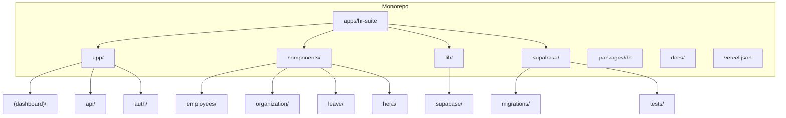
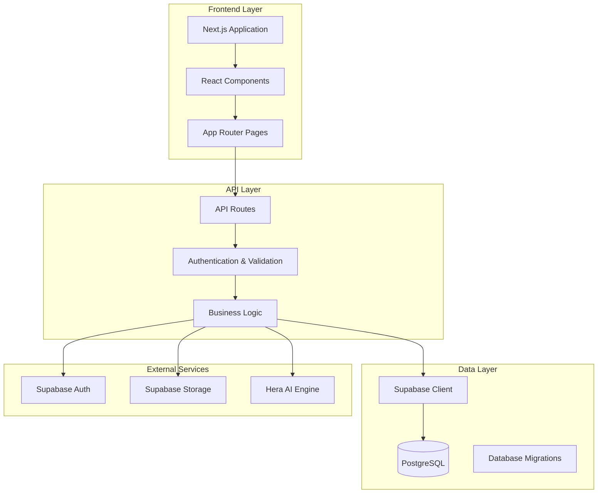
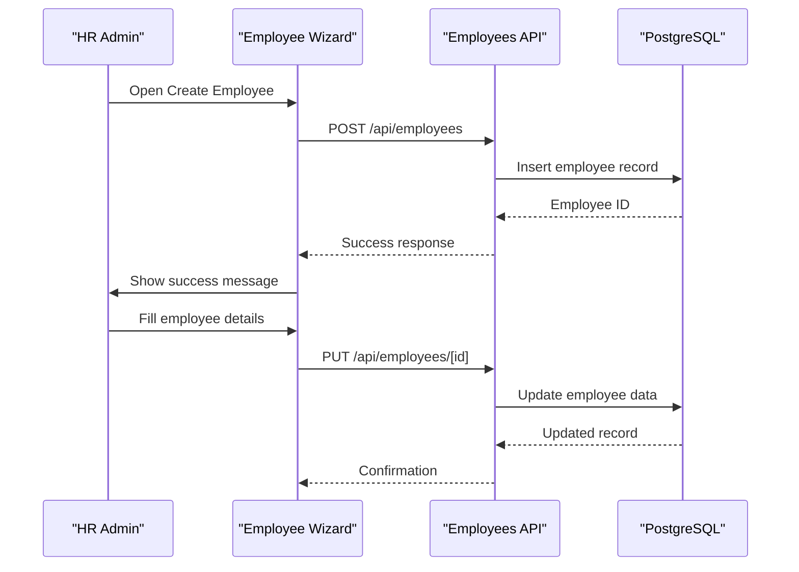
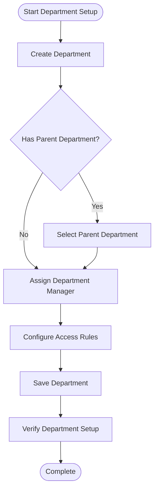
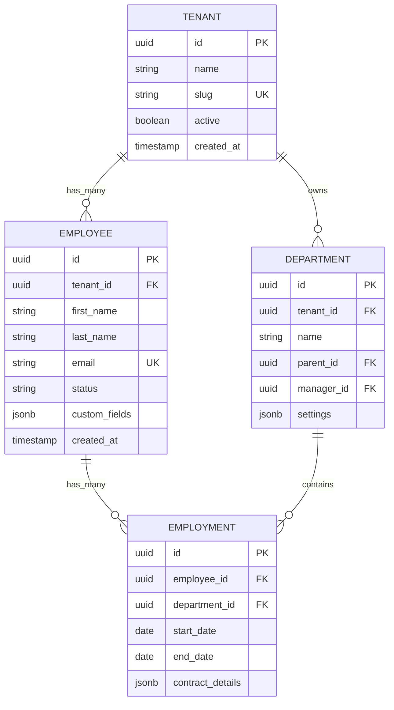
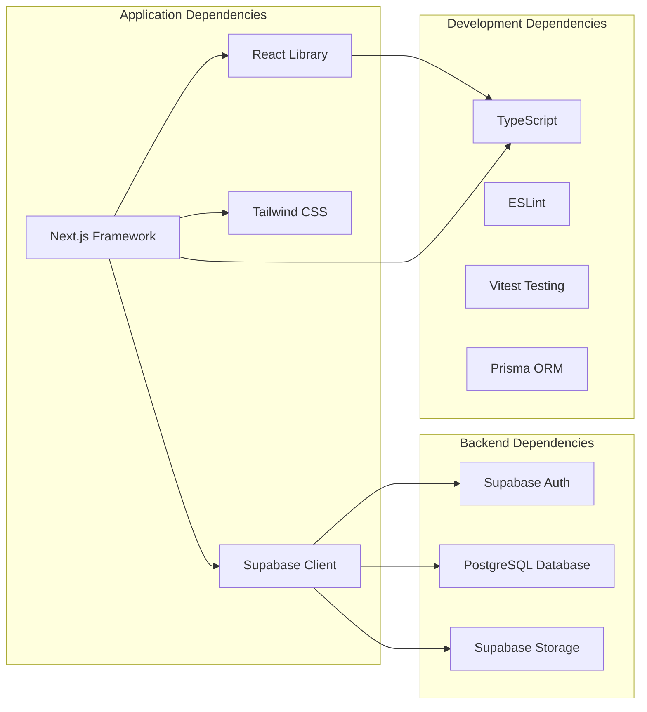

# Getting Started

<cite>
**Referenced Files in This Document**
- [package.json](file://package.json)
- [apps/hr-suite/package.json](file://apps/hr-suite/package.json)
- [apps/hr-suite/next.config.ts](file://apps/hr-suite/next.config.ts)
- [apps/hr-suite/supabase/config.toml](file://apps/hr-suite/supabase/config.toml)
- [apps/hr-suite/supabase/migrations/20260712124858_init_employee_core_hr.sql](file://apps/hr-suite/supabase/migrations/20260712124858_init_employee_core_hr.sql)
- [apps/hr-suite/supabase/migrations/20260712124911_add_tenant_rbac_and_organization.sql](file://apps/hr-suite/supabase/migrations/20260712124911_add_tenant_rbac_and_organization.sql)
- [apps/hr-suite/app/(dashboard)/employees/page.tsx](file://apps/hr-suite/app/(dashboard)/employees/page.tsx)
- [apps/hr-suite/app/(dashboard)/departments/page.tsx](file://apps/hr-suite/app/(dashboard)/departments/page.tsx)
- [apps/hr-suite/app/(dashboard)/settings/page.tsx](file://apps/hr-suite/app/(dashboard)/settings/page.tsx)
- [apps/hr-suite/app/api/employees/route.ts](file://apps/hr-suite/app/api/employees/route.ts)
- [apps/hr-suite/app/api/departments/route.ts](file://apps/hr-suite/app/api/departments/route.ts)
- [apps/hr-suite/app/api/settings/modules/route.ts](file://apps/hr-suite/app/api/settings/modules/route.ts)
- [apps/hr-suite/components/employees/employee-create-wizard.tsx](file://apps/hr-suite/components/employees/employee-create-wizard.tsx)
- [apps/hr-suite/components/organization/department-create-form.tsx](file://apps/hr-suite/components/organization/department-create-form.tsx)
- [apps/hr-suite/lib/supabase/client.ts](file://apps/hr-suite/lib/supabase/client.ts)
- [apps/hr-suite/lib/supabase/server.ts](file://apps/hr-suite/lib/supabase/server.ts)
- [apps/hr-suite/proxy.ts](file://apps/hr-suite/proxy.ts)
- [vercel.json](file://vercel.json)
</cite>

## Table of Contents
1. [Introduction](#introduction)
2. [Project Structure](#project-structure)
3. [Core Components](#core-components)
4. [Architecture Overview](#architecture-overview)
5. [Detailed Component Analysis](#detailed-component-analysis)
6. [Dependency Analysis](#dependency-analysis)
7. [Performance Considerations](#performance-considerations)
8. [Troubleshooting Guide](#troubleshooting-guide)
9. [Conclusion](#conclusion)
10. [Appendices](#appendices)

## Introduction
LiquidHR is a full-stack HR management system designed for enterprises with multitenancy support. It provides employee management, employment lifecycle tracking, organizational structure visualization, leave management, an AI-powered assistant (Hera), and a flexible custom fields system. The application is built on Next.js with Supabase as the backend, PostgreSQL for data persistence, and a modular architecture that supports multi-administration environments.

This guide will help you set up LiquidHR locally, initialize the database, configure basic settings, and perform your first operations such as creating employees and departments.

## Project Structure
The repository follows a monorepo layout:
- apps/hr-suite: Next.js application containing UI, API routes, components, and Supabase configuration
- packages/db: Shared database types
- docs: Architecture, requirements, decisions, and delivery documentation
- vercel.json: Deployment configuration for Vercel

Key directories within apps/hr-suite:
- app: Next.js App Router pages and API routes
- components: Reusable UI components organized by feature
- lib: Shared libraries including Supabase client/server utilities
- supabase: Database migrations, tests, and local configuration



**Diagram sources**
- [apps/hr-suite/package.json](file://apps/hr-suite/package.json)
- [apps/hr-suite/next.config.ts](file://apps/hr-suite/next.config.ts)

**Section sources**
- [package.json](file://package.json)
- [apps/hr-suite/package.json](file://apps/hr-suite/package.json)

## Core Components
LiquidHR's core functionality is organized around these key areas:

### Employee Management
- Employee creation wizard with guided workflow
- Comprehensive employee profiles with personal information, addresses, and documents
- Employee archive functionality for inactive records
- Custom fields system for extensible employee data

### Employment Lifecycle
- Employment contract management with start/end dates
- Employment timeline tracking changes over time
- Termination and rehiring workflows
- Work pattern configurations

### Organizational Structure
- Department management with hierarchical relationships
- Organization chart visualization
- Role-based access control per administration
- Management assignments and reporting lines

### Leave Management
- Leave type catalog with configurable rules
- Leave request workflow with approval processes
- Accrual engine for leave balance calculation
- Leave ledger for audit trails

### AI-Powered Assistant (Hera)
- Conversational interface for HR queries
- Data agent capabilities for insights and reports
- Memory system for context retention
- Preference management for personalized responses

### Custom Fields System
- Dynamic field definitions for employees and other entities
- Flexible data types and validation rules
- Scoped to specific administrations for multitenancy

**Section sources**
- [apps/hr-suite/app/(dashboard)/employees/page.tsx](file://apps/hr-suite/app/(dashboard)/employees/page.tsx)
- [apps/hr-suite/app/(dashboard)/departments/page.tsx](file://apps/hr-suite/app/(dashboard)/departments/page.tsx)
- [apps/hr-suite/app/(dashboard)/settings/page.tsx](file://apps/hr-suite/app/(dashboard)/settings/page.tsx)

## Architecture Overview
LiquidHR follows a modern full-stack architecture with clear separation of concerns:



**Diagram sources**
- [apps/hr-suite/app/api/employees/route.ts](file://apps/hr-suite/app/api/employees/route.ts)
- [apps/hr-suite/lib/supabase/client.ts](file://apps/hr-suite/lib/supabase/client.ts)
- [apps/hr-suite/lib/supabase/server.ts](file://apps/hr-suite/lib/supabase/server.ts)

## Detailed Component Analysis

### Employee Creation Workflow
The employee creation process follows a structured wizard approach:



**Diagram sources**
- [apps/hr-suite/components/employees/employee-create-wizard.tsx](file://apps/hr-suite/components/employees/employee-create-wizard.tsx)
- [apps/hr-suite/app/api/employees/route.ts](file://apps/hr-suite/app/api/employees/route.ts)

### Department Management
Department creation and organization follows a hierarchical structure:



**Diagram sources**
- [apps/hr-suite/components/organization/department-create-form.tsx](file://apps/hr-suite/components/organization/department-create-form.tsx)
- [apps/hr-suite/app/api/departments/route.ts](file://apps/hr-suite/app/api/departments/route.ts)

### Database Schema Foundation
The database schema supports multitenancy and comprehensive HR functionality:



**Diagram sources**
- [apps/hr-suite/supabase/migrations/20260712124858_init_employee_core_hr.sql](file://apps/hr-suite/supabase/migrations/20260712124858_init_employee_core_hr.sql)
- [apps/hr-suite/supabase/migrations/20260712124911_add_tenant_rbac_and_organization.sql](file://apps/hr-suite/supabase/migrations/20260712124911_add_tenant_rbac_and_organization.sql)

**Section sources**
- [apps/hr-suite/components/employees/employee-create-wizard.tsx](file://apps/hr-suite/components/employees/employee-create-wizard.tsx)
- [apps/hr-suite/components/organization/department-create-form.tsx](file://apps/hr-suite/components/organization/department-create-form.tsx)
- [apps/hr-suite/supabase/migrations/20260712124858_init_employee_core_hr.sql](file://apps/hr-suite/supabase/migrations/20260712124858_init_employee_core_hr.sql)

## Dependency Analysis
LiquidHR has well-defined dependencies between components:



**Diagram sources**
- [apps/hr-suite/package.json](file://apps/hr-suite/package.json)
- [package.json](file://package.json)

**Section sources**
- [apps/hr-suite/package.json](file://apps/hr-suite/package.json)
- [package.json](file://package.json)

## Performance Considerations
For optimal performance in LiquidHR deployments:

### Database Optimization
- Use proper indexing strategies for frequently queried tables
- Implement connection pooling for database connections
- Leverage Supabase's built-in caching mechanisms
- Consider read replicas for high-traffic scenarios

### Frontend Performance
- Utilize Next.js automatic code splitting
- Implement lazy loading for heavy components
- Use efficient state management patterns
- Optimize images and static assets

### API Response Optimization
- Implement pagination for large datasets
- Use efficient query patterns with proper filtering
- Cache frequently accessed data where appropriate
- Monitor API response times and optimize slow endpoints

## Troubleshooting Guide

### Common Setup Issues

#### Database Connection Problems
- **Issue**: Cannot connect to Supabase database
- **Solution**: Verify environment variables are correctly set in .env.local file
- **Check**: Ensure Supabase project URL and anon key are valid
- **Reference**: [Environment Configuration](file://apps/hr-suite/.env.local)

#### Migration Failures
- **Issue**: Database migrations fail during setup
- **Solution**: Check migration syntax and ensure proper permissions
- **Common Causes**: Missing foreign key constraints, invalid data types
- **Resolution**: Review migration files and fix any syntax errors

#### Authentication Issues
- **Issue**: Users cannot log in or authenticate
- **Solution**: Verify Supabase auth configuration and redirect URLs
- **Check**: Ensure proper CORS settings and allowed domains
- **Debug**: Enable debug logging in development mode

#### API Route Errors
- **Issue**: API routes return 500 errors
- **Solution**: Check server-side error logs and database connectivity
- **Common Issues**: Missing environment variables, permission problems
- **Testing**: Use API testing tools to validate endpoint behavior

### Environment Setup Checklist
1. Install Node.js (version 18+ recommended)
2. Clone the repository and install dependencies
3. Set up Supabase project and configure environment variables
4. Run database migrations
5. Start the development server
6. Verify all services are running correctly

**Section sources**
- [apps/hr-suite/supabase/config.toml](file://apps/hr-suite/supabase/config.toml)
- [apps/hr-suite/next.config.ts](file://apps/hr-suite/next.config.ts)

## Conclusion
LiquidHR provides a comprehensive HR management solution with enterprise-grade features including multitenancy, AI assistance, and flexible customization options. The modular architecture ensures scalability while maintaining ease of use for HR administrators. With proper setup and configuration, organizations can efficiently manage their workforce data, streamline HR processes, and gain valuable insights through advanced analytics.

The getting started process involves setting up the development environment, configuring Supabase integration, and performing initial data setup. Once operational, users can leverage the intuitive interface to manage employees, departments, leave requests, and organizational structures effectively.

## Appendices

### Quick Start Commands
```bash
# Install dependencies
npm install

# Set up environment variables
cp .env.example .env.local

# Run database migrations
npx supabase db push

# Start development server
npm run dev
```

### Essential Environment Variables
- SUPABASE_URL: Your Supabase project URL
- SUPABASE_ANON_KEY: Public anonymous key
- SUPABASE_SERVICE_ROLE_KEY: Service role key for admin operations
- NEXTAUTH_SECRET: Authentication secret key
- DATABASE_URL: Direct database connection string (optional)

### Useful Documentation Links
- [Architecture Documentation](file://docs/architecture/BLUEPRINT.md)
- [Multitenancy Guide](file://docs/requirements/multitenancy/MULTITENANCY_EN_MULTI_ADMINISTRATIE.md)
- [Employee Management](file://docs/requirements/core-hr/MEDEWERKER.md)
- [Leave Management](file://docs/requirements/leave/VERLOF_AANVRAAG_HR_ADMIN.md)
- [AI Assistant Setup](file://docs/requirements/chatbot/HERA_AI_AGENT.md)