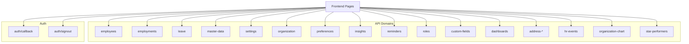
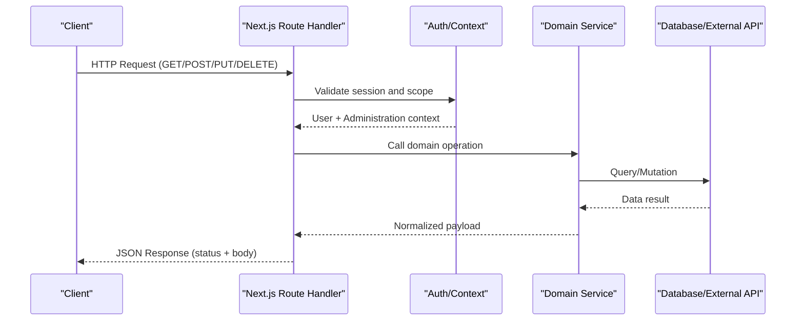
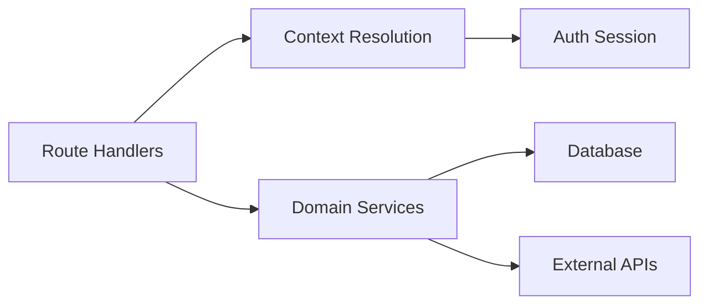

# API Routes

<cite>
**Referenced Files in This Document**
- [apps/hr-suite/app/api/address-lookup/route.ts](file://apps/hr-suite/app/api/address-lookup/route.ts)
- [apps/hr-suite/app/api/address-suggestions/route.ts](file://apps/hr-suite/app/api/address-suggestions/route.ts)
- [apps/hr-suite/app/api/context/route.ts](file://apps/hr-suite/app/api/context/route.ts)
- [apps/hr-suite/app/api/context/administration/route.ts](file://apps/hr-suite/app/api/context/administration/route.ts)
- [apps/hr-suite/app/api/custom-fields/route.ts](file://apps/hr-suite/app/api/custom-fields/route.ts)
- [apps/hr-suite/app/api/custom-fields/[definitionId]/route.ts](file://apps/hr-suite/app/api/custom-fields/[definitionId]/route.ts)
- [apps/hr-suite/app/api/dashboards/route.ts](file://apps/hr-suite/app/api/dashboards/route.ts)
- [apps/hr-suite/app/api/dashboards/[dashboardId]/route.ts](file://apps/hr-suite/app/api/dashboards/[dashboardId]/route.ts)
- [apps/hr-suite/app/api/departments/route.ts](file://apps/hr-suite/app/api/departments/route.ts)
- [apps/hr-suite/app/api/departments/[departmentId]/route.ts](file://apps/hr-suite/app/api/departments/[departmentId]/route.ts)
- [apps/hr-suite/app/api/employees/route.ts](file://apps/hr-suite/app/api/employees/route.ts)
- [apps/hr-suite/app/api/employees/[employeeId]/route.ts](file://apps/hr-suite/app/api/employees/[employeeId]/route.ts)
- [apps/hr-suite/app/api/employees/matches/route.ts](file://apps/hr-suite/app/api/employees/matches/route.ts)
- [apps/hr-suite/app/api/employees/next-number/route.ts](file://apps/hr-suite/app/api/employees/next-number/route.ts)
- [apps/hr-suite/app/api/employments/[employmentId]/route.ts](file://apps/hr-suite/app/api/employments/[employmentId]/route.ts)
- [apps/hr-suite/app/api/hr-events/route.ts](file://apps/hr-suite/app/api/hr-events/route.ts)
- [apps/hr-suite/app/api/insights/employees/route.ts](file://apps/hr-suite/app/api/insights/employees/route.ts)
- [apps/hr-suite/app/api/insights/upcoming-events/route.ts](file://apps/hr-suite/app/api/insights/upcoming-events/route.ts)
- [apps/hr-suite/app/api/invitations/route.ts](file://apps/hr-suite/app/api/invitations/route.ts)
- [apps/hr-suite/app/api/leave/balance-report/route.ts](file://apps/hr-suite/app/api/leave/balance-report/route.ts)
- [apps/hr-suite/app/api/leave/catalog/route.ts](file://apps/hr-suite/app/api/leave/catalog/route.ts)
- [apps/hr-suite/app/api/leave/ledger/route.ts](file://apps/hr-suite/app/api/leave/ledger/route.ts)
- [apps/hr-suite/app/api/leave/request/route.ts](file://apps/hr-suite/app/api/leave/request/route.ts)
- [apps/hr-suite/app/api/master-data/document-categories/route.ts](file://apps/hr-suite/app/api/master-data/document-categories/route.ts)
- [apps/hr-suite/app/api/master-data/end-reasons/route.ts](file://apps/hr-suite/app/api/master-data/end-reasons/route.ts)
- [apps/hr-suite/app/api/master-data/job-groups/route.ts](file://apps/hr-suite/app/api/master-data/job-groups/route.ts)
- [apps/hr-suite/app/api/master-data/jobs/route.ts](file://apps/hr-suite/app/api/master-data/jobs/route.ts)
- [apps/hr-suite/app/api/master-data/relation-types/route.ts](file://apps/hr-suite/app/api/master-data/relation-types/route.ts)
- [apps/hr-suite/app/api/master-data/salary-scales/route.ts](file://apps/hr-suite/app/api/master-data/salary-scales/route.ts)
- [apps/hr-suite/app/api/organization/assignments/route.ts](file://apps/hr-suite/app/api/organization/assignments/route.ts)
- [apps/hr-suite/app/api/organization/management-assignments/route.ts](file://apps/hr-suite/app/api/organization/management-assignments/route.ts)
- [apps/hr-suite/app/api/organization/placements/route.ts](file://apps/hr-suite/app/api/organization/placements/route.ts)
- [apps/hr-suite/app/api/organization-chart/route.ts](file://apps/hr-suite/app/api/organization-chart/route.ts)
- [apps/hr-suite/app/api/preferences/employee-dashboard/route.ts](file://apps/hr-suite/app/api/preferences/employee-dashboard/route.ts)
- [apps/hr-suite/app/api/preferences/employees/route.ts](file://apps/hr-suite/app/api/preferences/employees/route.ts)
- [apps/hr-suite/app/api/preferences/hr-calendar/route.ts](file://apps/hr-suite/app/api/preferences/hr-calendar/route.ts)
- [apps/hr-suite/app/api/preferences/insights/route.ts](file://apps/hr-suite/app/api/preferences/insights/route.ts)
- [apps/hr-suite/app/api/preferences/organization-chart/route.ts](file://apps/hr-suite/app/api/preferences/organization-chart/route.ts)
- [apps/hr-suite/app/api/reminders/route.ts](file://apps/hr-suite/app/api/reminders/route.ts)
- [apps/hr-suite/app/api/reminders/[reminderId]/route.ts](file://apps/hr-suite/app/api/reminders/[reminderId]/route.ts)
- [apps/hr-suite/app/api/roles/route.ts](file://apps/hr-suite/app/api/roles/route.ts)
- [apps/hr-suite/app/api/roles/[roleId]/route.ts](file://apps/hr-suite/app/api/roles/[roleId]/route.ts)
- [apps/hr-suite/app/api/settings/anniversary-rules/route.ts](file://apps/hr-suite/app/api/settings/anniversary-rules/route.ts)
- [apps/hr-suite/app/api/settings/dashboard-widgets/route.ts](file://apps/hr-suite/app/api/settings/dashboard-widgets/route.ts)
- [apps/hr-suite/app/api/settings/holidays/route.ts](file://apps/hr-suite/app/api/settings/holidays/route.ts)
- [apps/hr-suite/app/api/settings/modules/route.ts](file://apps/hr-suite/app/api/settings/modules/route.ts)
- [apps/hr-suite/app/api/star-performer-tags/route.ts](file://apps/hr-suite/app/api/star-performer-tags/route.ts)
- [apps/hr-suite/app/api/star-performers/assessments/route.ts](file://apps/hr-suite/app/api/star-performers/assessments/route.ts)
- [apps/hr-suite/app/auth/callback/route.ts](file://apps/hr-suite/app/auth/callback/route.ts)
- [apps/hr-suite/app/auth/signout/route.ts](file://apps/hr-suite/app/auth/signout/route.ts)
</cite>

## Table of Contents
1. [Introduction](#introduction)
2. [Project Structure](#project-structure)
3. [Core Components](#core-components)
4. [Architecture Overview](#architecture-overview)
5. [Detailed Component Analysis](#detailed-component-analysis)
6. [Dependency Analysis](#dependency-analysis)
7. [Performance Considerations](#performance-considerations)
8. [Troubleshooting Guide](#troubleshooting-guide)
9. [Conclusion](#conclusion)

## Introduction
This document provides comprehensive API Routes documentation for LiquidHR’s Next.js API layer. It explains the domain-driven organization of RESTful endpoints, HTTP methods, URL patterns, request/response schemas, authentication requirements, error handling strategies, status codes, response formatting conventions, parameter validation, query filtering, pagination patterns, and file upload handling. It also covers route handlers, middleware usage, integration with business logic services, testing approaches, and debugging techniques.

## Project Structure
LiquidHR uses Next.js App Router with a domain-driven API layout under apps/hr-suite/app/api/. Each top-level folder represents a domain (e.g., employees, leave, master-data, settings). Subfolders define nested resources and actions. Route files are named route.ts and implement HTTP method handlers (GET, POST, PUT, DELETE). Authentication is handled via NextAuth callbacks and signout routes under app/auth.

**Diagram sources**
- [apps/hr-suite/app/api/employees/route.ts](file://apps/hr-suite/app/api/employees/route.ts)
- [apps/hr-suite/app/api/leave/request/route.ts](file://apps/hr-suite/app/api/leave/request/route.ts)
- [apps/hr-suite/app/api/master-data/jobs/route.ts](file://apps/hr-suite/app/api/master-data/jobs/route.ts)
- [apps/hr-suite/app/api/settings/holidays/route.ts](file://apps/hr-suite/app/api/settings/holidays/route.ts)
- [apps/hr-suite/app/api/context/route.ts](file://apps/hr-suite/app/api/context/route.ts)
- [apps/hr-suite/app/auth/callback/route.ts](file://apps/hr-suite/app/auth/callback/route.ts)
- [apps/hr-suite/app/auth/signout/route.ts](file://apps/hr-suite/app/auth/signout/route.ts)

**Section sources**
- [apps/hr-suite/app/api/employees/route.ts](file://apps/hr-suite/app/api/employees/route.ts)
- [apps/hr-suite/app/api/context/route.ts](file://apps/hr-suite/app/api/context/route.ts)
- [apps/hr-suite/app/auth/callback/route.ts](file://apps/hr-suite/app/auth/callback/route.ts)
- [apps/hr-suite/app/auth/signout/route.ts](file://apps/hr-suite/app/auth/signout/route.ts)

## Core Components
- Domain-based routing: Each module corresponds to a business domain with its own directory and route handlers.
- Resource-oriented endpoints: Plural nouns for collections (e.g., /api/employees), singular for items (e.g., /api/employees/[employeeId]).
- Action subresources: Nested folders like /api/leave/request/preview or /api/reminders/[reminderId]/publish represent specific operations.
- Context and administration scoping: /api/context and /api/context/administration provide tenant and administration context for multi-tenancy.

Key responsibilities:
- Input validation and normalization
- Authorization checks using session/context
- Business logic delegation to services/libraries
- Consistent JSON responses and error formats
- Pagination and filtering where applicable

**Section sources**
- [apps/hr-suite/app/api/context/route.ts](file://apps/hr-suite/app/api/context/route.ts)
- [apps/hr-suite/app/api/context/administration/route.ts](file://apps/hr-suite/app/api/context/administration/route.ts)
- [apps/hr-suite/app/api/employees/route.ts](file://apps/hr-suite/app/api/employees/route.ts)
- [apps/hr-suite/app/api/leave/request/route.ts](file://apps/hr-suite/app/api/leave/request/route.ts)

## Architecture Overview
The API layer integrates with authentication, authorization, and data access layers. Requests flow from the client through Next.js route handlers into domain-specific services that perform validation, enforce permissions, and interact with the database or external APIs. Responses follow a consistent schema with success payloads and standardized errors.

**Diagram sources**
- [apps/hr-suite/app/api/employees/route.ts](file://apps/hr-suite/app/api/employees/route.ts)
- [apps/hr-suite/app/api/context/route.ts](file://apps/hr-suite/app/api/context/route.ts)
- [apps/hr-suite/app/auth/callback/route.ts](file://apps/hr-suite/app/auth/callback/route.ts)

## Detailed Component Analysis

### Employees API
- Base path: /api/employees
- Methods: GET (list), POST (create)
- Item path: /api/employees/[employeeId]
- Methods: GET (read), PUT (update), DELETE (archive/unarchive)
- Subresources:
  - /api/employees/[employeeId]/addresses
  - /api/employees/[employeeId]/bank-accounts
  - /api/employees/[employeeId]/documents
  - /api/employees/[employeeId]/custom-fields
  - /api/employees/[employeeId]/salary
  - /api/employees/[employeeId]/activity
  - /api/employees/[employeeId]/relations
  - /api/employees/[employeeId]/archive
  - /api/employees/[employeeId]/bsn
  - /api/employees/[employeeId]/avatar
- Actions:
  - /api/employees/matches (identity matching)
  - /api/employees/next-number (generate next employee number)

Request/response patterns:
- List queries support filtering by department, job, status; pagination via page and pageSize; sorting via sortBy and sortOrder.
- Create/update payloads validated against schema; required fields enforced; optional fields normalized.
- File uploads for avatar/documents handled via multipart/form-data with size/type constraints.

Authentication and authorization:
- Requires authenticated user; role-based access controls enforced per action (e.g., HR admin vs manager).
- Multi-tenant isolation via administration context.

Error handling:
- Validation errors return 400 with field-level messages.
- Not found returns 404.
- Unauthorized returns 401; forbidden returns 403.
- Server errors return 500 with sanitized messages.

Pagination:
- Returns { data, meta: { page, pageSize, total } }.

File upload handling:
- Validates MIME types and max size; stores securely; returns metadata (url, filename, size).

Testing:
- Unit tests for validation and service calls; integration tests for full request/response cycles; mocking auth context.

Debugging:
- Structured logging with correlation IDs; request tracing; environment-specific verbose logs.

**Section sources**
- [apps/hr-suite/app/api/employees/route.ts](file://apps/hr-suite/app/api/employees/route.ts)
- [apps/hr-suite/app/api/employees/[employeeId]/route.ts](file://apps/hr-suite/app/api/employees/[employeeId]/route.ts)
- [apps/hr-suite/app/api/employees/matches/route.ts](file://apps/hr-suite/app/api/employees/matches/route.ts)
- [apps/hr-suite/app/api/employees/next-number/route.ts](file://apps/hr-suite/app/api/employees/next-number/route.ts)

### Employments API
- Base path: /api/employments/[employmentId]
- Methods: GET (read), PUT (update), DELETE (terminate)
- Subresources:
  - changes, follow-ups, profile-links, termination, work-patterns
  - timeline/[timeline]

Request/response patterns:
- Update payloads include change sets; versioning enforced to prevent conflicts.
- Termination requires reason and effective date; audit trail recorded.

Authentication and authorization:
- Role-scoped access; managers can update limited fields; HR admins have full control.

Error handling:
- Conflict errors on version mismatch; validation errors for dates and statuses.

**Section sources**
- [apps/hr-suite/app/api/employments/[employmentId]/route.ts](file://apps/hr-suite/app/api/employments/[employmentId]/route.ts)

### Leave API
- Base path: /api/leave
- Catalog: /api/leave/catalog (GET list, POST create, PUT update, DELETE remove)
- Request: /api/leave/request (GET list, POST create, PUT update, DELETE cancel)
- Ledger: /api/leave/ledger (GET transactions)
- Balance report: /api/leave/balance-report (GET report)

Request/response patterns:
- Catalog entries include type, accrual rules, color, priority.
- Requests include start/end dates, type, reason; preview endpoint validates availability.
- Ledger returns chronological transactions with balances.

Authentication and authorization:
- Employees can view their own requests; HR admins manage catalog and approvals.

Error handling:
- Overlapping date validation; insufficient balance errors; policy violations.

**Section sources**
- [apps/hr-suite/app/api/leave/catalog/route.ts](file://apps/hr-suite/app/api/leave/catalog/route.ts)
- [apps/hr-suite/app/api/leave/request/route.ts](file://apps/hr-suite/app/api/leave/request/route.ts)
- [apps/hr-suite/app/api/leave/ledger/route.ts](file://apps/hr-suite/app/api/leave/ledger/route.ts)
- [apps/hr-suite/app/api/leave/balance-report/route.ts](file://apps/hr-suite/app/api/leave/balance-report/route.ts)

### Master Data API
- Endpoints:
  - /api/master-data/document-categories
  - /api/master-data/end-reasons
  - /api/master-data/job-groups
  - /api/master-data/jobs
  - /api/master-data/relation-types
  - /api/master-data/salary-scales

Request/response patterns:
- CRUD operations with code uniqueness constraints; hierarchical relationships supported where applicable.
- Salary scales support revisions and effective dates.

Authentication and authorization:
- Admin-only writes; read access scoped by module visibility.

Error handling:
- Duplicate key errors; invalid reference errors; version conflicts.

**Section sources**
- [apps/hr-suite/app/api/master-data/document-categories/route.ts](file://apps/hr-suite/app/api/master-data/document-categories/route.ts)
- [apps/hr-suite/app/api/master-data/end-reasons/route.ts](file://apps/hr-suite/app/api/master-data/end-reasons/route.ts)
- [apps/hr-suite/app/api/master-data/job-groups/route.ts](file://apps/hr-suite/app/api/master-data/job-groups/route.ts)
- [apps/hr-suite/app/api/master-data/jobs/route.ts](file://apps/hr-suite/app/api/master-data/jobs/route.ts)
- [apps/hr-suite/app/api/master-data/relation-types/route.ts](file://apps/hr-suite/app/api/master-data/relation-types/route.ts)
- [apps/hr-suite/app/api/master-data/salary-scales/route.ts](file://apps/hr-suite/app/api/master-data/salary-scales/route.ts)

### Settings API
- Endpoints:
  - /api/settings/anniversary-rules
  - /api/settings/dashboard-widgets
  - /api/settings/holidays
  - /api/settings/modules

Request/response patterns:
- Configuration objects with validation; previews available for holidays.

Authentication and authorization:
- Admin-only; module toggles respect feature flags.

Error handling:
- Invalid configuration schemas; dependency conflicts.

**Section sources**
- [apps/hr-suite/app/api/settings/anniversary-rules/route.ts](file://apps/hr-suite/app/api/settings/anniversary-rules/route.ts)
- [apps/hr-suite/app/api/settings/dashboard-widgets/route.ts](file://apps/hr-suite/app/api/settings/dashboard-widgets/route.ts)
- [apps/hr-suite/app/api/settings/holidays/route.ts](file://apps/hr-suite/app/api/settings/holidays/route.ts)
- [apps/hr-suite/app/api/settings/modules/route.ts](file://apps/hr-suite/app/api/settings/modules/route.ts)

### Organization API
- Endpoints:
  - /api/organization/assignments
  - /api/organization/management-assignments
  - /api/organization/placements

Request/response patterns:
- Assignment records link users to roles and scopes; placements map employees to organizational units.

Authentication and authorization:
- Admin-only writes; managers can view assignments within scope.

Error handling:
- Circular assignment prevention; scope validation.

**Section sources**
- [apps/hr-suite/app/api/organization/assignments/route.ts](file://apps/hr-suite/app/api/organization/assignments/route.ts)
- [apps/hr-suite/app/api/organization/management-assignments/route.ts](file://apps/hr-suite/app/api/organization/management-assignments/route.ts)
- [apps/hr-suite/app/api/organization/placements/route.ts](file://apps/hr-suite/app/api/organization/placements/route.ts)

### Preferences API
- Endpoints:
  - /api/preferences/employee-dashboard
  - /api/preferences/employees
  - /api/preferences/hr-calendar
  - /api/preferences/insights
  - /api/preferences/organization-chart

Request/response patterns:
- Per-user preference objects; partial updates supported.

Authentication and authorization:
- Users can update their own preferences; admins can override system defaults.

Error handling:
- Schema validation; conflict resolution for concurrent updates.

**Section sources**
- [apps/hr-suite/app/api/preferences/employee-dashboard/route.ts](file://apps/hr-suite/app/api/preferences/employee-dashboard/route.ts)
- [apps/hr-suite/app/api/preferences/employees/route.ts](file://apps/hr-suite/app/api/preferences/employees/route.ts)
- [apps/hr-suite/app/api/preferences/hr-calendar/route.ts](file://apps/hr-suite/app/api/preferences/hr-calendar/route.ts)
- [apps/hr-suite/app/api/preferences/insights/route.ts](file://apps/hr-suite/app/api/preferences/insights/route.ts)
- [apps/hr-suite/app/api/preferences/organization-chart/route.ts](file://apps/hr-suite/app/api/preferences/organization-chart/route.ts)

### Insights API
- Endpoints:
  - /api/insights/employees
  - /api/insights/upcoming-events

Request/response patterns:
- Aggregated metrics and event lists; filters by date range and scope.

Authentication and authorization:
- Read-only; scope-limited by role and administration.

Error handling:
- Invalid filter parameters; permission denied.

**Section sources**
- [apps/hr-suite/app/api/insights/employees/route.ts](file://apps/hr-suite/app/api/insights/employees/route.ts)
- [apps/hr-suite/app/api/insights/upcoming-events/route.ts](file://apps/hr-suite/app/api/insights/upcoming-events/route.ts)

### Reminders API
- Base path: /api/reminders
- Item path: /api/reminders/[reminderId]
- Actions:
  - /api/reminders/[reminderId]/cancel
  - /api/reminders/[reminderId]/publish

Request/response patterns:
- Reminder lifecycle management; publish triggers notifications; cancel prevents delivery.

Authentication and authorization:
- Admin-only write actions; recipients receive scoped notifications.

Error handling:
- Idempotency checks; scheduling conflicts.

**Section sources**
- [apps/hr-suite/app/api/reminders/route.ts](file://apps/hr-suite/app/api/reminders/route.ts)
- [apps/hr-suite/app/api/reminders/[reminderId]/route.ts](file://apps/hr-suite/app/api/reminders/[reminderId]/route.ts)

### Roles API
- Base path: /api/roles
- Item path: /api/roles/[roleId]
- Permissions:
  - /api/roles/[roleId]/permissions

Request/response patterns:
- Role definitions with permission sets; bulk updates supported.

Authentication and authorization:
- Admin-only; permission inheritance validated.

Error handling:
- Duplicate role names; invalid permission references.

**Section sources**
- [apps/hr-suite/app/api/roles/route.ts](file://apps/hr-suite/app/api/roles/route.ts)
- [apps/hr-suite/app/api/roles/[roleId]/route.ts](file://apps/hr-suite/app/api/roles/[roleId]/route.ts)

### Custom Fields API
- Base path: /api/custom-fields
- Item path: /api/custom-fields/[definitionId]

Request/response patterns:
- Definition CRUD; values managed via subresources per entity.

Authentication and authorization:
- Admin-only definitions; entity owners manage values.

Error handling:
- Schema validation; value type mismatches.

**Section sources**
- [apps/hr-suite/app/api/custom-fields/route.ts](file://apps/hr-suite/app/api/custom-fields/route.ts)
- [apps/hr-suite/app/api/custom-fields/[definitionId]/route.ts](file://apps/hr-suite/app/api/custom-fields/[definitionId]/route.ts)

### Dashboards API
- Base path: /api/dashboards
- Item path: /api/dashboards/[dashboardId]
- Layout:
  - /api/dashboards/[dashboardId]/layout

Request/response patterns:
- Dashboard configurations; widget ordering and layout persistence.

Authentication and authorization:
- Personal dashboards editable by owner; shared dashboards read-only for others.

Error handling:
- Widget reference validation; layout conflicts.

**Section sources**
- [apps/hr-suite/app/api/dashboards/route.ts](file://apps/hr-suite/app/api/dashboards/route.ts)
- [apps/hr-suite/app/api/dashboards/[dashboardId]/route.ts](file://apps/hr-suite/app/api/dashboards/[dashboardId]/route.ts)

### Address Lookup API
- Endpoints:
  - /api/address-lookup
  - /api/address-suggestions

Request/response patterns:
- Geocoding and autocomplete suggestions; locale-aware results.

Authentication and authorization:
- Public read; rate-limited.

Error handling:
- External service failures; malformed inputs.

**Section sources**
- [apps/hr-suite/app/api/address-lookup/route.ts](file://apps/hr-suite/app/api/address-lookup/route.ts)
- [apps/hr-suite/app/api/address-suggestions/route.ts](file://apps/hr-suite/app/api/address-suggestions/route.ts)

### HR Events API
- Endpoint: /api/hr-events

Request/response patterns:
- Event stream for HR activities; subscription-based consumption.

Authentication and authorization:
- Scoped by administration and role.

Error handling:
- Stream connectivity issues; event serialization errors.

**Section sources**
- [apps/hr-suite/app/api/hr-events/route.ts](file://apps/hr-suite/app/api/hr-events/route.ts)

### Organization Chart API
- Endpoint: /api/organization-chart

Request/response patterns:
- Hierarchical org structure; lazy loading of nodes.

Authentication and authorization:
- Read-only; visibility filtered by policies.

Error handling:
- Large tree performance; caching strategies.

**Section sources**
- [apps/hr-suite/app/api/organization-chart/route.ts](file://apps/hr-suite/app/api/organization-chart/route.ts)

### Star Performers API
- Endpoints:
  - /api/star-performer-tags
  - /api/star-performers/assessments

Request/response patterns:
- Tag management; assessment lifecycle and scoring.

Authentication and authorization:
- Admin-only tag edits; assessors submit assessments.

Error handling:
- Duplicate tags; assessment validation.

**Section sources**
- [apps/hr-suite/app/api/star-performer-tags/route.ts](file://apps/hr-suite/app/api/star-performer-tags/route.ts)
- [apps/hr-suite/app/api/star-performers/assessments/route.ts](file://apps/hr-suite/app/api/star-performers/assessments/route.ts)

### Invitations API
- Endpoint: /api/invitations

Request/response patterns:
- Invitation creation and acceptance flows; token-based security.

Authentication and authorization:
- Admin-only creation; public acceptance with token validation.

Error handling:
- Expired tokens; duplicate invitations.

**Section sources**
- [apps/hr-suite/app/api/invitations/route.ts](file://apps/hr-suite/app/api/invitations/route.ts)

### Departments API
- Base path: /api/departments
- Item path: /api/departments/[departmentId]

Request/response patterns:
- Department hierarchy; parent-child relationships.

Authentication and authorization:
- Admin-only writes; managers read within scope.

Error handling:
- Circular references; naming conflicts.

**Section sources**
- [apps/hr-suite/app/api/departments/route.ts](file://apps/hr-suite/app/api/departments/route.ts)
- [apps/hr-suite/app/api/departments/[departmentId]/route.ts](file://apps/hr-suite/app/api/departments/[departmentId]/route.ts)

### Context API
- Endpoints:
  - /api/context
  - /api/context/administration

Request/response patterns:
- Current user context and active administration; used to scope all subsequent requests.

Authentication and authorization:
- Requires valid session; resolves tenant and admin boundaries.

Error handling:
- Missing session; unauthorized access.

**Section sources**
- [apps/hr-suite/app/api/context/route.ts](file://apps/hr-suite/app/api/context/route.ts)
- [apps/hr-suite/app/api/context/administration/route.ts](file://apps/hr-suite/app/api/context/administration/route.ts)

### Auth Callback and Signout
- Endpoints:
  - /api/auth/callback
  - /api/auth/signout

Request/response patterns:
- OAuth callback handling; session establishment and termination.

Authentication and authorization:
- Handles provider callbacks; clears cookies on signout.

Error handling:
- Provider errors; session corruption recovery.

**Section sources**
- [apps/hr-suite/app/auth/callback/route.ts](file://apps/hr-suite/app/auth/callback/route.ts)
- [apps/hr-suite/app/auth/signout/route.ts](file://apps/hr-suite/app/auth/signout/route.ts)

## Dependency Analysis
The API layer depends on:
- Authentication and session management (NextAuth)
- Context resolution for multi-tenancy and administration scoping
- Domain services for business logic and data access
- Database and external integrations (e.g., address lookup)

**Diagram sources**
- [apps/hr-suite/app/api/context/route.ts](file://apps/hr-suite/app/api/context/route.ts)
- [apps/hr-suite/app/api/employees/route.ts](file://apps/hr-suite/app/api/employees/route.ts)
- [apps/hr-suite/app/auth/callback/route.ts](file://apps/hr-suite/app/auth/callback/route.ts)

**Section sources**
- [apps/hr-suite/app/api/context/route.ts](file://apps/hr-suite/app/api/context/route.ts)
- [apps/hr-suite/app/api/employees/route.ts](file://apps/hr-suite/app/api/employees/route.ts)

## Performance Considerations
- Use pagination and filtering to limit payload sizes.
- Implement caching for read-heavy endpoints (e.g., master data, insights).
- Optimize database queries with proper indexing and selective columns.
- Avoid N+1 queries by batching or using joins where appropriate.
- Rate-limit public endpoints (address lookup/suggestions).
- Stream large datasets (HR events) to reduce memory pressure.

[No sources needed since this section provides general guidance]

## Troubleshooting Guide
Common issues and resolutions:
- Validation errors: Check request schema; ensure required fields and types.
- Authorization failures: Verify user roles and administration scope.
- Pagination problems: Confirm page and pageSize parameters; validate totals.
- File upload failures: Validate MIME types and size limits; check storage permissions.
- Concurrency conflicts: Handle version fields and retry logic.
- External service errors: Implement retries and fallbacks; log correlation IDs.

Debugging techniques:
- Enable structured logging with request IDs.
- Use environment-specific verbose logs.
- Inspect network requests and responses in browser dev tools.
- Mock external dependencies for isolated testing.

**Section sources**
- [apps/hr-suite/app/api/employees/route.ts](file://apps/hr-suite/app/api/employees/route.ts)
- [apps/hr-suite/app/api/address-lookup/route.ts](file://apps/hr-suite/app/api/address-lookup/route.ts)

## Conclusion
LiquidHR’s API layer follows a clear, domain-driven architecture with consistent patterns for authentication, validation, error handling, and response formatting. By adhering to these conventions, developers can extend and maintain the system effectively while ensuring security, performance, and usability.

[No sources needed since this section summarizes without analyzing specific files]