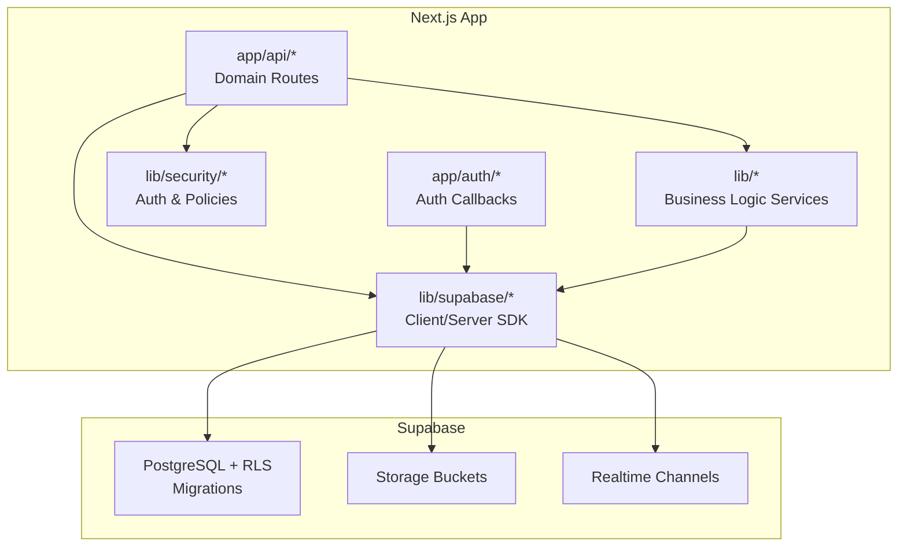
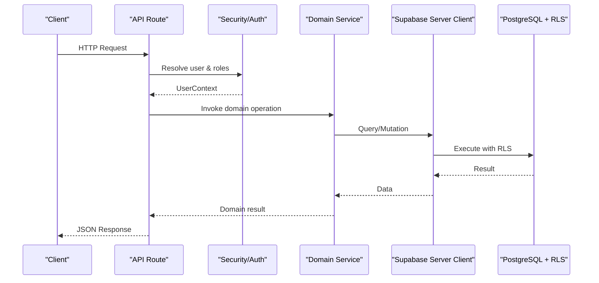
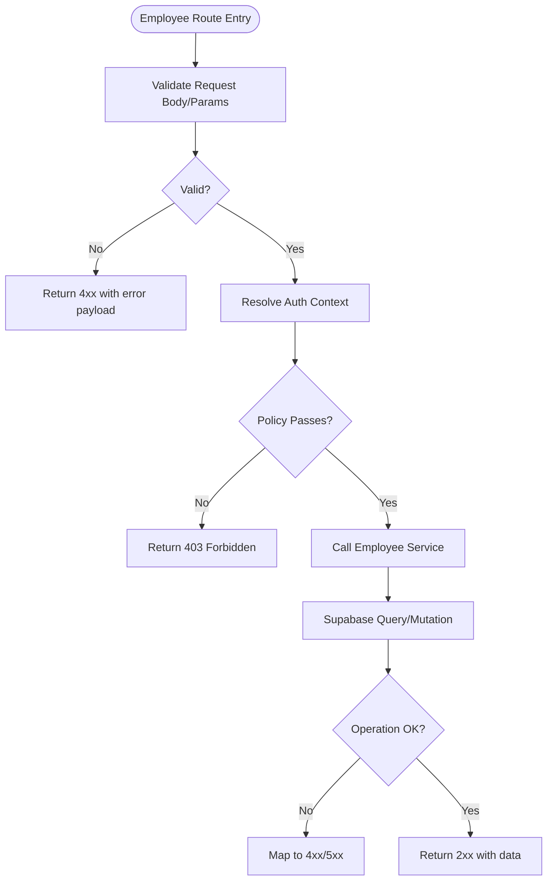
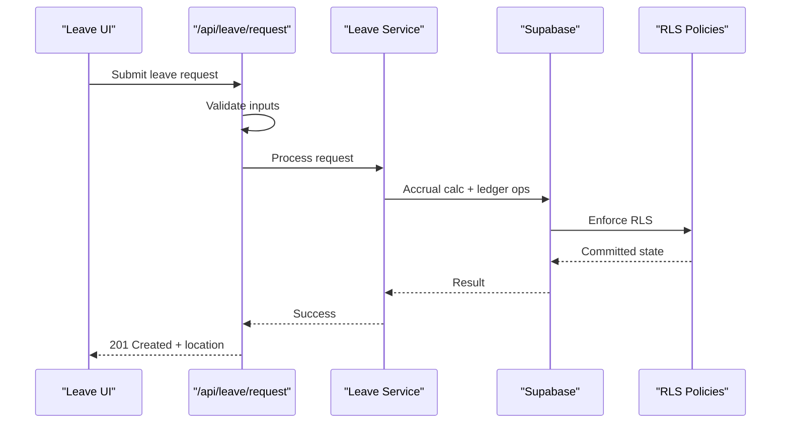
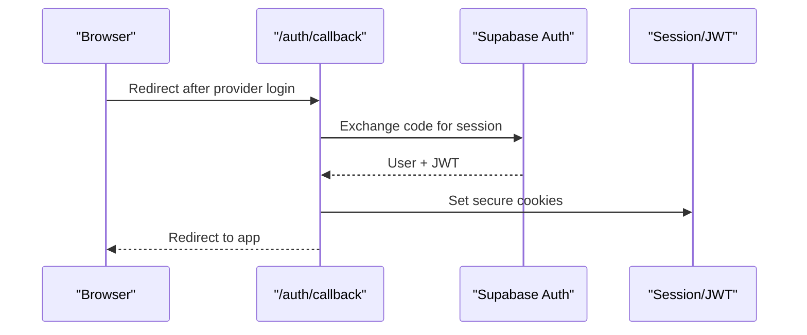
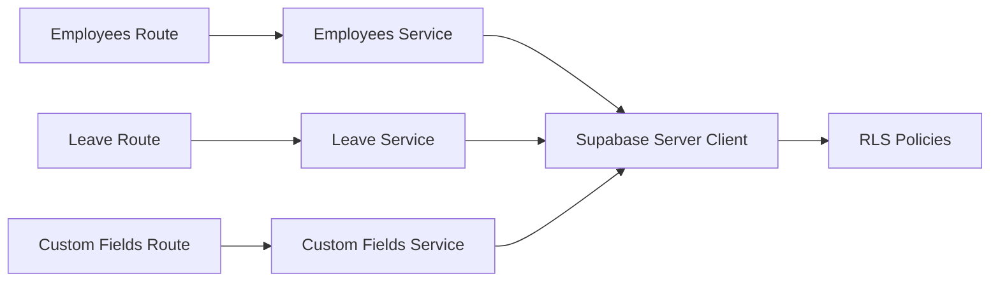

# Backend Architecture

<cite>
**Referenced Files in This Document**
- [apps/hr-suite/app/api/employees/route.ts](file://apps/hr-suite/app/api/employees/route.ts)
- [apps/hr-suite/app/api/employees/[employeeId]/route.ts](file://apps/hr-suite/app/api/employees/[employeeId]/route.ts)
- [apps/hr-suite/app/api/leave/request/route.ts](file://apps/hr-suite/app/api/leave/request/route.ts)
- [apps/hr-suite/app/api/leave/balance-report/route.ts](file://apps/hr-suite/app/api/leave/balance-report/route.ts)
- [apps/hr-suite/app/api/custom-fields/route.ts](file://apps/hr-suite/app/api/custom-fields/route.ts)
- [apps/hr-suite/app/api/context/route.ts](file://apps/hr-suite/app/api/context/route.ts)
- [apps/hr-suite/app/auth/callback/route.ts](file://apps/hr-suite/app/auth/callback/route.ts)
- [apps/hr-suite/app/auth/signout/route.ts](file://apps/hr-suite/app/auth/signout/route.ts)
- [apps/hr-suite/lib/supabase/client.ts](file://apps/hr-suite/lib/supabase/client.ts)
- [apps/hr-suite/lib/supabase/server.ts](file://apps/hr-suite/lib/supabase/server.ts)
- [apps/hr-suite/lib/security/auth.ts](file://apps/hr-suite/lib/security/auth.ts)
- [apps/hr-suite/lib/security/policies.ts](file://apps/hr-suite/lib/security/policies.ts)
- [apps/hr-suite/lib/employees/service.ts](file://apps/hr-suite/lib/employees/service.ts)
- [apps/hr-suite/lib/leave/service.ts](file://apps/hr-suite/lib/leave/service.ts)
- [apps/hr-suite/lib/custom-fields/service.ts](file://apps/hr-suite/lib/custom-fields/service.ts)
- [apps/hr-suite/supabase/migrations/20260712124911_add_tenant_rbac_and_organization.sql](file://apps/hr-suite/supabase/migrations/20260712124911_add_tenant_rbac_and_organization.sql)
- [apps/hr-suite/supabase/migrations/20260715120810_complete_employee_core.sql](file://apps/hr-suite/supabase/migrations/20260715120810_complete_employee_core.sql)
- [apps/hr-suite/supabase/migrations/20260722142551_add_leave_engine_foundation.sql](file://apps/hr-suite/supabase/migrations/20260722142551_add_leave_engine_foundation.sql)
- [apps/hr-suite/supabase/config.toml](file://apps/hr-suite/supabase/config.toml)
- [apps/hr-suite/next.config.ts](file://apps/hr-suite/next.config.ts)
- [apps/hr-suite/package.json](file://apps/hr-suite/package.json)
</cite>

## Table of Contents
1. [Introduction](#introduction)
2. [Project Structure](#project-structure)
3. [Core Components](#core-components)
4. [Architecture Overview](#architecture-overview)
5. [Detailed Component Analysis](#detailed-component-analysis)
6. [Dependency Analysis](#dependency-analysis)
7. [Performance Considerations](#performance-considerations)
8. [Troubleshooting Guide](#troubleshooting-guide)
9. [Conclusion](#conclusion)
10. [Appendices](#appendices)

## Introduction
This document explains LiquidHR’s backend architecture with a focus on the Next.js API layer and business logic separation. It covers domain-driven API organization, RESTful endpoint patterns, request/response handling, error management, Supabase integration (database, real-time, storage), security (Row Level Security, JWT, input validation, rate limiting), middleware usage, and testing strategies for backend components. The goal is to make the system understandable for both technical and non-technical readers while providing actionable guidance for implementation and maintenance.

## Project Structure
LiquidHR uses a Next.js App Router structure under apps/hr-suite. Domain-scoped API routes live under app/api/<domain>/... with corresponding service implementations under lib/<domain>. Supabase configuration and migrations are maintained under supabase/. Shared utilities for authentication, authorization, and client/server Supabase instances reside under lib/supabase and lib/security.

**Diagram sources**
- [apps/hr-suite/app/api/employees/route.ts](file://apps/hr-suite/app/api/employees/route.ts)
- [apps/hr-suite/lib/employees/service.ts](file://apps/hr-suite/lib/employees/service.ts)
- [apps/hr-suite/lib/supabase/server.ts](file://apps/hr-suite/lib/supabase/server.ts)
- [apps/hr-suite/supabase/migrations/20260712124911_add_tenant_rbac_and_organization.sql](file://apps/hr-suite/supabase/migrations/20260712124911_add_tenant_rbac_and_organization.sql)

**Section sources**
- [apps/hr-suite/next.config.ts](file://apps/hr-suite/next.config.ts)
- [apps/hr-suite/package.json](file://apps/hr-suite/package.json)

## Core Components
- API Routes: Domain-based endpoints following REST conventions. Each route validates inputs, enforces authN/authZ, delegates to services, and returns standardized responses.
- Business Logic Services: Encapsulate domain operations (e.g., employees, leave, custom fields). They coordinate data access via Supabase clients and enforce business rules.
- Security Layer: Centralized authentication context, role/permission checks, and policy enforcement.
- Supabase Integration: Server-side client for secure DB calls, storage operations, and real-time subscriptions.
- Migrations and RLS: SQL migrations define schema and Row Level Security policies to isolate tenant data and restrict access by roles.

Key responsibilities:
- Request parsing and validation at the route boundary.
- Authorization decisions using roles, scopes, and tenant context.
- Service orchestration for multi-step transactions.
- Consistent error shapes and status codes.
- Supabase queries, mutations, and real-time events.

**Section sources**
- [apps/hr-suite/app/api/employees/route.ts](file://apps/hr-suite/app/api/employees/route.ts)
- [apps/hr-suite/lib/employees/service.ts](file://apps/hr-suite/lib/employees/service.ts)
- [apps/hr-suite/lib/security/auth.ts](file://apps/hr-suite/lib/security/auth.ts)
- [apps/hr-suite/lib/supabase/server.ts](file://apps/hr-suite/lib/supabase/server.ts)

## Architecture Overview
The API layer follows a layered approach:
- Route handlers parse requests, validate payloads, and extract user context.
- Services implement domain logic and call Supabase server client for persistence.
- Security utilities provide authenticated user context and authorization helpers.
- Supabase enforces RLS policies at the database level for fine-grained access control.

**Diagram sources**
- [apps/hr-suite/app/api/employees/route.ts](file://apps/hr-suite/app/api/employees/route.ts)
- [apps/hr-suite/lib/employees/service.ts](file://apps/hr-suite/lib/employees/service.ts)
- [apps/hr-suite/lib/supabase/server.ts](file://apps/hr-suite/lib/supabase/server.ts)
- [apps/hr-suite/supabase/migrations/20260712124911_add_tenant_rbac_and_organization.sql](file://apps/hr-suite/supabase/migrations/20260712124911_add_tenant_rbac_and_organization.sql)

## Detailed Component Analysis

### Employees API
REST endpoints for employee CRUD and related resources. Typical patterns:
- GET /api/employees: list with filters and pagination
- POST /api/employees: create with validation
- GET /api/employees/:employeeId: read single
- PATCH /api/employees/:employeeId: update partial fields
- DELETE /api/employees/:employeeId: archive or remove

Request/response handling:
- Input validation ensures required fields and types.
- Error responses use consistent shape with status codes.
- Responses include metadata like pagination when applicable.

Authorization:
- Enforce tenant isolation and role-based permissions.
- Restrict sensitive fields based on user roles.

**Diagram sources**
- [apps/hr-suite/app/api/employees/route.ts](file://apps/hr-suite/app/api/employees/route.ts)
- [apps/hr-suite/lib/employees/service.ts](file://apps/hr-suite/lib/employees/service.ts)
- [apps/hr-suite/lib/security/policies.ts](file://apps/hr-suite/lib/security/policies.ts)

**Section sources**
- [apps/hr-suite/app/api/employees/route.ts](file://apps/hr-suite/app/api/employees/route.ts)
- [apps/hr-suite/app/api/employees/[employeeId]/route.ts](file://apps/hr-suite/app/api/employees/[employeeId]/route.ts)
- [apps/hr-suite/lib/employees/service.ts](file://apps/hr-suite/lib/employees/service.ts)

### Leave Engine API
Endpoints for leave requests, approvals, and reporting:
- POST /api/leave/request: submit leave request
- GET /api/leave/balance-report: compute balances and reports

Processing flow:
- Validate dates, entitlements, and policy constraints.
- Compute accruals and ledger entries via service.
- Persist changes atomically through Supabase RPC or transactional queries.
- Emit real-time updates for live dashboards.

**Diagram sources**
- [apps/hr-suite/app/api/leave/request/route.ts](file://apps/hr-suite/app/api/leave/request/route.ts)
- [apps/hr-suite/lib/leave/service.ts](file://apps/hr-suite/lib/leave/service.ts)
- [apps/hr-suite/supabase/migrations/20260722142551_add_leave_engine_foundation.sql](file://apps/hr-suite/supabase/migrations/20260722142551_add_leave_engine_foundation.sql)

**Section sources**
- [apps/hr-suite/app/api/leave/request/route.ts](file://apps/hr-suite/app/api/leave/request/route.ts)
- [apps/hr-suite/app/api/leave/balance-report/route.ts](file://apps/hr-suite/app/api/leave/balance-report/route.ts)
- [apps/hr-suite/lib/leave/service.ts](file://apps/hr-suite/lib/leave/service.ts)

### Custom Fields API
Flexible schema extension for entities:
- GET/POST /api/custom-fields: manage definitions
- GET/PUT /api/custom-fields/:definitionId: update definition

Behavior:
- Validate field types and constraints.
- Store values securely per tenant.
- Expose typed schemas to clients.

**Section sources**
- [apps/hr-suite/app/api/custom-fields/route.ts](file://apps/hr-suite/app/api/custom-fields/route.ts)
- [apps/hr-suite/lib/custom-fields/service.ts](file://apps/hr-suite/lib/custom-fields/service.ts)

### Context API
Provides runtime tenant and module context:
- GET /api/context: returns available modules, settings, and feature flags

Use cases:
- Frontend feature toggles
- Dynamic navigation and permission gating

**Section sources**
- [apps/hr-suite/app/api/context/route.ts](file://apps/hr-suite/app/api/context/route.ts)

### Authentication and Session Management
- Callback and signout routes handle OAuth flows and session lifecycle.
- JWT tokens are issued and validated; sessions are managed server-side.
- Secure cookies and CSRF considerations apply where relevant.

**Diagram sources**
- [apps/hr-suite/app/auth/callback/route.ts](file://apps/hr-suite/app/auth/callback/route.ts)
- [apps/hr-suite/app/auth/signout/route.ts](file://apps/hr-suite/app/auth/signout/route.ts)

**Section sources**
- [apps/hr-suite/app/auth/callback/route.ts](file://apps/hr-suite/app/auth/callback/route.ts)
- [apps/hr-suite/app/auth/signout/route.ts](file://apps/hr-suite/app/auth/signout/route.ts)
- [apps/hr-suite/lib/security/auth.ts](file://apps/hr-suite/lib/security/auth.ts)

## Dependency Analysis
API routes depend on:
- Security utilities for user context and authorization
- Domain services for business logic
- Supabase server client for data access
- Migrations define schema and RLS policies

**Diagram sources**
- [apps/hr-suite/app/api/employees/route.ts](file://apps/hr-suite/app/api/employees/route.ts)
- [apps/hr-suite/app/api/leave/request/route.ts](file://apps/hr-suite/app/api/leave/request/route.ts)
- [apps/hr-suite/app/api/custom-fields/route.ts](file://apps/hr-suite/app/api/custom-fields/route.ts)
- [apps/hr-suite/lib/supabase/server.ts](file://apps/hr-suite/lib/supabase/server.ts)
- [apps/hr-suite/supabase/migrations/20260712124911_add_tenant_rbac_and_organization.sql](file://apps/hr-suite/supabase/migrations/20260712124911_add_tenant_rbac_and_organization.sql)

**Section sources**
- [apps/hr-suite/lib/supabase/server.ts](file://apps/hr-suite/lib/supabase/server.ts)
- [apps/hr-suite/supabase/migrations/20260712124911_add_tenant_rbac_and_organization.sql](file://apps/hr-suite/supabase/migrations/20260712124911_add_tenant_rbac_and_organization.sql)

## Performance Considerations
- Use server-side Supabase client for efficient queries and connection pooling.
- Apply pagination and selective field projection in list endpoints.
- Cache static context and configuration where appropriate.
- Leverage Supabase real-time channels for live updates without polling.
- Index frequently queried columns defined in migrations.
- Avoid heavy computations in request paths; offload to background jobs if needed.

[No sources needed since this section provides general guidance]

## Troubleshooting Guide
Common issues and resolutions:
- 401 Unauthorized: Ensure valid JWT/session; verify callback and cookie settings.
- 403 Forbidden: Check role/permission policies and tenant scoping.
- 422 Unprocessable Entity: Validate request payloads against expected schemas.
- 500 Internal Server Error: Inspect Supabase errors and logs; ensure RLS policies allow intended operations.
- Realtime not updating: Confirm channel subscription and event publishing.

Debugging steps:
- Log request IDs and user context at route entry.
- Wrap service calls in try/catch and map errors to standard shapes.
- Use Supabase test suites to validate RLS and migrations.

**Section sources**
- [apps/hr-suite/lib/security/auth.ts](file://apps/hr-suite/lib/security/auth.ts)
- [apps/hr-suite/lib/security/policies.ts](file://apps/hr-suite/lib/security/policies.ts)

## Conclusion
LiquidHR’s backend combines a clean Next.js API layer with robust domain services and strong security enforced by Supabase RLS. The design promotes maintainability, scalability, and safety across tenants and roles. Following the patterns outlined here will help extend features consistently and keep the system secure and performant.

[No sources needed since this section summarizes without analyzing specific files]

## Appendices

### Supabase Integration Notes
- Database: PostgreSQL with migrations defining schema and indexes.
- Storage: Buckets configured for file uploads and access control.
- Realtime: Channels for live updates on key entities.

**Section sources**
- [apps/hr-suite/supabase/config.toml](file://apps/hr-suite/supabase/config.toml)
- [apps/hr-suite/supabase/migrations/20260715120810_complete_employee_core.sql](file://apps/hr-suite/supabase/migrations/20260715120810_complete_employee_core.sql)
- [apps/hr-suite/supabase/migrations/20260722142551_add_leave_engine_foundation.sql](file://apps/hr-suite/supabase/migrations/20260722142551_add_leave_engine_foundation.sql)

### Testing Strategies
- Unit tests for services and utilities.
- Integration tests for API routes mocking Supabase client.
- Acceptance tests for critical flows (auth, leave booking, employee CRUD).
- Database tests validating RLS policies and migrations.

[No sources needed since this section provides general guidance]