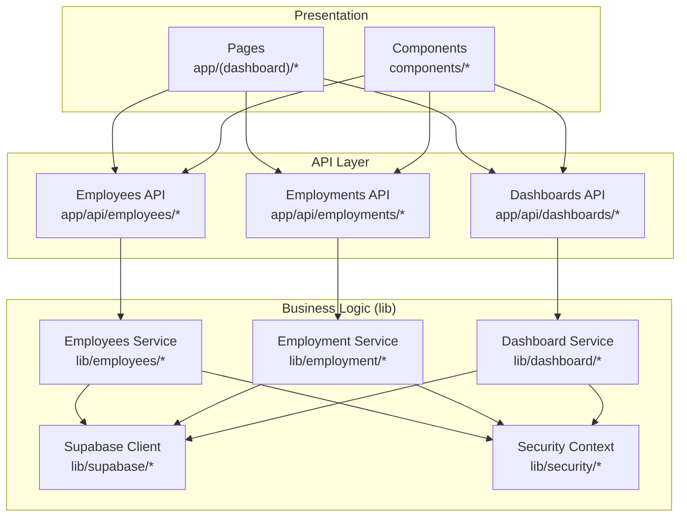
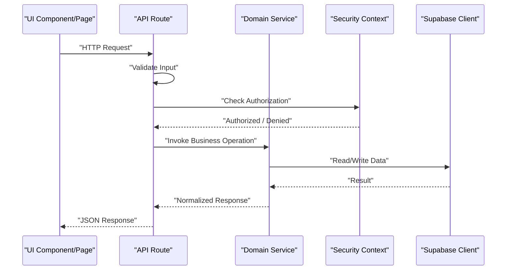
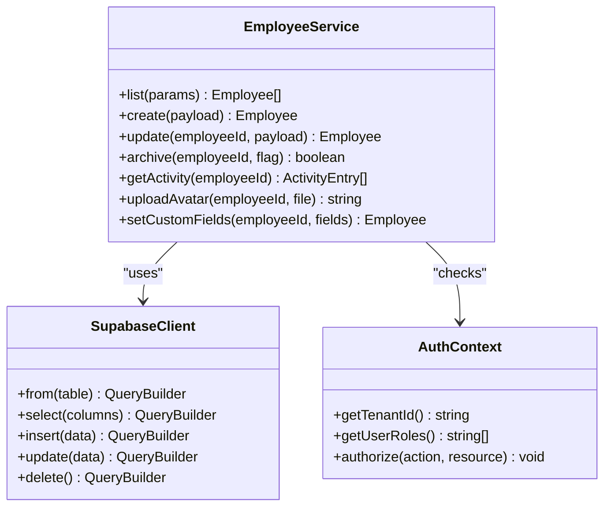
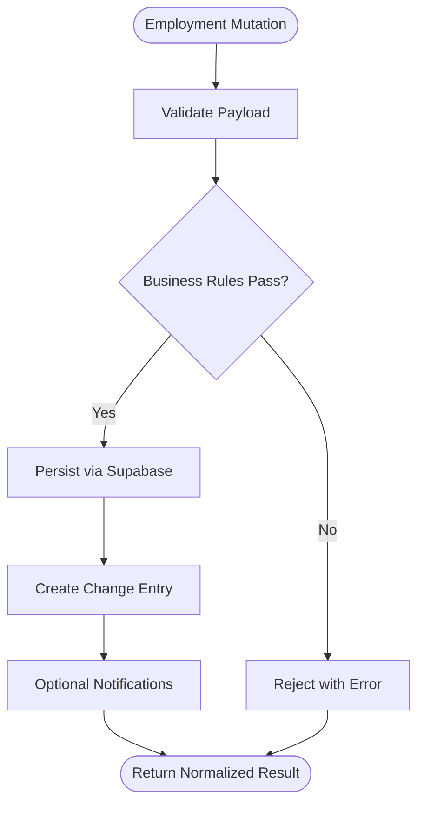
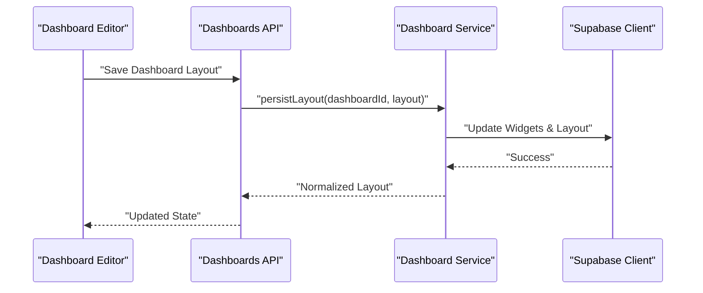
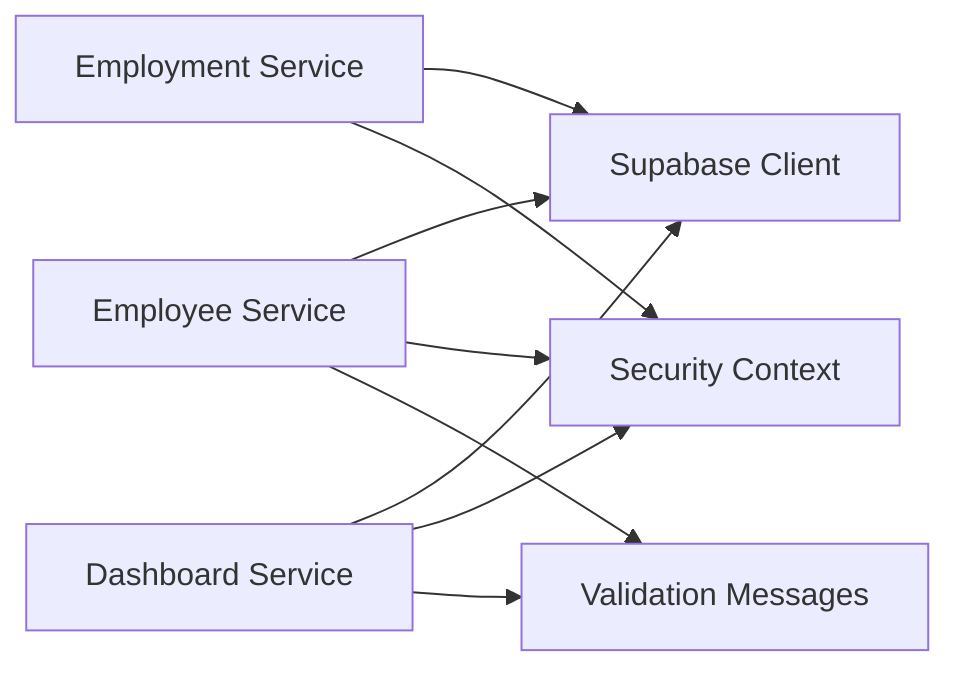

# Business Logic Layer

<cite>
**Referenced Files in This Document**
- [apps/hr-suite/app/api/employees/route.ts](file://apps/hr-suite/app/api/employees/route.ts)
- [apps/hr-suite/app/api/employees/[employeeId]/route.ts](file://apps/hr-suite/app/api/employees/[employeeId]/route.ts)
- [apps/hr-suite/app/api/employments/[employmentId]/route.ts](file://apps/hr-suite/app/api/employments/[employmentId]/route.ts)
- [apps/hr-suite/app/api/dashboards/route.ts](file://apps/hr-suite/app/api/dashboards/route.ts)
- [apps/hr-suite/app/api/dashboards/[dashboardId]/route.ts](file://apps/hr-suite/app/api/dashboards/[dashboardId]/route.ts)
- [apps/hr-suite/lib/employees/index.ts](file://apps/hr-suite/lib/employees/index.ts)
- [apps/hr-suite/lib/employment/index.ts](file://apps/hr-suite/lib/employment/index.ts)
- [apps/hr-suite/lib/dashboard/index.ts](file://apps/hr-suite/lib/dashboard/index.ts)
- [apps/hr-suite/lib/supabase/client.ts](file://apps/hr-suite/lib/supabase/client.ts)
- [apps/hr-suite/lib/security/auth-context.ts](file://apps/hr-suite/lib/security/auth-context.ts)
- [apps/hr-suite/components/dashboard/dashboard-workspace-model.ts](file://apps/hr-suite/components/dashboard/dashboard-workspace-model.ts)
- [apps/hr-suite/components/employees/types.ts](file://apps/hr-suite/components/employees/types.ts)
- [apps/hr-suite/messages/en/validation.json](file://apps/hr-suite/messages/en/validation.json)
</cite>

## Table of Contents
1. [Introduction](#introduction)
2. [Project Structure](#project-structure)
3. [Core Components](#core-components)
4. [Architecture Overview](#architecture-overview)
5. [Detailed Component Analysis](#detailed-component-analysis)
6. [Dependency Analysis](#dependency-analysis)
7. [Performance Considerations](#performance-considerations)
8. [Troubleshooting Guide](#troubleshooting-guide)
9. [Conclusion](#conclusion)

## Introduction
This document explains LiquidHR’s business logic layer architecture with a focus on the service pattern implemented under the lib directory. It covers domain-specific modules for employees, employment, dashboards, and related features, detailing how data transformation, validation, and business rule enforcement are organized. It also clarifies the separation between presentation logic (components and pages) and business rules (services), outlines state management patterns, and describes data flow across API routes, services, and persistence layers. Examples include service implementations, dependency injection patterns, and testing strategies for business logic components.

## Project Structure
The application follows a Next.js App Router structure where:
- Presentation lives in app/(dashboard) pages and components.
- API routes in app/api handle HTTP requests and orchestrate business operations.
- Business logic is encapsulated in lib modules by domain (employees, employment, dashboard, etc.).
- Cross-cutting concerns like Supabase client access and security context live in shared lib folders.

**Diagram sources**
- [apps/hr-suite/app/api/employees/route.ts](file://apps/hr-suite/app/api/employees/route.ts)
- [apps/hr-suite/app/api/employments/[employmentId]/route.ts](file://apps/hr-suite/app/api/employments/[employmentId]/route.ts)
- [apps/hr-suite/app/api/dashboards/route.ts](file://apps/hr-suite/app/api/dashboards/route.ts)
- [apps/hr-suite/lib/employees/index.ts](file://apps/hr-suite/lib/employees/index.ts)
- [apps/hr-suite/lib/employment/index.ts](file://apps/hr-suite/lib/employment/index.ts)
- [apps/hr-suite/lib/dashboard/index.ts](file://apps/hr-suite/lib/dashboard/index.ts)
- [apps/hr-suite/lib/supabase/client.ts](file://apps/hr-suite/lib/supabase/client.ts)
- [apps/hr-suite/lib/security/auth-context.ts](file://apps/hr-suite/lib/security/auth-context.ts)

**Section sources**
- [apps/hr-suite/app/api/employees/route.ts](file://apps/hr-suite/app/api/employees/route.ts)
- [apps/hr-suite/app/api/employments/[employmentId]/route.ts](file://apps/hr-suite/app/api/employments/[employmentId]/route.ts)
- [apps/hr-suite/app/api/dashboards/route.ts](file://apps/hr-suite/app/api/dashboards/route.ts)

## Core Components
The business logic layer is organized as domain-scoped services that expose functions for CRUD, transformations, validations, and business rules. Each service typically:
- Accepts typed inputs and returns normalized outputs.
- Enforces authorization using a security context.
- Uses a Supabase client to interact with the database.
- Centralizes error handling and consistent response shapes.

Key domains:
- Employees: employee lifecycle, relationships, custom fields, documents, activity.
- Employment: contract lifecycle, changes, terminations, timelines, work patterns.
- Dashboards: personal dashboards, widgets, layout configuration, widget rendering data.
- Shared utilities: validation helpers, data transformers, i18n message resolution.

Examples of service entry points:
- Employee service index: [apps/hr-suite/lib/employees/index.ts](file://apps/hr-suite/lib/employees/index.ts)
- Employment service index: [apps/hr-suite/lib/employment/index.ts](file://apps/hr-suite/lib/employment/index.ts)
- Dashboard service index: [apps/hr-suite/lib/dashboard/index.ts](file://apps/hr-suite/lib/dashboard/index.ts)

Cross-cutting dependencies:
- Supabase client: [apps/hr-suite/lib/supabase/client.ts](file://apps/hr-suite/lib/supabase/client.ts)
- Security context: [apps/hr-suite/lib/security/auth-context.ts](file://apps/hr-suite/lib/security/auth-context.ts)

**Section sources**
- [apps/hr-suite/lib/employees/index.ts](file://apps/hr-suite/lib/employees/index.ts)
- [apps/hr-suite/lib/employment/index.ts](file://apps/hr-suite/lib/employment/index.ts)
- [apps/hr-suite/lib/dashboard/index.ts](file://apps/hr-suite/lib/dashboard/index.ts)
- [apps/hr-suite/lib/supabase/client.ts](file://apps/hr-suite/lib/supabase/client.ts)
- [apps/hr-suite/lib/security/auth-context.ts](file://apps/hr-suite/lib/security/auth-context.ts)

## Architecture Overview
LiquidHR uses a layered architecture:
- Presentation layer (pages and components) handles UI state and user interactions.
- API routes act as thin orchestrators: validate input, call services, and return responses.
- Services encapsulate business logic, enforce rules, transform data, and coordinate persistence via Supabase.
- Security context provides tenant and role-based authorization checks.

**Diagram sources**
- [apps/hr-suite/app/api/employees/route.ts](file://apps/hr-suite/app/api/employees/route.ts)
- [apps/hr-suite/lib/employees/index.ts](file://apps/hr-suite/lib/employees/index.ts)
- [apps/hr-suite/lib/security/auth-context.ts](file://apps/hr-suite/lib/security/auth-context.ts)
- [apps/hr-suite/lib/supabase/client.ts](file://apps/hr-suite/lib/supabase/client.ts)

## Detailed Component Analysis

### Employees Service
Responsibilities:
- Employee CRUD operations, archive toggles, avatar management, BSN reveal, custom fields, documents, relations, salary, activity feed.
- Validation and normalization of employee payloads.
- Enforcement of multi-tenant isolation and RBAC policies.

Typical usage from API routes:
- List/create/update/delete employees via endpoints under app/api/employees.
- Subresource endpoints under [employeeId] delegate to employee service methods.

Example service entry point:
- [apps/hr-suite/lib/employees/index.ts](file://apps/hr-suite/lib/employees/index.ts)

Data models used by UI:
- [apps/hr-suite/components/employees/types.ts](file://apps/hr-suite/components/employees/types.ts)

Validation messages:
- [apps/hr-suite/messages/en/validation.json](file://apps/hr-suite/messages/en/validation.json)

**Diagram sources**
- [apps/hr-suite/lib/employees/index.ts](file://apps/hr-suite/lib/employees/index.ts)
- [apps/hr-suite/lib/supabase/client.ts](file://apps/hr-suite/lib/supabase/client.ts)
- [apps/hr-suite/lib/security/auth-context.ts](file://apps/hr-suite/lib/security/auth-context.ts)

**Section sources**
- [apps/hr-suite/app/api/employees/route.ts](file://apps/hr-suite/app/api/employees/route.ts)
- [apps/hr-suite/app/api/employees/[employeeId]/route.ts](file://apps/hr-suite/app/api/employees/[employeeId]/route.ts)
- [apps/hr-suite/lib/employees/index.ts](file://apps/hr-suite/lib/employees/index.ts)
- [apps/hr-suite/components/employees/types.ts](file://apps/hr-suite/components/employees/types.ts)
- [apps/hr-suite/messages/en/validation.json](file://apps/hr-suite/messages/en/validation.json)

### Employment Service
Responsibilities:
- Employment lifecycle: creation, updates, termination, change sets, timelines, work patterns.
- Business rules for valid transitions and auditability.
- Integration with master data (jobs, salary scales) and organization assignments.

API integration:
- Endpoints under app/api/employments/[employmentId] orchestrate calls to employment service methods.

Example service entry point:
- [apps/hr-suite/lib/employment/index.ts](file://apps/hr-suite/lib/employment/index.ts)

**Diagram sources**
- [apps/hr-suite/app/api/employments/[employmentId]/route.ts](file://apps/hr-suite/app/api/employments/[employmentId]/route.ts)
- [apps/hr-suite/lib/employment/index.ts](file://apps/hr-suite/lib/employment/index.ts)
- [apps/hr-suite/lib/supabase/client.ts](file://apps/hr-suite/lib/supabase/client.ts)

**Section sources**
- [apps/hr-suite/app/api/employments/[employmentId]/route.ts](file://apps/hr-suite/app/api/employments/[employmentId]/route.ts)
- [apps/hr-suite/lib/employment/index.ts](file://apps/hr-suite/lib/employment/index.ts)

### Dashboard Service
Responsibilities:
- Personal dashboard configuration: create, update, delete dashboards and widgets.
- Widget catalog integration and rendering data preparation.
- Workspace state modeling for UI-driven editing.

API integration:
- Endpoints under app/api/dashboards and app/api/dashboards/[dashboardId] delegate to dashboard service.

Example service entry point:
- [apps/hr-suite/lib/dashboard/index.ts](file://apps/hr-suite/lib/dashboard/index.ts)

UI workspace model:
- [apps/hr-suite/components/dashboard/dashboard-workspace-model.ts](file://apps/hr-suite/components/dashboard/dashboard-workspace-model.ts)

**Diagram sources**
- [apps/hr-suite/app/api/dashboards/route.ts](file://apps/hr-suite/app/api/dashboards/route.ts)
- [apps/hr-suite/app/api/dashboards/[dashboardId]/route.ts](file://apps/hr-suite/app/api/dashboards/[dashboardId]/route.ts)
- [apps/hr-suite/lib/dashboard/index.ts](file://apps/hr-suite/lib/dashboard/index.ts)
- [apps/hr-suite/lib/supabase/client.ts](file://apps/hr-suite/lib/supabase/client.ts)
- [apps/hr-suite/components/dashboard/dashboard-workspace-model.ts](file://apps/hr-suite/components/dashboard/dashboard-workspace-model.ts)

**Section sources**
- [apps/hr-suite/app/api/dashboards/route.ts](file://apps/hr-suite/app/api/dashboards/route.ts)
- [apps/hr-suite/app/api/dashboards/[dashboardId]/route.ts](file://apps/hr-suite/app/api/dashboards/[dashboardId]/route.ts)
- [apps/hr-suite/lib/dashboard/index.ts](file://apps/hr-suite/lib/dashboard/index.ts)
- [apps/hr-suite/components/dashboard/dashboard-workspace-model.ts](file://apps/hr-suite/components/dashboard/dashboard-workspace-model.ts)

### Utility Functions and Helpers
Common responsibilities:
- Data transformation: normalize payloads, map DB rows to domain objects.
- Validation: schema checks, cross-field constraints, i18n message resolution.
- Business rule enforcement: state transitions, policy checks, audit logging.

Where to find them:
- Domain-specific helpers within each lib module (e.g., lib/employees, lib/employment, lib/dashboard).
- Shared utilities may be located in lib/shared or similar directories.

Testing strategies:
- Unit tests for pure functions (transformers, validators).
- Integration tests for service methods against a test Supabase instance.
- Mocking auth context to simulate roles and tenants.

[No sources needed since this section provides general guidance]

## Dependency Analysis
Services depend on:
- Supabase client for persistence.
- Security context for authorization.
- i18n messages for localized errors and labels.

**Diagram sources**
- [apps/hr-suite/lib/employees/index.ts](file://apps/hr-suite/lib/employees/index.ts)
- [apps/hr-suite/lib/employment/index.ts](file://apps/hr-suite/lib/employment/index.ts)
- [apps/hr-suite/lib/dashboard/index.ts](file://apps/hr-suite/lib/dashboard/index.ts)
- [apps/hr-suite/lib/supabase/client.ts](file://apps/hr-suite/lib/supabase/client.ts)
- [apps/hr-suite/lib/security/auth-context.ts](file://apps/hr-suite/lib/security/auth-context.ts)
- [apps/hr-suite/messages/en/validation.json](file://apps/hr-suite/messages/en/validation.json)

**Section sources**
- [apps/hr-suite/lib/employees/index.ts](file://apps/hr-suite/lib/employees/index.ts)
- [apps/hr-suite/lib/employment/index.ts](file://apps/hr-suite/lib/employment/index.ts)
- [apps/hr-suite/lib/dashboard/index.ts](file://apps/hr-suite/lib/dashboard/index.ts)
- [apps/hr-suite/lib/supabase/client.ts](file://apps/hr-suite/lib/supabase/client.ts)
- [apps/hr-suite/lib/security/auth-context.ts](file://apps/hr-suite/lib/security/auth-context.ts)
- [apps/hr-suite/messages/en/validation.json](file://apps/hr-suite/messages/en/validation.json)

## Performance Considerations
- Prefer batched queries and selective column projection in Supabase calls to reduce payload size.
- Cache read-heavy data at the service layer when appropriate (e.g., catalogs, settings).
- Avoid unnecessary transformations; keep payloads close to DB shape until final output.
- Use pagination and cursor-based fetching for large lists (employees, employments).
- Defer heavy computations to background tasks or serverless functions if needed.

[No sources needed since this section provides general guidance]

## Troubleshooting Guide
Common issues and resolutions:
- Authorization failures: verify tenant ID and user roles in the security context.
- Validation errors: check input schemas and i18n messages for precise feedback.
- Persistence errors: inspect Supabase query logs and RLS policies.
- State mismatches: ensure UI state aligns with service responses; reconcile on optimistic updates.

Debugging tips:
- Log request IDs and operation names in API routes.
- Add structured logs around service method boundaries.
- Use test fixtures for edge cases and boundary conditions.

[No sources needed since this section provides general guidance]

## Conclusion
LiquidHR’s business logic layer adopts a clear service pattern per domain, isolating business rules from presentation and persistence. API routes orchestrate requests while services enforce validation, authorization, and data transformations. The architecture supports scalability through modular services, consistent error handling, and robust testing strategies. By maintaining strict separation of concerns and leveraging shared utilities, the system remains maintainable and extensible across HR features such as employees, employment, and dashboards.

[No sources needed since this section summarizes without analyzing specific files]