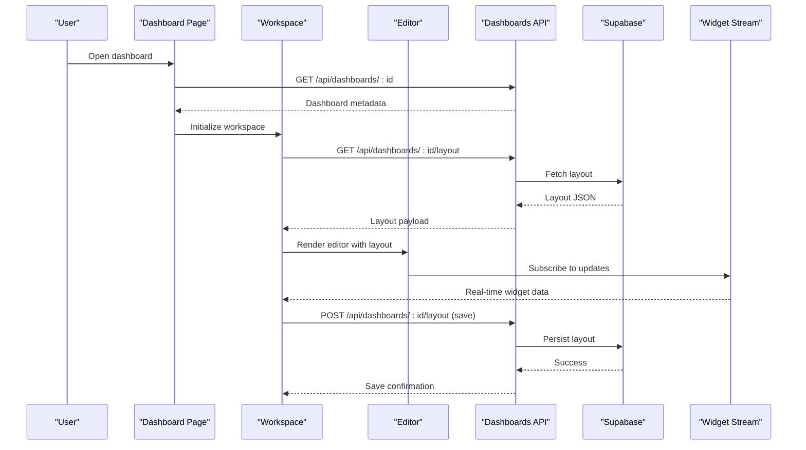
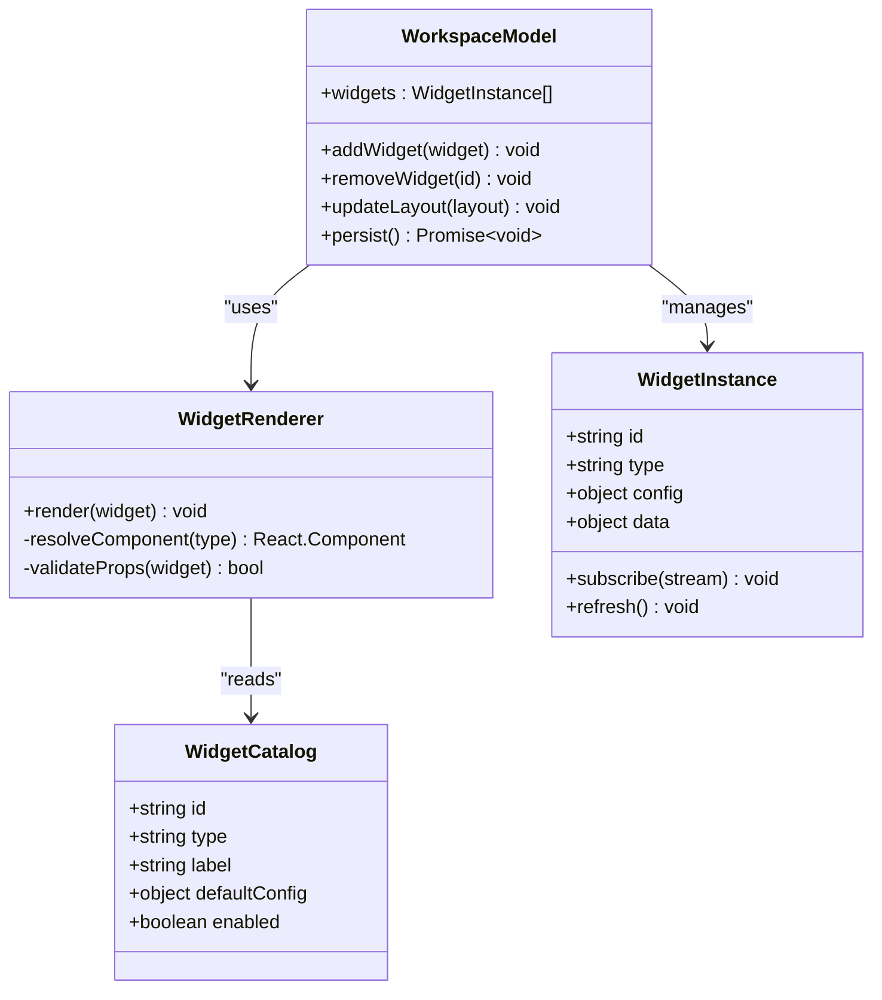
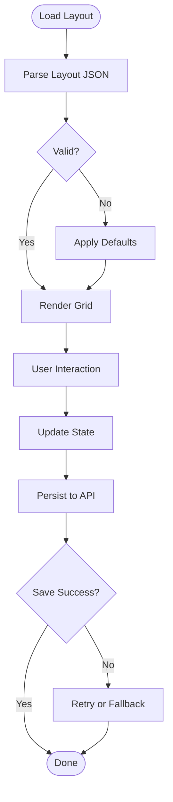
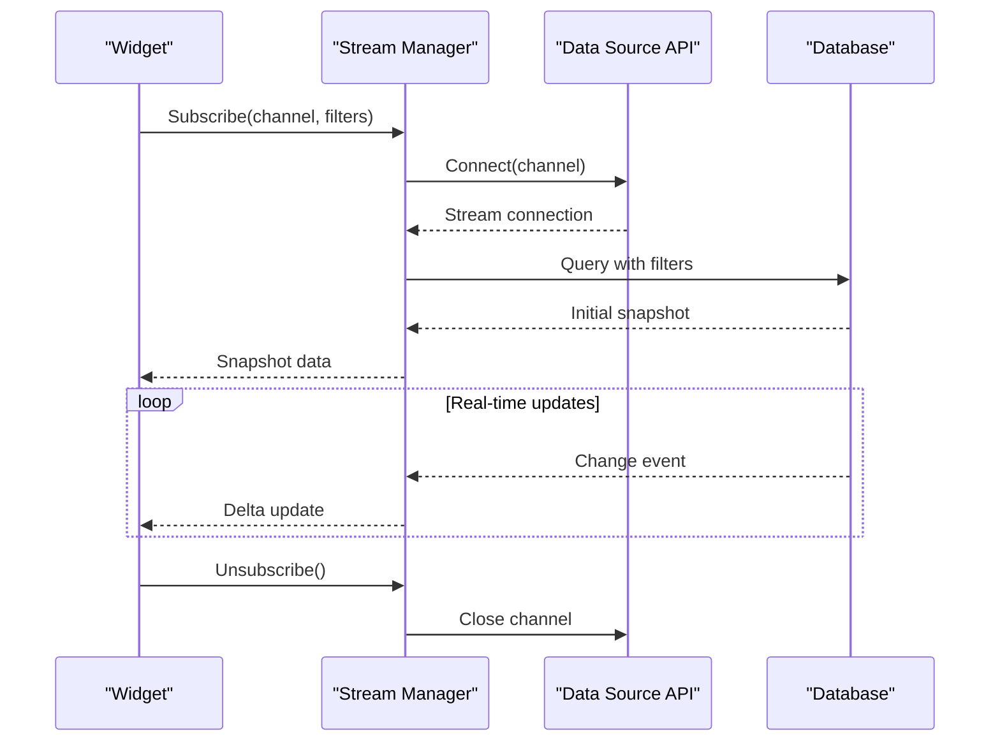
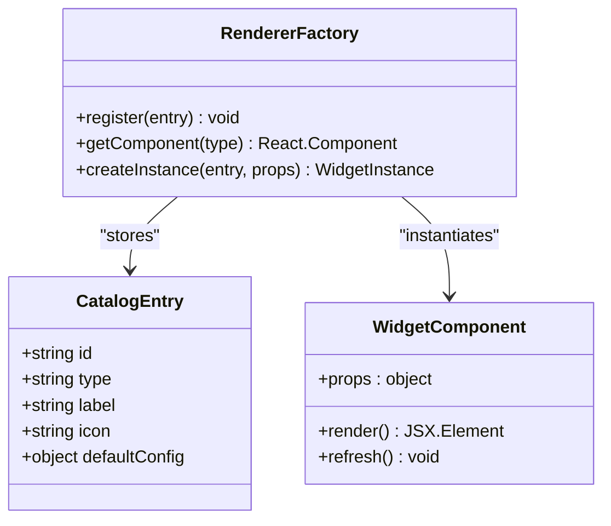
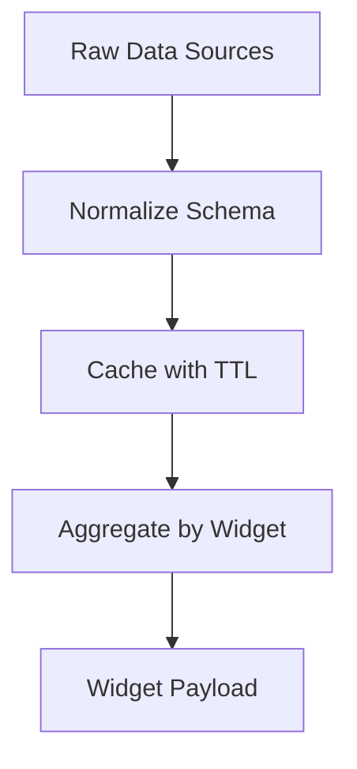
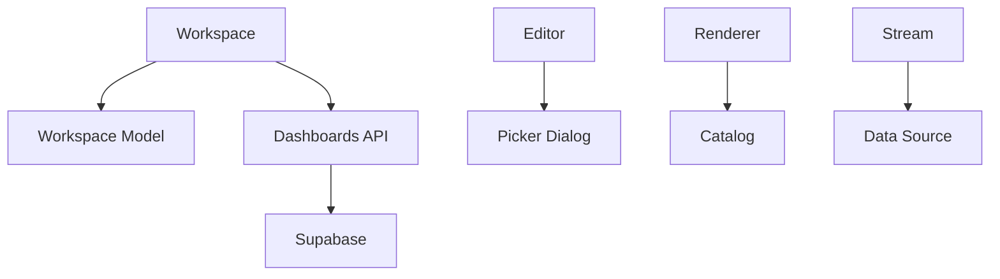

# Dashboard Business Logic

<cite>
**Referenced Files in This Document**
- [page.tsx](file://apps/hr-suite/app/(dashboard)/dashboard/page.tsx)
- [loading.tsx](file://apps/hr-suite/app/(dashboard)/dashboard/loading.tsx)
- [dashboard-editor.tsx](file://apps/hr-suite/components/dashboard/dashboard-editor.tsx)
- [dashboard-workspace.tsx](file://apps/hr-suite/components/dashboard/dashboard-workspace.tsx)
- [dashboard-workspace-model.ts](file://apps/hr-suite/components/dashboard/dashboard-workspace-model.ts)
- [dashboard-progress-model.ts](file://apps/hr-suite/components/dashboard/dashboard-progress-model.ts)
- [widget-renderer.tsx](file://apps/hr-suite/components/dashboard/widget-renderer.tsx)
- [widget-picker-dialog.tsx](file://apps/hr-suite/components/dashboard/widget-picker-dialog.tsx)
- [widget-picker-model.ts](file://apps/hr-suite/components/dashboard/widget-picker-model.ts)
- [dashboard-widget-stream.tsx](file://apps/hr-suite/components/dashboard/dashboard-widget-stream.tsx)
- [mini-chart.tsx](file://apps/hr-suite/components/dashboard/mini-chart.tsx)
- [widget-skeleton.tsx](file://apps/hr-suite/components/dashboard/widget-skeleton.tsx)
- [route.ts](file://apps/hr-suite/app/api/dashboards/route.ts)
- [route.ts](file://apps/hr-suite/app/api/dashboards/[dashboardId]/route.ts)
- [route.ts](file://apps/hr-suite/app/api/dashboards/[dashboardId]/layout/route.ts)
- [update-user-preferences.ts](file://apps/hr-suite/app/actions/update-user-preferences.ts)
- [route.ts](file://apps/hr-suite/app/api/preferences/employee-dashboard/route.ts)
- [page.tsx](file://apps/hr-suite/app/(dashboard)/settings/dashboard-widgets/page.tsx)
- [route.ts](file://apps/hr-suite/app/api/settings/dashboard-widgets/route.ts)
- [20260718170000_add_dashboard_widget_catalog.sql](file://apps/hr-suite/supabase/migrations/20260718170000_add_dashboard_widget_catalog.sql)
- [20260718171000_relax_dashboard_widget_read_scope.sql](file://apps/hr-suite/supabase/migrations/20260718171000_relax_dashboard_widget_read_scope.sql)
- [20260718172000_expand_personal_dashboard_widget_types.sql](file://apps/hr-suite/supabase/migrations/20260718172000_expand_personal_dashboard_widget_types.sql)
- [20260718172051_grant_dashboard_widget_admin_permissions.sql](file://apps/hr-suite/supabase/migrations/20260718172051_grant_dashboard_widget_admin_permissions.sql)
- [20260718173000_tune_dashboard_widget_policies.sql](file://apps/hr-suite/supabase/migrations/20260718173000_tune_dashboard_widget_policies.sql)
- [20260719101500_refine_employee_document_upload_rules.sql](file://apps/hr-suite/supabase/migrations/20260719101500_refine_employee_document_upload_rules.sql)
- [20260719112000_add_week_numbering_user_preference.sql](file://apps/hr-suite/supabase/migrations/20260719112000_add_week_numbering_user_preference.sql)
- [20260724095433_insights_report_permissions.sql](file://apps/hr-suite/supabase/migrations/20260724095433_insights_report_permissions.sql)
</cite>

## Table of Contents
1. [Introduction](#introduction)
2. [Project Structure](#project-structure)
3. [Core Components](#core-components)
4. [Architecture Overview](#architecture-overview)
5. [Detailed Component Analysis](#detailed-component-analysis)
6. [Dependency Analysis](#dependency-analysis)
7. [Performance Considerations](#performance-considerations)
8. [Troubleshooting Guide](#troubleshooting-guide)
9. [Conclusion](#conclusion)
10. [Appendices](#appendices)

## Introduction
This document explains the dashboard business logic layer in LiquidHR, focusing on the widget system architecture, layout management, real-time data streaming, and persistence. It covers how widgets are registered, rendered, and aggregated; how user preferences are handled; and how dashboards are persisted and shared with permissions. It also includes guidance for custom widget development, data source integration, performance optimization, sharing, permissions, and export functionality.

## Project Structure
The dashboard feature spans Next.js App Router pages, API routes, React components, and Supabase migrations:
- Pages: The main dashboard page and loading state live under the (dashboard) route group.
- Components: The widget system is implemented as a set of reusable components and models for workspace, progress, rendering, and picker UI.
- API Routes: REST endpoints manage dashboards, layouts, and settings for dashboard widgets.
- Migrations: Database schema defines widget catalogs, personal dashboards, and related policies.

```mermaid
graph TB
subgraph "App Router"
DPage["Dashboard Page<br/>app/(dashboard)/dashboard/page.tsx"]
DLoading["Dashboard Loading<br/>app/(dashboard)/dashboard/loading.tsx"]
end
subgraph "Components"
Workspace["Workspace<br/>components/dashboard/dashboard-workspace.tsx"]
Editor["Editor<br/>components/dashboard/dashboard-editor.tsx"]
Renderer["Widget Renderer<br/>components/dashboard/widget-renderer.tsx"]
PickerDialog["Widget Picker Dialog<br/>components/dashboard/widget-picker-dialog.tsx"]
Stream["Widget Stream<br/>components/dashboard/dashboard-widget-stream.tsx"]
ModelWS["Workspace Model<br/>components/dashboard/dashboard-workspace-model.ts"]
ModelProg["Progress Model<br/>components/dashboard/dashboard-progress-model.ts"]
MiniChart["Mini Chart<br/>components/dashboard/mini-chart.tsx"]
Skeleton["Widget Skeleton<br/>components/dashboard/widget-skeleton.tsx"]
end
subgraph "API Routes"
APIList["Dashboards List<br/>app/api/dashboards/route.ts"]
APIDetail["Dashboard Detail<br/>app/api/dashboards/[dashboardId]/route.ts"]
APILayout["Layout CRUD<br/>app/api/dashboards/[dashboardId]/layout/route.ts"]
APISettings["Settings Widgets<br/>app/api/settings/dashboard-widgets/route.ts"]
end
subgraph "DB Migrations"
MW1["Widget Catalog<br/>20260718170000_add_dashboard_widget_catalog.sql"]
MW2["Read Scope<br/>20260718171000_relax_dashboard_widget_read_scope.sql"]
MW3["Widget Types<br/>20260718172000_expand_personal_dashboard_widget_types.sql"]
MW4["Admin Permissions<br/>20260718172051_grant_dashboard_widget_admin_permissions.sql"]
MW5["Policies<br/>20260718173000_tune_dashboard_widget_policies.sql"]
end
DPage --> Workspace
DPage --> Editor
Workspace --> Renderer
Workspace --> Stream
Editor --> PickerDialog
Workspace --> ModelWS
Workspace --> ModelProg
Renderer --> MiniChart
Renderer --> Skeleton
DPage --> APIList
DPage --> APIDetail
DPage --> APILayout
DPage --> APISettings
APIList --> MW1
APIDetail --> MW1
APILayout --> MW1
APISettings --> MW1
```

**Diagram sources**
- [page.tsx](file://apps/hr-suite/app/(dashboard)/dashboard/page.tsx)
- [loading.tsx](file://apps/hr-suite/app/(dashboard)/dashboard/loading.tsx)
- [dashboard-workspace.tsx](file://apps/hr-suite/components/dashboard/dashboard-workspace.tsx)
- [dashboard-editor.tsx](file://apps/hr-suite/components/dashboard/dashboard-editor.tsx)
- [widget-renderer.tsx](file://apps/hr-suite/components/dashboard/widget-renderer.tsx)
- [widget-picker-dialog.tsx](file://apps/hr-suite/components/dashboard/widget-picker-dialog.tsx)
- [dashboard-widget-stream.tsx](file://apps/hr-suite/components/dashboard/dashboard-widget-stream.tsx)
- [dashboard-workspace-model.ts](file://apps/hr-suite/components/dashboard/dashboard-workspace-model.ts)
- [dashboard-progress-model.ts](file://apps/hr-suite/components/dashboard/dashboard-progress-model.ts)
- [mini-chart.tsx](file://apps/hr-suite/components/dashboard/mini-chart.tsx)
- [widget-skeleton.tsx](file://apps/hr-suite/components/dashboard/widget-skeleton.tsx)
- [route.ts](file://apps/hr-suite/app/api/dashboards/route.ts)
- [route.ts](file://apps/hr-suite/app/api/dashboards/[dashboardId]/route.ts)
- [route.ts](file://apps/hr-suite/app/api/dashboards/[dashboardId]/layout/route.ts)
- [route.ts](file://apps/hr-suite/app/api/settings/dashboard-widgets/route.ts)
- [20260718170000_add_dashboard_widget_catalog.sql](file://apps/hr-suite/supabase/migrations/20260718170000_add_dashboard_widget_catalog.sql)
- [20260718171000_relax_dashboard_widget_read_scope.sql](file://apps/hr-suite/supabase/migrations/20260718171000_relax_dashboard_widget_read_scope.sql)
- [20260718172000_expand_personal_dashboard_widget_types.sql](file://apps/hr-suite/supabase/migrations/20260718172000_expand_personal_dashboard_widget_types.sql)
- [20260718172051_grant_dashboard_widget_admin_permissions.sql](file://apps/hr-suite/supabase/migrations/20260718172051_grant_dashboard_widget_admin_permissions.sql)
- [20260718173000_tune_dashboard_widget_policies.sql](file://apps/hr-suite/supabase/migrations/20260718173000_tune_dashboard_widget_policies.sql)

**Section sources**
- [page.tsx](file://apps/hr-suite/app/(dashboard)/dashboard/page.tsx)
- [loading.tsx](file://apps/hr-suite/app/(dashboard)/dashboard/loading.tsx)
- [dashboard-workspace.tsx](file://apps/hr-suite/components/dashboard/dashboard-workspace.tsx)
- [dashboard-editor.tsx](file://apps/hr-suite/components/dashboard/dashboard-editor.tsx)
- [widget-renderer.tsx](file://apps/hr-suite/components/dashboard/widget-renderer.tsx)
- [widget-picker-dialog.tsx](file://apps/hr-suite/components/dashboard/widget-picker-dialog.tsx)
- [dashboard-widget-stream.tsx](file://apps/hr-suite/components/dashboard/dashboard-widget-stream.tsx)
- [dashboard-workspace-model.ts](file://apps/hr-suite/components/dashboard/dashboard-workspace-model.ts)
- [dashboard-progress-model.ts](file://apps/hr-suite/components/dashboard/dashboard-progress-model.ts)
- [mini-chart.tsx](file://apps/hr-suite/components/dashboard/mini-chart.tsx)
- [widget-skeleton.tsx](file://apps/hr-suite/components/dashboard/widget-skeleton.tsx)
- [route.ts](file://apps/hr-suite/app/api/dashboards/route.ts)
- [route.ts](file://apps/hr-suite/app/api/dashboards/[dashboardId]/route.ts)
- [route.ts](file://apps/hr-suite/app/api/dashboards/[dashboardId]/layout/route.ts)
- [route.ts](file://apps/hr-suite/app/api/settings/dashboard-widgets/route.ts)
- [20260718170000_add_dashboard_widget_catalog.sql](file://apps/hr-suite/supabase/migrations/20260718170000_add_dashboard_widget_catalog.sql)
- [20260718171000_relax_dashboard_widget_read_scope.sql](file://apps/hr-suite/supabase/migrations/20260718171000_relax_dashboard_widget_read_scope.sql)
- [20260718172000_expand_personal_dashboard_widget_types.sql](file://apps/hr-suite/supabase/migrations/20260718172000_expand_personal_dashboard_widget_types.sql)
- [20260718172051_grant_dashboard_widget_admin_permissions.sql](file://apps/hr-suite/supabase/migrations/20260718172051_grant_dashboard_widget_admin_permissions.sql)
- [20260718173000_tune_dashboard_widget_policies.sql](file://apps/hr-suite/supabase/migrations/20260718173000_tune_dashboard_widget_policies.sql)

## Core Components
- Dashboard Page: Orchestrates initial load, fetches dashboard metadata, and mounts the workspace/editor.
- Workspace: Manages layout state, grid configuration, and widget lifecycle.
- Editor: Provides drag-and-drop or selection-based editing, integrates with the widget picker dialog.
- Widget Renderer: Dispatches to specific widget implementations based on type and props.
- Widget Stream: Handles real-time updates via server-sent events or polling for live metrics.
- Models: Workspace model manages layout persistence and validation; progress model tracks async operations.
- Settings: Global widget catalog and per-user preferences are managed through dedicated API routes.

Key responsibilities:
- Widget registration: Centralized catalog exposed by settings API and consumed by the editor and renderer.
- Rendering logic: Type-safe dispatch to component factories with consistent props contracts.
- Data aggregation: Aggregators fetch from multiple sources and normalize into widget-ready payloads.
- Persistence: Layouts saved to database with versioning and conflict resolution.
- Collaboration: Shared dashboards with role-based access control and auditability.

**Section sources**
- [page.tsx](file://apps/hr-suite/app/(dashboard)/dashboard/page.tsx)
- [dashboard-workspace.tsx](file://apps/hr-suite/components/dashboard/dashboard-workspace.tsx)
- [dashboard-editor.tsx](file://apps/hr-suite/components/dashboard/dashboard-editor.tsx)
- [widget-renderer.tsx](file://apps/hr-suite/components/dashboard/widget-renderer.tsx)
- [dashboard-widget-stream.tsx](file://apps/hr-suite/components/dashboard/dashboard-widget-stream.tsx)
- [dashboard-workspace-model.ts](file://apps/hr-suite/components/dashboard/dashboard-workspace-model.ts)
- [dashboard-progress-model.ts](file://apps/hr-suite/components/dashboard/dashboard-progress-model.ts)
- [route.ts](file://apps/hr-suite/app/api/settings/dashboard-widgets/route.ts)

## Architecture Overview
The dashboard follows a layered architecture:
- Presentation Layer: Next.js pages and React components render the UI.
- Business Logic Layer: Workspace and models orchestrate state, layout, and widget lifecycle.
- Integration Layer: API routes interact with Supabase for persistence and permissions.
- Data Layer: Supabase tables store widget catalogs, dashboards, layouts, and preferences.

**Diagram sources**
- [page.tsx](file://apps/hr-suite/app/(dashboard)/dashboard/page.tsx)
- [dashboard-workspace.tsx](file://apps/hr-suite/components/dashboard/dashboard-workspace.tsx)
- [dashboard-editor.tsx](file://apps/hr-suite/components/dashboard/dashboard-editor.tsx)
- [dashboard-widget-stream.tsx](file://apps/hr-suite/components/dashboard/dashboard-widget-stream.tsx)
- [route.ts](file://apps/hr-suite/app/api/dashboards/[dashboardId]/route.ts)
- [route.ts](file://apps/hr-suite/app/api/dashboards/[dashboardId]/layout/route.ts)

## Detailed Component Analysis

### Widget System Architecture
The widget system is built around a registry pattern:
- Catalog: Defines available widget types, icons, labels, and default configurations.
- Renderer: A central dispatcher that maps widget types to their React components.
- Props Contract: Each widget receives standardized props including id, title, config, and data.
- Lifecycle: Widgets can subscribe to streams, handle errors, and expose actions.

**Diagram sources**
- [widget-renderer.tsx](file://apps/hr-suite/components/dashboard/widget-renderer.tsx)
- [dashboard-workspace-model.ts](file://apps/hr-suite/components/dashboard/dashboard-workspace-model.ts)
- [route.ts](file://apps/hr-suite/app/api/settings/dashboard-widgets/route.ts)

**Section sources**
- [widget-renderer.tsx](file://apps/hr-suite/components/dashboard/widget-renderer.tsx)
- [dashboard-workspace-model.ts](file://apps/hr-suite/components/dashboard/dashboard-workspace-model.ts)
- [route.ts](file://apps/hr-suite/app/api/settings/dashboard-widgets/route.ts)

### Dashboard Layout Management
Layout management handles grid configuration, widget positioning, and responsive behavior:
- Grid System: Supports fixed columns and dynamic resizing.
- Drag-and-Drop: Allows reordering and resizing within constraints.
- Validation: Ensures no overlaps and respects minimum sizes.
- Persistence: Saves layout snapshots with versioning for rollback.

**Diagram sources**
- [dashboard-workspace.tsx](file://apps/hr-suite/components/dashboard/dashboard-workspace.tsx)
- [dashboard-workspace-model.ts](file://apps/hr-suite/components/dashboard/dashboard-workspace-model.ts)
- [route.ts](file://apps/hr-suite/app/api/dashboards/[dashboardId]/layout/route.ts)

**Section sources**
- [dashboard-workspace.tsx](file://apps/hr-suite/components/dashboard/dashboard-workspace.tsx)
- [dashboard-workspace-model.ts](file://apps/hr-suite/components/dashboard/dashboard-workspace-model.ts)
- [route.ts](file://apps/hr-suite/app/api/dashboards/[dashboardId]/layout/route.ts)

### Real-Time Data Streaming
Real-time updates are handled through a streaming abstraction:
- Subscription: Widgets subscribe to channels for live data.
- Buffering: Incoming data is buffered and debounced to prevent excessive renders.
- Error Handling: Network failures trigger fallback strategies like polling.
- Cleanup: Subscriptions are cleaned up on unmount.

**Diagram sources**
- [dashboard-widget-stream.tsx](file://apps/hr-suite/components/dashboard/dashboard-widget-stream.tsx)
- [mini-chart.tsx](file://apps/hr-suite/components/dashboard/mini-chart.tsx)

**Section sources**
- [dashboard-widget-stream.tsx](file://apps/hr-suite/components/dashboard/dashboard-widget-stream.tsx)
- [mini-chart.tsx](file://apps/hr-suite/components/dashboard/mini-chart.tsx)

### Widget Registration and Rendering
Widget registration involves defining metadata and mapping to components:
- Catalog Entry: Includes id, type, label, icon, and default config.
- Renderer Mapping: Maps type to component factory with prop validation.
- Dynamic Loading: Supports lazy loading of heavy widgets.

**Diagram sources**
- [widget-renderer.tsx](file://apps/hr-suite/components/dashboard/widget-renderer.tsx)
- [route.ts](file://apps/hr-suite/app/api/settings/dashboard-widgets/route.ts)

**Section sources**
- [widget-renderer.tsx](file://apps/hr-suite/components/dashboard/widget-renderer.tsx)
- [route.ts](file://apps/hr-suite/app/api/settings/dashboard-widgets/route.ts)

### Data Aggregation Patterns
Aggregation patterns ensure consistent data shapes across widgets:
- Normalization: Raw data is transformed into widget-friendly structures.
- Caching: Frequently accessed data is cached locally with TTL.
- Batching: Multiple requests are batched to reduce network overhead.

[No sources needed since this diagram shows conceptual workflow, not actual code structure]

### User Preference Handling
User preferences include dashboard-specific settings such as theme, language, and widget visibility:
- Storage: Preferences stored in user profile table with JSON support.
- Sync: Changes synced across devices via Supabase subscriptions.
- Validation: Schema validation ensures compatibility.

**Section sources**
- [update-user-preferences.ts](file://apps/hr-suite/app/actions/update-user-preferences.ts)
- [route.ts](file://apps/hr-suite/app/api/preferences/employee-dashboard/route.ts)
- [20260719112000_add_week_numbering_user_preference.sql](file://apps/hr-suite/supabase/migrations/20260719112000_add_week_numbering_user_preference.sql)

### Dashboard Persistence and Collaboration
Persistence and collaboration features enable saving and sharing dashboards:
- Versioning: Each save creates a new version for rollback.
- Sharing: Dashboards can be shared with read/write permissions.
- Audit: Changes are logged for compliance.

**Section sources**
- [route.ts](file://apps/hr-suite/app/api/dashboards/[dashboardId]/layout/route.ts)
- [20260718170000_add_dashboard_widget_catalog.sql](file://apps/hr-suite/supabase/migrations/20260718170000_add_dashboard_widget_catalog.sql)
- [20260718173000_tune_dashboard_widget_policies.sql](file://apps/hr-suite/supabase/migrations/20260718173000_tune_dashboard_widget_policies.sql)

### Custom Widget Development
To develop a custom widget:
1. Define catalog entry with metadata.
2. Implement component with standard props.
3. Register in renderer factory.
4. Test with mock data and real-time stream.

**Section sources**
- [widget-renderer.tsx](file://apps/hr-suite/components/dashboard/widget-renderer.tsx)
- [route.ts](file://apps/hr-suite/app/api/settings/dashboard-widgets/route.ts)

### Data Source Integration
Integrate external data sources by:
1. Creating an adapter for normalization.
2. Implementing subscription interface for real-time updates.
3. Adding error handling and retry logic.

**Section sources**
- [dashboard-widget-stream.tsx](file://apps/hr-suite/components/dashboard/dashboard-widget-stream.tsx)
- [mini-chart.tsx](file://apps/hr-suite/components/dashboard/mini-chart.tsx)

### Performance Optimization Strategies
Optimization techniques include:
- Lazy Loading: Load widgets on demand.
- Virtualization: Render only visible widgets.
- Debouncing: Throttle frequent updates.
- Caching: Use local cache with invalidation.

**Section sources**
- [dashboard-workspace-model.ts](file://apps/hr-suite/components/dashboard/dashboard-workspace-model.ts)
- [dashboard-widget-stream.tsx](file://apps/hr-suite/components/dashboard/dashboard-widget-stream.tsx)

### Dashboard Sharing, Permissions, and Export
Sharing and permissions are enforced via Supabase policies:
- Role-Based Access: Admins can edit, viewers can read.
- Export: Export layouts as JSON for backup or migration.
- Audit Trail: Track changes with timestamps and user IDs.

**Section sources**
- [route.ts](file://apps/hr-suite/app/api/dashboards/[dashboardId]/route.ts)
- [20260718172051_grant_dashboard_widget_admin_permissions.sql](file://apps/hr-suite/supabase/migrations/20260718172051_grant_dashboard_widget_admin_permissions.sql)
- [20260718173000_tune_dashboard_widget_policies.sql](file://apps/hr-suite/supabase/migrations/20260718173000_tune_dashboard_widget_policies.sql)

## Dependency Analysis
Dependencies between components and APIs are structured to minimize coupling:
- Workspace depends on models and API routes.
- Renderer depends on catalog and widget components.
- Stream depends on data source adapters.

**Diagram sources**
- [dashboard-workspace.tsx](file://apps/hr-suite/components/dashboard/dashboard-workspace.tsx)
- [dashboard-workspace-model.ts](file://apps/hr-suite/components/dashboard/dashboard-workspace-model.ts)
- [widget-renderer.tsx](file://apps/hr-suite/components/dashboard/widget-renderer.tsx)
- [dashboard-widget-stream.tsx](file://apps/hr-suite/components/dashboard/dashboard-widget-stream.tsx)
- [route.ts](file://apps/hr-suite/app/api/dashboards/route.ts)

**Section sources**
- [dashboard-workspace.tsx](file://apps/hr-suite/components/dashboard/dashboard-workspace.tsx)
- [dashboard-workspace-model.ts](file://apps/hr-suite/components/dashboard/dashboard-workspace-model.ts)
- [widget-renderer.tsx](file://apps/hr-suite/components/dashboard/widget-renderer.tsx)
- [dashboard-widget-stream.tsx](file://apps/hr-suite/components/dashboard/dashboard-widget-stream.tsx)
- [route.ts](file://apps/hr-suite/app/api/dashboards/route.ts)

## Performance Considerations
- Minimize re-renders by memoizing widget components.
- Use virtual scrolling for large datasets.
- Implement optimistic updates for better UX.
- Monitor bundle size with code splitting.

[No sources needed since this section provides general guidance]

## Troubleshooting Guide
Common issues and resolutions:
- Widget Not Rendering: Check catalog registration and prop validation.
- Data Not Updating: Verify stream subscription and error handling.
- Layout Save Failures: Inspect API responses and database policies.

**Section sources**
- [widget-renderer.tsx](file://apps/hr-suite/components/dashboard/widget-renderer.tsx)
- [dashboard-widget-stream.tsx](file://apps/hr-suite/components/dashboard/dashboard-widget-stream.tsx)
- [route.ts](file://apps/hr-suite/app/api/dashboards/[dashboardId]/layout/route.ts)

## Conclusion
The dashboard business logic layer in LiquidHR provides a robust, extensible framework for building dynamic dashboards. With clear separation of concerns, strong typing, and efficient real-time updates, it supports both simple and complex use cases. By following the guidelines for custom widget development and performance optimization, teams can deliver high-quality dashboards at scale.

[No sources needed since this section summarizes without analyzing specific files]

## Appendices
- Migration Reference: Key migrations for widget catalog and permissions.
- API Endpoints: Full list of dashboard-related API routes.
- Widget Examples: Sample implementations for common chart types.

**Section sources**
- [20260718170000_add_dashboard_widget_catalog.sql](file://apps/hr-suite/supabase/migrations/20260718170000_add_dashboard_widget_catalog.sql)
- [20260718172051_grant_dashboard_widget_admin_permissions.sql](file://apps/hr-suite/supabase/migrations/20260718172051_grant_dashboard_widget_admin_permissions.sql)
- [route.ts](file://apps/hr-suite/app/api/dashboards/route.ts)
- [route.ts](file://apps/hr-suite/app/api/dashboards/[dashboardId]/route.ts)
- [route.ts](file://apps/hr-suite/app/api/dashboards/[dashboardId]/layout/route.ts)
- [route.ts](file://apps/hr-suite/app/api/settings/dashboard-widgets/route.ts)