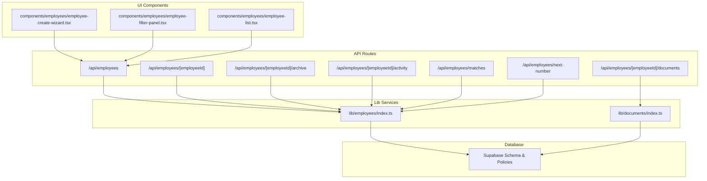
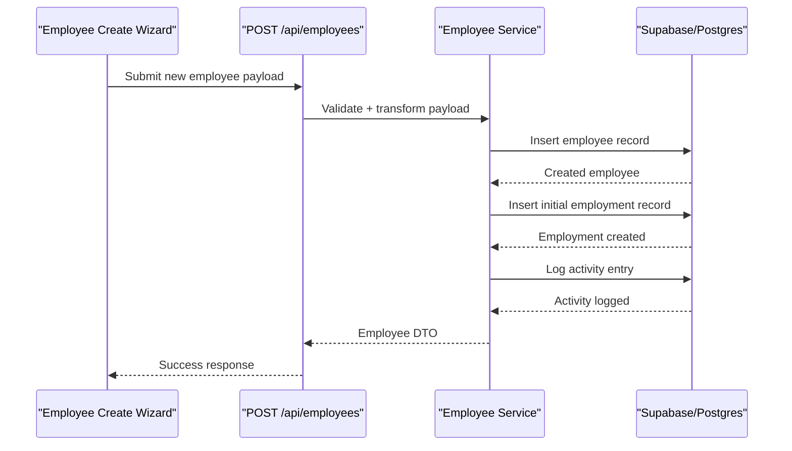
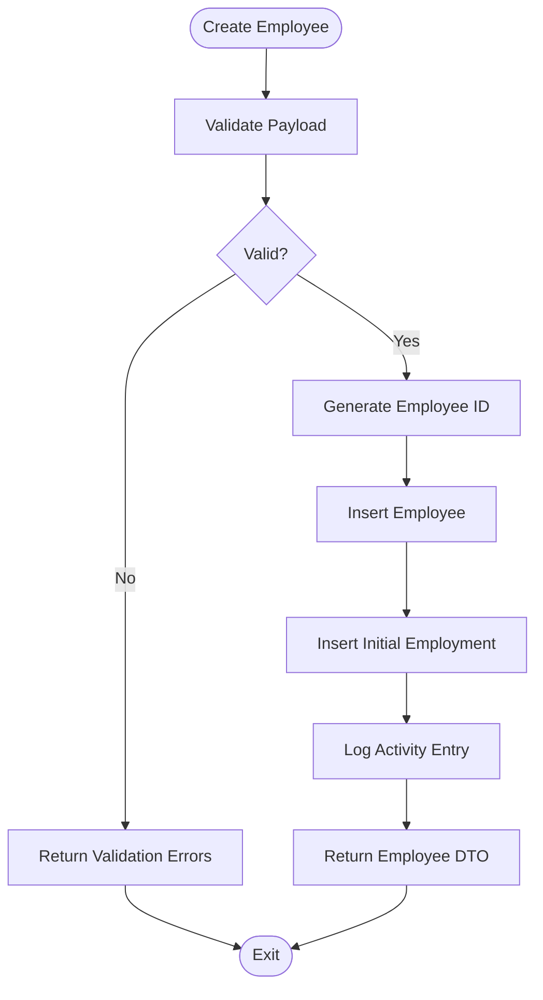
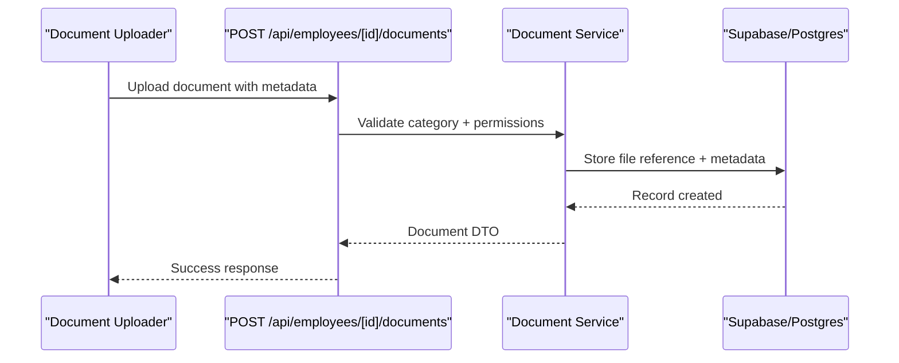
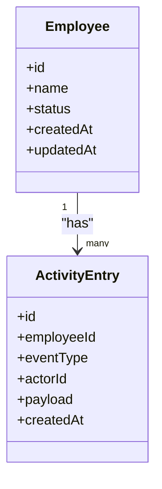
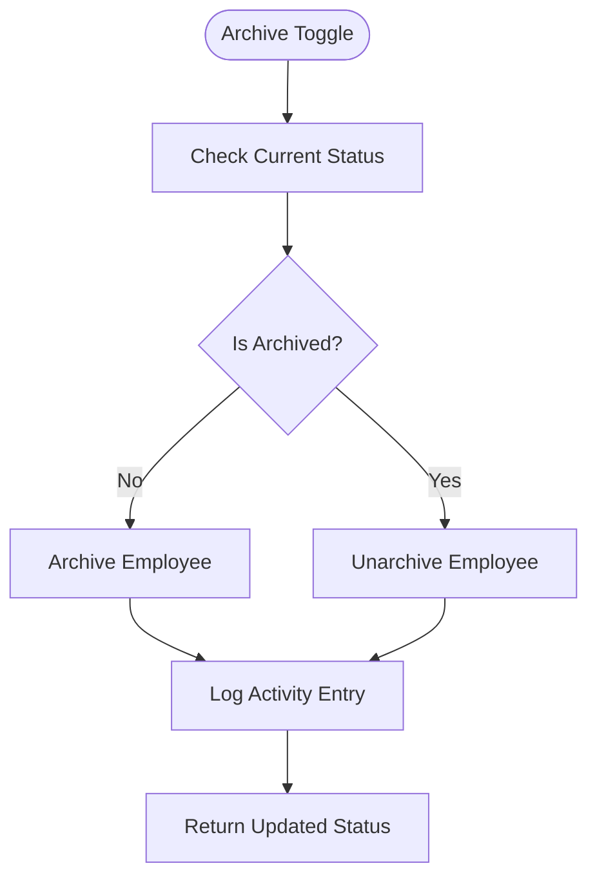
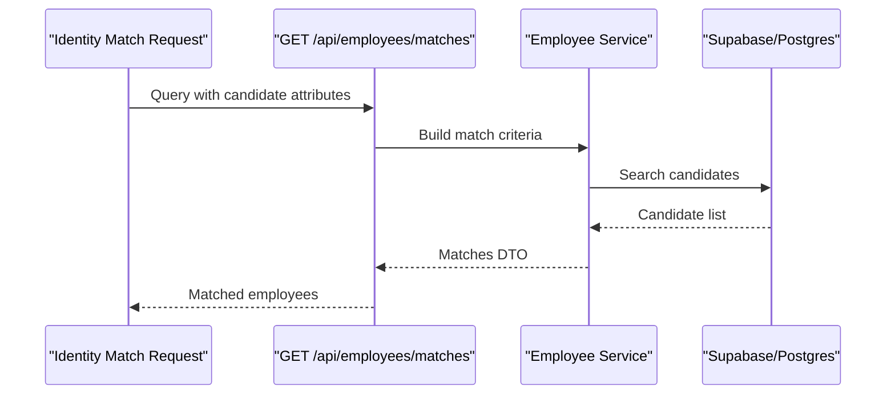
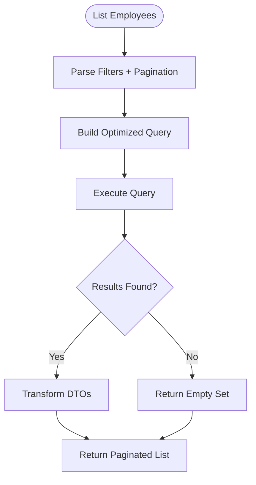
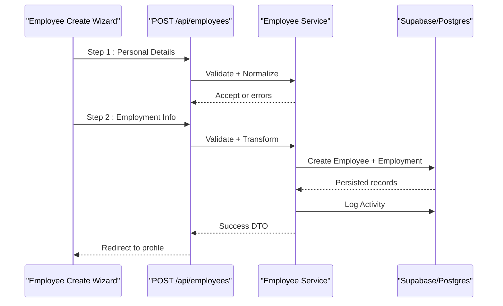
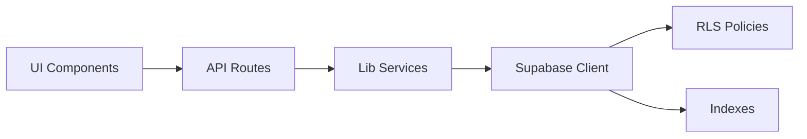

# Employee Business Logic

<cite>
**Referenced Files in This Document**
- [apps/hr-suite/app/api/employees/route.ts](file://apps/hr-suite/app/api/employees/route.ts)
- [apps/hr-suite/app/api/employees/[employeeId]/route.ts](file://apps/hr-suite/app/api/employees/[employeeId]/route.ts)
- [apps/hr-suite/app/api/employees/[employeeId]/documents/route.ts](file://apps/hr-suite/app/api/employees/[employeeId]/documents/route.ts)
- [apps/hr-suite/app/api/employees/[employeeId]/archive/route.ts](file://apps/hr-suite/app/api/employees/[employeeId]/archive/route.ts)
- [apps/hr-suite/app/api/employees/[employeeId]/activity/route.ts](file://apps/hr-suite/app/api/employees/[employeeId]/activity/route.ts)
- [apps/hr-suite/app/api/employees/matches/route.ts](file://apps/hr-suite/app/api/employees/matches/route.ts)
- [apps/hr-suite/app/api/employees/next-number/route.ts](file://apps/hr-suite/app/api/employees/next-number/route.ts)
- [apps/hr-suite/lib/employees/index.ts](file://apps/hr-suite/lib/employees/index.ts)
- [apps/hr-suite/lib/documents/index.ts](file://apps/hr-suite/lib/documents/index.ts)
- [apps/hr-suite/components/employees/employee-create-wizard.tsx](file://apps/hr-suite/components/employees/employee-create-wizard.tsx)
- [apps/hr-suite/components/employees/employee-filter-panel.tsx](file://apps/hr-suite/components/employees/employee-filter-panel.tsx)
- [apps/hr-suite/components/employees/employee-list.tsx](file://apps/hr-suite/components/employees/employee-list.tsx)
- [apps/hr-suite/supabase/migrations/20260712124858_init_employee_core_hr.sql](file://apps/hr-suite/supabase/migrations/20260712124858_init_employee_core_hr.sql)
- [apps/hr-suite/supabase/migrations/20260715120810_complete_employee_core.sql](file://apps/hr-suite/supabase/migrations/20260715120810_complete_employee_core.sql)
- [apps/hr-suite/supabase/migrations/20260718180354_add_employee_archive_and_avatar_state.sql](file://apps/hr-suite/supabase/migrations/20260718180354_add_employee_archive_and_avatar_state.sql)
- [apps/hr-suite/supabase/migrations/20260718110000_add_employee_document_dossiers.sql](file://apps/hr-suite/supabase/migrations/20260718110000_add_employee_document_dossiers.sql)
- [apps/hr-suite/supabase/migrations/20260724160000_add_employee_activity_entries.sql](file://apps/hr-suite/supabase/migrations/20260724160000_add_employee_activity_entries.sql)
- [apps/hr-suite/supabase/migrations/20260724172716_harden_employee_activity_entries.sql](file://apps/hr-suite/supabase/migrations/20260724172716_harden_employee_activity_entries.sql)
- [apps/hr-suite/supabase/migrations/20260723151000_optimize_employee_overview.sql](file://apps/hr-suite/supabase/migrations/20260723151000_optimize_employee_overview.sql)
- [apps/hr-suite/supabase/tests/employee_core_crud_isolation.sql](file://apps/hr-suite/supabase/tests/employee_core_crud_isolation.sql)
- [apps/hr-suite/supabase/tests/employee_document_dossiers.sql](file://apps/hr-suite/supabase/tests/employee_document_dossiers.sql)
- [apps/hr-suite/supabase/tests/employee_overview.sql](file://apps/hr-suite/supabase/tests/employee_overview.sql)
</cite>

## Table of Contents
1. Introduction
2. Project Structure
3. Core Components
4. Architecture Overview
5. Detailed Component Analysis
6. Dependency Analysis
7. Performance Considerations
8. Troubleshooting Guide
9. Conclusion

## Introduction
This document explains the employee business logic layer in LiquidHR, focusing on how employees are created, updated, searched, and archived; how documents are managed; how activity is tracked; and how employment records relate to organizational structures. It also covers data transformation patterns, validation rules, and performance considerations for search and reporting.

## Project Structure
The employee domain spans Next.js API routes (business entry points), a lib layer (service implementations), UI components (workflows and filtering), and database migrations (schema and policies). The key areas:
- API routes expose CRUD, archive, activity, identity matching, and next-number generation endpoints.
- The lib layer implements service functions for employee operations, document management, and transformations.
- UI components implement creation wizards, filtering panels, and list rendering.
- Migrations define core tables, indexes, and RLS policies that enforce security and integrity.

**Diagram sources**
- [apps/hr-suite/app/api/employees/route.ts](file://apps/hr-suite/app/api/employees/route.ts)
- [apps/hr-suite/app/api/employees/[employeeId]/route.ts](file://apps/hr-suite/app/api/employees/[employeeId]/route.ts)
- [apps/hr-suite/app/api/employees/[employeeId]/documents/route.ts](file://apps/hr-suite/app/api/employees/[employeeId]/documents/route.ts)
- [apps/hr-suite/app/api/employees/[employeeId]/archive/route.ts](file://apps/hr-suite/app/api/employees/[employeeId]/archive/route.ts)
- [apps/hr-suite/app/api/employees/[employeeId]/activity/route.ts](file://apps/hr-suite/app/api/employees/[employeeId]/activity/route.ts)
- [apps/hr-suite/app/api/employees/matches/route.ts](file://apps/hr-suite/app/api/employees/matches/route.ts)
- [apps/hr-suite/app/api/employees/next-number/route.ts](file://apps/hr-suite/app/api/employees/next-number/route.ts)
- [apps/hr-suite/lib/employees/index.ts](file://apps/hr-suite/lib/employees/index.ts)
- [apps/hr-suite/lib/documents/index.ts](file://apps/hr-suite/lib/documents/index.ts)
- [apps/hr-suite/components/employees/employee-create-wizard.tsx](file://apps/hr-suite/components/employees/employee-create-wizard.tsx)
- [apps/hr-suite/components/employees/employee-filter-panel.tsx](file://apps/hr-suite/components/employees/employee-filter-panel.tsx)
- [apps/hr-suite/components/employees/employee-list.tsx](file://apps/hr-suite/components/employees/employee-list.tsx)

**Section sources**
- [apps/hr-suite/app/api/employees/route.ts](file://apps/hr-suite/app/api/employees/route.ts)
- [apps/hr-suite/app/api/employees/[employeeId]/route.ts](file://apps/hr-suite/app/api/employees/[employeeId]/route.ts)
- [apps/hr-suite/app/api/employees/[employeeId]/documents/route.ts](file://apps/hr-suite/app/api/employees/[employeeId]/documents/route.ts)
- [apps/hr-suite/app/api/employees/[employeeId]/archive/route.ts](file://apps/hr-suite/app/api/employees/[employeeId]/archive/route.ts)
- [apps/hr-suite/app/api/employees/[employeeId]/activity/route.ts](file://apps/hr-suite/app/api/employees/[employeeId]/activity/route.ts)
- [apps/hr-suite/app/api/employees/matches/route.ts](file://apps/hr-suite/app/api/employees/matches/route.ts)
- [apps/hr-suite/app/api/employees/next-number/route.ts](file://apps/hr-suite/app/api/employees/next-number/route.ts)
- [apps/hr-suite/lib/employees/index.ts](file://apps/hr-suite/lib/employees/index.ts)
- [apps/hr-suite/lib/documents/index.ts](file://apps/hr-suite/lib/documents/index.ts)
- [apps/hr-suite/components/employees/employee-create-wizard.tsx](file://apps/hr-suite/components/employees/employee-create-wizard.tsx)
- [apps/hr-suite/components/employees/employee-filter-panel.tsx](file://apps/hr-suite/components/employees/employee-filter-panel.tsx)
- [apps/hr-suite/components/employees/employee-list.tsx](file://apps/hr-suite/components/employees/employee-list.tsx)

## Core Components
- Employee API routes:
  - List/create employees at /api/employees.
  - Read/update/delete single employee at /api/employees/[employeeId].
  - Subresources: documents, archive toggle, activity feed, identity matches, next-number generator.
- Lib services:
  - Employee service encapsulates CRUD, validation, transformation, and audit logging.
  - Document service manages dossier uploads, categorization, and metadata.
- UI workflows:
  - Creation wizard orchestrates multi-step input and server mutations.
  - Filter panel composes query parameters for efficient listing.
  - Employee list renders paginated results with sorting and filters.

Key responsibilities:
- Input validation and normalization before persistence.
- Enforcing business rules (e.g., unique identifiers, required fields, status transitions).
- Transforming between DTOs and domain models.
- Recording activity entries for compliance and traceability.
- Managing employee archival state and visibility.

**Section sources**
- [apps/hr-suite/app/api/employees/route.ts](file://apps/hr-suite/app/api/employees/route.ts)
- [apps/hr-suite/app/api/employees/[employeeId]/route.ts](file://apps/hr-suite/app/api/employees/[employeeId]/route.ts)
- [apps/hr-suite/app/api/employees/[employeeId]/documents/route.ts](file://apps/hr-suite/app/api/employees/[employeeId]/documents/route.ts)
- [apps/hr-suite/app/api/employees/[employeeId]/archive/route.ts](file://apps/hr-suite/app/api/employees/[employeeId]/archive/route.ts)
- [apps/hr-suite/app/api/employees/[employeeId]/activity/route.ts](file://apps/hr-suite/app/api/employees/[employeeId]/activity/route.ts)
- [apps/hr-suite/app/api/employees/matches/route.ts](file://apps/hr-suite/app/api/employees/matches/route.ts)
- [apps/hr-suite/app/api/employees/next-number/route.ts](file://apps/hr-suite/app/api/employees/next-number/route.ts)
- [apps/hr-suite/lib/employees/index.ts](file://apps/hr-suite/lib/employees/index.ts)
- [apps/hr-suite/lib/documents/index.ts](file://apps/hr-suite/lib/documents/index.ts)
- [apps/hr-suite/components/employees/employee-create-wizard.tsx](file://apps/hr-suite/components/employees/employee-create-wizard.tsx)
- [apps/hr-suite/components/employees/employee-filter-panel.tsx](file://apps/hr-suite/components/employees/employee-filter-panel.tsx)
- [apps/hr-suite/components/employees/employee-list.tsx](file://apps/hr-suite/components/employees/employee-list.tsx)

## Architecture Overview
The employee business layer follows a layered architecture:
- API routes act as thin controllers that validate requests, call services, and return responses.
- Service layer contains business logic, validation, and data transformation.
- Data access uses Supabase client calls backed by Postgres with RLS policies.
- UI components drive user flows and compose queries/filters.

**Diagram sources**
- [apps/hr-suite/app/api/employees/route.ts](file://apps/hr-suite/app/api/employees/route.ts)
- [apps/hr-suite/lib/employees/index.ts](file://apps/hr-suite/lib/employees/index.ts)
- [apps/hr-suite/supabase/migrations/20260712124858_init_employee_core_hr.sql](file://apps/hr-suite/supabase/migrations/20260712124858_init_employee_core_hr.sql)
- [apps/hr-suite/supabase/migrations/20260715120810_complete_employee_core.sql](file://apps/hr-suite/supabase/migrations/20260715120810_complete_employee_core.sql)
- [apps/hr-suite/supabase/migrations/20260724160000_add_employee_activity_entries.sql](file://apps/hr-suite/supabase/migrations/20260724160000_add_employee_activity_entries.sql)

## Detailed Component Analysis

### Employee CRUD Operations
- List employees: supports pagination, sorting, and filtering via query parameters.
- Create employee: validates inputs, generates identifiers, creates employment record, logs activity.
- Update employee: partial updates with field-level validation and change tracking.
- Delete employee: soft delete or archive depending on policy.

Validation and transformation:
- Required fields enforced at service level.
- Normalization of dates, IDs, and enums.
- Conflict detection for unique identifiers.

**Diagram sources**
- [apps/hr-suite/app/api/employees/route.ts](file://apps/hr-suite/app/api/employees/route.ts)
- [apps/hr-suite/lib/employees/index.ts](file://apps/hr-suite/lib/employees/index.ts)
- [apps/hr-suite/supabase/migrations/20260712124858_init_employee_core_hr.sql](file://apps/hr-suite/supabase/migrations/20260712124858_init_employee_core_hr.sql)
- [apps/hr-suite/supabase/migrations/20260715120810_complete_employee_core.sql](file://apps/hr-suite/supabase/migrations/20260715120810_complete_employee_core.sql)
- [apps/hr-suite/supabase/migrations/20260724160000_add_employee_activity_entries.sql](file://apps/hr-suite/supabase/migrations/20260724160000_add_employee_activity_entries.sql)

**Section sources**
- [apps/hr-suite/app/api/employees/route.ts](file://apps/hr-suite/app/api/employees/route.ts)
- [apps/hr-suite/app/api/employees/[employeeId]/route.ts](file://apps/hr-suite/app/api/employees/[employeeId]/route.ts)
- [apps/hr-suite/lib/employees/index.ts](file://apps/hr-suite/lib/employees/index.ts)
- [apps/hr-suite/supabase/migrations/20260712124858_init_employee_core_hr.sql](file://apps/hr-suite/supabase/migrations/20260712124858_init_employee_core_hr.sql)
- [apps/hr-suite/supabase/migrations/20260715120810_complete_employee_core.sql](file://apps/hr-suite/supabase/migrations/20260715120810_complete_employee_core.sql)
- [apps/hr-suite/supabase/tests/employee_core_crud_isolation.sql](file://apps/hr-suite/supabase/tests/employee_core_crud_isolation.sql)

### Document Management Service
- Upload and associate documents to an employee’s dossier.
- Manage categories, metadata, and file references.
- Enforce tenant isolation and RBAC through policies.

**Diagram sources**
- [apps/hr-suite/app/api/employees/[employeeId]/documents/route.ts](file://apps/hr-suite/app/api/employees/[employeeId]/documents/route.ts)
- [apps/hr-suite/lib/documents/index.ts](file://apps/hr-suite/lib/documents/index.ts)
- [apps/hr-suite/supabase/migrations/20260718110000_add_employee_document_dossiers.sql](file://apps/hr-suite/supabase/migrations/20260718110000_add_employee_document_dossiers.sql)
- [apps/hr-suite/supabase/tests/employee_document_dossiers.sql](file://apps/hr-suite/supabase/tests/employee_document_dossiers.sql)

**Section sources**
- [apps/hr-suite/app/api/employees/[employeeId]/documents/route.ts](file://apps/hr-suite/app/api/employees/[employeeId]/documents/route.ts)
- [apps/hr-suite/lib/documents/index.ts](file://apps/hr-suite/lib/documents/index.ts)
- [apps/hr-suite/supabase/migrations/20260718110000_add_employee_document_dossiers.sql](file://apps/hr-suite/supabase/migrations/20260718110000_add_employee_document_dossiers.sql)
- [apps/hr-suite/supabase/tests/employee_document_dossiers.sql](file://apps/hr-suite/supabase/tests/employee_document_dossiers.sql)

### Activity Tracking Logic
- Records immutable activity entries for audit trails.
- Supports event types, timestamps, actor context, and entity references.
- Hardened policies ensure write-only integrity and read access control.

**Diagram sources**
- [apps/hr-suite/supabase/migrations/20260724160000_add_employee_activity_entries.sql](file://apps/hr-suite/supabase/migrations/20260724160000_add_employee_activity_entries.sql)
- [apps/hr-suite/supabase/migrations/20260724172716_harden_employee_activity_entries.sql](file://apps/hr-suite/supabase/migrations/20260724172716_harden_employee_activity_entries.sql)

**Section sources**
- [apps/hr-suite/app/api/employees/[employeeId]/activity/route.ts](file://apps/hr-suite/app/api/employees/[employeeId]/activity/route.ts)
- [apps/hr-suite/supabase/migrations/20260724160000_add_employee_activity_entries.sql](file://apps/hr-suite/supabase/migrations/20260724160000_add_employee_activity_entries.sql)
- [apps/hr-suite/supabase/migrations/20260724172716_harden_employee_activity_entries.sql](file://apps/hr-suite/supabase/migrations/20260724172716_harden_employee_activity_entries.sql)

### Archive Functionality
- Toggle employee archival state to hide from active lists while preserving history.
- Enforces policy checks to prevent accidental deletion of linked records.
- Updates visibility flags and audit trail.

**Diagram sources**
- [apps/hr-suite/app/api/employees/[employeeId]/archive/route.ts](file://apps/hr-suite/app/api/employees/[employeeId]/archive/route.ts)
- [apps/hr-suite/supabase/migrations/20260718180354_add_employee_archive_and_avatar_state.sql](file://apps/hr-suite/supabase/migrations/20260718180354_add_employee_archive_and_avatar_state.sql)
- [apps/hr-suite/supabase/migrations/20260724160000_add_employee_activity_entries.sql](file://apps/hr-suite/supabase/migrations/20260724160000_add_employee_activity_entries.sql)

**Section sources**
- [apps/hr-suite/app/api/employees/[employeeId]/archive/route.ts](file://apps/hr-suite/app/api/employees/[employeeId]/archive/route.ts)
- [apps/hr-suite/supabase/migrations/20260718180354_add_employee_archive_and_avatar_state.sql](file://apps/hr-suite/supabase/migrations/20260718180354_add_employee_archive_and_avatar_state.sql)
- [apps/hr-suite/supabase/migrations/20260724160000_add_employee_activity_entries.sql](file://apps/hr-suite/supabase/migrations/20260724160000_add_employee_activity_entries.sql)

### Identity Matching and Next Number Generation
- Identity matching helps detect duplicate employees based on attributes.
- Next number generator ensures sequential employee IDs per administration scope.

**Diagram sources**
- [apps/hr-suite/app/api/employees/matches/route.ts](file://apps/hr-suite/app/api/employees/matches/route.ts)
- [apps/hr-suite/lib/employees/index.ts](file://apps/hr-suite/lib/employees/index.ts)

**Section sources**
- [apps/hr-suite/app/api/employees/matches/route.ts](file://apps/hr-suite/app/api/employees/matches/route.ts)
- [apps/hr-suite/app/api/employees/next-number/route.ts](file://apps/hr-suite/app/api/employees/next-number/route.ts)
- [apps/hr-suite/lib/employees/index.ts](file://apps/hr-suite/lib/employees/index.ts)

### Employee Search, Filtering, and Reporting
- Search supports name, identifier, department, job, and status filters.
- Pagination and sorting improve performance for large datasets.
- Optimized overview queries reduce N+1 issues and leverage indexes.

**Diagram sources**
- [apps/hr-suite/app/api/employees/route.ts](file://apps/hr-suite/app/api/employees/route.ts)
- [apps/hr-suite/components/employees/employee-filter-panel.tsx](file://apps/hr-suite/components/employees/employee-filter-panel.tsx)
- [apps/hr-suite/components/employees/employee-list.tsx](file://apps/hr-suite/components/employees/employee-list.tsx)
- [apps/hr-suite/supabase/migrations/20260723151000_optimize_employee_overview.sql](file://apps/hr-suite/supabase/migrations/20260723151000_optimize_employee_overview.sql)
- [apps/hr-suite/supabase/tests/employee_overview.sql](file://apps/hr-suite/supabase/tests/employee_overview.sql)

**Section sources**
- [apps/hr-suite/app/api/employees/route.ts](file://apps/hr-suite/app/api/employees/route.ts)
- [apps/hr-suite/components/employees/employee-filter-panel.tsx](file://apps/hr-suite/components/employees/employee-filter-panel.tsx)
- [apps/hr-suite/components/employees/employee-list.tsx](file://apps/hr-suite/components/employees/employee-list.tsx)
- [apps/hr-suite/supabase/migrations/20260723151000_optimize_employee_overview.sql](file://apps/hr-suite/supabase/migrations/20260723151000_optimize_employee_overview.sql)
- [apps/hr-suite/supabase/tests/employee_overview.sql](file://apps/hr-suite/supabase/tests/employee_overview.sql)

### Employee Creation Workflow
- Multi-step wizard collects personal details, employment info, and optional custom fields.
- Server-side validation enforces business rules and prevents duplicates.
- On success, initializes employment record and logs activity.

**Diagram sources**
- [apps/hr-suite/components/employees/employee-create-wizard.tsx](file://apps/hr-suite/components/employees/employee-create-wizard.tsx)
- [apps/hr-suite/app/api/employees/route.ts](file://apps/hr-suite/app/api/employees/route.ts)
- [apps/hr-suite/lib/employees/index.ts](file://apps/hr-suite/lib/employees/index.ts)
- [apps/hr-suite/supabase/migrations/20260712124858_init_employee_core_hr.sql](file://apps/hr-suite/supabase/migrations/20260712124858_init_employee_core_hr.sql)
- [apps/hr-suite/supabase/migrations/20260715120810_complete_employee_core.sql](file://apps/hr-suite/supabase/migrations/20260715120810_complete_employee_core.sql)
- [apps/hr-suite/supabase/migrations/20260724160000_add_employee_activity_entries.sql](file://apps/hr-suite/supabase/migrations/20260724160000_add_employee_activity_entries.sql)

**Section sources**
- [apps/hr-suite/components/employees/employee-create-wizard.tsx](file://apps/hr-suite/components/employees/employee-create-wizard.tsx)
- [apps/hr-suite/app/api/employees/route.ts](file://apps/hr-suite/app/api/employees/route.ts)
- [apps/hr-suite/lib/employees/index.ts](file://apps/hr-suite/lib/employees/index.ts)
- [apps/hr-suite/supabase/migrations/20260712124858_init_employee_core_hr.sql](file://apps/hr-suite/supabase/migrations/20260712124858_init_employee_core_hr.sql)
- [apps/hr-suite/supabase/migrations/20260715120810_complete_employee_core.sql](file://apps/hr-suite/supabase/migrations/20260715120810_complete_employee_core.sql)
- [apps/hr-suite/supabase/migrations/20260724160000_add_employee_activity_entries.sql](file://apps/hr-suite/supabase/migrations/20260724160000_add_employee_activity_entries.sql)

## Dependency Analysis
- API routes depend on lib services for business logic and validation.
- Services depend on Supabase client for data access and RLS enforcement.
- UI components depend on API routes for data operations and state synchronization.
- Database schema and policies underpin security, integrity, and performance.

**Diagram sources**
- [apps/hr-suite/app/api/employees/route.ts](file://apps/hr-suite/app/api/employees/route.ts)
- [apps/hr-suite/lib/employees/index.ts](file://apps/hr-suite/lib/employees/index.ts)
- [apps/hr-suite/supabase/migrations/20260723151000_optimize_employee_overview.sql](file://apps/hr-suite/supabase/migrations/20260723151000_optimize_employee_overview.sql)

**Section sources**
- [apps/hr-suite/app/api/employees/route.ts](file://apps/hr-suite/app/api/employees/route.ts)
- [apps/hr-suite/lib/employees/index.ts](file://apps/hr-suite/lib/employees/index.ts)
- [apps/hr-suite/supabase/migrations/20260723151000_optimize_employee_overview.sql](file://apps/hr-suite/supabase/migrations/20260723151000_optimize_employee_overview.sql)

## Performance Considerations
- Use pagination and limit result sets to avoid heavy payloads.
- Leverage optimized overview queries and indexes for fast filtering.
- Avoid N+1 queries by joining necessary relations in service layer.
- Cache frequent reads where appropriate and invalidate on writes.
- Validate early to fail fast and reduce unnecessary DB calls.

[No sources needed since this section provides general guidance]

## Troubleshooting Guide
Common issues and resolutions:
- Validation failures: check required fields and formats; review error messages returned by services.
- Duplicate identity matches: refine matching criteria or adjust uniqueness constraints.
- Archive/unarchive errors: verify policies and linked records; ensure correct actor permissions.
- Activity log gaps: confirm activity logging is invoked on all relevant mutations.
- Slow listings: inspect filter usage and ensure indexes exist for filtered columns.

**Section sources**
- [apps/hr-suite/supabase/tests/employee_core_crud_isolation.sql](file://apps/hr-suite/supabase/tests/employee_core_crud_isolation.sql)
- [apps/hr-suite/supabase/tests/employee_document_dossiers.sql](file://apps/hr-suite/supabase/tests/employee_document_dossiers.sql)
- [apps/hr-suite/supabase/tests/employee_overview.sql](file://apps/hr-suite/supabase/tests/employee_overview.sql)

## Conclusion
The employee business logic layer in LiquidHR provides robust CRUD operations, document management, activity tracking, and archival capabilities. It enforces validation and business rules, maintains audit trails, and leverages optimized queries for performance. By separating concerns across API routes, services, and UI components, it ensures maintainability and scalability while supporting complex HR workflows.

[No sources needed since this section summarizes without analyzing specific files]