# Employment Business Logic

<cite>
**Referenced Files in This Document**
- [employment_core.sql](file://supabase/migrations/20260715071156_add_employment_core.sql)
- [employment_timelines.sql](file://supabase/migrations/20260715071422_add_employment_timelines.sql)
- [employment_terminations.sql](file://supabase/migrations/20260715071717_add_employment_terminations.sql)
- [employment_change_management.sql](file://supabase/migrations/20260715141843_add_employment_change_management.sql)
- [complete_employment_flow.sql](file://supabase/migrations/20260718090000_complete_employment_flow.sql)
- [employment_complete_flow.sql](file://supabase/tests/employment_complete_flow.sql)
- [employment_change_management.sql](file://supabase/tests/employment_change_management.sql)
- [employment_terminations.sql](file://supabase/tests/employment_terminations.sql)
- [route.ts](file://apps/hr-suite/app/api/employments/[employmentId]/route.ts)
- [route.ts](file://apps/hr-suite/app/api/employments/[employmentId]/termination/route.ts)
- [route.ts](file://apps/hr-suite/app/api/employments/[employmentId]/changes/route.ts)
- [route.ts](file://apps/hr-suite/app/api/employments/[employmentId]/work-patterns/route.ts)
- [route.ts](file://apps/hr-suite/app/api/employees/[employeeId]/employments/route.ts)
- [employment-create-form.tsx](file://apps/hr-suite/components/employment/employment-create-form.tsx)
- [employment-time-map.tsx](file://apps/hr-suite/components/employment/employment-time-map.tsx)
- [employment-timeline.tsx](file://apps/hr-suite/components/employment/employment-timeline.tsx)
- [termination-form.tsx](file://apps/hr-suite/components/employment/termination-form.tsx)
- [work-pattern-panel.tsx](file://apps/hr-suite/components/employment/work-pattern-panel.tsx)
- [employment.json](file://apps/hr-suite/messages/en/employment.json)
</cite>

## Table of Contents
1. [Introduction](#introduction)
2. [Project Structure](#project-structure)
3. [Core Components](#core-components)
4. [Architecture Overview](#architecture-overview)
5. [Detailed Component Analysis](#detailed-component-analysis)
6. [Dependency Analysis](#dependency-analysis)
7. [Performance Considerations](#performance-considerations)
8. [Troubleshooting Guide](#troubleshooting-guide)
9. [Conclusion](#conclusion)

## Introduction
This document explains the employment business logic layer in LiquidHR, focusing on:
- Employment lifecycle management and status transitions
- Contract processing and change management
- Timeline tracking and audit trail generation
- Termination workflows and rehire handling
- Work pattern calculations and salary processing logic
- Integration between employment records and employee profiles with data synchronization rules
- Examples of creation, modification, and automated calculations
- Approval processes and audit trails

The documentation is grounded in the repository’s API routes, UI components, database migrations, and tests that implement these capabilities.

## Project Structure
Employment functionality spans three layers:
- API routes under apps/hr-suite/app/api for CRUD and specialized operations (termination, changes, work patterns, timelines)
- UI components under apps/hr-suite/components/employment for user interactions (creation, time mapping, timeline, termination form, work pattern panel)
- Database schema and business rules defined in Supabase migrations and enforced by tests

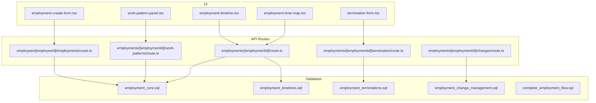

**Diagram sources**
- [employment_core.sql](file://supabase/migrations/20260715071156_add_employment_core.sql)
- [employment_timelines.sql](file://supabase/migrations/20260715071422_add_employment_timelines.sql)
- [employment_terminations.sql](file://supabase/migrations/20260715071717_add_employment_terminations.sql)
- [employment_change_management.sql](file://supabase/migrations/20260715141843_add_employment_change_management.sql)
- [complete_employment_flow.sql](file://supabase/migrations/20260718090000_complete_employment_flow.sql)
- [route.ts](file://apps/hr-suite/app/api/employments/[employmentId]/route.ts)
- [route.ts](file://apps/hr-suite/app/api/employments/[employmentId]/termination/route.ts)
- [route.ts](file://apps/hr-suite/app/api/employments/[employmentId]/changes/route.ts)
- [route.ts](file://apps/hr-suite/app/api/employments/[employmentId]/work-patterns/route.ts)
- [route.ts](file://apps/hr-suite/app/api/employees/[employeeId]/employments/route.ts)
- [employment-create-form.tsx](file://apps/hr-suite/components/employment/employment-create-form.tsx)
- [employment-time-map.tsx](file://apps/hr-suite/components/employment/employment-time-map.tsx)
- [employment-timeline.tsx](file://apps/hr-suite/components/employment/employment-timeline.tsx)
- [termination-form.tsx](file://apps/hr-suite/components/employment/termination-form.tsx)
- [work-pattern-panel.tsx](file://apps/hr-suite/components/employment/work-pattern-panel.tsx)

**Section sources**
- [employment_core.sql](file://supabase/migrations/20260715071156_add_employment_core.sql)
- [employment_timelines.sql](file://supabase/migrations/20260715071422_add_employment_timelines.sql)
- [employment_terminations.sql](file://supabase/migrations/20260715071717_add_employment_terminations.sql)
- [employment_change_management.sql](file://supabase/migrations/20260715141843_add_employment_change_management.sql)
- [complete_employment_flow.sql](file://supabase/migrations/20260718090000_complete_employment_flow.sql)
- [route.ts](file://apps/hr-suite/app/api/employments/[employmentId]/route.ts)
- [route.ts](file://apps/hr-suite/app/api/employments/[employmentId]/termination/route.ts)
- [route.ts](file://apps/hr-suite/app/api/employments/[employmentId]/changes/route.ts)
- [route.ts](file://apps/hr-suite/app/api/employments/[employmentId]/work-patterns/route.ts)
- [route.ts](file://apps/hr-suite/app/api/employees/[employeeId]/employments/route.ts)
- [employment-create-form.tsx](file://apps/hr-suite/components/employment/employment-create-form.tsx)
- [employment-time-map.tsx](file://apps/hr-suite/components/employment/employment-time-map.tsx)
- [employment-timeline.tsx](file://apps/hr-suite/components/employment/employment-timeline.tsx)
- [termination-form.tsx](file://apps/hr-suite/components/employment/termination-form.tsx)
- [work-pattern-panel.tsx](file://apps/hr-suite/components/employment/work-pattern-panel.tsx)

## Core Components
- Employment core model and relationships are defined in the core migration, establishing entities such as employment, contract, job, department, and links to employees.
- Timeline tracking is implemented via a dedicated timelines table and associated endpoints to append events and query history.
- Termination workflow includes termination records, reasons, effective dates, and follow-up tasks.
- Change management supports versioned updates to employment attributes with approval states and audit entries.
- Work patterns define scheduled hours per period and feed into salary and leave calculations.
- Salary processing integrates with master data (salary scales, revisions) and applies effective-dated values based on employment periods.

Key responsibilities:
- Enforce valid state transitions for employment status
- Maintain consistent effective dating across contracts and work patterns
- Generate immutable audit trails for all changes
- Provide APIs for creation, modification, termination, and timeline queries

**Section sources**
- [employment_core.sql](file://supabase/migrations/20260715071156_add_employment_core.sql)
- [employment_timelines.sql](file://supabase/migrations/20260715071422_add_employment_timelines.sql)
- [employment_terminations.sql](file://supabase/migrations/20260715071717_add_employment_terminations.sql)
- [employment_change_management.sql](file://supabase/migrations/20260715141843_add_employment_change_management.sql)
- [complete_employment_flow.sql](file://supabase/migrations/20260718090000_complete_employment_flow.sql)

## Architecture Overview
The employment layer follows a layered architecture:
- UI components initiate actions through typed forms and panels
- API routes validate inputs, enforce authorization, and orchestrate business logic
- Database migrations define schemas, constraints, and stored procedures/functions that enforce business rules
- Tests codify expected behavior for complete flows, change management, and terminations

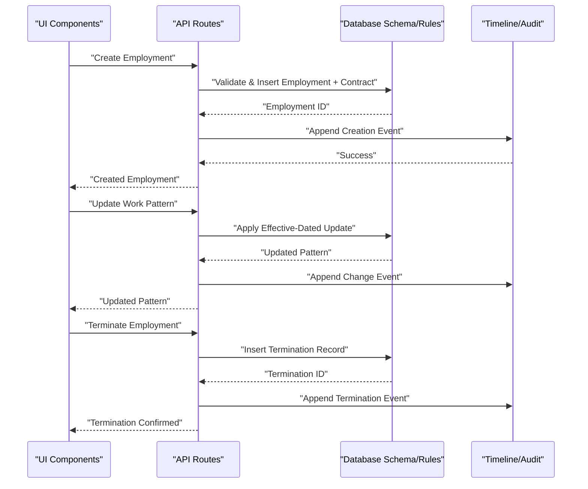

**Diagram sources**
- [employment-core flow](file://supabase/migrations/20260718090000_complete_employment_flow.sql)
- [employment-change-management](file://supabase/migrations/20260715141843_add_employment_change_management.sql)
- [employment-terminations](file://supabase/migrations/20260715071717_add_employment_terminations.sql)
- [employment-timelines](file://supabase/migrations/20260715071422_add_employment_timelines.sql)
- [route.ts](file://apps/hr-suite/app/api/employments/[employmentId]/route.ts)
- [route.ts](file://apps/hr-suite/app/api/employments/[employmentId]/changes/route.ts)
- [route.ts](file://apps/hr-suite/app/api/employments/[employmentId]/termination/route.ts)

## Detailed Component Analysis

### Employment Lifecycle Management
- Status transitions are enforced at the database level to ensure only valid sequences occur (e.g., draft → active → terminated).
- Effective dating ensures that changes apply from specific dates without breaking historical accuracy.
- The complete flow migration defines end-to-end steps including creation, activation, modifications, and termination.

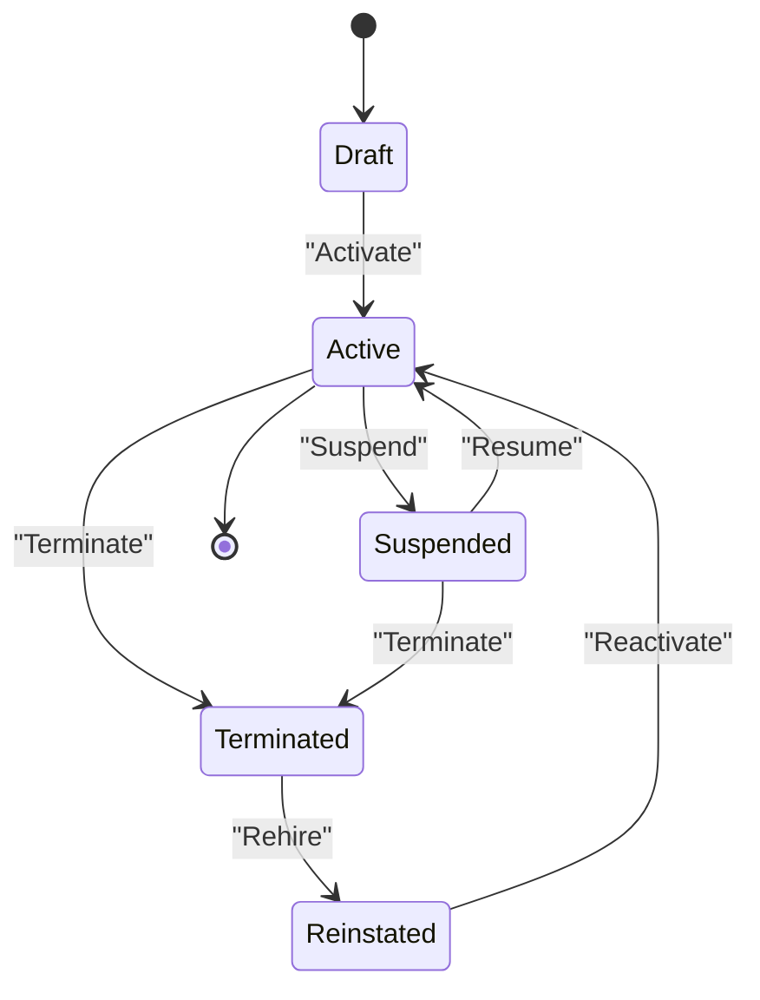

**Diagram sources**
- [employment_core.sql](file://supabase/migrations/20260715071156_add_employment_core.sql)
- [complete_employment_flow.sql](file://supabase/migrations/20260718090000_complete_employment_flow.sql)

**Section sources**
- [employment_core.sql](file://supabase/migrations/20260715071156_add_employment_core.sql)
- [complete_employment_flow.sql](file://supabase/migrations/20260718090000_complete_employment_flow.sql)

### Contract Processing and Change Management
- Contracts are tied to employment records and include effective start/end dates, job references, and compensation details.
- Change management introduces versioned updates with approval states, ensuring traceability and controlled rollouts.
- API routes expose endpoints to propose, approve, and finalize changes; database rules enforce consistency and prevent overlapping effective periods.

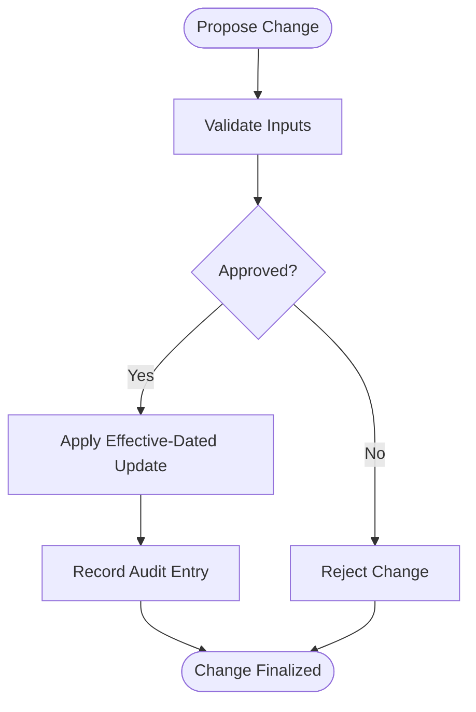

**Diagram sources**
- [employment_change_management.sql](file://supabase/migrations/20260715141843_add_employment_change_management.sql)
- [route.ts](file://apps/hr-suite/app/api/employments/[employmentId]/changes/route.ts)

**Section sources**
- [employment_change_management.sql](file://supabase/migrations/20260715141843_add_employment_change_management.sql)
- [route.ts](file://apps/hr-suite/app/api/employments/[employmentId]/changes/route.ts)

### Timeline Tracking and Audit Trail Generation
- Every significant action (create, update, terminate) appends an event to the timeline table.
- Timeline queries support filtering by type, date ranges, and employment context.
- Audit entries are immutable and include actor identity, timestamp, and change summaries.

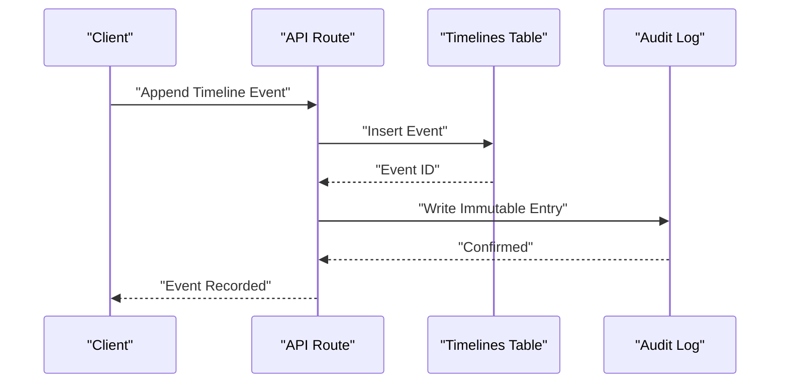

**Diagram sources**
- [employment_timelines.sql](file://supabase/migrations/20260715071422_add_employment_timelines.sql)
- [route.ts](file://apps/hr-suite/app/api/employments/[employmentId]/timeline/[timeline]/route.ts)

**Section sources**
- [employment_timelines.sql](file://supabase/migrations/20260715071422_add_employment_timelines.sql)
- [route.ts](file://apps/hr-suite/app/api/employments/[employmentId]/timeline/[timeline]/route.ts)

### Termination Workflows
- Termination records capture reason, effective date, and follow-up tasks.
- The termination route enforces preconditions (e.g., employment must be active or suspended) and updates status accordingly.
- Post-termination actions can trigger reminders and archive processes.

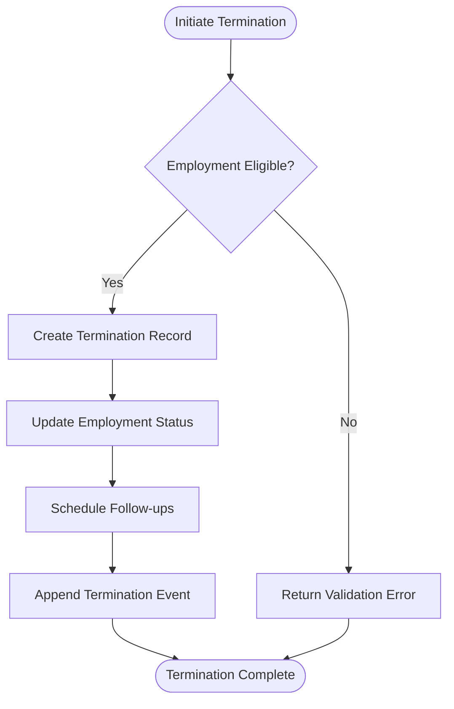

**Diagram sources**
- [employment_terminations.sql](file://supabase/migrations/20260715071717_add_employment_terminations.sql)
- [route.ts](file://apps/hr-suite/app/api/employments/[employmentId]/termination/route.ts)

**Section sources**
- [employment_terminations.sql](file://supabase/migrations/20260715071717_add_employment_terminations.sql)
- [route.ts](file://apps/hr-suite/app/api/employments/[employmentId]/termination/route.ts)

### Work Pattern Calculations
- Work patterns define weekly schedules, part-time ratios, and holiday adjustments.
- Patterns are effective-dated and integrated with salary computations and leave accrual engines.
- The work-pattern panel allows HR to configure and preview impacts before applying changes.

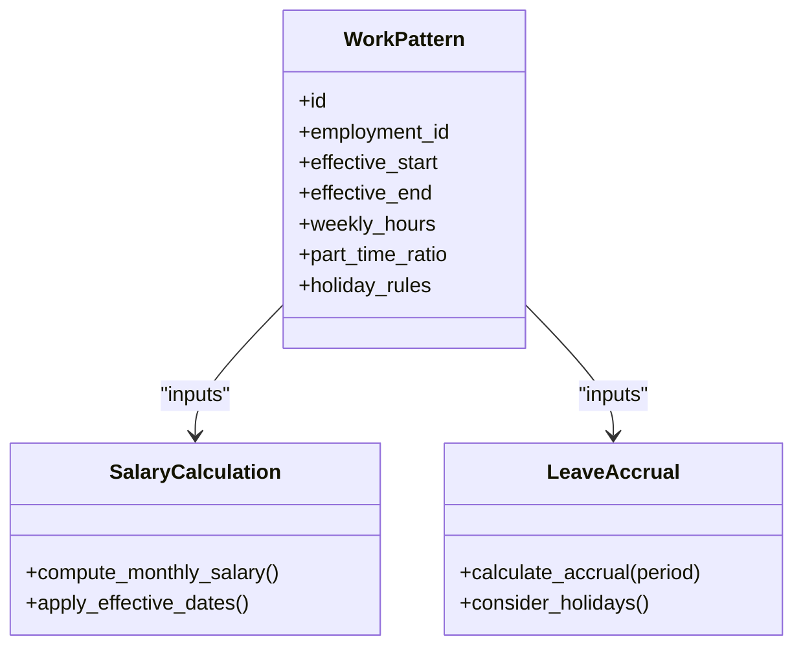

**Diagram sources**
- [employment_core.sql](file://supabase/migrations/20260715071156_add_employment_core.sql)
- [work-pattern-panel.tsx](file://apps/hr-suite/components/employment/work-pattern-panel.tsx)
- [route.ts](file://apps/hr-suite/app/api/employments/[employmentId]/work-patterns/route.ts)

**Section sources**
- [employment_core.sql](file://supabase/migrations/20260715071156_add_employment_core.sql)
- [work-pattern-panel.tsx](file://apps/hr-suite/components/employment/work-pattern-panel.tsx)
- [route.ts](file://apps/hr-suite/app/api/employments/[employmentId]/work-patterns/route.ts)

### Salary Processing Logic
- Salary values are sourced from master data (salary scales and revisions) and applied based on effective dates.
- Employment contracts reference salary revisions and compute monthly/annual amounts.
- Automated calculations consider work patterns, allowances, and deductions.

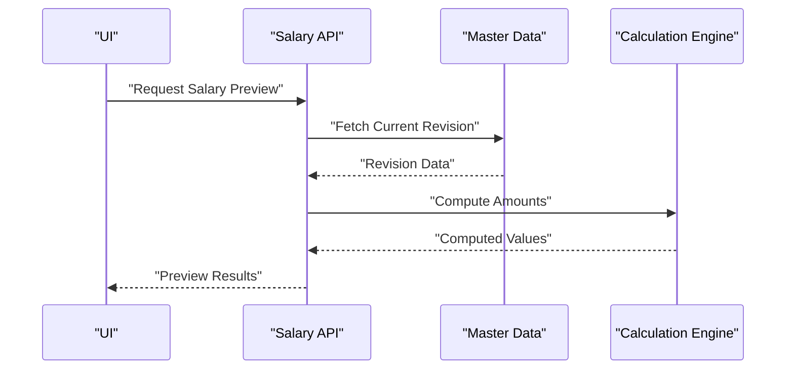

**Diagram sources**
- [employment_core.sql](file://supabase/migrations/20260715071156_add_employment_core.sql)
- [complete_employment_flow.sql](file://supabase/migrations/20260718090000_complete_employment_flow.sql)

**Section sources**
- [employment_core.sql](file://supabase/migrations/20260715071156_add_employment_core.sql)
- [complete_employment_flow.sql](file://supabase/migrations/20260718090000_complete_employment_flow.sql)

### Integration Between Employment Records and Employee Profiles
- Employment records link to employee profiles via foreign keys and maintain referential integrity.
- Synchronization rules ensure that profile updates do not break employment histories; changes are effective-dated and audited.
- Consistency checks prevent orphaned employments and enforce tenant isolation.

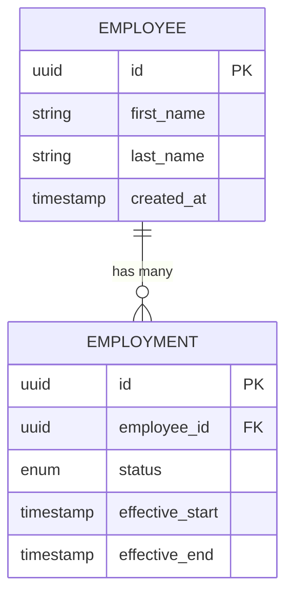

**Diagram sources**
- [employment_core.sql](file://supabase/migrations/20260715071156_add_employment_core.sql)

**Section sources**
- [employment_core.sql](file://supabase/migrations/20260715071156_add_employment_core.sql)

### Examples of Employment Creation and Modification Workflows
- Creation: UI form collects initial data, API validates and inserts employment and contract, timeline records creation event.
- Modification: UI proposes changes, API applies effective-dated updates, approval workflow finalizes changes, timeline records modification event.
- Termination: UI initiates termination, API validates eligibility, creates termination record, updates status, schedules follow-ups, records timeline event.

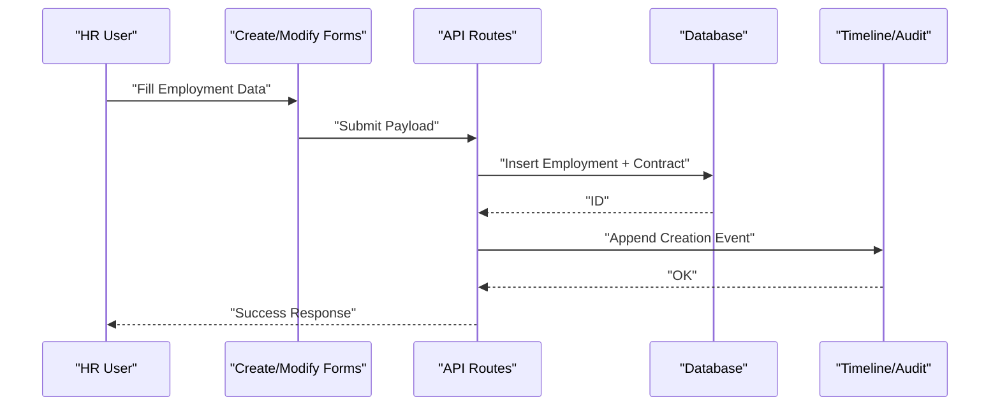

**Diagram sources**
- [employment-create-form.tsx](file://apps/hr-suite/components/employment/employment-create-form.tsx)
- [route.ts](file://apps/hr-suite/app/api/employees/[employeeId]/employments/route.ts)
- [employment_timelines.sql](file://supabase/migrations/20260715071422_add_employment_timelines.sql)

**Section sources**
- [employment-create-form.tsx](file://apps/hr-suite/components/employment/employment-create-form.tsx)
- [route.ts](file://apps/hr-suite/app/api/employees/[employeeId]/employments/route.ts)
- [employment_timelines.sql](file://supabase/migrations/20260715071422_add_employment_timelines.sql)

### Approval Processes and Audit Trail Generation
- Change proposals enter an approval queue; approved changes are applied atomically.
- All approvals and rejections are recorded in the timeline with actor and timestamp.
- Audit logs provide immutable evidence for compliance and reporting.

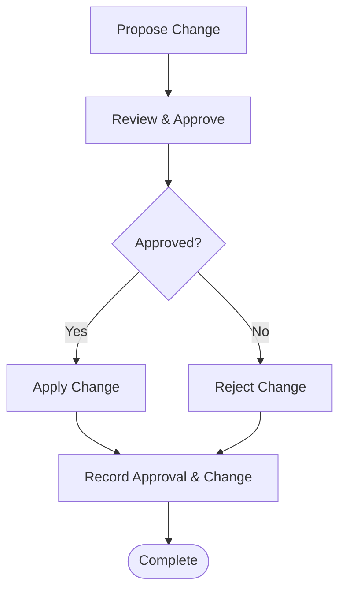

**Diagram sources**
- [employment_change_management.sql](file://supabase/migrations/20260715141843_add_employment_change_management.sql)
- [employment_timelines.sql](file://supabase/migrations/20260715071422_add_employment_timelines.sql)

**Section sources**
- [employment_change_management.sql](file://supabase/migrations/20260715141843_add_employment_change_management.sql)
- [employment_timelines.sql](file://supabase/migrations/20260715071422_add_employment_timelines.sql)

## Dependency Analysis
- UI components depend on API routes for data operations and validation feedback.
- API routes depend on database schema and constraints to enforce business rules.
- Migrations define dependencies between tables (e.g., employment → employee, termination → employment).
- Tests validate end-to-end flows and ensure consistency across components.

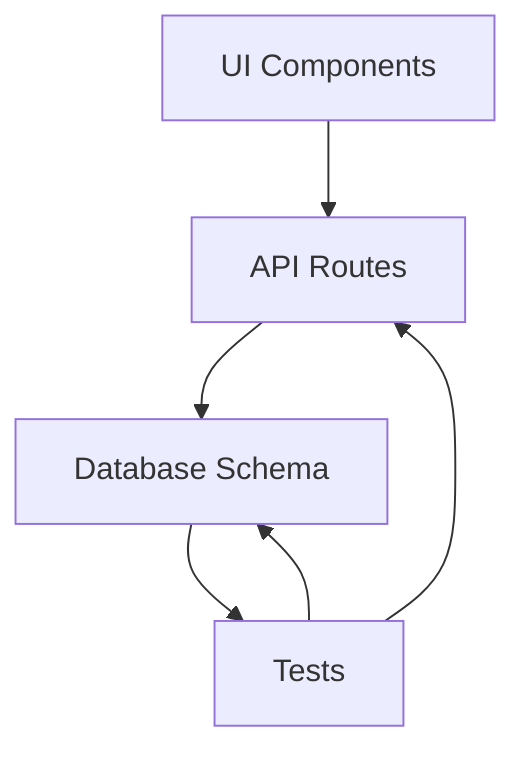

**Diagram sources**
- [employment_complete_flow.sql](file://supabase/tests/employment_complete_flow.sql)
- [employment_change_management.sql](file://supabase/tests/employment_change_management.sql)
- [employment_terminations.sql](file://supabase/tests/employment_terminations.sql)

**Section sources**
- [employment_complete_flow.sql](file://supabase/tests/employment_complete_flow.sql)
- [employment_change_management.sql](file://supabase/tests/employment_change_management.sql)
- [employment_terminations.sql](file://supabase/tests/employment_terminations.sql)

## Performance Considerations
- Use effective-dated queries to minimize full-table scans when retrieving current vs. historical data.
- Index frequently queried columns (employment_id, status, effective_start/end) to optimize timeline and status lookups.
- Batch timeline insertions where possible to reduce transaction overhead.
- Cache computed salary previews for short-lived sessions to avoid repeated calculations.

[No sources needed since this section provides general guidance]

## Troubleshooting Guide
Common issues and resolutions:
- Invalid status transitions: Ensure proposed transitions match allowed sequences defined in schema constraints.
- Overlapping effective dates: Verify non-overlapping intervals for contracts and work patterns.
- Missing audit entries: Confirm that timeline append calls are executed within successful transactions.
- Termination failures: Check employment eligibility and required fields in termination payload.

**Section sources**
- [employment_core.sql](file://supabase/migrations/20260715071156_add_employment_core.sql)
- [employment_timelines.sql](file://supabase/migrations/20260715071422_add_employment_timelines.sql)
- [employment_terminations.sql](file://supabase/migrations/20260715071717_add_employment_terminations.sql)

## Conclusion
The employment business logic layer in LiquidHR provides a robust foundation for managing employment lifecycles, contracts, timelines, terminations, work patterns, and salary processing. By enforcing state transitions, effective dating, and immutable audit trails, it ensures data integrity and compliance. The integration between UI components, API routes, and database schema delivers a cohesive experience for HR administrators while maintaining scalability and performance.

[No sources needed since this section summarizes without analyzing specific files]