# Shared Utilities and Services

<cite>
**Referenced Files in This Document**
- [package.json](file://apps/hr-suite/package.json)
- [next.config.ts](file://apps/hr-suite/next.config.ts)
- [proxy.ts](file://apps/hr-suite/proxy.ts)
- [auth/callback/route.ts](file://apps/hr-suite/app/auth/callback/route.ts)
- [auth/signout/route.ts](file://apps/hr-suite/app/auth/signout/route.ts)
- [auth/reset-password/actions.ts](file://apps/hr-suite/app/auth/reset-password/actions.ts)
- [invite/[token]/actions.ts](file://apps/hr-suite/app/invite/[token]/actions.ts)
- [i18n configuration files](file://apps/hr-suite/messages/en/common.json)
- [i18n configuration files](file://apps/hr-suite/messages/nl/common.json)
- [lib/i18n directory](file://apps/hr-suite/lib/i18n)
- [lib/security directory](file://apps/hr-suite/lib/security)
- [lib/supabase directory](file://apps/hr-suite/lib/supabase)
- [lib/app-version.ts](file://apps/hr-suite/lib/app-version.ts)
- [lib/app-version.test.ts](file://apps/hr-suite/lib/app-version.test.ts)
- [supabase/config.toml](file://apps/hr-suite/supabase/config.toml)
</cite>

## Table of Contents
1. [Introduction](#introduction)
2. [Project Structure](#project-structure)
3. [Core Components](#core-components)
4. [Architecture Overview](#architecture-overview)
5. [Detailed Component Analysis](#detailed-component-analysis)
6. [Dependency Analysis](#dependency-analysis)
7. [Performance Considerations](#performance-considerations)
8. [Troubleshooting Guide](#troubleshooting-guide)
9. [Conclusion](#conclusion)

## Introduction
This document explains the shared utilities and cross-cutting services used across LiquidHR’s business logic layer. It focuses on authentication helpers, security utilities, internationalization services, common data transformation functions, error handling patterns, logging mechanisms, configuration management, date/time operations, file handling, and API communication. The goal is to provide a clear understanding of reusable components and abstractions that multiple domains rely on.

## Project Structure
LiquidHR organizes shared functionality primarily under apps/hr-suite/lib for domain-specific utilities and apps/hr-suite/app for server-side routes and actions. Internationalization messages live under apps/hr-suite/messages. Configuration and environment are managed via Next.js configuration and Supabase client setup.

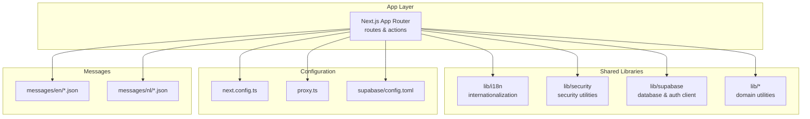

**Diagram sources**
- [next.config.ts](file://apps/hr-suite/next.config.ts)
- [proxy.ts](file://apps/hr-suite/proxy.ts)
- [supabase/config.toml](file://apps/hr-suite/supabase/config.toml)

**Section sources**
- [package.json](file://apps/hr-suite/package.json)
- [next.config.ts](file://apps/hr-suite/next.config.ts)
- [proxy.ts](file://apps/hr-suite/proxy.ts)

## Core Components
- Authentication helpers: Server routes and actions manage sign-in callbacks, sign-out flows, password resets, and invitation acceptance. These encapsulate session handling and redirect logic.
- Security utilities: Centralized helpers for authorization checks, input validation, and safe operations across domains.
- Internationalization services: Message catalogs per locale with consistent key naming and helper utilities for formatting and fallbacks.
- Common data transformations: Reusable formatters, validators, and converters used by multiple features (e.g., dates, IDs, enums).
- Error handling patterns: Consistent error shapes, user-facing messages, and server-side logging strategies.
- Logging mechanisms: Structured logs for requests, errors, and performance metrics where applicable.
- Configuration management: Environment-driven settings for APIs, Supabase, and feature flags.
- Date/time operations: Standardized formatting, parsing, and timezone handling utilities.
- File handling: Secure upload/download helpers and metadata processing.
- API communication: Centralized HTTP clients and request/response transformers.

**Section sources**
- [auth/callback/route.ts](file://apps/hr-suite/app/auth/callback/route.ts)
- [auth/signout/route.ts](file://apps/hr-suite/app/auth/signout/route.ts)
- [auth/reset-password/actions.ts](file://apps/hr-suite/app/auth/reset-password/actions.ts)
- [invite/[token]/actions.ts](file://apps/hr-suite/app/invite/[token]/actions.ts)
- [lib/i18n directory](file://apps/hr-suite/lib/i18n)
- [lib/security directory](file://apps/hr-suite/lib/security)
- [lib/supabase directory](file://apps/hr-suite/lib/supabase)

## Architecture Overview
The application uses Next.js App Router for server routes and actions, which coordinate with shared libraries for authentication, security, i18n, and data access. Supabase provides database and authentication services. Messages are localized through JSON catalogs.

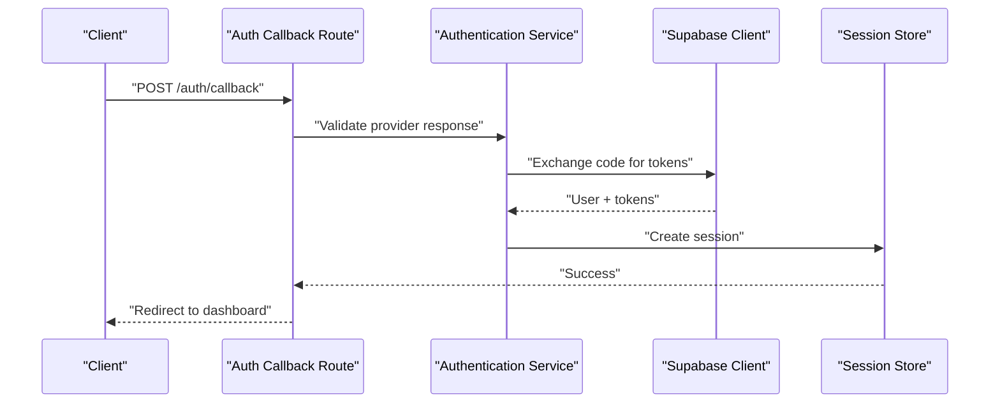

**Diagram sources**
- [auth/callback/route.ts](file://apps/hr-suite/app/auth/callback/route.ts)

## Detailed Component Analysis

### Authentication Helpers
Authentication flows are implemented as Next.js server routes and actions:
- Callback route handles provider responses, token exchange, and session creation.
- Signout route clears sessions and redirects appropriately.
- Password reset actions manage secure token workflows and notifications.
- Invitation actions validate tokens and complete onboarding steps.

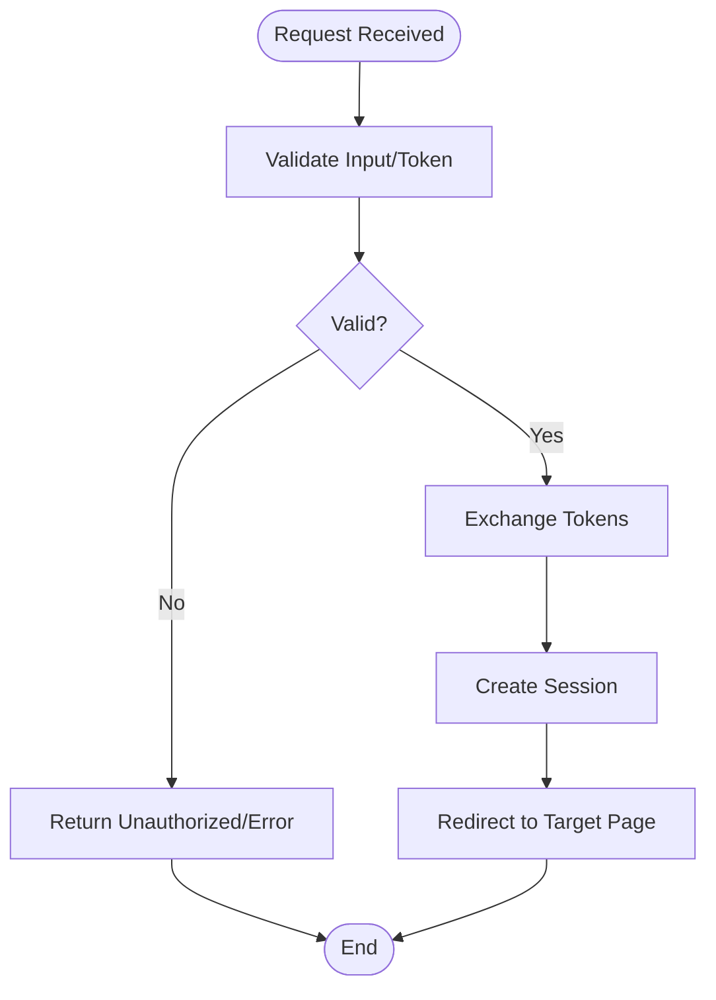

**Diagram sources**
- [auth/callback/route.ts](file://apps/hr-suite/app/auth/callback/route.ts)
- [auth/signout/route.ts](file://apps/hr-suite/app/auth/signout/route.ts)
- [auth/reset-password/actions.ts](file://apps/hr-suite/app/auth/reset-password/actions.ts)
- [invite/[token]/actions.ts](file://apps/hr-suite/app/invite/[token]/actions.ts)

**Section sources**
- [auth/callback/route.ts](file://apps/hr-suite/app/auth/callback/route.ts)
- [auth/signout/route.ts](file://apps/hr-suite/app/auth/signout/route.ts)
- [auth/reset-password/actions.ts](file://apps/hr-suite/app/auth/reset-password/actions.ts)
- [invite/[token]/actions.ts](file://apps/hr-suite/app/invite/[token]/actions.ts)

### Security Utilities
Security utilities centralize authorization checks, input validation, and safe operations. They ensure consistent enforcement across routes and actions.

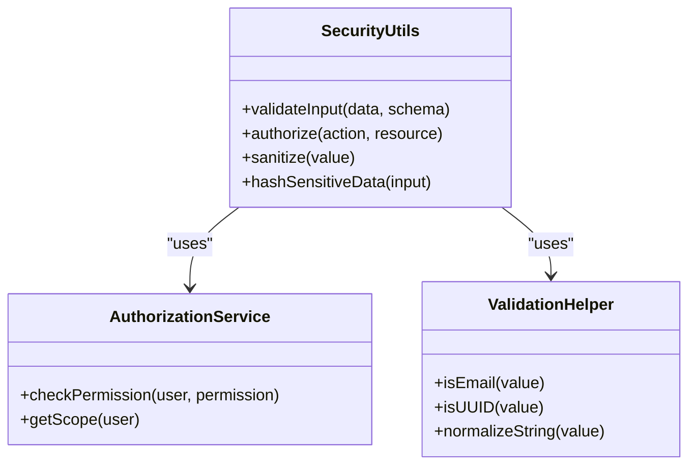

**Diagram sources**
- [lib/security directory](file://apps/hr-suite/lib/security)

**Section sources**
- [lib/security directory](file://apps/hr-suite/lib/security)

### Internationalization Services
Internationalization is managed through message catalogs per locale and helper utilities for formatting and fallbacks.

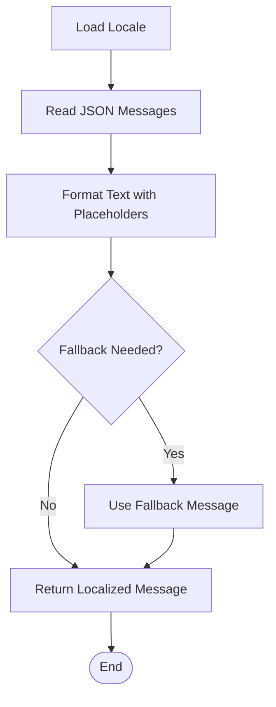

**Diagram sources**
- [i18n configuration files](file://apps/hr-suite/messages/en/common.json)
- [i18n configuration files](file://apps/hr-suite/messages/nl/common.json)
- [lib/i18n directory](file://apps/hr-suite/lib/i18n)

**Section sources**
- [i18n configuration files](file://apps/hr-suite/messages/en/common.json)
- [i18n configuration files](file://apps/hr-suite/messages/nl/common.json)
- [lib/i18n directory](file://apps/hr-suite/lib/i18n)

### Common Data Transformation Functions
Reusable functions handle date/time formatting, ID normalization, enum mapping, and data sanitization. These are used across domains to ensure consistency.

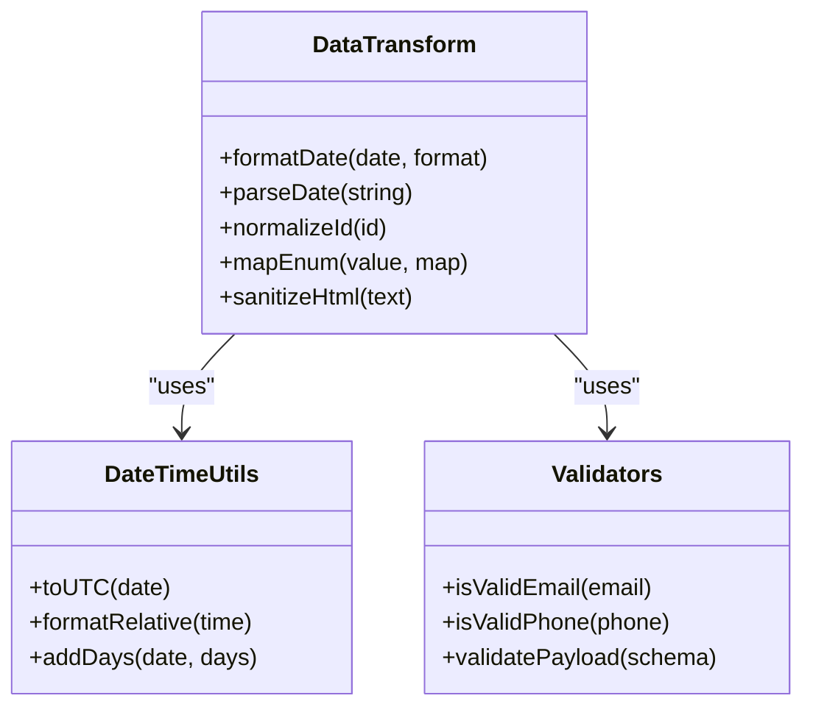

**Diagram sources**
- [lib/app-version.ts](file://apps/hr-suite/lib/app-version.ts)
- [lib/app-version.test.ts](file://apps/hr-suite/lib/app-version.test.ts)

**Section sources**
- [lib/app-version.ts](file://apps/hr-suite/lib/app-version.ts)
- [lib/app-version.test.ts](file://apps/hr-suite/lib/app-version.test.ts)

### Error Handling Patterns
Consistent error handling includes structured error objects, user-friendly messages, and server-side logging. Routes and actions return standardized error responses.

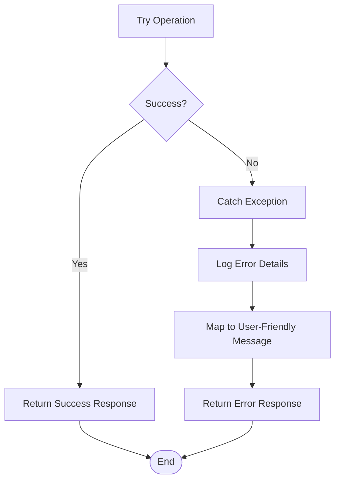

**Diagram sources**
- [auth/callback/route.ts](file://apps/hr-suite/app/auth/callback/route.ts)
- [auth/signout/route.ts](file://apps/hr-suite/app/auth/signout/route.ts)

**Section sources**
- [auth/callback/route.ts](file://apps/hr-suite/app/auth/callback/route.ts)
- [auth/signout/route.ts](file://apps/hr-suite/app/auth/signout/route.ts)

### Logging Mechanisms
Logging captures request details, errors, and performance metrics. Logs are structured for easy analysis and monitoring.

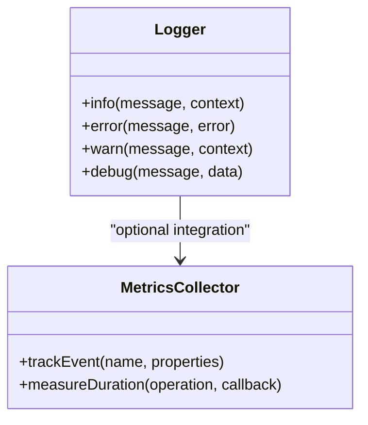

**Diagram sources**
- [lib/security directory](file://apps/hr-suite/lib/security)

**Section sources**
- [lib/security directory](file://apps/hr-suite/lib/security)

### Configuration Management
Configuration is managed through Next.js config, proxy settings, and Supabase configuration. Environment variables control behavior across environments.

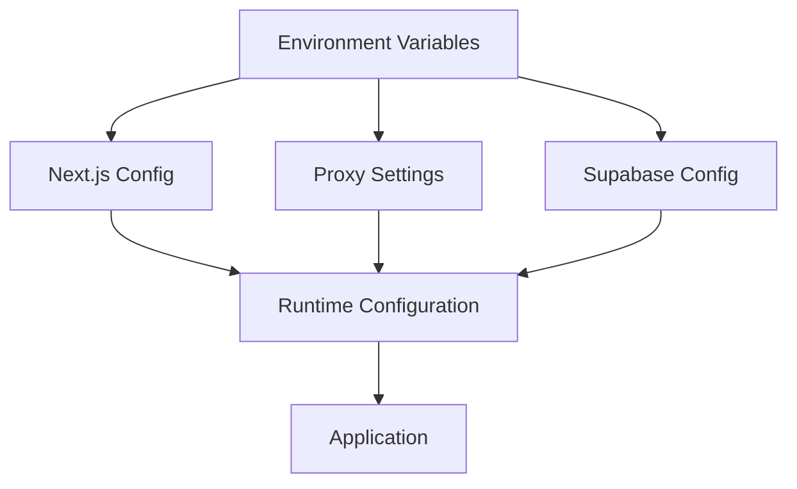

**Diagram sources**
- [next.config.ts](file://apps/hr-suite/next.config.ts)
- [proxy.ts](file://apps/hr-suite/proxy.ts)
- [supabase/config.toml](file://apps/hr-suite/supabase/config.toml)

**Section sources**
- [next.config.ts](file://apps/hr-suite/next.config.ts)
- [proxy.ts](file://apps/hr-suite/proxy.ts)
- [supabase/config.toml](file://apps/hr-suite/supabase/config.toml)

### Date/Time Operations
Standardized utilities handle date parsing, formatting, and timezone conversions. These ensure consistent time handling across the application.

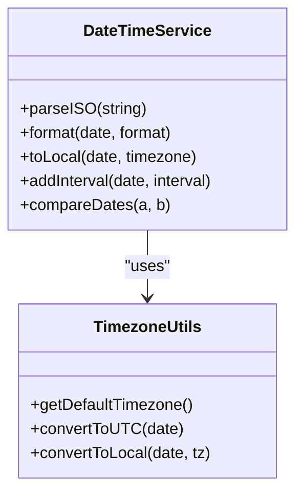

**Diagram sources**
- [lib/app-version.ts](file://apps/hr-suite/lib/app-version.ts)

**Section sources**
- [lib/app-version.ts](file://apps/hr-suite/lib/app-version.ts)

### File Handling
Secure file operations include upload validation, storage integration, and metadata processing. Files are handled with proper security checks and error handling.

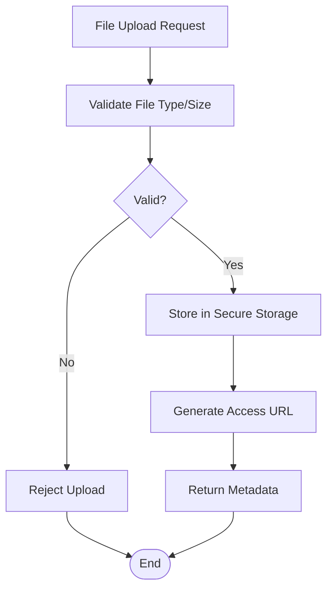

**Diagram sources**
- [lib/supabase directory](file://apps/hr-suite/lib/supabase)

**Section sources**
- [lib/supabase directory](file://apps/hr-suite/lib/supabase)

### API Communication
Centralized HTTP clients handle API requests, response transformations, and error handling. They provide consistent interfaces for external services.

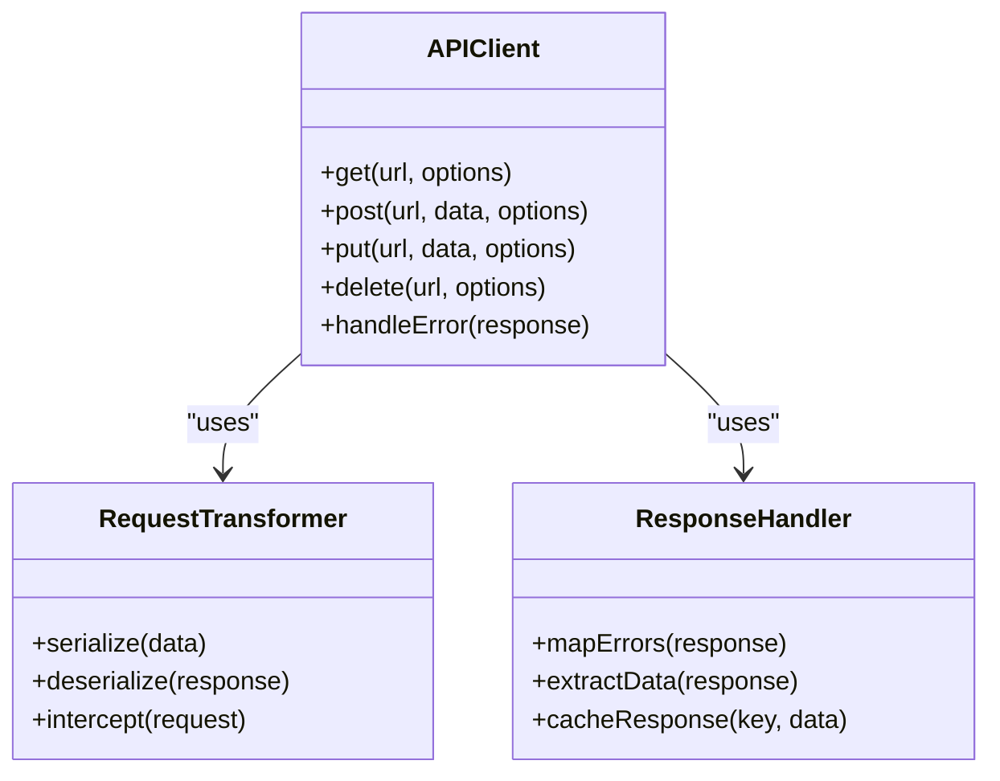

**Diagram sources**
- [lib/supabase directory](file://apps/hr-suite/lib/supabase)

**Section sources**
- [lib/supabase directory](file://apps/hr-suite/lib/supabase)

## Dependency Analysis
Shared utilities have well-defined dependencies to avoid circular references and ensure maintainability.

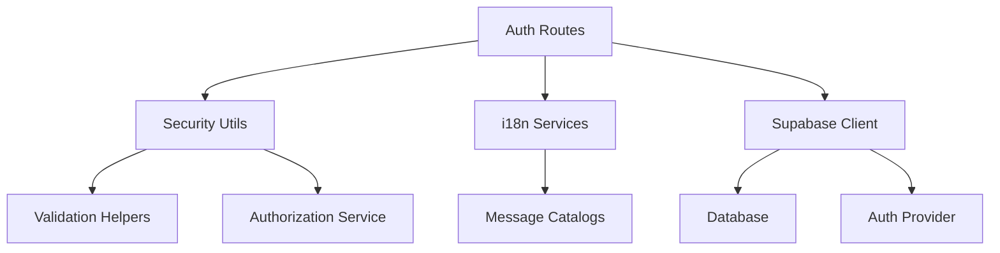

**Diagram sources**
- [auth/callback/route.ts](file://apps/hr-suite/app/auth/callback/route.ts)
- [lib/security directory](file://apps/hr-suite/lib/security)
- [lib/i18n directory](file://apps/hr-suite/lib/i18n)
- [lib/supabase directory](file://apps/hr-suite/lib/supabase)

**Section sources**
- [auth/callback/route.ts](file://apps/hr-suite/app/auth/callback/route.ts)
- [lib/security directory](file://apps/hr-suite/lib/security)
- [lib/i18n directory](file://apps/hr-suite/lib/i18n)
- [lib/supabase directory](file://apps/hr-suite/lib/supabase)

## Performance Considerations
- Cache frequently accessed data like i18n messages and configuration values.
- Use efficient date/time operations and avoid unnecessary conversions.
- Implement proper error boundaries to prevent cascading failures.
- Optimize API calls with batching and caching strategies.
- Monitor memory usage and garbage collection patterns in long-running processes.

## Troubleshooting Guide
Common issues and their resolutions:
- Authentication failures: Check token exchange and session creation logs.
- i18n missing keys: Verify message catalogs and fallback mechanisms.
- Database connection errors: Validate Supabase configuration and network connectivity.
- File upload failures: Review file validation rules and storage permissions.
- API timeouts: Implement retry logic and monitor external service health.

**Section sources**
- [auth/callback/route.ts](file://apps/hr-suite/app/auth/callback/route.ts)
- [auth/signout/route.ts](file://apps/hr-suite/app/auth/signout/route.ts)
- [lib/security directory](file://apps/hr-suite/lib/security)
- [lib/supabase directory](file://apps/hr-suite/lib/supabase)

## Conclusion
LiquidHR’s shared utilities and services provide a robust foundation for authentication, security, internationalization, data transformation, error handling, logging, configuration, date/time operations, file handling, and API communication. These components ensure consistency, maintainability, and scalability across the application’s business logic layer. By following established patterns and leveraging centralized abstractions, developers can build reliable features that integrate seamlessly with the existing architecture.