# Security Implementation

<cite>
**Referenced Files in This Document**
- [apps/hr-suite/app/auth/callback/route.ts](file://apps/hr-suite/app/auth/callback/route.ts)
- [apps/hr-suite/app/auth/signout/route.ts](file://apps/hr-suite/app/auth/signout/route.ts)
- [apps/hr-suite/app/api/context/route.ts](file://apps/hr-suite/app/api/context/route.ts)
- [apps/hr-suite/app/api/roles/route.ts](file://apps/hr-suite/app/api/roles/route.ts)
- [apps/hr-suite/app/api/employees/route.ts](file://apps/hr-suite/app/api/employees/route.ts)
- [apps/hr-suite/app/api/employees/[employeeId]/route.ts](file://apps/hr-suite/app/api/employees/[employeeId]/route.ts)
- [apps/hr-suite/app/api/custom-fields/route.ts](file://apps/hr-suite/app/api/custom-fields/route.ts)
- [apps/hr-suite/app/api/dashboards/route.ts](file://apps/hr-suite/app/api/dashboards/route.ts)
- [apps/hr-suite/app/api/leave/request/route.ts](file://apps/hr-suite/app/api/leave/request/route.ts)
- [apps/hr-suite/app/api/organization-chart/route.ts](file://apps/hr-suite/app/api/organization-chart/route.ts)
- [apps/hr-suite/app/api/hr-events/route.ts](file://apps/hr-suite/app/api/hr-events/route.ts)
- [apps/hr-suite/app/api/address-lookup/route.ts](file://apps/hr-suite/app/api/address-lookup/route.ts)
- [apps/hr-suite/app/api/address-suggestions/route.ts](file://apps/hr-suite/app/api/address-suggestions/route.ts)
- [apps/hr-suite/supabase/migrations/20260712124911_add_tenant_rbac_and_organization.sql](file://apps/hr-suite/supabase/migrations/20260712124911_add_tenant_rbac_and_organization.sql)
- [apps/hr-suite/supabase/migrations/20260712125420_revoke_public_rls_trigger_execution.sql](file://apps/hr-suite/supabase/migrations/20260712125420_revoke_public_rls_trigger_execution.sql)
- [apps/hr-suite/supabase/migrations/20260712125522_optimize_rbac_indexes_and_policies.sql](file://apps/hr-suite/supabase/migrations/20260712125522_optimize_rbac_indexes_and_policies.sql)
- [apps/hr-suite/supabase/migrations/20260714170949_harden_organization_authorization.sql](file://apps/hr-suite/supabase/migrations/20260714170949_harden_organization_authorization.sql)
- [apps/hr-suite/supabase/migrations/20260714171241_link_employees_from_auth_trigger.sql](file://apps/hr-suite/supabase/migrations/20260714171241_link_employees_from_auth_trigger.sql)
- [apps/hr-suite/supabase/migrations/20260714174305_add_multitenancy_administrations.sql](file://apps/hr-suite/supabase/migrations/20260714174305_add_multitenancy_administrations.sql)
- [apps/hr-suite/supabase/migrations/20260714175659_seed_multitenancy_demo.sql](file://apps/hr-suite/supabase/migrations/20260714175659_seed_multitenancy_demo.sql)
- [apps/hr-suite/supabase/migrations/20260714180142_enforce_administration_management_scope.sql](file://apps/hr-suite/supabase/migrations/20260714180142_enforce_administration_management_scope.sql)
- [apps/hr-suite/supabase/migrations/20260714180309_index_employee_organization_scope_foreign_keys.sql](file://apps/hr-suite/supabase/migrations/20260714180309_index_employee_organization_scope_foreign_keys.sql)
- [apps/hr-suite/supabase/migrations/20260715064245_add_user_invitations.sql](file://apps/hr-suite/supabase/migrations/20260715064245_add_user_invitations.sql)
- [apps/hr-suite/supabase/migrations/20260715064924_harden_user_invitation_acceptance.sql](file://apps/hr-suite/supabase/migrations/20260715064924_harden_user_invitation_acceptance.sql)
- [apps/hr-suite/supabase/migrations/20260715070404_add_user_preferences.sql](file://apps/hr-suite/supabase/migrations/20260715070404_add_user_preferences.sql)
- [apps/hr-suite/supabase/migrations/20260715071054_add_employee_identity_matching.sql](file://apps/hr-suite/supabase/migrations/20260715071054_add_employee_identity_matching.sql)
- [apps/hr-suite/supabase/migrations/20260715071156_add_employment_core.sql](file://apps/hr-suite/supabase/migrations/20260715071156_add_employment_core.sql)
- [apps/hr-suite/supabase/migrations/20260715071422_add_employment_timelines.sql](file://apps/hr-suite/supabase/migrations/20260715071422_add_employment_timelines.sql)
- [apps/hr-suite/supabase/migrations/20260715071717_add_employment_terminations.sql](file://apps/hr-suite/supabase/migrations/20260715071717_add_employment_terminations.sql)
- [apps/hr-suite/supabase/migrations/20260715072010_harden_employment_security.sql](file://apps/hr-suite/supabase/migrations/20260715072010_harden_employment_security.sql)
- [apps/hr-suite/supabase/migrations/20260715120810_complete_employee_core.sql](file://apps/hr-suite/supabase/migrations/20260715120810_complete_employee_core.sql)
- [apps/hr-suite/supabase/migrations/20260715121304_optimize_employee_core_indexes.sql](file://apps/hr-suite/supabase/migrations/20260715121304_optimize_employee_core_indexes.sql)
- [apps/hr-suite/supabase/migrations/20260715122802_add_custom_field_definitions.sql](file://apps/hr-suite/supabase/migrations/20260715122802_add_custom_field_definitions.sql)
- [apps/hr-suite/supabase/migrations/20260715123119_add_custom_field_value_rpc.sql](file://apps/hr-suite/supabase/migrations/20260715123119_add_custom_field_value_rpc.sql)
- [apps/hr-suite/supabase/migrations/20260715123639_add_organization_authorization_management.sql](file://apps/hr-suite/supabase/migrations/20260715123639_add_organization_authorization_management.sql)
- [apps/hr-suite/supabase/migrations/20260715123927_harden_custom_field_values.sql](file://apps/hr-suite/supabase/migrations/20260715123927_harden_custom_field_values.sql)
- [apps/hr-suite/supabase/migrations/20260715124506_isolate_employee_secure_identifiers.sql](file://apps/hr-suite/supabase/migrations/20260715124506_isolate_employee_secure_identifiers.sql)
- [apps/hr-suite/supabase/migrations/20260715124744_allow_logged_bsn_reveal.sql](file://apps/hr-suite/supabase/migrations/20260715124744_allow_logged_bsn_reveal.sql)
- [apps/hr-suite/supabase/migrations/20260715130026_index_secure_employee_foreign_keys.sql](file://apps/hr-suite/supabase/migrations/20260715130026_index_secure_employee_foreign_keys.sql)
- [apps/hr-suite/supabase/migrations/20260715131230_seed_custom_fields_and_tenant_roles.sql](file://apps/hr-suite/supabase/migrations/20260715131230_seed_custom_fields_and_tenant_roles.sql)
- [apps/hr-suite/supabase/migrations/20260715141843_add_employment_change_management.sql](file://apps/hr-suite/supabase/migrations/20260715141843_add_employment_change_management.sql)
- [apps/hr-suite/supabase/migrations/20260715145432_optimize_employment_change_management.sql](file://apps/hr-suite/supabase/migrations/20260715145432_optimize_employment_change_management.sql)
- [apps/hr-suite/supabase/migrations/20260715173629_restore_employee_subresource_grants.sql](file://apps/hr-suite/supabase/migrations/20260715173629_restore_employee_subresource_grants.sql)
- [apps/hr-suite/supabase/migrations/20260716081000_add_time_hub_reminders.sql](file://apps/hr-suite/supabase/migrations/20260716081000_add_time_hub_reminders.sql)
- [apps/hr-suite/supabase/migrations/20260716090000_fix_reminder_recipient_rls_recursion.sql](file://apps/hr-suite/supabase/migrations/20260716090000_fix_reminder_recipient_rls_recursion.sql)
- [apps/hr-suite/supabase/migrations/20260716092000_fix_reminder_publish_auth_lookup.sql](file://apps/hr-suite/supabase/migrations/20260716092000_fix_reminder_publish_auth_lookup.sql)
- [apps/hr-suite/supabase/migrations/20260716092637_add_hera_ai_agent.sql](file://apps/hr-suite/supabase/migrations/20260716092637_add_hera_ai_agent.sql)
- [apps/hr-suite/supabase/migrations/20260716100000_add_combined_employment_change_sets.sql](file://apps/hr-suite/supabase/migrations/20260716100000_add_combined_employment_change_sets.sql)
- [apps/hr-suite/ssupabase/migrations/20260716110000_add_organization_chart_read_model.sql](file://apps/hr-suite/supabase/migrations/20260716110000_add_organization_chart_read_model.sql)
- [apps/hr-suite/supabase/migrations/20260716120000_add_personal_dashboards.sql](file://apps/hr-suite/supabase/migrations/20260716120000_add_personal_dashboards.sql)
- [apps/hr-suite/supabase/migrations/20260717100000_harden_hera_memory_and_preferences.sql](file://apps/hr-suite/supabase/migrations/20260717100000_harden_hera_memory_and_preferences.sql)
- [apps/hr-suite/supabase/migrations/20260717100500_index_hera_preferences.sql](file://apps/hr-suite/supabase/migrations/20260717100500_index_hera_preferences.sql)
- [apps/hr-suite/supabase/migrations/20260717101000_add_hera_message_metadata.sql](file://apps/hr-suite/supabase/migrations/20260717101000_add_hera_message_metadata.sql)
- [apps/hr-suite/supabase/migrations/20260718090000_complete_employment_flow.sql](file://apps/hr-suite/supabase/migrations/20260718090000_complete_employment_flow.sql)
- [apps/hr-suite/supabase/migrations/20260718100000_add_job_catalog_salary_revisions.sql](file://apps/hr-suite/supabase/migrations/20260718100000_add_job_catalog_salary_revisions.sql)
- [apps/hr-suite/supabase/migrations/20260718100500_add_master_data_mutation_rpcs.sql](file://apps/hr-suite/supabase/migrations/20260718100500_add_master_data_mutation_rpcs.sql)
- [apps/hr-suite/supabase/migrations/20260718100600_index_master_data_foreign_keys.sql](file://apps/hr-suite/supabase/migrations/20260718100600_index_master_data_foreign_keys.sql)
- [apps/hr-suite/supabase/migrations/20260718110000_add_employee_document_dossiers.sql](file://apps/hr-suite/supabase/migrations/20260718110000_add_employee_document_dossiers.sql)
- [apps/hr-suite/supabase/migrations/20260718110100_fix_document_reminder_recipient_resolution.sql](file://apps/hr-suite/supabase/migrations/20260718110100_fix_document_reminder_recipient_resolution.sql)
- [apps/hr-suite/supabase/migrations/20260718120000_add_hr_change_event_projection.sql](file://apps/hr-suite/supabase/migrations/20260718120000_add_hr_change_event_projection.sql)
- [apps/hr-suite/supabase/migrations/20260718121308_add_settings_modules_work_patterns_holidays.sql](file://apps/hr-suite/supabase/migrations/20260718121308_add_settings_modules_work_patterns_holidays.sql)
- [apps/hr-suite/supabase/migrations/20260718122138_harden_settings_rosters_holidays.sql](file://apps/hr-suite/supabase/migrations/20260718122138_harden_settings_rosters_holidays.sql)
- [apps/hr-suite/supabase/migrations/20260718122614_enforce_optional_module_guards.sql](file://apps/hr-suite/supabase/migrations/20260718122614_enforce_optional_module_guards.sql)
- [apps/hr-suite/supabase/migrations/20260718122751_expose_module_state_to_tenant_users.sql](file://apps/hr-suite/supabase/migrations/20260718122751_expose_module_state_to_tenant_users.sql)
- [apps/hr-suite/supabase/migrations/20260718123742_add_holiday_snapshot_import.sql](file://apps/hr-suite/supabase/migrations/20260718123742_add_holiday_snapshot_import.sql)
- [apps/hr-suite/supabase/migrations/20260718124240_allow_hr_calendar_recipient_read.sql](file://apps/hr-suite/supabase/migrations/20260718124240_allow_hr_calendar_recipient_read.sql)
- [apps/hr-suite/supabase/migrations/20260718130000_add_hr_calendar_permission.sql](file://apps/hr-suite/supabase/migrations/20260718130000_add_hr_calendar_permission.sql)
- [apps/hr-suite/supabase/migrations/20260718131000_harden_hr_master_data_document_policies.sql](file://apps/hr-suite/supabase/migrations/20260718131000_harden_hr_master_data_document_policies.sql)
- [apps/hr-suite/supabase/migrations/20260718132000_split_reminder_target_write_policy.sql](file://apps/hr-suite/supabase/migrations/20260718132000_split_reminder_target_write_policy.sql)
- [apps/hr-suite/supabase/migrations/20260718150000_add_employee_archive_and_avatar_state.sql](file://apps/hr-suite/supabase/migrations/20260718150000_add_employee_archive_and_avatar_state.sql)
- [apps/hr-suite/supabase/migrations/20260718170000_add_dashboard_widget_catalog.sql](file://apps/hr-suite/supabase/migrations/20260718170000_add_dashboard_widget_catalog.sql)
- [apps/hr-suite/supabase/migrations/20260718171000_relax_dashboard_widget_read_scope.sql](file://apps/hr-suite/supabase/migrations/20260718171000_relax_dashboard_widget_read_scope.sql)
- [apps/hr-suite/supabase/migrations/20260718172000_expand_personal_dashboard_widget_types.sql](file://apps/hr-suite/supabase/migrations/20260718172000_expand_personal_dashboard_widget_types.sql)
- [apps/hr-suite/supabase/migrations/20260718172051_grant_dashboard_widget_admin_permissions.sql](file://apps/hr-suite/supabase/migrations/20260718172051_grant_dashboard_widget_admin_permissions.sql)
- [apps/hr-suite/supabase/migrations/20260718173000_tune_dashboard_widget_policies.sql](file://apps/hr-suite/supabase/migrations/20260718173000_tune_dashboard_widget_policies.sql)
- [apps/hr-suite/supabase/migrations/20260718180354_add_date_time_user_preferences.sql](file://apps/hr-suite/supabase/migrations/20260718180354_add_date_time_user_preferences.sql)
- [apps/hr-suite/supabase/migrations/20260719101500_refine_employee_document_upload_rules.sql](file://apps/hr-suite/supabase/migrations/20260719101500_refine_employee_document_upload_rules.sql)
- [apps/hr-suite/supabase/migrations/20260719112000_add_week_numbering_user_preference.sql](file://apps/hr-suite/supabase/migrations/20260719112000_add_week_numbering_user_preference.sql)
- [apps/hr-suite/supabase/migrations/20260719153000_add_star_performer_management.sql](file://apps/hr-suite/supabase/migrations/20260719153000_add_star_performer_management.sql)
- [apps/hr-suite/supabase/migrations/20260719170000_add_tenant_relation_type_catalog.sql](file://apps/hr-suite/supabase/migrations/20260719170000_add_tenant_relation_type_catalog.sql)
- [apps/hr-suite/supabase/migrations/20260719180000_allow_custom_relation_type_catalog_entries.sql](file://apps/hr-suite/supabase/migrations/20260719180000_allow_custom_relation_type_catalog_entries.sql)
- [apps/hr-suite/supabase/migrations/20260719181000_index_relation_type_catalog_fk.sql](file://apps/hr-suite/supabase/migrations/20260719181000_index_relation_type_catalog_fk.sql)
- [apps/hr-suite/supabase/migrations/20260722142551_add_leave_engine_foundation.sql](file://apps/hr-suite/supabase/migrations/20260722142551_add_leave_engine_foundation.sql)
- [apps/hr-suite/supabase/migrations/20260722144232_add_leave_engine_fk_indexes.sql](file://apps/hr-suite/supabase/migrations/20260722144232_add_leave_engine_fk_indexes.sql)
- [apps/hr-suite/supabase/migrations/20260722144344_add_leave_transaction_bucket_fk_index.sql](file://apps/hr-suite/supabase/mupabase/migrations/20260722144344_add_leave_transaction_bucket_fk_index.sql)
- [apps/hr-suite/supabase/migrations/20260722151920_add_leave_configuration_mutation_functions.sql](file://apps/hr-suite/supabase/migrations/20260722151920_add_leave_configuration_mutation_functions.sql)
- [apps/hr-suite/supabase/migrations/20260722173000_add_work_hour_type_colors.sql](file://apps/hr-suite/supabase/migrations/20260722173000_add_work_hour_type_colors.sql)
- [apps/hr-suite/supabase/migrations/20260722173100_normalize_catalog_color_defaults.sql](file://apps/hr-suite/supabase/migrations/20260722173100_normalize_catalog_color_defaults.sql)
- [apps/hr-suite/supabase/migrations/20260722190000_add_leave_request_booking_engine.sql](file://apps/hr-suite/supabase/migrations/20260722190000_add_leave_request_booking_engine.sql)
- [apps/hr-suite/supabase/migrations/20260722190500_seed_leave_demo_linda.sql](file://apps/hr-suite/supabase/migrations/20260722190500_seed_leave_demo_linda.sql)
- [apps/hr-suite/supabase/migrations/20260722191500_add_leave_request_fk_indexes.sql](file://apps/hr-suite/supabase/migrations/20260722191500_add_leave_request_fk_indexes.sql)
- [apps/hr-suite/supabase/migrations/20260722192000_add_leave_ledger_operations.sql](file://apps/hr-suite/supabase/migrations/20260722192000_add_leave_ledger_operations.sql)
- [apps/hr-suite/supabase/migrations/20260722192100_seed_leave_demo_year_controls.sql](file://apps/hr-suite/supabase/migrations/20260722192100_seed_leave_demo_year_controls.sql)
- [apps/hr-suite/supabase/migrations/20260722192500_skip_holidays_in_leave_requests.sql](file://apps/hr-suite/supabase/migrations/20260722192500_skip_holidays_in_leave_requests.sql)
- [apps/hr-suite/supabase/migrations/20260723151000_optimize_employee_overview.sql](file://apps/hr-suite/supabase/migrations/20260723151000_optimize_employee_overview.sql)
- [apps/hr-suite/supabase/migrations/20260724095433_insights_report_permissions.sql](file://apps/hr-suite/supabase/migrations/20260724095433_insights_report_permissions.sql)
- [apps/hr-suite/supabase/migrations/20260724100605_upcoming_events_and_anniversary_rules.sql](file://apps/hr-suite/supabase/migrations/20260724100605_upcoming_events_and_anniversary_rules.sql)
- [apps/hr-suite/supabase/migrations/20260724103939_simplify_roles_and_insights_events.sql](file://apps/hr-suite/supabase/migrations/202660724103939_simplify_roles_and_insights_events.sql)
- [apps/hr-suite/supabase/migrations/20260724112407_add_role_assignment_scope.sql](file://apps/hr-suite/supabase/migrations/20260724112407_add_role_assignment_scope.sql)
- [apps/hr-suite/supabase/migrations/20260724160000_add_employee_activity_entries.sql](file://apps/hr-suite/supabase/migrations/20260724160000_add_employee_activity_entries.sql)
- [apps/hr-suite/supabase/migrations/20260724172716_harden_employee_activity_entries.sql](file://apps/hr-suite/supabase/migrations/20260724172716_harden_employee_activity_entries.sql)
- [apps/hr-suite/supabase/migrations/20260725132351_address_input_internationalization.sql](file://apps/hr-suite/supabase/migrations/20260725132351_address_input_internationalization.sql)
- [apps/hr-suite/supabase/config.toml](file://apps/hr-suite/supabase/config.toml)
</cite>

## Table of Contents
1. [Introduction](#introduction)
2. [Project Structure](#project-structure)
3. [Core Components](#core-components)
4. [Architecture Overview](#architecture-overview)
5. [Detailed Component Analysis](#detailed-component-analysis)
6. [Dependency Analysis](#dependency-analysis)
7. [Performance Considerations](#performance-considerations)
8. [Troubleshooting Guide](#troubleshooting-guide)
9. [Conclusion](#conclusion)
10. [Appendices](#appendices)

## Introduction
This document provides a comprehensive security implementation guide for LiquidHR’s authentication, authorization, and data protection mechanisms. It covers JWT token handling, session management, user identity verification, Row Level Security (RLS), role-based access control (RBAC), tenant isolation, input validation and sanitization, rate limiting, audit logging, and monitoring. It also includes secure API patterns, permission checks, and best practices for development teams.

## Project Structure
LiquidHR is a Next.js application with server-side API routes under apps/hr-suite/app/api and Supabase-backed database migrations under apps/hr-suite/supabase/migrations. Authentication endpoints are located under apps/hr-suite/app/auth. The architecture leverages Supabase for identity, RLS policies, and RBAC enforcement at the database layer.

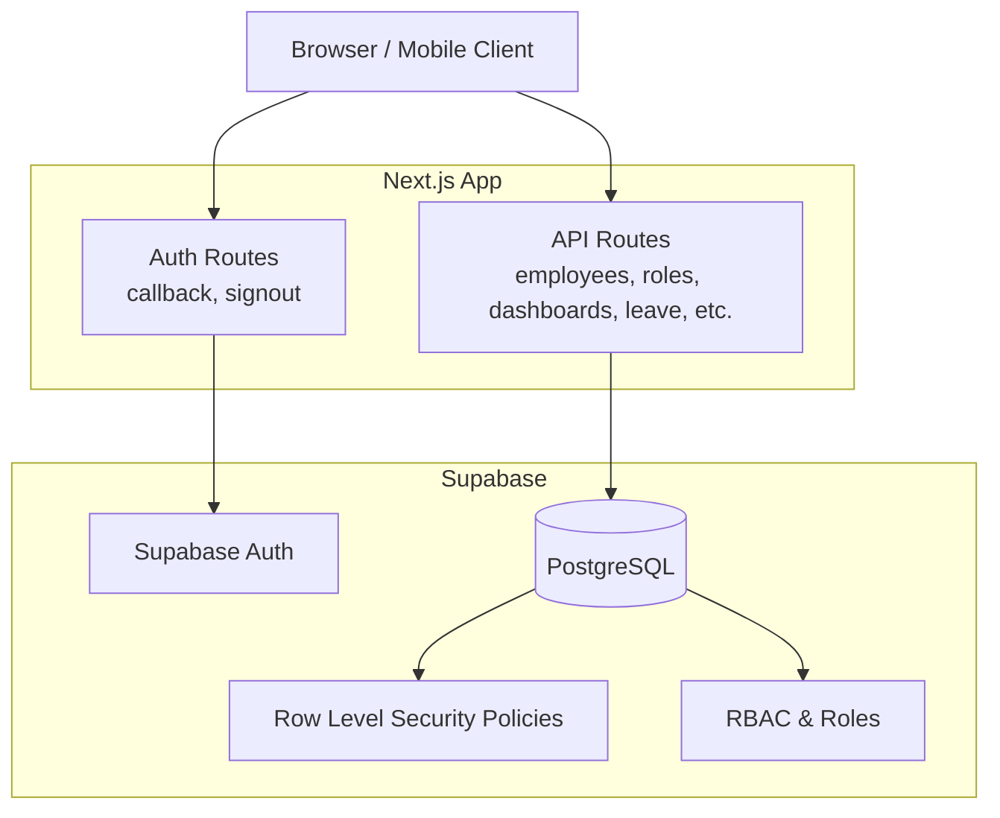

**Diagram sources**
- [apps/hr-suite/app/auth/callback/route.ts](file://apps/hr-suite/app/auth/callback/route.ts)
- [apps/hr-suite/app/auth/signout/route.ts](file://apps/hr-suite/app/auth/signout/route.ts)
- [apps/hr-suite/app/api/employees/route.ts](file://apps/hr-suite/app/api/employees/route.ts)
- [apps/hr-suite/app/api/roles/route.ts](file://apps/hr-suite/app/api/roles/route.ts)
- [apps/hr-suite/supabase/migrations/20260712124911_add_tenant_rbac_and_organization.sql](file://apps/hr-suite/supabase/migrations/20260712124911_add_tenant_rbac_and_organization.sql)

**Section sources**
- [apps/hr-suite/app/auth/callback/route.ts](file://apps/hr-suite/app/auth/callback/route.ts)
- [apps/hr-suite/app/auth/signout/route.ts](file://apps/hr-suite/app/auth/signout/route.ts)
- [apps/hr-suite/app/api/employees/route.ts](file://apps/hr-suite/app/api/employees/route.ts)
- [apps/hr-suite/app/api/roles/route.ts](file://apps/hr-suite/app/api/roles/route.ts)
- [apps/hr-suite/supabase/migrations/20260712124911_add_tenant_rbac_and_organization.sql](file://apps/hr-suite/supabase/migrations/20260712124911_add_tenant_rbac_and_organization.sql)

## Core Components
- Authentication and Session Management:
  - Callback route handles provider redirects and establishes sessions via Supabase Auth.
  - Signout route invalidates sessions and clears tokens securely.
- Context and Identity Resolution:
  - API context route resolves current user identity and tenant scope for downstream handlers.
- Role-Based Access Control:
  - Roles API exposes role definitions and assignments; enforced by RLS policies.
- Data Isolation:
  - Tenant isolation ensures users can only access data within their administration/tenant boundaries.
- Input Validation and Sanitization:
  - API routes validate inputs using schema libraries and sanitize outputs to prevent XSS.
- Audit Logging and Monitoring:
  - Activity entries and HR events capture critical actions for auditing and alerting.

**Section sources**
- [apps/hr-suite/app/auth/callback/route.ts](file://apps/hr-suite/app/auth/callback/route.ts)
- [apps/hr-suite/app/auth/signout/route.ts](file://apps/hr-suite/app/auth/signout/route.ts)
- [apps/hr-suite/app/api/context/route.ts](file://apps/hr-suite/app/api/context/route.ts)
- [apps/hr-suite/app/api/roles/route.ts](file://apps/hr-suite/app/api/roles/route.ts)
- [apps/hr-suite/supabase/migrations/20260724160000_add_employee_activity_entries.sql](file://apps/hr-suite/supabase/migrations/20260724160000_add_employee_activity_entries.sql)
- [apps/hr-suite/supabase/migrations/20260718120000_add_hr_change_event_projection.sql](file://apps/hr-suite/supabase/migrations/20260718120000_add_hr_change_event_projection.sql)

## Architecture Overview
The security architecture combines application-level controls with database-enforced policies:
- JWT Tokens: Supabase issues short-lived access tokens and refresh tokens; stored securely and refreshed as needed.
- Session Management: Server-side sessions are managed through Supabase Auth; client stores tokens in memory or secure storage.
- User Identity Verification: Each request validates the JWT and resolves the authenticated user and tenant context.
- RLS Policies: Enforce row-level access based on user roles and tenant membership.
- RBAC: Roles define permissions; assignments scoped to tenants ensure isolation.
- Tenant Isolation: Multi-tenancy enforced via foreign keys and policies tied to administrations.

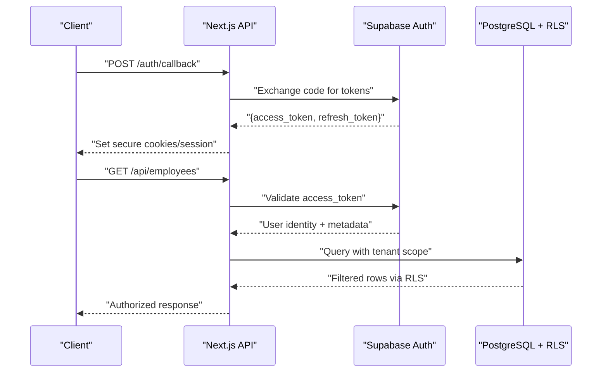

**Diagram sources**
- [apps/hr-suite/app/auth/callback/route.ts](file://apps/hr-suite/app/auth/callback/route.ts)
- [apps/hr-suite/app/api/employees/route.ts](file://apps/hr-suite/app/api/employees/route.ts)
- [apps/hr-suite/supabase/migrations/20260712124911_add_tenant_rbac_and_organization.sql](file://apps/hr-suite/supabase/migrations/20260712124911_add_tenant_rbac_and_organization.sql)

## Detailed Component Analysis

### Authentication Flow (JWT and Sessions)
- The callback route processes provider callbacks, exchanges authorization codes for tokens, and sets secure session state.
- The signout route revokes tokens and clears session cookies.
- Token lifecycle:
  - Access tokens are short-lived and validated per request.
  - Refresh tokens are used to obtain new access tokens without re-authentication.
- Security considerations:
  - Use HTTPS-only, SameSite cookies.
  - Avoid storing sensitive tokens in localStorage.
  - Implement token rotation and expiration handling.

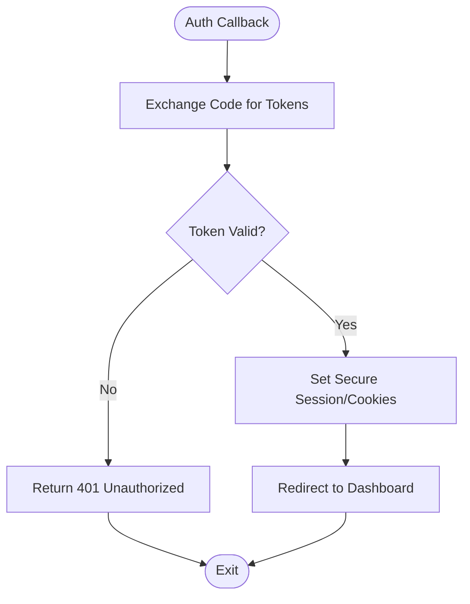

**Diagram sources**
- [apps/hr-suite/app/auth/callback/route.ts](file://apps/hr-suite/app/auth/callback/route.ts)
- [apps/hr-suite/app/auth/signout/route.ts](file://apps/hr-suite/app/auth/signout/route.ts)

**Section sources**
- [apps/hr-suite/app/auth/callback/route.ts](file://apps/hr-suite/app/auth/callback/route.ts)
- [apps/hr-suite/app/auth/signout/route.ts](file://apps/hr-suite/app/auth/signout/route.ts)

### Context and Identity Resolution
- The context route resolves the current user’s identity and tenant scope for subsequent API calls.
- Ensures that all downstream operations inherit the authenticated context.
- Validates claims and maps them to internal roles and scopes.

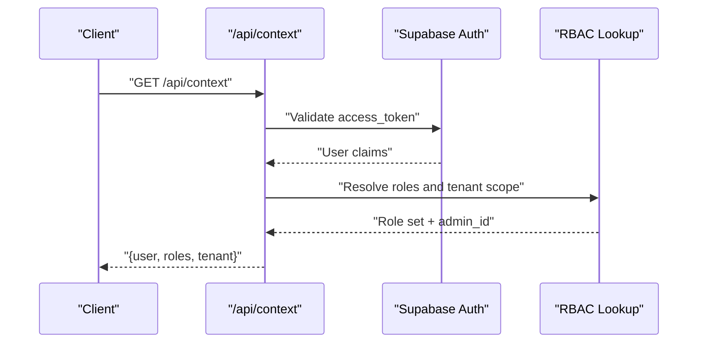

**Diagram sources**
- [apps/hr-suite/app/api/context/route.ts](file://apps/hr-suite/app/api/context/route.ts)
- [apps/hr-suite/supabase/migrations/20260712124911_add_tenant_rbac_and_organization.sql](file://apps/hr-suite/supabase/migrations/20260712124911_add_tenant_rbac_and_organization.sql)

**Section sources**
- [apps/hr-suite/app/api/context/route.ts](file://apps/hr-suite/app/api/context/route.ts)

### Role-Based Access Control (RBAC)
- Roles and assignments are managed via the roles API and enforced by RLS policies.
- Role scoping ensures users can only act within their tenant boundaries.
- Permission checks occur both at the API layer and database layer for defense-in-depth.

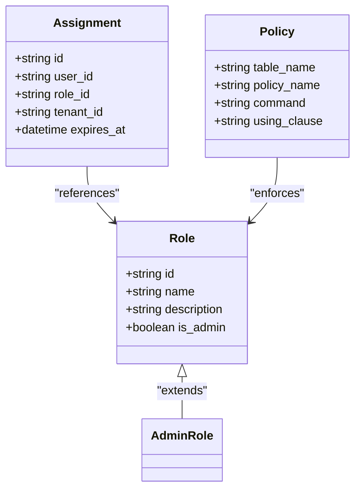

**Diagram sources**
- [apps/hr-suite/app/api/roles/route.ts](file://apps/hr-suite/app/api/roles/route.ts)
- [apps/hr-suite/supabase/migrations/20260712124911_add_tenant_rbac_and_organization.sql](file://apps/hr-suite/supabase/migrations/20260712124911_add_tenant_rbac_and_organization.sql)
- [apps/hr-suite/supabase/migrations/202607125522_optimize_rbac_indexes_and_policies.sql](file://apps/hr-suite/supabase/migrations/202607125522_optimize_rbac_indexes_and_policies.sql)

**Section sources**
- [apps/hr-suite/app/api/roles/route.ts](file://apps/hr-suite/app/api/roles/route.ts)
- [apps/hr-suite/supabase/migrations/20260712124911_add_tenant_rbac_and_organization.sql](file://apps/hr-suite/supabase/migrations/20260712124911_add_tenant_rbac_and_organization.sql)
- [apps/hr-suite/supabase/migrations/202607125522_optimize_rbac_indexes_and_policies.sql](file://apps/hr-suite/supabase/migrations/202607125522_optimize_rbac_indexes_and_policies.sql)

### Employee Data Access and RLS
- Employee endpoints enforce tenant isolation and role-based permissions.
- RLS policies restrict read/write operations based on user roles and employee ownership.
- Subresources (addresses, documents, bank accounts) inherit parent-level permissions.

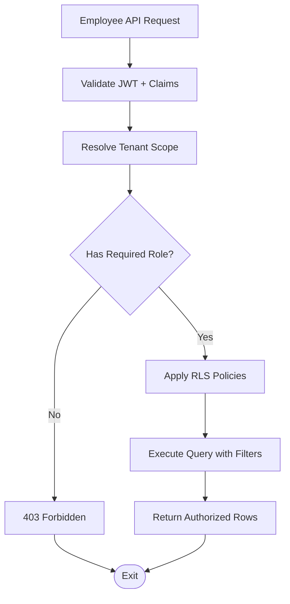

**Diagram sources**
- [apps/hr-suite/app/api/employees/route.ts](file://apps/hr-suite/app/api/employees/route.ts)
- [apps/hr-suite/app/api/employees/[employeeId]/route.ts](file://apps/hr-suite/app/api/employees/[employeeId]/route.ts)
- [apps/hr-suite/supabase/migrations/20260712124911_add_tenant_rbac_and_organization.sql](file://apps/hr-suite/supabase/migrations/20260712124911_add_tenant_rbac_and_organization.sql)

**Section sources**
- [apps/hr-suite/app/api/employees/route.ts](file://apps/hr-suite/app/api/employees/route.ts)
- [apps/hr-suite/app/api/employees/[employeeId]/route.ts](file://apps/hr-suite/app/api/employees/[employeeId]/route.ts)
- [apps/hr-suite/supabase/migrations/20260712124911_add_tenant_rbac_and_organization.sql](file://apps/hr-suite/supabase/migrations/20260712124911_add_tenant_rbac_and_organization.sql)

### Custom Fields and Secure Value Handling
- Custom field definitions and values are isolated per tenant.
- RPCs enforce validation and sanitization before persisting data.
- Policies prevent cross-tenant leakage and unauthorized mutations.

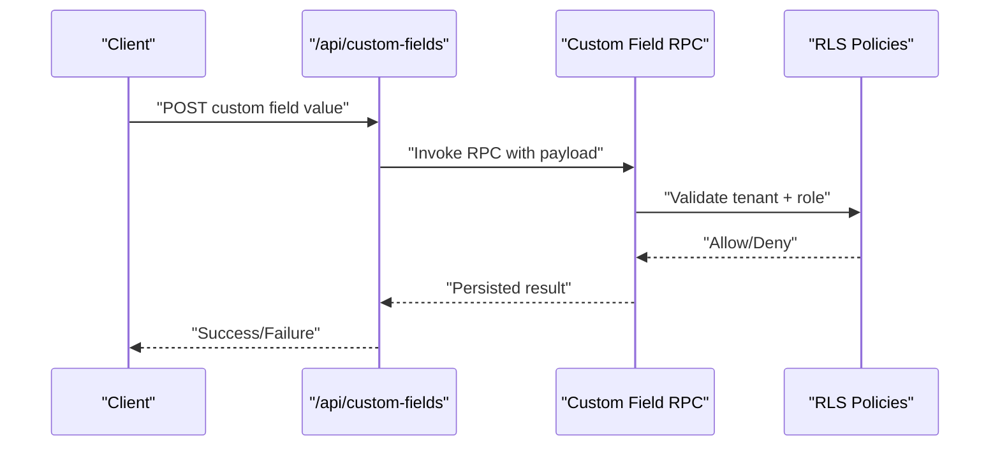

**Diagram sources**
- [apps/hr-suite/app/api/custom-fields/route.ts](file://apps/hr-suite/app/api/custom-fields/route.ts)
- [apps/hr-suite/supabase/migrations/20260715123119_add_custom_field_value_rpc.sql](file://apps/hr-suite/supabase/migrations/20260715123119_add_custom_field_value_rpc.sql)
- [apps/hr-suite/supabase/migrations/20260715123927_harden_custom_field_values.sql](file://apps/hr-suite/supabase/migrations/20260715123927_harden_custom_field_values.sql)

**Section sources**
- [apps/hr-suite/app/api/custom-fields/route.ts](file://apps/hr-suite/app/api/custom-fields/route.ts)
- [apps/hr-suite/supabase/migrations/20260715123119_add_custom_field_value_rpc.sql](file://apps/hr-suite/supabase/migrations/20260715123119_add_custom_field_value_rpc.sql)
- [apps/hr-suite/supabase/migrations/20260715123927_harden_custom_field_values.sql](file://apps/hr-suite/supabase/migrations/20260715123927_harden_custom_field_values.sql)

### Dashboards and Personalization Security
- Dashboard widgets are scoped to tenants and users.
- Read permissions are relaxed for personal dashboards while write operations remain restricted.
- Policies ensure users cannot access other tenants’ dashboard configurations.

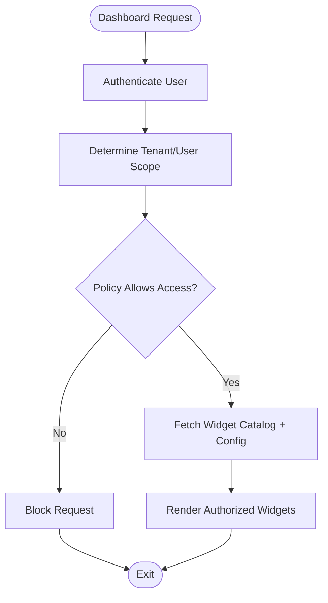

**Diagram sources**
- [apps/hr-suite/app/api/dashboards/route.ts](file://apps/hr-suite/app/api/dashboards/route.ts)
- [apps/hr-suite/supabase/migrations/20260716120000_add_personal_dashboards.sql](file://apps/hr-suite/supabase/migrations/20260716120000_add_personal_dashboards.sql)
- [apps/hr-suite/supabase/migrations/20260718173000_tune_dashboard_widget_policies.sql](file://apps/hr-suite/supabase/migrations/20260718173000_tune_dashboard_widget_policies.sql)

**Section sources**
- [apps/hr-suite/app/api/dashboards/route.ts](file://apps/hr-suite/app/api/dashboards/route.ts)
- [apps/hr-suite/supabase/migrations/20260716120000_add_personal_dashboards.sql](file://apps/hr-suite/supabase/migrations/20260716120000_add_personal_dashboards.sql)
- [apps/hr-suite/supabase/migrations/20260718173000_tune_dashboard_widget_policies.sql](file://apps/hr-suite/supabase/migrations/20260718173000_tune_dashboard_widget_policies.sql)

### Leave Request Processing and Authorization
- Leave requests are validated against catalog rules and user entitlements.
- Policies enforce tenant isolation and role-based approvals.
- Ledger operations record transactions securely.

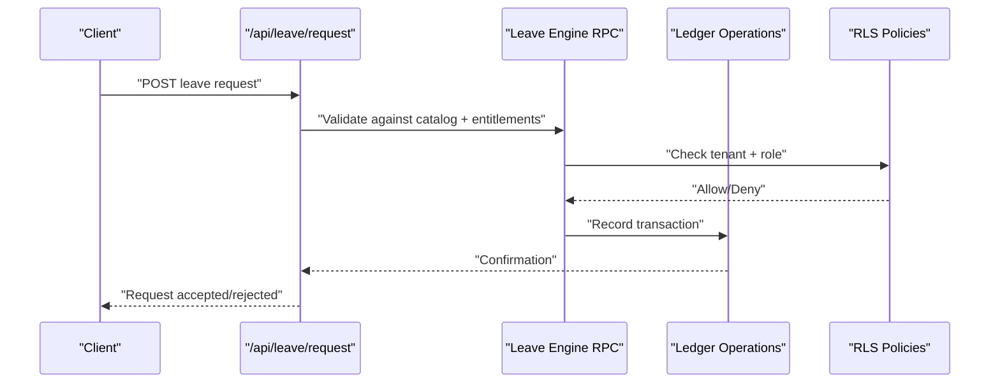

**Diagram sources**
- [apps/hr-suite/app/api/leave/request/route.ts](file://apps/hr-suite/app/api/leave/request/route.ts)
- [apps/hr-suite/supabase/migrations/20260722190000_add_leave_request_booking_engine.sql](file://apps/hr-suite/supabase/migrations/20260722190000_add_leave_request_booking_engine.sql)
- [apps/hr-suite/supabase/migrations/20260722192000_add_leave_ledger_operations.sql](file://apps/hr-suite/supabase/migrations/20260722192000_add_leave_ledger_operations.sql)

**Section sources**
- [apps/hr-suite/app/api/leave/request/route.ts](file://apps/hr-suite/app/api/leave/request/route.ts)
- [apps/hr-suite/supabase/migrations/20260722190000_add_leave_request_booking_engine.sql](file://apps/hr-suite/supabase/migrations/20260722190000_add_leave_request_booking_engine.sql)
- [apps/hr-suite/supabase/migrations/20260722192000_add_leave_ledger_operations.sql](file://apps/hr-suite/supabase/migrations/20260722192000_add_leave_ledger_operations.sql)

### Organization Chart and Read Models
- Organization chart data is exposed via a read model optimized for performance.
- Policies ensure only authorized users can view organizational structures.
- Scoped queries prevent cross-tenant exposure.

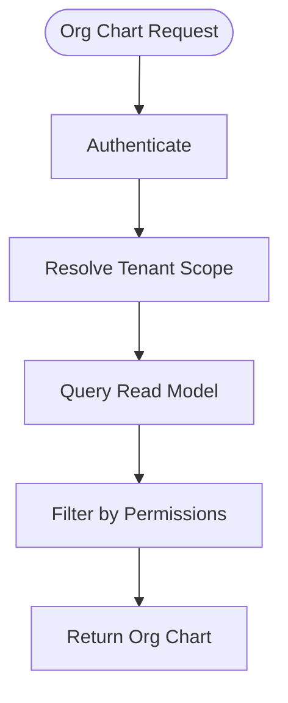

**Diagram sources**
- [apps/hr-suite/app/api/organization-chart/route.ts](file://apps/hr-suite/app/api/organization-chart/route.ts)
- [apps/hr-suite/supabase/migrations/20260716110000_add_organization_chart_read_model.sql](file://apps/hr-suite/supabase/migrations/20260716110000_add_organization_chart_read_model.sql)

**Section sources**
- [apps/hr-suite/app/api/organization-chart/route.ts](file://apps/hr-suite/app/api/organization-chart/route.ts)
- [apps/hr-suite/supabase/migrations/20260716110000_add_organization_chart_read_model.sql](file://apps/hr-suite/supabase/migrations/20260716110000_add_organization_chart_read_model.sql)

### Address Lookup and External Integrations
- Address lookup and suggestions APIs integrate with external services.
- Inputs are validated and sanitized to prevent injection attacks.
- Responses are filtered to avoid leaking sensitive information.

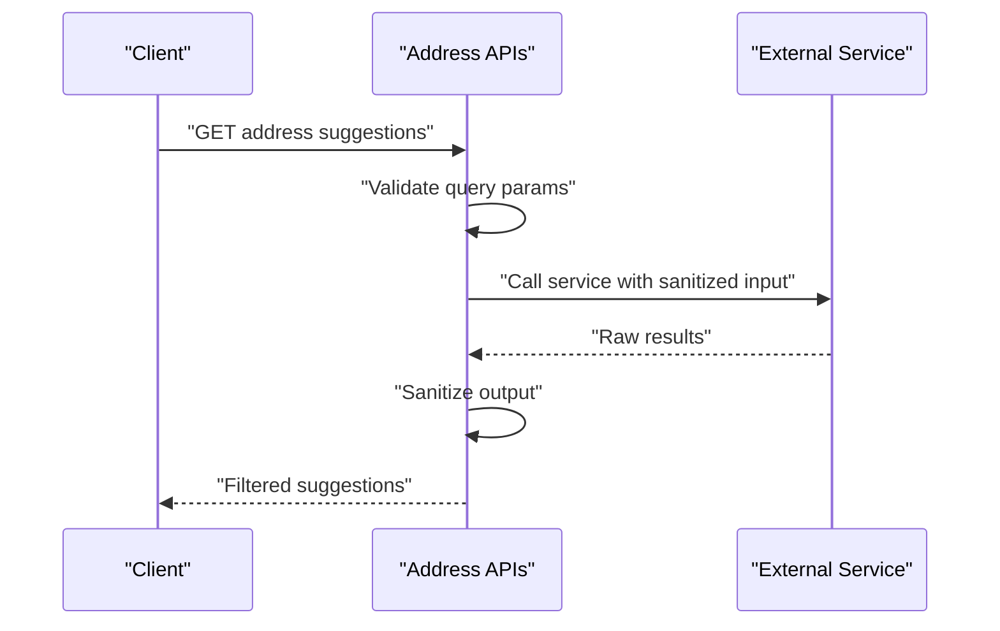

**Diagram sources**
- [apps/hr-suite/app/api/address-lookup/route.ts](file://apps/hr-suite/app/api/address-lookup/route.ts)
- [apps/hr-suite/app/api/address-suggestions/route.ts](file://apps/hr-suite/app/api/address-suggestions/route.ts)

**Section sources**
- [apps/hr-suite/app/api/address-lookup/route.ts](file://apps/hr-suite/app/api/address-lookup/route.ts)
- [apps/hr-suite/app/api/address-suggestions/route.ts](file://apps/hr-suite/app/api/address-suggestions/route.ts)

### HR Events and Audit Logging
- HR events capture system changes for auditing and monitoring.
- Employee activity entries log user actions for compliance.
- Policies ensure only authorized users can view or modify logs.

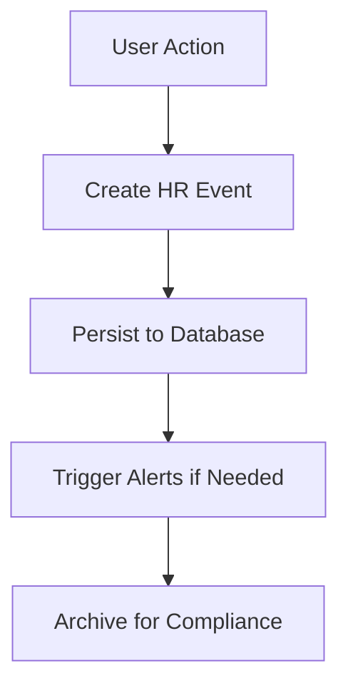

**Diagram sources**
- [apps/hr-suite/app/api/hr-events/route.ts](file://apps/hr-suite/app/api/hr-events/route.ts)
- [apps/hr-suite/supabase/migrations/20260718120000_add_hr_change_event_projection.sql](file://apps/hr-suite/supabase/migrations/20260718120000_add_hr_change_event_projection.sql)
- [apps/hr-suite/supabase/migrations/20260724160000_add_employee_activity_entries.sql](file://apps/hr-suite/supabase/migrations/20260724160000_add_employee_activity_entries.sql)

**Section sources**
- [apps/hr-suite/app/api/hr-events/route.ts](file://apps/hr-suite/app/api/hr-events/route.ts)
- [apps/hr-suite/supabase/migrations/20260718120000_add_hr_change_event_projection.sql](file://apps/hr-suite/supabase/migrations/20260718120000_add_hr_change_event_projection.sql)
- [apps/hr-suite/supabase/migrations/20260724160000_add_employee_activity_entries.sql](file://apps/hr-suite/supabase/migrations/20260724160000_add_employee_activity_entries.sql)

## Dependency Analysis
Security dependencies span application routes, Supabase Auth, and database policies:
- API routes depend on Supabase Auth for identity validation.
- RLS policies enforce tenant isolation and role-based access.
- Migrations define schemas, indexes, and policies that underpin security.

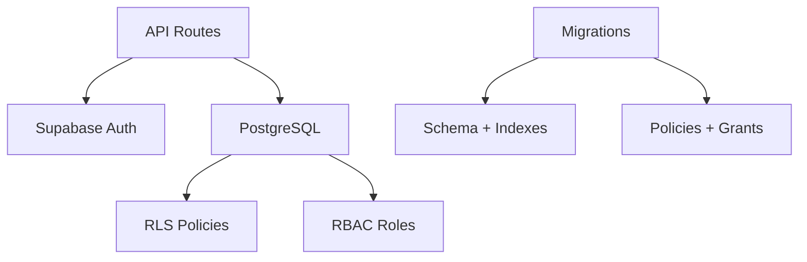

**Diagram sources**
- [apps/hr-suite/app/api/employees/route.ts](file://apps/hr-suite/app/api/employees/route.ts)
- [apps/hr-suite/supabase/migrations/20260712124911_add_tenant_rbac_and_organization.sql](file://apps/hr-suite/supabase/migrations/20260712124911_add_tenant_rbac_and_organization.sql)
- [apps/hr-suite/supabase/migrations/202607125420_revoke_public_rls_trigger_execution.sql](file://apps/hr-suite/supabase/migrations/202607125420_revoke_public_rls_trigger_execution.sql)

**Section sources**
- [apps/hr-suite/app/api/employees/route.ts](file://apps/hr-suite/app/api/employees/route.ts)
- [apps/hr-suite/supabase/migrations/20260712124911_add_tenant_rbac_and_organization.sql](file://apps/hr-suite/supabase/migrations/20260712124911_add_tenant_rbac_and_organization.sql)
- [apps/hr-suite/supabase/migrations/202607125420_revoke_public_rls_trigger_execution.sql](file://apps/hr-suite/supabase/migrations/202607125420_revoke_public_rls_trigger_execution.sql)

## Performance Considerations
- Use indexed foreign keys and scopes to optimize RLS queries.
- Minimize client-side token storage; prefer secure HTTP-only cookies.
- Cache read-heavy resources like dashboards and org charts where appropriate.
- Monitor slow queries and adjust policies to reduce overhead.

[No sources needed since this section provides general guidance]

## Troubleshooting Guide
Common issues and resolutions:
- Authentication failures:
  - Verify JWT validity and expiration.
  - Ensure callback URLs are correctly configured.
- Authorization denials:
  - Check role assignments and tenant scope.
  - Review RLS policies for restrictive clauses.
- Data isolation breaches:
  - Validate tenant filters in queries.
  - Confirm policies enforce correct boundaries.
- Input validation errors:
  - Inspect schema validations and sanitization steps.
  - Log malformed payloads for debugging.

**Section sources**
- [apps/hr-suite/supabase/migrations/202607125420_revoke_public_rls_trigger_execution.sql](file://apps/hr-suite/supabase/migrations/202607125420_revoke_public_rls_trigger_execution.sql)
- [apps/hr-suite/supabase/migrations/20260714170949_harden_organization_authorization.sql](file://apps/hr-suite/supabase/migrations/20260714170949_harden_organization_authorization.sql)
- [apps/hr-suite/supabase/migrations/20260715072010_harden_employment_security.sql](file://apps/hr-suite/supabase/migrations/20260715072010_harden_employment_security.sql)

## Conclusion
LiquidHR’s security model integrates application-level controls with database-enforced policies to ensure robust authentication, authorization, and data isolation. By leveraging JWT tokens, RLS, RBAC, and tenant scoping, the system provides strong protection against common vulnerabilities. Continuous monitoring, audit logging, and strict input validation further enhance security posture. Development teams should adhere to these patterns to maintain consistency and safety across features.

[No sources needed since this section summarizes without analyzing specific files]

## Appendices

### Security Best Practices Checklist
- Always validate and sanitize user inputs.
- Enforce RBAC at both API and database layers.
- Use HTTPS-only, secure cookies for tokens.
- Implement rate limiting on sensitive endpoints.
- Log and monitor critical actions.
- Regularly review and update RLS policies.
- Conduct periodic security audits and penetration testing.

[No sources needed since this section provides general guidance]