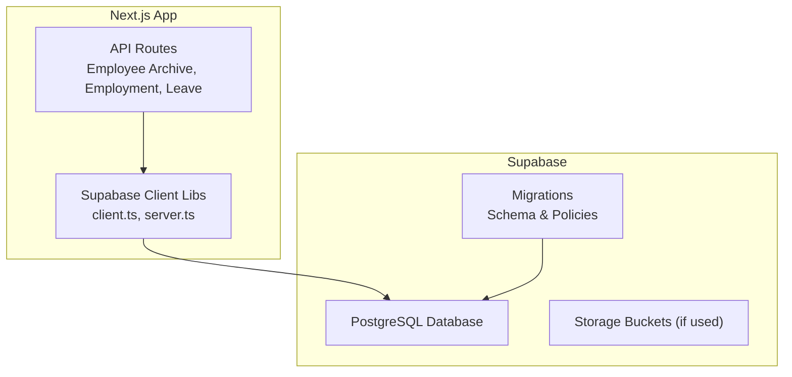
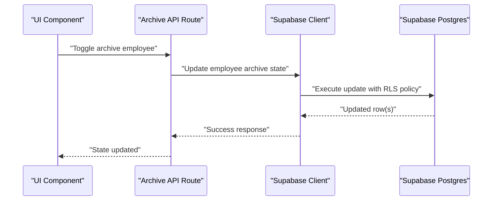
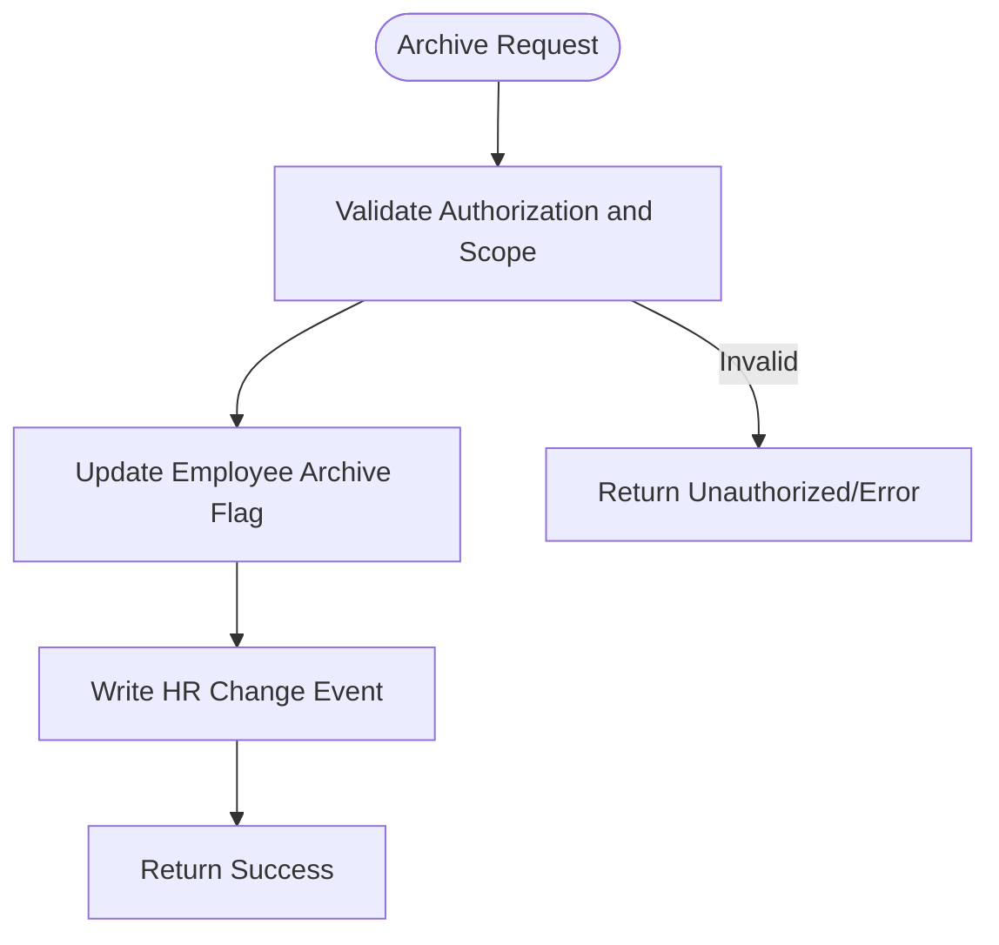
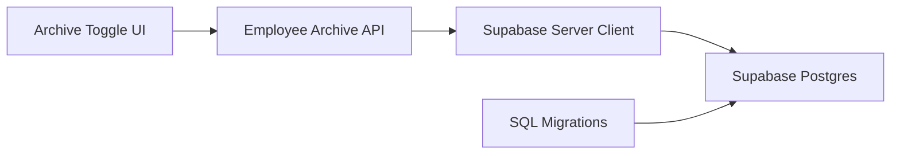

# Data Management

<cite>
**Referenced Files in This Document**
- [apps/hr-suite/supabase/config.toml](file://apps/hr-suite/supabase/config.toml)
- [apps/hr-suite/supabase/migrations/20260712124858_init_employee_core_hr.sql](file://apps/hr-suite/supabase/migrations/20260712124858_init_employee_core_hr.sql)
- [apps/hr-suite/supabase/migrations/20260715071156_add_employment_core.sql](file://apps/hr-suite/supabase/migrations/20260715071156_add_employment_core.sql)
- [apps/hr-suite/supabase/migrations/20260715071422_add_employment_timelines.sql](file://apps/hr-suite/supabase/migrations/20260715071422_add_employment_timelines.sql)
- [apps/hr-suite/supabase/migrations/20260715071717_add_employment_terminations.sql](file://apps/hr-suite/supabase/migrations/20260715071717_add_employment_terminations.sql)
- [apps/hr-suite/supabase/migrations/20260715124506_isolate_employee_secure_identifiers.sql](file://apps/hr-suite/supabase/migrations/20260715124506_isolate_employee_secure_identifiers.sql)
- [apps/hr-suite/supabase/migrations/20260718150000_add_employee_archive_and_avatar_state.sql](file://apps/hr-suite/supabase/migrations/20260718150000_add_employee_archive_and_avatar_state.sql)
- [apps/hr-suite/supabase/migrations/20260718120000_add_hr_change_event_projection.sql](file://apps/hr-suite/supabase/migrations/20260718120000_add_hr_change_event_projection.sql)
- [apps/hr-suite/supabase/migrations/20260724160000_add_employee_activity_entries.sql](file://apps/hr-suite/supabase/migrations/20260724160000_add_employee_activity_entries.sql)
- [apps/hr-suite/supabase/migrations/20260722192000_add_leave_ledger_operations.sql](file://apps/hr-suite/supabase/migrations/20260722192000_add_leave_ledger_operations.sql)
- [apps/hr-suite/app/api/employees/[employeeId]/archive/route.ts](file://apps/hr-suite/app/api/employees/[employeeId]/archive/route.ts)
- [apps/hr-suite/components/employees/employee-archive-toggle.tsx](file://apps/hr-suite/components/employees/employee-archive-toggle.tsx)
- [apps/hr-suite/lib/supabase/client.ts](file://apps/hr-suite/lib/supabase/client.ts)
- [apps/hr-suite/lib/supabase/server.ts](file://apps/hr-suite/lib/supabase/server.ts)
- [apps/hr-suite/package.json](file://apps/hr-suite/package.json)
</cite>

## Table of Contents
1. [Introduction](#introduction)
2. [Project Structure](#project-structure)
3. [Core Components](#core-components)
4. [Architecture Overview](#architecture-overview)
5. [Detailed Component Analysis](#detailed-component-analysis)
6. [Dependency Analysis](#dependency-analysis)
7. [Performance Considerations](#performance-considerations)
8. [Troubleshooting Guide](#troubleshooting-guide)
9. [Conclusion](#conclusion)
10. [Appendices](#appendices)

## Introduction
This document provides comprehensive data management guidance for LiquidHR’s database operations, focusing on Supabase-backed storage. It covers backup and recovery using Supabase tools and custom scripts, archiving strategies for historical employee records and employment timelines, retention policies aligned with GDPR, privacy controls, import/export procedures, bulk operations, ETL patterns, disaster recovery planning, failover procedures, consistency checks, data quality assurance, validation rules, and automated cleanup processes. Where applicable, it references concrete files in the repository to ground recommendations in the actual implementation.

## Project Structure
LiquidHR is a Next.js application with server-side API routes and Supabase migrations defining the schema and security policies. Key areas relevant to data management include:
- Supabase configuration and migrations under apps/hr-suite/supabase
- API routes handling employee lifecycle and archival under apps/hr-suite/app/api
- Supabase client libraries used by both client and server code under apps/hr-suite/lib/supabase
- Package scripts and dependencies under apps/hr-suite/package.json

**Diagram sources**
- [apps/hr-suite/app/api/employees/[employeeId]/archive/route.ts](file://apps/hr-suite/app/api/employees/[employeeId]/archive/route.ts)
- [apps/hr-suite/lib/supabase/client.ts](file://apps/hr-suite/lib/supabase/client.ts)
- [apps/hr-suite/lib/supabase/server.ts](file://apps/hr-suite/lib/supabase/server.ts)
- [apps/hr-suite/supabase/migrations/20260712124858_init_employee_core_hr.sql](file://apps/hr-suite/supabase/migrations/20260712124858_init_employee_core_hr.sql)

**Section sources**
- [apps/hr-suite/supabase/config.toml](file://apps/hr-suite/supabase/config.toml)
- [apps/hr-suite/package.json](file://apps/hr-suite/package.json)

## Core Components
- Supabase Configuration: Centralized environment and project settings for Supabase integration.
- Schema and Security via Migrations: Versioned SQL migrations define tables, indexes, constraints, RLS policies, and functions.
- Employee Archival API: Dedicated route to archive employees, supporting data minimization and retention.
- UI Controls: Archive toggle component integrates with the API to manage employee state.
- Supabase Clients: Typed clients for client-side and server-side access to the database.

Key responsibilities:
- Backup and Recovery: Use Supabase CLI and built-in backups; complement with migration-driven restore.
- Archiving: Move or flag historical records for retention while maintaining referential integrity.
- Retention and Privacy: Enforce policies and secure identifiers; support GDPR deletion/anonymization workflows.
- Import/Export and ETL: Leverage Supabase CLI dump/restore and server-side APIs for bulk operations.
- Disaster Recovery: Plan multi-region restores, test runbooks, and consistency checks.

**Section sources**
- [apps/hr-suite/supabase/config.toml](file://apps/hr-suite/supabase/config.toml)
- [apps/hr-suite/supabase/migrations/20260712124858_init_employee_core_hr.sql](file://apps/hr-suite/supabase/migrations/20260712124858_init_employee_core_hr.sql)
- [apps/hr-suite/supabase/migrations/20260715071156_add_employment_core.sql](file://apps/hr-suite/supabase/migrations/20260715071156_add_employment_core.sql)
- [apps/hr-suite/supabase/migrations/20260715071422_add_employment_timelines.sql](file://apps/hr-suite/supabase/migrations/20260715071422_add_employment_timelines.sql)
- [apps/hr-suite/supabase/migrations/20260715071717_add_employment_terminations.sql](file://apps/hr-suite/supabase/migrations/20260715071717_add_employment_terminations.sql)
- [apps/hr-suite/supabase/migrations/20260715124506_isolate_employee_secure_identifiers.sql](file://apps/hr-suite/supabase/migrations/20260715124506_isolate_employee_secure_identifiers.sql)
- [apps/hr-suite/supabase/migrations/20260718150000_add_employee_archive_and_avatar_state.sql](file://apps/hr-suite/supabase/migrations/20260718150000_add_employee_archive_and_avatar_state.sql)
- [apps/hr-suite/supabase/migrations/20260718120000_add_hr_change_event_projection.sql](file://apps/hr-suite/supabase/migrations/20260718120000_add_hr_change_event_projection.sql)
- [apps/hr-suite/supabase/migrations/20260724160000_add_employee_activity_entries.sql](file://apps/hr-suite/supabase/migrations/20260724160000_add_employee_activity_entries.sql)
- [apps/hr-suite/supabase/migrations/20260722192000_add_leave_ledger_operations.sql](file://apps/hr-suite/supabase/migrations/20260722192000_add_leave_ledger_operations.sql)
- [apps/hr-suite/app/api/employees/[employeeId]/archive/route.ts](file://apps/hr-suite/app/api/employees/[employeeId]/archive/route.ts)
- [apps/hr-suite/components/employees/employee-archive-toggle.tsx](file://apps/hr-suite/components/employees/employee-archive-toggle.tsx)
- [apps/hr-suite/lib/supabase/client.ts](file://apps/hr-suite/lib/supabase/client.ts)
- [apps/hr-suite/lib/supabase/server.ts](file://apps/hr-suite/lib/supabase/server.ts)

## Architecture Overview
The data architecture centers on Supabase Postgres with version-controlled migrations and Row-Level Security (RLS). Application logic flows through Next.js API routes that use typed Supabase clients to enforce tenant isolation and authorization. Archival and audit trails are implemented via dedicated tables and change event projections.

**Diagram sources**
- [apps/hr-suite/components/employees/employee-archive-toggle.tsx](file://apps/hr-suite/components/employees/employee-archive-toggle.tsx)
- [apps/hr-suite/app/api/employees/[employeeId]/archive/route.ts](file://apps/hr-suite/app/api/employees/[employeeId]/archive/route.ts)
- [apps/hr-suite/lib/supabase/client.ts](file://apps/hr-suite/lib/supabase/client.ts)
- [apps/hr-suite/supabase/migrations/20260718150000_add_employee_archive_and_avatar_state.sql](file://apps/hr-suite/supabase/migrations/20260718150000_add_employee_archive_and_avatar_state.sql)

## Detailed Component Analysis

### Backup and Recovery
- Supabase Built-in Backups: Use Supabase dashboard or CLI to schedule and manage automatic backups. These snapshots can be restored to the same or different projects.
- Custom Scripts: Implement scheduled jobs (e.g., CI/CD or external scheduler) to export logical dumps using Supabase CLI and store them securely (encrypted at rest, access-controlled).
- Restore Procedures:
  - Full restore from snapshot to a staging environment first.
  - Validate schema and data integrity before promoting to production.
  - Reapply any post-migration steps required by the application.

Operational notes:
- Maintain separate environments (dev, staging, prod) and never restore directly into production without validation.
- Keep restoration runbooks documented and rehearsed regularly.

[No sources needed since this section provides general guidance]

### Data Archiving Strategies
- Employee Archiving:
  - The archive API route and UI toggle enable marking employees as archived, supporting data minimization and compliance.
  - Archived records remain queryable under appropriate roles and scopes.
- Employment Timelines and Terminations:
  - Migrations introduce core employment, timeline, and termination structures to preserve historical context.
- Audit Trails:
  - HR change event projection and activity entries capture operational changes for traceability.

Implementation anchors:
- Archive API and UI components coordinate state changes.
- Migrations define archive flags and related structures.
- Change events and activity entries provide immutable history.

**Diagram sources**
- [apps/hr-suite/app/api/employees/[employeeId]/archive/route.ts](file://apps/hr-suite/app/api/employees/[employeeId]/archive/route.ts)
- [apps/hr-suite/supabase/migrations/20260718150000_add_employee_archive_and_avatar_state.sql](file://apps/hr-suite/supabase/migrations/20260718150000_add_employee_archive_and_avatar_state.sql)
- [apps/hr-suite/supabase/migrations/20260718120000_add_hr_change_event_projection.sql](file://apps/hr-suite/supabase/migrations/20260718120000_add_hr_change_event_projection.sql)

**Section sources**
- [apps/hr-suite/app/api/employees/[employeeId]/archive/route.ts](file://apps/hr-suite/app/api/employees/[employeeId]/archive/route.ts)
- [apps/hr-suite/components/employees/employee-archive-toggle.tsx](file://apps/hr-suite/components/employees/employee-archive-toggle.tsx)
- [apps/hr-suite/supabase/migrations/20260715071156_add_employment_core.sql](file://apps/hr-suite/supabase/migrations/20260715071156_add_employment_core.sql)
- [apps/hr-suite/supabase/migrations/20260715071422_add_employment_timelines.sql](file://apps/hr-suite/supabase/migrations/20260715071422_add_employment_timelines.sql)
- [apps/hr-suite/supabase/migrations/20260715071717_add_employment_terminations.sql](file://apps/hr-suite/supabase/migrations/20260715071717_add_employment_terminations.sql)
- [apps/hr-suite/supabase/migrations/20260718150000_add_employee_archive_and_avatar_state.sql](file://apps/hr-suite/supabase/migrations/20260718150000_add_employee_archive_and_avatar_state.sql)
- [apps/hr-suite/supabase/migrations/20260718120000_add_hr_change_event_projection.sql](file://apps/hr-suite/supabase/migrations/20260718120000_add_hr_change_event_projection.sql)

### Retention Policies and GDPR Compliance
- Secure Identifiers: Isolation of sensitive fields supports anonymization and restricted access.
- Deletion and Anonymization:
  - Implement server-side routines to anonymize personal data upon request, preserving only legally required information.
  - Ensure cascading updates maintain referential integrity across related tables.
- Policy Enforcement:
  - RLS policies restrict access based on tenant and role.
  - Audit logs should record compliance actions without capturing unnecessary PII.

Recommended practices:
- Define retention periods per data category (e.g., active vs. archived employees).
- Automate periodic cleanup tasks to purge or anonymize expired records.
- Provide mechanisms for data subject requests (access, rectification, erasure).

**Section sources**
- [apps/hr-suite/supabase/migrations/20260715124506_isolate_employee_secure_identifiers.sql](file://apps/hr-suite/supabase/migrations/20260715124506_isolate_employee_secure_identifiers.sql)
- [apps/hr-suite/supabase/migrations/20260724160000_add_employee_activity_entries.sql](file://apps/hr-suite/supabase/migrations/20260724160000_add_employee_activity_entries.sql)

### Data Import/Export and Bulk Operations
- Export:
  - Use Supabase CLI to generate logical dumps for full or partial datasets.
  - For targeted exports, implement server-side endpoints that stream CSV/JSON responses with proper authorization.
- Import:
  - Use Supabase CLI to load SQL dumps into staging first.
  - For large datasets, consider batched inserts via server-side functions or RPCs to reduce overhead.
- ETL Patterns:
  - Extract from source systems, transform within serverless functions or background jobs, and load into Supabase using idempotent upserts.
  - Maintain data lineage and reconciliation reports.

Operational safeguards:
- Validate schemas and constraints before loading.
- Use transactions for atomicity in bulk operations.
- Monitor performance and backpressure during large imports.

[No sources needed since this section provides general guidance]

### Disaster Recovery Planning and Failover
- Multi-Environment Strategy:
  - Maintain dev/staging/prod with isolated credentials and configurations.
  - Regularly test restore procedures against recent backups.
- Failover Procedures:
  - Identify critical services and dependencies.
  - Prepare rollback plans if migrations cause issues.
- Consistency Checks:
  - Run checksums or count validations across key tables after restore.
  - Verify RLS policies and function behavior post-restore.

[No sources needed since this section provides general guidance]

### Data Quality Assurance and Validation Rules
- Schema Constraints:
  - Enforce NOT NULL, UNIQUE, CHECK constraints via migrations.
  - Use foreign keys to maintain referential integrity.
- Validation Layers:
  - Server-side validation in API routes and functions.
  - Client-side validation for UX feedback.
- Automated Cleanup:
  - Scheduled jobs to remove stale temporary data.
  - Purge or anonymize expired records per retention policy.

Examples anchored in migrations:
- Employment core and timelines ensure structured historical tracking.
- Leave ledger operations enforce consistent accounting of leave balances.

**Section sources**
- [apps/hr-suite/supabase/migrations/20260715071156_add_employment_core.sql](file://apps/hr-suite/supabase/migrations/20260715071156_add_employment_core.sql)
- [apps/hr-suite/supabase/migrations/20260715071422_add_employment_timelines.sql](file://apps/hr-suite/supabase/migrations/20260715071422_add_employment_timelines.sql)
- [apps/hr-suite/supabase/migrations/20260722192000_add_leave_ledger_operations.sql](file://apps/hr-suite/supabase/migrations/20260722192000_add_leave_ledger_operations.sql)

### Example Scripts and Maintenance Tasks
- Backup Script Outline:
  - Authenticate with Supabase CLI.
  - Dump schema and data to timestamped file.
  - Upload to secure storage with encryption.
- Restore Procedure Outline:
  - Create target project/environment.
  - Apply migrations.
  - Restore data from latest validated backup.
  - Run consistency checks and smoke tests.
- Cleanup Task Outline:
  - Identify records older than retention threshold.
  - Anonymize or delete per policy.
  - Log actions to audit trail.

[No sources needed since this section provides general guidance]

## Dependency Analysis
The data layer depends on Supabase clients and migrations. API routes orchestrate business logic and call Supabase clients to execute database operations under RLS policies.

**Diagram sources**
- [apps/hr-suite/app/api/employees/[employeeId]/archive/route.ts](file://apps/hr-suite/app/api/employees/[employeeId]/archive/route.ts)
- [apps/hr-suite/lib/supabase/server.ts](file://apps/hr-suite/lib/supabase/server.ts)
- [apps/hr-suite/supabase/migrations/20260712124858_init_employee_core_hr.sql](file://apps/hr-suite/supabase/migrations/20260712124858_init_employee_core_hr.sql)

**Section sources**
- [apps/hr-suite/lib/supabase/client.ts](file://apps/hr-suite/lib/supabase/client.ts)
- [apps/hr-suite/lib/supabase/server.ts](file://apps/hr-suite/lib/supabase/server.ts)
- [apps/hr-suite/supabase/migrations/20260712124858_init_employee_core_hr.sql](file://apps/hr-suite/supabase/migrations/20260712124858_init_employee_core_hr.sql)

## Performance Considerations
- Indexing: Ensure foreign keys and frequently queried columns are indexed via migrations.
- Query Optimization: Avoid N+1 queries in API routes; leverage joins and preloading where appropriate.
- Bulk Operations: Use transactions and batched writes to minimize round-trips.
- Monitoring: Track slow queries and adjust indexes or query patterns accordingly.

[No sources needed since this section provides general guidance]

## Troubleshooting Guide
Common issues and resolutions:
- Authentication/Authorization Errors:
  - Verify Supabase client configuration and session handling.
  - Check RLS policies for tenant isolation and role-based access.
- Migration Conflicts:
  - Review migration order and idempotency.
  - Test migrations in staging before applying to production.
- Data Integrity Violations:
  - Inspect constraints and foreign keys.
  - Validate input data in API routes before writing to the database.

**Section sources**
- [apps/hr-suite/lib/supabase/client.ts](file://apps/hr-suite/lib/supabase/client.ts)
- [apps/hr-suite/lib/supabase/server.ts](file://apps/hr-suite/lib/supabase/server.ts)
- [apps/hr-suite/supabase/migrations/20260712124858_init_employee_core_hr.sql](file://apps/hr-suite/supabase/migrations/20260712124858_init_employee_core_hr.sql)

## Conclusion
LiquidHR’s data management leverages Supabase’s robust Postgres capabilities, version-controlled migrations, and strong security policies. By combining built-in backup tools with custom scripts, implementing clear archival and retention strategies, and enforcing data quality through constraints and validation, the system supports GDPR compliance and operational resilience. Regular testing of disaster recovery procedures and ongoing performance tuning will ensure reliability and scalability.

[No sources needed since this section summarizes without analyzing specific files]

## Appendices

### Appendix A: Backup and Recovery Checklist
- Schedule regular backups using Supabase CLI or dashboard.
- Store backups encrypted and access-controlled.
- Validate backups periodically with test restores.
- Document restore runbooks and rehearse quarterly.

[No sources needed since this section provides general guidance]

### Appendix B: GDPR Compliance Checklist
- Map personal data categories and locations.
- Implement anonymization and deletion workflows.
- Enforce minimal data collection and retention limits.
- Maintain audit logs for compliance actions.

[No sources needed since this section provides general guidance]

### Appendix C: Data Import/Export Template
- Export format: CSV/JSON with headers.
- Import validation: schema checks, constraint verification.
- Rollback strategy: transactional loads with revert plans.

[No sources needed since this section provides general guidance]