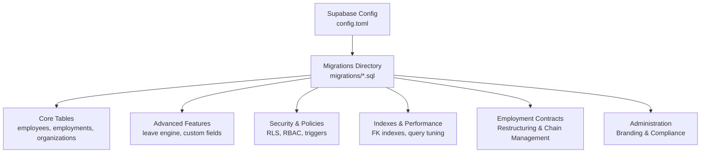
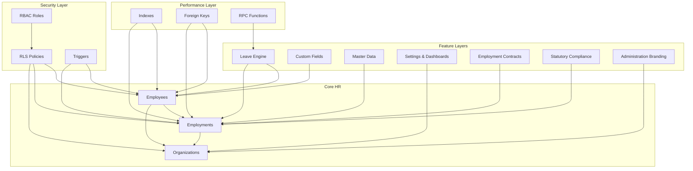
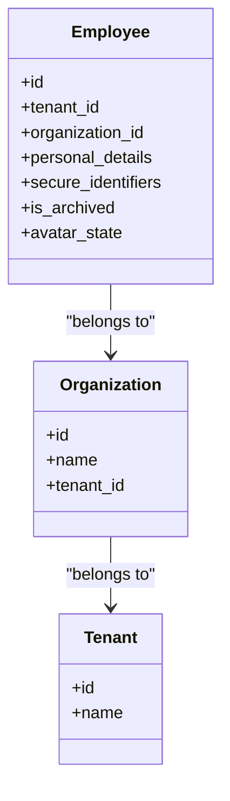
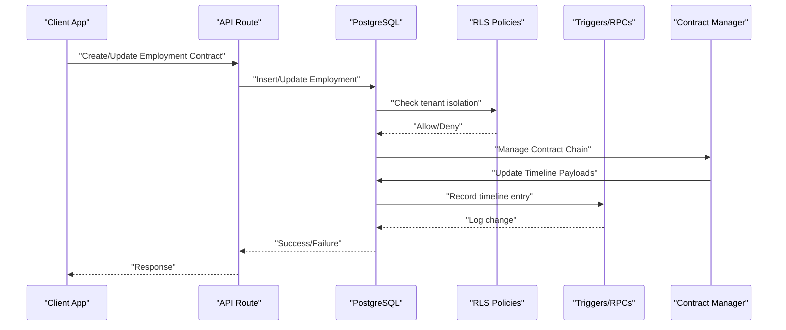
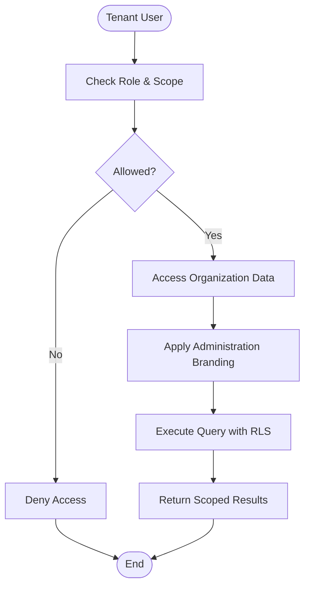
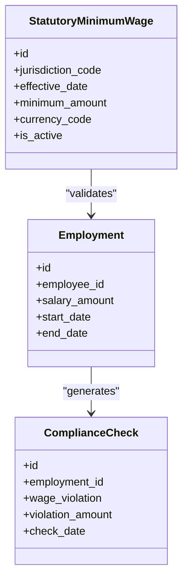
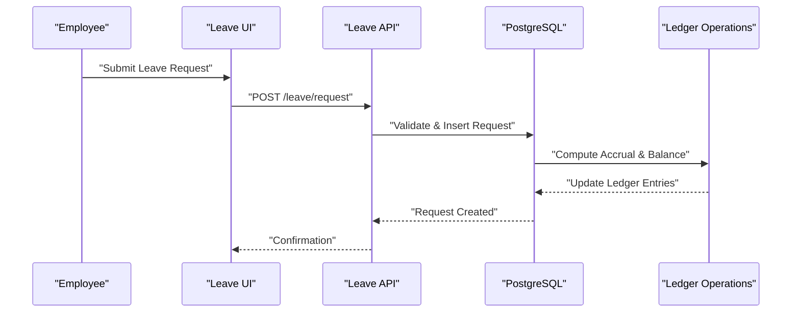
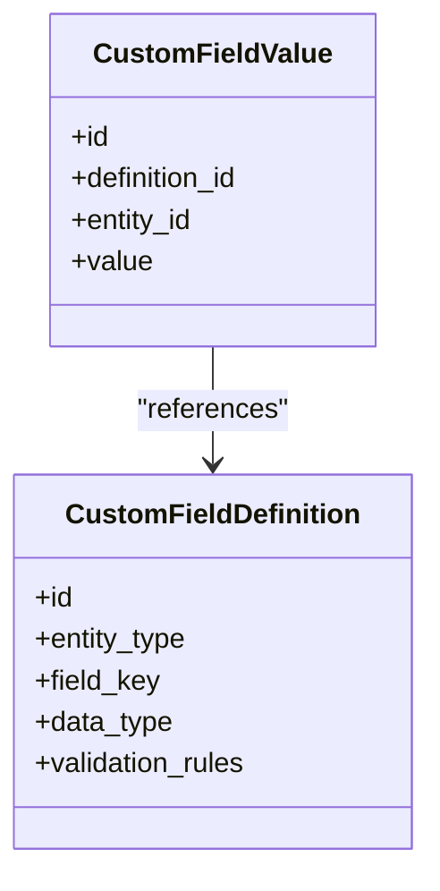
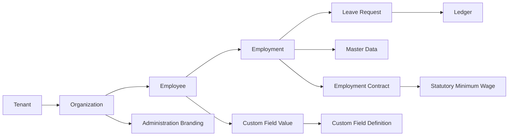

# Database Design

<cite>
**Referenced Files in This Document**
- [20260712124858_init_employee_core_hr.sql](file://apps/hr-suite/supabase/migrations/20260712124858_init_employee_core_hr.sql)
- [20260712124911_add_tenant_rbac_and_organization.sql](file://apps/hr-suite/supabase/migrations/20260712124911_add_tenant_rbac_and_organization.sql)
- [20260712125420_revoke_public_rls_trigger_execution.sql](file://apps/hr-suite/supabase/migrations/20260712125420_revoke_public_rls_trigger_execution.sql)
- [20260712125522_optimize_rbac_indexes_and_policies.sql](file://apps/hr-suite/supabase/migrations/20260712125522_optimize_rbac_indexes_and_policies.sql)
- [20260714170949_harden_organization_authorization.sql](file://apps/hr-suite/supabase/migrations/20260714170949_harden_organization_authorization.sql)
- [20260714171241_link_employees_from_auth_trigger.sql](file://apps/hr-suite/supabase/migrations/20260714171241_link_employees_from_auth_trigger.sql)
- [20260714174305_add_multitenancy_administrations.sql](file://apps/hr-suite/supabase/migrations/20260714174305_add_multitenancy_administrations.sql)
- [20260714175659_seed_multitenancy_demo.sql](file://apps/hr-suite/supabase/migrations/20260714175659_seed_multitenancy_demo.sql)
- [20260714180142_enforce_administration_management_scope.sql](file://apps/hr-suite/supabase/migrations/20260714180142_enforce_administration_management_scope.sql)
- [20260714180309_index_employee_organization_scope_foreign_keys.sql](file://apps/hr-suite/supabase/migrations/20260714180309_index_employee_organization_scope_foreign_keys.sql)
- [20260715064245_add_user_invitations.sql](file://apps/hr-suite/supabase/migrations/20260715064245_add_user_invitations.sql)
- [20260715064924_harden_user_invitation_acceptance.sql](file://apps/hr-suite/supabase/migrations/20260715064924_harden_user_invitation_acceptance.sql)
- [20260715070404_add_user_preferences.sql](file://apps/hr-suite/supabase/migrations/20260715070404_add_user_preferences.sql)
- [20260715071054_add_employee_identity_matching.sql](file://apps/hr-suite/supabase/migrations/20260715071054_add_employee_identity_matching.sql)
- [20260715071156_add_employment_core.sql](file://apps/hr-suite/supabase/migrations/20260715071156_add_employment_core.sql)
- [20260715071422_add_employment_timelines.sql](file://apps/hr-suite/supabase/migrations/20260715071422_add_employment_timelines.sql)
- [20260715071717_add_employment_terminations.sql](file://apps/hr-suite/supabase/migrations/20260715071717_add_employment_terminations.sql)
- [20260715072010_harden_employment_security.sql](file://apps/hr-suite/supabase/migrations/20260715072010_harden_employment_security.sql)
- [20260715072908_seed_employment_demo.sql](file://apps/hr-suite/supabase/migrations/20260715072908_seed_employment_demo.sql)
- [20260715120810_complete_employee_core.sql](file://apps/hr-suite/supabase/migrations/20260715120810_complete_employee_core.sql)
- [20260715121304_optimize_employee_core_indexes.sql](file://apps/hr-suite/supabase/migrations/20260715121304_optimize_employee_core_indexes.sql)
- [20260715122802_add_custom_field_definitions.sql](file://apps/hr-suite/supabase/migrations/20260715122802_add_custom_field_definitions.sql)
- [20260715123119_add_custom_field_value_rpc.sql](file://apps/hr-suite/supabase/migrations/20260715123119_add_custom_field_value_rpc.sql)
- [20260715123639_add_organization_authorization_management.sql](file://apps/hr-suite/supabase/migrations/20260715123639_add_organization_authorization_management.sql)
- [20260715123927_harden_custom_field_values.sql](file://apps/hr-suite/supabase/migrations/20260715123927_harden_custom_field_values.sql)
- [20260715124506_isolate_employee_secure_identifiers.sql](file://apps/hr-suite/supabase/migrations/20260715124506_isolate_employee_secure_identifiers.sql)
- [20260715124744_allow_logged_bsn_reveal.sql](file://apps/hr-suite/supabase/migrations/20260715124744_allow_logged_bsn_reveal.sql)
- [20260715130026_index_secure_employee_foreign_keys.sql](file://apps/hr-suite/supabase/migrations/20260715130026_index_secure_employee_foreign_keys.sql)
- [20260715131230_seed_custom_fields_and_tenant_roles.sql](file://apps/hr-suite/supabase/migrations/20260715131230_seed_custom_fields_and_tenant_roles.sql)
- [20260715141843_add_employment_change_management.sql](file://apps/hr-suite/supabase/migrations/20260715141843_add_employment_change_management.sql)
- [20260715145432_optimize_employment_change_management.sql](file://apps/hr-suite/supabase/migrations/20260715145432_optimize_employment_change_management.sql)
- [20260715173629_restore_employee_subresource_grants.sql](file://apps/hr-suite/supabase/migrations/20260715173629_restore_employee_subresource_grants.sql)
- [20260716081000_add_time_hub_reminders.sql](file://apps/hr-suite/supabase/migrations/20260716081000_add_time_hub_reminders.sql)
- [20260716090000_fix_reminder_recipient_rls_recursion.sql](file://apps/hr-suite/supabase/migrations/20260716090000_fix_reminder_recipient_rls_recursion.sql)
- [20260716092000_fix_reminder_publish_auth_lookup.sql](file://apps/hr-suite/supabase/migrations/20260716092000_fix_reminder_publish_auth_lookup.sql)
- [20260716092637_add_hera_ai_agent.sql](file://apps/hr-suite/supabase/migrations/20260716092637_add_hera_ai_agent.sql)
- [20260716100000_add_combined_employment_change_sets.sql](file://apps/hr-suite/supabase/migrations/20260716100000_add_combined_employment_change_sets.sql)
- [20260716110000_add_organization_chart_read_model.sql](file://apps/hr-suite/supabase/migrations/20260716110000_add_organization_chart read_model.sql)
- [20260716120000_add_personal_dashboards.sql](file://apps/hr-suite/supabase/migrations/20260716120000_add_personal_dashboards.sql)
- [20260717100000_harden_hera_memory_and_preferences.sql](file://apps/hr-suite/supabase/migrations/20260717100000_harden_hera_memory_and_preferences.sql)
- [20260717100500_index_hera_preferences.sql](file://apps/hr-suite/supabase/migrations/20260717100500_index_hera_preferences.sql)
- [20260717101000_add_hera_message_metadata.sql](file://apps/hr-suite/supabase/migrations/20260717101000_add_hera_message_metadata.sql)
- [20260718090000_complete_employment_flow.sql](file://apps/hr-suite/supabase/migrations/20260718090000_complete_employment_flow.sql)
- [20260718100000_add_job_catalog_salary_revisions.sql](file://apps/hr-suite/supabase/migrations/20260718100000_add_job_catalog_salary_revisions.sql)
- [20260718100500_add_master_data_mutation_rpcs.sql](file://apps/hr-suite/supabase/migrations/20260718100500_add_master_data_mutation_rpcs.sql)
- [20260718100600_index_master_data_foreign_keys.sql](file://apps/hr-suite/supabase/migrations/20260718100600_index_master_data_foreign_keys.sql)
- [20260718110000_add_employee_document_dossiers.sql](file://apps/hr-suite/supabase/migrations/20260718110000_add_employee_document_dossiers.sql)
- [20260718110100_fix_document_reminder_recipient_resolution.sql](file://apps/hr-suite/supabase/migrations/20260718110100_fix_document_reminder_recipient_resolution.sql)
- [20260718120000_add_hr_change_event_projection.sql](file://apps/hr-suite/supabase/migrations/20260718120000_add_hr_change_event_projection.sql)
- [20260718121308_add_settings_modules_work_patterns_holidays.sql](file://apps/hr-suite/supabase/migrations/20260718121308_add_settings_modules_work_patterns_holidays.sql)
- [20260718122138_harden_settings_rosters_holidays.sql](file://apps/hr-suite/supabase/migrations/20260718122138_harden_settings_rosters_holidays.sql)
- [20260718122614_enforce_optional_module_guards.sql](file://apps/hr-suite/supabase/migrations/20260718122614_enforce_optional_module_guards.sql)
- [20260718122751_expose_module_state_to_tenant_users.sql](file://apps/hr-suite/supabase/migrations/20260718122751_expose_module_state_to_tenant_users.sql)
- [20260718123742_add_holiday_snapshot_import.sql](file://apps/hr-suite/supabase/migrations/20260718123742_add_holiday_snapshot_import.sql)
- [20260718124240_allow_hr_calendar_recipient_read.sql](file://apps/hr-suite/supabase/migrations/20260718124240_allow_hr_calendar_recipient_read.sql)
- [20260718130000_add_hr_calendar_permission.sql](file://apps/hr-suite/supabase/migrations/20260718130000_add_hr_calendar_permission.sql)
- [20260718131000_harden_hr_master_data_document_policies.sql](file://apps/hr-suite/supabase/migrations/20260718131000_harden_hr_master_data_document_policies.sql)
- [20260718132000_split_reminder_target_write_policy.sql](file://apps/hr-suite/supabase/migrations/20260718132000_split_reminder_target_write_policy.sql)
- [20260718150000_add_employee_archive_and_avatar_state.sql](file://apps/hr-suite/supabase/migrations/20260718150000_add_employee_archive_and_avatar_state.sql)
- [20260718170000_add_dashboard_widget_catalog.sql](file://apps/hr-suite/supabase/migrations/20260718170000_add_dashboard_widget_catalog.sql)
- [20260718171000_relax_dashboard_widget_read_scope.sql](file://apps/hr-suite/supabase/migrations/20260718171000_relax_dashboard_widget_read_scope.sql)
- [20260718172000_expand_personal_dashboard_widget_types.sql](file://apps/hr-suite/supabase/migrations/20260718172000_expand_personal_dashboard_widget_types.sql)
- [20260718172051_grant_dashboard_widget_admin_permissions.sql](file://apps/hr-suite/supabase/migrations/20260718172051_grant_dashboard_widget_admin_permissions.sql)
- [20260718173000_tune_dashboard_widget_policies.sql](file://apps/hr-suite/supabase/migrations/20260718173000_tune_dashboard_widget_policies.sql)
- [20260718180354_add_date_time_user_preferences.sql](file://apps/hr-suite/supabase/migrations/20260718180354_add_date_time_user_preferences.sql)
- [20260719101500_refine_employee_document_upload_rules.sql](file://apps/hr-suite/supabase/migrations/20260719101500_refine_employee_document_upload_rules.sql)
- [20260719112000_add_week_numbering_user_preference.sql](file://apps/hr-suite/supabase/migrations/20260719112000_add_week_numbering_user_preference.sql)
- [20260719153000_add_star_performer_management.sql](file://apps/hr-suite/supabase/migrations/20260719153000_add_star_performer_management.sql)
- [20260719170000_add_tenant_relation_type_catalog.sql](file://apps/hr-suite/supabase/migrations/20260719170000_add_tenant_relation_type_catalog.sql)
- [20260719180000_allow_custom_relation_type_catalog_entries.sql](file://apps/hr-suite/supabase/migrations/20260719180000_allow_custom_relation_type_catalog_entries.sql)
- [20260719181000_index_relation_type_catalog_fk.sql](file://apps/hr-suite/supabase/migrations/20260719181000_index_relation_type_catalog_fk.sql)
- [20260722142551_add_leave_engine_foundation.sql](file://apps/hr-suite/supabase/migrations/20260722142551_add_leave_engine_foundation.sql)
- [20260722144232_add_leave_engine_fk_indexes.sql](file://apps/hr-suite/supabase/migrations/20260722144232_add_leave_engine_fk_indexes.sql)
- [20260722144344_add_leave_transaction_bucket_fk_index.sql](file://apps/hr-suite/supabase/migrations/20260722144344_add_leave_transaction_bucket_fk_index.sql)
- [20260722151920_add_leave_configuration_mutation_functions.sql](file://apps/hr-suite/supabase/migrations/20260722151920_add_leave_configuration_mutation_functions.sql)
- [20260722173000_add_work_hour_type_colors.sql](file://apps/hr-suite/supabase/migrations/20260722173000_add_work_hour_type_colors.sql)
- [20260722173100_normalize_catalog_color_defaults.sql](file://apps/hr-suite/supabase/migrations/20260722173100_normalize_catalog_color_defaults.sql)
- [20260722190000_add_leave_request_booking_engine.sql](file://apps/hr-suite/supabase/migrations/20260722190000_add_leave_request_booking_engine.sql)
- [20260722190500_seed_leave_demo_linda.sql](file://apps/hr-suite/supabase/migrations/20260722190500_seed_leave_demo_linda.sql)
- [20260722191500_add_leave_request_fk_indexes.sql](file://apps/hr-suite/supabase/migrations/20260722191500_add_leave_request_fk_indexes.sql)
- [20260722192000_add_leave_ledger_operations.sql](file://apps/hr-suite/supabase/migrations/20260722192000_add_leave_ledger_operations.sql)
- [20260722192100_seed_leave_demo_year_controls.sql](file://apps/hr-suite/supabase/migrations/20260722192100_seed_leave_demo_year_controls.sql)
- [20260722192500_skip_holidays_in_leave_requests.sql](file://apps/hr-suite/supabase/migrations/20260722192500_skip_holidays_in_leave_requests.sql)
- [20260723151000_optimize_employee_overview.sql](file://apps/hr-suite/supabase/migrations/20260723151000_optimize_employee_overview.sql)
- [20260724095433_insights_report_permissions.sql](file://apps/hr-suite/supabase/migrations/20260724095433_insights_report_permissions.sql)
- [20260724100605_upcoming_events_and_anniversary_rules.sql](file://apps/hr-suite/supabase/migrations/20260724100605_upcoming_events_and_anniversary_rules.sql)
- [20260724103939_simplify_roles_and_insights_events.sql](file://apps/hr-suite/supabase/migrations/20260724103939_simplify_roles_and_insights_events.sql)
- [20260724112407_add_role_assignment_scope.sql](file://apps/hr-suite/supabase/migrations/20260724112407_add_role_assignment_scope.sql)
- [20260724160000_add_employee_activity_entries.sql](file://apps/hr-suite/supabase/migrations/20260724160000_add_employee_activity_entries.sql)
- [20260724172716_harden_employee_activity_entries.sql](file://apps/hr-suite/supabase/migrations/20260724172716_harden_employee_activity_entries.sql)
- [20260725132351_address_input_internationalization.sql](file://apps/hr-suite/supabase/migrations/20260725132351_address_input_internationalization.sql)
- [20260728110000_administration_branding.sql](file://apps/hr-suite/supabase/migrations/20260728110000_administration_branding.sql)
- [20260729084046_restructure_employment_contracts.sql](file://apps/hr-suite/supabase/migrations/20260729084046_restructure_employment_contracts.sql)
- [20260729084634_publish_restructured_employment.sql](file://apps/hr-suite/supabase/migrations/20260729084634_publish_restructured_employment.sql)
- [20260729085605_manage_employment_contract_chain.sql](file://apps/hr-suite/supabase/migrations/20260729085605_manage_employment_contract_chain.sql)
- [20260729091013_manage_employment_organization_timeline.sql](file://apps/hr-suite/supabase/migrations/20260729091013_manage_employment_organization_timeline.sql)
- [20260729091441_adapt_employment_timeline_payloads.sql](file://apps/hr-suite/supabase/migrations/20260729091441_adapt_employment_timeline_payloads.sql)
- [20260729091718_add_statutory_minimum_wages.sql](file://apps/hr-suite/supabase/migrations/20260729091718_add_statutory_minimum_wages.sql)
- [20260729092342_optimize_employment_contract_configuration.sql](file://apps/hr-suite/supabase/migrations/20260729092342_optimize_employment_contract_configuration.sql)
- [config.toml](file://apps/hr-suite/supabase/config.toml)
</cite>

## Update Summary
**Changes Made**
- Added new section on Employment Contract Restructuring and Management
- Updated Administration Branding section with new migration details
- Enhanced Statutory Minimum Wages coverage with dedicated section
- Expanded Performance Optimizations section with employment contract configuration improvements
- Updated Employment Lifecycle section to reflect contract chain management capabilities

## Table of Contents
1. [Introduction](#introduction)
2. [Project Structure](#project-structure)
3. [Core Components](#core-components)
4. [Architecture Overview](#architecture-overview)
5. [Detailed Component Analysis](#detailed-component-analysis)
6. [Dependency Analysis](#dependency-analysis)
7. [Performance Considerations](#performance-considerations)
8. [Troubleshooting Guide](#troubleshooting-guide)
9. [Conclusion](#conclusion)
10. [Appendices](#appendices)

## Introduction
This document provides a comprehensive database design for LiquidHR's PostgreSQL schema hosted on Supabase. It focuses on the entity relationship model for core HR entities (employees, employments, organizations), advanced features such as leave management and custom fields, and operational concerns including migration strategy, performance optimization, data integrity, backup and recovery, and monitoring. The documentation is designed to be accessible to both technical and non-technical readers while remaining grounded in the actual migration files that define the schema.

**Updated** Recent additions include employment contract restructuring, administration branding capabilities, statutory minimum wage management, and performance optimizations for employment contract configuration.

## Project Structure
The database schema is defined using numbered SQL migration files under apps/hr-suite/supabase/migrations. Each file represents an incremental change to the schema or policies. Configuration for Supabase is stored in apps/hr-suite/supabase/config.toml.

**Diagram sources**
- [config.toml](file://apps/hr-suite/supabase/config.toml)
- [20260712124858_init_employee_core_hr.sql](file://apps/hr-suite/supabase/migrations/20260712124858_init_employee_core_hr.sql)
- [20260712124911_add_tenant_rbac_and_organization.sql](file://apps/hr-suite/supabase/migrations/20260712124911_add_tenant_rbac_and_organization.sql)
- [20260722142551_add_leave_engine_foundation.sql](file://apps/hr-suite/supabase/migrations/20260722142551_add_leave_engine_foundation.sql)
- [20260715122802_add_custom_field_definitions.sql](file://apps/hr-suite/supabase/migrations/20260715122802_add_custom_field_definitions.sql)
- [20260729084046_restructure_employment_contracts.sql](file://apps/hr-suite/supabase/migrations/20260729084046_restructure_employment_contracts.sql)
- [20260728110000_administration_branding.sql](file://apps/hr-suite/supabase/migrations/20260728110000_administration_branding.sql)

**Section sources**
- [config.toml](file://apps/hr-suite/supabase/config.toml)
- [20260712124858_init_employee_core_hr.sql](file://apps/hr-suite/supabase/migrations/20260712124858_init_employee_core_hr.sql)
- [20260712124911_add_tenant_rbac_and_organization.sql](file://apps/hr-suite/supabase/migrations/20260712124911_add_tenant_rbac_and_organization.sql)

## Core Components
LiquidHR's database centers around:
- Employees: identity, personal details, secure identifiers, and archival state.
- Employments: employment lifecycle, timelines, terminations, and change management.
- Organizations: multi-tenancy, RBAC, authorization, and administration scope.
- Leave Engine: configuration, requests, ledger operations, and accrual rules.
- Custom Fields: definitions and values with RPC accessors.
- Master Data: jobs, salary scales, end reasons, relation types, holidays, work patterns.
- Settings & Dashboards: module toggles, widget catalogs, personal dashboards.
- Activity & Insights: employee activity entries, upcoming events, anniversary rules.
- **New**: Employment Contract Management: contract restructuring, chain management, and timeline adaptations.
- **New**: Administration Branding: organization-specific branding and customization.
- **New**: Statutory Minimum Wages: compliance tracking and wage validation.

Key responsibilities:
- Enforce tenant isolation and role-based access control via RLS policies.
- Provide robust auditability through event projections and activity entries.
- Support flexible extensibility via custom fields and master data catalogs.
- **Enhanced**: Manage complex employment contract lifecycles with chain tracking.
- **Enhanced**: Ensure regulatory compliance through statutory minimum wage enforcement.

**Section sources**
- [20260712124858_init_employee_core_hr.sql](file://apps/hr-suite/supabase/migrations/20260712124858_init_employee_core_hr.sql)
- [20260712124911_add_tenant_rbac_and_organization.sql](file://apps/hr-suite/supabase/migrations/20260712124911_add_tenant_rbac_and_organization.sql)
- [20260715071156_add_employment_core.sql](file://apps/hr-suite/supabase/migrations/20260715071156_add_employment_core.sql)
- [20260722142551_add_leave_engine_foundation.sql](file://apps/hr-suite/supabase/migrations/20260722142551_add_leave_engine_foundation.sql)
- [20260715122802_add_custom_field_definitions.sql](file://apps/hr-suite/supabase/migrations/20260715122802_add_custom_field_definitions.sql)
- [20260729084046_restructure_employment_contracts.sql](file://apps/hr-suite/supabase/migrations/20260729084046_restructure_employment_contracts.sql)
- [20260728110000_administration_branding.sql](file://apps/hr-suite/supabase/migrations/20260728110000_administration_branding.sql)
- [20260729091718_add_statutory_minimum_wages.sql](file://apps/hr-suite/supabase/migrations/20260729091718_add_statutory_minimum_wages.sql)

## Architecture Overview
The database architecture follows a layered approach:
- Core HR layer: employees, employments, organizations.
- Feature layers: leave engine, custom fields, master data, settings, dashboards.
- Security layer: RLS policies, RBAC roles, triggers, and grants.
- Performance layer: indexes, FK constraints, optimized queries, and RPCs.
- **Enhanced**: Employment Contract layer: contract restructuring, chain management, and timeline adaptations.
- **Enhanced**: Compliance layer: statutory minimum wages and regulatory requirements.

**Diagram sources**
- [20260712124858_init_employee_core_hr.sql](file://apps/hr-suite/supabase/migrations/20260712124858_init_employee_core_hr.sql)
- [20260712124911_add_tenant_rbac_and_organization.sql](file://apps/hr-suite/supabase/migrations/20260712124911_add_tenant_rbac_and_organization.sql)
- [20260715071156_add_employment_core.sql](file://apps/hr-suite/supabase/migrations/20260715071156_add_employment_core.sql)
- [20260722142551_add_leave_engine_foundation.sql](file://apps/hr-suite/supabase/migrations/20260722142551_add_leave_engine_foundation.sql)
- [20260715122802_add_custom_field_definitions.sql](file://apps/hr-suite/supabase/migrations/20260715122802_add_custom_field_definitions.sql)
- [20260729084046_restructure_employment_contracts.sql](file://apps/hr-suite/supabase/migrations/20260729084046_restructure_employment_contracts.sql)
- [20260728110000_administration_branding.sql](file://apps/hr-suite/supabase/migrations/20260728110000_administration_branding.sql)
- [20260729091718_add_statutory_minimum_wages.sql](file://apps/hr-suite/supabase/migrations/20260729091718_add_statutory_minimum_wages.sql)

## Detailed Component Analysis

### Employee Core
- Purpose: Stores employee identity, personal details, secure identifiers, and archive state.
- Key tables and concepts:
  - Employee identity and profile attributes.
  - Secure identifier isolation for sensitive data.
  - Archive toggle and avatar state.
- Constraints and relationships:
  - Foreign keys linking to organizations and tenants.
  - RLS policies ensuring tenant isolation.
- Triggers:
  - Linking employees from authentication events.
  - Hardening security around secure identifiers.

**Diagram sources**
- [20260712124858_init_employee_core_hr.sql](file://apps/hr-suite/supabase/migrations/20260712124858_init_employee_core_hr.sql)
- [20260714171241_link_employees_from_auth_trigger.sql](file://apps/hr-suite/supabase/migrations/20260714171241_link_employees_from_auth_trigger.sql)
- [20260715124506_isolate_employee_secure_identifiers.sql](file://apps/hr-suite/supabase/migrations/20260715124506_isolate_employee_secure_identifiers.sql)
- [20260718150000_add_employee_archive_and_avatar_state.sql](file://apps/hr-suite/supabase/migrations/20260718150000_add_employee_archive_and_avatar_state.sql)

**Section sources**
- [20260712124858_init_employee_core_hr.sql](file://apps/hr-suite/supabase/migrations/20260712124858_init_employee_core_hr.sql)
- [20260714171241_link_employees_from_auth_trigger.sql](file://apps/hr-suite/supabase/migrations/20260714171241_link_employees_from_auth_trigger.sql)
- [20260715124506_isolate_employee_secure_identifiers.sql](file://apps/hr-suite/supabase/migrations/20260715124506_isolate_employee_secure_identifiers.sql)
- [20260718150000_add_employee_archive_and_avatar_state.sql](file://apps/hr-suite/supabase/migrations/20260718150000_add_employee_archive_and_avatar_state.sql)

### Employment Lifecycle and Contract Management
- Purpose: Manages employment records, timelines, terminations, change sets, and contract chains.
- Key tables and concepts:
  - Employment core attributes and status.
  - Timeline entries capturing changes over time.
  - Termination records and workflows.
  - Combined change sets for atomic updates.
  - **New**: Employment contract restructuring and chain management.
  - **New**: Organization timeline adaptations for contract changes.
- Constraints and relationships:
  - Strong foreign key links to employees and organizations.
  - RLS policies securing employment data per tenant.
  - **Enhanced**: Contract chain integrity and temporal validity.
- Triggers and RPCs:
  - Change management functions and optimizations.
  - Complete employment flow procedures.
  - **New**: Contract chain management procedures.
  - **New**: Timeline payload adaptations for contract restructuring.

**Diagram sources**
- [20260715071156_add_employment_core.sql](file://apps/hr-suite/supabase/migrations/20260715071156_add_employment_core.sql)
- [20260715071422_add_employment_timelines.sql](file://apps/hr-suite/supabase/migrations/20260715071422_add_employment_timelines.sql)
- [20260715071717_add_employment_terminations.sql](file://apps/hr-suite/supabase/migrations/20260715071717_add_employment_terminations.sql)
- [20260715141843_add_employment_change_management.sql](file://apps/hr-suite/supabase/migrations/20260715141843_add_employment_change_management.sql)
- [20260716100000_add_combined_employment_change_sets.sql](file://apps/hr-suite/supabase/migrations/20260716100000_add_combined_employment_change_sets.sql)
- [20260718090000_complete_employment_flow.sql](file://apps/hr-suite/supabase/migrations/20260718090000_complete_employment_flow.sql)
- [20260729084046_restructure_employment_contracts.sql](file://apps/hr-suite/supabase/migrations/20260729084046_restructure_employment_contracts.sql)
- [20260729085605_manage_employment_contract_chain.sql](file://apps/hr-suite/supabase/migrations/20260729085605_manage_employment_contract_chain.sql)
- [20260729091441_adapt_employment_timeline_payloads.sql](file://apps/hr-suite/supabase/migrations/20260729091441_adapt_employment_timeline_payloads.sql)

**Section sources**
- [20260715071156_add_employment_core.sql](file://apps/hr-suite/supabase/migrations/20260715071156_add_employment_core.sql)
- [20260715071422_add_employment_timelines.sql](file://apps/hr-suite/supabase/migrations/20260715071422_add_employment_timelines.sql)
- [20260715071717_add_employment_terminations.sql](file://apps/hr-suite/supabase/migrations/20260715071717_add_employment_terminations.sql)
- [20260715141843_add_employment_change_management.sql](file://apps/hr-suite/supabase/migrations/20260715141843_add_employment_change_management.sql)
- [20260716100000_add_combined_employment_change_sets.sql](file://apps/hr-suite/supabase/migrations/20260716100000_add_combined_employment_change_sets.sql)
- [20260718090000_complete_employment_flow.sql](file://apps/hr-suite/supabase/migrations/20260718090000_complete_employment_flow.sql)
- [20260729084046_restructure_employment_contracts.sql](file://apps/hr-suite/supabase/migrations/20260729084046_restructure_employment_contracts.sql)
- [20260729085605_manage_employment_contract_chain.sql](file://apps/hr-suite/supabase/migrations/20260729085605_manage_employment_contract_chain.sql)
- [20260729091441_adapt_employment_timeline_payloads.sql](file://apps/hr-suite/supabase/migrations/20260729091441_adapt_employment_timeline_payloads.sql)

### Organizations and Multi-Tenancy with Administration Branding
- Purpose: Defines organizational structure, tenant boundaries, RBAC, and administration branding.
- Key tables and concepts:
  - Organizations and administrations.
  - Role assignments and scopes.
  - Authorization hardening and policy enforcement.
  - **New**: Administration branding and customization.
- Constraints and relationships:
  - Foreign keys linking employees and employments to organizations.
  - RLS policies enforcing tenant isolation.
  - **Enhanced**: Branding inheritance and override mechanisms.
- Triggers and policies:
  - Administration management scope enforcement.
  - Indexes optimizing organization-scoped queries.
  - **New**: Branding consistency checks and validation.

**Diagram sources**
- [20260712124911_add_tenant_rbac_and_organization.sql](file://apps/hr-suite/supabase/migrations/20260712124911_add_tenant_rbac_and_organization.sql)
- [20260714170949_harden_organization_authorization.sql](file://apps/hr-suite/supabase/migrations/20260714170949_harden_organization_authorization.sql)
- [20260714174305_add_multitenancy_administrations.sql](file://apps/hr-suite/supabase/migrations/20260714174305_add_multitenancy_administrations.sql)
- [20260714180142_enforce_administration_management_scope.sql](file://apps/hr-suite/supabase/migrations/20260714180142_enforce_administration_management_scope.sql)
- [20260714180309_index_employee_organization_scope_foreign_keys.sql](file://apps/hr-suite/supabase/migrations/20260714180309_index_employee_organization_scope_foreign_keys.sql)
- [20260728110000_administration_branding.sql](file://apps/hr-suite/supabase/migrations/20260728110000_administration_branding.sql)

**Section sources**
- [20260712124911_add_tenant_rbac_and_organization.sql](file://apps/hr-suite/supabase/migrations/20260712124911_add_tenant_rbac_and_organization.sql)
- [20260714170949_harden_organization_authorization.sql](file://apps/hr-suite/supabase/migrations/20260714170949_harden_organization_authorization.sql)
- [20260714174305_add_multitenancy_administrations.sql](file://apps/hr-suite/supabase/migrations/20260714174305_add_multitenancy_administrations.sql)
- [20260714180142_enforce_administration_management_scope.sql](file://apps/hr-suite/supabase/migrations/20260714180142_enforce_administration_management_scope.sql)
- [20260714180309_index_employee_organization_scope_foreign_keys.sql](file://apps/hr-suite/supabase/migrations/20260714180309_index_employee_organization_scope_foreign_keys.sql)
- [20260728110000_administration_branding.sql](file://apps/hr-suite/supabase/migrations/20260728110000_administration_branding.sql)

### Statutory Minimum Wages and Compliance
- Purpose: Ensures compliance with statutory minimum wage regulations and validates employment compensation.
- Key tables and concepts:
  - Statutory minimum wage definitions by jurisdiction and date.
  - Wage validation against legal requirements.
  - Compliance reporting and audit trails.
- Constraints and relationships:
  - Foreign keys linking to employment records and jurisdictions.
  - Validation constraints ensuring wage compliance.
  - Temporal validity for wage rate changes.
- Business logic:
  - Automatic wage validation during employment creation and updates.
  - Historical wage rate tracking and compliance checking.
  - Regulatory update mechanisms for changing minimum wage laws.

**Diagram sources**
- [20260729091718_add_statutory_minimum_wages.sql](file://apps/hr-suite/supabase/migrations/20260729091718_add_statutory_minimum_wages.sql)

**Section sources**
- [20260729091718_add_statutory_minimum_wages.sql](file://apps/hr-suite/supabase/migrations/20260729091718_add_statutory_minimum_wages.sql)

### Leave Management Engine
- Purpose: Provides leave configuration, request booking, and ledger operations.
- Key tables and concepts:
  - Leave types, accrual rules, and work hours.
  - Request lifecycle and approval workflows.
  - Ledger operations tracking balances and transactions.
- Constraints and relationships:
  - Foreign keys linking requests to employees and employments.
  - Indexes optimizing FK lookups and bucket operations.
- RPCs and functions:
  - Configuration mutation functions.
  - Booking engine procedures.
  - Ledger operations for balance adjustments.

**Diagram sources**
- [20260722142551_add_leave_engine_foundation.sql](file://apps/hr-suite/supabase/migrations/20260722142551_add_leave_engine_foundation.sql)
- [20260722144232_add_leave_engine_fk_indexes.sql](file://apps/hr-suite/supabase/migrations/20260722144232_add_leave_engine_fk_indexes.sql)
- [20260722144344_add_leave_transaction_bucket_fk_index.sql](file://apps/hr-suite/supabase/migrations/20260722144344_add_leave_transaction_bucket_fk_index.sql)
- [20260722151920_add_leave_configuration_mutation_functions.sql](file://apps/hr-suite/supabase/migrations/20260722151920_add_leave_configuration_mutation_functions.sql)
- [20260722190000_add_leave_request_booking_engine.sql](file://apps/hr-suite/supabase/migrations/20260722190000_add_leave_request_booking_engine.sql)
- [20260722192000_add_leave_ledger_operations.sql](file://apps/hr-suite/supabase/migrations/20260722192000_add_leave_ledger_operations.sql)

**Section sources**
- [20260722142551_add_leave_engine_foundation.sql](file://apps/hr-suite/supabase/migrations/20260722142551_add_leave_engine_foundation.sql)
- [20260722144232_add_leave_engine_fk_indexes.sql](file://apps/hr-suite/supabase/migrations/20260722144232_add_leave_engine_fk_indexes.sql)
- [20260722144344_add_leave_transaction_bucket_fk_index.sql](file://apps/hr-suite/supabase/migrations/20260722144344_add_leave_transaction_bucket_fk_index.sql)
- [20260722151920_add_leave_configuration_mutation_functions.sql](file://apps/hr-suite/supabase/migrations/20260722151920_add_leave_configuration_mutation_functions.sql)
- [20260722190000_add_leave_request_booking_engine.sql](file://apps/hr-suite/supabase/migrations/20260722190000_add_leave_request_booking_engine.sql)
- [20260722192000_add_leave_ledger_operations.sql](file://apps/hr-suite/supabase/migrations/20260722192000_add_leave_ledger_operations.sql)

### Custom Fields
- Purpose: Enables dynamic attribute storage for employees and other entities.
- Key tables and concepts:
  - Custom field definitions with type metadata.
  - Values stored flexibly with validation.
  - RPC functions for efficient value retrieval.
- Constraints and relationships:
  - Foreign keys linking values to definitions and entities.
  - Policies hardening access to custom field values.

**Diagram sources**
- [20260715122802_add_custom_field_definitions.sql](file://apps/hr-suite/supabase/migrations/20260715122802_add_custom_field_definitions.sql)
- [20260715123119_add_custom_field_value_rpc.sql](file://apps/hr-suite/supabase/migrations/20260715123119_add_custom_field_value_rpc.sql)
- [20260715123927_harden_custom_field_values.sql](file://apps/hr-suite/supabase/migrations/20260715123927_harden_custom_field_values.sql)

**Section sources**
- [20260715122802_add_custom_field_definitions.sql](file://apps/hr-suite/supabase/migrations/20260715122802_add_custom_field_definitions.sql)
- [20260715123119_add_custom_field_value_rpc.sql](file://apps/hr-suite/supabase/migrations/20260715123119_add_custom_field_value_rpc.sql)
- [20260715123927_harden_custom_field_values.sql](file://apps/hr-suite/supabase/migrations/20260715123927_harden_custom_field_values.sql)

### Master Data and Settings
- Purpose: Centralizes reference data and application settings.
- Key tables and concepts:
  - Job catalog, salary scales, end reasons, relation types.
  - Work patterns, holidays, and calendar configurations.
  - Module toggles and dashboard widget catalogs.
- Constraints and relationships:
  - Foreign keys linking master data to employments and organizations.
  - Policies securing access to sensitive master data.

**Section sources**
- [20260718100000_add_job_catalog_salary_revisions.sql](file://apps/hr-suite/supabase/migrations/20260718100000_add_job_catalog_salary_revisions.sql)
- [20260718121308_add_settings_modules_work_patterns_holidays.sql](file://apps/hr-suite/supabase/migrations/20260718121308_add_settings_modules_work_patterns_holidays.sql)
- [20260718170000_add_dashboard_widget_catalog.sql](file://apps/hr-suite/supabase/migrations/20260718170000_add_dashboard_widget_catalog.sql)

### Activity, Insights, and Events
- Purpose: Tracks employee activities and upcoming events for insights.
- Key tables and concepts:
  - Employee activity entries with timestamps and context.
  - Upcoming events and anniversary rules.
  - Simplified roles and insights permissions.

**Section sources**
- [20260724160000_add_employee_activity_entries.sql](file://apps/hr-suite/supabase/migrations/20260724160000_add_employee_activity_entries.sql)
- [20260724100605_upcoming_events_and_anniversary_rules.sql](file://apps/hr-suite/supabase/migrations/20260724100605_upcoming_events_and_anniversary_rules.sql)
- [20260724103939_simplify_roles_and_insights_events.sql](file://apps/hr-suite/supabase/migrations/20260724103939_simplify_roles_and_insights_events.sql)

## Dependency Analysis
The database schema exhibits clear dependency chains:
- Employees depend on organizations and tenants.
- Employments depend on employees and organizations.
- Leave requests depend on employees, employments, and leave configuration.
- Custom field values depend on definitions and target entities.
- Master data supports employments and settings.
- **Enhanced**: Employment contracts depend on employments and statutory minimum wages.
- **Enhanced**: Administration branding depends on organizations and tenant configurations.

**Diagram sources**
- [20260712124911_add_tenant_rbac_and_organization.sql](file://apps/hr-suite/supabase/migrations/20260712124911_add_tenant_rbac_and_organization.sql)
- [20260712124858_init_employee_core_hr.sql](file://apps/hr-suite/supabase/migrations/20260712124858_init_employee_core_hr.sql)
- [20260715071156_add_employment_core.sql](file://apps/hr-suite/supabase/migrations/20260715071156_add_employment_core.sql)
- [20260722142551_add_leave_engine_foundation.sql](file://apps/hr-suite/supabase/migrations/20260722142551_add_leave_engine_foundation.sql)
- [20260715122802_add_custom_field_definitions.sql](file://apps/hr-suite/supabase/migrations/20260715122802_add_custom_field_definitions.sql)
- [20260729091718_add_statutory_minimum_wages.sql](file://apps/hr-suite/supabase/migrations/20260729091718_add_statutory_minimum_wages.sql)
- [20260728110000_administration_branding.sql](file://apps/hr-suite/supabase/migrations/20260728110000_administration_branding.sql)

**Section sources**
- [20260712124911_add_tenant_rbac_and_organization.sql](file://apps/hr-suite/supabase/migrations/20260712124911_add_tenant_rbac_and_organization.sql)
- [20260712124858_init_employee_core_hr.sql](file://apps/hr-suite/supabase/migrations/20260712124858_init_employee_core_hr.sql)
- [20260715071156_add_employment_core.sql](file://apps/hr-suite/supabase/migrations/20260715071156_add_employment_core.sql)
- [20260722142551_add_leave_engine_foundation.sql](file://apps/hr-suite/supabase/migrations/20260722142551_add_leave_engine_foundation.sql)
- [20260715122802_add_custom_field_definitions.sql](file://apps/hr-suite/supabase/migrations/20260715122802_add_custom_field_definitions.sql)
- [20260729091718_add_statutory_minimum_wages.sql](file://apps/hr-suite/supabase/migrations/20260729091718_add_statutory_minimum_wages.sql)
- [20260728110000_administration_branding.sql](file://apps/hr-suite/supabase/migrations/20260728110000_administration_branding.sql)

## Performance Considerations
- Indexing strategies:
  - FK indexes for employee-organization scope.
  - Leave engine FK indexes and transaction bucket indexes.
  - Master data FK indexes and Hera preferences indexes.
  - **Enhanced**: Employment contract configuration indexes.
- Query optimization:
  - Optimized employee overview queries.
  - RLS policy optimizations and trigger execution revocations.
  - **Enhanced**: Employment contract chain query optimizations.
- Connection pooling:
  - Use Supabase connection pooling defaults; tune max connections based on workload.
- Storage and archiving:
  - Employee archive state and document dossiers.
  - Holiday snapshot imports for historical accuracy.
  - **Enhanced**: Employment contract history archiving.

**Updated** Performance optimizations now include employment contract configuration improvements and enhanced indexing for contract chain management.

**Section sources**
- [20260714180309_index_employee_organization_scope_foreign_keys.sql](file://apps/hr-suite/supabase/migrations/20260714180309_index_employee_organization_scope_foreign_keys.sql)
- [20260722144232_add_leave_engine_fk_indexes.sql](file://apps/hr-suite/supabase/migrations/20260722144232_add_leave_engine_fk_indexes.sql)
- [20260722144344_add_leave_transaction_bucket_fk_index.sql](file://apps/hr-suite/supabase/migrations/20260722144344_add_leave_transaction_bucket_fk_index.sql)
- [20260715121304_optimize_employee_core_indexes.sql](file://apps/hr-suite/supabase/migrations/20260715121304_optimize_employee_core_indexes.sql)
- [20260723151000_optimize_employee_overview.sql](file://apps/hr-suite/supabase/migrations/20260723151000_optimize_employee_overview.sql)
- [20260712125420_revoke_public_rls_trigger_execution.sql](file://apps/hr-suite/supabase/migrations/20260712125420_revoke_public_rls_trigger_execution.sql)
- [20260718110000_add_employee_document_dossiers.sql](file://apps/hr-suite/supabase/migrations/20260718110000_add_employee_document_dossiers.sql)
- [20260718123742_add_holiday_snapshot_import.sql](file://apps/hr-suite/supabase/migrations/20260718123742_add_holiday_snapshot_import.sql)
- [20260729092342_optimize_employment_contract_configuration.sql](file://apps/hr-suite/supabase/migrations/20260729092342_optimize_employment_contract_configuration.sql)

## Troubleshooting Guide
Common issues and resolutions:
- RLS policy recursion:
  - Fix reminder recipient RLS recursion.
- Authentication and authorization:
  - Ensure proper role assignments and scopes.
- Custom field access:
  - Validate RPC permissions and policy grants.
- Leave ledger inconsistencies:
  - Re-run ledger operations and verify balances.
- **New**: Employment contract chain issues:
  - Verify contract chain integrity and temporal validity.
  - Check timeline payload adaptations for contract restructuring.
- **New**: Statutory minimum wage violations:
  - Review wage validation rules and compliance checks.
  - Update minimum wage rates for affected jurisdictions.

**Updated** Added troubleshooting guidance for employment contract chain management and statutory minimum wage compliance issues.

**Section sources**
- [20260716090000_fix_reminder_recipient_rls_recursion.sql](file://apps/hr-suite/supabase/migrations/20260716090000_fix_reminder_recipient_rls_recursion.sql)
- [20260716092000_fix_reminder_publish_auth_lookup.sql](file://apps/hr-suite/supabase/migrations/20260716092000_fix_reminder_publish_auth_lookup.sql)
- [20260715123927_harden_custom_field_values.sql](file://apps/hr-suite/supabase/migrations/20260715123927_harden_custom_field_values.sql)
- [20260722192000_add_leave_ledger_operations.sql](file://apps/hr-suite/supabase/migrations/20260722192000_add_leave_ledger_operations.sql)
- [20260729084046_restructure_employment_contracts.sql](file://apps/hr-suite/supabase/migrations/20260729084046_restructure_employment_contracts.sql)
- [20260729091718_add_statutory_minimum_wages.sql](file://apps/hr-suite/supabase/migrations/20260729091718_add_statutory_minimum_wages.sql)

## Conclusion
LiquidHR's database design emphasizes strong tenant isolation, flexible extensibility, and robust performance. The migration-driven approach ensures version control and rollback capabilities. Advanced features like leave management and custom fields provide powerful functionality while maintaining data integrity through constraints and policies. 

**Enhanced** Recent additions include sophisticated employment contract management with chain tracking, administration branding capabilities, and statutory minimum wage compliance enforcement. Continuous optimization and monitoring are essential to sustain performance and reliability across all enhanced features.

## Appendices

### Migration Strategy and Version Control
- Numbered SQL files ensure chronological ordering and reproducibility.
- Rollback procedures involve reversing migrations in reverse order.
- Best practices:
  - Atomic migrations with explicit transactions.
  - Backward-compatible schema changes where possible.
  - Comprehensive testing before deployment.
  - **Enhanced**: Employment contract restructuring migrations maintain data integrity through careful sequencing.

**Updated** Migration strategy now includes specialized handling for employment contract restructuring and compliance-related changes.

**Section sources**
- [20260712124858_init_employee_core_hr.sql](file://apps/hr-suite/supabase/migrations/20260712124858_init_employee_core_hr.sql)
- [20260712124911_add_tenant_rbac_and_organization.sql](file://apps/hr-suite/supabase/migrations/20260712124911_add_tenant_rbac_and_organization.sql)
- [20260722142551_add_leave_engine_foundation.sql](file://apps/hr-suite/supabase/migrations/20260722142551_add_leave_engine_foundation.sql)
- [20260729084046_restructure_employment_contracts.sql](file://apps/hr-suite/supabase/migrations/20260729084046_restructure_employment_contracts.sql)

### Backup and Recovery Procedures
- Regular backups using Supabase managed backups.
- Point-in-time recovery for critical incidents.
- Archiving strategies for historical data and documents.
- **Enhanced**: Specialized backup considerations for employment contract chains and compliance data.

[No sources needed since this section provides general guidance]

### Monitoring Approaches
- Query performance monitoring via Supabase analytics.
- Alerting on slow queries and policy violations.
- Audit logs for compliance and troubleshooting.
- **Enhanced**: Monitoring for employment contract chain integrity and statutory minimum wage compliance.

[No sources needed since this section provides general guidance]