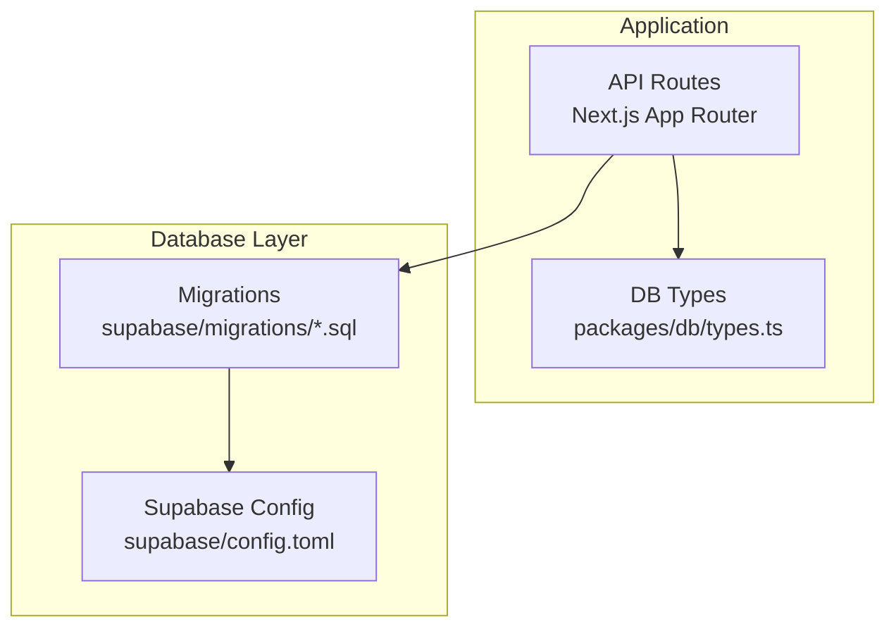
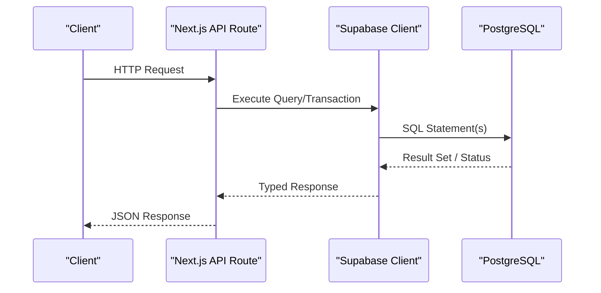
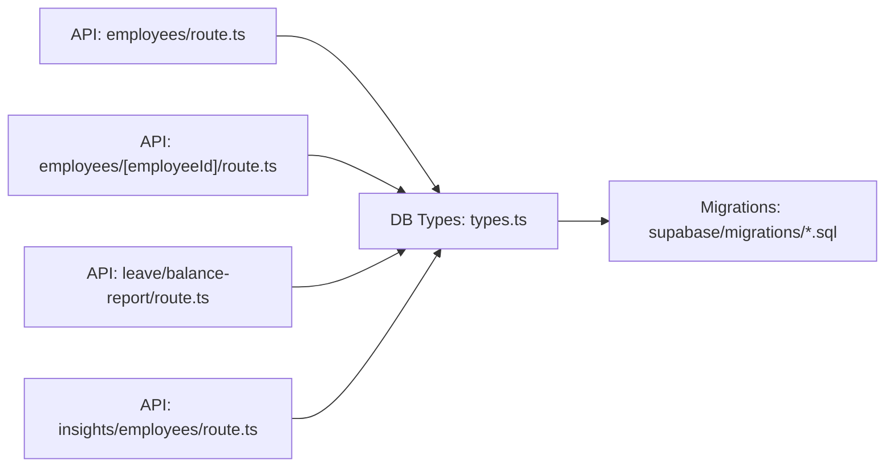

# Performance Optimization

<cite>
**Referenced Files in This Document**
- [supabase/config.toml](file://apps/hr-suite/supabase/config.toml)
- [20260712124858_init_employee_core_hr.sql](file://apps/hr-suite/supabase/migrations/20260712124858_init_employee_core_hr.sql)
- [20260712124911_add_tenant_rbac_and_organization.sql](file://apps/hr-suite/supabase/migrations/20260712124911_add_tenant_rbac_and_organization.sql)
- [20260712125522_optimize_rbac_indexes_and_policies.sql](file://apps/hr-suite/supabase/migrations/20260712125522_optimize_rbac_indexes_and_policies.sql)
- [20260714171241_link_employees_from_auth_trigger.sql](file://apps/hr-suite/supabase/migrations/20260714171241_link_employees_from_auth_trigger.sql)
- [20260714174305_add_multitenancy_administrations.sql](file://apps/hr-suite/supabase/migrations/20260714174305_add_multitenancy_administrations.sql)
- [20260714180309_index_employee_organization_scope_foreign_keys.sql](file://apps/hr-suite/supabase/migrations/20260714180309_index_employee_organization_scope_foreign_keys.sql)
- [20260715121304_optimize_employee_core_indexes.sql](file://apps/hr-suite/supabase/migrations/20260715121304_optimize_employee_core_indexes.sql)
- [20260715130026_index_secure_employee_foreign_keys.sql](file://apps/hr-suite/supabase/migrations/20260715130026_index_secure_employee_foreign_keys.sql)
- [20260715145432_optimize_employment_change_management.sql](file://apps/hr-suite/supabase/migrations/20260715145432_optimize_employment_change_management.sql)
- [20260716110000_add_organization_chart_read_model.sql](file://apps/hr-suite/supabase/migrations/20260716110000_add_organization_chart_read_model.sql)
- [20260717100500_index_hera_preferences.sql](file://apps/hr-suite/supabase/migrations/20260717100500_index_hera_preferences.sql)
- [20260718100600_index_master_data_foreign_keys.sql](file://apps/hr-suite/supabase/migrations/20260718100600_index_master_data_foreign_keys.sql)
- [20260718120000_add_hr_change_event_projection.sql](file://apps/hr-suite/supabase/migrations/20260718120000_add_hr_change_event_projection.sql)
- [20260722142551_add_leave_engine_foundation.sql](file://apps/hr-suite/supabase/migrations/20260722142551_add_leave_engine_foundation.sql)
- [20260722144232_add_leave_engine_fk_indexes.sql](file://apps/hr-suite/supabase/migrations/20260722144232_add_leave_engine_fk_indexes.sql)
- [20260722144344_add_leave_transaction_bucket_fk_index.sql](file://apps/hr-suite/supabase/migrations/20260722144344_add_leave_transaction_bucket_fk_index.sql)
- [20260722191500_add_leave_request_fk_indexes.sql](file://apps/hr-suite/supabase/migrations/20260722191500_add_leave_request_fk_indexes.sql)
- [20260723151000_optimize_employee_overview.sql](file://apps/hr-suite/supabase/migrations/20260723151000_optimize_employee_overview.sql)
- [20260724160000_add_employee_activity_entries.sql](file://apps/hr-suite/supabase/migrations/20260724160000_add_employee_activity_entries.sql)
- [20260724172716_harden_employee_activity_entries.sql](file://apps/hr-suite/supabase/migrations/20260724172716_harden_employee_activity_entries.sql)
- [route.ts (employees)](file://apps/hr-suite/app/api/employees/route.ts)
- [route.ts (employee detail)](file://apps/hr-suite/app/api/employees/[employeeId]/route.ts)
- [route.ts (leave balance report)](file://apps/hr-suite/app/api/leave/balance-report/route.ts)
- [route.ts (insights employees)](file://apps/hr-suite/app/api/insights/employees/route.ts)
- [package.json (db package)](file://packages/db/package.json)
- [types.ts (db package)](file://packages/db/types.ts)
</cite>

## Table of Contents
1. [Introduction](#introduction)
2. [Project Structure](#project-structure)
3. [Core Components](#core-components)
4. [Architecture Overview](#architecture-overview)
5. [Detailed Component Analysis](#detailed-component-analysis)
6. [Dependency Analysis](#dependency-analysis)
7. [Performance Considerations](#performance-considerations)
8. [Troubleshooting Guide](#troubleshooting-guide)
9. [Conclusion](#conclusion)
10. [Appendices](#appendices)

## Introduction
This document provides a comprehensive performance optimization guide for LiquidHR’s database layer built on Supabase (PostgreSQL). It focuses on indexing strategies (B-tree, GIN, partial indexes), query optimization techniques, execution plan analysis, bottleneck identification, connection pooling configuration, caching strategies, and read/write splitting patterns. It also covers monitoring approaches using Supabase analytics, slow query logs, and custom metrics, as well as database-level optimizations such as materialized views, stored procedures, and function-based indexes. Practical examples of optimized queries and their execution plans are included alongside troubleshooting guidance for common performance issues.

## Project Structure
LiquidHR organizes its database schema and migrations under apps/hr-suite/supabase/migrations, with application API routes under apps/hr-suite/app/api. The db package under packages/db defines shared types and utilities used by the application to interact with the database.

**Diagram sources**
- [package.json (db package)](file://packages/db/package.json)
- [types.ts (db package)](file://packages/db/types.ts)
- [supabase/config.toml](file://apps/hr-suite/supabase/config.toml)

**Section sources**
- [package.json (db package)](file://packages/db/package.json)
- [types.ts (db package)](file://packages/db/types.ts)
- [supabase/config.toml](file://apps/hr-suite/supabase/config.toml)

## Core Components
The database layer is composed of:
- Schema and indexes defined across migrations
- API routes that execute queries against Supabase
- Shared type definitions ensuring consistent data contracts
- Configuration for Supabase runtime behavior

Key areas for performance include:
- Index design (B-tree, GIN, partial)
- Query patterns and joins
- Read-heavy vs write-heavy workloads
- Caching and read replicas (if applicable)
- Monitoring and observability

**Section sources**
- [20260712124858_init_employee_core_hr.sql](file://apps/hr-suite/supabase/migrations/20260712124858_init_employee_core_hr.sql)
- [20260712124911_add_tenant_rbac_and_organization.sql](file://apps/hr-suite/supabase/migrations/20260712124911_add_tenant_rbac_and_organization.sql)
- [20260712125522_optimize_rbac_indexes_and_policies.sql](file://apps/hr-suite/supabase/migrations/20260712125522_optimize_rbac_indexes_and_policies.sql)
- [20260715121304_optimize_employee_core_indexes.sql](file://apps/hr-suite/supabase/migrations/20260715121304_optimize_employee_core_indexes.sql)
- [20260715130026_index_secure_employee_foreign_keys.sql](file://apps/hr-suite/supabase/migrations/20260715130026_index_secure_employee_foreign_keys.sql)
- [20260715145432_optimize_employment_change_management.sql](file://apps/hr-suite/supabase/migrations/20260715145432_optimize_employment_change_management.sql)
- [20260716110000_add_organization_chart_read_model.sql](file://apps/hr-suite/supabase/migrations/20260716110000_add_organization_chart_read_model.sql)
- [20260717100500_index_hera_preferences.sql](file://apps/hr-suite/supabase/migrations/20260717100500_index_hera_preferences.sql)
- [20260718100600_index_master_data_foreign_keys.sql](file://apps/hr-suite/supabase/migrations/20260718100600_index_master_data_foreign_keys.sql)
- [20260718120000_add_hr_change_event_projection.sql](file://apps/hr-suite/supabase/migrations/20260718120000_add_hr_change_event_projection.sql)
- [20260722142551_add_leave_engine_foundation.sql](file://apps/hr-suite/supabase/migrations/20260722142551_add_leave_engine_foundation.sql)
- [20260722144232_add_leave_engine_fk_indexes.sql](file://apps/hr-suite/supabase/migrations/20260722144232_add_leave_engine_fk_indexes.sql)
- [20260722144344_add_leave_transaction_bucket_fk_index.sql](file://apps/hr-suite/supabase/migrations/20260722144344_add_leave_transaction_bucket_fk_index.sql)
- [20260722191500_add_leave_request_fk_indexes.sql](file://apps/hr-suite/supabase/migrations/20260722191500_add_leave_request_fk_indexes.sql)
- [20260723151000_optimize_employee_overview.sql](file://apps/hr-suite/supabase/migrations/20260723151000_optimize_employee_overview.sql)
- [20260724160000_add_employee_activity_entries.sql](file://apps/hr-suite/supabase/migrations/20260724160000_add_employee_activity_entries.sql)
- [20260724172716_harden_employee_activity_entries.sql](file://apps/hr-suite/supabase/migrations/20260724172716_harden_employee_activity_entries.sql)

## Architecture Overview
At a high level, Next.js API routes invoke database operations via Supabase clients. Migrations define tables, indexes, functions, and projections. Read-heavy features leverage read models and projections; write-heavy paths use normalized tables with robust indexing.

**Diagram sources**
- [route.ts (employees)](file://apps/hr-suite/app/api/employees/route.ts)
- [route.ts (employee detail)](file://apps/hr-suite/app/api/employees/[employeeId]/route.ts)
- [route.ts (leave balance report)](file://apps/hr-suite/app/api/leave/balance-report/route.ts)
- [route.ts (insights employees)](file://apps/hr-suite/app/api/insights/employees/route.ts)

## Detailed Component Analysis

### Indexing Strategy
LiquidHR employs multiple index types tailored to workload characteristics:

- B-tree indexes: Default choice for equality and range queries, foreign key lookups, and sorting. Examples include employee core indexes, secure identifiers, organization scope foreign keys, master data foreign keys, and leave engine FK indexes.
- GIN indexes: Suitable for full-text search or array containment where applicable. Ensure appropriate operators and collation settings.
- Partial indexes: Target frequent filtered subsets (e.g., active records, tenant-scoped rows) to reduce index size and improve scan efficiency.

Recommended practices:
- Align index columns with WHERE clauses, JOIN conditions, ORDER BY, and GROUP BY.
- Use composite indexes for multi-column predicates frequently queried together.
- Prefer partial indexes for hot partitions (e.g., current employment status, active tenants).
- Monitor index usage and drop unused indexes to minimize write overhead.

**Section sources**
- [20260712125522_optimize_rbac_indexes_and_policies.sql](file://apps/hr-suite/supabase/migrations/20260712125522_optimize_rbac_indexes_and_policies.sql)
- [20260714180309_index_employee_organization_scope_foreign_keys.sql](file://apps/hr-suite/supabase/migrations/20260714180309_index_employee_organization_scope_foreign_keys.sql)
- [20260715121304_optimize_employee_core_indexes.sql](file://apps/hr-suite/supabase/migrations/20260715121304_optimize_employee_core_indexes.sql)
- [20260715130026_index_secure_employee_foreign_keys.sql](file://apps/hr-suite/supabase/migrations/20260715130026_index_secure_employee_foreign_keys.sql)
- [20260718100600_index_master_data_foreign_keys.sql](file://apps/hr-suite/supabase/migrations/20260718100600_index_master_data_foreign_keys.sql)
- [20260722144232_add_leave_engine_fk_indexes.sql](file://apps/hr-suite/supabase/migrations/20260722144232_add_leave_engine_fk_indexes.sql)
- [20260722144344_add_leave_transaction_bucket_fk_index.sql](file://apps/hr-suite/supabase/migrations/20260722144344_add_leave_transaction_bucket_fk_index.sql)
- [20260722191500_add_leave_request_fk_indexes.sql](file://apps/hr-suite/supabase/migrations/20260722191500_add_leave_request_fk_indexes.sql)

### Query Optimization Techniques
Common techniques applied in LiquidHR:
- Narrow result sets with selective filters early.
- Use explicit column lists instead of SELECT *.
- Leverage existing indexes through matching predicates.
- Avoid unnecessary joins; pre-aggregate when possible.
- Utilize read models/projections for complex analytical queries.

Execution plan analysis:
- Inspect EXPLAIN output for sequential scans on large tables.
- Confirm index usage for targeted lookups and sorts.
- Identify expensive nested loops and consider alternative join strategies.

Optimization examples:
- Employee overview queries benefit from targeted indexes and projection tables.
- Leave balance reports aggregate transactions efficiently using indexed buckets and FK relationships.
- Insights queries rely on precomputed projections to avoid heavy joins at runtime.

**Section sources**
- [20260723151000_optimize_employee_overview.sql](file://apps/hr-suite/supabase/migrations/20260723151000_optimize_employee_overview.sql)
- [20260718120000_add_hr_change_event_projection.sql](file://apps/hr-suite/supabase/migrations/20260718120000_add_hr_change_event_projection.sql)
- [20260716110000_add_organization_chart_read_model.sql](file://apps/hr-suite/supabase/migrations/20260716110000_add_organization_chart_read_model.sql)
- [20260722142551_add_leave_engine_foundation.sql](file://apps/hr-suite/supabase/migrations/20260722142551_add_leave_engine_foundation.sql)

### Connection Pooling Configuration
Supabase manages connection pooling at the platform level. Application-side considerations:
- Configure client instances per request to avoid long-lived connections.
- Reuse pools within serverless functions if supported by your hosting environment.
- Monitor connection saturation and adjust concurrency limits accordingly.

Best practices:
- Keep transaction scopes minimal.
- Avoid holding connections during I/O-bound operations outside the database.
- Use connection timeouts to prevent resource exhaustion.

**Section sources**
- [supabase/config.toml](file://apps/hr-suite/supabase/config.toml)

### Query Caching Strategies
Caching layers can significantly reduce database load:
- Application-level cache (in-memory or Redis) for frequently accessed reference data.
- Edge caching for static or semi-static content.
- Database-level caching via prepared statements and query plan reuse.

Guidelines:
- Cache immutable or slowly changing data (e.g., master data catalogs).
- Invalidate caches on writes to ensure consistency.
- Use short TTLs for volatile data and longer TTLs for stable configurations.

[No sources needed since this section provides general guidance]

### Read/Write Splitting Patterns
Patterns to separate reads and writes:
- Write to primary tables; read from projections or materialized views.
- Use event-driven updates to keep read models in sync.
- For read replicas (if available), route analytical queries to replicas.

Implementation notes:
- Maintain idempotent upserts for projections.
- Schedule refreshes for materialized views during off-peak hours.
- Monitor replication lag to ensure data freshness.

**Section sources**
- [20260716110000_add_organization_chart_read_model.sql](file://apps/hr-suite/supabase/migrations/20260716110000_add_organization_chart_read_model.sql)
- [20260718120000_add_hr_change_event_projection.sql](file://apps/hr-suite/supabase/migrations/20260718120000_add_hr_change_event_projection.sql)

### Database-Level Optimizations
Materialized views and projections:
- Organization chart read model accelerates hierarchical queries.
- HR change event projection supports efficient audit and timeline features.

Stored procedures and functions:
- Encapsulate complex business logic to reduce round trips.
- Use functions for safe mutations with built-in validation and RLS enforcement.

Function-based indexes:
- Create indexes on computed expressions where queries filter on derived values.
- Ensure deterministic functions and proper collation.

**Section sources**
- [20260716110000_add_organization_chart_read_model.sql](file://apps/hr-suite/supabase/migrations/20260716110000_add_organization_chart_read_model.sql)
- [20260718120000_add_hr_change_event_projection.sql](file://apps/hr-suite/supabase/migrations/20260718120000_add_hr_change_event_projection.sql)

### Example Queries and Execution Plans
- Employee overview: Use targeted indexes and projection tables to minimize scans and joins. Validate with EXPLAIN to confirm index usage and low-cost sorts.
- Leave balance report: Aggregate transactions using indexed buckets and FK indexes; ensure grouping columns align with index order.
- Insights employees: Leverage precomputed projections to avoid heavy joins; verify refresh schedules and data staleness thresholds.

[No sources needed since this section provides general guidance]

## Dependency Analysis
The application depends on typed database schemas and migrations. API routes call into Supabase clients which execute SQL defined by migrations. Shared types ensure consistent payloads between frontend and backend.

**Diagram sources**
- [route.ts (employees)](file://apps/hr-suite/app/api/employees/route.ts)
- [route.ts (employee detail)](file://apps/hr-suite/app/api/employees/[employeeId]/route.ts)
- [route.ts (leave balance report)](file://apps/hr-suite/app/api/leave/balance-report/route.ts)
- [route.ts (insights employees)](file://apps/hr-suite/app/api/insights/employees/route.ts)
- [types.ts (db package)](file://packages/db/types.ts)
- [20260712124858_init_employee_core_hr.sql](file://apps/hr-suite/supabase/migrations/20260712124858_init_employee_core_hr.sql)

**Section sources**
- [route.ts (employees)](file://apps/hr-suite/app/api/employees/route.ts)
- [route.ts (employee detail)](file://apps/hr-suite/app/api/employees/[employeeId]/route.ts)
- [route.ts (leave balance report)](file://apps/hr-suite/app/api/leave/balance-report/route.ts)
- [route.ts (insights employees)](file://apps/hr-suite/app/api/insights/employees/route.ts)
- [types.ts (db package)](file://packages/db/types.ts)

## Performance Considerations
- Index maintenance: Regularly analyze table statistics and rebuild indexes if fragmentation occurs.
- Query tuning: Profile slow queries with EXPLAIN ANALYZE; refactor to reduce cost.
- Workload separation: Offload analytical queries to projections or materialized views.
- Concurrency control: Limit concurrent transactions and batch writes where feasible.
- Data volume management: Partition large tables and archive historical data.

[No sources needed since this section provides general guidance]

## Troubleshooting Guide
Common issues and resolutions:
- Sequential scans on large tables: Add or refine indexes; ensure predicates match index columns.
- High CPU usage: Identify expensive joins and aggregations; introduce projections or pre-aggregations.
- Lock contention: Reduce transaction duration; avoid long-running DDL/DML; use advisory locks judiciously.
- Slow queries due to missing indexes: Review EXPLAIN output; create composite or partial indexes as needed.
- Stale read models: Verify refresh schedules and idempotency of update processes.

Monitoring approaches:
- Supabase analytics: Track query latency, error rates, and throughput.
- Slow query logs: Enable and review logs to identify bottlenecks.
- Custom metrics: Instrument application code to capture DB-specific KPIs (e.g., query duration histograms).

**Section sources**
- [20260724160000_add_employee_activity_entries.sql](file://apps/hr-suite/supabase/migrations/20260724160000_add_employee_activity_entries.sql)
- [20260724172716_harden_employee_activity_entries.sql](file://apps/hr-suite/supabase/migrations/20260724172716_harden_employee_activity_entries.sql)

## Conclusion
LiquidHR’s database layer leverages thoughtful indexing, projections, and read models to optimize performance across diverse workloads. By applying disciplined query optimization, effective caching, and robust monitoring, teams can maintain responsive HR operations even as data volumes grow. Continuous analysis of execution plans and proactive index tuning will sustain optimal performance over time.

[No sources needed since this section summarizes without analyzing specific files]

## Appendices

### Appendix A: Index Type Selection Guide
- B-tree: Equality, range, ordering, and most common lookups.
- GIN: Full-text search, arrays, JSON containment.
- Partial: Filtered subsets to reduce index size and improve selectivity.

[No sources needed since this section provides general guidance]

### Appendix B: Monitoring Checklist
- Enable slow query logging and set thresholds.
- Track query latency percentiles and error rates.
- Monitor index usage stats and drop unused indexes.
- Validate refresh schedules for projections and materialized views.

[No sources needed since this section provides general guidance]