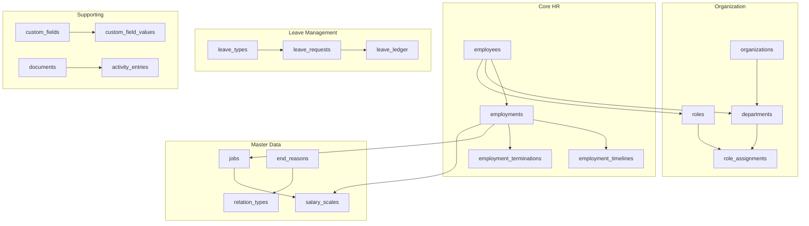
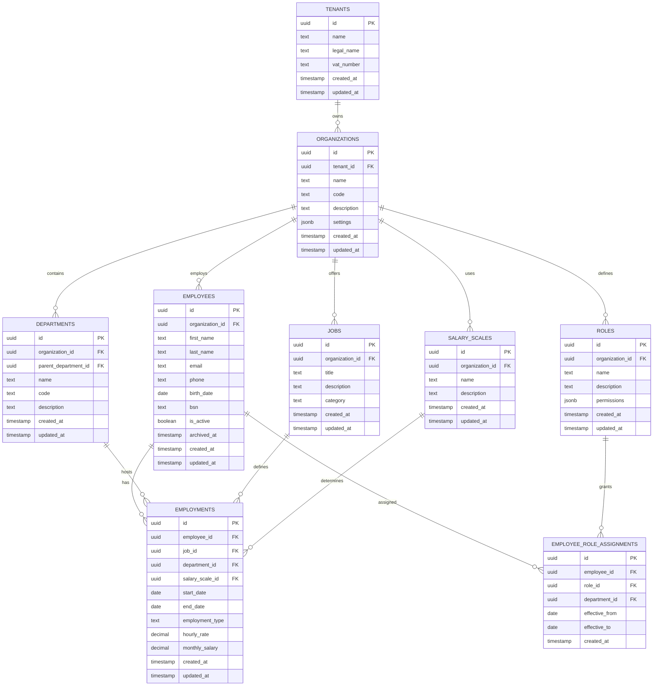
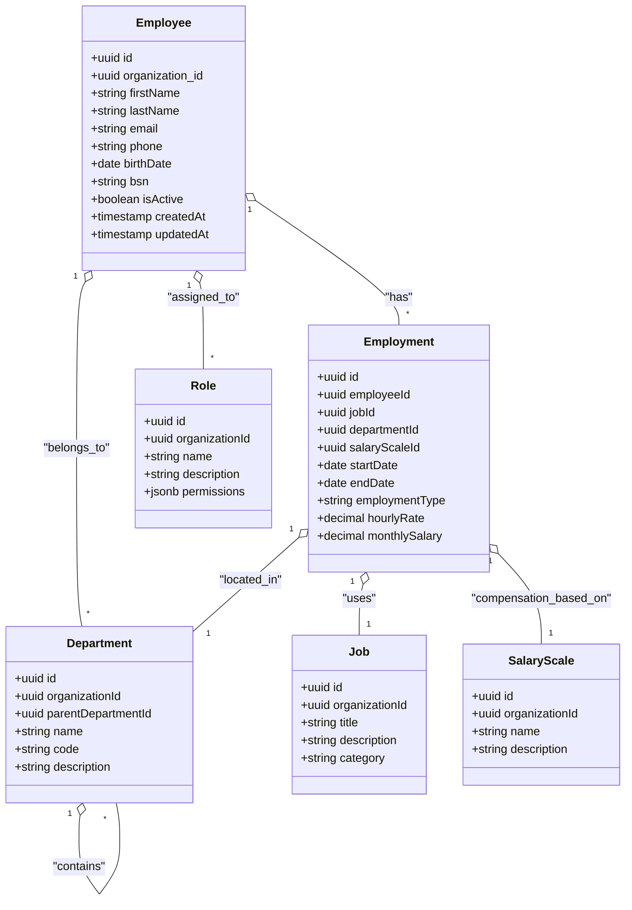
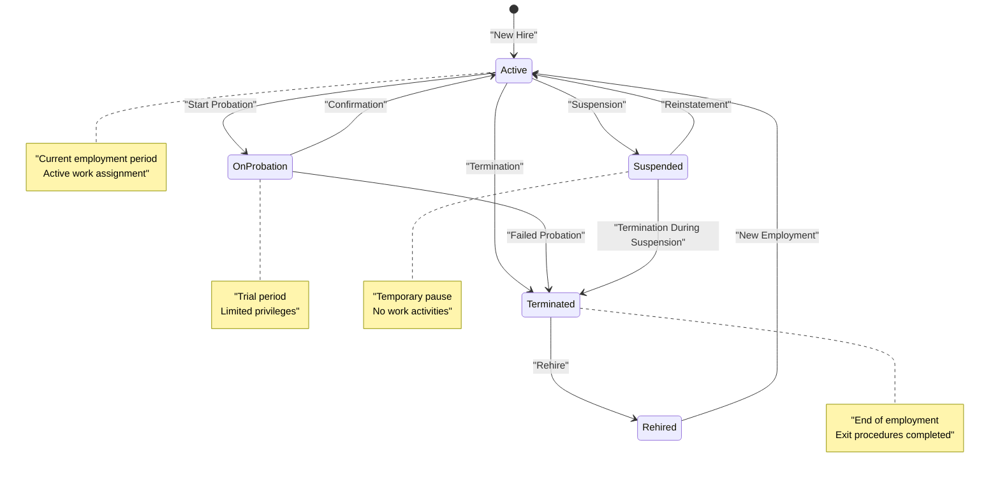
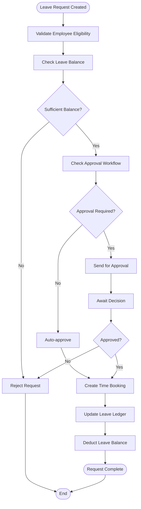
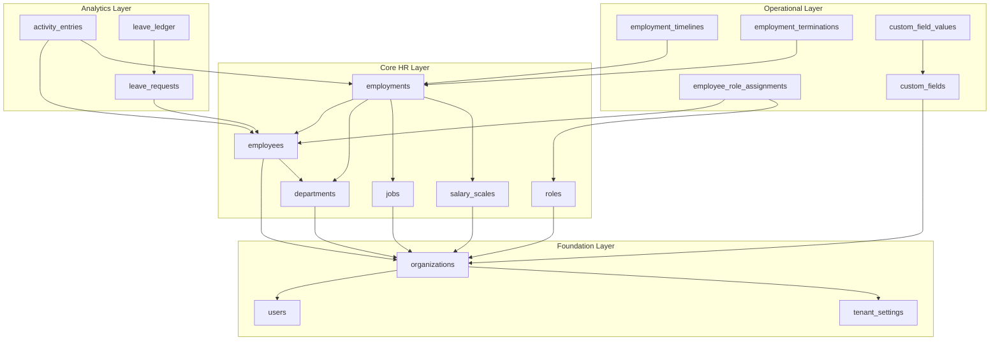

# Schema Design

<cite>
**Referenced Files in This Document**
- [20260712124858_init_employee_core_hr.sql](file://apps/hr-suite/supabase/migrations/20260712124858_init_employee_core_hr.sql)
- [20260712124911_add_tenant_rbac_and_organization.sql](file://apps/hr-suite/supabase/migrations/20260712124911_add_tenant_rbac_and_organization.sql)
- [20260715071156_add_employment_core.sql](file://apps/hr-suite/supabase/migrations/20260715071156_add_employment_core.sql)
- [20260715071422_add_employment_timelines.sql](file://apps/hr-suite/supabase/migrations/20260715071422_add_employment_timelines.sql)
- [20260715071717_add_employment_terminations.sql](file://apps/hr-suite/supabase/migrations/20260715071717_add_employment_terminations.sql)
- [20260715120810_complete_employee_core.sql](file://apps/hr-suite/supabase/migrations/20260715120810_complete_employee_core.sql)
- [20260715123119_add_custom_field_value_rpc.sql](file://apps/hr-suite/supabase/migrations/20260715123119_add_custom_field_value_rpc.sql)
- [20260715141843_add_employment_change_management.sql](file://apps/hr-suite/supabase/migrations/20260715141843_add_employment_change_management.sql)
- [20260718100000_add_job_catalog_salary_revisions.sql](file://apps/hr-suite/supabase/migrations/20260718100000_add_job_catalog_salary_revisions.sql)
- [20260718110000_add_employee_document_dossiers.sql](file://apps/hr-suite/supabase/migrations/20260718110000_add_employee_document_dossiers.sql)
- [20260722142551_add_leave_engine_foundation.sql](file://apps/hr-suite/supabase/migrations/20260722142551_add_leave_engine_foundation.sql)
- [20260722190000_add_leave_request_booking_engine.sql](file://apps/hr-suite/supabase/migrations/20260722190000_add_leave_request_booking_engine.sql)
- [20260724160000_add_employee_activity_entries.sql](file://apps/hr-suite/supabase/migrations/20260724160000_add_employee_activity_entries.sql)
</cite>

## Table of Contents
1. [Introduction](#introduction)
2. [Project Structure](#project-structure)
3. [Core Components](#core-components)
4. [Architecture Overview](#architecture-overview)
5. [Detailed Component Analysis](#detailed-component-analysis)
6. [Dependency Analysis](#dependency-analysis)
7. [Performance Considerations](#performance-considerations)
8. [Troubleshooting Guide](#troubleshooting-guide)
9. [Conclusion](#conclusion)

## Introduction

This document provides comprehensive schema design documentation for LiquidHR's PostgreSQL database. The database follows modern HRIS principles with strong emphasis on data integrity, multi-tenancy support, and flexible organizational structures. The schema supports core HR functions including employee management, employment lifecycle, organizational hierarchy, role-based access control, and leave management.

The database design emphasizes:
- **Multi-tenancy**: Complete isolation between organizations through tenant scoping
- **Flexible Organization Structure**: Support for departments, roles, and hierarchical relationships
- **Employment Lifecycle Management**: Comprehensive tracking of employment history, changes, and terminations
- **Audit Trail**: Detailed activity logging for compliance and analytics
- **Extensibility**: Custom field support for domain-specific requirements

## Project Structure

The LiquidHR database schema is organized into logical modules corresponding to different HR domains:



**Diagram sources**
- [20260712124858_init_employee_core_hr.sql:1-100](file://apps/hr-suite/supabase/migrations/20260712124858_init_employee_core_hr.sql#L1-L100)
- [20260712124911_add_tenant_rbac_and_organization.sql:1-150](file://apps/hr-suite/supabase/migrations/20260712124911_add_tenant_rbac_and_organization.sql#L1-L150)
- [20260715071156_add_employment_core.sql:1-200](file://apps/hr-suite/supabase/migrations/20260715071156_add_employment_core.sql#L1-L200)

**Section sources**
- [20260712124858_init_employee_core_hr.sql:1-50](file://apps/hr-suite/supabase/migrations/20260712124858_init_employee_core_hr.sql#L1-L50)
- [20260712124911_add_tenant_rbac_and_organization.sql:1-50](file://apps/hr-suite/supabase/migrations/20260712124911_add_tenant_rbac_and_organization.sql#L1-L50)

## Core Components

### Employee Management System

The employee core system forms the foundation of LiquidHR's HR capabilities. Employees are scoped to organizations and support comprehensive personal information management.

#### Key Tables:

**employees table**
- Primary identifier: `id` (UUID)
- Organization scoping: `organization_id` (FK to organizations)
- Personal information: name, email, phone, address fields
- Employment status tracking: `is_active`, `archived_at`
- Audit fields: `created_at`, `updated_at`, `created_by`, `updated_by`

**employment_core table**
- Links employees to organizational units
- Tracks employment periods with start/end dates
- Supports multiple concurrent employments per employee
- Includes job title, department, and reporting relationships

**Section sources**
- [20260712124858_init_employee_core_hr.sql:1-100](file://apps/hr-suite/supabase/migrations/20260712124858_init_employee_core_hr.sql#L1-L100)
- [20260715120810_complete_employee_core.sql:1-150](file://apps/hr-suite/supabase/migrations/20260715120810_complete_employee_core.sql#L1-L150)

### Employment Lifecycle Management

The employment system manages the complete lifecycle of an employee's relationship with the organization, from onboarding to termination.

#### Core Employment Tables:

**employments table**
- Represents active employment contracts
- Links to jobs, departments, and salary scales
- Tracks employment type, work hours, and compensation
- Supports part-time, full-time, and contract arrangements

**employment_timelines table**
- Historical record of employment changes
- Captures promotions, transfers, and role modifications
- Maintains audit trail for compliance requirements

**employment_terminations table**
- Records employment endings with reasons and dates
- Supports voluntary and involuntary terminations
- Tracks final settlements and exit procedures

**Section sources**
- [20260715071156_add_employment_core.sql:1-200](file://apps/hr-suite/supabase/migrations/20260715071156_add_employment_core.sql#L1-L200)
- [20260715071422_add_employment_timelines.sql:1-100](file://apps/hr-suite/supabase/migrations/20260715071422_add_employment_timelines.sql#L1-L100)
- [20260715071717_add_employment_terminations.sql:1-100](file://apps/hr-suite/supabase/migrations/20260715071717_add_employment_terminations.sql#L1-L100)

### Organizational Structure

LiquidHR supports flexible organizational hierarchies with departments, roles, and management assignments.

#### Organization Tables:

**organizations table**
- Top-level tenant container
- Contains company information and settings
- Supports multi-company structures within a single tenant

**departments table**
- Hierarchical department structure
- Supports parent-child relationships
- Includes department codes, descriptions, and managers

**roles table**
- Role-based access control definitions
- Permission sets for different job functions
- Supports inheritance and custom permissions

**Section sources**
- [20260712124911_add_tenant_rbac_and_organization.sql:1-200](file://apps/hr-suite/supabase/migrations/20260712124911_add_tenant_rbac_and_organization.sql#L1-L200)

## Architecture Overview

The LiquidHR database architecture follows a modular design pattern with clear separation of concerns:



**Diagram sources**
- [20260712124858_init_employee_core_hr.sql:1-100](file://apps/hr-suite/supabase/migrations/20260712124858_init_employee_core_hr.sql#L1-L100)
- [20260712124911_add_tenant_rbac_and_organization.sql:1-200](file://apps/hr-suite/supabase/migrations/20260712124911_add_tenant_rbac_and_organization.sql#L1-L200)
- [20260715071156_add_employment_core.sql:1-200](file://apps/hr-suite/supabase/migrations/20260715071156_add_employment_core.sql#L1-L200)

## Detailed Component Analysis

### Employee Entity Relationship Model

The employee entity serves as the central hub connecting various HR domains:



**Diagram sources**
- [20260712124858_init_employee_core_hr.sql:1-100](file://apps/hr-suite/supabase/migrations/20260712124858_init_employee_core_hr.sql#L1-L100)
- [20260715071156_add_employment_core.sql:1-200](file://apps/hr-suite/supabase/migrations/20260715071156_add_employment_core.sql#L1-L200)

### Employment Lifecycle State Machine

The employment system implements a comprehensive state machine for managing employment transitions:



**Diagram sources**
- [20260715071156_add_employment_core.sql:1-200](file://apps/hr-suite/supabase/migrations/20260715071156_add_employment_core.sql#L1-L200)
- [20260715071717_add_employment_terminations.sql:1-100](file://apps/hr-suite/supabase/migrations/20260715071717_add_employment_terminations.sql#L1-L100)

### Leave Management Engine

The leave engine provides comprehensive vacation and time-off management:



**Diagram sources**
- [20260722142551_add_leave_engine_foundation.sql:1-200](file://apps/hr-suite/supabase/migrations/20260722142551_add_leave_engine_foundation.sql#L1-L200)
- [20260722190000_add_leave_request_booking_engine.sql:1-200](file://apps/hr-suite/supabase/migrations/20260722190000_add_leave_request_booking_engine.sql#L1-L200)

## Dependency Analysis

The database schema demonstrates careful dependency management with clear separation between core entities and supporting features:



**Diagram sources**
- [20260712124911_add_tenant_rbac_and_organization.sql:1-200](file://apps/hr-suite/supabase/migrations/20260712124911_add_tenant_rbac_and_organization.sql#L1-L200)
- [20260715071156_add_employment_core.sql:1-200](file://apps/hr-suite/supabase/migrations/20260715071156_add_employment_core.sql#L1-L200)
- [20260722142551_add_leave_engine_foundation.sql:1-200](file://apps/hr-suite/supabase/migrations/20260722142551_add_leave_engine_foundation.sql#L1-L200)

**Section sources**
- [20260712124911_add_tenant_rbac_and_organization.sql:1-200](file://apps/hr-suite/supabase/migrations/20260712124911_add_tenant_rbac_and_organization.sql#L1-L200)
- [20260715071156_add_employment_core.sql:1-200](file://apps/hr-suite/supabase/migrations/20260715071156_add_employment_core.sql#L1-L200)

## Performance Considerations

### Indexing Strategy

The schema implements strategic indexing for optimal query performance:

- **Primary Key Indexes**: All tables use UUID primary keys with automatic B-tree indexes
- **Foreign Key Indexes**: Strategic indexing on frequently queried foreign key columns
- **Composite Indexes**: Multi-column indexes for common query patterns
- **Partial Indexes**: Conditional indexes for filtered queries on large datasets

### Data Normalization Principles

The database follows normalization principles while balancing practical performance needs:

- **Third Normal Form (3NF)**: Most tables achieve 3NF to eliminate redundancy
- **Controlled Denormalization**: Strategic denormalization for read-heavy operations
- **JSONB Fields**: Flexible metadata storage using PostgreSQL JSONB types
- **Partitioning Ready**: Schema designed for potential future partitioning

### Storage Optimization

- **Appropriate Data Types**: Careful selection of data types to minimize storage
- **Constraint Enforcement**: Database-level constraints prevent invalid data
- **Efficient Relationships**: Foreign key relationships maintain referential integrity
- **Audit Trail Efficiency**: Append-only audit tables for historical data

## Troubleshooting Guide

### Common Schema Issues

**Employee Access Problems**
- Verify organization scoping through `organization_id` foreign keys
- Check employee status flags (`is_active`, `archived_at`)
- Ensure proper role assignments for required permissions

**Employment Timeline Issues**
- Validate date ranges don't overlap for same employee
- Check employment status consistency across related tables
- Verify termination records match employment end dates

**Permission Denied Errors**
- Review role-based access control configurations
- Check department-level authorization settings
- Verify user-to-employee mapping in multi-tenant scenarios

### Query Optimization Tips

**Employee Lookup Queries**
```sql
-- Optimized employee search with organization scoping
SELECT e.*, d.name as department_name
FROM employees e
JOIN departments d ON e.department_id = d.id
WHERE e.organization_id = current_setting('app.current_organization')::uuid
AND e.is_active = true
ORDER BY e.last_name, e.first_name;
```

**Employment History Analysis**
```sql
-- Current employment with department and job details
SELECT 
    e.employee_id,
    e.start_date,
    e.end_date,
    j.title as job_title,
    d.name as department_name,
    ss.name as salary_scale
FROM employments e
JOIN jobs j ON e.job_id = j.id
JOIN departments d ON e.department_id = d.id
LEFT JOIN salary_scales ss ON e.salary_scale_id = ss.id
WHERE e.employee_id = ? AND e.end_date IS NULL;
```

**Section sources**
- [20260715123119_add_custom_field_value_rpc.sql:1-100](file://apps/hr-suite/supabase/migrations/20260715123119_add_custom_field_value_rpc.sql#L1-L100)
- [20260724160000_add_employee_activity_entries.sql:1-100](file://apps/hr-suite/supabase/migrations/20260724160000_add_employee_activity_entries.sql#L1-L100)

## Conclusion

The LiquidHR database schema represents a mature, enterprise-grade HR information system design. The architecture successfully balances flexibility with data integrity, supporting complex organizational structures while maintaining performance at scale. Key strengths include:

- **Comprehensive Multi-tenancy**: Complete isolation between organizations with shared infrastructure
- **Flexible Organization Modeling**: Support for complex departmental hierarchies and role-based access
- **Complete Employment Lifecycle**: Full coverage from hiring to termination with detailed audit trails
- **Extensible Architecture**: Custom field support and modular design for future enhancements
- **Performance-Optimized**: Strategic indexing and normalization for optimal query performance

The schema provides a solid foundation for building sophisticated HR applications while maintaining data consistency and security across multi-tenant environments. Future enhancements can build upon this robust foundation without compromising existing functionality or data integrity.