# Component Structure

<cite>
**Referenced Files in This Document**
- [layout.tsx](file://apps/hr-suite/app/(dashboard)/layout.tsx)
- [page.tsx](file://apps/hr-suite/app/(dashboard)/dashboard/page.tsx)
- [employee-dashboard.tsx](file://apps/hr-suite/components/employees/employee-dashboard.tsx)
- [employment-timeline.tsx](file://apps/hr-suite/components/employment/employment-timeline.tsx)
- [auth-shell.tsx](file://apps/hr-suite/components/auth/auth-shell.tsx)
- [login-form.tsx](file://apps/hr-suite/components/auth/login-form.tsx)
- [sidebar.tsx](file://apps/hr-suite/components/layout/sidebar.tsx)
- [clock.tsx](file://apps/hr-suite/components/layout/clock.tsx)
- [settings-modal.tsx](file://apps/hr-suite/components/layout/settings-modal.tsx)
- [administration-switcher.tsx](file://apps/hr-suite/components/layout/administration-switcher.tsx)
- [employee-list.tsx](file://apps/hr-suite/components/employees/employee-list.tsx)
- [employee-person-card.tsx](file://apps/hr-suite/components/employees/employee-person-card.tsx)
- [employee-create-wizard.tsx](file://apps/hr-suite/components/employees/employee-create-wizard.tsx)
- [employee-filter-panel.tsx](file://apps/hr-suite/components/employees/employee-filter-panel.tsx)
- [employment-create-form.tsx](file://apps/hr-suite/components/employment/employment-create-form.tsx)
- [employment-mutation-panel.tsx](file://apps/hr-suite/components/employment/employment-mutation-panel.tsx)
- [confirmation-dialog.tsx](file://apps/hr-suite/components/employment/confirmation-dialog.tsx)
- [work-pattern-panel.tsx](file://apps/hr-suite/components/employment/work-pattern-panel.tsx)
- [dashboard-workspace.tsx](file://apps/hr-suite/components/dashboard/dashboard-workspace.tsx)
- [widget-renderer.tsx](file://apps/hr-suite/components/dashboard/widget-renderer.tsx)
- [mini-chart.tsx](file://apps/hr-suite/components/dashboard/mini-chart.tsx)
- [dashboard-progress.tsx](file://apps/hr-suite/components/dashboard/dashboard-progress.tsx)
- [hr-calendar-page-size-select.tsx](file://apps/hr-suite/components/hr-calendar/hr-calendar-page-size-select.tsx)
- [hr-month-calendar.tsx](file://apps/hr-suite/components/hr-calendar/hr-month-calendar.tsx)
- [leave-catalog-page.tsx](file://apps/hr-suite/components/leave/leave-catalog-page.tsx)
- [accrual-rule-editor.tsx](file://apps/hr-suite/components/leave/accrual-rule-editor.tsx)
- [priority-rule-editor.tsx](file://apps/hr-suite/components/leave/priority-rule-editor.tsx)
- [organization-chart-canvas.tsx](file://apps/hr-suite/components/organization-chart/organization-chart-canvas.tsx)
- [organization-chart-explorer.tsx](file://apps/hr-suite/components/organization-chart/organization-chart-explorer.tsx)
- [organization-chart-nodes.tsx](file://apps/hr-suite/components/organization-chart/organization-chart-nodes.tsx)
- [reminder-center.tsx](file://apps/hr-suite/components/reminders/reminder-center.tsx)
- [time-hub.tsx](file://apps/hr-suite/components/reminders/time-hub.tsx)
- [custom-field-manager.tsx](file://apps/hr-suite/components/custom-fields/custom-field-manager.tsx)
- [employee-custom-fields.tsx](file://apps/hr-suite/components/custom-fields/employee-custom-fields.tsx)
- [email-link.tsx](file://apps/hr-suite/components/shared/email-link.tsx)
- [update-user-preferences.ts](file://apps/hr-suite/app/actions/update-user-preferences.ts)
</cite>

## Table of Contents
1. [Introduction](#introduction)
2. [Project Structure](#project-structure)
3. [Core Components](#core-components)
4. [Architecture Overview](#architecture-overview)
5. [Detailed Component Analysis](#detailed-component-analysis)
6. [Dependency Analysis](#dependency-analysis)
7. [Performance Considerations](#performance-considerations)
8. [Troubleshooting Guide](#troubleshooting-guide)
9. [Conclusion](#conclusion)
10. [Appendices](#appendices)

## Introduction
This document explains LiquidHR’s React component architecture with a focus on the feature-sliced organization pattern used across the components directory. It describes how components are grouped by business domain (employees, employment, dashboard, hr-calendar, leave, organization-chart, reminders, custom-fields, settings), and how pages under the Next.js app router compose these features into user flows. It also covers reusable UI patterns, composition strategies, prop interfaces, and communication between components via props and context. Complex components such as EmployeeDashboard and EmploymentTimeline are analyzed to illustrate structure and data flow.

## Project Structure
LiquidHR follows a feature-sliced architecture:
- Feature directories mirror business domains (e.g., employees, employment, dashboard).
- Each feature contains its own UI components, models, and sometimes tests.
- Shared utilities live under shared or lib folders.
- Pages under app/(dashboard) act as route-level compositions that wire feature components together.

```mermaid
graph TB
subgraph "App Router"
DASHBOARD["(dashboard)/layout.tsx"]
PAGE_DASH["dashboard/page.tsx"]
end
subgraph "Layout"
SIDEBAR["components/layout/sidebar.tsx"]
CLOCK["components/layout/clock.tsx"]
SETTINGS["components/layout/settings-modal.tsx"]
ADMIN_SWITCHER["components/layout/administration-switcher.tsx"]
end
subgraph "Features"
EMP["components/employees/*"]
EMPL["components/employment/*"]
DASH["components/dashboard/*"]
HR_CALENDAR["components/hr-calendar/*"]
LEAVE["components/leave/*"]
ORG_CHART["components/organization-chart/*"]
REMINDERS["components/reminders/*"]
CUSTOM_FIELDS["components/custom-fields/*"]
AUTH["components/auth/*"]
SHARED["components/shared/*"]
end
DASHBOARD --> SIDEBAR
DASHBOARD --> CLOCK
DASHBOARD --> SETTINGS
DASHBOARD --> ADMIN_SWITCHER
PAGE_DASH --> DASH
PAGE_DASH --> EMP
PAGE_DASH --> EMPL
PAGE_DASH --> HR_CALENDAR
PAGE_DASH --> LEAVE
PAGE_DASH --> ORG_CHART
PAGE_DASH --> REMINDERS
PAGE_DASH --> CUSTOM_FIELDS
PAGE_DASH --> AUTH
PAGE_DASH --> SHARED
```

**Diagram sources**
- [layout.tsx](file://apps/hr-suite/app/(dashboard)/layout.tsx)
- [page.tsx](file://apps/hr-suite/app/(dashboard)/dashboard/page.tsx)
- [sidebar.tsx](file://apps/hr-suite/components/layout/sidebar.tsx)
- [clock.tsx](file://apps/hr-suite/components/layout/clock.tsx)
- [settings-modal.tsx](file://apps/hr-suite/components/layout/settings-modal.tsx)
- [administration-switcher.tsx](file://apps/hr-suite/components/layout/administration-switcher.tsx)

**Section sources**
- [layout.tsx](file://apps/hr-suite/app/(dashboard)/layout.tsx)
- [page.tsx](file://apps/hr-suite/app/(dashboard)/dashboard/page.tsx)

## Core Components
The core of LiquidHR is organized by feature slices. Each slice encapsulates related UI logic and state for a specific business area.

- Employees
  - employee-list.tsx: Renders paginated lists and selection states.
  - employee-person-card.tsx: Displays summary info and actions for an employee.
  - employee-create-wizard.tsx: Multi-step creation flow with validation.
  - employee-filter-panel.tsx: Filters and search controls.
  - employee-dashboard.tsx: Aggregates multiple widgets and panels for an employee view.

- Employment
  - employment-create-form.tsx: Form for creating new employments.
  - employment-mutation-panel.tsx: Handles changes and confirmations.
  - confirmation-dialog.tsx: Reusable confirmation modal.
  - work-pattern-panel.tsx: Manages work schedule patterns.
  - employment-timeline.tsx: Visual timeline of employment events.

- Dashboard
  - dashboard-workspace.tsx: Layout and orchestration for widgets.
  - widget-renderer.tsx: Dynamic rendering of widget types.
  - mini-chart.tsx: Small chart component for metrics.
  - dashboard-progress.tsx: Progress indicators for workflows.

- HR Calendar
  - hr-month-calendar.tsx: Month view calendar.
  - hr-calendar-page-size-select.tsx: Pagination control.

- Leave
  - leave-catalog-page.tsx: Catalog management UI.
  - accrual-rule-editor.tsx: Editor for accrual rules.
  - priority-rule-editor.tsx: Editor for priority rules.

- Organization Chart
  - organization-chart-canvas.tsx: Canvas for org visualization.
  - organization-chart-explorer.tsx: Navigation and filtering.
  - organization-chart-nodes.tsx: Node rendering.

- Reminders
  - reminder-center.tsx: Centralized reminders list and actions.
  - time-hub.tsx: Time-related utilities and display.

- Custom Fields
  - custom-field-manager.tsx: CRUD for custom field definitions.
  - employee-custom-fields.tsx: Inline editing for employee fields.

- Auth
  - auth-shell.tsx: Shell for authentication flows.
  - login-form.tsx: Login form with validation.

- Shared
  - email-link.tsx: Reusable email link component.

**Section sources**
- [employee-list.tsx](file://apps/hr-suite/components/employees/employee-list.tsx)
- [employee-person-card.tsx](file://apps/hr-suite/components/employees/employee-person-card.tsx)
- [employee-create-wizard.tsx](file://apps/hr-suite/components/employees/employee-create-wizard.tsx)
- [employee-filter-panel.tsx](file://apps/hr-suite/components/employees/employee-filter-panel.tsx)
- [employee-dashboard.tsx](file://apps/hr-suite/components/employees/employee-dashboard.tsx)
- [employment-create-form.tsx](file://apps/hr-suite/components/employment/employment-create-form.tsx)
- [employment-mutation-panel.tsx](file://apps/hr-suite/components/employment/employment-mutation-panel.tsx)
- [confirmation-dialog.tsx](file://apps/hr-suite/components/employment/confirmation-dialog.tsx)
- [work-pattern-panel.tsx](file://apps/hr-suite/components/employment/work-pattern-panel.tsx)
- [employment-timeline.tsx](file://apps/hr-suite/components/employment/employment-timeline.tsx)
- [dashboard-workspace.tsx](file://apps/hr-suite/components/dashboard/dashboard-workspace.tsx)
- [widget-renderer.tsx](file://apps/hr-suite/components/dashboard/widget-renderer.tsx)
- [mini-chart.tsx](file://apps/hr-suite/components/dashboard/mini-chart.tsx)
- [dashboard-progress.tsx](file://apps/hr-suite/components/dashboard/dashboard-progress.tsx)
- [hr-month-calendar.tsx](file://apps/hr-suite/components/hr-calendar/hr-month-calendar.tsx)
- [hr-calendar-page-size-select.tsx](file://apps/hr-suite/components/hr-calendar/hr-calendar-page-size-select.tsx)
- [leave-catalog-page.tsx](file://apps/hr-suite/components/leave/leave-catalog-page.tsx)
- [accrual-rule-editor.tsx](file://apps/hr-suite/components/leave/accrual-rule-editor.tsx)
- [priority-rule-editor.tsx](file://apps/hr-suite/components/leave/priority-rule-editor.tsx)
- [organization-chart-canvas.tsx](file://apps/hr-suite/components/organization-chart/organization-chart-canvas.tsx)
- [organization-chart-explorer.tsx](file://apps/hr-suite/components/organization-chart/organization-chart-explorer.tsx)
- [organization-chart-nodes.tsx](file://apps/hr-suite/components/organization-chart/organization-chart-nodes.tsx)
- [reminder-center.tsx](file://apps/hr-suite/components/reminders/reminder-center.tsx)
- [time-hub.tsx](file://apps/hr-suite/components/reminders/time-hub.tsx)
- [custom-field-manager.tsx](file://apps/hr-suite/components/custom-fields/custom-field-manager.tsx)
- [employee-custom-fields.tsx](file://apps/hr-suite/components/custom-fields/employee-custom-fields.tsx)
- [auth-shell.tsx](file://apps/hr-suite/components/auth/auth-shell.tsx)
- [login-form.tsx](file://apps/hr-suite/components/auth/login-form.tsx)
- [email-link.tsx](file://apps/hr-suite/components/shared/email-link.tsx)

## Architecture Overview
At the top level, the dashboard layout composes global shell elements (sidebar, clock, settings, administration switcher) and renders page-specific content. Page components under app/(dashboard) act as orchestrators, importing feature components and wiring them together through props and context.

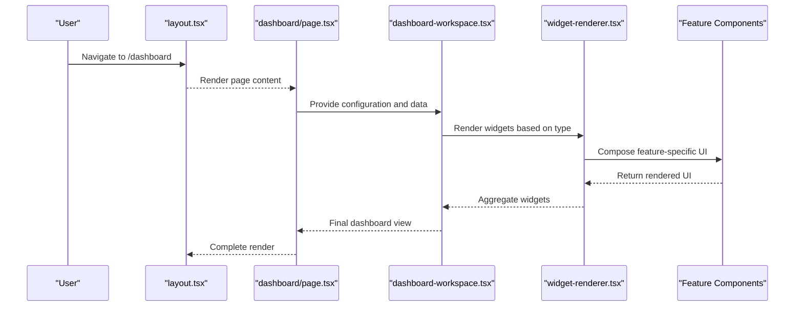

**Diagram sources**
- [layout.tsx](file://apps/hr-suite/app/(dashboard)/layout.tsx)
- [page.tsx](file://apps/hr-suite/app/(dashboard)/dashboard/page.tsx)
- [dashboard-workspace.tsx](file://apps/hr-suite/components/dashboard/dashboard-workspace.tsx)
- [widget-renderer.tsx](file://apps/hr-suite/components/dashboard/widget-renderer.tsx)

**Section sources**
- [layout.tsx](file://apps/hr-suite/app/(dashboard)/layout.tsx)
- [page.tsx](file://apps/hr-suite/app/(dashboard)/dashboard/page.tsx)
- [dashboard-workspace.tsx](file://apps/hr-suite/components/dashboard/dashboard-workspace.tsx)
- [widget-renderer.tsx](file://apps/hr-suite/components/dashboard/widget-renderer.tsx)

## Detailed Component Analysis

### EmployeeDashboard
EmployeeDashboard aggregates multiple panels and widgets to present a comprehensive view of an employee’s profile, activity, and related data. It typically composes:
- EmployeePersonCard for identity and quick actions.
- EmployeeActivityFeed for recent activities.
- CustomFields panel for dynamic attributes.
- EmploymentTimeline for contract history.
- Reminders and HR Calendar integrations.

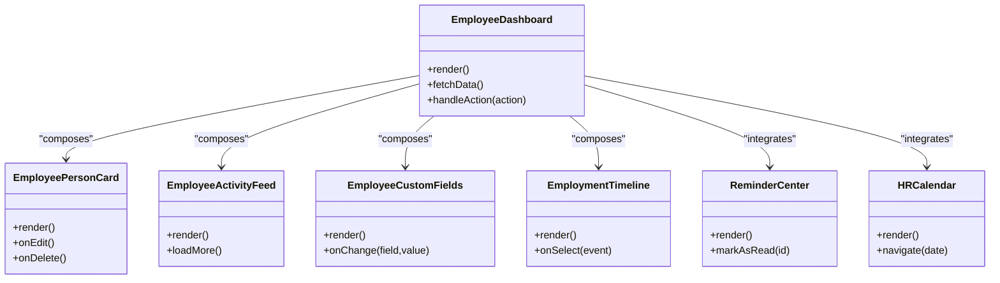

**Diagram sources**
- [employee-dashboard.tsx](file://apps/hr-suite/components/employees/employee-dashboard.tsx)
- [employee-person-card.tsx](file://apps/hr-suite/components/employees/employee-person-card.tsx)
- [employee-custom-fields.tsx](file://apps/hr-suite/components/custom-fields/employee-custom-fields.tsx)
- [employment-timeline.tsx](file://apps/hr-suite/components/employment/employment-timeline.tsx)
- [reminder-center.tsx](file://apps/hr-suite/components/reminders/reminder-center.tsx)
- [hr-month-calendar.tsx](file://apps/hr-suite/components/hr-calendar/hr-month-calendar.tsx)

**Section sources**
- [employee-dashboard.tsx](file://apps/hr-suite/components/employees/employee-dashboard.tsx)
- [employee-person-card.tsx](file://apps/hr-suite/components/employees/employee-person-card.tsx)
- [employee-custom-fields.tsx](file://apps/hr-suite/components/custom-fields/employee-custom-fields.tsx)
- [employment-timeline.tsx](file://apps/hr-suite/components/employment/employment-timeline.tsx)
- [reminder-center.tsx](file://apps/hr-suite/components/reminders/reminder-center.tsx)
- [hr-month-calendar.tsx](file://apps/hr-suite/components/hr-calendar/hr-month-calendar.tsx)

### EmploymentTimeline
EmploymentTimeline visualizes employment events over time, supporting navigation and selection. It often integrates with mutation panels for change management and confirmation dialogs for critical actions.

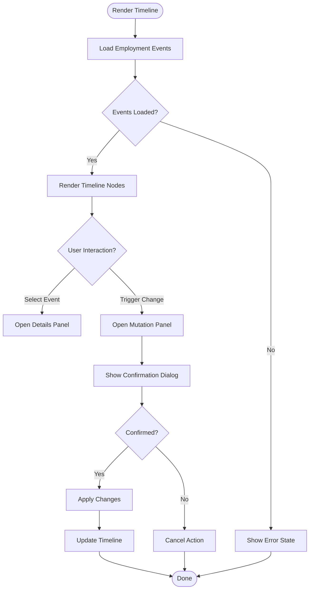

**Diagram sources**
- [employment-timeline.tsx](file://apps/hr-suite/components/employment/employment-timeline.tsx)
- [employment-mutation-panel.tsx](file://apps/hr-suite/components/employment/employment-mutation-panel.tsx)
- [confirmation-dialog.tsx](file://apps/hr-suite/components/employment/confirmation-dialog.tsx)

**Section sources**
- [employment-timeline.tsx](file://apps/hr-suite/components/employment/employment-timeline.tsx)
- [employment-mutation-panel.tsx](file://apps/hr-suite/components/employment/employment-mutation-panel.tsx)
- [confirmation-dialog.tsx](file://apps/hr-suite/components/employment/confirmation-dialog.tsx)

### Authentication Components
Authentication flows are encapsulated within the auth feature slice. The auth-shell provides a consistent wrapper, while login-form handles user input and validation.

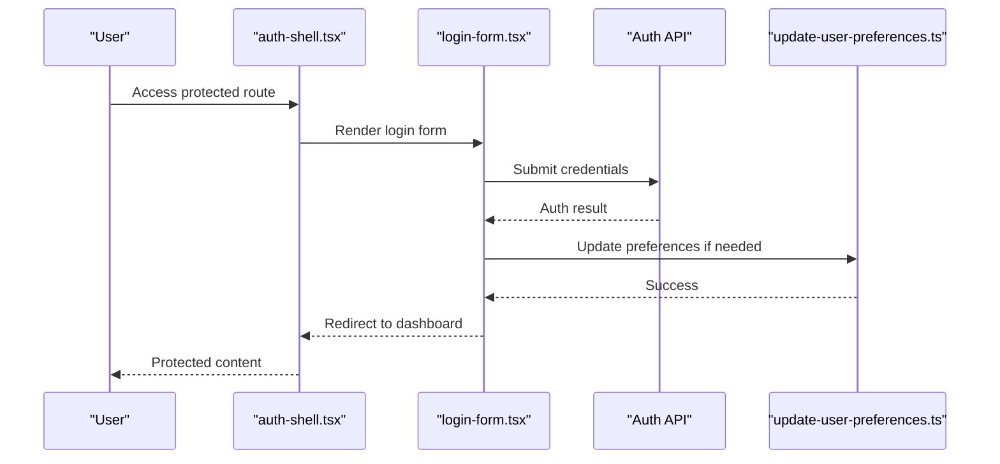

**Diagram sources**
- [auth-shell.tsx](file://apps/hr-suite/components/auth/auth-shell.tsx)
- [login-form.tsx](file://apps/hr-suite/components/auth/login-form.tsx)
- [update-user-preferences.ts](file://apps/hr-suite/app/actions/update-user-preferences.ts)

**Section sources**
- [auth-shell.tsx](file://apps/hr-suite/components/auth/auth-shell.tsx)
- [login-form.tsx](file://apps/hr-suite/components/auth/login-form.tsx)
- [update-user-preferences.ts](file://apps/hr-suite/app/actions/update-user-preferences.ts)

### Layout Components
Layout components provide global UI scaffolding:
- Sidebar: Navigation and module access.
- Clock: Real-time display.
- SettingsModal: Global settings dialog.
- AdministrationSwitcher: Switch between administrative contexts.

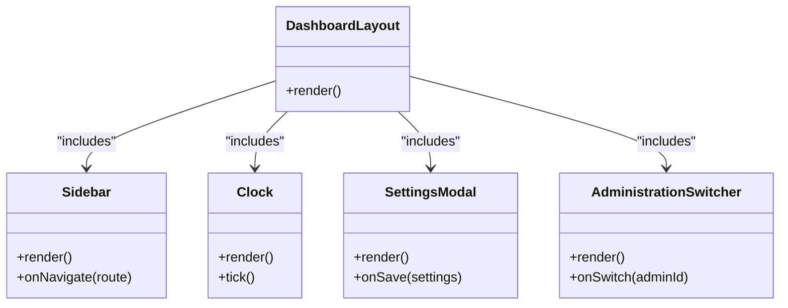

**Diagram sources**
- [sidebar.tsx](file://apps/hr-suite/components/layout/sidebar.tsx)
- [clock.tsx](file://apps/hr-suite/components/layout/clock.tsx)
- [settings-modal.tsx](file://apps/hr-suite/components/layout/settings-modal.tsx)
- [administration-switcher.tsx](file://apps/hr-suite/components/layout/administration-switcher.tsx)

**Section sources**
- [sidebar.tsx](file://apps/hr-suite/components/layout/sidebar.tsx)
- [clock.tsx](file://apps/hr-suite/components/layout/clock.tsx)
- [settings-modal.tsx](file://apps/hr-suite/components/layout/settings-modal.tsx)
- [administration-switcher.tsx](file://apps/hr-suite/components/layout/administration-switcher.tsx)

### Dashboard Widgets
The dashboard workspace orchestrates widget rendering and layout. WidgetRenderer dynamically selects and renders widget components based on configuration. MiniChart and DashboardProgress are reusable UI primitives.

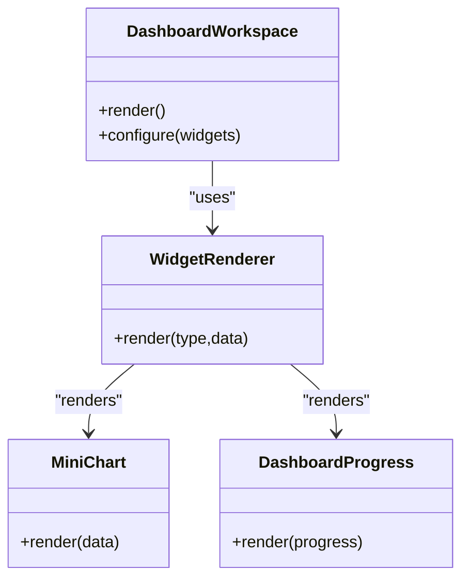

**Diagram sources**
- [dashboard-workspace.tsx](file://apps/hr-suite/components/dashboard/dashboard-workspace.tsx)
- [widget-renderer.tsx](file://apps/hr-suite/components/dashboard/widget-renderer.tsx)
- [mini-chart.tsx](file://apps/hr-suite/components/dashboard/mini-chart.tsx)
- [dashboard-progress.tsx](file://apps/hr-suite/components/dashboard/dashboard-progress.tsx)

**Section sources**
- [dashboard-workspace.tsx](file://apps/hr-suite/components/dashboard/dashboard-workspace.tsx)
- [widget-renderer.tsx](file://apps/hr-suite/components/dashboard/widget-renderer.tsx)
- [mini-chart.tsx](file://apps/hr-suite/components/dashboard/mini-chart.tsx)
- [dashboard-progress.tsx](file://apps/hr-suite/components/dashboard/dashboard-progress.tsx)

### Leave Management
Leave components manage catalogs and rule editors. AccrualRuleEditor and PriorityRuleEditor provide forms for configuring leave policies.

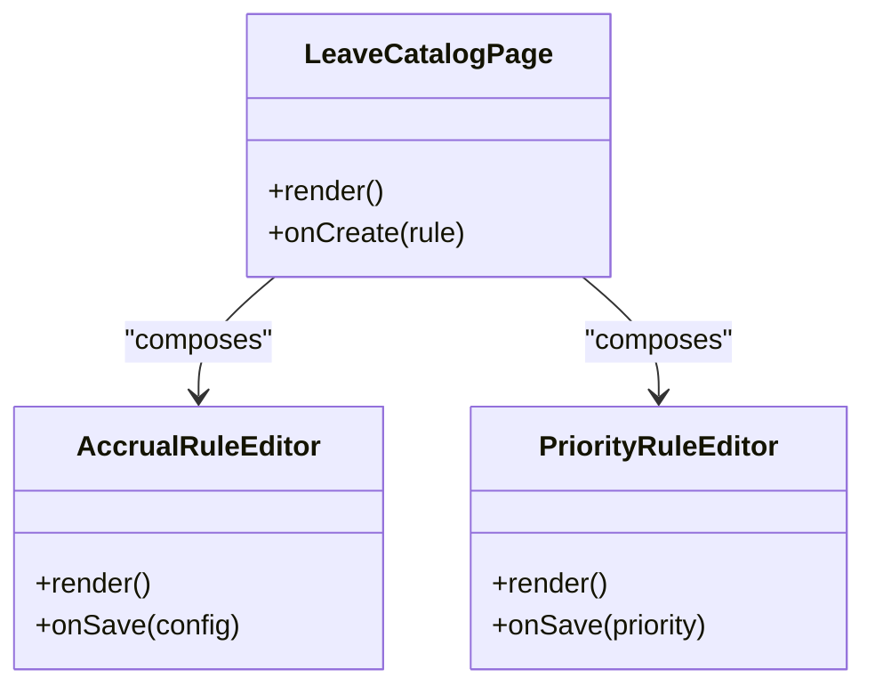

**Diagram sources**
- [leave-catalog-page.tsx](file://apps/hr-suite/components/leave/leave-catalog-page.tsx)
- [accrual-rule-editor.tsx](file://apps/hr-suite/components/leave/accrual-rule-editor.tsx)
- [priority-rule-editor.tsx](file://apps/hr-suite/components/leave/priority-rule-editor.tsx)

**Section sources**
- [leave-catalog-page.tsx](file://apps/hr-suite/components/leave/leave-catalog-page.tsx)
- [accrual-rule-editor.tsx](file://apps/hr-suite/components/leave/accrual-rule-editor.tsx)
- [priority-rule-editor.tsx](file://apps/hr-suite/components/leave/priority-rule-editor.tsx)

### Organization Chart
Organization chart components visualize hierarchical structures. Canvas handles drawing, Explorer manages navigation, and Nodes render individual entities.

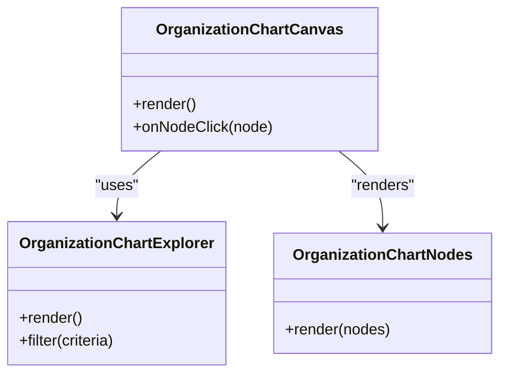

**Diagram sources**
- [organization-chart-canvas.tsx](file://apps/hr-suite/components/organization-chart/organization-chart-canvas.tsx)
- [organization-chart-explorer.tsx](file://apps/hr-suite/components/organization-chart/organization-chart-explorer.tsx)
- [organization-chart-nodes.tsx](file://apps/hr-suite/components/organization-chart/organization-chart-nodes.tsx)

**Section sources**
- [organization-chart-canvas.tsx](file://apps/hr-suite/components/organization-chart/organization-chart-canvas.tsx)
- [organization-chart-explorer.tsx](file://apps/hr-suite/components/organization-chart/organization-chart-explorer.tsx)
- [organization-chart-nodes.tsx](file://apps/hr-suite/components/organization-chart/organization-chart-nodes.tsx)

### Reminders and Time Hub
ReminderCenter centralizes reminder management, while TimeHub provides time-related utilities and displays.

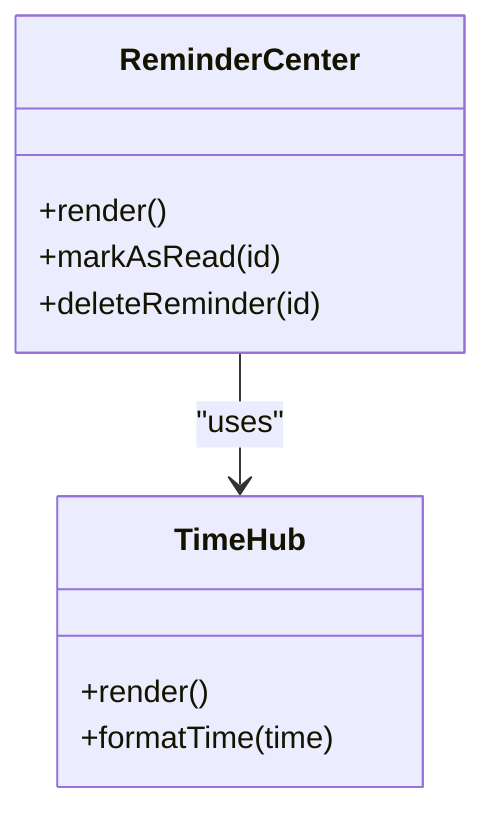

**Diagram sources**
- [reminder-center.tsx](file://apps/hr-suite/components/reminders/reminder-center.tsx)
- [time-hub.tsx](file://apps/hr-suite/components/reminders/time-hub.tsx)

**Section sources**
- [reminder-center.tsx](file://apps/hr-suite/components/reminders/reminder-center.tsx)
- [time-hub.tsx](file://apps/hr-suite/components/reminders/time-hub.tsx)

### Custom Fields
CustomFieldManager handles definition CRUD, while EmployeeCustomFields enables inline editing for employee records.

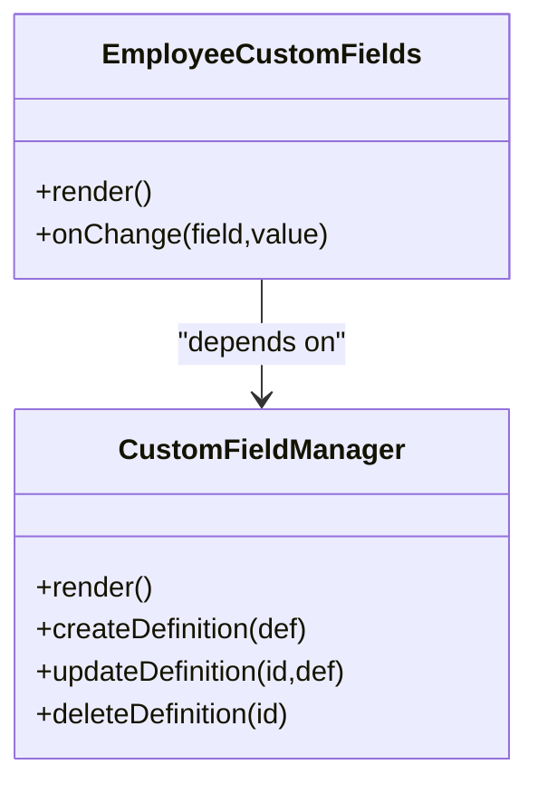

**Diagram sources**
- [custom-field-manager.tsx](file://apps/hr-suite/components/custom-fields/custom-field-manager.tsx)
- [employee-custom-fields.tsx](file://apps/hr-suite/components/custom-fields/employee-custom-fields.tsx)

**Section sources**
- [custom-field-manager.tsx](file://apps/hr-suite/components/custom-fields/custom-field-manager.tsx)
- [employee-custom-fields.tsx](file://apps/hr-suite/components/custom-fields/employee-custom-fields.tsx)

### Shared Utilities
EmailLink is a reusable component for generating mailto links.

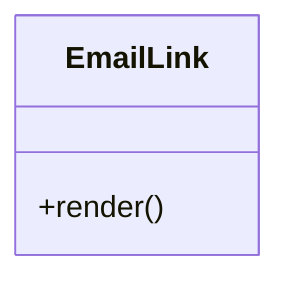

**Diagram sources**
- [email-link.tsx](file://apps/hr-suite/components/shared/email-link.tsx)

**Section sources**
- [email-link.tsx](file://apps/hr-suite/components/shared/email-link.tsx)

## Dependency Analysis
Components communicate primarily through props and context. Pages act as orchestrators, passing data down to feature components. Shared utilities and models are imported where needed.

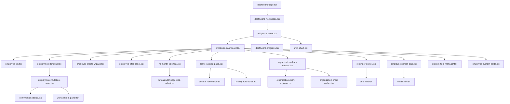

**Diagram sources**
- [page.tsx](file://apps/hr-suite/app/(dashboard)/dashboard/page.tsx)
- [dashboard-workspace.tsx](file://apps/hr-suite/components/dashboard/dashboard-workspace.tsx)
- [widget-renderer.tsx](file://apps/hr-suite/components/dashboard/widget-renderer.tsx)
- [employee-dashboard.tsx](file://apps/hr-suite/components/employees/employee-dashboard.tsx)
- [employee-list.tsx](file://apps/hr-suite/components/employees/employee-list.tsx)
- [employee-person-card.tsx](file://apps/hr-suite/components/employees/employee-person-card.tsx)
- [employee-create-wizard.tsx](file://apps/hr-suite/components/employees/employee-create-wizard.tsx)
- [employee-filter-panel.tsx](file://apps/hr-suite/components/employees/employee-filter-panel.tsx)
- [employment-timeline.tsx](file://apps/hr-suite/components/employment/employment-timeline.tsx)
- [employment-mutation-panel.tsx](file://apps/hr-suite/components/employment/employment-mutation-panel.tsx)
- [confirmation-dialog.tsx](file://apps/hr-suite/components/employment/confirmation-dialog.tsx)
- [work-pattern-panel.tsx](file://apps/hr-suite/components/employment/work-pattern-panel.tsx)
- [dashboard-progress.tsx](file://apps/hr-suite/components/dashboard/dashboard-progress.tsx)
- [mini-chart.tsx](file://apps/hr-suite/components/dashboard/mini-chart.tsx)
- [hr-month-calendar.tsx](file://apps/hr-suite/components/hr-calendar/hr-month-calendar.tsx)
- [hr-calendar-page-size-select.tsx](file://apps/hr-suite/components/hr-calendar/hr-calendar-page-size-select.tsx)
- [leave-catalog-page.tsx](file://apps/hr-suite/components/leave/leave-catalog-page.tsx)
- [accrual-rule-editor.tsx](file://apps/hr-suite/components/leave/accrual-rule-editor.tsx)
- [priority-rule-editor.tsx](file://apps/hr-suite/components/leave/priority-rule-editor.tsx)
- [organization-chart-canvas.tsx](file://apps/hr-suite/components/organization-chart/organization-chart-canvas.tsx)
- [organization-chart-explorer.tsx](file://apps/hr-suite/components/organization-chart/organization-chart-explorer.tsx)
- [organization-chart-nodes.tsx](file://apps/hr-suite/components/organization-chart/organization-chart-nodes.tsx)
- [reminder-center.tsx](file://apps/hr-suite/components/reminders/reminder-center.tsx)
- [time-hub.tsx](file://apps/hr-suite/components/reminders/time-hub.tsx)
- [custom-field-manager.tsx](file://apps/hr-suite/components/custom-fields/custom-field-manager.tsx)
- [employee-custom-fields.tsx](file://apps/hr-suite/components/custom-fields/employee-custom-fields.tsx)
- [email-link.tsx](file://apps/hr-suite/components/shared/email-link.tsx)

**Section sources**
- [page.tsx](file://apps/hr-suite/app/(dashboard)/dashboard/page.tsx)
- [dashboard-workspace.tsx](file://apps/hr-suite/components/dashboard/dashboard-workspace.tsx)
- [widget-renderer.tsx](file://apps/hr-suite/components/dashboard/widget-renderer.tsx)
- [employee-dashboard.tsx](file://apps/hr-suite/components/employees/employee-dashboard.tsx)
- [employment-timeline.tsx](file://apps/hr-suite/components/employment/employment-timeline.tsx)
- [employment-mutation-panel.tsx](file://apps/hr-suite/components/employment/employment-mutation-panel.tsx)
- [confirmation-dialog.tsx](file://apps/hr-suite/components/employment/confirmation-dialog.tsx)
- [work-pattern-panel.tsx](file://apps/hr-suite/components/employment/work-pattern-panel.tsx)
- [dashboard-progress.tsx](file://apps/hr-suite/components/dashboard/dashboard-progress.tsx)
- [mini-chart.tsx](file://apps/hr-suite/components/dashboard/mini-chart.tsx)
- [hr-month-calendar.tsx](file://apps/hr-suite/components/hr-calendar/hr-month-calendar.tsx)
- [hr-calendar-page-size-select.tsx](file://apps/hr-suite/components/hr-calendar/hr-calendar-page-size-select.tsx)
- [leave-catalog-page.tsx](file://apps/hr-suite/components/leave/leave-catalog-page.tsx)
- [accrual-rule-editor.tsx](file://apps/hr-suite/components/leave/accrual-rule-editor.tsx)
- [priority-rule-editor.tsx](file://apps/hr-suite/components/leave/priority-rule-editor.tsx)
- [organization-chart-canvas.tsx](file://apps/hr-suite/components/organization-chart/organization-chart-canvas.tsx)
- [organization-chart-explorer.tsx](file://apps/hr-suite/components/organization-chart/organization-chart-explorer.tsx)
- [organization-chart-nodes.tsx](file://apps/hr-suite/components/organization-chart/organization-chart-nodes.tsx)
- [reminder-center.tsx](file://apps/hr-suite/components/reminders/reminder-center.tsx)
- [time-hub.tsx](file://apps/hr-suite/components/reminders/time-hub.tsx)
- [custom-field-manager.tsx](file://apps/hr-suite/components/custom-fields/custom-field-manager.tsx)
- [employee-custom-fields.tsx](file://apps/hr-suite/components/custom-fields/employee-custom-fields.tsx)
- [email-link.tsx](file://apps/hr-suite/components/shared/email-link.tsx)

## Performance Considerations
- Prefer memoization for expensive computations in dashboards and timelines.
- Use lazy loading for heavy widgets and charts.
- Debounce inputs in filter panels and search fields.
- Optimize re-renders by lifting minimal state and using context sparingly.
- Implement pagination and virtualization for large lists.

[No sources needed since this section provides general guidance]

## Troubleshooting Guide
Common issues and resolutions:
- Authentication failures: Verify credentials and check preference updates after login.
- Timeline not updating: Ensure mutation panel confirms changes and timeline reloads events.
- Widget rendering errors: Validate widget configuration and data shapes passed to WidgetRenderer.
- Calendar navigation issues: Check date parsing and timezone handling in HR Calendar components.
- Custom fields not saving: Confirm field definitions exist and onChange handlers propagate correctly.

**Section sources**
- [auth-shell.tsx](file://apps/hr-suite/components/auth/auth-shell.tsx)
- [login-form.tsx](file://apps/hr-suite/components/auth/login-form.tsx)
- [employment-timeline.tsx](file://apps/hr-suite/components/employment/employment-timeline.tsx)
- [employment-mutation-panel.tsx](file://apps/hr-suite/components/employment/employment-mutation-panel.tsx)
- [widget-renderer.tsx](file://apps/hr-suite/components/dashboard/widget-renderer.tsx)
- [hr-month-calendar.tsx](file://apps/hr-suite/components/hr-calendar/hr-month-calendar.tsx)
- [custom-field-manager.tsx](file://apps/hr-suite/components/custom-fields/custom-field-manager.tsx)
- [employee-custom-fields.tsx](file://apps/hr-suite/components/custom-fields/employee-custom-fields.tsx)

## Conclusion
LiquidHR’s component architecture leverages feature-sliced organization to maintain clear boundaries and high cohesion. Pages orchestrate feature components, which communicate via props and context. Reusable UI patterns and composition strategies enable scalable development across employees, employment, dashboard, hr-calendar, leave, organization-chart, reminders, custom-fields, and shared utilities. Complex components like EmployeeDashboard and EmploymentTimeline demonstrate effective aggregation and interaction patterns.

[No sources needed since this section summarizes without analyzing specific files]

## Appendices
- Prop Interfaces: Define explicit TypeScript interfaces for all component props to ensure type safety and clarity.
- Context Usage: Limit context to global state (e.g., theme, locale, user session) to avoid unnecessary re-renders.
- Testing Strategy: Unit test feature components in isolation; integration test page compositions.

[No sources needed since this section provides general guidance]