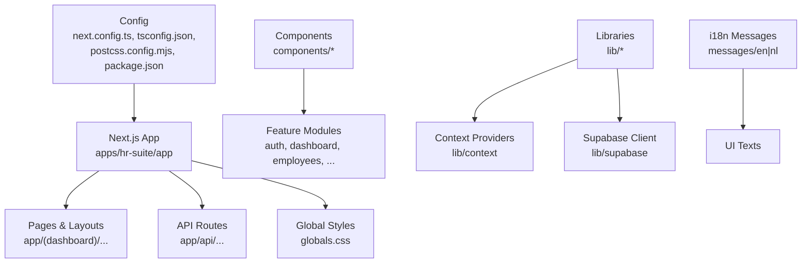
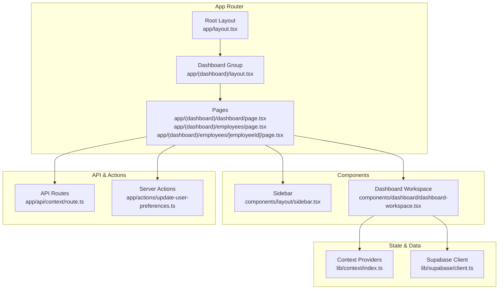
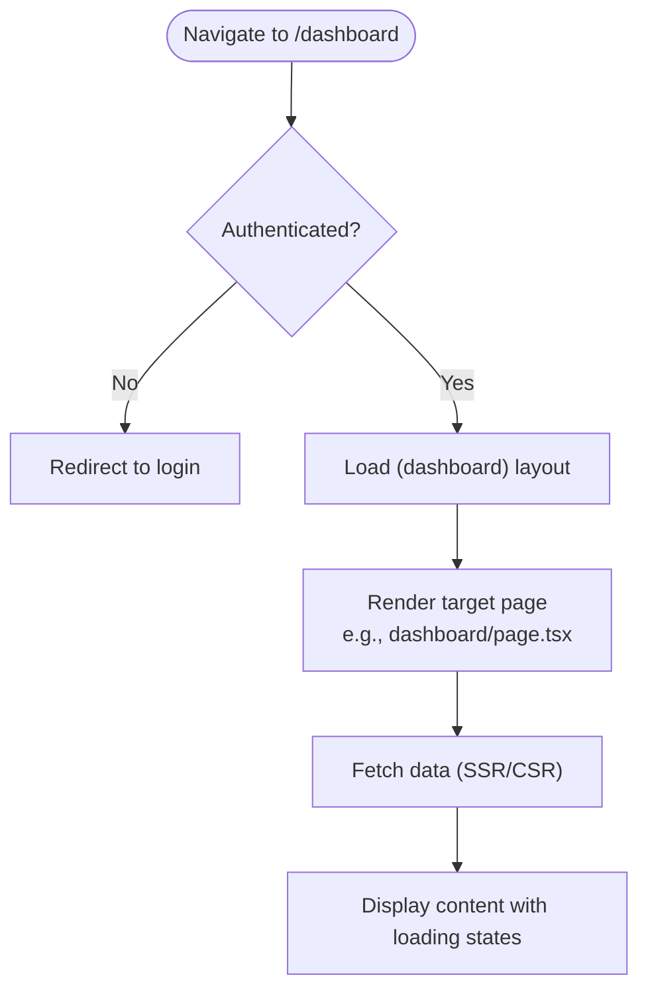
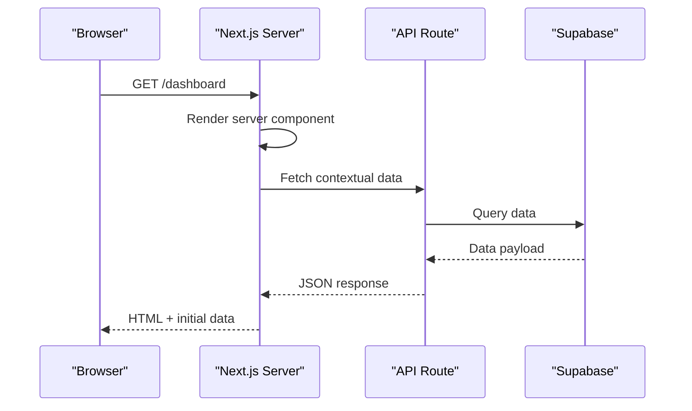
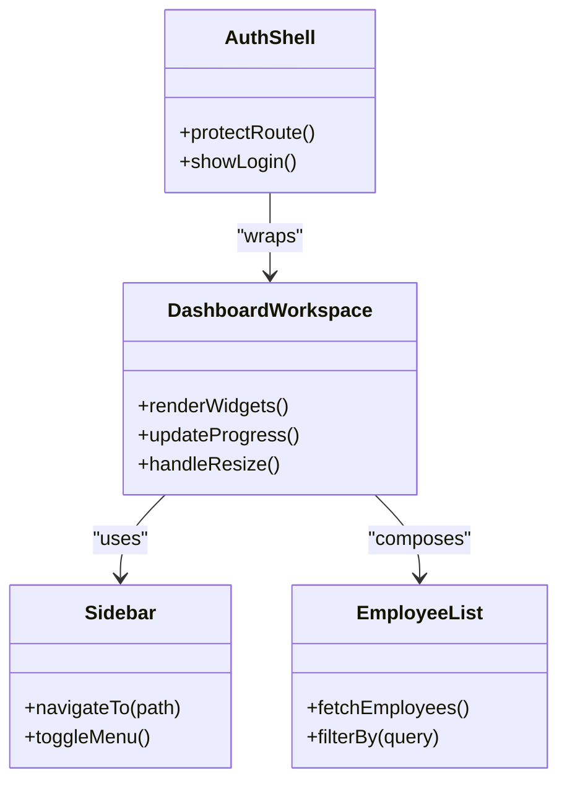
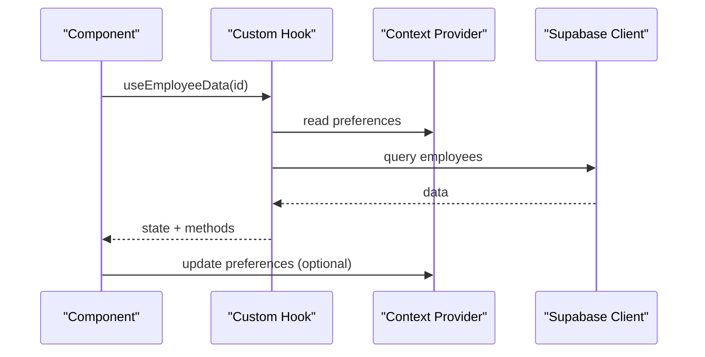
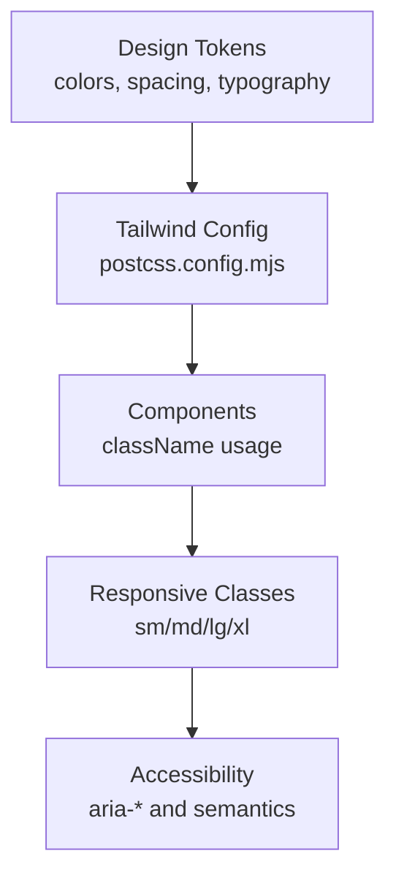
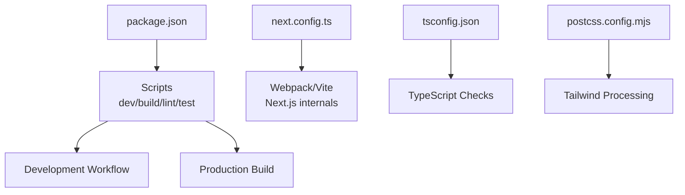
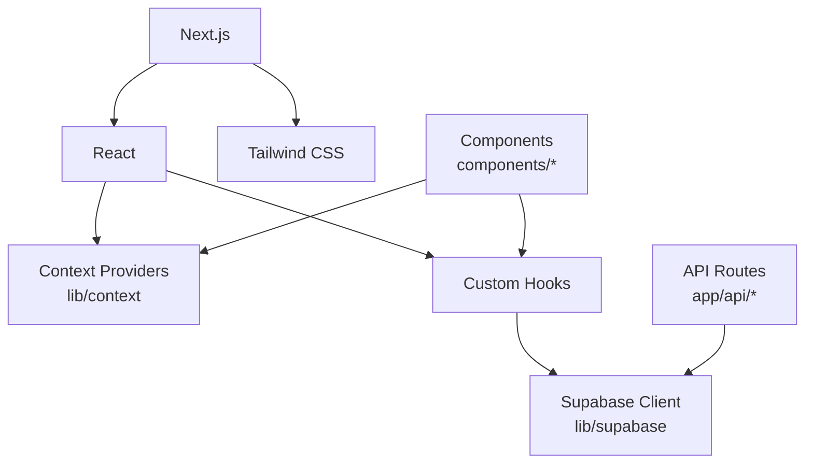

# Frontend Architecture

<cite>
**Referenced Files in This Document**
- [package.json](file://apps/hr-suite/package.json)
- [next.config.ts](file://apps/hr-suite/next.config.ts)
- [tsconfig.json](file://apps/hr-suite/tsconfig.json)
- [postcss.config.mjs](file://apps/hr-suite/postcss.config.mjs)
- [app/layout.tsx](file://apps/hr-suite/app/layout.tsx)
- [app/page.tsx](file://apps/hr-suite/app/page.tsx)
- [app/(dashboard)/layout.tsx](file://apps/hr-suite/app/(dashboard)/layout.tsx)
- [app/(dashboard)/loading.tsx](file://apps/hr-suite/app/(dashboard)/loading.tsx)
- [app/(dashboard)/dashboard/page.tsx](file://apps/hr-suite/app/(dashboard)/dashboard/page.tsx)
- [app/(dashboard)/employees/page.tsx](file://apps/hr-suite/app/(dashboard)/employees/page.tsx)
- [app/(dashboard)/employees/[employeeId]/page.tsx](file://apps/hr-suite/app/(dashboard)/employees/[employeeId]/page.tsx)
- [app/api/context/route.ts](file://apps/hr-suite/app/api/context/route.ts)
- [app/actions/update-user-preferences.ts](file://apps/hr-suite/app/actions/update-user-preferences.ts)
- [components/layout/sidebar.tsx](file://apps/hr-suite/components/layout/sidebar.tsx)
- [components/dashboard/dashboard-workspace.tsx](file://apps/hr-suite/components/dashboard/dashboard-workspace.tsx)
- [lib/context/index.ts](file://apps/hr-suite/lib/context/index.ts)
- [lib/supabase/client.ts](file://apps/hr-suite/lib/supabase/client.ts)
- [messages/en/common.json](file://apps/hr-suite/messages/en/common.json)
</cite>

## Table of Contents
1. [Introduction](#introduction)
2. [Project Structure](#project-structure)
3. [Core Components](#core-components)
4. [Architecture Overview](#architecture-overview)
5. [Detailed Component Analysis](#detailed-component-analysis)
6. [Dependency Analysis](#dependency-analysis)
7. [Performance Considerations](#performance-considerations)
8. [Troubleshooting Guide](#troubleshooting-guide)
9. [Conclusion](#conclusion)
10. [Appendices](#appendices)

## Introduction
This document explains the frontend architecture of LiquidHR’s React-based application built with Next.js App Router. It covers page structure, routing patterns, server-side rendering strategies, component organization using a feature-sliced approach, state management via React Context and custom hooks, client-side data fetching, styling with Tailwind CSS, responsive design, accessibility compliance, performance optimizations, build configuration, environment setup, and development workflow.

## Project Structure
The frontend lives under apps/hr-suite and follows Next.js conventions:
- app/: App Router routes, layouts, loading states, API routes, and global styles.
- components/: Feature-scoped UI components grouped by domain (auth, dashboard, employees, employment, hera, hr-calendar, insights, layout, leave, master-data, organization, organization-chart, reminders, settings, shared).
- lib/: Business logic, context providers, typed clients, i18n utilities, and domain-specific modules.
- messages/: Internationalization JSON files for en and nl locales.
- supabase/: Database migrations and tests to support backend features consumed by the frontend.
- Configuration files at the root of apps/hr-suite define TypeScript, PostCSS/Tailwind, ESLint, Vitest, and Next.js behavior.

**Diagram sources**
- [next.config.ts](file://apps/hr-suite/next.config.ts)
- [tsconfig.json](file://apps/hr-suite/tsconfig.json)
- [postcss.config.mjs](file://apps/hr-suite/postcss.config.mjs)
- [package.json](file://apps/hr-suite/package.json)

**Section sources**
- [package.json](file://apps/hr-suite/package.json)
- [next.config.ts](file://apps/hr-suite/next.config.ts)
- [tsconfig.json](file://apps/hr-suite/tsconfig.json)
- [postcss.config.mjs](file://apps/hr-suite/postcss.config.mjs)

## Core Components
Key building blocks include:
- Global layout and shell: Root layout defines HTML structure, theme provider, and i18n integration.
- Dashboard workspace: Orchestrates widgets, progress, and workspace state.
- Sidebar navigation: Centralized navigation across features.
- Context providers: Shared state such as user preferences, authentication, and multi-administration scope.
- Supabase client: Typed client for database access and real-time subscriptions.

Examples of where these live:
- Global layout and page entry points are defined in app/layout.tsx and app/page.tsx.
- Dashboard workspace is implemented in components/dashboard/dashboard-workspace.tsx.
- Navigation sidebar is in components/layout/sidebar.tsx.
- Context providers are centralized under lib/context.
- Supabase client is configured in lib/supabase/client.ts.

**Section sources**
- [app/layout.tsx](file://apps/hr-suite/app/layout.tsx)
- [app/page.tsx](file://apps/hr-suite/app/page.tsx)
- [components/dashboard/dashboard-workspace.tsx](file://apps/hr-suite/components/dashboard/dashboard-workspace.tsx)
- [components/layout/sidebar.tsx](file://apps/hr-suite/components/layout/sidebar.tsx)
- [lib/context/index.ts](file://apps/hr-suite/lib/context/index.ts)
- [lib/supabase/client.ts](file://apps/hr-suite/lib/supabase/client.ts)

## Architecture Overview
LiquidHR uses Next.js App Router with:
- Route groups for protected areas like (dashboard).
- Server components for initial data fetching and SSR where appropriate.
- Client components for interactivity and stateful UI.
- API routes for backend endpoints proxied or served directly.
- Actions for server-side mutations.

**Diagram sources**
- [app/layout.tsx](file://apps/hr-suite/app/layout.tsx)
- [app/(dashboard)/layout.tsx](file://apps/hr-suite/app/(dashboard)/layout.tsx)
- [app/(dashboard)/dashboard/page.tsx](file://apps/hr-suite/app/(dashboard)/dashboard/page.tsx)
- [app/(dashboard)/employees/page.tsx](file://apps/hr-suite/app/(dashboard)/employees/page.tsx)
- [app/(dashboard)/employees/[employeeId]/page.tsx](file://apps/hr-suite/app/(dashboard)/employees/[employeeId]/page.tsx)
- [components/layout/sidebar.tsx](file://apps/hr-suite/components/layout/sidebar.tsx)
- [components/dashboard/dashboard-workspace.tsx](file://apps/hr-suite/components/dashboard/dashboard-workspace.tsx)
- [lib/context/index.ts](file://apps/hr-suite/lib/context/index.ts)
- [lib/supabase/client.ts](file://apps/hr-suite/lib/supabase/client.ts)
- [app/api/context/route.ts](file://apps/hr-suite/app/api/context/route.ts)
- [app/actions/update-user-preferences.ts](file://apps/hr-suite/app/actions/update-user-preferences.ts)

## Detailed Component Analysis

### Routing Patterns and Page Structure
- Route groups: The (dashboard) group encapsulates authenticated sections, enabling shared layouts and loading states.
- Dynamic routes: Employee detail pages use [employeeId] segments for per-employee views.
- Nested routes: Employment details and related resources are nested under employee paths.
- Loading states: Each route can define loading.tsx for progressive enhancement.

**Section sources**
- [app/(dashboard)/layout.tsx](file://apps/hr-suite/app/(dashboard)/layout.tsx)
- [app/(dashboard)/loading.tsx](file://apps/hr-suite/app/(dashboard)/loading.tsx)
- [app/(dashboard)/dashboard/page.tsx](file://apps/hr-suite/app/(dashboard)/dashboard/page.tsx)
- [app/(dashboard)/employees/page.tsx](file://apps/hr-suite/app/(dashboard)/employees/page.tsx)
- [app/(dashboard)/employees/[employeeId]/page.tsx](file://apps/hr-suite/app/(dashboard)/employees/[employeeId]/page.tsx)

### Server-Side Rendering Strategies
- Use server components for initial data retrieval and SEO-critical content.
- Defer heavy interactivity to client components.
- Leverage Suspense boundaries with loading.tsx for smooth UX.
- Prefer API routes for complex server operations and actions for mutations.

**Section sources**
- [app/api/context/route.ts](file://apps/hr-suite/app/api/context/route.ts)
- [app/(dashboard)/dashboard/page.tsx](file://apps/hr-suite/app/(dashboard)/dashboard/page.tsx)

### Component Architecture and Composition
- Feature-sliced organization: Components are grouped by domain (employees, dashboard, hera, etc.), promoting cohesion and reusability.
- Reusable UI primitives: Shared components under components/shared and cross-cutting concerns like layout and auth shells.
- Prop composition: Compose complex screens from smaller, focused components to reduce prop drilling.

**Diagram sources**
- [components/dashboard/dashboard-workspace.tsx](file://apps/hr-suite/components/dashboard/dashboard-workspace.tsx)
- [components/layout/sidebar.tsx](file://apps/hr-suite/components/layout/sidebar.tsx)

**Section sources**
- [components/dashboard/dashboard-workspace.tsx](file://apps/hr-suite/components/dashboard/dashboard-workspace.tsx)
- [components/layout/sidebar.tsx](file://apps/hr-suite/components/layout/sidebar.tsx)

### State Management Patterns
- React Context: Centralize global state such as user preferences, authentication, and multi-administration context.
- Custom hooks: Encapsulate logic for data fetching, caching, and side effects.
- Client-side data fetching: Use SWR or React Query patterns within client components; integrate with Supabase client for typed queries.

**Section sources**
- [lib/context/index.ts](file://apps/hr-suite/lib/context/index.ts)
- [lib/supabase/client.ts](file://apps/hr-suite/lib/supabase/client.ts)

### Styling Approach with Tailwind CSS
- Utility-first styling via Tailwind classes applied directly in JSX.
- Responsive design patterns using breakpoints and mobile-first principles.
- Accessibility compliance through semantic elements, ARIA attributes, and keyboard navigation.

**Section sources**
- [postcss.config.mjs](file://apps/hr-suite/postcss.config.mjs)

### Build Configuration and Environment Setup
- Next.js configuration: next.config.ts controls bundling, redirects, and integrations.
- TypeScript: tsconfig.json sets strict mode, path aliases, and module resolution.
- PostCSS/Tailwind: postcss.config.mjs enables Tailwind processing.
- Package scripts: package.json defines dev, build, lint, test, and i18n checks.

**Diagram sources**
- [package.json](file://apps/hr-suite/package.json)
- [next.config.ts](file://apps/hr-suite/next.config.ts)
- [tsconfig.json](file://apps/hr-suite/tsconfig.json)
- [postcss.config.mjs](file://apps/hr-suite/postcss.config.mjs)

**Section sources**
- [package.json](file://apps/hr-suite/package.json)
- [next.config.ts](file://apps/hr-suite/next.config.ts)
- [tsconfig.json](file://apps/hr-suite/tsconfig.json)
- [postcss.config.mjs](file://apps/hr-suite/postcss.config.mjs)

## Dependency Analysis
Frontend dependencies include Next.js, React, Tailwind CSS, Supabase client, and testing tools. Internal modules organize business logic and UI components cohesively.

**Diagram sources**
- [package.json](file://apps/hr-suite/package.json)
- [lib/context/index.ts](file://apps/hr-suite/lib/context/index.ts)
- [lib/supabase/client.ts](file://apps/hr-suite/lib/supabase/client.ts)
- [app/api/context/route.ts](file://apps/hr-suite/app/api/context/route.ts)

**Section sources**
- [package.json](file://apps/hr-suite/package.json)
- [lib/context/index.ts](file://apps/hr-suite/lib/context/index.ts)
- [lib/supabase/client.ts](file://apps/hr-suite/lib/supabase/client.ts)
- [app/api/context/route.ts](file://apps/hr-suite/app/api/context/route.ts)

## Performance Considerations
- Code splitting: Leverage Next.js automatic code splitting and dynamic imports for heavy components.
- Data fetching: Use server components for initial load and client-side caching for subsequent interactions.
- Image optimization: Utilize Next.js image optimization for faster rendering.
- Memoization: Apply React.memo and useMemo where appropriate to avoid unnecessary re-renders.
- Bundle analysis: Monitor bundle size and tree-shake unused dependencies.

[No sources needed since this section provides general guidance]

## Troubleshooting Guide
Common issues and resolutions:
- Authentication flows: Ensure proper redirect handling and token validation in callback routes.
- API errors: Inspect API route responses and handle network failures gracefully.
- Context state mismatches: Validate provider initialization and default values.
- i18n keys missing: Run i18n check script to detect missing translations.

**Section sources**
- [app/auth/callback/route.ts](file://apps/hr-suite/app/auth/callback/route.ts)
- [app/api/context/route.ts](file://apps/hr-suite/app/api/context/route.ts)
- [lib/context/index.ts](file://apps/hr-suite/lib/context/index.ts)
- [scripts/check-i18n.mjs](file://apps/hr-suite/scripts/check-i18n.mjs)

## Conclusion
LiquidHR’s frontend leverages Next.js App Router for robust routing and SSR, feature-sliced components for maintainability, React Context and custom hooks for state management, Tailwind CSS for styling, and Supabase for data access. The architecture balances performance, scalability, and developer experience while ensuring accessibility and internationalization.

[No sources needed since this section summarizes without analyzing specific files]

## Appendices
- Development workflow: Use npm scripts for dev, build, lint, and test tasks.
- Environment variables: Configure Supabase URLs and secrets via environment files.
- Testing: Employ Vitest for unit tests and integration tests for API routes.

[No sources needed since this section provides general guidance]