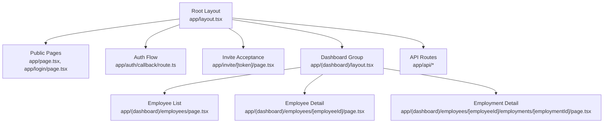
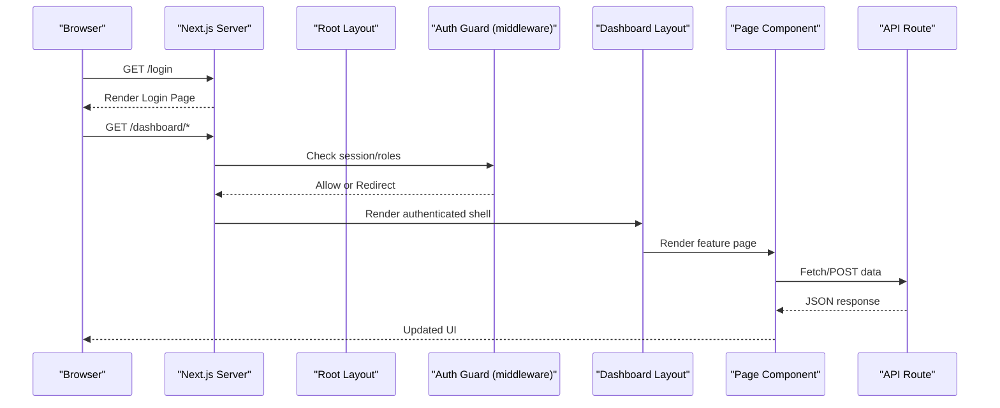
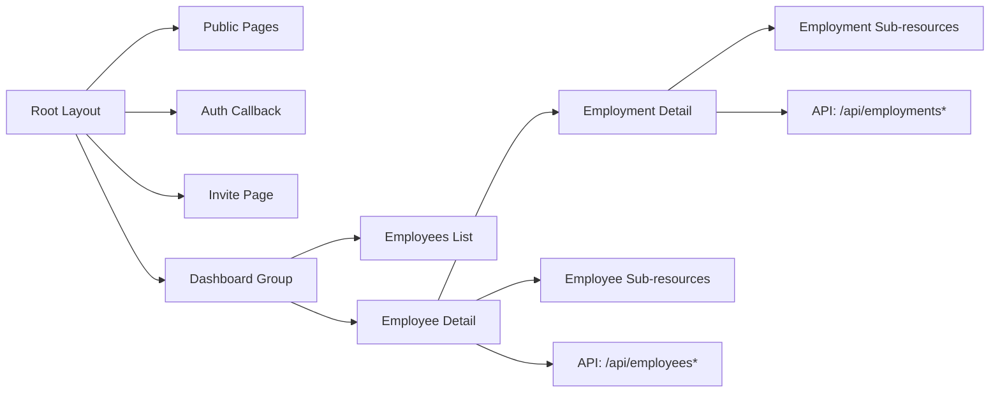

# Routing Strategy

<cite>
**Referenced Files in This Document**
- [app/layout.tsx](file://apps/hr-suite/app/layout.tsx)
- [app/(dashboard)/layout.tsx](file://apps/hr-suite/app/(dashboard)/layout.tsx)
- [app/page.tsx](file://apps/hr-suite/app/page.tsx)
- [app/login/page.tsx](file://apps/hr-suite/app/login/page.tsx)
- [app/auth/callback/route.ts](file://apps/hr-suite/app/auth/callback/route.ts)
- [app/invite/[token]/page.tsx](file://apps/hr-suite/app/invite/[token]/page.tsx)
- [app/(dashboard)/employees/[employeeId]/page.tsx](file://apps/hr-suite/app/(dashboard)/employees/[employeeId]/page.tsx)
- [app/(dashboard)/employees/[employeeId]/employments/[employmentId]/page.tsx](file://apps/hr-suite/app/(dashboard)/employees/[employeeId]/employments/[employmentId]/page.tsx)
- [app/api/employees/route.ts](file://apps/hr-suite/app/api/employees/route.ts)
- [app/api/employees/[employeeId]/route.ts](file://apps/hr-suite/app/api/employees/[employeeId]/route.ts)
- [app/api/employments/[employmentId]/route.ts](file://apps/hr-suite/app/api/employments/[employmentId]/route.ts)
</cite>

## Table of Contents
1. [Introduction](#introduction)
2. [Project Structure](#project-structure)
3. [Core Components](#core-components)
4. [Architecture Overview](#architecture-overview)
5. [Detailed Component Analysis](#detailed-component-analysis)
6. [Dependency Analysis](#dependency-analysis)
7. [Performance Considerations](#performance-considerations)
8. [Troubleshooting Guide](#troubleshooting-guide)
9. [Conclusion](#conclusion)

## Introduction
This document explains LiquidHR’s Next.js App Router routing strategy. It covers route groups for authenticated sections, dynamic routes for employee and employment details, API route organization, navigation patterns (including programmatic navigation and route parameters), authentication guards and protected routes, role-based access control at the routing level, nested routes for complex features like employee profiles with sub-resources, and how file-based routing maps to the application’s information architecture.

## Project Structure
LiquidHR uses the Next.js App Router with:
- Root layout and page for global shell and entry behavior
- A (dashboard) route group that encapsulates authenticated UI and shared layouts
- Dynamic segments for employees and employments
- An api folder organizing REST endpoints by domain
- Auth-related pages and callbacks under app/auth and app/invite

**Diagram sources**
- [app/layout.tsx](file://apps/hr-suite/app/layout.tsx)
- [app/(dashboard)/layout.tsx](file://apps/hr-suite/app/(dashboard)/layout.tsx)
- [app/page.tsx](file://apps/hr-suite/app/page.tsx)
- [app/login/page.tsx](file://apps/hr-suite/app/login/page.tsx)
- [app/auth/callback/route.ts](file://apps/hr-suite/app/auth/callback/route.ts)
- [app/invite/[token]/page.tsx](file://apps/hr-suite/app/invite/[token]/page.tsx)
- [app/(dashboard)/employees/[employeeId]/page.tsx](file://apps/hr-suite/app/(dashboard)/employees/[employeeId]/page.tsx)
- [app/(dashboard)/employees/[employeeId]/employments/[employmentId]/page.tsx](file://apps/hr-suite/app/(dashboard)/employees/[employeeId]/employments/[employmentId]/page.tsx)
- [app/api/employees/route.ts](file://apps/hr-suite/app/api/employees/route.ts)
- [app/api/employees/[employeeId]/route.ts](file://apps/hr-suite/app/api/employees/[employeeId]/route.ts)
- [app/api/employments/[employmentId]/route.ts](file://apps/hr-suite/app/api/employments/[employmentId]/route.ts)

**Section sources**
- [app/layout.tsx](file://apps/hr-suite/app/layout.tsx)
- [app/(dashboard)/layout.tsx](file://apps/hr-suite/app/(dashboard)/layout.tsx)
- [app/page.tsx](file://apps/hr-suite/app/page.tsx)
- [app/login/page.tsx](file://apps/hr-suite/app/login/page.tsx)
- [app/auth/callback/route.ts](file://apps/hr-suite/app/auth/callback/route.ts)
- [app/invite/[token]/page.tsx](file://apps/hr-suite/app/invite/[token]/page.tsx)

## Core Components
- Root layout: Provides global HTML shell, metadata, and any top-level providers or wrappers.
- Dashboard layout: Shared layout for authenticated sections; typically enforces authentication and renders sidebar/navigation.
- Public pages: Landing and login flows outside the authenticated group.
- Auth callback: Handles provider redirects and session establishment.
- Invite acceptance: Token-driven flow to accept invitations and onboard users.
- Employee and Employment dynamic routes: Parameterized pages for viewing and editing records.
- API routes: Domain-scoped REST endpoints under app/api.

Key responsibilities:
- Route groups isolate authenticated UI and apply shared middleware/guards.
- Dynamic segments enable resource-oriented URLs for employees and employments.
- API routes centralize data operations and enforce server-side authorization.

**Section sources**
- [app/layout.tsx](file://apps/hr-suite/app/layout.tsx)
- [app/(dashboard)/layout.tsx](file://apps/hr-suite/app/(dashboard)/layout.tsx)
- [app/auth/callback/route.ts](file://apps/hr-suite/app/auth/callback/route.ts)
- [app/invite/[token]/page.tsx](file://apps/hr-suite/app/invite/[token]/page.tsx)
- [app/(dashboard)/employees/[employeeId]/page.tsx](file://apps/hr-suite/app/(dashboard)/employees/[employeeId]/page.tsx)
- [app/(dashboard)/employees/[employeeId]/employments/[employmentId]/page.tsx](file://apps/hr-suite/app/(dashboard)/employees/[employeeId]/employments/[employmentId]/page.tsx)
- [app/api/employees/route.ts](file://apps/hr-suite/app/api/employees/route.ts)
- [app/api/employees/[employeeId]/route.ts](file://apps/hr-suite/app/api/employees/[employeeId]/route.ts)
- [app/api/employments/[employmentId]/route.ts](file://apps/hr-suite/app/api/employments/[employmentId]/route.ts)

## Architecture Overview
The routing architecture separates public and authenticated experiences, leverages route groups for shared behavior, and organizes APIs by domain.

**Diagram sources**
- [app/layout.tsx](file://apps/hr-suite/app/layout.tsx)
- [app/(dashboard)/layout.tsx](file://apps/hr-suite/app/(dashboard)/layout.tsx)
- [app/auth/callback/route.ts](file://apps/hr-suite/app/auth/callback/route.ts)
- [app/api/employees/route.ts](file://apps/hr-suite/app/api/employees/route.ts)

## Detailed Component Analysis

### Route Groups: (dashboard)
- Purpose: Encapsulate authenticated routes and share a layout, navigation, and guards.
- Behavior: The group name is not part of the URL but allows grouping files under a common layout and applying middleware.
- Typical implementation:
  - Place a layout.tsx inside (dashboard) to render the authenticated shell.
  - Apply authentication checks in the layout or via middleware to protect all child routes.
  - Add loading.tsx for optimistic UX during navigation within the group.

Navigation implications:
- All routes under (dashboard) inherit the same header/sidebar and protection logic.
- Programmatic navigation should target paths without the group prefix (e.g., /employees).

**Section sources**
- [app/(dashboard)/layout.tsx](file://apps/hr-suite/app/(dashboard)/layout.tsx)

### Dynamic Routing: Employees and Employments
- Employee detail: /employees/[employeeId]
  - Uses a dynamic segment to load a specific employee profile.
  - Sub-resources are nested under this path (e.g., employments, documents, addresses).
- Employment detail: /employees/[employeeId]/employments/[employmentId]
  - Two-level nesting to scope an employment record to a specific employee.
  - Supports additional sub-resources such as changes, timeline, termination, etc.

Data fetching and parameters:
- Read route params from the URL to fetch the correct entity.
- Use loading states and error boundaries around dynamic segments.

Programmatic navigation examples:
- Navigate to an employee profile using the id parameter.
- Navigate to an employment detail scoped to the selected employee.

**Section sources**
- [app/(dashboard)/employees/[employeeId]/page.tsx](file://apps/hr-suite/app/(dashboard)/employees/[employeeId]/page.tsx)
- [app/(dashboard)/employees/[employeeId]/employments/[employmentId]/page.tsx](file://apps/hr-suite/app/(dashboard)/employees/[employeeId]/employments/[employmentId]/page.tsx)

### API Route Organization
- Structure: app/api/<domain>/[...].ts
- Examples:
  - /api/employees — list/create employees
  - /api/employees/[employeeId] — get/update/delete a specific employee
  - /api/employments/[employmentId] — manage employment lifecycle
- Responsibilities:
  - Validate requests and parse parameters.
  - Enforce server-side authorization (RBAC, tenant scoping).
  - Return consistent JSON responses and errors.

Best practices:
- Keep handlers small and focused per resource.
- Centralize authorization checks and error formatting.
- Use typed request/response schemas where possible.

**Section sources**
- [app/api/employees/route.ts](file://apps/hr-suite/app/api/employees/route.ts)
- [app/api/employees/[employeeId]/route.ts](file://apps/hr-suite/app/api/employees/[employeeId]/route.ts)
- [app/api/employments/[employmentId]/route.ts](file://apps/hr-suite/app/api/employments/[employmentId]/route.ts)

### Authentication Guards and Protected Routes
- Public routes: /login, landing page, and invite acceptance.
- Protected routes: Everything under (dashboard).
- Guard placement:
  - Prefer middleware or a top-level layout guard to intercept unauthenticated requests and redirect to login.
  - For fine-grained access, check roles/permissions in API routes and within page components when necessary.

Flow overview:
- Unauthenticated access to protected routes triggers a redirect to login.
- After successful authentication, redirect back to the intended destination.
- Role checks can be enforced at both UI and API layers.

**Section sources**
- [app/layout.tsx](file://apps/hr-suite/app/layout.tsx)
- [app/(dashboard)/layout.tsx](file://apps/hr-suite/app/(dashboard)/layout.tsx)
- [app/auth/callback/route.ts](file://apps/hr-suite/app/auth/callback/route.ts)

### Role-Based Access Control at the Routing Level
- At the layout/middleware level:
  - Verify user roles before rendering protected sections.
  - Redirect unauthorized users to a “no access” page or show minimal UI.
- At the API level:
  - Enforce RBAC per endpoint to prevent privilege escalation.
- At the page level:
  - Conditionally render actions based on permissions.

Recommendations:
- Centralize role checks in reusable utilities or middleware.
- Log and monitor access denials for security auditing.

**Section sources**
- [app/(dashboard)/layout.tsx](file://apps/hr-suite/app/(dashboard)/layout.tsx)
- [app/api/employees/route.ts](file://apps/hr-suite/app/api/employees/route.ts)

### Nested Routes for Complex Features
- Employee profile with sub-resources:
  - Base: /employees/[employeeId]
  - Sub-resources: employments, documents, addresses, bank accounts, custom fields, relations, salary, archive, avatar, bsn, activity, employment-chain-assessment.
- Employment detail with sub-resources:
  - Base: /employees/[employeeId]/employments/[employmentId]
  - Sub-resources: changes, follow-ups, profile-links, termination, timeline, work-patterns.

Benefits:
- Clear hierarchical URLs that reflect data relationships.
- Predictable navigation and deep linking into specific contexts.

**Section sources**
- [app/(dashboard)/employees/[employeeId]/page.tsx](file://apps/hr-suite/app/(dashboard)/employees/[employeeId]/page.tsx)
- [app/(dashboard)/employees/[employeeId]/employments/[employmentId]/page.tsx](file://apps/hr-suite/app/(dashboard)/employees/[employeeId]/employments/[employmentId]/page.tsx)

### Navigation Patterns and Programmatic Navigation
- Declarative navigation: Use link components to navigate between pages.
- Programmatic navigation: Use router methods to navigate with parameters and query strings.
- Route parameters:
  - Employee id: /employees/[employeeId]
  - Employment id: /employees/[employeeId]/employments/[employmentId]
- Query parameters:
  - Filtering and sorting lists (e.g., search, status).
- Back/forward navigation:
  - Preserve context within route groups to avoid unnecessary re-renders.

Example scenarios:
- From employee list to employee detail with id.
- From employee detail to employment detail with both ids.
- Returning to previous view after creating or editing a record.

**Section sources**
- [app/(dashboard)/employees/[employeeId]/page.tsx](file://apps/hr-suite/app/(dashboard)/employees/[employeeId]/page.tsx)
- [app/(dashboard)/employees/[employeeId]/employments/[employmentId]/page.tsx](file://apps/hr-suite/app/(dashboard)/employees/[employeeId]/employments/[employmentId]/page.tsx)

### Relationship Between File-Based Routing and Information Architecture
- File system mirrors domain model:
  - /employees → Employee module
  - /employments → Employment module
  - /api/* → Data layer endpoints aligned with domains
- Route groups align with experience boundaries:
  - (dashboard) for authenticated HR workspace
- Nested folders represent resource hierarchies:
  - Employee sub-resources under /employees/[employeeId]
  - Employment sub-resources under /employees/[employeeId]/employments/[employmentId]

This mapping ensures intuitive URLs, predictable navigation, and maintainable code organization.

**Section sources**
- [app/(dashboard)/employees/[employeeId]/page.tsx](file://apps/hr-suite/app/(dashboard)/employees/[employeeId]/page.tsx)
- [app/(dashboard)/employees/[employeeId]/employments/[employmentId]/page.tsx](file://apps/hr-suite/app/(dashboard)/employees/[employeeId]/employments/[employmentId]/page.tsx)
- [app/api/employees/route.ts](file://apps/hr-suite/app/api/employees/route.ts)
- [app/api/employments/[employmentId]/route.ts](file://apps/hr-suite/app/api/employments/[employmentId]/route.ts)

## Dependency Analysis
Routing dependencies and interactions:

**Diagram sources**
- [app/layout.tsx](file://apps/hr-suite/app/layout.tsx)
- [app/(dashboard)/layout.tsx](file://apps/hr-suite/app/(dashboard)/layout.tsx)
- [app/(dashboard)/employees/[employeeId]/page.tsx](file://apps/hr-suite/app/(dashboard)/employees/[employeeId]/page.tsx)
- [app/(dashboard)/employees/[employeeId]/employments/[employmentId]/page.tsx](file://apps/hr-suite/app/(dashboard)/employees/[employeeId]/employments/[employmentId]/page.tsx)
- [app/api/employees/route.ts](file://apps/hr-suite/app/api/employees/route.ts)
- [app/api/employments/[employmentId]/route.ts](file://apps/hr-suite/app/api/employments/[employmentId]/route.ts)

**Section sources**
- [app/layout.tsx](file://apps/hr-suite/app/layout.tsx)
- [app/(dashboard)/layout.tsx](file://apps/hr-suite/app/(dashboard)/layout.tsx)
- [app/(dashboard)/employees/[employeeId]/page.tsx](file://apps/hr-suite/app/(dashboard)/employees/[employeeId]/page.tsx)
- [app/(dashboard)/employees/[employeeId]/employments/[employmentId]/page.tsx](file://apps/hr-suite/app/(dashboard)/employees/[employeeId]/employments/[employmentId]/page.tsx)
- [app/api/employees/route.ts](file://apps/hr-suite/app/api/employees/route.ts)
- [app/api/employments/[employmentId]/route.ts](file://apps/hr-suite/app/api/employments/[employmentId]/route.ts)

## Performance Considerations
- Use route-group layouts to minimize repeated setup for authenticated pages.
- Implement loading.tsx in dynamic routes to improve perceived performance.
- Prefetch critical links and use lightweight placeholders for heavy components.
- Keep API handlers efficient with proper indexing and pagination.
- Avoid unnecessary re-renders by memoizing components and stabilizing props.

## Troubleshooting Guide
Common routing issues and resolutions:
- 404 on dynamic routes: Ensure the segment names match exactly and values are provided.
- Unauthorized redirects: Verify middleware or layout guards and session state.
- API 403/401: Confirm RBAC policies and token validity.
- Deep-link failures: Validate nested route segments and required parameters.
- Stale data: Refresh or invalidate caches after mutations.

Checklist:
- Confirm route group membership and URL paths.
- Validate parameter extraction and types.
- Review authorization logic in layouts and API handlers.
- Inspect network requests and error responses.

**Section sources**
- [app/(dashboard)/layout.tsx](file://apps/hr-suite/app/(dashboard)/layout.tsx)
- [app/api/employees/route.ts](file://apps/hr-suite/app/api/employees/route.ts)
- [app/api/employments/[employmentId]/route.ts](file://apps/hr-suite/app/api/employments/[employmentId]/route.ts)

## Conclusion
LiquidHR’s routing strategy leverages Next.js App Router conventions to deliver a clear separation between public and authenticated experiences, robust dynamic routing for core entities, and well-organized API endpoints. Route groups simplify shared behavior and guards, while nested routes mirror the data model for intuitive navigation. By enforcing authentication and role-based access at both UI and API layers, the application maintains security and scalability. Following these patterns ensures maintainability, predictability, and a strong foundation for future growth.