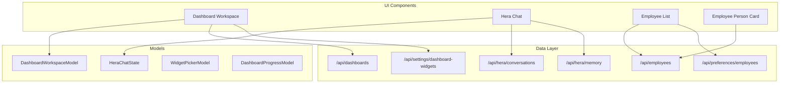
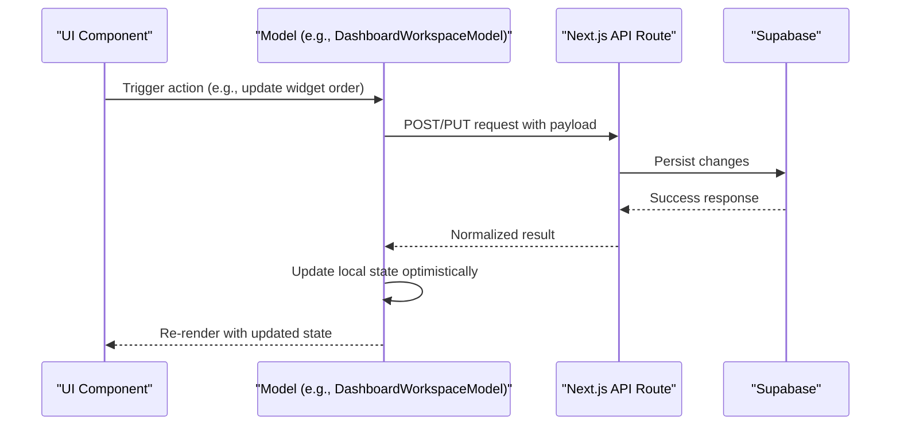
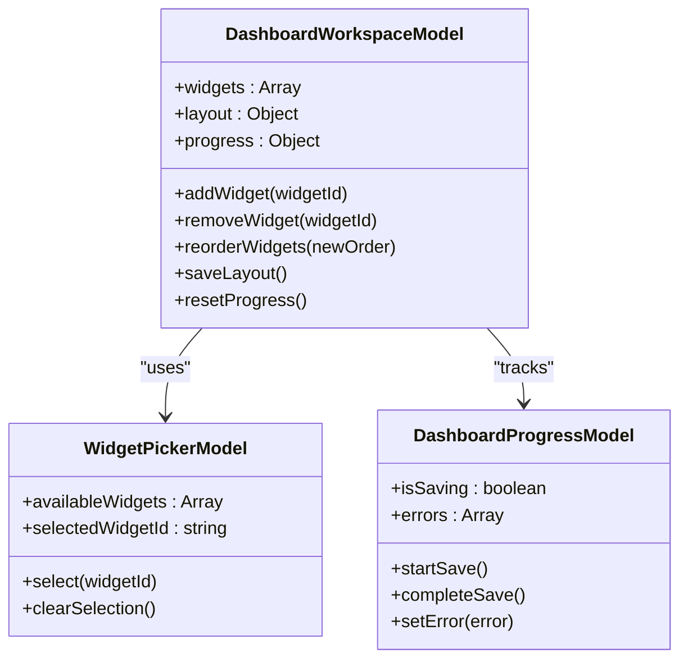
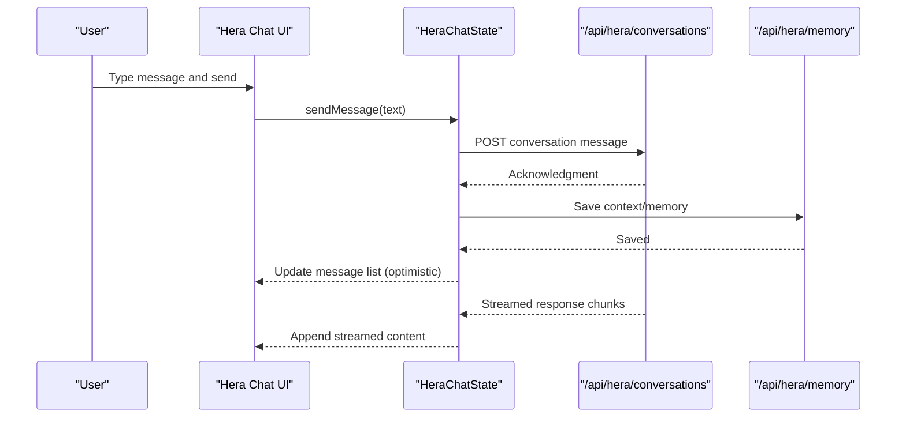
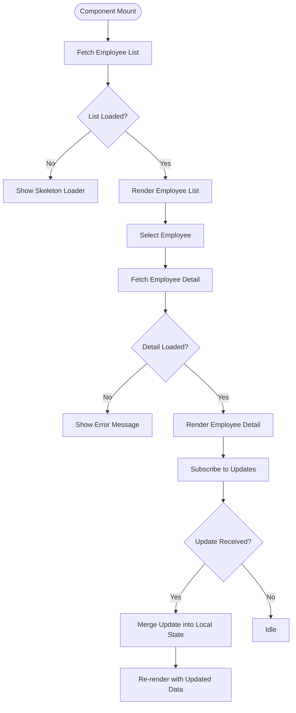
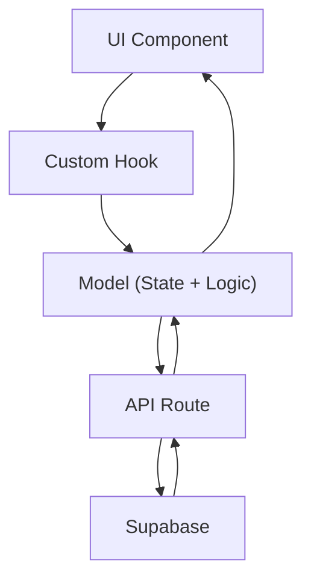
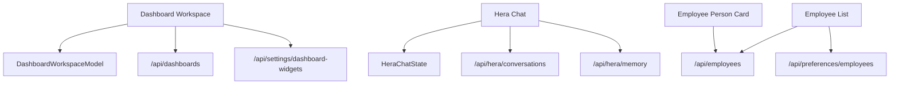

# State Management

<cite>
**Referenced Files in This Document**
- [dashboard-workspace-model.ts](file://apps/hr-suite/components/dashboard/dashboard-workspace-model.ts)
- [dashboard-workspace.tsx](file://apps/hr-suite/components/dashboard/dashboard-workspace.tsx)
- [dashboard-progress-model.ts](file://apps/hr-suite/components/dashboard/dashboard-progress-model.ts)
- [widget-picker-model.ts](file://apps/hr-suite/components/dashboard/widget-picker-model.ts)
- [hera-chat-state.ts](file://apps/hr-suite/components/hera/hera-chat-state.ts)
- [hera-floating-state.ts](file://apps/hr-suite/components/hera/hera-floating-state.ts)
- [hera-request.ts](file://apps/hr-suite/components/hera/hera-request.ts)
- [hera-response-model.ts](file://apps/hr-suite/components/hera/hera-response-model.ts)
- [hera-chat.tsx](file://apps/hr-suite/components/hera/hera-chat.tsx)
- [hera-control-card.tsx](file://apps/hr-suite/components/hera/hera-control-card.tsx)
- [hera-scope-line.tsx](file://apps/hr-suite/components/hera/hera-scope-line.tsx)
- [hera-settings.tsx](file://apps/hr-suite/components/hera/hera-settings.tsx)
- [employee-dashboard.tsx](file://apps/hr-suite/components/employees/employee-dashboard.tsx)
- [employee-list.tsx](file://apps/hr-suite/components/employees/employee-list.tsx)
- [employee-person-card.tsx](file://apps/hr-suite/components/employees/employee-person-card.tsx)
- [hr-calendar-page-size-select.tsx](file://apps/hr-suite/components/hr-calendar/hr-calendar-page-size-select.tsx)
- [hr-month-calendar.tsx](file://apps/hr-suite/components/hr-calendar/hr-month-calendar.tsx)
- [route.ts](file://apps/hr-suite/app/api/employees/route.ts)
- [route.ts](file://apps/hr-suite/app/api/dashboards/route.ts)
- [route.ts](file://apps/hr-suite/app/api/hera/conversations/route.ts)
- [route.ts](file://apps/hr-suite/app/api/hera/memory/route.ts)
- [route.ts](file://apps/hr-suite/app/api/preferences/employees/route.ts)
- [route.ts](file://apps/hr-suite/app/api/settings/dashboard-widgets/route.ts)
</cite>

## Table of Contents
1. [Introduction](#introduction)
2. [Project Structure](#project-structure)
3. [Core Components](#core-components)
4. [Architecture Overview](#architecture-overview)
5. [Detailed Component Analysis](#detailed-component-analysis)
6. [Dependency Analysis](#dependency-analysis)
7. [Performance Considerations](#performance-considerations)
8. [Troubleshooting Guide](#troubleshooting-guide)
9. [Conclusion](#conclusion)

## Introduction
This document explains LiquidHR’s frontend state management strategy with a focus on:
- React Context for global state and cross-cutting concerns
- Custom hooks for local component state and data fetching
- Model-based components that encapsulate behavior and state (e.g., DashboardWorkspaceModel, HeraChatState)
- Clear separation between server state (Supabase via Next.js API routes) and client state (React)
- Caching strategies, optimistic updates, and error handling patterns
- Real-time employee updates and AI chat interactions
- Performance considerations for large datasets and synchronization across components

The goal is to provide both a conceptual overview and code-level guidance so developers can implement consistent, performant, and maintainable stateful features.

## Project Structure
LiquidHR organizes state-related logic into three primary layers:
- UI Components: Presentational and container components that render the UI and manage local state
- Models: Encapsulate business logic and state transitions for complex features (e.g., dashboard workspace, chat state)
- Data Layer: Next.js API routes that proxy requests to Supabase and return normalized responses

**Diagram sources**
- [dashboard-workspace.tsx](file://apps/hr-suite/components/dashboard/dashboard-workspace.tsx)
- [dashboard-workspace-model.ts](file://apps/hr-suite/components/dashboard/dashboard-workspace-model.ts)
- [hera-chat.tsx](file://apps/hr-suite/components/hera/hera-chat.tsx)
- [hera-chat-state.ts](file://apps/hr-suite/components/hera/hera-chat-state.ts)
- [employee-list.tsx](file://apps/hr-suite/components/employees/employee-list.tsx)
- [employee-person-card.tsx](file://apps/hr-suite/components/employees/employee-person-card.tsx)
- [route.ts](file://apps/hr-suite/app/api/employees/route.ts)
- [route.ts](file://apps/hr-suite/app/api/dashboards/route.ts)
- [route.ts](file://apps/hr-suite/app/api/hera/conversations/route.ts)
- [route.ts](file://apps/hr-suite/app/api/hera/memory/route.ts)
- [route.ts](file://apps/hr-suite/app/api/preferences/employees/route.ts)
- [route.ts](file://apps/hr-suite/app/api/settings/dashboard-widgets/route.ts)

**Section sources**
- [dashboard-workspace.tsx](file://apps/hr-suite/components/dashboard/dashboard-workspace.tsx)
- [dashboard-workspace-model.ts](file://apps/hr-suite/components/dashboard/dashboard-workspace-model.ts)
- [hera-chat.tsx](file://apps/hr-suite/components/hera/hera-chat.tsx)
- [hera-chat-state.ts](file://apps/hr-suite/components/hera/hera-chat-state.ts)
- [employee-list.tsx](file://apps/hr-suite/components/employees/employee-list.tsx)
- [employee-person-card.tsx](file://apps/hr-suite/components/employees/employee-person-card.tsx)
- [route.ts](file://apps/hr-suite/app/api/employees/route.ts)
- [route.ts](file://apps/hr-suite/app/api/dashboards/route.ts)
- [route.ts](file://apps/hr-suite/app/api/hera/conversations/route.ts)
- [route.ts](file://apps/hr-suite/app/api/hera/memory/route.ts)
- [route.ts](file://apps/hr-suite/app/api/preferences/employees/route.ts)
- [route.ts](file://apps/hr-suite/app/api/settings/dashboard-widgets/route.ts)

## Core Components
Key model-based components centralize state and behavior:
- DashboardWorkspaceModel: Manages dashboard layout, widget configuration, and progress tracking
- WidgetPickerModel: Handles selection and ordering of widgets within dashboards
- DashboardProgressModel: Tracks loading and completion states for widget rendering
- HeraChatState: Encapsulates conversation lifecycle, message history, streaming responses, and memory integration

These models are consumed by their respective UI components to keep presentation logic separate from stateful behavior.

**Section sources**
- [dashboard-workspace-model.ts](file://apps/hr-suite/components/dashboard/dashboard-workspace-model.ts)
- [widget-picker-model.ts](file://apps/hr-suite/components/dashboard/widget-picker-model.ts)
- [dashboard-progress-model.ts](file://apps/hr-suite/components/dashboard/dashboard-progress-model.ts)
- [hera-chat-state.ts](file://apps/hr-suite/components/hera/hera-chat-state.ts)

## Architecture Overview
LiquidHR follows a clear separation between server state and client state:
- Server state lives in Supabase and is accessed through Next.js API routes
- Client state resides in React components and models, often using Context or custom hooks
- Models act as intermediaries that coordinate UI state and server interactions
- Real-time updates are handled via subscriptions or polling where applicable

**Diagram sources**
- [dashboard-workspace-model.ts](file://apps/hr-suite/components/dashboard/dashboard-workspace-model.ts)
- [dashboard-workspace.tsx](file://apps/hr-suite/components/dashboard/dashboard-workspace.tsx)
- [route.ts](file://apps/hr-suite/app/api/dashboards/route.ts)

**Section sources**
- [dashboard-workspace.tsx](file://apps/hr-suite/components/dashboard/dashboard-workspace.tsx)
- [dashboard-workspace-model.ts](file://apps/hr-suite/components/dashboard/dashboard-workspace-model.ts)
- [route.ts](file://apps/hr-suite/app/api/dashboards/route.ts)

## Detailed Component Analysis

### DashboardWorkspaceModel
Responsibilities:
- Maintain dashboard configuration and widget list
- Coordinate widget picker interactions and ordering
- Track progress for asynchronous operations like saving layouts
- Provide methods to add, remove, reorder, and persist widgets

**Diagram sources**
- [dashboard-workspace-model.ts](file://apps/hr-suite/components/dashboard/dashboard-workspace-model.ts)
- [widget-picker-model.ts](file://apps/hr-suite/components/dashboard/widget-picker-model.ts)
- [dashboard-progress-model.ts](file://apps/hr-suite/components/dashboard/dashboard-progress-model.ts)

**Section sources**
- [dashboard-workspace-model.ts](file://apps/hr-suite/components/dashboard/dashboard-workspace-model.ts)
- [widget-picker-model.ts](file://apps/hr-suite/components/dashboard/widget-picker-model.ts)
- [dashboard-progress-model.ts](file://apps/hr-suite/components/dashboard/dashboard-progress-model.ts)

### HeraChatState
Responsibilities:
- Manage conversation lifecycle (create, send, receive, stream)
- Maintain message history and current input state
- Integrate with memory endpoints for context persistence
- Handle errors and retry logic for failed requests

**Diagram sources**
- [hera-chat-state.ts](file://apps/hr-suite/components/hera/hera-chat-state.ts)
- [hera-chat.tsx](file://apps/hr-suite/components/hera/hera-chat.tsx)
- [route.ts](file://apps/hr-suite/app/api/hera/conversations/route.ts)
- [route.ts](file://apps/hr-suite/app/api/hera/memory/route.ts)

**Section sources**
- [hera-chat-state.ts](file://apps/hr-suite/components/hera/hera-chat-state.ts)
- [hera-chat.tsx](file://apps/hr-suite/components/hera/hera-chat.tsx)
- [route.ts](file://apps/hr-suite/app/api/hera/conversations/route.ts)
- [route.ts](file://apps/hr-suite/app/api/hera/memory/route.ts)

### Employee Data Flow
Responsibilities:
- Fetch and display employee lists with pagination and filtering
- Show detailed employee information in person cards
- Support real-time updates via subscriptions or polling

**Diagram sources**
- [employee-list.tsx](file://apps/hr-suite/components/employees/employee-list.tsx)
- [employee-person-card.tsx](file://apps/hr-suite/components/employees/employee-person-card.tsx)
- [route.ts](file://apps/hr-suite/app/api/employees/route.ts)

**Section sources**
- [employee-list.tsx](file://apps/hr-suite/components/employees/employee-list.tsx)
- [employee-person-card.tsx](file://apps/hr-suite/components/employees/employee-person-card.tsx)
- [route.ts](file://apps/hr-suite/app/api/employees/route.ts)

### Conceptual Overview
The following diagram illustrates the general pattern used across LiquidHR for managing state:

[No sources needed since this diagram shows conceptual workflow, not actual code structure]

## Dependency Analysis
Components depend on models for stateful behavior, and models depend on API routes for data persistence. The following diagram highlights key dependencies:

**Diagram sources**
- [dashboard-workspace.tsx](file://apps/hr-suite/components/dashboard/dashboard-workspace.tsx)
- [dashboard-workspace-model.ts](file://apps/hr-suite/components/dashboard/dashboard-workspace-model.ts)
- [hera-chat.tsx](file://apps/hr-suite/components/hera/hera-chat.tsx)
- [hera-chat-state.ts](file://apps/hr-suite/components/hera/hera-chat-state.ts)
- [employee-list.tsx](file://apps/hr-suite/components/employees/employee-list.tsx)
- [employee-person-card.tsx](file://apps/hr-suite/components/employees/employee-person-card.tsx)
- [route.ts](file://apps/hr-suite/app/api/employees/route.ts)
- [route.ts](file://apps/hr-suite/app/api/dashboards/route.ts)
- [route.ts](file://apps/hr-suite/app/api/hera/conversations/route.ts)
- [route.ts](file://apps/hr-suite/app/api/hera/memory/route.ts)
- [route.ts](file://apps/hr-suite/app/api/preferences/employees/route.ts)
- [route.ts](file://apps/hr-suite/app/api/settings/dashboard-widgets/route.ts)

**Section sources**
- [dashboard-workspace.tsx](file://apps/hr-suite/components/dashboard/dashboard-workspace.tsx)
- [dashboard-workspace-model.ts](file://apps/hr-suite/components/dashboard/dashboard-workspace-model.ts)
- [hera-chat.tsx](file://apps/hr-suite/components/hera/hera-chat.tsx)
- [hera-chat-state.ts](file://apps/hr-suite/components/hera/hera-chat-state.ts)
- [employee-list.tsx](file://apps/hr-suite/components/employees/employee-list.tsx)
- [employee-person-card.tsx](file://apps/hr-suite/components/employees/employee-person-card.tsx)
- [route.ts](file://apps/hr-suite/app/api/employees/route.ts)
- [route.ts](file://apps/hr-suite/app/api/dashboards/route.ts)
- [route.ts](file://apps/hr-suite/app/api/hera/conversations/route.ts)
- [route.ts](file://apps/hr-suite/app/api/hera/memory/route.ts)
- [route.ts](file://apps/hr-suite/app/api/preferences/employees/route.ts)
- [route.ts](file://apps/hr-suite/app/api/settings/dashboard-widgets/route.ts)

## Performance Considerations
- Use memoization (e.g., useMemo, useCallback) in components to prevent unnecessary re-renders
- Implement pagination and virtualization for large datasets (e.g., employee lists)
- Debounce user inputs and search queries to reduce API calls
- Cache frequently accessed data locally (e.g., preferences, settings)
- Optimize real-time updates by batching and diffing changes
- Avoid deep object cloning; use immutable updates where possible

[No sources needed since this section provides general guidance]

## Troubleshooting Guide
Common issues and resolutions:
- Network errors: Implement retry logic and user-friendly error messages
- State desynchronization: Validate server responses against expected schema
- Memory leaks: Clean up subscriptions and event listeners in useEffect
- Performance bottlenecks: Profile component renders and optimize heavy computations
- Optimistic updates rollback: Ensure proper error handling to revert local changes

**Section sources**
- [hera-chat-state.ts](file://apps/hr-suite/components/hera/hera-chat-state.ts)
- [dashboard-workspace-model.ts](file://apps/hr-suite/components/dashboard/dashboard-workspace-model.ts)

## Conclusion
LiquidHR’s frontend employs a robust state management strategy centered around model-based components, React Context, and custom hooks. By clearly separating server state from client state and implementing caching, optimistic updates, and comprehensive error handling, the application delivers a responsive and reliable user experience. Following these patterns ensures scalability and maintainability as the application grows.

[No sources needed since this section summarizes without analyzing specific files]