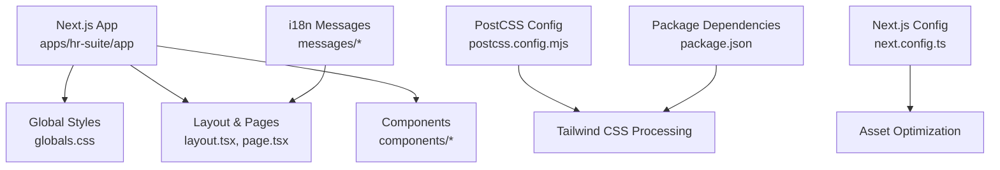
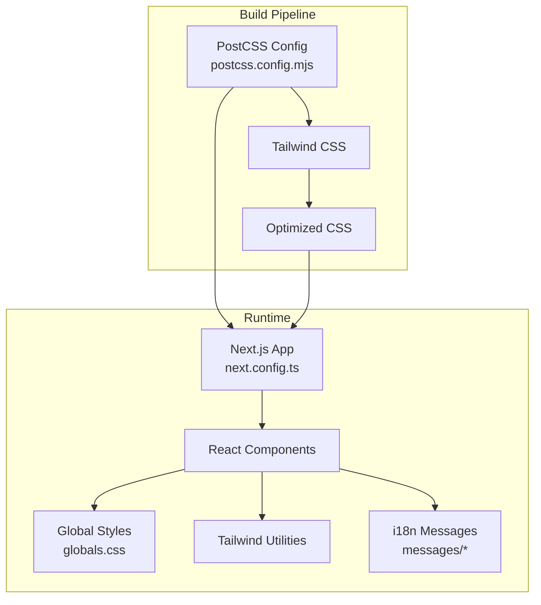
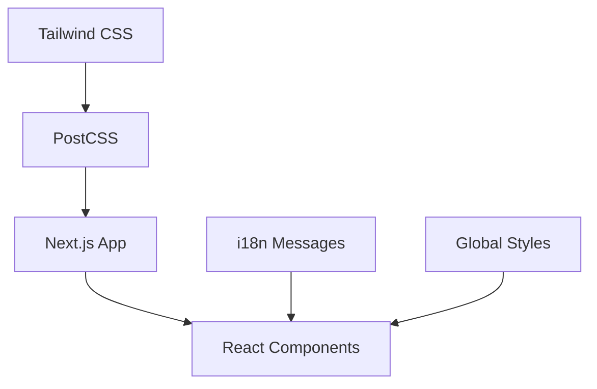

# Styling System

<cite>
**Referenced Files in This Document**
- [globals.css](file://apps/hr-suite/app/globals.css)
- [postcss.config.mjs](file://apps/hr-suite/postcss.config.mjs)
- [next.config.ts](file://apps/hr-suite/next.config.ts)
- [package.json](file://apps/hr-suite/package.json)
- [layout.tsx](file://apps/hr-suite/app/layout.tsx)
- [page.tsx](file://apps/hr-suite/app/page.tsx)
- [sidebar.tsx](file://apps/hr-suite/components/layout/sidebar.tsx)
- [dashboard-workspace.tsx](file://apps/hr-suite/components/dashboard/dashboard-workspace.tsx)
- [organization-chart-canvas.tsx](file://apps/hr-suite/components/organization-chart/organization-chart-canvas.tsx)
- [hr-month-calendar.tsx](file://apps/hr-suite/components/hr-calendar/hr-month-calendar.tsx)
- [personal-settings-form.tsx](file://apps/hr-suite/components/settings/personal-settings-form.tsx)
- [i18n/index.ts](file://apps/hr-suite/lib/i18n/index.ts)
- [messages/en/common.json](file://apps/hr-suite/messages/en/common.json)
</cite>

## Table of Contents
1. [Introduction](#introduction)
2. [Project Structure](#project-structure)
3. [Core Components](#core-components)
4. [Architecture Overview](#architecture-overview)
5. [Detailed Component Analysis](#detailed-component-analysis)
6. [Dependency Analysis](#dependency-analysis)
7. [Performance Considerations](#performance-considerations)
8. [Troubleshooting Guide](#troubleshooting-guide)
9. [Conclusion](#conclusion)
10. [Appendices](#appendices)

## Introduction
This document explains LiquidHR’s styling system built on Tailwind CSS. It covers global styles configuration, responsive design patterns, component styling conventions, internationalization integration with styling, accessibility compliance, theme customization and design tokens, and build configuration for CSS processing and optimization in production. The goal is to provide both a high-level overview and practical guidance for developers working on the UI layer.

## Project Structure
LiquidHR uses a Next.js application structure where styling is primarily handled through:
- Global CSS entry point for base styles and Tailwind directives
- PostCSS configuration to process Tailwind and related plugins
- Next.js configuration for asset handling and optimizations
- React components that apply Tailwind utility classes consistently
- Internationalization resources under messages for text content

**Diagram sources**
- [globals.css](file://apps/hr-suite/app/globals.css)
- [postcss.config.mjs](file://apps/hr-suite/postcss.config.mjs)
- [next.config.ts](file://apps/hr-suite/next.config.ts)
- [package.json](file://apps/hr-suite/package.json)
- [layout.tsx](file://apps/hr-suite/app/layout.tsx)
- [page.tsx](file://apps/hr-suite/app/page.tsx)

**Section sources**
- [globals.css](file://apps/hr-suite/app/globals.css)
- [postcss.config.mjs](file://apps/hr-suite/postcss.config.mjs)
- [next.config.ts](file://apps/hr-suite/next.config.ts)
- [package.json](file://apps/hr-suite/package.json)
- [layout.tsx](file://apps/hr-suite/app/layout.tsx)
- [page.tsx](file://apps/hr-suite/app/page.tsx)

## Core Components
The styling system centers around these core elements:
- Global styles: Base typography, color palette, spacing, and Tailwind directives are defined here.
- PostCSS pipeline: Tailwind CSS is configured via PostCSS to generate optimized CSS.
- Next.js integration: Asset bundling, minification, and tree-shaking are managed by Next.js.
- Component styling: Components use Tailwind utilities consistently, enabling responsive and accessible UIs.
- i18n integration: Text content is sourced from JSON message files and injected into components.

Key responsibilities:
- Define consistent design tokens (colors, spacing, typography) in global styles or Tailwind config.
- Ensure responsive behavior using Tailwind’s breakpoint system.
- Maintain accessibility by applying semantic HTML and appropriate ARIA attributes within components.
- Keep text content decoupled from styling via i18n message files.

**Section sources**
- [globals.css](file://apps/hr-suite/app/globals.css)
- [postcss.config.mjs](file://apps/hr-suite/postcss.config.mjs)
- [next.config.ts](file://apps/hr-suite/next.config.ts)
- [package.json](file://apps/hr-suite/package.json)

## Architecture Overview
The styling architecture integrates Tailwind CSS with Next.js and PostCSS to produce efficient, maintainable styles. Components consume Tailwind utilities while global styles establish baseline design tokens. i18n ensures text content remains separate from presentation.

**Diagram sources**
- [postcss.config.mjs](file://apps/hr-suite/postcss.config.mjs)
- [next.config.ts](file://apps/hr-suite/next.config.ts)
- [globals.css](file://apps/hr-suite/app/globals.css)
- [package.json](file://apps/hr-suite/package.json)

## Detailed Component Analysis

### Global Styles Configuration
- Purpose: Establish base typography, colors, spacing, and Tailwind directives.
- Practices:
  - Use semantic class names sparingly; rely on Tailwind utilities for most styling.
  - Centralize design tokens (e.g., primary color, font families) in global styles or Tailwind config.
  - Ensure cross-browser compatibility by including necessary vendor prefixes via Tailwind.

Responsive patterns:
- Apply mobile-first breakpoints using Tailwind’s responsive prefixes (sm:, md:, lg:, xl:).
- Use flexible layouts (flex, grid) with responsive modifiers to adapt to different screen sizes.

Accessibility:
- Ensure sufficient color contrast for text and interactive elements.
- Provide focus indicators for keyboard navigation.
- Use semantic HTML elements (button, nav, main) to improve screen reader support.

**Section sources**
- [globals.css](file://apps/hr-suite/app/globals.css)

### Responsive Design Patterns
Components demonstrate responsive layouts through:
- Sidebar navigation that collapses on smaller screens.
- Dashboard workspace that reflows content based on viewport width.
- Organization chart canvas that adapts to mobile with alternative views.
- Calendar component that adjusts layout for touch interactions.

Examples:
- Sidebar toggles visibility and adjusts padding on mobile.
- Dashboard switches between single-column and multi-column layouts.
- Organization chart switches to a mobile-friendly tree view.
- Calendar uses responsive grids and touch-friendly controls.

**Section sources**
- [sidebar.tsx](file://apps/hr-suite/components/layout/sidebar.tsx)
- [dashboard-workspace.tsx](file://apps/hr-suite/components/dashboard/dashboard-workspace.tsx)
- [organization-chart-canvas.tsx](file://apps/hr-suite/components/organization-chart/organization-chart-canvas.tsx)
- [hr-month-calendar.tsx](file://apps/hr-suite/components/hr-calendar/hr-month-calendar.tsx)

### Component Styling Conventions
- Consistent use of Tailwind utility classes for spacing, typography, and colors.
- Avoid inline styles; prefer utility classes for maintainability.
- Group related utilities logically (e.g., layout, spacing, typography).
- Use dark mode variants where applicable (e.g., bg-gray-900 text-white for dark themes).

Dark mode support:
- Apply dark: variants to components that need theme switching.
- Ensure contrast ratios meet accessibility standards in both light and dark modes.

Cross-browser compatibility:
- Rely on Tailwind’s autoprefixer for vendor-specific styles.
- Test critical components across major browsers (Chrome, Firefox, Safari, Edge).

**Section sources**
- [personal-settings-form.tsx](file://apps/hr-suite/components/settings/personal-settings-form.tsx)

### Internationalization Integration with Styling
- Text content is stored in JSON files under messages/en and messages/nl.
- Components import i18n keys and render localized strings.
- Styling remains independent of text content, ensuring consistent layouts across languages.

Example flow:
- Component imports translation function.
- Translation key resolves to localized string.
- Styled component renders text with consistent formatting.

**Section sources**
- [i18n/index.ts](file://apps/hr-suite/lib/i18n/index.ts)
- [messages/en/common.json](file://apps/hr-suite/messages/en/common.json)

### Accessibility Compliance in Styling
- Semantic HTML: Use proper elements (button, link, heading levels).
- Color contrast: Ensure WCAG AA compliance for text and interactive elements.
- Focus management: Visible focus indicators for keyboard navigation.
- ARIA attributes: Add roles and labels where needed for complex components.
- Screen reader support: Provide descriptive alt text for images and meaningful labels for inputs.

**Section sources**
- [sidebar.tsx](file://apps/hr-suite/components/layout/sidebar.tsx)
- [dashboard-workspace.tsx](file://apps/hr-suite/components/dashboard/dashboard-workspace.tsx)
- [organization-chart-canvas.tsx](file://apps/hr-suite/components/organization-chart/organization-chart-canvas.tsx)
- [hr-month-calendar.tsx](file://apps/hr-suite/components/hr-calendar/hr-month-calendar.tsx)

### Theme Customization and Design Tokens
- Centralize design tokens (colors, spacing, typography) in Tailwind config or global styles.
- Use semantic token names (e.g., --color-primary, --spacing-md) for consistency.
- Extend Tailwind theme to include custom values for brand-specific needs.
- Support dark mode by defining alternate token values.

Best practices:
- Avoid hardcoding colors; use tokens for maintainability.
- Document token usage in a style guide for team consistency.
- Test theme changes across all components to ensure visual harmony.

**Section sources**
- [globals.css](file://apps/hr-suite/app/globals.css)
- [postcss.config.mjs](file://apps/hr-suite/postcss.config.mjs)

### Build Configuration for CSS Processing
- PostCSS processes Tailwind CSS directives and generates optimized CSS.
- Next.js handles asset bundling, minification, and caching.
- Package dependencies include Tailwind CSS and related plugins.

Production optimizations:
- Enable CSS minification and dead code elimination.
- Use PurgeCSS (via Tailwind) to remove unused styles.
- Leverage browser caching for static assets.

**Section sources**
- [postcss.config.mjs](file://apps/hr-suite/postcss.config.mjs)
- [next.config.ts](file://apps/hr-suite/next.config.ts)
- [package.json](file://apps/hr-suite/package.json)

## Dependency Analysis
The styling system depends on:
- Tailwind CSS for utility-first styling.
- PostCSS for processing Tailwind directives and plugins.
- Next.js for integrating CSS into the React app and optimizing assets.
- i18n libraries for managing localized text content.

**Diagram sources**
- [package.json](file://apps/hr-suite/package.json)
- [postcss.config.mjs](file://apps/hr-suite/postcss.config.mjs)
- [next.config.ts](file://apps/hr-suite/next.config.ts)
- [globals.css](file://apps/hr-suite/app/globals.css)
- [messages/en/common.json](file://apps/hr-suite/messages/en/common.json)

**Section sources**
- [package.json](file://apps/hr-suite/package.json)
- [postcss.config.mjs](file://apps/hr-suite/postcss.config.mjs)
- [next.config.ts](file://apps/hr-suite/next.config.ts)

## Performance Considerations
- Minimize CSS bundle size by using Tailwind’s purge functionality.
- Avoid large custom CSS files; prefer utility classes for better tree-shaking.
- Optimize images and fonts used in components.
- Implement lazy loading for heavy components (e.g., organization chart).
- Monitor runtime performance with browser dev tools and Lighthouse.

[No sources needed since this section provides general guidance]

## Troubleshooting Guide
Common issues and solutions:
- Styles not applied: Verify Tailwind directives in globals.css and PostCSS config.
- Responsive breakpoints not working: Check viewport meta tag and Tailwind config.
- Dark mode not switching: Ensure data-theme attribute or class is correctly toggled.
- i18n keys missing: Validate message files and ensure keys match component usage.
- Accessibility violations: Run axe-core or similar tools to identify and fix issues.

Debugging steps:
- Inspect computed styles in browser dev tools.
- Temporarily add console logs in components to verify rendering.
- Test in multiple browsers and devices for compatibility.

**Section sources**
- [globals.css](file://apps/hr-suite/app/globals.css)
- [postcss.config.mjs](file://apps/hr-suite/postcss.config.mjs)
- [messages/en/common.json](file://apps/hr-suite/messages/en/common.json)

## Conclusion
LiquidHR’s styling system leverages Tailwind CSS for consistent, responsive, and accessible UI development. By centralizing design tokens, enforcing component styling conventions, and integrating i18n, the system ensures maintainability and scalability. Proper build configuration and optimization strategies deliver efficient production deployments. Following the guidelines outlined here will help teams create high-quality, user-friendly interfaces.

[No sources needed since this section summarizes without analyzing specific files]

## Appendices
- Example responsive component: [sidebar.tsx](file://apps/hr-suite/components/layout/sidebar.tsx)
- Example dashboard layout: [dashboard-workspace.tsx](file://apps/hr-suite/components/dashboard/dashboard-workspace.tsx)
- Example complex visualization: [organization-chart-canvas.tsx](file://apps/hr-suite/components/organization-chart/organization-chart-canvas.tsx)
- Example calendar component: [hr-month-calendar.tsx](file://apps/hr-suite/components/hr-calendar/hr-month-calendar.tsx)
- Example settings form: [personal-settings-form.tsx](file://apps/hr-suite/components/settings/personal-settings-form.tsx)
- i18n setup: [i18n/index.ts](file://apps/hr-suite/lib/i18n/index.ts), [messages/en/common.json](file://apps/hr-suite/messages/en/common.json)

[No sources needed since this section lists references without analysis]