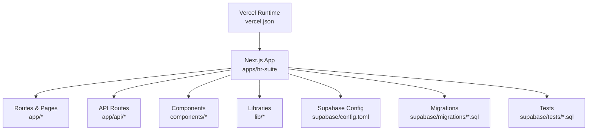
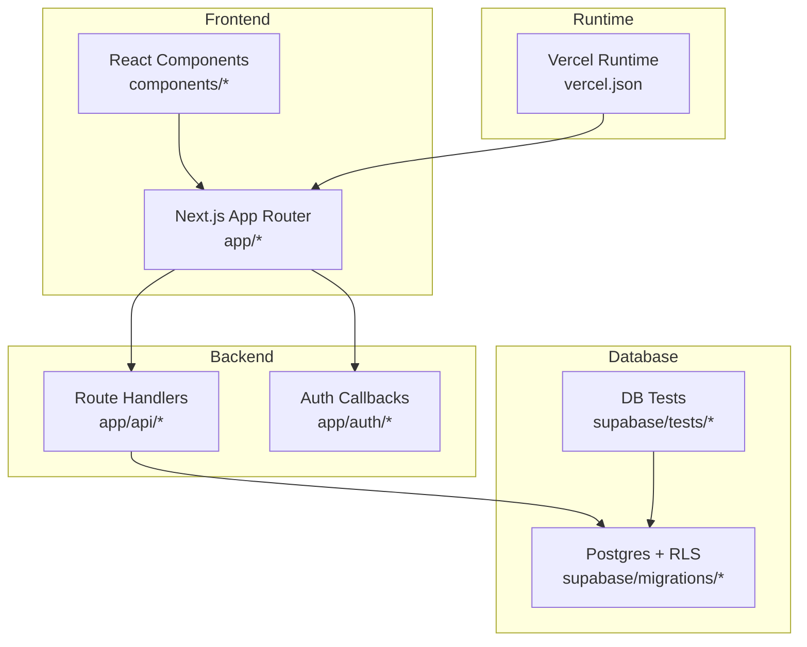
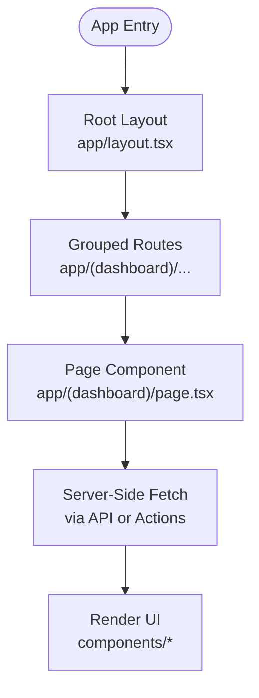
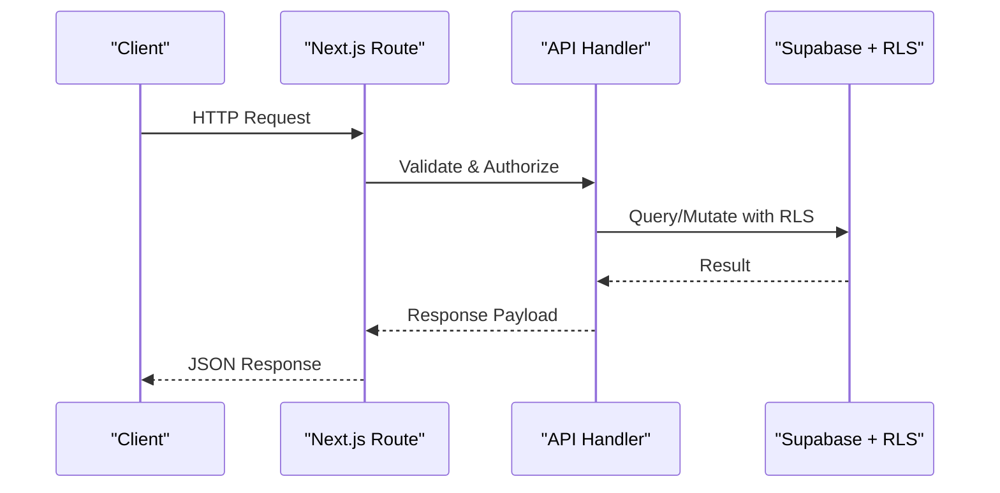
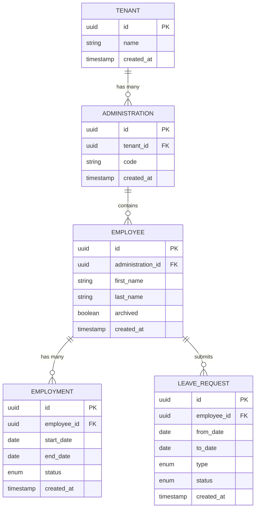
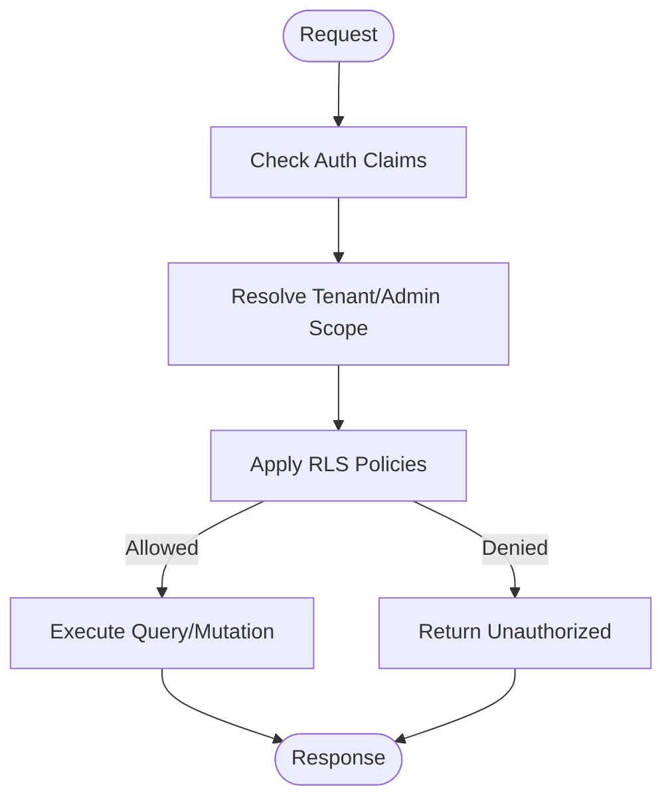
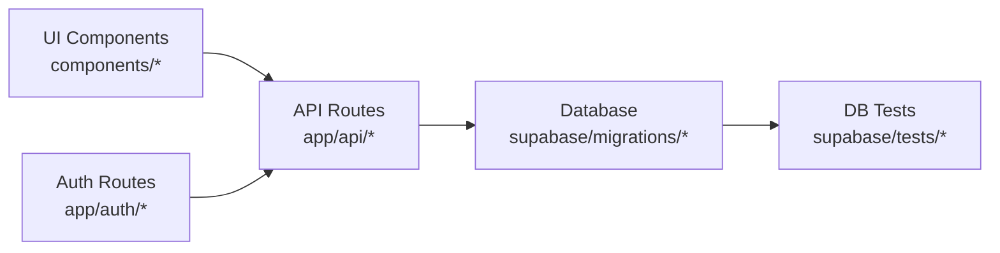

# Technical Implementation

<cite>
**Referenced Files in This Document**
- [package.json](file://apps/hr-suite/package.json)
- [next.config.ts](file://apps/hr-suite/next.config.ts)
- [tsconfig.json](file://apps/hr-suite/tsconfig.json)
- [app/layout.tsx](file://apps/hr-suite/app/layout.tsx)
- [app/(dashboard)/layout.tsx](file://apps/hr-suite/app/(dashboard)/layout.tsx)
- [app/(dashboard)/loading.tsx](file://apps/hr-suite/app/(dashboard)/loading.tsx)
- [app/page.tsx](file://apps/hr-suite/app/page.tsx)
- [app/api/context/route.ts](file://apps/hr-suite/app/api/context/route.ts)
- [app/api/context/administration/route.ts](file://apps/hr-suite/app/api/context/administration/route.ts)
- [app/api/employees/route.ts](file://apps/hr-suite/app/api/employees/route.ts)
- [app/api/employees/[employeeId]/route.ts](file://apps/hr-suite/app/api/employees/[employeeId]/route.ts)
- [app/api/leave/request/route.ts](file://apps/hr-suite/app/api/leave/request/route.ts)
- [app/auth/callback/route.ts](file://apps/hr-suite/app/auth/callback/route.ts)
- [app/auth/signout/route.ts](file://apps/hr-suite/app/auth/signout/route.ts)
- [components/layout/sidebar.tsx](file://apps/hr-suite/components/layout/sidebar.tsx)
- [components/dashboard/dashboard-workspace.tsx](file://apps/hr-suite/components/dashboard/dashboard-workspace.tsx)
- [components/employees/employee-list.tsx](file://apps/hr-suite/components/employees/employee-list.tsx)
- [lib/supabase/client.ts](file://apps/hr-suite/lib/supabase/client.ts)
- [supabase/config.toml](file://apps/hr-suite/supabase/config.toml)
- [supabase/migrations/20260712124858_init_employee_core_hr.sql](file://apps/hr-suite/supabase/migrations/20260712124858_init_employee_core_hr.sql)
- [supabase/migrations/20260712124911_add_tenant_rbac_and_organization.sql](file://apps/hr-suite/supabase/migrations/20260712124911_add_tenant_rbac_and_organization.sql)
- [supabase/migrations/20260712125420_revoke_public_rls_trigger_execution.sql](file://apps/hr-suite/supabase/migrations/20260712125420_revoke_public_rls_trigger_execution.sql)
- [supabase/migrations/20260712125522_optimize_rbac_indexes_and_policies.sql](file://apps/hr-suite/supabase/migrations/20260712125522_optimize_rbac_indexes_and_policies.sql)
- [supabase/migrations/20260715120810_complete_employee_core.sql](file://apps/hr-suite/supabase/migrations/20260715120810_complete_employee_core.sql)
- [supabase/migrations/20260715123119_add_custom_field_value_rpc.sql](file://apps/hr-suite/supabase/migrations/20260715123119_add_custom_field_value_rpc.sql)
- [supabase/migrations/20260715124506_isolate_employee_secure_identifiers.sql](file://apps/hr-suite/supabase/migrations/20260715124506_isolate_employee_secure_identifiers.sql)
- [supabase/migrations/20260715141843_add_employment_change_management.sql](file://apps/hr-suite/supabase/migrations/20260715141843_add_employment_change_management.sql)
- [supabase/migrations/20260715145432_optimize_employment_change_management.sql](file://apps/hr-suite/supabase/migrations/20260715145432_optimize_employment_change_management.sql)
- [supabase/migrations/20260716120000_add_personal_dashboards.sql](file://apps/hr-suite/supabase/migrations/20260716120000_add_personal_dashboards.sql)
- [supabase/migrations/20260718121308_add_settings_modules_work_patterns_holidays.sql](file://apps/hr-suite/supabase/migrations/20260718121308_add_settings_modules_work_patterns_holidays.sql)
- [supabase/migrations/20260718122138_harden_settings_rosters_holidays.sql](file://apps/hr-suite/supabase/migrations/20260718122138_harden_settings_rosters_holidays.sql)
- [supabase/migrations/20260722142551_add_leave_engine_foundation.sql](file://apps/hr-suite/supabase/migrations/20260722142551_add_leave_engine_foundation.sql)
- [supabase/migrations/20260722190000_add_leave_request_booking_engine.sql](file://apps/hr-suite/supabase/migrations/20260722190000_add_leave_request_booking_engine.sql)
- [supabase/migrations/20260724160000_add_employee_activity_entries.sql](file://apps/hr-suite/supabase/migrations/20260724160000_add_employee_activity_entries.sql)
- [supabase/tests/custom_fields_isolation.sql](file://apps/hr-suite/supabase/tests/custom_fields_isolation.sql)
- [supabase/tests/employee_core_crud_isolation.sql](file://apps/hr-suite/supabase/tests/employee_core_crud_isolation.sql)
- [supabase/tests/leave_engine_foundation.sql](file://apps/hr-suite/supabase/tests/leave_engine_foundation.sql)
- [vercel.json](file://vercel.json)
</cite>

## Table of Contents
1. Introduction
2. Project Structure
3. Core Components
4. Architecture Overview
5. Detailed Component Analysis
6. Dependency Analysis
7. Performance Considerations
8. Troubleshooting Guide
9. Conclusion

## Introduction
This document provides a comprehensive technical implementation guide for LiquidHR’s development architecture. It covers the frontend built with Next.js App Router and React, the backend API routes organized under app/api, database design and security using Supabase migrations and Row Level Security (RLS), and operational guidance for testing, deployment, and maintenance. The goal is to make the system understandable for both new contributors and experienced engineers while providing concrete references to actual source files.

## Project Structure
LiquidHR is implemented as a Next.js application under apps/hr-suite. The structure follows feature-based organization:
- app/: Routes, layouts, pages, server actions, and API routes
- components/: Reusable UI components grouped by domain
- lib/: Shared libraries including Supabase client, auth utilities, and domain helpers
- supabase/: Database migrations, tests, and configuration
- docs/: Architecture decisions, requirements, and delivery plans

**Diagram sources**
- [package.json](file://apps/hr-suite/package.json)
- [next.config.ts](file://apps/hr-suite/next.config.ts)
- [supabase/config.toml](file://apps/hr-suite/supabase/config.toml)
- [vercel.json](file://vercel.json)

**Section sources**
- [package.json](file://apps/hr-suite/package.json)
- [next.config.ts](file://apps/hr-suite/next.config.ts)
- [tsconfig.json](file://apps/hr-suite/tsconfig.json)

## Core Components
Key building blocks include:
- Authentication flows via Next.js Server Routes and Supabase
- Context providers for tenant and administration scoping
- Domain-specific API endpoints for employees, leave, master data, and settings
- UI components for dashboards, employee management, and HR calendar

Examples of core entry points:
- Root layout and page routing
- Dashboard layout and loading states
- API context route for tenant and admin scope
- Employee CRUD endpoints
- Leave request endpoint

**Section sources**
- [app/layout.tsx](file://apps/hr-suite/app/layout.tsx)
- [app/page.tsx](file://apps/hr-suite/app/page.tsx)
- [app/(dashboard)/layout.tsx](file://apps/hr-suite/app/(dashboard)/layout.tsx)
- [app/(dashboard)/loading.tsx](file://apps/hr-suite/app/(dashboard)/loading.tsx)
- [app/api/context/route.ts](file://apps/hr-suite/app/api/context/route.ts)
- [app/api/context/administration/route.ts](file://apps/hr-suite/app/api/context/administration/route.ts)
- [app/api/employees/route.ts](file://apps/hr-suite/app/api/employees/route.ts)
- [app/api/employees/[employeeId]/route.ts](file://apps/hr-suite/app/api/employees/[employeeId]/route.ts)
- [app/api/leave/request/route.ts](file://apps/hr-suite/app/api/leave/request/route.ts)

## Architecture Overview
The system uses a modern full-stack pattern:
- Frontend: React components rendered by Next.js App Router with server-side capabilities
- Backend: Route handlers under app/api that enforce authorization and orchestrate business logic
- Database: Supabase Postgres with RLS policies ensuring tenant isolation and role-based access
- Deployment: Vercel runtime configuration

**Diagram sources**
- [app/layout.tsx](file://apps/hr-suite/app/layout.tsx)
- [app/api/context/route.ts](file://apps/hr-suite/app/api/context/route.ts)
- [app/auth/callback/route.ts](file://apps/hr-suite/app/auth/callback/route.ts)
- [supabase/migrations/20260712124911_add_tenant_rbac_and_organization.sql](file://apps/hr-suite/supabase/migrations/20260712124911_add_tenant_rbac_and_organization.sql)
- [vercel.json](file://vercel.json)

## Detailed Component Analysis

### Frontend Architecture
- Routing Strategy: Uses Next.js App Router with route groups like (dashboard) to encapsulate shared layouts and middleware behavior.
- State Management: Local component state combined with server-side data fetching; global context provided through API routes for tenant and administration scope.
- Styling Approach: Tailwind CSS integrated via Next.js configuration; utility-first classes used across components.

**Diagram sources**
- [app/layout.tsx](file://apps/hr-suite/app/layout.tsx)
- [app/(dashboard)/layout.tsx](file://apps/hr-suite/app/(dashboard)/layout.tsx)
- [app/(dashboard)/loading.tsx](file://apps/hr-suite/app/(dashboard)/loading.tsx)

**Section sources**
- [app/layout.tsx](file://apps/hr-suite/app/layout.tsx)
- [app/(dashboard)/layout.tsx](file://apps/hr-suite/app/(dashboard)/layout.tsx)
- [app/(dashboard)/loading.tsx](file://apps/hr-suite/app/(dashboard)/loading.tsx)

### Backend API Organization
- Route Handlers: Organized by domain under app/api, e.g., employees, leave, master-data, settings.
- Business Logic Separation: Route handlers validate input, enforce authorization, and delegate to database operations.
- Security: RLS policies ensure row-level isolation per tenant and role; callbacks handle session lifecycle.

**Diagram sources**
- [app/api/employees/route.ts](file://apps/hr-suite/app/api/employees/route.ts)
- [app/api/employees/[employeeId]/route.ts](file://apps/hr-suite/app/api/employees/[employeeId]/route.ts)
- [app/api/leave/request/route.ts](file://apps/hr-suite/app/api/leave/request/route.ts)
- [supabase/migrations/20260712125420_revoke_public_rls_trigger_execution.sql](file://apps/hr-suite/supabase/migrations/20260712125420_revoke_public_rls_trigger_execution.sql)

**Section sources**
- [app/api/context/route.ts](file://apps/hr-suite/app/api/context/route.ts)
- [app/api/context/administration/route.ts](file://apps/hr-suite/app/api/context/administration/route.ts)
- [app/api/employees/route.ts](file://apps/hr-suite/app/api/employees/route.ts)
- [app/api/employees/[employeeId]/route.ts](file://apps/hr-suite/app/api/employees/[employeeId]/route.ts)
- [app/api/leave/request/route.ts](file://apps/hr-suite/app/api/leave/request/route.ts)

### Database Design Patterns
- Schema Evolution: Incremental SQL migrations under supabase/migrations, covering core entities, RBAC, custom fields, employment changes, leave engine, and settings.
- Security: RLS policies enforced via triggers and optimized indexes; secure identifiers isolated for sensitive data.
- Performance: Indexes on foreign keys and frequently queried columns; RPC functions for complex operations.

**Diagram sources**
- [supabase/migrations/20260712124911_add_tenant_rbac_and_organization.sql](file://apps/hr-suite/supabase/migrations/20260712124911_add_tenant_rbac_and_organization.sql)
- [supabase/migrations/20260712124858_init_employee_core_hr.sql](file://apps/hr-suite/supabase/migrations/20260712124858_init_employee_core_hr.sql)
- [supabase/migrations/20260715120810_complete_employee_core.sql](file://apps/hr-suite/supabase/migrations/20260715120810_complete_employee_core.sql)
- [supabase/migrations/20260715141843_add_employment_change_management.sql](file://apps/hr-suite/supabase/migrations/20260715141843_add_employment_change_management.sql)
- [supabase/migrations/20260722142551_add_leave_engine_foundation.sql](file://apps/hr-suite/supabase/migrations/20260722142551_add_leave_engine_foundation.sql)
- [supabase/migrations/20260722190000_add_leave_request_booking_engine.sql](file://apps/hr-suite/supabase/migrations/20260722190000_add_leave_request_booking_engine.sql)

**Section sources**
- [supabase/migrations/20260712124858_init_employee_core_hr.sql](file://apps/hr-suite/supabase/migrations/20260712124858_init_employee_core_hr.sql)
- [supabase/migrations/20260712124911_add_tenant_rbac_and_organization.sql](file://apps/hr-suite/supabase/migrations/20260712124911_add_tenant_rbac_and_organization.sql)
- [supabase/migrations/20260712125420_revoke_public_rls_trigger_execution.sql](file://apps/hr-suite/supabase/migrations/20260712125420_revoke_public_rls_trigger_execution.sql)
- [supabase/migrations/20260712125522_optimize_rbac_indexes_and_policies.sql](file://apps/hr-suite/supabase/migrations/20260712125522_optimize_rbac_indexes_and_policies.sql)
- [supabase/migrations/20260715123119_add_custom_field_value_rpc.sql](file://apps/hr-suite/supabase/migrations/20260715123119_add_custom_field_value_rpc.sql)
- [supabase/migrations/20260715124506_isolate_employee_secure_identifiers.sql](file://apps/hr-suite/supabase/migrations/20260715124506_isolate_employee_secure_identifiers.sql)
- [supabase/migrations/20260715141843_add_employment_change_management.sql](file://apps/hr-suite/supabase/migrations/20260715141843_add_employment_change_management.sql)
- [supabase/migrations/20260715145432_optimize_employment_change_management.sql](file://apps/hr-suite/supabase/migrations/20260715145432_optimize_employment_change_management.sql)
- [supabase/migrations/20260716120000_add_personal_dashboards.sql](file://apps/hr-suite/supabase/migrations/20260716120000_add_personal_dashboards.sql)
- [supabase/migrations/20260718121308_add_settings_modules_work_patterns_holidays.sql](file://apps/hr-suite/supabase/migrations/20260718121308_add_settings_modules_work_patterns_holidays.sql)
- [supabase/migrations/20260718122138_harden_settings_rosters_holidays.sql](file://apps/hr-suite/supabase/migrations/20260718122138_harden_settings_rosters_holidays.sql)
- [supabase/migrations/20260722142551_add_leave_engine_foundation.sql](file://apps/hr-suite/supabase/migrations/20260722142551_add_leave_engine_foundation.sql)
- [supabase/migrations/20260722190000_add_leave_request_booking_engine.sql](file://apps/hr-suite/supabase/migrations/20260722190000_add_leave_request_booking_engine.sql)
- [supabase/migrations/20260724160000_add_employee_activity_entries.sql](file://apps/hr-suite/supabase/migrations/20260724160000_add_employee_activity_entries.sql)

### Security Implementation Using Row Level Security
- RLS Policies: Enforced at the database level to restrict access based on tenant and role claims.
- Trigger Execution: Public trigger execution revoked to prevent bypassing policies.
- Secure Identifiers: Sensitive employee identifiers are isolated and accessed only through controlled paths.

**Diagram sources**
- [supabase/migrations/20260712125420_revoke_public_rls_trigger_execution.sql](file://apps/hr-suite/supabase/migrations/20260712125420_revoke_public_rls_trigger_execution.sql)
- [supabase/migrations/20260712125522_optimize_rbac_indexes_and_policies.sql](file://apps/hr-suite/supabase/migrations/20260712125522_optimize_rbac_indexes_and_policies.sql)
- [supabase/migrations/20260715124506_isolate_employee_secure_identifiers.sql](file://apps/hr-suite/supabase/migrations/20260715124506_isolate_employee_secure_identifiers.sql)

**Section sources**
- [supabase/migrations/20260712125420_revoke_public_rls_trigger_execution.sql](file://apps/hr-suite/supabase/migrations/20260712125420_revoke_public_rls_trigger_execution.sql)
- [supabase/migrations/20260712125522_optimize_rbac_indexes_and_policies.sql](file://apps/hr-suite/supabase/migrations/20260712125522_optimize_rbac_indexes_and_policies.sql)
- [supabase/migrations/20260715124506_isolate_employee_secure_identifiers.sql](file://apps/hr-suite/supabase/migrations/20260715124506_isolate_employee_secure_identifiers.sql)

### Development Workflow Guidelines
- Local Setup: Configure Supabase client and environment variables; run migrations locally.
- API Testing: Use route handlers to test endpoints; leverage Supabase tests for schema validation.
- Component Development: Build reusable components under components/* and integrate via Next.js routes.

**Section sources**
- [lib/supabase/client.ts](file://apps/hr-suite/lib/supabase/client.ts)
- [supabase/config.toml](file://apps/hr-suite/supabase/config.toml)

### Debugging Techniques
- Logging: Centralize logs in API handlers and Supabase triggers where applicable.
- Error Handling: Return consistent error payloads from route handlers; surface user-friendly messages in UI.
- Tracing: Use Supabase query logs and Next.js request tracing to diagnose performance issues.

**Section sources**
- [app/api/employees/route.ts](file://apps/hr-suite/app/api/employees/route.ts)
- [app/api/leave/request/route.ts](file://apps/hr-suite/app/api/leave/request/route.ts)

## Dependency Analysis
Dependencies between modules are structured to minimize coupling:
- UI components depend on route handlers for data
- Route handlers depend on Supabase client and RLS policies
- Migrations define schema evolution and security constraints

**Diagram sources**
- [components/employees/employee-list.tsx](file://apps/hr-suite/components/employees/employee-list.tsx)
- [app/api/employees/route.ts](file://apps/hr-suite/app/api/employees/route.ts)
- [supabase/migrations/20260712124911_add_tenant_rbac_and_organization.sql](file://apps/hr-suite/supabase/migrations/20260712124911_add_tenant_rbac_and_organization.sql)
- [supabase/tests/employee_core_crud_isolation.sql](file://apps/hr-suite/supabase/tests/employee_core_crud_isolation.sql)

**Section sources**
- [components/dashboard/dashboard-workspace.tsx](file://apps/hr-suite/components/dashboard/dashboard-workspace.tsx)
- [components/layout/sidebar.tsx](file://apps/hr-suite/components/layout/sidebar.tsx)
- [app/api/context/route.ts](file://apps/hr-suite/app/api/context/route.ts)

## Performance Considerations
- Database Indexing: Optimize queries with targeted indexes on foreign keys and filter columns.
- Query Optimization: Use RPC functions for complex operations to reduce round trips.
- Caching: Leverage Next.js caching strategies and Supabase connection pooling.
- Monitoring: Track query performance and error rates in production.

[No sources needed since this section provides general guidance]

## Troubleshooting Guide
Common issues and resolutions:
- Authorization Errors: Verify RLS policies and tenant scope resolution in API handlers.
- Migration Failures: Review migration order and dependencies; ensure tests pass before deploying.
- API Timeouts: Inspect query complexity and add appropriate indexes; consider pagination.

**Section sources**
- [supabase/tests/custom_fields_isolation.sql](file://apps/hr-suite/supabase/tests/custom_fields_isolation.sql)
- [supabase/tests/leave_engine_foundation.sql](file://apps/hr-suite/supabase/tests/leave_engine_foundation.sql)
- [app/api/context/administration/route.ts](file://apps/hr-suite/app/api/context/administration/route.ts)

## Conclusion
LiquidHR’s architecture combines Next.js App Router for a modern frontend, well-organized API routes for robust backend logic, and Supabase with RLS for secure, multi-tenant data access. The incremental migration strategy ensures schema evolution without downtime, while comprehensive tests validate correctness. Following the guidelines in this document will help maintain high quality, performance, and security throughout the project lifecycle.