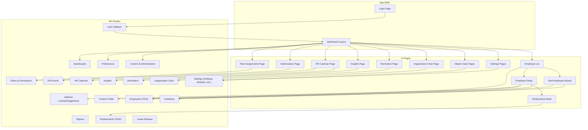
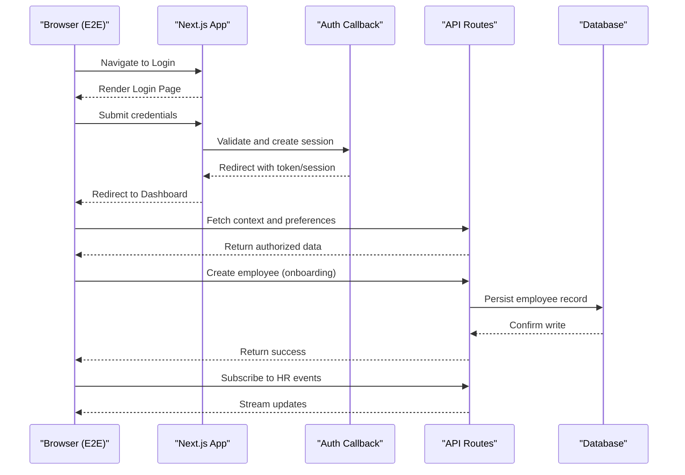
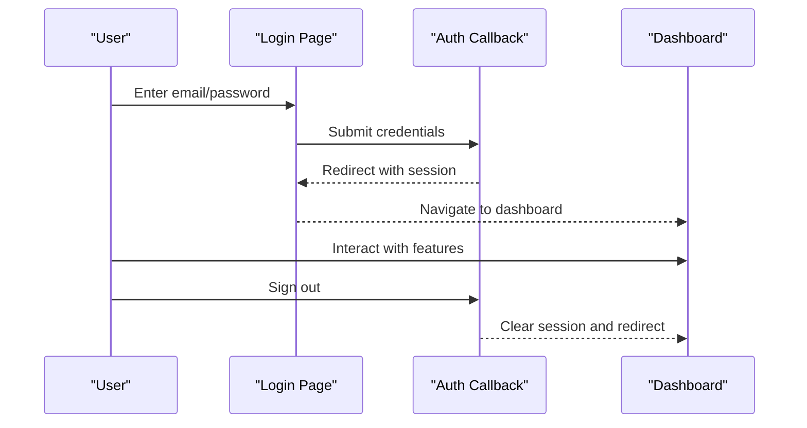
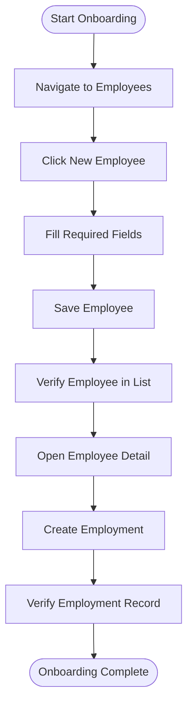
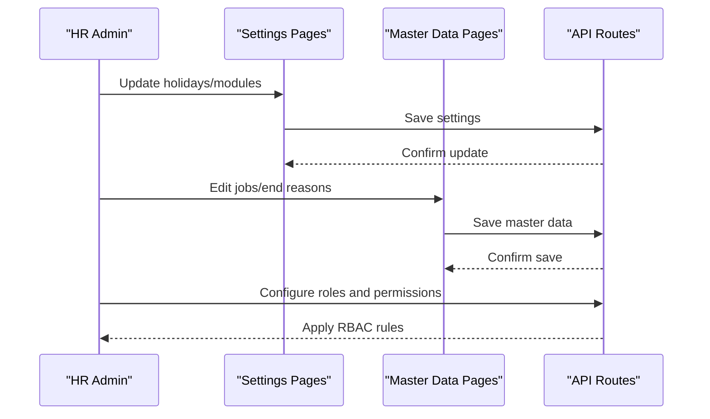
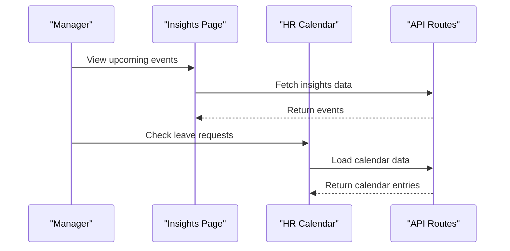
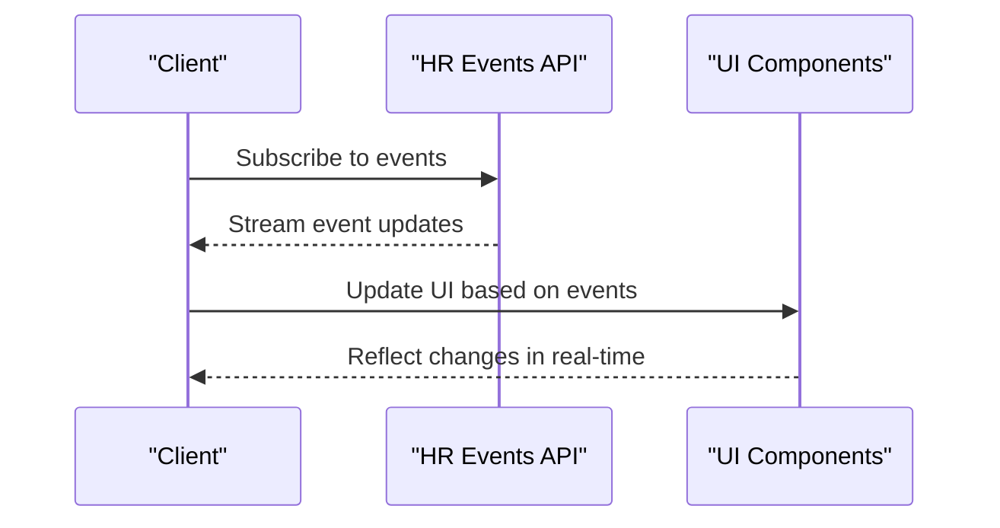
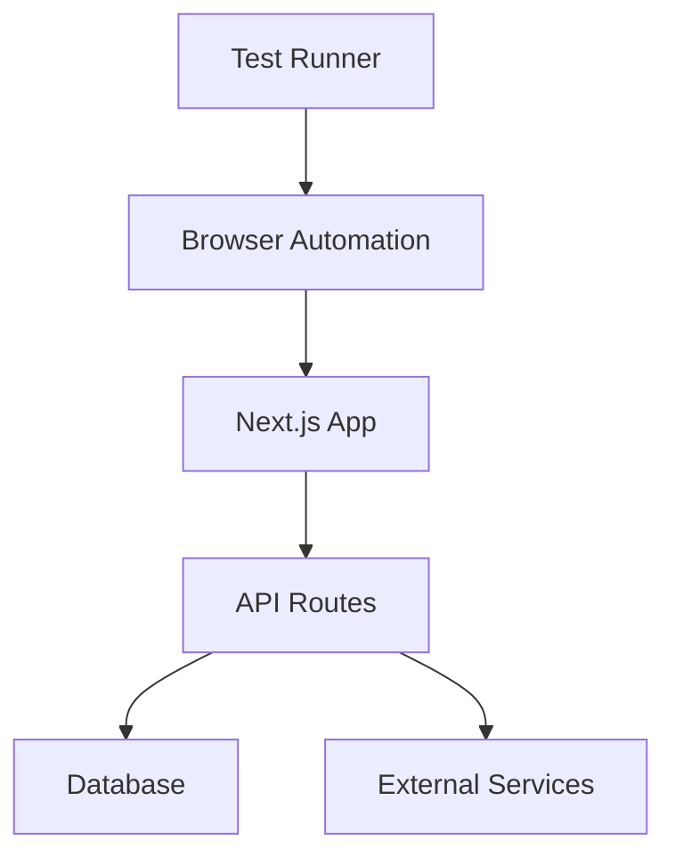

# End-to-End Testing

<cite>
**Referenced Files in This Document**
- [package.json](file://apps/hr-suite/package.json)
- [vitest.config.ts](file://apps/hr-suite/vitest.config.ts)
- [next.config.ts](file://apps/hr-suite/next.config.ts)
- [proxy.ts](file://apps/hr-suite/proxy.ts)
- [page.tsx](file://apps/hr-suite/app/login/page.tsx)
- [auth-shell.tsx](file://apps/hr-suite/components/auth/auth-shell.tsx)
- [login-form.tsx](file://apps/hr-suite/components/auth/login-form.tsx)
- [route.ts](file://apps/hr-suite/app/api/context/route.ts)
- [route.ts](file://apps/hr-suite/app/api/context/administration/route.ts)
- [route.ts](file://apps/hr-suite/app/api/employees/route.ts)
- [route.ts](file://apps/hr-suite/app/api/employments/[employmentId]/route.ts)
- [route.ts](file://apps/hr-suite/app/api/leave/request/route.ts)
- [route.ts](file://apps/hr-suite/app/api/hr-events/route.ts)
- [route.ts](file://apps/hr-suite/app/api/preferences/employees/route.ts)
- [route.ts](file://apps/hr-suite/app/api/custom-fields/route.ts)
- [route.ts](file://apps/hr-suite/app/api/settings/holidays/route.ts)
- [route.ts](file://apps/hr-suite/app/api/roles/route.ts)
- [route.ts](file://apps/hr-suite/app/api/organization-chart/route.ts)
- [route.ts](file://apps/hr-suite/app/api/dashboards/route.ts)
- [route.ts](file://apps/hr-suite/app/api/reminders/route.ts)
- [route.ts](file://apps/hr-suite/app/api/insights/upcoming-events/route.ts)
- [route.ts](file://apps/hr-suite/app/api/address-suggestions/route.ts)
- [route.ts](file://apps/hr-suite/app/api/address-lookup/route.ts)
- [route.ts](file://apps/hr-suite/app/api/hr-calendar/route.ts)
- [route.ts](file://apps/hr-suite/app/api/invitations/route.ts)
- [route.ts](file://apps/hr-suite/app/auth/callback/route.ts)
- [route.ts](file://apps/hr-suite/app/auth/signout/route.ts)
- [page.tsx](file://apps/hr-suite/app/(dashboard)/employees/page.tsx)
- [page.tsx](file://apps/hr-suite/app/(dashboard)/employees/new/page.tsx)
- [page.tsx](file://apps/hr-suite/app/(dashboard)/settings/page.tsx)
- [page.tsx](file://apps/hr-suite/app/(dashboard)/hr-calendar/page.tsx)
- [page.tsx](file://apps/hr-suite/app/(dashboard)/insights/page.tsx)
- [page.tsx](file://apps/hr-suite/app/(dashboard)/authorization/page.tsx)
- [page.tsx](file://apps/hr-suite/app/(dashboard)/role-assignments/page.tsx)
- [page.tsx](file://apps/hr-suite/app/(dashboard)/master-data/page.tsx)
- [page.tsx](file://apps/hr-suite/app/(dashboard)/organization-chart/page.tsx)
- [page.tsx](file://apps/hr-suite/app/(dashboard)/reminders/page.tsx)
- [page.tsx](file://apps/hr-suite/app/(dashboard)/custom-fields/page.tsx)
- [page.tsx](file://apps/hr-suite/app/(dashboard)/personal-settings/page.tsx)
- [page.tsx](file://apps/hr-suite/app/(dashboard)/dashboard/page.tsx)
- [page.tsx](file://apps/hr-suite/app/(dashboard)/departments/page.tsx)
- [page.tsx](file://apps/hr-suite/app/(dashboard)/settings/dashboard-widgets/page.tsx)
- [page.tsx](file://apps/hr-suite/app/(dashboard)/settings/holidays/page.tsx)
- [page.tsx](file://apps/hr-suite/app/(dashboard)/settings/modules/page.tsx)
- [page.tsx](file://apps/hr-suite/app/(dashboard)/settings/menu-order/page.tsx)
- [page.tsx](file://apps/hr-suite/app/(dashboard)/settings/star-performers/page.tsx)
- [page.tsx](file://apps/hr-suite/app/(dashboard)/settings/star-performer-tags/page.tsx)
- [page.tsx](file://apps/hr-suite/app/(dashboard)/settings/anniversary-rules/page.tsx)
- [page.tsx](file://apps/hr-suite/app/(dashboard)/settings/leave-accrual/page.tsx)
- [page.tsx](file://apps/hr-suite/app/(dashboard)/settings/leave-accrual/priority-rules/page.tsx)
- [page.tsx](file://apps/hr-suite/app/(dashboard)/settings/leave-accrual/types/page.tsx)
- [page.tsx](file://apps/hr-suite/app/(dashboard)/settings/leave-accrual/work-hours/page.tsx)
- [page.tsx](file://apps/hr-suite/app/(dashboard)/master-data/jobs/page.tsx)
- [page.tsx](file://apps/hr-suite/app/(dashboard)/master-data/end-reasons/page.tsx)
- [page.tsx](file://apps/hr-suite/app/(dashboard)/master-data/salary-scales/page.tsx)
- [page.tsx](file://apps/hr-suite/app/(dashboard)/master-data/job-groups/page.tsx)
- [page.tsx](file://apps/hr-suite/app/(dashboard)/master-data/relation-types/page.tsx)
- [page.tsx](file://apps/hr-suite/app/(dashboard)/master-data/document-categories/page.tsx)
- [page.tsx](file://apps/hr-suite/app/(dashboard)/hera/page.tsx)
- [page.tsx](file://apps/hr-suite/app/(dashboard)/insights/upcoming-events/page.tsx)
- [page.tsx](file://apps/hr-suite/app/(dashboard)/employees/[employeeId]/page.tsx)
- [page.tsx](file://apps/hr-suite/app/(dashboard)/employees/[employeeId]/employments/[employmentId]/page.tsx)
- [page.tsx](file://apps/hr-suite/app/(dashboard)/employees/[employeeId]/employments/new/page.tsx)
- [page.tsx](file://apps/hr-suite/app/(dashboard)/employees/[employeeId]/employments/[employmentId]/timeline/[timeline]/page.tsx)
- [page.tsx](file://apps/hr-suite/app/(dashboard)/employees/[employeeId]/employments/[employmentId]/changes/page.tsx)
- [page.tsx](file://apps/hr-suite/app/(dashboard)/employees/[employeeId]/employments/[employmentId]/follow-ups/page.tsx)
- [page.tsx](file://apps/hr-suite/app/(dashboard)/employees/[employeeId]/employments/[employmentId]/profile-links/page.tsx)
- [page.tsx](file://apps/hr-suite/app/(dashboard)/employees/[employeeId]/employments/[employmentId]/termination/page.tsx)
- [page.tsx](file://apps/hr-suite/app/(dashboard)/employees/[employeeId]/employments/[employmentId]/work-patterns/page.tsx)
- [page.tsx](file://apps/hr-suite/app/(dashboard)/employees/[employeeId]/addresses/page.tsx)
- [page.tsx](file://apps/hr-suite/app/(dashboard)/employees/[employeeId]/bank-accounts/page.tsx)
- [page.tsx](file://apps/hr-suite/app/(dashboard)/employees/[employeeId]/documents/page.tsx)
- [page.tsx](file://apps/hr-suite/app/(dashboard)/employees/[employeeId]/relations/page.tsx)
- [page.tsx](file://apps/hr-suite/app/(dashboard)/employees/[employeeId]/salary/page.tsx)
- [page.tsx](file://apps/hr-suite/app/(dashboard)/employees/[employeeId]/bsn/page.tsx)
- [page.tsx](file://apps/hr-suite/app/(dashboard)/employees/[employeeId]/activity/page.tsx)
- [page.tsx](file://apps/hr-suite/app/(dashboard)/employees/[employeeId]/archive/page.tsx)
- [page.tsx](file://apps/hr-suite/app/(dashboard)/employees/[employeeId]/avatar/page.tsx)
- [page.tsx](file://apps/hr-suite/app/(dashboard)/employees/[employeeId]/custom-fields/page.tsx)
- [page.tsx](file://apps/hr-suite/app/(dashboard)/employees/[employeeId]/employment-chain-assessment/page.tsx)
- [page.tsx](file://apps/hr-suite/app/(dashboard)/hr-calendar/page.tsx)
- [page.tsx](file://apps/hr-suite/app/(dashboard)/insights/page.tsx)
- [page.tsx](file://apps/hr-suite/app/(dashboard)/insights/upcoming-events/page.tsx)
- [page.tsx](file://apps/hr-suite/app/(dashboard)/authorization/page.tsx)
- [page.tsx](file://apps/hr-suite/app/(dashboard)/role-assignments/page.tsx)
- [page.tsx](file://apps/hr-suite/app/(dashboard)/master-data/page.tsx)
- [page.tsx](file://apps/hr-suite/app/(dashboard)/organization-chart/page.tsx)
- [page.tsx](file://apps/hr-suite/app/(dashboard)/reminders/page.tsx)
- [page.tsx](file://apps/hr-suite/app/(dashboard)/custom-fields/page.tsx)
- [page.tsx](file://apps/hr-suite/app/(dashboard)/personal-settings/page.tsx)
- [page.tsx](file://apps/hr-suite/app/(dashboard)/dashboard/page.tsx)
- [page.tsx](file://apps/hr-suite/app/(dashboard)/departments/page.tsx)
- [page.tsx](file://apps/hr-suite/app/(dashboard)/settings/dashboard-widgets/page.tsx)
- [page.tsx](file://apps/hr-suite/app/(dashboard)/settings/holidays/page.tsx)
- [page.tsx](file://apps/hr-suite/app/(dashboard)/settings/modules/page.tsx)
- [page.tsx](file://apps/hr-suite/app/(dashboard)/settings/menu-order/page.tsx)
- [page.tsx](file://apps/hr-suite/app/(dashboard)/settings/star-performers/page.tsx)
- [page.tsx](file://apps/hr-suite/app/(dashboard)/settings/star-performer-tags/page.tsx)
- [page.tsx](file://apps/hr-suite/app/(dashboard)/settings/anniversary-rules/page.tsx)
- [page.tsx](file://apps/hr-suite/app/(dashboard)/settings/leave-accrual/page.tsx)
- [page.tsx](file://apps/hr-suite/app/(dashboard)/settings/leave-accrual/priority-rules/page.tsx)
- [page.tsx](file://apps/hr-suite/app/(dashboard)/settings/leave-accrual/types/page.tsx)
- [page.tsx](file://apps/hr-suite/app/(dashboard)/settings/leave-accrual/work-hours/page.tsx)
- [page.tsx](file://apps/hr-suite/app/(dashboard)/master-data/jobs/page.tsx)
- [page.tsx](file://apps/hr-suite/app/(dashboard)/master-data/end-reasons/page.tsx)
- [page.tsx](file://apps/hr-suite/app/(dashboard)/master-data/salary-scales/page.tsx)
- [page.tsx](file://apps/hr-suite/app/(dashboard)/master-data/job-groups/page.tsx)
- [page.tsx](file://apps/hr-suite/app/(dashboard)/master-data/relation-types/page.tsx)
- [page://apps/hr-suite/app/(dashboard)/master-data/document-categories/page.tsx]
- [page.tsx](file://apps/hr-suite/app/(dashboard)/hera/page.tsx)
- [page.tsx](file://apps/hr-suite/app/(dashboard)/insights/upcoming-events/page.tsx)
- [page.tsx](file://apps/hr-suite/app/(dashboard)/employees/[employeeId]/page.tsx)
- [page.tsx](file://apps/hr-suite/app/(dashboard)/employees/[employeeId]/employments/[employmentId]/page.tsx)
- [page.tsx](file://apps/hr-suite/app/(dashboard)/employees/[employeeId]/employments/new/page.tsx)
- [page.tsx](file://apps/hr-suite/app/(dashboard)/employees/[employeeId]/employments/[employmentId]/timeline/[timeline]/page.tsx)
- [page.tsx](file://apps/hr-suite/app/(dashboard)/employees/[employeeId]/employments/[employmentId]/changes/page.tsx)
- [page.tsx](file://apps/hr-suite/app/(dashboard)/employees/[employeeId]/employments/[employmentId]/follow-ups/page.tsx)
- [page.tsx](file://apps/hr-suite/app/(dashboard)/employees/[employeeId]/employments/[employmentId]/profile-links/page.tsx)
- [page.tsx](file://apps/hr-suite/app/(dashboard)/employees/[employeeId]/employments/[employmentId]/termination/page.tsx)
- [page.tsx](file://apps/hr-suite/app/(dashboard)/employees/[employeeId]/employments/[employmentId]/work-patterns/page.tsx)
- [page.tsx](file://apps/hr-suite/app/(dashboard)/employees/[employeeId]/addresses/page.tsx)
- [page.tsx](file://apps/hr-suite/app/(dashboard)/employees/[employeeId]/bank-accounts/page.tsx)
- [page.tsx](file://apps/hr-suite/app/(dashboard)/employees/[employeeId]/documents/page.tsx)
- [page.tsx](file://apps/hr-suite/app/(dashboard)/employees/[employeeId]/relations/page.tsx)
- [page.tsx](file://apps/hr-suite/app/(dashboard)/employees/[employeeId]/salary/page.tsx)
- [page.tsx](file://apps/hr-suite/app/(dashboard)/employees/[employeeId]/bsn/page.tsx)
- [page.tsx](file://apps/hr-suite/app/(dashboard)/employees/[employeeId]/activity/page.tsx)
- [page.tsx](file://apps/hr-suite/app/(dashboard)/employees/[employeeId]/archive/page.tsx)
- [page.tsx](file://apps/hr-suite/app/(dashboard)/employees/[employeeId]/avatar/page.tsx)
- [page.tsx](file://apps/hr-suite/app/(dashboard)/employees/[employeeId]/custom-fields/page.tsx)
- [page.tsx](file://apps/hr-suite/app/(dashboard)/employees/[employeeId]/employment-chain-assessment/page.tsx)
</cite>

## Table of Contents
1. [Introduction](#introduction)
2. [Project Structure](#project-structure)
3. [Core Components](#core-components)
4. [Architecture Overview](#architecture-overview)
5. [Detailed Component Analysis](#detailed-component-analysis)
6. [Dependency Analysis](#dependency-analysis)
7. [Performance Considerations](#performance-considerations)
8. [Troubleshooting Guide](#troubleshooting-guide)
9. [Conclusion](#conclusion)
10. [Appendices](#appendices)

## Introduction
This document provides comprehensive end-to-end (E2E) testing guidance for LiquidHR’s complete user workflows and cross-component interactions. It covers methodologies to validate full application scenarios such as employee onboarding, HR administration tasks, and manager workflows. It also explains how to test complex user journeys across multiple pages and components, including authentication flows, role-based access control (RBAC), and real-time updates. Guidance is provided for browser automation strategies, visual regression testing, accessibility validation, multi-environment execution, parallel runs, and continuous integration setup. Finally, it includes recommendations for test maintenance, debugging techniques, and performance monitoring for E2E tests.

## Project Structure
LiquidHR is a Next.js application with API routes under the app directory and UI components organized by feature. The root package configuration defines scripts and dependencies used for running tests and building the application. The Next.js configuration controls runtime behavior, while proxy configuration can be used to route requests during local development or testing.

**Diagram sources**
- [page.tsx](file://apps/hr-suite/app/login/page.tsx)
- [route.ts](file://apps/hr-suite/app/api/context/route.ts)
- [route.ts](file://apps/hr-suite/app/api/context/administration/route.ts)
- [route.ts](file://apps/hr-suite/app/api/employees/route.ts)
- [route.ts](file://apps/hr-suite/app/api/employments/[employmentId]/route.ts)
- [route.ts](file://apps/hr-suite/app/api/leave/request/route.ts)
- [route.ts](file://apps/hr-suite/app/api/hr-events/route.ts)
- [route.ts](file://apps/hr-suite/app/api/preferences/employees/route.ts)
- [route.ts](file://apps/hr-suite/app/api/custom-fields/route.ts)
- [route.ts](file://apps/hr-suite/app/api/settings/holidays/route.ts)
- [route.ts](file://apps/hr-suite/app/api/roles/route.ts)
- [route.ts](file://apps/hr-suite/app/api/organization-chart/route.ts)
- [route.ts](file://apps/hr-suite/app/api/dashboards/route.ts)
- [route.ts](file://apps/hr-suite/app/api/reminders/route.ts)
- [route.ts](file://apps/hr-suite/app/api/insights/upcoming-events/route.ts)
- [route.ts](file://apps/hr-suite/app/api/address-suggestions/route.ts)
- [route.ts](file://apps/hr-suite/app/api/address-lookup/route.ts)
- [route.ts](file://apps/hr-suite/app/api/hr-calendar/route.ts)
- [route.ts](file://apps/hr-suite/app/api/invitations/route.ts)
- [route.ts](file://apps/hr-suite/app/auth/callback/route.ts)
- [route.ts](file://apps/hr-suite/app/auth/signout/route.ts)
- [page.tsx](file://apps/hr-suite/app/(dashboard)/employees/page.tsx)
- [page.tsx](file://apps/hr-suite/app/(dashboard)/employees/new/page.tsx)
- [page.tsx](file://apps/hr-suite/app/(dashboard)/employees/[employeeId]/page.tsx)
- [page.tsx](file://apps/hr-suite/app/(dashboard)/employees/[employeeId]/employments/[employmentId]/page.tsx)
- [page.tsx](file://apps/hr-suite/app/(dashboard)/settings/page.tsx)
- [page.tsx](file://apps/hr-suite/app/(dashboard)/hr-calendar/page.tsx)
- [page.tsx](file://apps/hr-suite/app/(dashboard)/insights/page.tsx)
- [page.tsx](file://apps/hr-suite/app/(dashboard)/authorization/page.tsx)
- [page.tsx](file://apps/hr-suite/app/(dashboard)/role-assignments/page.tsx)
- [page.tsx](file://apps/hr-suite/app/(dashboard)/master-data/page.tsx)
- [page.tsx](file://apps/hr-suite/app/(dashboard)/organization-chart/page.tsx)
- [page.tsx](file://apps/hr-suite/app/(dashboard)/reminders/page.tsx)
- [page.tsx](file://apps/hr-suite/app/(dashboard)/custom-fields/page.tsx)
- [page.tsx](file://apps/hr-suite/app/(dashboard)/personal-settings/page.tsx)
- [page.tsx](file://apps/hr-suite/app/(dashboard)/dashboard/page.tsx)
- [page.tsx](file://apps/hr-suite/app/(dashboard)/departments/page.tsx)
- [page.tsx](file://apps/hr-suite/app/(dashboard)/settings/dashboard-widgets/page.tsx)
- [page.tsx](file://apps/hr-suite/app/(dashboard)/settings/holidays/page.tsx)
- [page.tsx](file://apps/hr-suite/app/(dashboard)/settings/modules/page.tsx)
- [page.tsx](file://apps/hr-suite/app/(dashboard)/settings/menu-order/page.tsx)
- [page.tsx](file://apps/hr-suite/app/(dashboard)/settings/star-performers/page.tsx)
- [page.tsx](file://apps/hr-suite/app/(dashboard)/settings/star-performer-tags/page.tsx)
- [page.tsx](file://apps/hr-suite/app/(dashboard)/settings/anniversary-rules/page.tsx)
- [page.tsx](file://apps/hr-suite/app/(dashboard)/settings/leave-accrual/page.tsx)
- [page.tsx](file://apps/hr-suite/app/(dashboard)/settings/leave-accrual/priority-rules/page.tsx)
- [page.tsx](file://apps/hr-suite/app/(dashboard)/settings/leave-accrual/types/page.tsx)
- [page.tsx](file://apps/hr-suite/app/(dashboard)/settings/leave-accrual/work-hours/page.tsx)
- [page.tsx](file://apps/hr-suite/app/(dashboard)/master-data/jobs/page.tsx)
- [page.tsx](file://apps/hr-suite/app/(dashboard)/master-data/end-reasons/page.tsx)
- [page.tsx](file://apps/hr-suite/app/(dashboard)/master-data/salary-scales/page.tsx)
- [page.tsx](file://apps/hr-suite/app/(dashboard)/master-data/job-groups/page.tsx)
- [page.tsx](file://apps/hr-suite/app/(dashboard)/master-data/relation-types/page.tsx)
- [page.tsx](file://apps/hr-suite/app/(dashboard)/master-data/document-categories/page.tsx)
- [page.tsx](file://apps/hr-suite/app/(dashboard)/hera/page.tsx)
- [page.tsx](file://apps/hr-suite/app/(dashboard)/insights/upcoming-events/page.tsx)

**Section sources**
- [package.json](file://apps/hr-suite/package.json)
- [next.config.ts](file://apps/hr-suite/next.config.ts)
- [proxy.ts](file://apps/hr-suite/proxy.ts)

## Core Components
The E2E testing strategy centers around these core areas:

- Authentication and session management
  - Login page and form components
  - Auth callback and signout routes
- RBAC and authorization
  - Roles and permissions endpoints
  - Authorization overview page
- Employee lifecycle
  - Employee list, creation wizard, detail view
  - Employment detail, changes, timeline, follow-ups, termination
- HR administration
  - Settings (holidays, modules, menu order, widgets)
  - Master data (jobs, end reasons, salary scales, relation types, document categories)
  - Organization chart
  - Reminders and HR calendar
- Manager workflows
  - Insights and upcoming events
  - Personal settings and dashboards
- Real-time updates
  - HR events and preferences streams

Key entry points for E2E flows include:
- Login flow via login page and auth callback
- Employee onboarding via new employee wizard and employee list
- HR admin tasks via settings and master data pages
- Manager workflows via insights and dashboard pages

**Section sources**
- [page.tsx](file://apps/hr-suite/app/login/page.tsx)
- [auth-shell.tsx](file://apps/hr-suite/components/auth/auth-shell.tsx)
- [login-form.tsx](file://apps/hr-suite/components/auth/login-form.tsx)
- [route.ts](file://apps/hr-suite/app/api/context/route.ts)
- [route.ts](file://apps/hr-suite/app/api/context/administration/route.ts)
- [route.ts](file://apps/hr-suite/app/api/employees/route.ts)
- [route.ts](file://apps/hr-suite/app/api/employments/[employmentId]/route.ts)
- [route.ts](file://apps/hr-suite/app/api/leave/request/route.ts)
- [route.ts](file://apps/hr-suite/app/api/hr-events/route.ts)
- [route.ts](file://apps/hr-suite/app/api/preferences/employees/route.ts)
- [route.ts](file://apps/hr-suite/app/api/custom-fields/route.ts)
- [route.ts](file://apps/hr-suite/app/api/settings/holidays/route.ts)
- [route.ts](file://apps/hr-suite/app/api/roles/route.ts)
- [route.ts](file://apps/hr-suite/app/api/organization-chart/route.ts)
- [route.ts](file://apps/hr-suite/app/api/dashboards/route.ts)
- [route.ts](file://apps/hr-suite/app/api/reminders/route.ts)
- [route.ts](file://apps/hr-suite/app/api/insights/upcoming-events/route.ts)
- [route.ts](file://apps/hr-suite/app/api/address-suggestions/route.ts)
- [route.ts](file://apps/hr-suite/app/api/address-lookup/route.ts)
- [route.ts](file://apps/hr-suite/app/api/hr-calendar/route.ts)
- [route.ts](file://apps/hr-suite/app/api/invitations/route.ts)
- [route.ts](file://apps/hr-suite/app/auth/callback/route.ts)
- [route.ts](file://apps/hr-suite/app/auth/signout/route.ts)
- [page.tsx](file://apps/hr-suite/app/(dashboard)/employees/page.tsx)
- [page.tsx](file://apps/hr-suite/app/(dashboard)/employees/new/page.tsx)
- [page.tsx](file://apps/hr-suite/app/(dashboard)/employees/[employeeId]/page.tsx)
- [page.tsx](file://apps/hr-suite/app/(dashboard)/employees/[employeeId]/employments/[employmentId]/page.tsx)
- [page.tsx](file://apps/hr-suite/app/(dashboard)/settings/page.tsx)
- [page.tsx](file://apps/hr-suite/app/(dashboard)/hr-calendar/page.tsx)
- [page.tsx](file://apps/hr-suite/app/(dashboard)/insights/page.tsx)
- [page.tsx](file://apps/hr-suite/app/(dashboard)/authorization/page.tsx)
- [page.tsx](file://apps/hr-suite/app/(dashboard)/role-assignments/page.tsx)
- [page.tsx](file://apps/hr-suite/app/(dashboard)/master-data/page.tsx)
- [page.tsx](file://apps/hr-suite/app/(dashboard)/organization-chart/page.tsx)
- [page.tsx](file://apps/hr-suite/app/(dashboard)/reminders/page.tsx)
- [page.tsx](file://apps/hr-suite/app/(dashboard)/custom-fields/page.tsx)
- [page.tsx](file://apps/hr-suite/app/(dashboard)/personal-settings/page.tsx)
- [page.tsx](file://apps/hr-suite/app/(dashboard)/dashboard/page.tsx)
- [page.tsx](file://apps/hr-suite/app/(dashboard)/departments/page.tsx)
- [page.tsx](file://apps/hr-suite/app/(dashboard)/settings/dashboard-widgets/page.tsx)
- [page.tsx](file://apps/hr-suite/app/(dashboard)/settings/holidays/page.tsx)
- [page.tsx](file://apps/hr-suite/app/(dashboard)/settings/modules/page.tsx)
- [page.tsx](file://apps/hr-suite/app/(dashboard)/settings/menu-order/page.tsx)
- [page.tsx](file://apps/hr-suite/app/(dashboard)/settings/star-performers/page.tsx)
- [page.tsx](file://apps/hr-suite/app/(dashboard)/settings/star-performer-tags/page.tsx)
- [page.tsx](file://apps/hr-suite/app/(dashboard)/settings/anniversary-rules/page.tsx)
- [page.tsx](file://apps/hr-suite/app/(dashboard)/settings/leave-accrual/page.tsx)
- [page.tsx](file://apps/hr-suite/app/(dashboard)/settings/leave-accrual/priority-rules/page.tsx)
- [page.tsx](file://apps/hr-suite/app/(dashboard)/settings/leave-accrual/types/page.tsx)
- [page.tsx](file://apps/hr-suite/app/(dashboard)/settings/leave-accrual/work-hours/page.tsx)
- [page.tsx](file://apps/hr-suite/app/(dashboard)/master-data/jobs/page.tsx)
- [page.tsx](file://apps/hr-suite/app/(dashboard)/master-data/end-reasons/page.tsx)
- [page.tsx](file://apps/hr-suite/app/(dashboard)/master-data/salary-scales/page.tsx)
- [page.tsx](file://apps/hr-suite/app/(dashboard)/master-data/job-groups/page.tsx)
- [page.tsx](file://apps/hr-suite/app/(dashboard)/master-data/relation-types/page.tsx)
- [page.tsx](file://apps/hr-suite/app/(dashboard)/master-data/document-categories/page.tsx)
- [page.tsx](file://apps/hr-suite/app/(dashboard)/hera/page.tsx)
- [page.tsx](file://apps/hr-suite/app/(dashboard)/insights/upcoming-events/page.tsx)

## Architecture Overview
The E2E architecture spans UI pages, API routes, and external services. Tests should simulate realistic user interactions through the UI and assert backend state changes where appropriate.

**Diagram sources**
- [page.tsx](file://apps/hr-suite/app/login/page.tsx)
- [route.ts](file://apps/hr-suite/app/auth/callback/route.ts)
- [route.ts](file://apps/hr-suite/app/api/context/route.ts)
- [route.ts](file://apps/hr-suite/app/api/employees/route.ts)
- [route.ts](file://apps/hr-suite/app/api/hr-events/route.ts)

**Section sources**
- [next.config.ts](file://apps/hr-suite/next.config.ts)
- [proxy.ts](file://apps/hr-suite/proxy.ts)

## Detailed Component Analysis

### Authentication Flow
E2E tests should cover:
- Successful login and redirect to dashboard
- Invalid credentials handling
- Session persistence and signout
- Invitation acceptance flow

**Diagram sources**
- [page.tsx](file://apps/hr-suite/app/login/page.tsx)
- [auth-shell.tsx](file://apps/hr-suite/components/auth/auth-shell.tsx)
- [login-form.tsx](file://apps/hr-suite/components/auth/login-form.tsx)
- [route.ts](file://apps/hr-suite/app/auth/callback/route.ts)
- [route.ts](file://apps/hr-suite/app/auth/signout/route.ts)

**Section sources**
- [page.tsx](file://apps/hr-suite/app/login/page.tsx)
- [auth-shell.tsx](file://apps/hr-suite/components/auth/auth-shell.tsx)
- [login-form.tsx](file://apps/hr-suite/components/auth/login-form.tsx)
- [route.ts](file://apps/hr-suite/app/auth/callback/route.ts)
- [route.ts](file://apps/hr-suite/app/auth/signout/route.ts)

### Employee Onboarding Journey
E2E tests should validate:
- Navigating to employee list and creating a new employee
- Completing required fields and saving
- Verifying employee appears in list and detail view
- Creating employment details and related records

**Diagram sources**
- [page.tsx](file://apps/hr-suite/app/(dashboard)/employees/page.tsx)
- [page.tsx](file://apps/hr-suite/app/(dashboard)/employees/new/page.tsx)
- [page.tsx](file://apps/hr-suite/app/(dashboard)/employees/[employeeId]/page.tsx)
- [page.tsx](file://apps/hr-suite/app/(dashboard)/employees/[employeeId]/employments/[employmentId]/page.tsx)
- [route.ts](file://apps/hr-suite/app/api/employees/route.ts)
- [route.ts](file://apps/hr-suite/app/api/employments/[employmentId]/route.ts)

**Section sources**
- [page.tsx](file://apps/hr-suite/app/(dashboard)/employees/page.tsx)
- [page.tsx](file://apps/hr-suite/app/(dashboard)/employees/new/page.tsx)
- [page.tsx](file://apps/hr-suite/app/(dashboard)/employees/[employeeId]/page.tsx)
- [page.tsx](file://apps/hr-suite/app/(dashboard)/employees/[employeeId]/employments/[employmentId]/page.tsx)
- [route.ts](file://apps/hr-suite/app/api/employees/route.ts)
- [route.ts](file://apps/hr-suite/app/api/employments/[employmentId]/route.ts)

### HR Administration Tasks
E2E tests should cover:
- Managing settings (holidays, modules, menu order, widgets)
- Maintaining master data (jobs, end reasons, salary scales, relation types, document categories)
- Configuring organization chart and roles
- Managing reminders and HR calendar

**Diagram sources**
- [page.tsx](file://apps/hr-suite/app/(dashboard)/settings/page.tsx)
- [page.tsx](file://apps/hr-suite/app/(dashboard)/master-data/page.tsx)
- [route.ts](file://apps/hr-suite/app/api/settings/holidays/route.ts)
- [route.ts](file://apps/hr-suite/app/api/roles/route.ts)
- [route.ts](file://apps/hr-suite/app/api/custom-fields/route.ts)

**Section sources**
- [page.tsx](file://apps/hr-suite/app/(dashboard)/settings/page.tsx)
- [page.tsx](file://apps/hr-suite/app/(dashboard)/master-data/page.tsx)
- [route.ts](file://apps/hr-suite/app/api/settings/holidays/route.ts)
- [route.ts](file://apps/hr-suite/app/api/roles/route.ts)
- [route.ts](file://apps/hr-suite/app/api/custom-fields/route.ts)

### Manager Workflows
E2E tests should validate:
- Accessing insights and upcoming events
- Viewing personal dashboards and preferences
- Using HR calendar and reminders

**Diagram sources**
- [page.tsx](file://apps/hr-suite/app/(dashboard)/insights/page.tsx)
- [page.tsx](file://apps/hr-suite/app/(dashboard)/hr-calendar/page.tsx)
- [route.ts](file://apps/hr-suite/app/api/insights/upcoming-events/route.ts)
- [route.ts](file://apps/hr-suite/app/api/hr-calendar/route.ts)

**Section sources**
- [page.tsx](file://apps/hr-suite/app/(dashboard)/insights/page.tsx)
- [page.tsx](file://apps/hr-suite/app/(dashboard)/hr-calendar/page.tsx)
- [route.ts](file://apps/hr-suite/app/api/insights/upcoming-events/route.ts)
- [route.ts](file://apps/hr-suite/app/api/hr-calendar/route.ts)

### Real-Time Updates
E2E tests should verify:
- HR events streaming to clients
- Preference updates reflecting in UI
- Live notifications and reminders

**Diagram sources**
- [route.ts](file://apps/hr-suite/app/api/hr-events/route.ts)
- [route.ts](file://apps/hr-suite/app/api/preferences/employees/route.ts)

**Section sources**
- [route.ts](file://apps/hr-suite/app/api/hr-events/route.ts)
- [route.ts](file://apps/hr-suite/app/api/preferences/employees/route.ts)

## Dependency Analysis
E2E tests depend on:
- Next.js application runtime
- API routes for data operations
- Database state for assertions
- External services (address lookup, invitations)

**Diagram sources**
- [package.json](file://apps/hr-suite/package.json)
- [next.config.ts](file://apps/hr-suite/next.config.ts)
- [proxy.ts](file://apps/hr-suite/proxy.ts)

**Section sources**
- [package.json](file://apps/hr-suite/package.json)
- [next.config.ts](file://apps/hr-suite/next.config.ts)
- [proxy.ts](file://apps/hr-suite/proxy.ts)

## Performance Considerations
- Use headless browsers for faster execution
- Parallelize test suites by feature area
- Mock slow external services when possible
- Implement efficient selectors and avoid unnecessary waits
- Monitor test execution time and optimize bottlenecks
- Use database snapshots for consistent test data

## Troubleshooting Guide
Common issues and solutions:
- Authentication failures: Verify credentials and session handling
- Network timeouts: Check API route availability and network configuration
- Selector instability: Use stable attributes and avoid fragile CSS selectors
- Data inconsistencies: Ensure proper test data cleanup and isolation
- Visual regression differences: Update baselines when intentional UI changes occur

**Section sources**
- [page.tsx](file://apps/hr-suite/app/login/page.tsx)
- [route.ts](file://apps/hr-suite/app/api/context/route.ts)
- [route.ts](file://apps/hr-suite/app/api/employees/route.ts)

## Conclusion
This E2E testing guide provides a comprehensive approach to validating LiquidHR’s complex workflows across authentication, employee onboarding, HR administration, and manager tasks. By following the methodologies outlined here, teams can ensure robust coverage of critical user journeys, maintain high quality standards, and deliver reliable updates through effective CI/CD integration.

## Appendices

### Test Environment Setup
- Configure environment variables for different environments
- Set up database fixtures and seed data
- Configure proxy settings for local development
- Prepare browser automation tools and drivers

### Continuous Integration
- Define CI pipeline stages for test execution
- Implement parallel test execution strategies
- Configure artifact collection for failed tests
- Set up notification systems for test results

### Accessibility Validation
- Integrate accessibility testing tools
- Validate ARIA labels and keyboard navigation
- Test color contrast and screen reader compatibility
- Document accessibility requirements and compliance

### Visual Regression Testing
- Capture baseline screenshots for key pages
- Implement automated screenshot comparison
- Handle dynamic content and animations
- Review and approve visual changes

### Debugging Techniques
- Enable verbose logging for test execution
- Take screenshots on test failures
- Record video playback for complex scenarios
- Use browser developer tools for interactive debugging