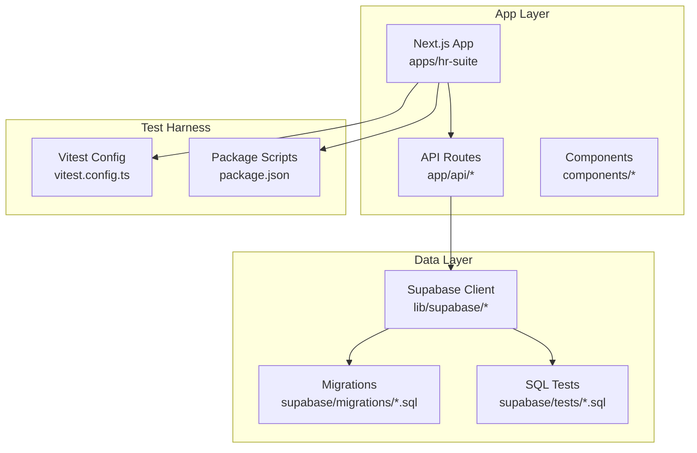
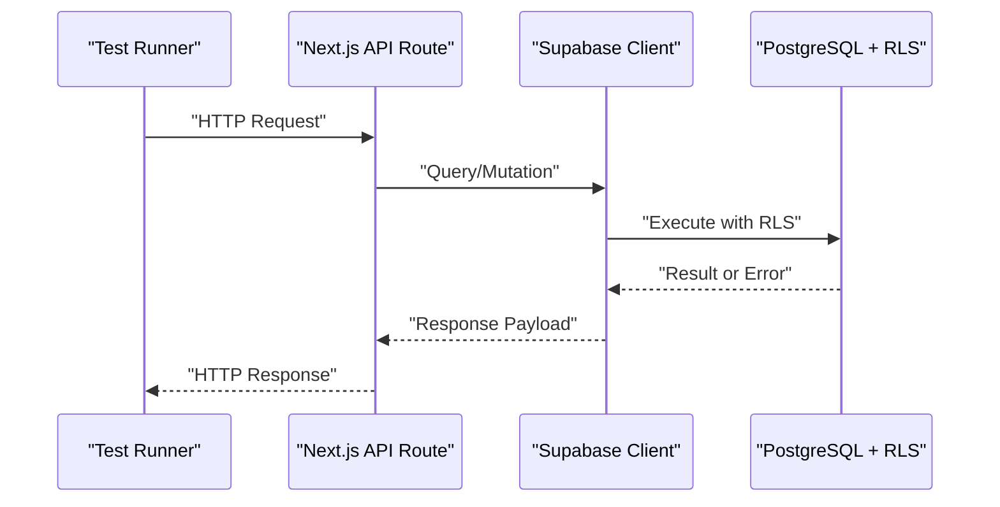
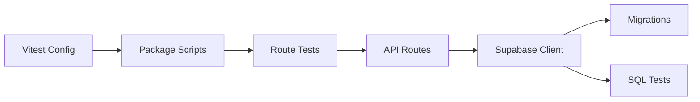

# Integration Testing

<cite>
**Referenced Files in This Document**
- [vitest.config.ts](file://apps/hr-suite/vitest.config.ts)
- [package.json](file://apps/hr-suite/package.json)
- [route.test.ts](file://apps/hr-suite/app/api/leave/balance-report/route.test.ts)
- [route.test.ts](file://apps/hr-suite/app/api/leave/catalog/route.test.ts)
- [route.test.ts](file://apps/hr-suite/app/api/hera/memory/route.test.ts)
- [route.test.ts](file://apps/hr-suite/app/api/hera/preferences/route.test.ts)
- [route.test.ts](file://apps/hr-suite/app/api/organization-chart/route.test.ts)
- [supabase/config.toml](file://apps/hr-suite/supabase/config.toml)
- [20260712124858_init_employee_core_hr.sql](file://apps/hr-suite/supabase/migrations/20260712124858_init_employee_core_hr.sql)
- [20260712124911_add_tenant_rbac_and_organization.sql](file://apps/hr-suite/supabase/migrations/20260712124911_add_tenant_rbac_and_organization.sql)
- [20260712125420_revoke_public_rls_trigger_execution.sql](file://apps/hr-suite/supabase/migrations/20260712125420_revoke_public_rls_trigger_execution.sql)
- [20260712125522_optimize_rbac_indexes_and_policies.sql](file://apps/hr-suite/supabase/migrations/20260712125522_optimize_rbac_indexes_and_policies.sql)
- [20260714170949_harden_organization_authorization.sql](file://apps/hr-suite/supabase/migrations/20260714170949_harden_organization_authorization.sql)
- [20260714171241_link_employees_from_auth_trigger.sql](file://apps/hr-suite/supabase/migrations/20260714171241_link_employees_from_auth_trigger.sql)
- [20260714174305_add_multitenancy_administrations.sql](file://apps/hr-suite/supabase/migrations/20260714174305_add_multitenancy_administrations.sql)
- [20260714175659_seed_multitenancy_demo.sql](file://apps/hr-suite/supabase/migrations/20260714175659_seed_multitenancy_demo.sql)
- [20260714180142_enforce_administration_management_scope.sql](file://apps/hr-suite/supabase/migrations/20260714180142_enforce_administration_management_scope.sql)
- [20260714180309_index_employee_organization_scope_foreign_keys.sql](file://apps/hr-suite/supabase/migrations/20260714180309_index_employee_organization_scope_foreign_keys.sql)
- [20260715064245_add_user_invitations.sql](file://apps/hr-suite/supabase/migrations/20260715064245_add_user_invitations.sql)
- [20260715064924_harden_user_invitation_acceptance.sql](file://apps/hr-suite/supabase/migrations/2026064924_harden_user_invitation_acceptance.sql)
- [20260715070404_add_user_preferences.sql](file://apps/hr-suite/supabase/migrations/20260715070404_add_user_preferences.sql)
- [20260715071054_add_employee_identity_matching.sql](file://apps/hr-suite/supabase/migrations/20260715071054_add_employee_identity_matching.sql)
- [20260715071156_add_employment_core.sql](file://apps/hr-suite/supabase/migrations/20260715071156_add_employment_core.sql)
- [20260715071422_add_employment_timelines.sql](file://apps/hr-suite/supabase/migrations/20260715071422_add_employment_timelines.sql)
- [20260715071717_add_employment_terminations.sql](file://apps/hr-suite/supabase/migrations/20260715071717_add_employment_terminations.sql)
- [20260715072010_harden_employment_security.sql](file://apps/hr-suite/supabase/migrations/20260715072010_harden_employment_security.sql)
- [20260715072908_seed_employment_demo.sql](file://apps/hr-suite/supabase/migrations/20260715072908_seed_employment_demo.sql)
- [20260715120810_complete_employee_core.sql](file://apps/hr-suite/supabase/migrations/20260715120810_complete_employee_core.sql)
- [20260715121304_optimize_employee_core_indexes.sql](file://apps/hr-suite/supabase/migrations/20260715121304_optimize_employee_core_indexes.sql)
- [20260715122802_add_custom_field_definitions.sql](file://apps/hr-suite/supabase/migrations/20260715122802_add_custom_field_definitions.sql)
- [20260715123119_add_custom_field_value_rpc.sql](file://apps/hr-suite/supabase/migrations/20260715123119_add_custom_field_value_rpc.sql)
- [20260715123639_add_organization_authorization_management.sql](file://apps/hr-suite/supabase/migrations/20260715123639_add_organization_authorization_management.sql)
- [20260715123927_harden_custom_field_values.sql](file://apps/hr-suite/supabase/migrations/20260715123927_harden_custom_field_values.sql)
- [20260715124506_isolate_employee_secure_identifiers.sql](file://apps/hr-suite/supabase/migrations/20260715124506_isolate_employee_secure_identifiers.sql)
- [20260715124744_allow_logged_bsn_reveal.sql](file://apps/hr-suite/supabase/migrations/20260715124744_allow_logged_bsn_reveal.sql)
- [20260715130026_index_secure_employee_foreign_keys.sql](file://apps/hr-suite/supabase/migrations/20260715130026_index_secure_employee_foreign_keys.sql)
- [20260715131230_seed_custom_fields_and_tenant_roles.sql](file://apps/hr-suite/supabase/migrations/20260715131230_seed_custom_fields_and_tenant_roles.sql)
- [20260715141843_add_employment_change_management.sql](file://apps/hr-suite/supabase/migrations/20260715141843_add_employment_change_management.sql)
- [20260715145432_optimize_employment_change_management.sql](file://apps/hr-suite/supabase/migrations/20260715145432_optimize_employment_change_management.sql)
- [20260715173629_restore_employee_subresource_grants.sql](file://apps/hr-suite/supabase/migrations/20260715173629_restore_employee_subresource_grants.sql)
- [20260716081000_add_time_hub_reminders.sql](file://apps/hr-suite/supabase/migrations/20260716081000_add_time_hub_reminders.sql)
- [20260716090000_fix_reminder_recipient_rls_recursion.sql](file://apps/hr-suite/supabase/migrations/20260716090000_fix_reminder_recipient_rls_recursion.sql)
- [20260716092000_fix_reminder_publish_auth_lookup.sql](file://apps/hr-suite/supabase/migrations/20260716092000_fix_reminder_publish_auth_lookup.sql)
- [20260716092637_add_hera_ai_agent.sql](file://apps/hr-suite/supabase/migrations/20260716092637_add_hera_ai_agent.sql)
- [20260716100000_add_combined_employment_change_sets.sql](file://apps/hr-suite/supabase/migrations/20260716100000_add_combined_employment_change_sets.sql)
- [20260716110000_add_organization_chart_read_model.sql](file://apps/hr-suite/supabase/migrations/20260716110000_add_organization_chart_read model.sql)
- [20260716120000_add_personal_dashboards.sql](file://apps/hr-suite/supabase/migrations/20260716120000_add_personal_dashboards.sql)
- [20260717100000_harden_hera_memory_and_preferences.sql](file://apps/hr-suite/supabase/migrations/20260717100000_harden_hera_memory_and_preferences.sql)
- [20260717100500_index_hera_preferences.sql](file://apps/hr-suite/supabase/migrations/20260717100500_index_hera_preferences.sql)
- [20260717101000_add_hera_message_metadata.sql](file://apps/hr-suite/supabase/migrations/20260717101000_add_hera_message_metadata.sql)
- [20260718090000_complete_employment_flow.sql](file://apps/hr-suite/supabase/migrations/20260718090000_complete_employment_flow.sql)
- [20260718100000_add_job_catalog_salary_revisions.sql](file://apps/hr-suite/supabase/migrations/20260718100000_add_job_catalog_salary_revisions.sql)
- [20260718100500_add_master_data_mutation_rpcs.sql](file://apps/hr-suite/supabase/migrations/20260718100500_add_master_data_mutation_rpcs.sql)
- [20260718100600_index_master_data_foreign_keys.sql](file:///apps/hr-suite/supabase/migrations/20260718100600_index_master_data_foreign_keys.sql)
- [20260718110000_add_employee_document_dossiers.sql](file://apps/hr-suite/supabase/migrations/20260718110000_add_employee_document_dossiers.sql)
- [20260718110100_fix_document_reminder_recipient_resolution.sql](file://apps/hr-suite/supabase/migrations/20260718110100_fix_document_reminder_recipient_resolution.sql)
- [20260718120000_add_hr_change_event_projection.sql](file://apps/hr-suite/supabase/migrations/20260718120000_add_hr_change_event_projection.sql)
- [20260718121308_add_settings_modules_work_patterns_holidays.sql](file://apps/hr-suite/supabase/migrations/20260718121308_add_settings_modules_work_patterns_holidays.sql)
- [20260718122138_harden_settings_rosters_holidays.sql](file://apps/hr-suite/supabase/migrations/20260718122138_harden_settings_rosters_holidays.sql)
- [20260718122614_enforce_optional_module_guards.sql](file://apps/hr-suite/supabase/migrations/20260718122614_enforce_optional_module_guards.sql)
- [20260718122751_expose_module_state_to_tenant_users.sql](file://apps/hr-suite/supabase/migrations/20260718122751_expose_module_state_to_tenant_users.sql)
- [20260718123742_add_holiday_snapshot_import.sql](file://apps/hr-suite/supabase/migrations/20260718123742_add_holiday_snapshot_import.sql)
- [20260718124240_allow_hr_calendar_recipient_read.sql](file://apps/hr-suite/supabase/migrations/20260718124240_allow_hr_calendar_recipient_read.sql)
- [20260718130000_add_hr_calendar_permission.sql](file://apps/hr-suite/supabase/migrations/20260718130000_add_hr_calendar_permission.sql)
- [20260718131000_harden_hr_master_data_document_policies.sql](file://apps/hr-suite/supabase/migrations/20260718131000_harden_hr_master_data_document_policies.sql)
- [20260718132000_split_reminder_target_write_policy.sql](file://apps/hr-suite/supabase/migrations/20260718132000_split_reminder_target_write_policy.sql)
- [20260718150000_add_employee_archive_and_avatar_state.sql](file://apps/hr-suite/supabase/migrations/20260718150000_add_employee_archive_and_avatar_state.sql)
- [20260718170000_add_dashboard_widget_catalog.sql](file://apps/hr-suite/supabase/migrations/20260718170000_add_dashboard_widget_catalog.sql)
- [20260718171000_relax_dashboard_widget_read_scope.sql](file://apps/hr-suite/supabase/migrations/20260718171000_relax_dashboard_widget_read_scope.sql)
- [20260718172000_expand_personal_dashboard_widget_types.sql](file://apps/hr-suite/supabase/migrations/20260718172000_expand_personal_dashboard_widget_types.sql)
- [20260718172051_grant_dashboard_widget_admin_permissions.sql](file://apps/hr-suite/supabase/migrations/20260718172051_grant_dashboard_widget_admin_permissions.sql)
- [20260718173000_tune_dashboard_widget_policies.sql](file://apps/hr-suite/supabase/migrations/20260718173000_tune_dashboard_widget_policies.sql)
- [20260718180354_add_date_time_user_preferences.sql](file://apps/hr-suite/supabase/migrations/20260718180354_add_date_time_user_preferences.sql)
- [20260719101500_refine_employee_document_upload_rules.sql](file://apps/hr-suite/supabase/migrations/20260719101500_refine_employee_document_upload_rules.sql)
- [20260719112000_add_week_numbering_user_preference.sql](file://apps/hr-suite/supabase/migrations/20260719112000_add_week_numbering_user_preference.sql)
- [20260719153000_add_star_performer_management.sql](file://apps/hr-suite/supabase/migrations/20260719153000_add_star_performer_management.sql)
- [20260719170000_add_tenant_relation_type_catalog.sql](file://apps/hr-suite/supabase/migrations/20260719170000_add_tenant_relation_type_catalog.sql)
- [20260719180000_allow_custom_relation_type_catalog_entries.sql](file://apps/hr-suite/supabase/migrations/20260719180000_allow_custom_relation_type_catalog_entries.sql)
- [20260719181000_index_relation_type_catalog_fk.sql](file://apps/hr-suite/supabase/migrations/20260719181000_index_relation_type_catalog_fk.sql)
- [20260722142551_add_leave_engine_foundation.sql](file://apps/hr-suite/supabase/migrations/20260722142551_add_leave_engine_foundation.sql)
- [20260722144232_add_leave_engine_fk_indexes.sql](file://apps/hr-suite/supabase/migrations/20260722144232_add_leave_engine_fk_indexes.sql)
- [20260722144344_add_leave_transaction_bucket_fk_index.sql](file://apps/hr-suite/supabase/migrations/20260722144344_add_leave_transaction_bucket_fk_index.sql)
- [20260722151920_add_leave_configuration_mutation_functions.sql](file://apps/hr-suite/supabase/migrations/20260722151920_add_leave_configuration_mutation_functions.sql)
- [20260722173000_add_work_hour_type_colors.sql](file://apps/hr-suite/supabase/migrations/20260722173000_add_work_hour_type_colors.sql)
- [20260722173100_normalize_catalog_color_defaults.sql](file://apps/hr-suite/supabase/migrations/20260722173100_normalize_catalog_color_defaults.sql)
- [20260722190000_add_leave_request_booking_engine.sql](file://apps/hr-suite/supabase/migrations/20260722190000_add_leave_request_booking_engine.sql)
- [20260722190500_seed_leave_demo_linda.sql](file://apps/hr-suite/supabase/migrations/20260722190500_seed_leave_demo_linda.sql)
- [20260722191500_add_leave_request_fk_indexes.sql](file://apps/hr-suite/supabase/migrations/20260722191500_add_leave_request_fk_indexes.sql)
- [20260722192000_add_leave_ledger_operations.sql](file://apps/hr-suite/supabase/migrations/20260722192000_add_leave_ledger_operations.sql)
- [20260722192100_seed_leave_demo_year_controls.sql](file://apps/hr-suite/supabase/migrations/20260722192100_seed_leave_demo_year_controls.sql)
- [20260722192500_skip_holidays_in_leave_requests.sql](file://apps/hr-suite/supabase/migrations/20260722192500_skip_holidays_in_leave_requests.sql)
- [20260723151000_optimize_employee_overview.sql](file://apps/hr-suite/supabase/migrations/20260723151000_optimize_employee_overview.sql)
- [20260724095433_insights_report_permissions.sql](file://apps/hr-suite/supabase/migrations/20260724095433_insights_report_permissions.sql)
- [20260724100605_upcoming_events_and_anniversary_rules.sql](file://apps/hr-suite/supabase/migrations/20260724100605_upcoming_events_and_anniversary_rules.sql)
- [20260724103939_simplify_roles_and_insights_events.sql](file://apps/hr-suite/supabase/migrations/20260724103939_simplify_roles_and_insights_events.sql)
- [20260724112407_add_role_assignment_scope.sql](file://apps/hr-suite/supabase/migrations/20260724112407_add_role_assignment_scope.sql)
- [20260724160000_add_employee_activity_entries.sql](file://apps/hr-suite/supabase/migrations/20260724160000_add_employee_activity_entries.sql)
- [20260724172716_harden_employee_activity_entries.sql](file://apps/hr-suite/supabase/migrations/20260724172716_harden_employee_activity_entries.sql)
- [20260725132351_address_input_internationalization.sql](file://apps/hr-suite/supabase/migrations/20260725132351_address_input_internationalization.sql)
- [multitenancy_isolation.sql](file://apps/hr-suite/supabase/tests/multitenancy_isolation.sql)
- [employee_core_crud_isolation.sql](file://apps/hr-suite/supabase/tests/employee_core_crud_isolation.sql)
- [employment_complete_flow.sql](file://apps/hr-suite/supabase/tests/employment_complete_flow.sql)
- [leave_engine_foundation.sql](file://apps/hr-suite/supabase/tests/leave_engine_foundation.sql)
- [hera_ai_agent.sql](file://apps/hr-suite/supabase/tests/hera_ai_agent.sql)
</cite>

## Table of Contents
1. Introduction
2. Project Structure
3. Core Components
4. Architecture Overview
5. Detailed Component Analysis
6. Dependency Analysis
7. Performance Considerations
8. Troubleshooting Guide
9. Conclusion

## Introduction
This document provides comprehensive integration testing guidance for LiquidHR’s API endpoints, database operations, and external service integrations. It covers RESTful API testing strategies, Supabase interactions, and database migrations. It also explains how to test complex business workflows such as employee lifecycle, employment changes, and leave management processes. Guidance is included for testing authorization flows, multitenancy isolation, real-time subscriptions, transactional testing with rollback strategies, performance testing for database operations, and testing AI agent interactions and third-party integrations.

## Project Structure
LiquidHR uses a Next.js application under apps/hr-suite with:
- API routes organized by feature (e.g., employees, employments, leave, hera, organization).
- Supabase migrations under supabase/migrations for schema evolution and policies.
- Supabase SQL tests under supabase/tests for database-level assertions.
- Vitest configuration at the app root for unit/integration tests.
- Package scripts for running tests and managing dependencies.

**Diagram sources**
- [vitest.config.ts](file://apps/hr-suite/vitest.config.ts)
- [package.json](file://apps/hr-suite/package.json)
- [supabase/config.toml](file://apps/hr-suite/supabase/config.toml)

**Section sources**
- [vitest.config.ts](file://apps/hr-suite/vitest.config.ts)
- [package.json](file://apps/hr-suite/package.json)

## Core Components
Key integration testing components include:
- API route tests for critical endpoints (leave catalog, balance report, organization chart, Hera memory/preferences).
- Supabase SQL tests for data isolation, RBAC, and domain-specific flows (employee core, employment, leave engine, Hera AI agent).
- Migrations that define schema, policies, indexes, and functions used by APIs and tests.

Examples of existing route tests:
- Leave catalog endpoint test
- Leave balance report endpoint test
- Organization chart endpoint test
- Hera memory and preferences endpoint tests

These tests validate request/response contracts, error handling, and basic success paths.

**Section sources**
- [route.test.ts](file://apps/hr-suite/app/api/leave/catalog/route.test.ts)
- [route.test.ts](file://apps/hr-suite/app/api/leave/balance-report/route.test.ts)
- [route.test.ts](file://apps/hr-suite/app/api/organization-chart/route.test.ts)
- [route.test.ts](file://apps/hr-suite/app/api/hera/memory/route.test.ts)
- [route.test.ts](file://apps/hr-suite/app/api/hera/preferences/route.test.ts)

## Architecture Overview
Integration testing spans three layers:
- API layer: HTTP requests to Next.js API routes.
- Data layer: Supabase client calls interacting with Postgres via RLS policies, functions, and migrations.
- Test harness: Vitest orchestrates tests; Supabase SQL tests run against the database.

[No sources needed since this diagram shows conceptual workflow, not actual code structure]

## Detailed Component Analysis

### RESTful API Testing Strategy
- Use Vitest to send HTTP requests to API routes.
- Validate status codes, response shapes, and error messages.
- Cover happy paths, validation failures, and authorization denials.
- For endpoints with side effects, ensure idempotency and proper error propagation.

Recommended patterns:
- Setup fixtures per test case (create minimal required data).
- Assert both success and failure scenarios.
- Mock external services where applicable to isolate tests.

**Section sources**
- [route.test.ts](file://apps/hr-suite/app/api/leave/catalog/route.test.ts)
- [route.test.ts](file://apps/hr-suite/app/api/leave/balance-report/route.test.ts)
- [route.test.ts](file://apps/hr-suite/app/api/organization-chart/route.test.ts)
- [route.test.ts](file://apps/hr-suite/app/api/hera/memory/route.test.ts)
- [route.test.ts](file://apps/hr-suite/app/api/hera/preferences/route.test.ts)

### Supabase Interactions and Database Testing
- Use Supabase SQL tests to assert schema correctness, policy behavior, and function outcomes.
- Leverage migrations to evolve schema consistently across environments.
- Ensure RLS policies are tested for tenant isolation and role-based access.

Key migration categories:
- Employee core and identity matching
- Employment lifecycle and timelines
- Custom fields and secure identifiers
- Multitenancy and administration scope
- Leave engine foundation and booking ledger
- Hera AI agent memory and preferences
- Settings, modules, holidays, and calendars

Example SQL tests:
- Multitenancy isolation
- Employee core CRUD isolation
- Employment complete flow
- Leave engine foundation
- Hera AI agent behavior

**Section sources**
- [multitenancy_isolation.sql](file://apps/hr-suite/supabase/tests/multitenancy_isolation.sql)
- [employee_core_crud_isolation.sql](file://apps/hr-suite/supabase/tests/employee_core_crud_isolation.sql)
- [employment_complete_flow.sql](file://apps/hr-suite/supabase/tests/employment_complete_flow.sql)
- [leave_engine_foundation.sql](file://apps/hr-suite/supabase/tests/leave_engine_foundation.sql)
- [hera_ai_agent.sql](file://apps/hr-suite/supabase/tests/hera_ai_agent.sql)

### Complex Business Workflows
- Employee lifecycle: creation, identity matching, custom fields, secure identifiers, activity entries.
- Employment changes: timeline updates, termination handling, change sets, security hardening.
- Leave management: catalog setup, accrual rules, request booking, ledger operations, holiday skipping.

Testing approach:
- Compose multi-step sequences that mirror user actions.
- Verify intermediate states and final outcomes.
- Assert audit trails and event projections where applicable.

**Section sources**
- [20260715071156_add_employment_core.sql](file://apps/hr-suite/supabase/migrations/20260715071156_add_employment_core.sql)
- [20260715071422_add_employment_timelines.sql](file://apps/hr-suite/supabase/migrations/20260715071422_add_employment_timelines.sql)
- [20260715071717_add_employment_terminations.sql](file://apps/hr-suite/supabase/migrations/20260715071717_add_employment_terminations.sql)
- [20260715141843_add_employment_change_management.sql](file://apps/hr-suite/supabase/migrations/20260715141843_add_employment_change_management.sql)
- [20260722142551_add_leave_engine_foundation.sql](file://apps/hr-suite/supabase/migrations/20260722142551_add_leave_engine_foundation.sql)
- [20260722190000_add_leave_request_booking_engine.sql](file://apps/hr-suite/supabase/migrations/20260722190000_add_leave_request_booking_engine.sql)
- [20260722192000_add_leave_ledger_operations.sql](file://apps/hr-suite/supabase/migrations/20260722192000_add_leave_ledger_operations.sql)

### Authorization Flows and Multitenancy Isolation
- Validate RLS policies for tenant scoping and role-based permissions.
- Ensure cross-tenant data cannot be accessed via API or direct queries.
- Confirm admin scopes and management boundaries.

Relevant migrations:
- Tenant RBAC and organization setup
- Hardened organization authorization
- Administration management scope enforcement
- Role assignment scope
- Secure identifiers isolation

**Section sources**
- [20260712124911_add_tenant_rbac_and_organization.sql](file://apps/hr-suite/supabase/migrations/20260712124911_add_tenant_rbac_and_organization.sql)
- [20260714170949_harden_organization_authorization.sql](file://apps/hr-suite/supabase/migrations/20260714170949_harden_organization_authorization.sql)
- [20260714180142_enforce_administration_management_scope.sql](file://apps/hr-suite/supabase/migrations/20260714180142_enforce_administration_management_scope.sql)
- [20260724112407_add_role_assignment_scope.sql](file://apps/hr-suite/supabase/migrations/20260724112407_add_role_assignment_scope.sql)
- [20260715124506_isolate_employee_secure_identifiers.sql](file://apps/hr-suite/supabase/migrations/20260715124506_isolate_employee_secure_identifiers.sql)

### Real-Time Subscriptions
- For features using Supabase real-time (e.g., reminders, HR events), test subscription establishment, message delivery, and cleanup.
- Simulate events and verify clients receive expected payloads within timeouts.
- Ensure reconnection and error handling are covered.

[No sources needed since this section provides general guidance]

### Transactional Testing and Rollback Strategies
- Wrap API tests in transactions when possible to avoid persistent state.
- For Supabase SQL tests, use explicit BEGIN/COMMIT/ROLLBACK patterns to isolate runs.
- Validate that partial failures do not leave inconsistent state.

**Section sources**
- [supabase/config.toml](file://apps/hr-suite/supabase/config.toml)

### Testing AI Agent Interactions and Third-Party Integrations
- For Hera AI agent, mock external LLM calls and validate conversation memory and preferences persistence.
- Assert tool usage, constraints, and compliance checks.
- For address lookup and suggestions, mock geocoding providers and validate fallbacks.

**Section sources**
- [20260716092637_add_hera_ai_agent.sql](file://apps/hr-suite/supabase/migrations/20260716092637_add_hera_ai_agent.sql)
- [20260717100000_harden_hera_memory_and_preferences.sql](file://apps/hr-suite/supabase/migrations/20260717100000_harden_hera_memory_and_preferences.sql)
- [20260717101000_add_hera_message_metadata.sql](file://apps/hr-suite/supabase/migrations/20260717101000_add_hera_message_metadata.sql)

### Test Data Management
- Create minimal, deterministic fixtures for each test scenario.
- Use seed migrations sparingly; prefer inline setup in tests for clarity.
- Clean up after tests to maintain isolation.

**Section sources**
- [20260714175659_seed_multitenancy_demo.sql](file://apps/hr-suite/supabase/migrations/20260714175659_seed_multitenancy_demo.sql)
- [20260715072908_seed_employment_demo.sql](file://apps/hr-suite/supabase/migrations/20260715072908_seed_employment_demo.sql)
- [20260722190500_seed_leave_demo_linda.sql](file://apps/hr-suite/supabase/migrations/20260722190500_seed_leave_demo_linda.sql)
- [20260722192100_seed_leave_demo_year_controls.sql](file://apps/hr-suite/supabase/migrations/20260722192100_seed_leave_demo_year_controls.sql)

## Dependency Analysis
The integration test surface depends on:
- API routes for request handling
- Supabase client for data access
- Migrations for schema and policies
- SQL tests for database-level assertions

**Diagram sources**
- [vitest.config.ts](file://apps/hr-suite/vitest.config.ts)
- [package.json](file://apps/hr-suite/package.json)

**Section sources**
- [vitest.config.ts](file://apps/hr-suite/vitest.config.ts)
- [package.json](file://apps/hr-suite/package.json)

## Performance Considerations
- Keep test datasets small and targeted to reduce query times.
- Use appropriate indexes defined in migrations to speed up reads.
- Avoid heavy mocks; prefer lightweight stubs for external services.
- Profile slow tests and refactor to minimize I/O.

[No sources needed since this section provides general guidance]

## Troubleshooting Guide
Common issues and resolutions:
- Authentication failures: Ensure test tokens and roles are set correctly; verify RLS policies.
- Multitenancy leaks: Confirm tenant scoping in queries and policies.
- Migration conflicts: Apply migrations in order; check dependency chains.
- Real-time subscription timeouts: Increase timeouts and handle reconnects gracefully.
- External service errors: Mock responses and assert fallback behavior.

**Section sources**
- [20260712125420_revoke_public_rls_trigger_execution.sql](file://apps/hr-suite/supabase/migrations/20260712125420_revoke_public_rls_trigger_execution.sql)
- [20260712125522_optimize_rbac_indexes_and_policies.sql](file://apps/hr-suite/supabase/migrations/20260712125522_optimize_rbac_indexes_and_policies.sql)
- [20260715072010_harden_employment_security.sql](file://apps/hr-suite/supabase/migrations/20260715072010_harden_employment_security.sql)
- [20260715123927_harden_custom_field_values.sql](file://apps/hr-suite/supabase/migrations/20260715123927_harden_custom_field_values.sql)

## Conclusion
LiquidHR’s integration testing strategy combines Vitest-based API route tests with Supabase SQL tests to cover both HTTP contracts and database behavior. By leveraging migrations for schema evolution and policies for security, tests can validate complex workflows like employee lifecycle, employment changes, and leave management. The guidance here ensures robust coverage for authorization, multitenancy, real-time features, transactional integrity, and external integrations, enabling confident releases and maintainable code.