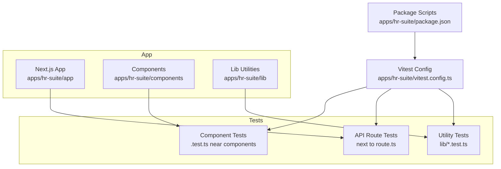
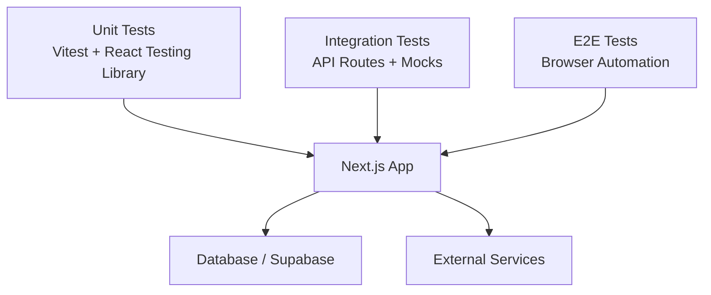
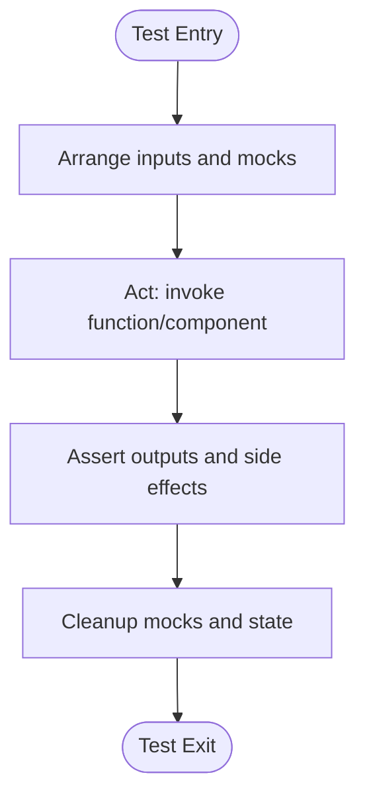
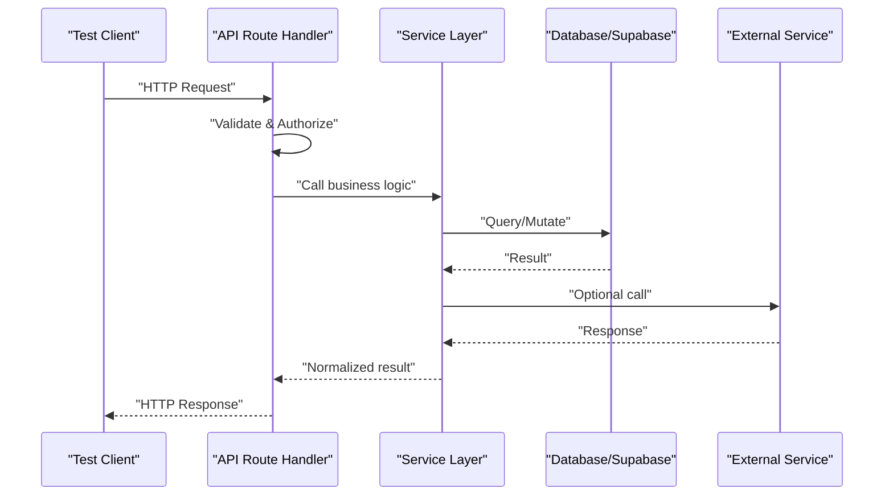
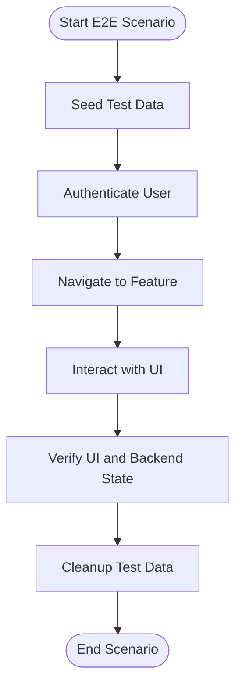
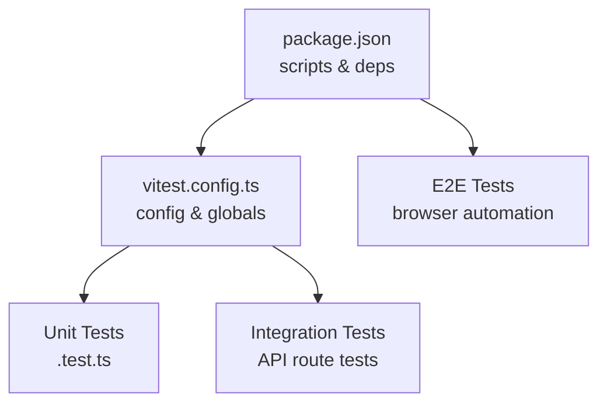

# Testing Guide

<cite>
**Referenced Files in This Document**
- [vitest.config.ts](file://apps/hr-suite/vitest.config.ts)
- [package.json](file://apps/hr-suite/package.json)
- [dashboard-progress-model.test.ts](file://apps/hr-suite/components/dashboard/dashboard-progress-model.test.ts)
- [dashboard-workspace-model.test.ts](file://apps/hr-suite/components/dashboard/dashboard-workspace-model.test.ts)
- [widget-picker-model.test.ts](file://apps/hr-suite/components/dashboard/widget-picker-model.test.ts)
- [hera-chat-state.test.ts](file://apps/hr-suite/components/hera/hera-chat-state.test.ts)
- [hera-floating-state.test.ts](file://apps/hr-suite/components/hera/hera-floating-state.test.ts)
- [hera-request.test.ts](file://apps/hr-suite/components/hera/hera-request.test.ts)
- [hera-response-model.test.ts](file://apps/hr-suite/components/hera/hera-response-model.test.ts)
- [app-version.test.ts](file://apps/hr-suite/lib/app-version.test.ts)
- [route.test.ts](file://apps/hr-suite/app/api/organization-chart/route.test.ts)
- [route.test.ts](file://apps/hr-suite/app/api/leave/catalog/route.test.ts)
- [route.test.ts](file://apps/hr-suite/app/api/leave/balance-report/route.test.ts)
- [route.test.ts](file://apps/hr-suite/app/api/hera/preferences/route.test.ts)
- [route.test.ts](file://apps/hr-suite/app/api/hera/memory/route.test.ts)
</cite>

## Table of Contents
1. [Introduction](#introduction)
2. [Project Structure](#project-structure)
3. [Core Components](#core-components)
4. [Architecture Overview](#architecture-overview)
5. [Detailed Component Analysis](#detailed-component-analysis)
6. [Dependency Analysis](#dependency-analysis)
7. [Performance Considerations](#performance-considerations)
8. [Troubleshooting Guide](#troubleshooting-guide)
9. [Conclusion](#conclusion)
10. [Appendices](#appendices)

## Introduction
This guide documents LiquidHR’s testing strategy and implementation across unit, integration, and end-to-end (E2E) layers. It explains how React components, service functions, and utility modules are tested with Vitest, how API endpoints and database operations are validated, and how to approach E2E scenarios for complete user workflows. It also covers mock strategies, test data management, performance and accessibility testing, browser compatibility considerations, and continuous integration practices.

## Project Structure
LiquidHR uses a Next.js application structure under apps/hr-suite with tests colocated near the code they validate:
- Unit tests live alongside component logic and utilities using .test.ts files.
- API route tests reside next to their corresponding route handlers under app/api.
- The Vitest configuration is centralized at the app level.

**Diagram sources**
- [vitest.config.ts](file://apps/hr-suite/vitest.config.ts)
- [package.json](file://apps/hr-suite/package.json)

**Section sources**
- [vitest.config.ts](file://apps/hr-suite/vitest.config.ts)
- [package.json](file://apps/hr-suite/package.json)

## Core Components
The testing foundation centers on Vitest as the runner and assertion library, integrated into the Next.js app via the app-level vitest.config.ts and npm scripts defined in package.json. Existing tests demonstrate patterns for:
- Pure model/state logic validation (e.g., dashboard models, hera state).
- API route behavior verification (e.g., organization chart, leave catalog/balance report, hera preferences/memory).
- Utility module assertions (e.g., app version helpers).

Key characteristics:
- Colocated tests for discoverability and maintainability.
- Clear separation between unit tests (fast, isolated) and integration tests (API routes with mocked dependencies).
- Consistent naming conventions (.test.ts) and file placement.

**Section sources**
- [vitest.config.ts](file://apps/hr-suite/vitest.config.ts)
- [package.json](file://apps/hr-suite/package.json)
- [dashboard-progress-model.test.ts](file://apps/hr-suite/components/dashboard/dashboard-progress-model.test.ts)
- [dashboard-workspace-model.test.ts](file://apps/hr-suite/components/dashboard/dashboard-workspace-model.test.ts)
- [widget-picker-model.test.ts](file://apps/hr-suite/components/dashboard/widget-picker-model.test.ts)
- [hera-chat-state.test.ts](file://apps/hr-suite/components/hera/hera-chat-state.test.ts)
- [hera-floating-state.test.ts](file://apps/hr-suite/components/hera/hera-floating-state.test.ts)
- [hera-request.test.ts](file://apps/hr-suite/components/hera/hera-request.test.ts)
- [hera-response-model.test.ts](file://apps/hr-suite/components/hera/hera-response-model.test.ts)
- [app-version.test.ts](file://apps/hr-suite/lib/app-version.test.ts)
- [route.test.ts](file://apps/hr-suite/app/api/organization-chart/route.test.ts)
- [route.test.ts](file://apps/hr-suite/app/api/leave/catalog/route.test.ts)
- [route.test.ts](file://apps/hr-suite/app/api/leave/balance-report/route.test.ts)
- [route.test.ts](file://apps/hr-suite/app/api/hera/preferences/route.test.ts)
- [route.test.ts](file://apps/hr-suite/app/api/hera/memory/route.test.ts)

## Architecture Overview
The testing architecture follows a layered approach:
- Unit layer: Fast, deterministic tests for pure functions, state machines, and UI logic.
- Integration layer: API route tests that validate request/response contracts, authorization, and error handling by mocking external services and database calls.
- E2E layer: Browser-based flows covering multi-step user journeys across components and services.

[No sources needed since this diagram shows conceptual workflow, not actual code structure]

## Detailed Component Analysis

### Unit Testing Strategy for React Components and State Logic
- Scope: Pure logic, state transitions, and rendering expectations without network or DOM side effects.
- Patterns observed:
  - Model/state tests validate transformations and invariants (e.g., dashboard progress/workspace models).
  - Hera state and response models ensure correct state machine behavior and payload shapes.
- Best practices:
  - Keep tests focused on one behavior per file.
  - Use minimal mocks for external dependencies.
  - Assert both happy paths and edge cases.

[No sources needed since this diagram shows conceptual workflow, not actual code structure]

**Section sources**
- [dashboard-progress-model.test.ts](file://apps/hr-suite/components/dashboard/dashboard-progress-model.test.ts)
- [dashboard-workspace-model.test.ts](file://apps/hr-suite/components/dashboard/dashboard-workspace-model.test.ts)
- [widget-picker-model.test.ts](file://apps/hr-suite/components/dashboard/widget-picker-model.test.ts)
- [hera-chat-state.test.ts](file://apps/hr-suite/components/hera/hera-chat-state.test.ts)
- [hera-floating-state.test.ts](file://apps/hr-suite/components/hera/hera-floating-state.test.ts)
- [hera-request.test.ts](file://apps/hr-suite/components/hera/hera-request.test.ts)
- [hera-response-model.test.ts](file://apps/hr-suite/components/hera/hera-response-model.test.ts)
- [app-version.test.ts](file://apps/hr-suite/lib/app-version.test.ts)

### Integration Testing Strategy for API Endpoints
- Scope: Validate HTTP contracts, authorization checks, input validation, and error responses.
- Patterns observed:
  - API route tests assert status codes, headers, and JSON payloads.
  - External dependencies (database, AI agent, third-party APIs) are mocked to isolate behavior.
- Recommendations:
  - Create fixtures for common payloads and edge cases.
  - Test both success and failure branches explicitly.
  - Verify RBAC and tenant scoping where applicable.

[No sources needed since this diagram shows conceptual workflow, not actual code structure]

**Section sources**
- [route.test.ts](file://apps/hr-suite/app/api/organization-chart/route.test.ts)
- [route.test.ts](file://apps/hr-suite/app/api/leave/catalog/route.test.ts)
- [route.test.ts](file://apps/hr-suite/app/api/leave/balance-report/route.test.ts)
- [route.test.ts](file://apps/hr-suite/app/api/hera/preferences/route.test.ts)
- [route.test.ts](file://apps/hr-suite/app/api/hera/memory/route.test.ts)

### E2E Testing Methodology for Complete User Workflows
- Scope: Multi-step interactions spanning authentication, navigation, form submissions, real-time updates, and cross-component state synchronization.
- Approach:
  - Use a browser automation framework (e.g., Playwright) to simulate real users.
  - Seed deterministic test data before each scenario.
  - Assert UI states, network requests, and downstream effects.
- Coverage areas:
  - Authorization flows (login, role-based access).
  - HR admin workflows (employee creation, employment lifecycle).
  - Leave request and approval processes.
  - Hera AI agent interactions (chat sessions, memory persistence).

[No sources needed since this diagram shows conceptual workflow, not actual code structure]

### Testing Complex Scenarios
- Authorization Flows:
  - Validate role-based access control and tenant isolation at both API and UI levels.
  - Ensure unauthorized actions return appropriate errors and UI denies access.
- Real-Time Updates:
  - Mock WebSocket/SSE events or use controlled channels in tests.
  - Assert state changes propagate correctly across components.
- AI Agent Interactions (Hera):
  - Stub LLM responses deterministically.
  - Validate conversation state, memory writes, and tool execution outcomes.

**Section sources**
- [hera-chat-state.test.ts](file://apps/hr-suite/components/hera/hera-chat-state.test.ts)
- [hera-floating-state.test.ts](file://apps/hr-suite/components/hera/hera-floating-state.test.ts)
- [hera-request.test.ts](file://apps/hr-suite/components/hera/hera-request.test.ts)
- [hera-response-model.test.ts](file://apps/hr-suite/components/hera/hera-response-model.test.ts)

### Testing Utilities, Mock Strategies, and Test Data Management
- Utilities:
  - Centralized helpers for creating fixtures, asserting responses, and resetting mocks.
- Mocking:
  - Network: Intercept fetch/XHR or use Next.js route mocks.
  - Database: Mock Supabase client methods to avoid real queries.
  - External APIs: Stub HTTP clients and time-dependent functions.
- Test Data:
  - Use factories/fixtures for consistent datasets.
  - Isolate test runs with transactional cleanup or dedicated test tenants.

**Section sources**
- [vitest.config.ts](file://apps/hr-suite/vitest.config.ts)
- [package.json](file://apps/hr-suite/package.json)

## Dependency Analysis
Testing dependencies are managed through the app’s package.json and Vitest configuration:
- Vitest provides the test runner and assertions.
- React Testing Library can be used for component rendering and interaction tests.
- Optional E2E tools (e.g., Playwright) should be added if not already present.

**Diagram sources**
- [package.json](file://apps/hr-suite/package.json)
- [vitest.config.ts](file://apps/hr-suite/vitest.config.ts)

**Section sources**
- [package.json](file://apps/hr-suite/package.json)
- [vitest.config.ts](file://apps/hr-suite/vitest.config.ts)

## Performance Considerations
- Keep unit tests fast and deterministic; avoid heavy setup or real I/O.
- Parallelize independent test suites; leverage Vitest’s concurrency.
- Profile slow integration tests; mock expensive operations.
- For E2E, minimize flakiness by stabilizing selectors and avoiding arbitrary waits.

[No sources needed since this section provides general guidance]

## Troubleshooting Guide
Common issues and resolutions:
- Flaky tests:
  - Stabilize timers and network calls; use controlled clocks and interceptors.
  - Add retries only when necessary; prefer deterministic conditions.
- Environment mismatches:
  - Ensure consistent Node versions and environment variables across local and CI.
- Mock leakage:
  - Reset mocks between tests; isolate global state.
- Slow test runs:
  - Split suites by feature; run critical paths first.

[No sources needed since this section provides general guidance]

## Conclusion
LiquidHR’s testing strategy leverages Vitest for unit and integration tests colocated with source code, ensuring clarity and maintainability. By extending coverage to E2E scenarios, robust mocking, and disciplined test data management, the team can confidently deliver complex HR workflows while maintaining performance and reliability. Adopting the practices outlined here will strengthen regression safety, accelerate feedback loops, and support scalable growth.

[No sources needed since this section summarizes without analyzing specific files]

## Appendices

### Continuous Integration Setup
- Recommended steps:
  - Install dependencies and cache node_modules.
  - Run linting and type checks.
  - Execute unit tests with parallelization.
  - Run integration tests with mocked services.
  - Trigger E2E suite against a staging-like environment.
  - Upload coverage reports and artifacts.

[No sources needed since this section provides general guidance]

### Accessibility and Browser Compatibility Testing
- Accessibility:
  - Integrate axe-core or similar tools into unit/E2E tests.
  - Enforce keyboard navigation and screen reader labels.
- Browser Compatibility:
  - Use a matrix of browsers in CI (Chrome, Firefox, Safari).
  - Polyfill or transpile as needed; validate responsive layouts.

[No sources needed since this section provides general guidance]