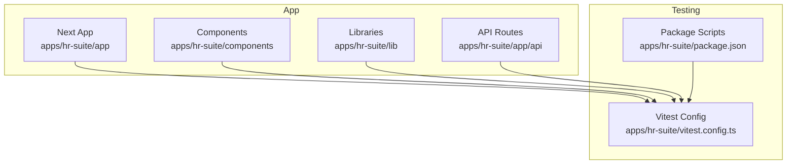
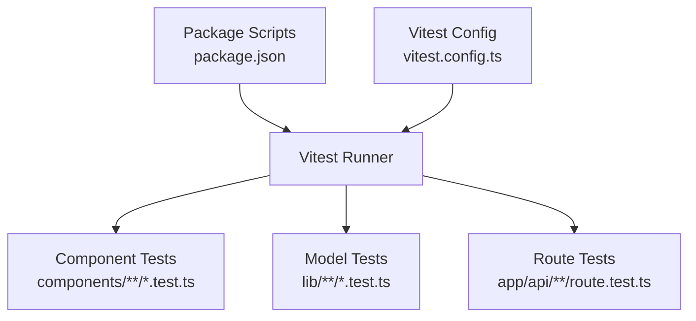
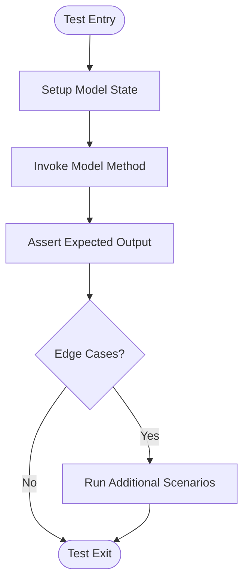
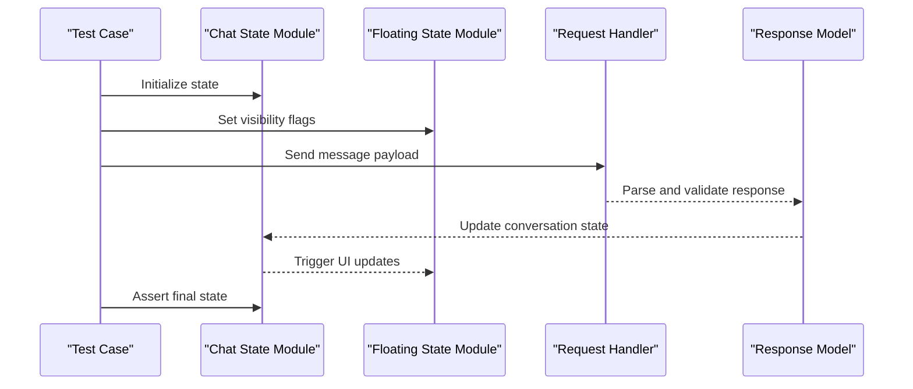
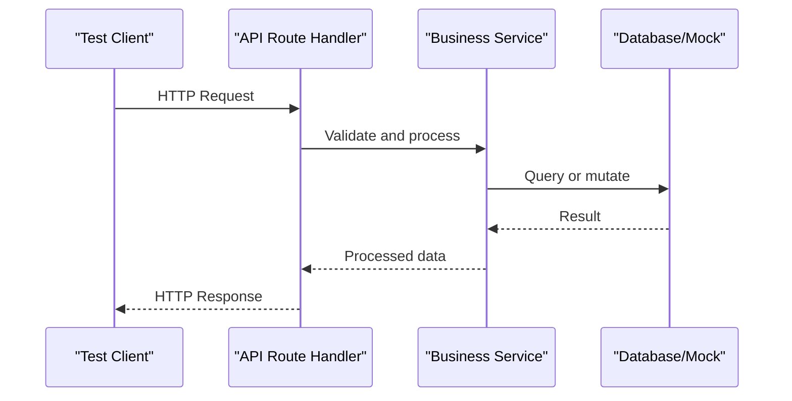
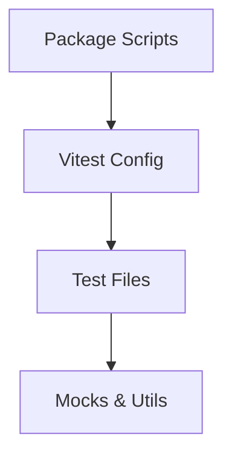

# Unit Testing

<cite>
**Referenced Files in This Document**
- [vitest.config.ts](file://apps/hr-suite/vitest.config.ts)
- [package.json](file://apps/hr-suite/package.json)
- [dashboard-progress-model.test.ts](file://apps/hr-suite/components/dashboard/dashboard-progress-model.test.ts)
- [dashboard-workspace-model.test.ts](file://apps/hr-suite/components/dashboard/dashboard-workspace-model.test.ts)
- [widget-picker-model.test.ts](file://apps/hr-suite/components/dashboard/widget-picker-model.test.ts)
- [app-version.test.ts](file://apps/hr-suite/lib/app-version.test.ts)
- [hera-chat-state.test.ts](file://apps/hr-suite/components/hera/hera-chat-state.test.ts)
- [hera-floating-state.test.ts](file://apps/hr-suite/components/hera/hera-floating-state.test.ts)
- [hera-request.test.ts](file://apps/hr-suite/components/hera/hera-request.test.ts)
- [hera-response-model.test.ts](file://apps/hr-suite/components/hera/hera-response-model.test.ts)
- [route.test.ts (leave balance-report)](file://apps/hr-suite/app/api/leave/balance-report/route.test.ts)
- [route.test.ts (leave catalog)](file://apps/hr-suite/app/api/leave/catalog/route.test.ts)
- [route.test.ts (organization chart)](file://apps/hr-suite/app/api/organization-chart/route.test.ts)
- [route.test.ts (hera memory)](file://apps/hr-suite/app/api/hera/memory/route.test.ts)
- [route.test.ts (hera preferences)](file://apps/hr-suite/app/api/hera/preferences/route.test.ts)
</cite>

## Table of Contents
1. [Introduction](#introduction)
2. [Project Structure](#project-structure)
3. [Core Components](#core-components)
4. [Architecture Overview](#architecture-overview)
5. [Detailed Component Analysis](#detailed-component-analysis)
6. [Dependency Analysis](#dependency-analysis)
7. [Performance Considerations](#performance-considerations)
8. [Troubleshooting Guide](#troubleshooting-guide)
9. [Conclusion](#conclusion)
10. [Appendices](#appendices)

## Introduction
This document provides comprehensive unit testing guidance for LiquidHR using Vitest. It focuses on testing strategies for React components, business logic models, and utility functions across the HR Suite application. It also covers advanced topics such as complex state management in the HERA chat system, dashboard models, employment workflows, mocking external dependencies, testing asynchronous operations, validating component behavior, custom fields, authorization logic, and real-time features. Practical guidelines for test organization, naming conventions, coverage maintenance, performance considerations, and best practices are included to help teams write reliable and maintainable tests.

## Project Structure
LiquidHR uses a Next.js-based app structure under apps/hr-suite with feature-oriented directories for pages, components, API routes, and shared libraries. Tests are colocated near their source files using .test.ts suffixes and configured via a dedicated Vitest configuration file. The project’s package.json defines the scripts and dependencies required to run tests.

**Diagram sources**
- [vitest.config.ts](file://apps/hr-suite/vitest.config.ts)
- [package.json](file://apps/hr-suite/package.json)

**Section sources**
- [vitest.config.ts](file://apps/hr-suite/vitest.config.ts)
- [package.json](file://apps/hr-suite/package.json)

## Core Components
The codebase includes several existing unit tests that demonstrate patterns for:
- Business logic models (e.g., dashboard progress and workspace models)
- Utility functions (e.g., app version checks)
- Stateful modules (e.g., HERA chat state and floating state)
- Request/response modeling (e.g., HERA request handling and response parsing)
- API route handlers (e.g., leave catalog and balance report endpoints)

These tests illustrate how to isolate logic, mock dependencies, and validate outcomes without running the full application stack.

**Section sources**
- [dashboard-progress-model.test.ts](file://apps/hr-suite/components/dashboard/dashboard-progress-model.test.ts)
- [dashboard-workspace-model.test.ts](file://apps/hr-suite/components/dashboard/dashboard-workspace-model.test.ts)
- [widget-picker-model.test.ts](file://apps/hr-suite/components/dashboard/widget-picker-model.test.ts)
- [app-version.test.ts](file://apps/hr-suite/lib/app-version.test.ts)
- [hera-chat-state.test.ts](file://apps/hr-suite/components/hera/hera-chat-state.test.ts)
- [hera-floating-state.test.ts](file://apps/hr-suite/components/hera/hera-floating-state.test.ts)
- [hera-request.test.ts](file://apps/hr-suite/components/hera/hera-request.test.ts)
- [hera-response-model.test.ts](file://apps/hr-suite/components/hera/hera-response-model.test.ts)
- [route.test.ts (leave balance-report)](file://apps/hr-suite/app/api/leave/balance-report/route.test.ts)
- [route.test.ts (leave catalog)](file://apps/hr-suite/app/api/leave/catalog/route.test.ts)
- [route.test.ts (organization chart)](file://apps/hr-suite/app/api/organization-chart/route.test.ts)
- [route.test.ts (hera memory)](file://apps/hr-suite/app/api/hera/memory/route.test.ts)
- [route.test.ts (hera preferences)](file://apps/hr-suite/app/api/hera/preferences/route.test.ts)

## Architecture Overview
At a high level, unit tests in LiquidHR target three layers:
- UI layer: React components and their state interactions
- Domain layer: Business logic models and utilities
- Integration layer: API route handlers and data flows

Tests are executed by Vitest, which is configured in the app directory. The package.json provides scripts to run tests and related tooling.

**Diagram sources**
- [vitest.config.ts](file://apps/hr-suite/vitest.config.ts)
- [package.json](file://apps/hr-suite/package.json)

## Detailed Component Analysis

### Dashboard Models Testing
Dashboard models encapsulate business rules for progress tracking and workspace management. Tests should assert state transitions, computed values, and side-effect boundaries.

Recommended approach:
- Isolate model methods from UI and network calls
- Provide deterministic inputs and verify outputs
- Cover edge cases like empty datasets and invalid states

**Section sources**
- [dashboard-progress-model.test.ts](file://apps/hr-suite/components/dashboard/dashboard-progress-model.test.ts)
- [dashboard-workspace-model.test.ts](file://apps/hr-suite/components/dashboard/dashboard-workspace-model.test.ts)
- [widget-picker-model.test.ts](file://apps/hr-suite/components/dashboard/widget-picker-model.test.ts)

### HERA Chat System State Testing
HERA’s chat system involves complex state management, including conversation flow, floating window state, and request/response handling. Tests should focus on state transitions, event-driven updates, and error paths.

Key testing strategies:
- Mock external services (e.g., AI agent or WebSocket)
- Validate state changes after actions
- Ensure cleanup and reconnection logic works correctly

**Diagram sources**
- [hera-chat-state.test.ts](file://apps/hr-suite/components/hera/hera-chat-state.test.ts)
- [hera-floating-state.test.ts](file://apps/hr-suite/components/hera/hera-floating-state.test.ts)
- [hera-request.test.ts](file://apps/hr-suite/components/hera/hera-request.test.ts)
- [hera-response-model.test.ts](file://apps/hr-suite/components/hera/hera-response-model.test.ts)

**Section sources**
- [hera-chat-state.test.ts](file://apps/hr-suite/components/hera/hera-chat-state.test.ts)
- [hera-floating-state.test.ts](file://apps/hr-suite/components/hera/hera-floating-state.test.ts)
- [hera-request.test.ts](file://apps/hr-suite/components/hera/hera-request.test.ts)
- [hera-response-model.test.ts](file://apps/hr-suite/components/hera/hera-response-model.test.ts)

### API Route Handlers Testing
API route tests validate request handling, validation, and response generation. They should mock database or external service calls and assert HTTP responses.

Best practices:
- Use minimal fixtures for requests
- Assert status codes and response shapes
- Cover error scenarios and authorization failures

**Diagram sources**
- [route.test.ts (leave balance-report)](file://apps/hr-suite/app/api/leave/balance-report/route.test.ts)
- [route.test.ts (leave catalog)](file://apps/hr-suite/app/api/leave/catalog/route.test.ts)
- [route.test.ts (organization chart)](file://apps/hr-suite/app/api/organization-chart/route.test.ts)
- [route.test.ts (hera memory)](file://apps/hr-suite/app/api/hera/memory/route.test.ts)
- [route.test.ts (hera preferences)](file://apps/hr-suite/app/api/hera/preferences/route.test.ts)

**Section sources**
- [route.test.ts (leave balance-report)](file://apps/hr-suite/app/api/leave/balance-report/route.test.ts)
- [route.test.ts (leave catalog)](file://apps/hr-suite/app/api/leave/catalog/route.test.ts)
- [route.test.ts (organization chart)](file://apps/hr-suite/app/api/organization-chart/route.test.ts)
- [route.test.ts (hera memory)](file://apps/hr-suite/app/api/hera/memory/route.test.ts)
- [route.test.ts (hera preferences)](file://apps/hr-suite/app/api/hera/preferences/route.test.ts)

### Utility Functions Testing
Utility functions should be tested in isolation with clear input/output expectations. Focus on pure functions and deterministic behavior.

Example areas:
- Version checks and compatibility logic
- Data transformation helpers
- Validation utilities

**Section sources**
- [app-version.test.ts](file://apps/hr-suite/lib/app-version.test.ts)

## Dependency Analysis
Unit tests rely on Vitest for execution and assertion. The configuration file sets up environments, globals, and module resolution. Package scripts provide commands to run tests and generate coverage.

**Diagram sources**
- [vitest.config.ts](file://apps/hr-suite/vitest.config.ts)
- [package.json](file://apps/hr-suite/package.json)

**Section sources**
- [vitest.config.ts](file://apps/hr-suite/vitest.config.ts)
- [package.json](file://apps/hr-suite/package.json)

## Performance Considerations
- Keep tests fast by avoiding heavy I/O; mock network and filesystem calls
- Use isolated test suites per feature to reduce setup overhead
- Prefer shallow rendering for component tests when possible
- Avoid unnecessary re-renders in React component tests
- Leverage Vitest’s parallel execution capabilities
- Monitor test runtime and optimize slow tests first

[No sources needed since this section provides general guidance]

## Troubleshooting Guide
Common issues and resolutions:
- Missing mocks: Ensure all external dependencies are mocked consistently
- Flaky tests: Stabilize async operations with proper waits and assertions
- Environment mismatches: Verify Vitest config matches your runtime environment
- Coverage gaps: Use coverage reports to identify untested branches
- Slow tests: Profile and refactor heavy setups or large fixtures

[No sources needed since this section provides general guidance]

## Conclusion
Effective unit testing in LiquidHR centers on isolating logic, mocking dependencies, and validating behavior deterministically. By following the patterns demonstrated in existing tests—especially for dashboard models, HERA chat state, and API routes—teams can build robust test suites that improve confidence and maintainability. Adhering to naming conventions, organizing tests cohesively, and monitoring performance will ensure long-term test health.

[No sources needed since this section summarizes without analyzing specific files]

## Appendices

### Testing Strategies Summary
- React Components: Render with minimal context, assert UI updates, handle events
- Business Logic Models: Pure function testing, state transitions, edge cases
- Utilities: Input/output validation, deterministic behavior
- Async Operations: Mock promises, handle errors, assert timeouts
- Real-Time Features: Simulate events, validate state updates, ensure cleanup
- Custom Fields: Validate schema, renderers, and form interactions
- Authorization Logic: Mock user roles, assert access control decisions
- External Dependencies: Mock APIs, databases, and third-party services

[No sources needed since this section provides general guidance]