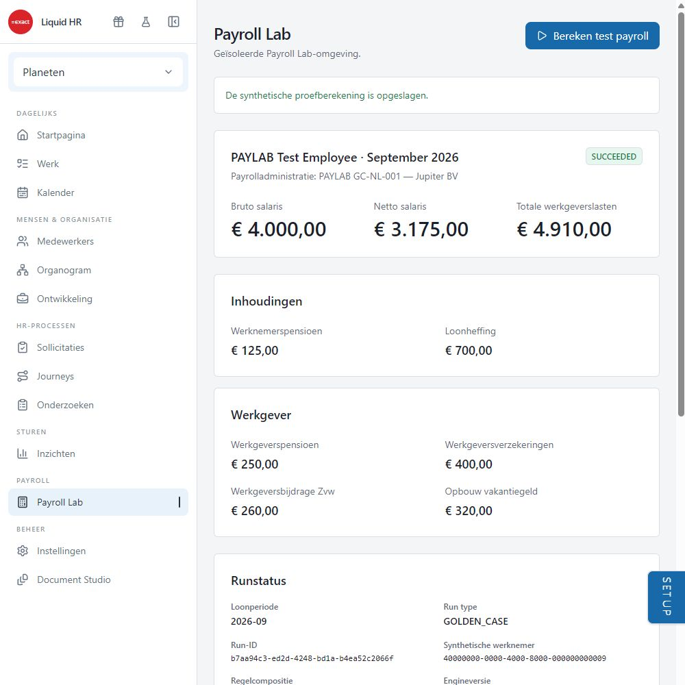
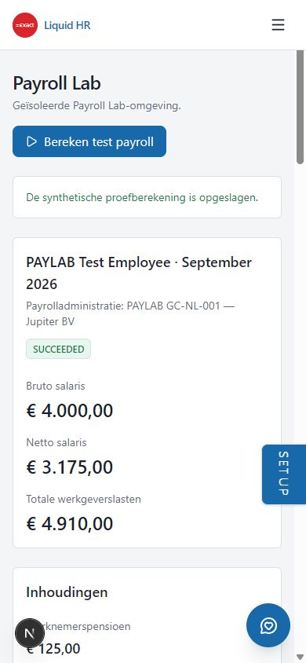

# PAYLAB02 / Payroll Engine M0 acceptance — 2026-09-30

## Result

The synthetic GC-NL-001 vertical slice is accepted in the local authenticated
browser and the separate Payroll Lab database. Existing HR Admin Test Auth was
used. No account, roles or permissions were created or changed; no OAuth login
or authentication bypass was used. The historical JWT/clock issue did not block
this run. This is synthetic M0 evidence, not acceptance of fiscal NL 2026 rules
or the live Core employment adapter.

Checkpoint before M0: `f213722` on `work/paylab00`. No push, merge or deployment.
Only the Lab project `jhgeriucbkfarxiudzfy` received test writes. The exact
three Planeten testcontext administration mappings in `enable-test-context.sql`
were applied after explicit user approval. Core scope discovery was read-only;
no Core schema, configuration, permissions or business data changed.

## Authenticated browser

Local workspace runtime: `http://localhost:3002/payroll-lab`.
Existing Test HR Admin login → existing dashboard sidebar Payroll → Payroll Lab
→ **Bereken test payroll** → engine → persistence → displayed SUCCEEDED.

| Component | Exact amount |
| --- | ---: |
| Gross salary | 4000.00 |
| Employee pension | 125.00 |
| Synthetic wage tax | 700.00 |
| Net salary | 3175.00 |
| Employer pension | 250.00 |
| Employer insurance | 400.00 |
| Employer Zvw | 260.00 |
| Holiday accrual | 320.00 |
| Total employer cost | 4910.00 |

Holiday accrual is separate, following the requested GC formula. The trace was
opened in the browser and contains component outputs, ownership/version,
rounding, definitions and calculation steps. Seven controls display PASS.
At a 390 × 844 viewport, document width and scroll width both equal 390;
net and employer-cost amounts remain rendered. The viewport was reset.

## Persistence readback and repeatability

Browser runs `adc49957-55bd-40e3-82ce-2a9166988009` and
`b7aa94c3-ed2d-4248-bd1a-b4ea52c2066f` both persisted SUCCEEDED, with nine
component results, one immutable trace and seven passing controls per run.
Both have identical hashes:

- source: `d751c32f1e54b6bbed64eec7314340b6c7a247a79e5a2792144068c19ce87854`
- input: `c4b2f80531185f60f03135b793f716635b01db49e394452cc8556448800c8088`
- result: `dd10e395497a290183038cc48434e1a78f5f293980d039a760463a16b9c01afe`

An opt-in dedicated synthetic-scope integration test also executed real Lab
writes and repeatability assertions successfully. Two earlier development runs
preceded the result-hash correction and remain immutable historical evidence;
their differing hashes are not used as final acceptance. Generated snapshot
IDs and timestamps are now excluded from result-hash content.

## Contract and fixes

SYSTEM, detached CUSTOMER_FORK with provenance and CUSTOMER_CUSTOM share a
typed, effective-dated runtime contract. Customer configuration cannot modify
SYSTEM or assume system identity. Appending a version preserves every previous
definition and requires an already closed, nonoverlapping previous interval.
Expressions use a bounded typed AST with arithmetic, comparisons, logic,
IF/MIN/MAX/ROUND/ABS, values, percentages, inputs, output references and
parameters. No free code, eval, loops, database or API calls are available.

The first browser calculation failed before run insertion because Zod RFC UUID
validation rejected existing opaque Core IDs. Source schemas now use the same
UUID-shape contract as PayrollScope and reject malformed IDs. Regression tests
cover non-RFC version/variant values. No source IDs were changed.

The Lab client accepts only the verified HTTPS Lab host. Existing dashboard
primitives, layout, i18n and authorization patterns are reused. No stylesheet,
UI framework, designer or separate app shell was introduced.

## Remaining scope

PAYLAB01 live Core-to-snapshot acceptance remains unexecuted in this slice.
IncomeRelationship/CONTROL02 and fiscal source gaps remain explicit. Writes
are sequential: a failure before run insertion can leave append-only snapshot
or input-set records. After run creation failures transition to FAILED; traces
remain immutable. Atomic orchestration/retention is later hardening, not part
of this synthetic acceptance.

## Final local verification

- App Payroll/source/UI/sidebar selection: 17 files passed, 90 tests passed;
  opt-in live test skipped in this ordinary batch.
- Engine M0: one file, 10 tests passed; engine package type-check passed.
- Opt-in real Lab integration: one test passed, including two persisted runs
  and identical hashes. This was executed separately, not inferred from mocks.
- Whole hr-suite TypeScript check and production webpack build passed.
- Changed-area ESLint and NL/EN i18n consistency passed.
- Production client boundary scan: 628 browser assets clean, including a
  negative control and exact configured Payroll secret-value detection.
- Authenticated browser calculation, repeat calculation, trace expansion,
  persistence SQL readback and 390 px responsive check passed.
- `git diff --check` passed. Generated `next-env.d.ts` drift is left unstaged.

The local dev server was restarted on localhost:3002 after build verification;
the existing unrelated local servers were not stopped.
