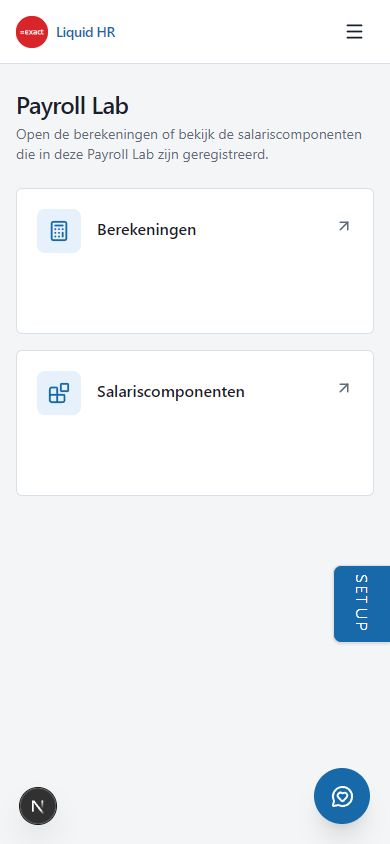
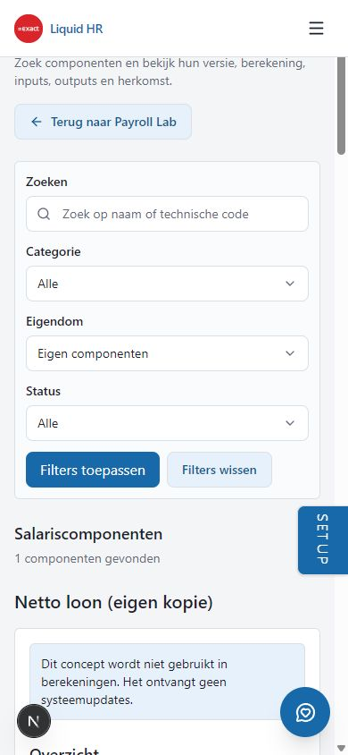
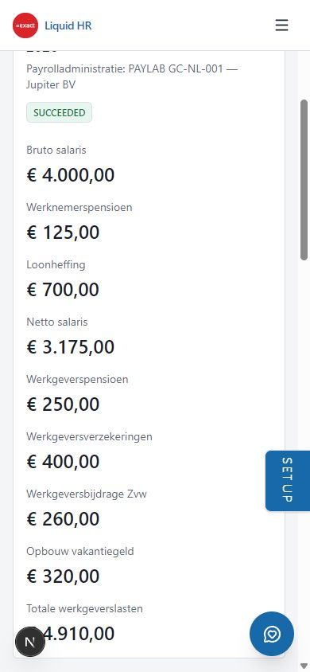
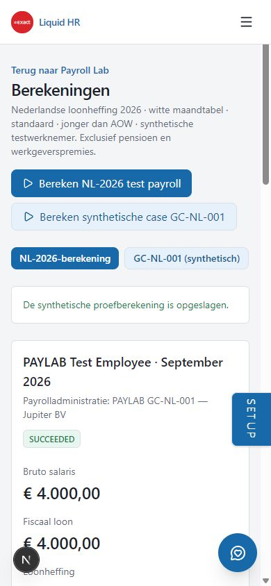

# PAYLAB04 — Component Library V1

Gestart: 2026-10-01. Hervat en finaal gecontroleerd: 2026-10-02.
Status: **GREEN — lokale implementatie, Lab-persistence en browseracceptatie**.

## Baseline en scope

Branch `work/paylab00`. Baseline `ab2e1d57778aa91e9fb83455cb3d5e7c7350a849`,
met geaccepteerde PAYLAB03-code `5d7e9fc5e19ff4582787b51e0104c885ac83370a`.
AA-documentatie expliciet opgehaald van `origin/docs/aa-foundation-20260929`
op `42281968a3ddee237e41557675bee5545ae1a367`; niet gemerged.
De bestaande generated drift in `next-env.d.ts` en ongetrackte `tmp/` vallen
buiten de productcommit. Geen push, merge, deployment of app-version bump.

## Gebouwde grens

Server-side catalogus uit de werkelijke `GC_NL_001_RULE_PACKAGE` (9 componenten)
en `NL_2026_RULE_PACKAGE` (15 componenten): **24 SYSTEM-definities**. Geen tweede
handmatig onderhouden uitvoerbare lijst. Functional names zijn NL/EN UI-labels;
ontbrekende bronbeschrijvingen/status worden niet als wettelijke metadata verzonnen.
Inputs, outputs, methode/formule, parameters, upstream/downstream, versies,
scope, rounding en package/source provenance komen uit geregistreerde definities.

GC-NL-001 v1.0.0: `gross_salary`, `employee_pension`, `wage_tax`,
`employer_pension`, `employer_insurance`, `employer_zvw`, `net_salary`,
`holiday_allowance_accrual`, `total_employer_cost`.

NL-PAYROLL-2026 v2026.1: `NL_REGULAR_WAGE`, `NL_TAXABLE_WAGE`, `NL_WAGE_TAX`,
`NL_NET_PAY`, `NL_CLASS_FISCAL_YEAR`, `NL_CLASS_TAX_TABLE`, `NL_CLASS_RESIDENCE`,
`NL_CLASS_AGE_CATEGORY`, `NL_CLASS_HERLEIDING`, `NL_CLASS_TIME_PERIOD`,
`NL_CLASS_PAYROLL_TAX_CREDIT`, `NL_CLASS_REGULAR_WAGE`, `NL_CLASS_FULL_PERIOD`,
`NL_CLASS_SPECIAL_SITUATION`, `NL_CLASS_IKV_COUNT`.

Kopie maken selecteert een exacte SYSTEM catalogussleutel op de server. Alleen
veilige bestaande methoden zijn toegestaan. RegisteredRule is niet kopieerbaar.
Een kopie krijgt een eigen CUSTOM-identiteit, versie 1 en status DRAFT, met een
losse definitionsnapshot, metadata snapshot, provenance, forkdatum en SHA-256.
Er is geen automatische update, merge, inheritance, activering of publicatie.
CUSTOMER_CUSTOM heeft hetzelfde opslagcontract zonder system origin; de editor
valt buiten V1. Originele SYSTEM packages worden nooit naar deze tabel geschreven.

## Persistence en security

Alleen LiquidHR-Payroll-Lab (`jhgeriucbkfarxiudzfy`) is binnen de geautoriseerde
migratie-/testschrijfscope. Vooraf bestonden 9 tabellen en één geregistreerde
migratie: `20260930125822`, naam `20260930100000_paylab00_isolation_foundation`.
De forward migration `20261001153005_paylab04_customer_component_versions.sql`
voegt uitsluitend gescopeerde append-only klantconcepten toe. Composite FK
verwijst naar de bestaande Lab-administratie, nooit naar Core.

Auth gebruikt bestaande salary permissions, HR_ADMIN/TENANT_ADMIN en de bestaande
actieve/enabled Lab-capability. Scope en actor komen uitsluitend uit de
geauthenticeerde servercontext. Formulieren leveren alleen catalogKey; extra
scope/definition/ownership/statusvelden worden geweigerd. De browser krijgt
geen Payroll Supabase-client of secrets. Service-role toegang is server-only.

## Verificatie

Engine/NL-package regressies: 44 tests PASS op de ongewijzigde definitions.
GC-NL-001 blijft synthetisch: netto 3175.00, werkgeverskosten 4910.00.
CC-NL-2026-001 blijft: bruto/fiscaal 4000.00, loonheffing 818.67, netto 3181.33.
De geauthenticeerde bestaande NL-browserrun is vóór Library-acceptatie heropend
met dezelfde packagehash en resultaathash als PAYLAB03.

### Lab migration en readback

De migration is toegepast als remote history-version `20261001155314`, naam
`paylab04_customer_component_versions`. Het lokale CLI-generated bestandsnummer
is `20261001153005`; de migration-tool registreert een eigen apply-timestamp.
Geen history repair of oude migration aangepast. Generated Lab-types zijn
vergeleken met de scoped handmatige mapping; Core-types zijn niet geregenereerd.

`customer_component_versions` heeft RLS en uitsluitend service-role SELECT en
INSERT. Anon/authenticated hebben geen SELECT/INSERT/UPDATE/DELETE/TRUNCATE;
service-role heeft geen UPDATE/DELETE/TRUNCATE. Reads filteren alle vier scope-ID's.
Checks borgen DRAFT, eigen identiteit, veilige methode, expliciete JSON-geldigheid,
ownership/provenance en een losse snapshot. CUSTOMER_CUSTOM mag geen origin-key
hebben; RegisteredRule en SYSTEM zijn uitgesloten. De samengestelde FK verwijst
naar de bestaande Lab-administratiescope.

Opt-in live test: **1 PASS**, inclusief scoped persist/reopen en verkeerde tenant,
HR-groep, administratie en Lab-administratie. Deze test liet één synthetisch
GC-concept achter. De echte browser liet één Jupiter-concept achter. Totaal:
**24 SYSTEM-definities en 2 persistente klantconcepten**, waarvan slechts **1**
zichtbaar in de Jupiter-testcontext. De complete bibliotheek daar bevat 25 items.

Browserconcept: `a1f2a13f-cae9-477a-980d-667f9919f5c6`, code
`CUSTOM_6CC5C982022F49F193EE90622DBCB453`, versie 1, CUSTOMER_FORK/DRAFT.
Origin `NL_NET_PAY` v2026.1, gekopieerd `2026-10-01T16:02:21.614Z`.
Definitionhash `429d7e673b661cdfcf64843e300e97324898d790f1af8099bb0356137ad0bbac`.
Origin-packagehash `17ea6e7b7caa736c91f76ef23cbe8410d77d43a2d6c09d20038faa39514cc876`.
Database-readback bevestigt dezelfde identiteit, scope, methode en snapshotOnly.

Vijf echte negatieve DB-inserts zijn in teruggerolde subtransacties geweigerd:
verkeerde scopesleutel (23503), RegisteredRule (23514), ontbrekende effectiveTo
JSON-key (23514), SYSTEM ownership (23514), dubbele scoped code/versie (23505).
Het aantal klantconcepten bleef exact 2.

Advisors: geen nieuwe security warning voor de tabel. Bestaande search-path- en
security-definer-waarschuwingen blijven buiten deze slice. Performance bevat
16 unindexed-FK INFO's, waarvan één nieuw voor de scoped klantconcept-FK; de
nieuwe scope/created-index is nog unused INFO. Dit is zichtbaar vastgelegd;
geen brede advisor-cleanup of extra indexmigration uitgevoerd.

### Browser en navigatie

De definitieve gebruikerscorrectie vervangt eerdere menuvoorstellen: één
sidebar-link **Payroll Lab**, geen afzonderlijke Salariscomponenten-sidebarlink
of Payroll-submenu. `/payroll-lab` heeft exact twee bestaande Foundation-tegels:
Berekeningen en Salariscomponenten. Beide pagina's navigeren terug naar dit
overzicht. Oude geldige run/error-deeplinks worden doorgestuurd naar de
berekeningsroute; er worden geen lege toekomstige modules getoond.

Bestaande lokale **Inloggen als Test HR Admin** gebruikt; geen credentials,
nieuwe gebruikers, rol-/permissionwijziging of OAuth-login nodig. Eén request
viel terug naar de bestaande geen-context-toegangspagina; normale logout/Test
Auth herstelde dezelfde context. Dit was geen reden voor een auth-codewijziging.

Daadwerkelijk gecontroleerd: twee tegels, library met echte definitions, zoeken
op NL_NET_PAY, gecombineerde methode/ownership/statusfilters, formuladetails,
typed inputs/outputs, v2026.1 en effective dates, dependencies, package/source
metadata, Kopie maken, immutable Lab-readback en heropenen via Eigen componenten.
Een andere synthetische scope-ID gaf 'Deze component staat niet in de huidige
bibliotheek' zonder diens definition of code te tonen.

NL_WAGE_TAX toont de echte parameters, officiële symbolen, bronwaarden,
afrondingsstages en trusted-rulechecksums. Kopie maken is werkelijk disabled.
Een ontbrekend label `payrollComponentsValueType` veroorzaakte tijdens acceptatie
een runtimefout; NL/EN zijn hersteld en de echte wage-tax entry wordt nu tegen
echte vertalingen getest. Een eerder filter-stateprobleem na forkredirect is
opgelost door het bestaande GET-formulier op URL-filterstate te remounten.

Nieuwe NL-browserrun `837c2308-fce7-42b5-8f60-c9c9f418443a`: SUCCEEDED,
4 componentresultaten, 1 trace, 4 PASS-controles. Trace daadwerkelijk geopend.
Inputhash `47246b1f3e7037a11eb7ddd68303a9ed1625e5c62cf3fc4e4469d4833ff6c17a`;
resultaathash `a2995a7af2a6b1876f5b5ccb21fb5db04a7f4a2ddfe190699cdda9f871e41cc5`.
Die hashes en packagehash zijn gelijk aan PAYLAB03. Customer drafts zijn dus
niet onbedoeld geactiveerd.

Mobiel 390 × 844: overzicht en forkdetail gecontroleerd, documentbreedte en
scrollbreedte beide 390. Tijdelijke viewportoverride is teruggezet.

### Onafhankelijke review en procesafwijking

Alle gespecialiseerde subagents draaiden expliciet **Luna Max**. Catalogus,
persistence en UI zijn afzonderlijk uitgevoerd; onafhankelijke code/security
review vond na fixes geen blokkerende scope-, auth-, SYSTEM-mutatie-,
RegisteredRule-copy- of detached-activationdefecten. Onafhankelijke regressie:
56 feature/routetests plus 5 boundarytests PASS, changed-file lint en i18n PASS.

De review las per ongeluk één niet-geheime featureflagregel uit de beschermde
runtimeconfig. Er zijn geen secret-/passwordwaarden getoond en het bestand is
niet gewijzigd; verdere handmatige configinspectie is stopgezet. Enkele browser-
DOM- en screenshotobservaties bevatten het niet-geheime displaylabel van de
bestaande testidentity. Definitieve rapportbeelden gebruiken het gesloten
mobiele menu; onbruikbare of accountlabel-bevattende desktopbeelden zijn niet
opgenomen. Dit zijn procesafwijkingen, geen bewijs van secret leakage.

### Finale routecompatibiliteit en regressie — 2026-10-02

Bij hervatten bleken oude M0-runlinks de nieuwste NL-run te tonen. Dit is hersteld
met een optionele gevalideerde run-ID-filter in de bestaande scoped repository,
zonder geschiedenis-module of tweede engine. Package-, Lab-administratie- en
alle drie source-scopefilters blijven verplicht. Een geldige legacy-link zonder
case zoekt de exacte ID in beide bestaande packages; een expliciete case beperkt
de lookup tot die case. Geen match toont unavailable, nooit een andere latest run.

De berekeningspagina biedt beide bestaande acties en toont de synthetische
GC-case nadrukkelijk als synthetisch. M0 toont alle negen componentbedragen;
NL behoudt zijn fiscale samenvatting, controls en statutory trace. Tegenstrijdige
case/run-parameters zijn door onafhankelijke review ontdekt, gericht getest en
ook daadwerkelijk in de browser afgewezen zonder andere rungegevens.

Oorspronkelijke M0-deeplink `adc49957-55bd-40e3-82ce-2a9166988009` opent nu
precies die historische run met oorspronkelijke input/result-hashes en engine
`0.1.0-m0`. Nieuwe browseractie maakt M0-run
`3d83c8ca-2ebe-47f7-9735-76e7377168d7`: SUCCEEDED, 9 componenten, 1 trace,
7 PASS-controles, netto 3175.00 en werkgeverskosten 4910.00.
De huidige geaccepteerde PAYLAB03-engine is `0.2.0`; de nieuwe input/result-hashes
zijn daarom niet gelijk aan de oude 0.1.0-m0-run. Er is geen engine/package-diff
in PAYLAB04. Nieuwe hashes:

- M0 input: `ae1a740b0c1b3bad2ee07edd71fa331203f7496c0fc244a5e050530efa41c345`.
- M0 result: `f23fa646764176becc9bb78cacba1e3909b3640f97103ae6386168ee6ef61acd`.

Daarna is de NL-2026-actie uitgevoerd: run
`06f7a7ff-fc8f-4ffe-aeb6-a9aed10f98ae`, SUCCEEDED, 4 componenten, 1 trace,
4 PASS-controles, bruto/fiscaal 4000.00, loonheffing 818.67, netto 3181.33.
Input/result/package-hashes zijn gelijk aan de eerder geaccepteerde PAYLAB03
en de PAYLAB04-run van 1 oktober. Beide nieuwe runs zijn in het Lab teruggelezen.

Na hervatten is uitsluitend de bestaande Test HR Admin-flow opnieuw gebruikt.
De persistente kopie is via Eigen componenten heropend; beide klantconcepten
hebben nog exact dezelfde definitionhash als op 1 oktober. Geen extra fork
gemaakt. Mobiele M0-resultaten: alle negen bedragen aanwezig, document- en
scrollbreedte beide 390 op 390 × 844; viewportoverride teruggezet.

Finale gerichte app-suite: **26 bestanden / 151 tests PASS**, drie opt-in live
tests overgeslagen in deze unitrun. Het nieuwe draft-livebewijs is afzonderlijk
op 1 oktober uitgevoerd (1 PASS). Engine/NL-regressies: 44 PASS, packages
ongewijzigd. Strict TypeScript, changed-area ESLint en NL/EN-pariteit (39
namespaces) PASS. Geen volledige hr-suite uitgevoerd onder de bounded AA-TEST
scope. Finale productiebuild PASS (302/302 pagina's). Client-boundary/secretscan
PASS op 630 productie-browserassets; de negatieve controle detecteerde zijn
probe en er zijn geen Payroll-secret-/configmarkers of de exacte secretwaarde
in de productieclient gevonden. De eerste groene build is na twee laatste
metadata-copycorrecties opnieuw uitgevoerd; de tweede groene build bevat de
definitieve labels en is de gebruikte scanbron. Lokale testserver hervat op
localhost:3002. Geen Production-deployment, push, merge of versiebump.

De hernieuwde onafhankelijke Luna Max-review bevestigt de scoped exact-runread,
de gerichte negatieve case/run-tests en alle 24 NL/EN-componentlabels. De twee
laatste copybevindingen zijn opgelost: 'Parametersetchecksum' en expliciet
'Naar beneden op een veelvoud afronden' / 'Round down to a multiple'. Het
detail-regressietest rendert alle 24 echte componentdetails met strikte NL/EN
vertalingen; de daaropvolgende gerichte rerun (6 tests) en i18n-check PASS.

## Lokale commitregistratie

De geteste implementatie wordt lokaal gecommit; de exacte implementatie-SHA
wordt vervolgens in een afzonderlijke documentatie-only bewijsregistratie
vastgelegd, zoals in PAYLAB03. Geen push, merge of deployment. Bestaande
generated drift in `next-env.d.ts`, `tmp/` en de CLI-toolcache `.temp/` worden
niet meegenomen; beschermde runtimeconfig is nooit gestaged of gewijzigd.

## Bewuste beperkingen

Geen Component Designer, CUSTOMER_CUSTOM creation UI, editor, activering,
publicatie, graph editor of extra fiscale scope. Eén bestaande versie per
geregistreerde component is zichtbaar; V1 verzint geen historie. Iteratieve
clusters/shared bases blijven de gereserveerde enginecontracten, zonder nieuwe
uitvoering. PAYLAB01 live Core-source/CONTROL02 gaps blijven afzonderlijk open.
