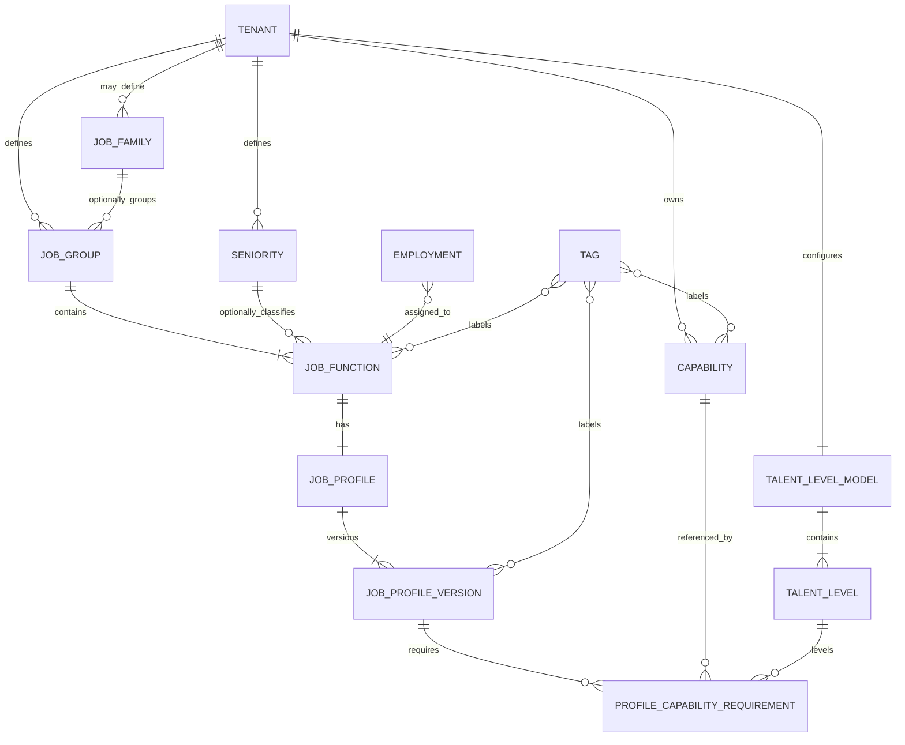

# LiquidHR Workforce & Talent Management
## Product Blueprint v2.0

**Auteur:** Edwin Dingjan  
**E-mail:** edwin@editsolutions.nl  
**Datum:** 31 juli 2026  
**Documentstatus:** Definitieve productbaseline voor implementatie  
**Classificatie:** Confidential — Product Design  
**Copyright:** © 2026 Edwin Dingjan. Alle rechten voorbehouden.

---

## Documentdoel

Dit document beschrijft de productvisie, functionele architectuur, domeinregels, gebruikerservaring, rollen, validaties, gegevensstructuur, beveiligingsuitgangspunten en acceptatiecriteria voor **LiquidHR Workforce & Talent Management**.

Het document is de **single source of truth** voor:

- productmanagement;
- UX- en interaction design;
- softwarearchitectuur;
- implementatie door ontwikkelaars en AI-agents zoals Codex;
- testontwerp en acceptatie;
- toekomstige uitbreidingen van LiquidHR.

De Product Blueprint bevat definitieve productbeslissingen. Een implementerende partij mag technische keuzes maken binnen de bestaande architectuur van LiquidHR, maar mag geen productgedrag verzinnen, versimpelen of uitbreiden zonder expliciete wijziging van deze Blueprint.

---

## Documenthiërarchie en voorrang

Bij inconsistenties geldt de volgende volgorde:

1. **Product Blueprint v2.0**;
2. genummerde business rules en functionele requirements in dit document;
3. afzonderlijk Acceptance Test Pack;
4. AI Architecture Instructions;
5. Codex Implementation Plan en Prompt Library;
6. UI-reference mockups UI-001 tot en met UI-013;
7. technische implementatiedetails.

De tekstuele beschrijving is leidend. De mockups zijn uitsluitend ondersteunend.

---

## Status van de UI-reference mockups

De meegeleverde mockups zijn conceptuele referenties voor de gewenste gebruikerservaring. Ze illustreren onder meer navigatie, informatiehiërarchie, componentpatronen en visuele richting. Ze zijn nadrukkelijk:

- geen pixel-perfect ontwerp;
- geen definitieve Figma-specificatie;
- geen bron voor business rules;
- geen volledige weergave van alle toestanden en uitzonderingen;
- geen toestemming om fictieve data, acties of modules te implementeren die niet in deze Blueprint zijn opgenomen.

Wanneer een mockup afwijkt van dit document, wint dit document altijd. Ontwerpdetails mogen tijdens de implementatie worden aangepast wanneer dit de toegankelijkheid, consistentie of bruikbaarheid binnen het bestaande LiquidHR Design System verbetert, zolang de productregels ongewijzigd blijven.

---

# Deel I — Productfundament

## 1. Executive summary

LiquidHR Workforce & Talent Management levert een krachtig Talent Foundation-platform voor kleine en middelgrote organisaties zonder de gebruikelijke enterprise-complexiteit. Het product combineert een beheersbaar functiehuis, versieerbare functieprofielen, een centrale capabilitybibliotheek en een consistente niveausystematiek met drie duidelijke gebruikscontexten:

- **Instellingen:** HR Admin configureert de Talent Foundation;
- **Workforce:** HR Admin en managers gebruiken de geconfigureerde informatie in operationele HR-processen;
- **Medewerkerdashboard:** medewerkers raadplegen uitsluitend hun eigen relevante talentinformatie.

De kernwaarde voor het MKB is dat functionaliteit die normaal gesproken alleen beschikbaar is in omvangrijke, dure Talent Management Suites als geïntegreerd onderdeel van LiquidHR beschikbaar komt, zonder langdurig consultancytraject en zonder overmatige configuratielast.

De eerste implementatiefase richt zich bewust op een betrouwbaar fundament. Er zijn in fase 1 geen AI-functies, beoordelingen, goedkeuringsworkflows, imports, profielvergelijkingen, skills matrices, succession-processen of 9-grid analyses. Deze onderdelen kunnen later veilig worden toegevoegd omdat de onderliggende domeinstructuur vanaf het begin correct en uitbreidbaar is.

### 1.1 Centrale ontwerpkeuze

> **Configureren gebeurt uitsluitend onder Instellingen. Operationeel gebruik gebeurt uitsluitend onder Workforce. Medewerkers consumeren uitsluitend hun eigen informatie via het medewerkerdashboard.**

Deze scheiding is de belangrijkste informatiearchitectuurregel van het product.

### 1.2 Centraal bedrijfsobject

Het **functieprofiel** is het centrale bedrijfsobject. Een functieprofiel legt vast welke doelstelling, verantwoordelijkheden, taken, resultaatgebieden en capabilities bij een functie horen. Functieprofielen zijn datumgebonden versieerbaar. Hierdoor kan LiquidHR altijd bepalen welke verwachtingen op een bepaalde datum van toepassing waren.

### 1.3 Eenvoudige, flexibele structuur

De minimaal vereiste structuur is:

```text
Functiegroep
    └── Functie
            ├── Senioriteit (optioneel)
            └── Functieprofiel met datumversies
```

Een functiefamilie is een optionele extra groeperingslaag voor organisaties die daar behoefte aan hebben. Een organisatie kan LiquidHR volledig gebruiken zonder functiefamilies te configureren.

---

## 2. Productvisie

LiquidHR maakt professioneel talentbeheer toegankelijk voor organisaties die geen afzonderlijke enterprise Talent Suite willen implementeren. Het product moet tegelijk:

- eenvoudig genoeg zijn voor een HR-verantwoordelijke in een organisatie met beperkte beheercapaciteit;
- degelijk genoeg zijn voor organisaties die doorgroeien en meer structuur nodig krijgen;
- geïntegreerd zijn met bestaande medewerkers-, dienstverband- en autorisatiegegevens;
- consistente data leveren voor toekomstige modules zoals Performance, Learning, Development, Recruitment, Succession en AI;
- begrijpelijk blijven zonder uitgebreide training of consultancy.

### 2.1 Productbelofte

**Enterprise-denken met MKB-eenvoud.**

LiquidHR geeft organisaties een professioneel functie- en talentfundament dat standaard bruikbaar is, maar configureerbaar genoeg blijft om aan te sluiten op de eigen terminologie en volwassenheid.

### 2.2 Doelgroepen

De primaire gebruikersgroepen zijn:

1. **HR Admin** — beheert de inrichting en bewaakt de datakwaliteit.
2. **Manager** — raadpleegt relevante functie- en teaminformatie binnen de toegestane scope.
3. **Medewerker** — raadpleegt de eigen functie en de verwachtingen die daarbij horen.

De primaire klantdoelgroep bestaat uit kleine en middelgrote organisaties. De oplossing mag grotere organisaties ondersteunen, maar ontwerpkeuzes worden niet gedreven door uitzonderlijke enterprise-processen wanneer die de basiservaring onnodig complex maken.

### 2.3 Succescriteria

Het product is succesvol wanneer een organisatie:

- zonder consultancy een basisfunctiehuis kan inrichten;
- binnen korte tijd functies en profielen kan configureren;
- één consistente bibliotheek voor competenties, skills, kennis, talen en certificaten kan onderhouden;
- zonder dubbele administratie medewerkers aan de juiste actieve functie en profielversie kan relateren;
- historisch kan reconstrueren welk profiel geldig was;
- managers en medewerkers relevante informatie kan laten raadplegen zonder configuratierechten te geven;
- toekomstige Talent-modules kan activeren zonder het fundament opnieuw te ontwerpen.

---

## 3. Kernontwerpprincipes

### P-001 — Configuration over customization

LiquidHR biedt configureerbare stamgegevens en modellen. Klantspecifieke code of afzonderlijke productvarianten worden vermeden.

### P-002 — Simplicity before complexity

De eenvoudigste geldige workflow heeft voorrang. Enterprise-workflows worden pas toegevoegd wanneer zij aantoonbare waarde leveren voor de doelgroep.

### P-003 — Settings configure, Workforce uses

Configuratie en operationele processen worden nooit door elkaar geplaatst.

### P-004 — Employees consume, not configure

Medewerkers kunnen in fase 1 uitsluitend hun eigen Talent-informatie raadplegen.

### P-005 — One source of truth

Functies, profielen en capabilities worden één keer beheerd en daarna hergebruikt.

### P-006 — Capability-driven foundation

Competenties, skills, kennis, talen en certificaten gebruiken intern één generiek capabilitymodel, terwijl de interface de begrippen afzonderlijk en herkenbaar presenteert.

### P-007 — Function Profile is central

Verwachtingen worden primair aan een functieprofiel gekoppeld, niet rechtstreeks aan losse medewerkers.

### P-008 — Date-effective history

Veranderingen in functieprofielen worden vastgelegd als opvolgende geldigheidsperioden. Historische data wordt niet overschreven.

### P-009 — AI augments, never owns

AI kan later voorstellen en analyses leveren, maar de gestructureerde data en menselijke verantwoordelijkheid blijven leidend.

### P-010 — Real data only

Dashboards tonen uitsluitend werkelijk aanwezige, autoriseerbare gegevens. Geen fictieve percentages, voorbeeldmedewerkers of betekenisloze KPI’s.

---

## 4. Productscope en fasering

### 4.1 Fase 1 — Talent Foundation

Fase 1 bevat:

- Talent-configuratie onder Instellingen;
- centrale capabilitybibliotheek;
- categorieën en integratie met bestaande Cloud Tags;
- één tenantbreed Talent Level Model;
- configureerbare senioriteiten;
- functiegroepen;
- optionele functiefamilies;
- functies;
- functieprofielen met datumversies;
- statussen Draft, Active en Inactive;
- directe HR Admin-bewerking zonder goedkeuring;
- historische raadpleging en audit;
- Talent-ingang onder Workforce;
- read-only functieprofielraadpleging voor managers binnen hun scope;
- beperkte read-only Mijn Talent-weergave voor medewerkers;
- dashboards met uitsluitend echte configuratiegegevens;
- zoek-, filter-, lege-, laad- en fouttoestanden;
- tenantisolatie en role-based access control.

### 4.2 Fase 2 — Operational Talent

Fase 2 kan bevatten:

- persoonlijke capabilityregistraties;
- HR-beheerde medewerkerkwalificaties;
- zelfbeoordeling en managerbeoordeling;
- Team Talent;
- Skills Matrix;
- profiel- en medewerkersvergelijking binnen een functiegroep;
- import en gecontroleerde bulkmutaties;
- templates;
- notificaties;
- ontwikkeldoelen en POP;
- uitgebreidere rapportage en export.

### 4.3 Toekomstige fasen

Mogelijke toekomstige modules:

- Performance en gesprekscyclus;
- Learning/LMS-integratie;
- carrièrepaden;
- succession planning;
- 9-grid;
- workforce planning;
- recruitment-koppelingen;
- AI Talent Advisor;
- AI-ondersteunde profielgeneratie;
- gap analysis en gepersonaliseerde ontwikkeladviezen.

### 4.4 Expliciet buiten fase 1

De volgende onderdelen mogen niet ongemerkt in fase 1 worden geïmplementeerd:

- AI-knoppen of generatieve AI-functionaliteit;
- approval-, review- of publish-workflows;
- self assessment, manager assessment of scores;
- persoonlijke matchpercentages;
- importfunctionaliteit;
- profielvergelijking;
- Team Talent analytics;
- Skills Matrix;
- succession planning;
- 9-grid;
- learning management;
- automatische carrièreadviezen;
- conceptuele dashboardscores zonder definieerbare databron;
- fictieve demo-inhoud in productieomgevingen.

---

# Deel II — Positionering in LiquidHR

## 5. Applicatie-integratie

LiquidHR Talent is geen losstaande applicatie. Het is een domein binnen de bestaande LiquidHR-ervaring en gebruikt bestaande gegevens en platformservices waar mogelijk.

### 5.1 Drie gebruikscontexten

```text
INSTELLINGEN
Configure
    ↓
WORKFORCE
Use
    ↓
MEDEWERKERDASHBOARD
Consume
```

#### Instellingen

Doel: inrichting en onderhoud door HR Admin.

Bevat onder meer:

- bibliotheek;
- niveaumodel;
- senioriteit;
- functiegroepen en optionele functiefamilies;
- functies;
- functieprofielen;
- categorieën;
- relevante kwaliteits- en auditinformatie.

#### Workforce

Doel: operationele raadpleging en toekomstige HR-processen door HR Admin en managers.

Fase 1 bevat ten minste:

- toegang tot Talent-overzicht;
- functieprofielen raadplegen;
- navigatie naar medewerker- en teamcontext voor zover geautoriseerd.

Niet-actieve toekomstige modules worden alleen als “Binnenkort” weergegeven wanneer dit aansluit op de generieke LiquidHR-modulecommunicatie. Een disabled tegel mag geen schijnfunctionaliteit suggereren.

#### Medewerkerdashboard

Doel: persoonlijke, read-only consumptie.

Fase 1 toont:

- de actuele functie;
- de gekoppelde senioriteit indien aanwezig;
- de actuele functieprofielversie;
- doel, verantwoordelijkheden, taken en vereiste capabilities uit het functieprofiel;
- relevante historische of aanvullende data uitsluitend wanneer hiervoor een gevalideerde bron bestaat.

Persoonlijke proficiencyscores, ontwikkelreizen en matchpercentages vallen buiten fase 1.

### 5.2 Integratie met medewerkers en dienstverbanden

De Talent-module introduceert geen tweede medewerkersadministratie. De relatie tussen medewerker en functie komt uit het bestaande arbeids-/dienstverbanddomein.

- Een actief dienstverband kan naar één actuele functie verwijzen conform de bestaande HR-logica.
- Talent leest deze relatie en bepaalt op basis daarvan het actuele functieprofiel.
- Wijziging van de functie van een medewerker gebeurt in de bestaande HR-medewerker- of dienstverbandworkflow, niet in Talent Settings.
- Historische functietoewijzingen blijven eigendom van het bestaande HR-domein.

### 5.3 Integratie met Cloud Tags

LiquidHR gebruikt het bestaande generieke tagsysteem. Talent maakt geen afzonderlijke tag-engine.

Tags kunnen, afhankelijk van bestaande platformmogelijkheden, worden gekoppeld aan:

- capabilities;
- functies;
- functiegroepen;
- functieprofielen;
- categorieën;
- toekomstige learning- of recruitmentobjecten.

De autorisatie, validatie en lifecycle van tags blijven generiek platformgedrag.

---

## 6. Navigatiearchitectuur

### 6.1 Hoofdnavigatie

Talent wordt niet als één monolithische beheermodule in de globale navigatie geplaatst. De ingang hangt af van de taak:

- **Instellingen → Talent** voor configuratie;
- **Workforce → Talent** voor operationeel gebruik;
- **Medewerkerdashboard → Mijn Talent** voor persoonlijke raadpleging.

### 6.2 Talent-configuratie

Aanbevolen structuur:

```text
Instellingen
└── Talent
    ├── Overzicht
    ├── Bibliotheek
    │   ├── Competenties
    │   ├── Skills
    │   ├── Kennis
    │   ├── Talen
    │   └── Certificaten
    ├── Categorieën
    ├── Niveaumodel
    ├── Senioriteit
    └── Functiehuis
        ├── Functiefamilies (optioneel)
        ├── Functiegroepen
        ├── Functies
        └── Functieprofielen
```

De interface mag onderdelen als kaarten, tabs of een explorer presenteren. De conceptuele structuur blijft gelijk.

### 6.3 Bibliotheek als container

Competenties, Skills, Kennis, Talen en Certificaten zijn herkenbare UI-concepten, maar vormen samen de Talentbibliotheek. Ze hoeven niet alle vijf als globaal hoofdmenu-item te worden getoond. Dit voorkomt een te brede navigatie en ondersteunt het interne capabilitymodel.

### 6.4 Breadcrumbs

Detail- en bewerkschermen tonen een breadcrumb die de functionele locatie weergeeft, bijvoorbeeld:

```text
Instellingen > Talent > Functiehuis > Functieprofielen > HR Adviseur
```

Een breadcrumb mag niet uitsluitend de technische route of databasehiërarchie tonen.

---

# Deel III — Rollen en autorisatie

## 7. Rollenmodel

Fase 1 gebruikt drie productrollen. Bestaande LiquidHR-platformrollen kunnen hier technisch aan worden gekoppeld.

### 7.1 HR Admin

HR Admin mag:

- alle Talent-configuratie bekijken;
- stamgegevens aanmaken en wijzigen;
- objecten activeren en inactiveren;
- functieprofielversies aanmaken en activeren;
- historische versies bekijken;
- auditinformatie bekijken;
- alle actieve functieprofielen raadplegen;
- kwaliteitsmeldingen oplossen.

HR Admin heeft geen approval-flow nodig. Opslaan en activeren zijn directe handelingen, onderworpen aan validaties en audit.

### 7.2 Manager

Manager mag in fase 1:

- actieve functieprofielen raadplegen;
- functie-informatie bekijken voor medewerkers binnen de bestaande managementscope;
- uitsluitend data bekijken waarvoor de bestaande managerautorisatie toegang geeft.

Manager mag niet:

- Talent-configuratie wijzigen;
- functieprofielen activeren of inactiveren;
- niveaumodellen, senioriteiten of capabilities beheren;
- beoordelingen of scores vastleggen in fase 1.

### 7.3 Medewerker

Medewerker mag in fase 1:

- uitsluitend de eigen actuele Talent-informatie bekijken;
- het eigen geldige functieprofiel raadplegen;
- vereisten en beschrijvingen lezen.

Medewerker mag niet:

- configuratie openen;
- informatie van andere medewerkers bekijken;
- eigen scores, skills of competenties wijzigen;
- goedkeuringen of beoordelingen uitvoeren.

### 7.4 Autorisatiematrix

| Functionaliteit | HR Admin | Manager | Medewerker |
|---|---:|---:|---:|
| Talent Settings openen | Volledig | Geen | Geen |
| Capabilitybibliotheek beheren | Volledig | Geen | Geen |
| Niveaumodel beheren | Volledig | Geen | Geen |
| Senioriteit beheren | Volledig | Geen | Geen |
| Functiehuis beheren | Volledig | Geen | Geen |
| Functieprofielversies beheren | Volledig | Geen | Geen |
| Actieve profielen raadplegen | Alle | Binnen scope | Eigen functie |
| Historische profielversies bekijken | Alle | Indien functioneel nodig en geautoriseerd | Geen in fase 1 |
| Persoonlijke assessmentdata | Niet in fase 1 | Niet in fase 1 | Niet in fase 1 |
| Auditlog bekijken | Volledig | Geen | Geen |

---

# Deel IV — Domeinmodel

## 8. Conceptueel domeinmodel



### 8.1 Verplichte kernrelaties

- Een tenant heeft precies één Talent Level Model.
- Een Talent Level Model bevat één of meer geordende niveaus.
- Een functiegroep bevat één of meer functies zodra zij actief wordt gebruikt.
- Een functie behoort tot precies één functiegroep.
- Een functie kan aan nul of één senioriteit zijn gekoppeld.
- Een senioriteit kan door nul of meer functies worden gebruikt.
- Een functie heeft precies één logisch functieprofiel.
- Een functieprofiel heeft één of meer versies in de tijd.
- Een profielversie kan nul of meer capabilityvereisten bevatten.
- Een capabilityvereiste verwijst naar precies één capability.

### 8.2 Optionele functiefamilie

Een functiefamilie is een optionele groepering van functiegroepen. De afwezigheid van functiefamilies mag geen functionele beperking veroorzaken. Een organisatie die alleen functiegroepen en functies gebruikt, moet alle fase 1-functionaliteit kunnen gebruiken.

### 8.3 Tenantisolatie

Alle Talent-objecten zijn tenantgebonden, behalve generieke systeemtaxonomieën die expliciet als platformreferentie zijn gedefinieerd, zoals CEFR-codes. Ook bij systeemtaxonomieën blijven klantspecifieke relaties tenantgebonden.

### 8.4 Eigendom over tenant en administratie

De Talent Foundation is tenant-owned. Dat geldt voor functiefamilies, functiegroepen, functies, functieniveaus, senioriteiten, capabilities, categorieën, Cloud Tags-relaties en functieprofielen. Deze objecten worden niet per administratie gedupliceerd wanneer dezelfde organisatie meerdere juridische entiteiten heeft.

Een medewerker is één tenantbrede persoon. Een `Employment` blijft administratie-owned en koppelt die persoon aan de juridische werkgever en aan de tenant-owned functie. Eén persoon kan dus meerdere employments bij verschillende administraties hebben en naar dezelfde functiebron verwijzen.

De actieve administratie bepaalt de toegang tot het employment, de plaatsing, het contract, salaris, verlof en verzuim; zij bepaalt niet de eigenaar van het functiehuis. Iedere technische keuze die hiervan afwijkt vereist een expliciet architecture decision record en mag geen tweede functiecatalogus introduceren.

---

## 9. Lifecycle en algemene statusregels

### 9.1 Algemene objectstatus

Voor configureerbare stamgegevens wordt bij voorkeur gewerkt met:

- **Active** — beschikbaar voor nieuwe koppelingen en normaal gebruik;
- **Inactive** — niet beschikbaar voor nieuwe koppelingen, maar behouden voor historie.

Hard verwijderen is alleen toegestaan wanneer een object nooit is gebruikt en geen audit- of referentiebelang heeft. In alle andere gevallen wordt het object geïnactiveerd.

### 9.2 Functieprofielstatus

Functieprofielen gebruiken uitsluitend:

- **Draft**;
- **Active**;
- **Inactive**.

Er zijn geen aparte statussen voor Review, Approved of Published.

### 9.3 Direct beheer

HR Admin kan rechtstreeks wijzigen en opslaan. Elke mutatie wordt geaudit. Validaties voorkomen inconsistente activering, maar er is geen menselijke goedkeuringsstap in fase 1.

---

# Deel V — Talentbibliotheek

## 10. Generiek capabilitymodel

Intern bestaat één entiteit **Capability** met een type. De toegestane typen in fase 1 zijn:

1. Competency;
2. Skill;
3. Knowledge;
4. Language;
5. Certificate.

De gebruikersinterface presenteert deze typen als afzonderlijke bibliotheken met passende terminologie en velden.

### 10.1 Waarom één intern model

Eén intern model:

- voorkomt dubbele technische logica;
- maakt generieke zoek-, tag-, audit- en koppelpatronen mogelijk;
- vereenvoudigt toekomstige rapportage;
- ondersteunt AI en matching in latere fasen;
- laat de interface toch aansluiten op het mentale model van HR-gebruikers.

### 10.2 Gemeenschappelijke velden

Iedere capability bevat minimaal:

- unieke identifier;
- tenantidentifier;
- type;
- naam;
- korte omschrijving;
- uitgebreide omschrijving, optioneel;
- categorie, optioneel;
- status Active/Inactive;
- tags, optioneel;
- aanmaakdatum en aangemaakt door;
- wijzigingsdatum en gewijzigd door.

### 10.3 Typespecifieke velden

#### Competency

Kan bevatten:

- gedragsbeschrijving;
- gedragsindicatoren per niveau;
- coaching- of observatienotities als bibliotheekcontent;
- generiek versus vakspecifiek kenmerk.

#### Skill

Kan bevatten:

- vaardigheidscontext;
- tool-, methode- of praktische classificatie;
- observatie-indicatoren per niveau.

#### Knowledge

Kan bevatten:

- kennisgebied;
- theoretische of domeinspecifieke context;
- kennisindicatoren per niveau.

#### Language

Gebruikt geen Talent Level Model. Taalbeheersing gebruikt CEFR:

- A1;
- A2;
- B1;
- B2;
- C1;
- C2.

Een afzonderlijke aanduiding “moedertaal” kan worden gebruikt en is geen CEFR-niveau.

#### Certificate

Gebruikt geen Talent Level Model. Een certificaatdefinitie kan bevatten:

- uitgevende instantie;
- standaard geldigheidsduur;
- permanent geldig ja/nee;
- certificaatcode of externe referentie, optioneel;
- vernieuwingsvereiste, optioneel.

Persoonlijke certificaatstatussen worden in een latere fase ondersteund. De datastructuur moet minimaal ruimte laten voor Valid, Expired, Permanent en Revoked.

### 10.4 Duplicaatpreventie

Binnen dezelfde tenant en hetzelfde capabilitytype mag geen tweede actief object bestaan met dezelfde genormaliseerde naam. De gebruiker krijgt bij mogelijke duplicaten een duidelijke waarschuwing en een link naar het bestaande object.

### 10.5 Inactiveren

Een capability die in actieve profielversies wordt gebruikt, mag niet zonder impactmelding worden geïnactiveerd. Fase 1 staat inactiveren toe wanneer:

- bestaande verwijzingen behouden blijven;
- nieuwe verwijzingen worden geblokkeerd;
- de gebruiker vooraf ziet hoeveel actieve profielversies geraakt worden;
- de actie wordt geaudit.

---

## 11. Categorieën

Categorieën ondersteunen ordening en filtering. Ze zijn geen vervanging voor capabilitytypen of Cloud Tags.

### 11.1 Regels

- Een categorie behoort tot één tenant.
- Een categorie kan voor één of meer capabilitytypen beschikbaar zijn.
- Een capability kan in fase 1 maximaal één primaire categorie hebben.
- Tags kunnen aanvullend meerdere dwarsdoorsneden bieden.
- Een categorie met actieve relaties wordt geïnactiveerd in plaats van verwijderd.

---

## 12. Talent Level Model

Elke organisatie heeft precies één configureerbaar Talent Level Model voor Competencies, Skills en Knowledge.

### 12.1 Initiële configuratie

HR Admin bepaalt vóór ingebruikname:

- het aantal niveaus;
- de naam per niveau;
- de beschrijving per niveau;
- de sorteervolgorde.

Een organisatie kan bijvoorbeeld vier, vijf of tien niveaus gebruiken. LiquidHR schrijft niet voor dat iedere tenant hetzelfde aantal niveaus heeft.

### 12.2 Consistent gebruik

Hetzelfde model wordt later consistent gebruikt in onder meer:

- Competencies;
- Skills;
- Knowledge;
- functieprofielen;
- Performance;
- POP;
- Skills Matrix;
- ontwikkel- en gapanalyses.

Languages en Certificates vormen uitzonderingen en gebruiken hun eigen semantiek.

### 12.3 Vergrendeling na ingebruikname

Zodra één niveau wordt gebruikt in een actief of historisch relevant profielvereiste, wordt het model als **In Use** beschouwd. In fase 1 mogen daarna niet worden gewijzigd:

- aantal niveaus;
- namen;
- betekenisvolle beschrijvingen;
- volgorde;
- codes.

Een toekomstige migratiefunctie moet wijzigingen gecontroleerd kunnen doorvoeren. Fase 1 biedt geen handmatige workaround die historische betekenis kan veranderen.

### 12.4 Activering

Het model kent functioneel twee toestanden:

- Configurable — nog niet gebruikt;
- In Use — vergrendeld.

Er is geen tweede gelijktijdig model per tenant.

---

## 13. Senioriteit

Senioriteit is een zelfstandig tenantbreed stamgegeven dat optioneel aan een functie wordt gekoppeld.

### 13.1 Standaardset

Bij initiële inrichting levert LiquidHR de volgende bewerkbare startset:

- Junior;
- Medior;
- Senior.

Dit zijn defaults voor de tenant, geen hardcoded systeemwaarden.

### 13.2 Configureerbare velden

Een senioriteit bevat minimaal:

- naam;
- beschrijving, optioneel;
- sorteervolgorde;
- status Active/Inactive.

HR Admin kan senioriteiten toevoegen, hernoemen, herschikken en inactiveren zolang de referentieregels dit toelaten.

### 13.3 Relatie met functie

- Een functie heeft nul of één senioriteit.
- Een senioriteit kan aan meerdere functies zijn gekoppeld.
- Senioriteit is nooit verplicht.
- Senioriteit wordt niet in de functiegroepnaam opgeslagen.
- Senioriteit hoeft niet in de basisfunctienaam te worden opgenomen.
- De UI mag een samengestelde presentatienaam tonen, bijvoorbeeld “HR Adviseur — Senior”, zonder de onderliggende functienaam te wijzigen.

### 13.4 Geen koppeling met Talent Level Model

Senioriteit en capabilityniveau zijn afzonderlijke concepten. “Senior” als senioriteit betekent niet automatisch het hoogste capabilityniveau. Vereiste niveaus worden expliciet in het functieprofiel vastgelegd.

### 13.5 Inactivering

Een senioriteit die aan actieve functies is gekoppeld, kan niet stilzwijgend worden geïnactiveerd. De gebruiker moet eerst de gekoppelde functies aanpassen of een expliciete impactactie uitvoeren volgens platformrichtlijnen. Bestaande historische relaties blijven behouden.

---

# Deel VI — Functiehuis

## 14. Functiegroepen

De functiegroep is de verplichte organisatorische container voor functies.

### 14.1 Velden

Een functiegroep bevat minimaal:

- naam;
- code, optioneel;
- omschrijving, optioneel;
- optionele functiefamilie;
- status Active/Inactive;
- tags, optioneel;
- auditvelden.

### 14.2 Regels

- Een actieve functie moet tot precies één actieve functiegroep behoren.
- Een functiegroep kan zonder functies als Draft-achtige configuratietoestand worden aangemaakt, maar moet ten minste één functie bevatten voordat de groep operationeel relevant is.
- De naam moet uniek zijn binnen dezelfde functiefamilie of, wanneer geen familie wordt gebruikt, op tenantniveau.
- Een groep met actieve functies kan niet worden verwijderd.
- Verplaatsing naar een andere functiefamilie verandert geen profielhistorie.

---

## 15. Optionele functiefamilies

Functiefamilies zijn beschikbaar voor organisaties die meerdere functiegroepen op een hoger niveau willen structureren.

### 15.1 MKB-default

Een functiefamilie is nooit verplicht. Nieuwe tenants kunnen direct starten met functiegroepen en functies.

### 15.2 Regels

- Een functiefamilie bevat nul of meer functiegroepen.
- Een functiegroep behoort tot nul of één functiefamilie.
- De afwezigheid van families mag geen lege of verwarrende tussenstap in wizards veroorzaken.
- Families worden alleen zichtbaar in navigatie en filters wanneer de tenant ze gebruikt.

### 15.3 UI-012

UI-012 toont een familiegedreven boom en is alleen leidend als illustratie van een hiërarchische explorer. De implementatie moet de optionele aard van functiefamilies respecteren.

---

## 16. Functies

Een functie representeert een concrete rolvariant binnen een functiegroep.

### 16.1 Velden

Een functie bevat minimaal:

- naam;
- functiegroep;
- senioriteit, optioneel;
- code, optioneel;
- korte omschrijving, optioneel;
- status Active/Inactive;
- tags, optioneel;
- logisch functieprofiel;
- auditvelden.

### 16.2 Naam en senioriteit

De basisnaam blijft schoon. Voorbeelden:

| Functiegroep | Functienaam | Senioriteit | Presentatie |
|---|---|---|---|
| HR Advies | HR Adviseur | Junior | HR Adviseur — Junior |
| HR Advies | HR Adviseur | Medior | HR Adviseur — Medior |
| HR Advies | HR Adviseur | Senior | HR Adviseur — Senior |
| Directie | Directeur | geen | Directeur |

Er kunnen meerdere functies met dezelfde basisnaam binnen één groep bestaan wanneer de senioriteit verschilt. De unieke zakelijke combinatie is:

```text
Functiegroep + genormaliseerde functienaam + senioriteit
```

Wanneer senioriteit leeg is, mag binnen dezelfde functiegroep slechts één actieve functie met die naam en zonder senioriteit bestaan.

### 16.3 Functie wijzigen

Wijziging van naam, groep of senioriteit verandert niet automatisch historische dienstverband- of profieldata. De wijziging wordt geaudit. Een structurele herclassificatie kan impact hebben op weergave en rapportage en vereist daarom een impactmelding.

### 16.4 Inactiveren

Een functie kan worden geïnactiveerd wanneer zij niet meer voor nieuwe toewijzingen beschikbaar moet zijn. Bestaande medewerkers en historische profielen blijven raadpleegbaar. De applicatie toont hoeveel actieve dienstverbanden nog aan de functie zijn gekoppeld.

---

# Deel VII — Functieprofielen

## 17. Functieprofiel als centraal object

Elke functie heeft één logisch functieprofiel. De inhoud van dit profiel verandert via opvolgende datumversies.

### 17.1 Inhoudsgebieden

Een profielversie kan bevatten:

- titel/presentatienaam;
- profielintroductie;
- functiebeschrijving;
- doel van de functie;
- organisatorische inbedding;
- taken;
- verantwoordelijkheden;
- resultaatgebieden;
- competentievereisten;
- skillvereisten;
- kennisvereisten;
- taalvereisten;
- certificaatvereisten;
- documenten of links, voor zover ondersteund door bestaande platformservices;
- tags;
- geldigheid;
- status.

### 17.2 Profielversies

Versies worden functioneel aangeduid met geldigheidsdatums, niet primair met “v1”, “v2” of “v3”.

Voorbeeld:

```text
01-01-2026 t/m 31-05-2026
01-06-2026 t/m 31-12-2026
Vanaf 01-01-2027
```

Een intern versienummer mag voor techniek en audit worden gebruikt, maar de HR-interface presenteert de datumwerking als hoofdconcept.

### 17.3 Statussen

- **Draft:** bewerkbaar en niet operationeel geldig.
- **Active:** operationeel geldig conform de geldigheidsperiode.
- **Inactive:** bewust buiten gebruik; blijft historisch raadpleegbaar.

Er is geen goedkeuring, review of publicatieproces.

### 17.4 Nieuwe versie maken

HR Admin kan vanuit de huidige versie een nieuwe Draft-versie maken. Standaard wordt de inhoud gekopieerd. De gebruiker kiest een ingangsdatum.

Bij activering:

1. worden alle validaties uitgevoerd;
2. mag de nieuwe periode niet overlappen met een andere Active-versie;
3. wordt de vorige openstaande Active-periode automatisch afgesloten direct vóór de nieuwe ingangsdatum;
4. wordt een auditrecord aangemaakt;
5. wordt de nieuwe versie vanaf de ingangsdatum de operationeel geldige versie.

### 17.5 Toekomstige ingangsdatum

Een versie mag vooraf worden geactiveerd met een toekomstige ingangsdatum. Tot die datum blijft de huidige versie operationeel. De UI maakt duidelijk welke versie huidig en welke gepland is.

### 17.6 Historie

Historische versies zijn read-only. Correctie van een fout in historische data is een beheeractie met expliciete audit en mag geen reguliere edit van een afgesloten versie zijn.

### 17.7 Vereiste capabilities

Een capabilityvereiste bevat minimaal:

- capability;
- vereiste classificatie: Required, Important of Optional;
- vereist niveau voor Competency, Skill en Knowledge;
- CEFR-niveau voor Language, indien van toepassing;
- certificaatvereiste zonder Talent Level, indien van toepassing;
- profielspecifieke toelichting;
- sorteervolgorde.

### 17.8 Geen automatische afleiding

Senioriteit bepaalt niet automatisch de vereiste niveaus. Templates, AI of kopieerfuncties mogen later voorstellen doen, maar activering vereist expliciete profielinhoud.

### 17.9 Profielvolledigheid

Een volledigheidsindicator mag alleen worden getoond wanneer de criteria transparant en deterministisch zijn. In fase 1 bestaat de minimale validatie uit verplichte velden, niet uit een arbitraire “health score”.

---

# Deel VIII — Gebruikerservaring per context

## 18. Talent-configuratiedashboard

Het configuratiedashboard ondersteunt HR Admin bij navigatie en datakwaliteit. Het is geen BI-dashboard.

### 18.1 Toegestane informatie

- aantallen werkelijke objecten per type;
- status van het Talent Level Model;
- aantal senioriteiten;
- aantal Draft-profielversies;
- aantal functies zonder geldig actief profiel;
- aantal actieve profielversies met ongeldige of inactieve referenties;
- recente configuratiewijzigingen;
- snelkoppelingen naar veelgebruikte beheeracties.

### 18.2 Niet toegestaan

- fictieve analytics;
- willekeurig berekende health scores;
- voorbeeldmedewerkers;
- percentuele trends zonder definieerbare historische dataset;
- AI-inzichten in fase 1.

### 18.3 Lege toestand

Een nieuwe tenant ziet een begeleide startvolgorde:

1. configureer niveaumodel;
2. controleer senioriteiten;
3. voeg capabilities toe;
4. maak functiegroepen en functies;
5. maak functieprofielen actief.

Dit is begeleiding, geen verplichte wizard.

---

## 19. Workforce

Workforce is de operationele ingang. Zie UI-001.

### 19.1 Fase 1

- Talent-overzicht openen;
- actieve functieprofielen zoeken en bekijken;
- vanuit een geautoriseerde medewerkercontext het bijbehorende profiel openen;
- duidelijke aanduiding van toekomstige modules zonder actieve bediening.

### 19.2 Managerervaring

Managers zien uitsluitend gegevens binnen hun bestaande scope. De interface mag geen beheeracties tonen die vervolgens alleen een autorisatiefout geven; niet-toegestane acties worden niet gerenderd.

---

## 20. Mijn Talent

Mijn Talent is read-only en persoonsgebonden. Zie UI-007 als visuele richting.

### 20.1 Fase 1-inhoud

- actuele functie en functiegroep;
- senioriteit indien gekoppeld;
- actieve profielversie en ingangsdatum;
- functiedoel en beschrijving;
- taken, verantwoordelijkheden en resultaatgebieden;
- vereiste competencies, skills, knowledge, languages en certificates uit het functieprofiel.

### 20.2 Fase 1-beperkingen

De volgende mockup-elementen worden pas getoond wanneer een betrouwbare persoonlijke databron bestaat:

- persoonlijk behaald niveau;
- matchpercentages;
- voortgangsbalken;
- ontwikkelreis;
- persoonlijke skill-tags;
- certificaatverloop op medewerkersniveau;
- aanbevolen volgende functie.

De implementatie mag deze onderdelen niet met profielvereisten of fictieve data simuleren.

---

## 21. Team Talent

UI-008 is een toekomstgerichte referentie. Team Talent valt buiten fase 1.

De toekomstige module moet gebruikmaken van echte persoonlijke capabilitydata en expliciete definities voor match en tekort. Tot die tijd verschijnt geen teammatchpercentage of strategisch inzicht.

---

# Deel IX — Schermspecificaties

## 22. UI-001 — Workforce

**Doel:** operationele ingang voor HR Admin en managers.  
**Fase:** 1, met toekomstige disabled tegels.  
**Referentie:** `ui-references/UI-001-Workforce.png`.

### Functionele eisen

- Toont alleen modules waarvoor de tenant licentie of roadmapcommunicatie heeft.
- Actieve tegels navigeren naar functionele routes.
- Toekomstige tegels zijn herkenbaar disabled en hebben geen klikactie naar lege pagina’s.
- De pagina gebruikt bestaande LiquidHR-navigatie en zoekpatronen.
- “Functieprofielen beheren” wordt voor managers als raadplegen geformuleerd; beheer blijft onder Settings.

---

## 23. UI-002 — Talent Dashboard

**Doel:** configuratiegezondheid en navigatie voor HR Admin.  
**Fase:** 1.  
**Referentie:** `ui-references/UI-002-Talent-Dashboard.png`.

### Functionele eisen

- Aantallen zijn rechtstreeks herleidbaar tot tenantdata.
- Kaarten openen de bijbehorende beheercontext.
- Aandachtspunten zijn oplosbaar en verwijzen naar gefilterde resultaten.
- Recente wijzigingen komen uit auditdata.
- Snelle acties respecteren rechten en validaties.
- “Functiefamilies” wordt alleen getoond wanneer families zijn ingeschakeld of aanwezig zijn.
- De mockuptekst “configuratie-items die aandacht nodig hebben” wordt alleen getoond als de telling werkelijk groter dan nul is.

---

## 24. UI-003 — Talent Configuratie

**Doel:** centrale kaartnavigatie naar Talent Settings.  
**Fase:** 1.  
**Referentie:** `ui-references/UI-003-Talent-Configuratie.png`.

### Functionele eisen

- Bibliotheektypen zijn herkenbaar gegroepeerd.
- Functiehuisobjecten zijn herkenbaar gegroepeerd.
- Import/export en templates worden niet als actieve fase 1-functie aangeboden.
- Kaarten tonen echte tellingen of een lege configuratiestatus.
- De optionele functiefamiliekaart wordt contextueel getoond.

---

## 25. UI-004 — Competentie Detail

**Doel:** capabilitydetail voor type Competency.  
**Fase:** 1.  
**Referentie:** `ui-references/UI-004-Competentie-Detail.png`.

### Functionele eisen

- Toont algemene gegevens, niveaugebonden indicatoren en gebruik.
- Aantal actieve profielen is een echte telling.
- Gedragsindicatoren sluiten aan op het tenantbrede niveaumodel.
- Wanneer het niveaumodel is vergrendeld, kan de competentie-indicatorinhoud per bestaand niveau worden bewerkt, maar het model zelf niet.
- Analytics- en trendkaarten uit de mockup vallen buiten fase 1 tenzij er een expliciet gedefinieerde databron is.

---

## 26. UI-005 — Functiehuis Explorer

**Doel:** snel navigeren door de functiehuisstructuur en details raadplegen.  
**Fase:** 1.  
**Referentie:** `ui-references/UI-005-Functiehuis-Explorer.png`.

### Functionele eisen

- De explorer ondersteunt minimaal Functiegroep → Functie.
- Functiefamilie verschijnt alleen als optionele bovenlaag.
- Senioriteit wordt als eigenschap van de functie weergegeven, niet als verplichte boomlaag.
- Het detailpaneel toont functie, groep, senioriteit, actuele profielstatus en relaties.
- De explorer mag geen afzonderlijke “functieprofielnode” vereisen wanneer het profiel vanuit de functie kan worden geopend.
- Zoekresultaten tonen context om gelijknamige functies te onderscheiden.

---

## 27. UI-006 — Functieprofiel

**Doel:** profielinhoud bekijken en, voor HR Admin, bewerken.  
**Fase:** 1.  
**Referentie:** `ui-references/UI-006-Functieprofiel.png`.

### Functionele eisen

- Inhoud wordt verdeeld in begrijpelijke secties of tabs.
- De actuele geldigheidsperiode en status zijn altijd zichtbaar.
- HR Admin ziet Save, New Version en Activate/Inactivate waar relevant.
- Managers en medewerkers zien geen beheeracties.
- “Profielvolledigheid” wordt alleen getoond als deterministische checklist, niet als arbitraire score.
- Afbeeldingen zijn geen verplicht onderdeel van een functieprofiel.

---

## 28. UI-007 — Mijn Talent

**Doel:** medewerker raadpleegt eigen functievereisten.  
**Fase:** beperkte versie in fase 1.  
**Referentie:** `ui-references/UI-007-Mijn-Talent.png`.

### Functionele eisen

- Alleen eigen data.
- Geen edit-controls.
- Geen persoonlijke score of match in fase 1.
- Capabilities worden als functievereisten gepresenteerd.
- Bij ontbreken van een actief profiel verschijnt een duidelijke, neutrale melding en geen lege analytics.

---

## 29. UI-008 — Team Talent

**Doel:** toekomstig teamoverzicht.  
**Fase:** 2 of later.  
**Referentie:** `ui-references/UI-008-Team-Talent.png`.

De mockup is geen toestemming om matchpercentages, tekorten of aanbevelingen in fase 1 te berekenen.

---

## 30. UI-009 — Niveaumodel

**Doel:** eenmalige configuratie van het tenantbrede niveauframework.  
**Fase:** 1.  
**Referentie:** `ui-references/UI-009-Niveaumodel.png`.

### Functionele eisen

- Niveaus kunnen vóór ingebruikname worden toegevoegd, verwijderd en herschikt.
- De UI toont duidelijk of het model Configurable of In Use is.
- Na ingebruikname zijn alle structurele edit-controls disabled.
- Een preview gebruikt geen fictieve organisatiedistributie.
- Een grafiek met verdeling wordt alleen getoond wanneer echte persoonlijke niveaudata bestaat; dus niet in fase 1.

---

## 31. UI-010 — Senioriteit

**Doel:** senioriteitsstamgegevens beheren.  
**Fase:** 1.  
**Referentie:** `ui-references/UI-010-Senioriteit.png`.

### Functionele eisen

- Naam, beschrijving, sortering en status zijn beheerbaar.
- Er is geen verplicht “standaardniveau” dat automatisch aan functies wordt toegekend.
- Junior, Medior en Senior zijn initiële waarden, geen onveranderlijke systeemcodes.
- Impact van wijziging en inactivering wordt getoond.
- Een gekoppelde functie behoudt haar relatie totdat HR Admin deze bewust wijzigt.

---

## 32. UI-011 — Competentie toevoegen

**Doel:** capability koppelen aan een profielversie.  
**Fase:** 1.  
**Referentie:** `ui-references/UI-011-Competentie-Toevoegen.png`.

### Functionele eisen

- Zoeken vindt uitsluitend actieve capabilities van het juiste type.
- Reeds gekoppelde capability wordt als zodanig getoond en kan niet dubbel worden toegevoegd.
- Niveaukeuze gebruikt dynamisch het tenantmodel, nooit hardcoded 1–5.
- Classificatie is Required, Important of Optional.
- Toelichting is optioneel tenzij een productspecifieke validatie deze verplicht maakt.
- De modal bewaart niet voordat alle validaties slagen.

---

## 33. UI-012 — Functiefamilies

**Doel:** optionele groeperingslaag beheren en visualiseren.  
**Fase:** 1 als optionele configuratie.  
**Referentie:** `ui-references/UI-012-Functiefamilies.png`.

### Functionele eisen

- Organisaties zonder families zien geen gedwongen lege family-root.
- KPI’s zoals skilldekking en onvervulde rollen vallen buiten fase 1.
- De boom ondersteunt groep en functie; senioriteit is een functie-eigenschap.
- Acties respecteren impact en referenties.

---

## 34. UI-013 — Functieprofiel Detail

**Doel:** compacte detailweergave van capabilities en functiecontext.  
**Fase:** 1.  
**Referentie:** `ui-references/UI-013-Functieprofiel-Detail.png`.

### Functionele eisen

- Toont echte capabilityvereisten en het vereiste niveau.
- “Bezetting & Talent”, ontwikkeladvies en budgetinformatie vallen buiten fase 1 tenzij afkomstig uit bestaande gevalideerde modules.
- Profiel-ID, status en datumversie zijn zichtbaar.
- Importknoppen worden niet getoond in fase 1.
- Kopiëren naar een nieuwe Draft-versie is toegestaan; kopiëren naar een nieuwe functie vereist een expliciete wizard en audit.

---

# Deel X — Workflows

## 35. Initiële inrichting

Aanbevolen volgorde:

1. HR Admin opent Instellingen → Talent.
2. HR Admin configureert het Talent Level Model.
3. HR Admin controleert en past de standaard senioriteiten aan.
4. HR Admin maakt categorieën en capabilities aan.
5. HR Admin maakt functiegroepen en eventueel functiefamilies aan.
6. HR Admin maakt functies aan en kiest optioneel senioriteit.
7. LiquidHR maakt of initialiseert het logische functieprofiel.
8. HR Admin vult de eerste Draft-profielversie.
9. HR Admin activeert de versie met een geldigheidsdatum.
10. Medewerkers met de betreffende functie kunnen de geldige inhoud in Mijn Talent raadplegen.

De stappen hoeven niet in één wizard te worden afgedwongen, maar de interface ondersteunt deze logische volgorde.

## 36. Functie aanmaken

1. Kies functiegroep.
2. Kies alleen indien gebruikt een functiefamilie via de groep.
3. Voer de basisfunctienaam in.
4. Kies optioneel senioriteit.
5. Controleer op duplicaatcombinatie.
6. Sla functie op.
7. Open de eerste Draft-profielversie.

## 37. Profielversie activeren

1. HR Admin opent Draft.
2. LiquidHR valideert verplichte inhoud en referenties.
3. HR Admin kiest ingangsdatum.
4. LiquidHR toont impact op de huidige versie.
5. HR Admin bevestigt.
6. LiquidHR activeert atomair en sluit zo nodig de vorige periode.
7. Auditrecord wordt vastgelegd.

## 38. Capability inactiveren

1. HR Admin opent capability.
2. LiquidHR toont aantal actieve en historische referenties.
3. Bij actieve referenties wordt een duidelijke waarschuwing getoond.
4. HR Admin bevestigt inactivering.
5. Capability verdwijnt uit nieuwe selecties.
6. Bestaande historische en actieve koppelingen blijven zichtbaar met statusmarkering.
7. Auditrecord wordt vastgelegd.

## 39. Senioriteit aanpassen

1. HR Admin wijzigt naam, omschrijving of volgorde.
2. LiquidHR toont gekoppelde functies.
3. Na opslaan gebruiken presentatienamen de nieuwe waarde.
4. Historische audit bewaart de oude waarde.
5. De functieprofielinhoud verandert niet automatisch.

---

# Deel XI — Validatie en foutafhandeling

## 40. Algemene validatieprincipes

- Validatie vindt zowel client-side voor gebruikersfeedback als server-side voor integriteit plaats.
- Servervalidatie is autoritatief.
- Foutmeldingen benoemen het probleem en de herstelactie.
- Technische database- of policyfouten worden niet rechtstreeks aan eindgebruikers getoond.
- Opslaan is atomair waar meerdere gerelateerde mutaties nodig zijn.

## 41. Belangrijkste validaties

### Capability

- naam verplicht;
- type verplicht;
- unieke genormaliseerde naam per type en tenant;
- niveau alleen toegestaan voor relevante typen;
- inactieve categorie kan niet nieuw worden gekoppeld.

### Talent Level Model

- minimaal één niveau;
- unieke naam en code per niveau;
- unieke sorteervolgorde;
- structurele wijzigingen geblokkeerd zodra In Use.

### Senioriteit

- naam verplicht en uniek binnen tenant;
- sorteervolgorde uniek of deterministisch oplosbaar;
- inactieve senioriteit niet selecteerbaar voor nieuwe functies.

### Functiegroep

- naam verplicht;
- actieve familie vereist wanneer een familie is geselecteerd;
- verwijderen geblokkeerd bij relaties.

### Functie

- functiegroep verplicht;
- unieke combinatie groep + naam + senioriteit;
- inactieve senioriteit niet selecteerbaar;
- inactieve groep niet selecteerbaar.

### Functieprofielversie

- functie verplicht;
- status geldig;
- ingangsdatum verplicht bij activering;
- geen overlappende Active-perioden;
- capabilities uniek per profielversie en type/object;
- niveau verplicht voor Competency, Skill en Knowledge;
- CEFR verplicht voor een taalvereiste wanneer beheersing relevant is;
- profielinhoud moet minimaal voldoen aan de geconfigureerde activatiechecklist.

## 42. Concurrency

Wanneer twee HR Admins hetzelfde object gelijktijdig wijzigen, gebruikt de applicatie optimistic concurrency of een gelijkwaardig mechanisme. De tweede opslaanactie mag de eerste wijziging niet stilzwijgend overschrijven. De gebruiker krijgt een conflictmelding met de keuze om de nieuwste versie opnieuw te laden.

---

# Deel XII — Zoeken, filteren en lijsten

## 43. Zoekgedrag

Zoeken is tenantgebonden en respecteert autorisatie. Relevante velden zijn onder meer naam, code, omschrijving, groep, senioriteit en tags.

### 43.1 Resultaatcontext

Gelijknamige functies worden onderscheiden met:

- functiegroep;
- senioriteit;
- status;
- huidige profielstatus.

### 43.2 Geen resultaten

Een lege zoekopdracht toont een neutrale lege toestand met relevante herstelacties, bijvoorbeeld filters wissen of nieuw object aanmaken wanneer de rol dit toestaat.

## 44. Filters

Lijsten ondersteunen waar relevant:

- status;
- type;
- categorie;
- functiegroep;
- functiefamilie indien gebruikt;
- senioriteit;
- tags;
- profielstatus;
- geldigheidsdatum.

Filterstatus mag in de URL worden vastgelegd voor deelbare interne links, mits geen gevoelige informatie wordt blootgelegd.

## 45. Paginering en sortering

- Server-side paginering voor potentieel grote lijsten.
- Stabiele sortering.
- Standaardsortering op naam of configureerbare volgorde.
- Tellingen en paginering moeten dezelfde filterset gebruiken.

---

# Deel XIII — Audit, historie en governance

## 46. Auditvereisten

Elke relevante mutatie legt vast:

- tenant;
- actor;
- timestamp;
- objecttype;
- objectidentifier;
- actie;
- relevante oude waarden;
- relevante nieuwe waarden;
- correlatie-ID voor samengestelde transacties;
- bronkanaal, bijvoorbeeld UI of API.

### 46.1 Te auditen acties

Minimaal:

- create;
- update;
- activate;
- inactivate;
- archive wanneer technisch gebruikt;
- new profile version;
- profile version activation;
- relation add/remove;
- failed privileged action.

### 46.2 Audit is append-only

Gebruikers kunnen auditrecords niet wijzigen of verwijderen. Retentie sluit aan op de generieke LiquidHR-richtlijnen en wettelijke vereisten van de klantcontext.

## 47. Historische reconstructie

Het systeem moet kunnen bepalen:

- welke functieprofielversie op datum X geldig was;
- welke capabilities en niveaus daarin stonden;
- welke naam en senioriteitsweergave destijds gold, voor zover audit-/snapshotstrategie dit vereist;
- wie een versie activeerde en wanneer.

---

# Deel XIV — Security en privacy

## 48. Beveiligingsprincipes

- Deny by default.
- Tenantisolatie op iedere data-accesslaag.
- Autorisatie wordt server-side afgedwongen.
- De UI is geen beveiligingsgrens.
- Elevated service keys worden nooit naar de client gestuurd.
- Alle beheeracties zijn auditbaar.
- Minimale gegevensblootstelling per rol.

## 49. Row-level en object-level security

Wanneer LiquidHR Supabase/PostgreSQL gebruikt, worden RLS-policies toegepast op tenantgebonden tabellen. Security-definer functies zijn alleen toegestaan wanneer:

- de noodzaak expliciet is;
- tenant en actor intern opnieuw worden gevalideerd;
- search_path veilig wordt ingesteld;
- execute-rechten minimaal zijn;
- de functie getest en geaudit is.

De concrete technische uitwerking staat in de AI Architecture Instructions.

## 50. Privacy

Fase 1 bevat hoofdzakelijk organisatie- en functiedata. Mijn Talent en managerweergaven koppelen deze informatie aan medewerkers en vallen daarmee onder bestaande privacy- en autorisatieregels. De module mag geen gevoelige persoonlijke profieldata tonen die niet nodig is voor de functie.

---

# Deel XV — Niet-functionele requirements

## 51. Performance

- Eerste bruikbare weergave van standaardlijsten binnen de bestaande LiquidHR-performancebudgetten.
- Geen N+1-querypatronen voor capability- of profieloverzichten.
- Explorer laadt hiërarchie incrementeel wanneer de dataset groot is.
- Zoekopdrachten zijn geïndexeerd en debounce-gecontroleerd.
- Dashboardtellingen worden efficiënt en consistent berekend.

## 52. Beschikbaarheid en fouttolerantie

- Een fout in één dashboardkaart mag niet het gehele dashboard onbruikbaar maken wanneer gedegradeerde weergave mogelijk is.
- Mutaties geven eenduidig aan of zij volledig zijn geslaagd of niet zijn uitgevoerd.
- Activering van profielversies is transactioneel.

## 53. Toegankelijkheid

Minimaal:

- WCAG 2.2 AA als ontwerpdoel;
- volledige toetsenbordbediening;
- zichtbare focus;
- voldoende kleurcontrast;
- labels voor icon-only acties;
- status niet uitsluitend door kleur;
- tabellen en dialogs correct semantisch;
- foutmeldingen gekoppeld aan invoervelden.

## 54. Responsiviteit

De primaire beheerervaring is desktopgericht. Read-only medewerkerweergaven moeten ook op mobiel bruikbaar zijn. Complexe tabellen mogen op kleinere schermen overschakelen naar kaarten of horizontaal beheerst scrollen, zonder informatieverlies.

## 55. Internationalisatie

- UI-copy is vertaalbaar.
- Datums en getallen volgen tenant-/gebruikerslocale.
- Capability- en profielcontent kan in fase 1 één hoofdtaal hebben; datastructuur blokkeert toekomstige vertalingen niet.
- CEFR-codes blijven taalneutraal.

## 56. Observability

- Gestructureerde logging voor fouten en privileged actions.
- Correlatie-ID’s over client, API en database waar mogelijk.
- Geen gevoelige profielinhoud in standaardlogs.
- Metrics voor foutpercentages en responstijden van kernroutes.

---

# Deel XVI — Conceptueel datamodel

## 57. Entiteiten

### talent_level_model

- id
- tenant_id
- status: configurable | in_use
- created_at/by
- updated_at/by

### talent_level

- id
- tenant_id
- model_id
- code
- name
- description
- sort_order

### seniority

- id
- tenant_id
- name
- description
- sort_order
- status
- created_at/by
- updated_at/by

### capability

- id
- tenant_id
- type
- name
- normalized_name
- short_description
- long_description
- category_id nullable
- status
- type_specific_data volgens gecontroleerd schema
- created_at/by
- updated_at/by

### capability_level_content

- id
- tenant_id
- capability_id
- talent_level_id
- indicator_text
- examples nullable
- coaching_notes nullable

Alleen van toepassing op Competency, Skill en Knowledge.

### job_family

- id
- tenant_id
- name
- code nullable
- description nullable
- status

### job_group

- id
- tenant_id
- job_family_id nullable
- name
- code nullable
- description nullable
- status

### job_function

- id
- tenant_id
- job_group_id
- seniority_id nullable
- name
- normalized_name
- code nullable
- description nullable
- status

### job_profile

- id
- tenant_id
- job_function_id unique
- created_at/by

### job_profile_version

- id
- tenant_id
- job_profile_id
- status
- valid_from nullable voor Draft
- valid_to nullable
- title
- summary
- purpose
- organizational_context
- tasks structured
- responsibilities structured
- result_areas structured
- created_at/by
- updated_at/by
- activated_at/by nullable

### profile_capability_requirement

- id
- tenant_id
- job_profile_version_id
- capability_id
- requirement_importance
- talent_level_id nullable
- language_level nullable
- certificate_requirement_data nullable
- rationale nullable
- sort_order

### generic_tag_relation

Bestaande generieke tagrelatie; geen nieuwe Talent-specifieke tagtabellen indien het platform reeds een bruikbaar model heeft.

### audit_event

Bij voorkeur bestaande platformaudit. Indien onvoldoende, uitbreiden zonder parallelle auditwereld te creëren.

## 58. Datamodelregels

- Alle tenantgebonden foreign keys moeten tenant-consistentie afdwingen.
- Unieke constraints gebruiken genormaliseerde waarden.
- Statussen worden gecontroleerd via enum/check/reference volgens bestaande architectuur.
- Datumversies mogen niet overlappen voor hetzelfde job_profile wanneer status Active is.
- De database verhindert dubbele capabilitykoppelingen binnen één profielversie.
- Taal- en certificaatvelden mogen niet tegelijk Talent Level-referenties bevatten.

---

# Deel XVII — API- en servicecontracten

## 59. Algemene API-principes

- API’s zijn tenant- en actorbewust.
- Command- en querygedrag zijn duidelijk gescheiden waar dit past bij de bestaande architectuur.
- Mutaties retourneren de opgeslagen representatie en concurrencyversie.
- Validatiefouten gebruiken stabiele foutcodes en veldpaden.
- Lijstendpoints ondersteunen paginering, filtering en sortering.
- Geen endpoint accepteert tenant_id blind vanuit de client zonder verificatie tegen de sessie.

## 60. Conceptuele servicegroepen

- TalentConfigurationService
- CapabilityLibraryService
- TalentLevelModelService
- SeniorityService
- JobArchitectureService
- JobProfileService
- TalentReadModelService
- AuditQueryService

Dit zijn conceptuele verantwoordelijkheden, geen verplichting tot specifieke classnamen of microservices.

## 61. Belangrijke commands

- createCapability
- updateCapability
- setCapabilityStatus
- configureTalentLevelModel
- lockTalentLevelModelOnFirstUse
- createSeniority
- updateSeniority
- setSeniorityStatus
- createJobGroup
- createJobFamily
- createJobFunction
- updateJobFunction
- setJobFunctionStatus
- createInitialJobProfileDraft
- createJobProfileVersionFromExisting
- updateJobProfileDraft
- activateJobProfileVersion
- inactivateJobProfileVersion
- addProfileCapabilityRequirement
- updateProfileCapabilityRequirement
- removeProfileCapabilityRequirement

## 62. Belangrijke queries

- getTalentConfigurationSummary
- searchCapabilities
- getCapabilityDetail
- getTalentLevelModel
- listSeniorities
- searchJobFunctions
- getJobHouseTree
- getJobFunctionDetail
- getJobProfileVersionAtDate
- listJobProfileVersions
- getMyTalentView
- getManagerVisibleProfile
- getAuditTrailForObject

---

# Deel XVIII — Business rules

## 63. Geconsolideerde business-rule-index

### Architectuur en navigatie

- **BR-001:** Configuratie vindt uitsluitend plaats onder Instellingen.
- **BR-002:** Operationeel Talent-gebruik vindt uitsluitend plaats onder Workforce.
- **BR-003:** Medewerkers consumeren eigen Talent-informatie uitsluitend via het medewerkerdashboard.
- **BR-004:** De Product Blueprint is leidend boven UI-mockups.
- **BR-005:** De module gebruikt bestaande LiquidHR-platformservices waar mogelijk.
- **BR-006:** Talent introduceert geen tweede medewerkersadministratie.
- **BR-007:** Dashboards tonen uitsluitend echte data.
- **BR-008:** Niet-geautoriseerde acties worden niet in de UI aangeboden.
- **BR-009:** Toekomstige functionaliteit wordt niet als werkende functionaliteit gepresenteerd.
- **BR-010:** Bibliotheektypen worden in de UI herkenbaar gescheiden maar delen intern één model.

### Rollen

- **BR-011:** Alleen HR Admin beheert Talent-configuratie in fase 1.
- **BR-012:** Manager heeft in fase 1 uitsluitend read-only toegang binnen bestaande scope.
- **BR-013:** Medewerker heeft uitsluitend read-only toegang tot eigen data.
- **BR-014:** Fase 1 kent geen self assessment.
- **BR-015:** Fase 1 kent geen manager assessment.
- **BR-016:** Fase 1 kent geen approval-, review- of publish-workflow.
- **BR-017:** Iedere beheeractie wordt geaudit.
- **BR-018:** Autorisatie wordt server-side afgedwongen.

### Capabilitybibliotheek

- **BR-019:** Capabilitytypen zijn Competency, Skill, Knowledge, Language en Certificate.
- **BR-020:** Een capability behoort tot precies één tenant en één type.
- **BR-021:** Actieve capabilitynamen zijn uniek per type en tenant na normalisatie.
- **BR-022:** Inactieve capabilities zijn niet beschikbaar voor nieuwe koppelingen.
- **BR-023:** Bestaande historische relaties naar inactieve capabilities blijven zichtbaar.
- **BR-024:** Competency, Skill en Knowledge gebruiken het tenantbrede Talent Level Model.
- **BR-025:** Language gebruikt CEFR en niet het Talent Level Model.
- **BR-026:** Certificate gebruikt eigen geldigheidssemantiek en niet het Talent Level Model.
- **BR-027:** Een capability kan maximaal één primaire categorie hebben in fase 1.
- **BR-028:** Talent hergebruikt de bestaande Cloud Tags-functionaliteit.
- **BR-029:** Een capability kan niet dubbel aan dezelfde profielversie worden gekoppeld.
- **BR-030:** Inactivering met actieve referenties vereist impactinformatie.

### Niveaumodel

- **BR-031:** Iedere tenant heeft precies één Talent Level Model.
- **BR-032:** Het aantal niveaus is configureerbaar vóór ingebruikname.
- **BR-033:** Namen, beschrijvingen en volgorde zijn configureerbaar vóór ingebruikname.
- **BR-034:** Het model wordt In Use zodra een niveau in relevante profieldata wordt gebruikt.
- **BR-035:** Een In Use-model is in fase 1 structureel onveranderbaar.
- **BR-036:** Een tweede parallel niveaumodel is niet toegestaan.
- **BR-037:** De UI mag nooit uitgaan van exact vijf niveaus.
- **BR-038:** Niveaukeuzes worden dynamisch uit tenantconfiguratie geladen.

### Senioriteit

- **BR-039:** Junior, Medior en Senior worden als bewerkbare startset geleverd.
- **BR-040:** Senioriteit is optioneel voor een functie.
- **BR-041:** Een functie heeft maximaal één senioriteit.
- **BR-042:** Een senioriteit kan door meerdere functies worden gebruikt.
- **BR-043:** Senioriteit is geen capabilityniveau.
- **BR-044:** Senioriteit wordt niet verplicht in de basisfunctienaam opgeslagen.
- **BR-045:** Inactieve senioriteiten kunnen niet voor nieuwe functies worden geselecteerd.
- **BR-046:** Senioriteitsvolgorde is tenantconfigureerbaar.
- **BR-047:** Er is geen automatisch standaard senioriteitsniveau voor nieuwe functies.

### Functiehuis

- **BR-048:** Een functiegroep bevat één of meer functies zodra operationeel gebruikt.
- **BR-049:** Iedere functie behoort tot precies één functiegroep.
- **BR-050:** Functiefamilie is optioneel.
- **BR-051:** Een functiegroep behoort tot nul of één functiefamilie.
- **BR-052:** Een tenant zonder functiefamilies behoudt volledige fase 1-functionaliteit.
- **BR-053:** De zakelijke uniciteit van een functie is groep + naam + senioriteit.
- **BR-054:** Gelijknamige functies met verschillende senioriteit zijn toegestaan.
- **BR-055:** Een inactieve functiegroep kan niet aan een nieuwe functie worden gekoppeld.
- **BR-056:** Een functie met historische relaties wordt geïnactiveerd in plaats van verwijderd.
- **BR-057:** Wijziging van senioriteit wijzigt profielvereisten niet automatisch.
- **BR-058:** Medewerker-functietoewijzing blijft eigendom van het bestaande HR-domein.

### Functieprofielen

- **BR-059:** Iedere functie heeft precies één logisch functieprofiel.
- **BR-060:** Een functieprofiel heeft één of meer datumversies.
- **BR-061:** Profielstatussen zijn uitsluitend Draft, Active en Inactive.
- **BR-062:** Draft is bewerkbaar en niet operationeel geldig.
- **BR-063:** Active is geldig conform de datumperiode.
- **BR-064:** Historische afgesloten versies zijn read-only.
- **BR-065:** Active-perioden van hetzelfde profiel mogen niet overlappen.
- **BR-066:** Activering vereist een ingangsdatum.
- **BR-067:** Een nieuwe actieve versie sluit de vorige open periode atomair af.
- **BR-068:** Een toekomstige actieve versie mag worden gepland.
- **BR-069:** De UI presenteert geldigheidsdatums als primaire versieaanduiding.
- **BR-070:** Intern versienummer is technisch en ondergeschikt aan datumwerking.
- **BR-071:** Senioriteit vult geen capabilityvereisten automatisch in.
- **BR-072:** Profielvereisten classificeren capabilities als Required, Important of Optional.
- **BR-073:** Competency-, Skill- en Knowledgevereisten hebben een Talent Level.
- **BR-074:** Languagevereisten gebruiken CEFR.
- **BR-075:** Certificatevereisten gebruiken geen Talent Level.
- **BR-076:** Activering wordt transactioneel uitgevoerd.
- **BR-077:** Nieuwe versie kan inhoud van een bestaande versie kopiëren.
- **BR-078:** Er is geen review- of publicatiestap tussen opslaan en activeren.

### Werknemer en manager

- **BR-079:** Mijn Talent toont in fase 1 functievereisten, geen persoonlijke score.
- **BR-080:** Mijn Talent toont geen matchpercentage in fase 1.
- **BR-081:** Manager ziet alleen medewerkers binnen bestaande managementscope.
- **BR-082:** Team Talent is niet actief in fase 1.
- **BR-083:** Persoonlijke capabilityregistratie valt buiten fase 1.
- **BR-084:** Ontwikkelreis en carrièrepad vallen buiten fase 1.

### Data, audit en security

- **BR-085:** Alle tenantdata is strikt tenantgeïsoleerd.
- **BR-086:** De client kan tenantcontext niet autoritatief bepalen.
- **BR-087:** Auditrecords zijn append-only.
- **BR-088:** Privileged mutaties registreren actor en correlatie-ID.
- **BR-089:** Concurrente updates mogen elkaar niet stilzwijgend overschrijven.
- **BR-090:** Hard delete is alleen toegestaan voor ongebruikte, niet-historische objecten.
- **BR-091:** Foutmeldingen lekken geen interne database- of securitydetails.
- **BR-092:** Activering en periodeafsluiting zijn één transactie.
- **BR-093:** Zoekresultaten respecteren dezelfde autorisatie als detailqueries.
- **BR-094:** Export en import vallen buiten fase 1.
- **BR-095:** AI-functionaliteit valt buiten fase 1.
- **BR-096:** Mockupanalytics zonder gevalideerde bron worden niet gebouwd.
- **BR-097:** Iedere telling gebruikt dezelfde filter- en autorisatiescope als de doellijst.
- **BR-098:** De implementatie is toegankelijk volgens WCAG 2.2 AA als ontwerpdoel.
- **BR-099:** UI-copy en dataformattering zijn internationaliseerbaar.
- **BR-100:** Productuitbreidingen mogen de scheiding Settings–Workforce–Employee niet doorbreken zonder expliciete Blueprint-wijziging.

---

# Deel XIX — Acceptatie op productniveau

## 64. Definition of Done voor fase 1

Fase 1 is productmatig gereed wanneer:

1. HR Admin alle fase 1-stamgegevens kan configureren.
2. Het niveaumodel dynamisch is en na ingebruikname correct vergrendelt.
3. Senioriteiten configureerbaar en optioneel aan functies koppelbaar zijn.
4. Functiegroepen en functies zonder verplichte families kunnen worden ingericht.
5. Iedere functie een versieerbaar functieprofiel heeft.
6. Profielversies zonder overlap kunnen worden geactiveerd en historisch geraadpleegd.
7. Capabilityvereisten typespecifiek correct functioneren.
8. Managers alleen geautoriseerde actieve profielen kunnen lezen.
9. Medewerkers alleen het eigen actuele profiel en de functievereisten kunnen lezen.
10. Alle beheeracties correct worden geaudit.
11. Tenantisolatie en autorisatie door geautomatiseerde tests zijn bewezen.
12. Dashboards geen fictieve data tonen.
13. Import, AI, assessments en toekomstige analytics niet per ongeluk actief zijn.
14. UI-mockups als ondersteunende referentie zijn gebruikt zonder strijdige productlogica over te nemen.
15. Alle kritieke acceptatietests uit het afzonderlijke testpack slagen.

---

# Deel XX — Roadmap en uitbreidbaarheid

## 65. Fase 2-prioriteiten

Aanbevolen volgorde:

1. persoonlijke capabilityrecords met herkomst en geldigheid;
2. HR-beheerde kwalificaties;
3. self- en manager-assessment met duidelijke beoordelingscyclus;
4. Team Talent en Skills Matrix;
5. profielvergelijking binnen functiegroepen;
6. import met preview, mapping, validatie en rollback;
7. ontwikkeldoelen en POP;
8. rapportage/export.

## 66. AI-readiness

De architectuur is AI-ready wanneer:

- data gestructureerd en getypeerd is;
- profielen versieerbaar zijn;
- niveaus semantisch beschreven zijn;
- capabilityrelaties expliciet zijn;
- herkomst en audit beschikbaar zijn;
- AI-output nooit rechtstreeks de brondata overschrijft;
- toekomstige AI-voorstellen een menselijke bevestiging vereisen.

Fase 1 bouwt geen AI-gebruikersinterface.

---

# Deel XXI — Besluitvorming en wijzigingsbeheer

## 67. Wijzigingen aan de Blueprint

Nieuwe productbeslissingen worden vastgelegd met:

- besluit-ID;
- datum;
- aanleiding;
- oude regel;
- nieuwe regel;
- impact op data, UX, API en tests;
- migratievereisten;
- auteur/eigenaar.

Een implementatieverschil is geen impliciete wijziging van de Blueprint. Afwijkingen moeten bewust worden geaccepteerd en gedocumenteerd.

---

# Appendix A — UI Reference Library

| ID | Scherm | Status | Productfase |
|---|---|---|---|
| UI-001 | Workforce | Ondersteunende referentie | Fase 1 |
| UI-002 | Talent Dashboard | Ondersteunende referentie | Fase 1 |
| UI-003 | Talent Configuratie | Ondersteunende referentie | Fase 1 |
| UI-004 | Competentie Detail | Ondersteunende referentie | Fase 1 |
| UI-005 | Functiehuis Explorer | Ondersteunende referentie | Fase 1 |
| UI-006 | Functieprofiel | Ondersteunende referentie | Fase 1 |
| UI-007 | Mijn Talent | Ondersteunende referentie | Beperkte Fase 1 |
| UI-008 | Team Talent | Conceptreferentie | Fase 2+ |
| UI-009 | Niveaumodel | Ondersteunende referentie | Fase 1 |
| UI-010 | Senioriteit | Ondersteunende referentie | Fase 1 |
| UI-011 | Competentie toevoegen | Ondersteunende referentie | Fase 1 |
| UI-012 | Functiefamilies | Optionele referentie | Fase 1 optioneel |
| UI-013 | Functieprofiel Detail | Ondersteunende referentie | Fase 1 |

De extra aangeleverde dashboardvariant is opgeslagen als `ALT-UI-002A-Talent-Dashboard-Concept.png` en heeft geen officiële UI-ID.

---

# Appendix B — Terminologie

- **Capability:** generieke interne entiteit voor Competency, Skill, Knowledge, Language of Certificate.
- **Competency / Competentie:** observeerbaar gedrag of vermogen dat in een werkcontext relevant is.
- **Skill / Vaardigheid:** praktische of technische bekwaamheid.
- **Knowledge / Kennis:** theoretische of domeinspecifieke kennis.
- **Language / Taal:** taalvereiste met CEFR-classificatie.
- **Certificate / Certificaat:** bewijs of kwalificatie met eigen geldigheidssemantiek.
- **Talent Level Model:** tenantbreed geordend model voor Competency, Skill en Knowledge.
- **Senioriteit:** configureerbare classificatie van een functie, bijvoorbeeld Junior of Senior.
- **Functiefamilie:** optionele groepering van functiegroepen.
- **Functiegroep:** verplichte organisatorische container voor functies.
- **Functie:** concrete rolvariant, eventueel gekoppeld aan senioriteit.
- **Functieprofiel:** logisch kernobject met datumgebonden inhoudsversies.
- **Profielversie:** inhoud van een functieprofiel die in een bepaalde periode geldig is.
- **Workforce:** operationele gebruikscontext voor HR Admin en managers.
- **Mijn Talent:** persoonlijke read-only medewerkerweergave.

---

# Appendix C — Definitieve productbeslissingen

1. Geen approval-, review- of publish-workflow.
2. HR Admin wijzigt direct.
3. Profielstatussen zijn Draft, Active en Inactive.
4. Import valt buiten fase 1.
5. Profielvergelijking valt buiten fase 1.
6. Geen assessments of scores in fase 1.
7. Geen AI-knoppen in fase 1.
8. Dashboards gebruiken alleen echte data.
9. Rollen zijn HR Admin, Manager en Medewerker met eenvoudige rechten.
10. Bestaande Cloud Tags worden hergebruikt.
11. Functieprofielen gebruiken opvolgende datumversies.
12. Eén generiek capabilitymodel met vijf UI-typen.
13. Eén tenantbreed configureerbaar niveaumodel.
14. Het niveaumodel wordt na ingebruikname vergrendeld.
15. Talen gebruiken CEFR.
16. Certificaten gebruiken eigen status- en geldigheidslogica.
17. Functiegroep bevat functies.
18. Functiefamilie is optioneel en niet noodzakelijk voor MKB-inrichting.
19. Functie heeft optioneel één senioriteit.
20. Senioriteit heeft een tenantconfigureerbare startset Junior, Medior, Senior.
21. Configuratie staat onder Settings.
22. Operationeel gebruik staat onder Workforce.
23. Medewerker consumeert eigen informatie via het dashboard.
24. Productbeschrijving is leidend; mockups zijn ondersteunend.
25. Auteur en producteigenaar van dit document is Edwin Dingjan, edwin@editsolutions.nl.

---

**Einde Product Blueprint v2.0**
