# LiquidHR Workforce & Talent Management
## UI Reference Library v1.0

**Auteur:** Edwin Dingjan  
**E-mail:** edwin@editsolutions.nl  
**Datum:** 31 juli 2026

---

## 1. Status en gebruik

De UI-references zijn ondersteunende conceptmockups. Zij geven richting aan:

- algemene visuele stijl;
- paginaopbouw;
- informatiedichtheid;
- navigatiepatronen;
- tabellen, kaarten, tabs en dialogs;
- gewenste premium enterprise-uitstraling.

Zij zijn niet pixel-perfect en bevatten op sommige plaatsen voorbeeldfuncties die buiten fase 1 vallen of afwijken van definitieve productbeslissingen.

### Voorrangsregel

> Product Blueprint en business rules zijn leidend. Een element uit een mockup wordt alleen gebouwd wanneer het ook functioneel is gespecificeerd.

### Designrichting

De meest geschikte visuele lijn is:

- rustige lichte contentzone;
- donkere bestaande LiquidHR-navigatie waar dit bij het huidige product hoort;
- duidelijke typografische hiërarchie;
- veel witruimte;
- consistente kaarten en tabellen;
- functionele kleur, niet decoratief;
- geen overmatige gradients of illustraties;
- echte data en heldere lege toestanden.

Gebruik altijd het bestaande LiquidHR Design System boven een letterlijk nagebouwd mockupcomponent.

---

# 2. Officiële referentieset

## UI-001 — Workforce

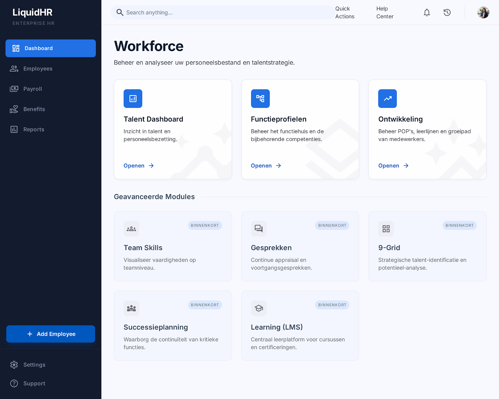

**Doel:** operationele modulelanding voor HR Admin en Manager.

**Gebruik uit mockup:**

- duidelijke scheiding tussen actieve en toekomstige modules;
- card-based navigatie;
- rustige modulebeschrijvingen.

**Blueprint-correcties:**

- configuratiebeheer blijft onder Settings;
- Manager ziet read-only formuleringen;
- toekomstige modules zijn disabled;
- Development is alleen actief wanneer hiervoor afzonderlijke requirements bestaan;
- geen “beheer functiehuis” onder Workforce.

---

## UI-002 — Talent Dashboard

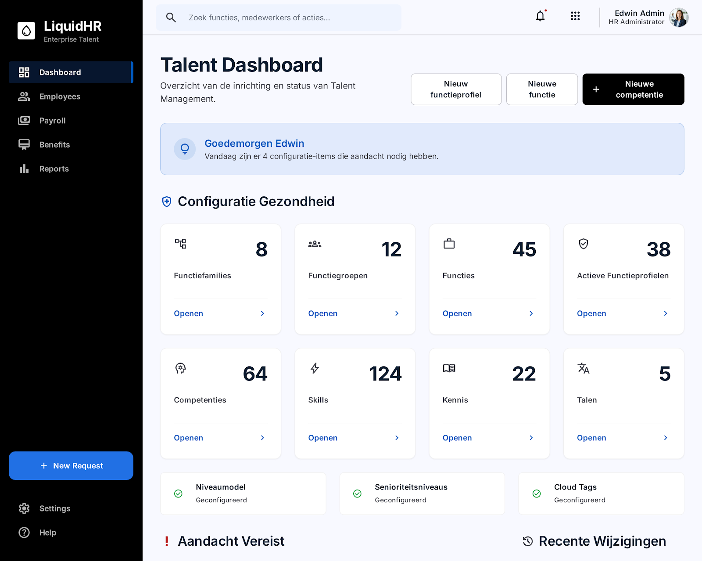

**Doel:** HR Admin-werkdashboard voor configuratiegezondheid.

**Gebruik uit mockup:**

- welkomst-/aandachtscontext;
- objectkaarten;
- statuskaarten voor Level Model, Seniority en Tags;
- recente wijzigingen en aandachtspunten.

**Blueprint-correcties:**

- alle aantallen komen uit echte tenantdata;
- familykaart alleen indien van toepassing;
- geen fictieve KPI’s;
- attention count alleen wanneer werkelijk berekend;
- dashboard is geen BI-dashboard.

---

## UI-003 — Talent Configuratie

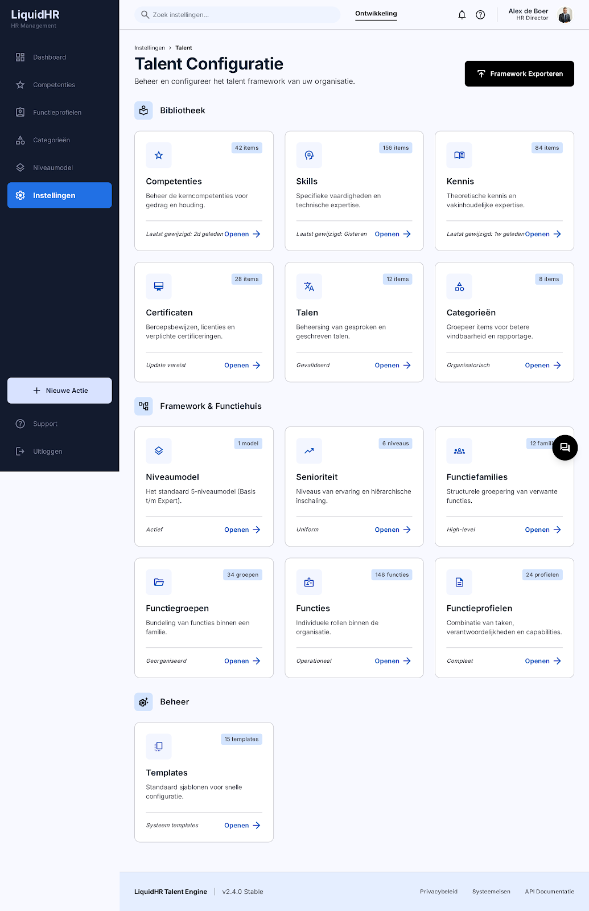

**Doel:** centrale landing onder Settings → Talent.

**Gebruik uit mockup:**

- groepering Bibliotheek, Framework & Functiehuis en Beheer;
- card layout;
- korte uitleg en telling per objecttype.

**Blueprint-correcties:**

- import/export niet actief in fase 1;
- templates niet vereist voor fase 1;
- Function Families optioneel;
- geen hardcoded 5-level beschrijving;
- kaarttellingen zijn echt.

---

## UI-004 — Competentie Detail

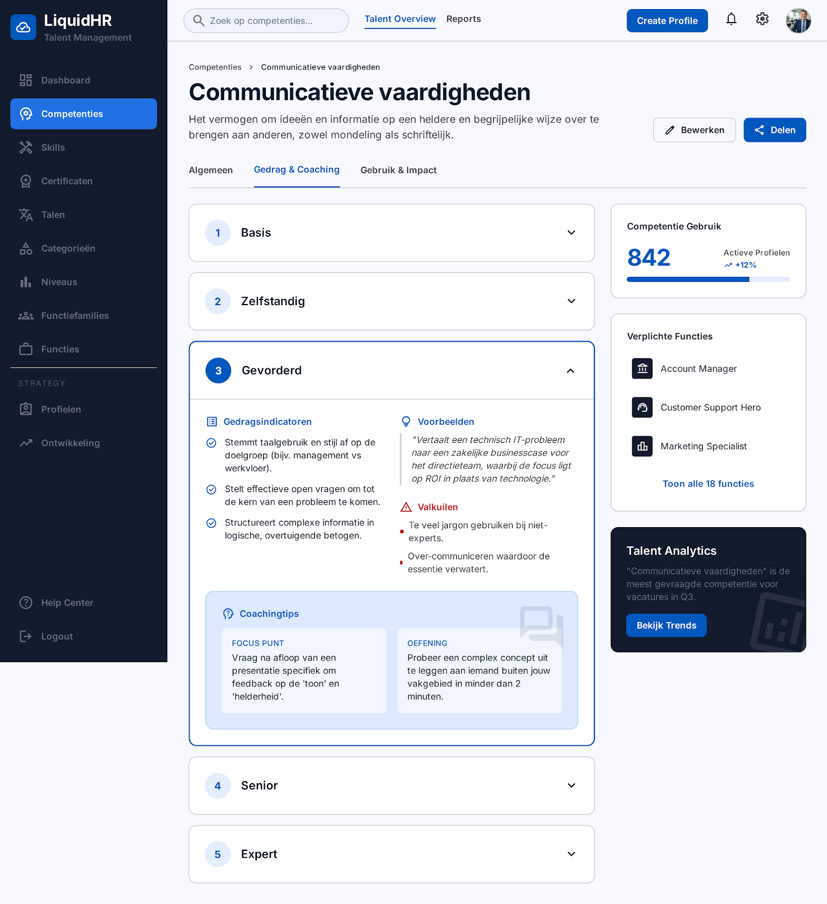

**Doel:** detailweergave van een Competency.

**Gebruik uit mockup:**

- niveauaccordions;
- gedragsindicatoren;
- voorbeelden/coachingcontext;
- usagepanel.

**Blueprint-correcties:**

- aantal levels is dynamisch;
- analytics/trends niet in fase 1 zonder bron;
- usage count is tenantgebonden en echt;
- Talent Level Model bepaalt levels;
- Skills en Knowledge gebruiken hetzelfde patroon met typespecifieke copy.

---

## UI-005 — Functiehuis Explorer

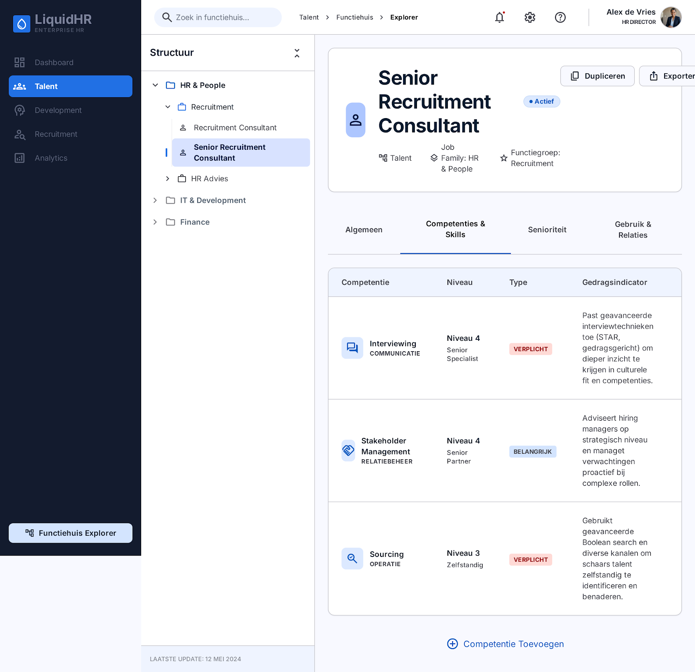

**Doel:** snel navigeren door groups/functions en detail bekijken.

**Gebruik uit mockup:**

- tree links en detail rechts;
- search;
- contexttabs;
- geselecteerde node duidelijk gemarkeerd.

**Blueprint-correcties:**

- minimale tree is Functiegroep → Functie;
- Functiefamilie is optioneel;
- Senioriteit is een functie-eigenschap, niet een verplichte tree-laag;
- functieprofiel is vanuit Function bereikbaar;
- geen duplicate/exportactie in fase 1 tenzij apart gespecificeerd.

---

## UI-006 — Functieprofiel

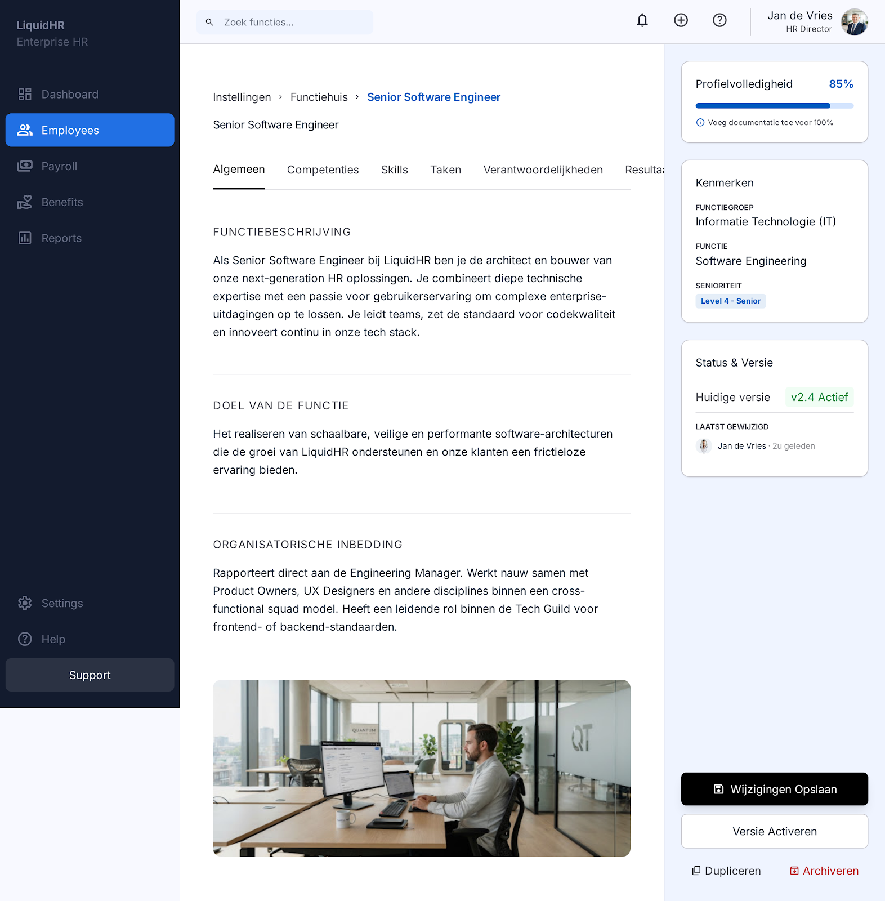

**Doel:** uitgebreide profile viewer/editor.

**Gebruik uit mockup:**

- brede contentkolom;
- tabs voor inhoudsgebieden;
- contextsidebar;
- duidelijke save/activationacties.

**Blueprint-correcties:**

- profile completeness alleen als deterministische checklist;
- status Draft/Active/Inactive;
- versie primair als geldigheidsperiode;
- afbeelding niet verplicht;
- Manager/Medewerker read-only;
- geen losse approval/publish.

---

## UI-007 — Mijn Talent

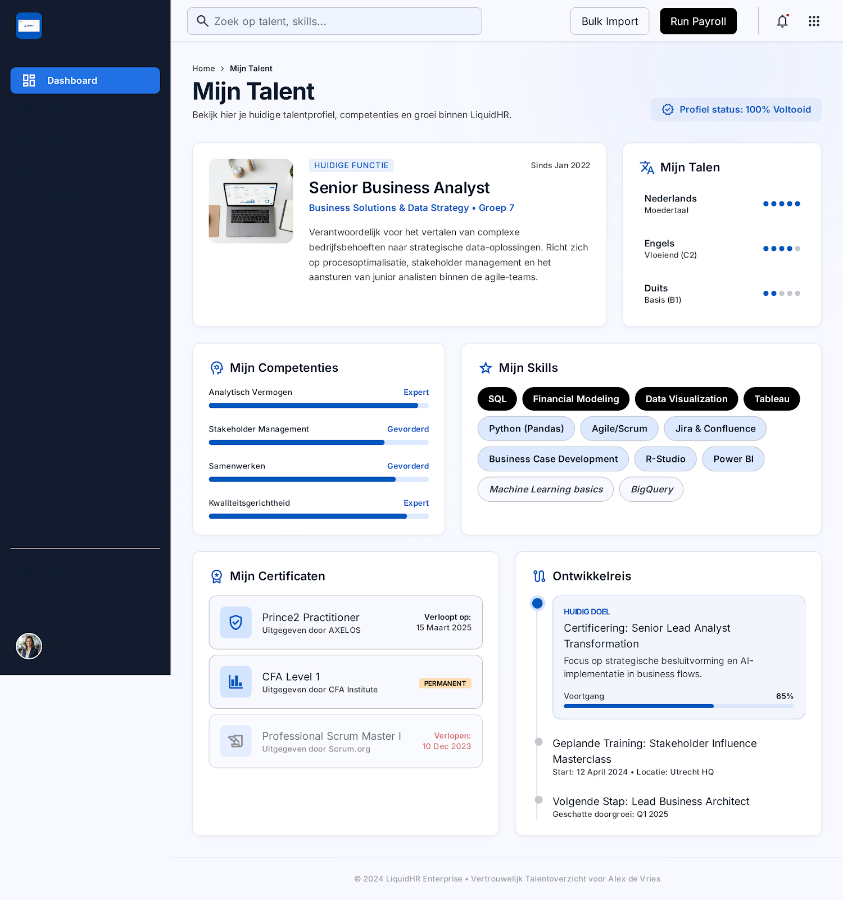

**Doel:** read-only medewerkerweergave.

**Gebruik uit mockup:**

- duidelijke huidige functiekaart;
- overzichtelijke capabilitysecties;
- toegankelijke card layout.

**Blueprint-correcties voor fase 1:**

- toon profile requirements, geen persoonlijke score;
- geen matchpercentage;
- geen persoonlijke progressbars;
- geen ontwikkelreis of next-role advies;
- certificaat- en taalstatus alleen wanneer er een betrouwbare bestaande persoonlijke bron is;
- geen editcontrols.

---

## UI-008 — Team Talent

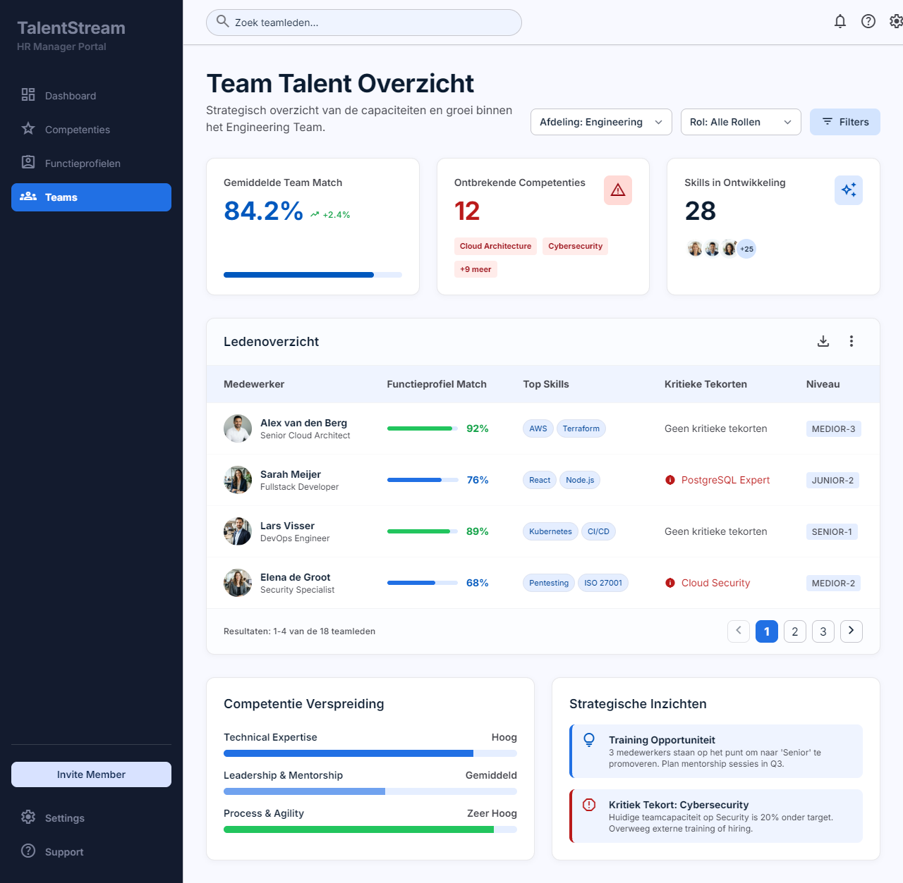

**Doel:** toekomstconcept voor manager/teamanalyse.

**Status:** fase 2 of later.

**Niet bouwen in fase 1:**

- gemiddelde teammatch;
- ontbrekende competencies;
- skills in development;
- critical gaps;
- strategic insights;
- persoonlijke levelbadges.

De visuele tabel- en filterpatronen mogen later worden hergebruikt nadat persoonlijke capabilitydata en definities zijn vastgesteld.

---

## UI-009 — Niveaumodel

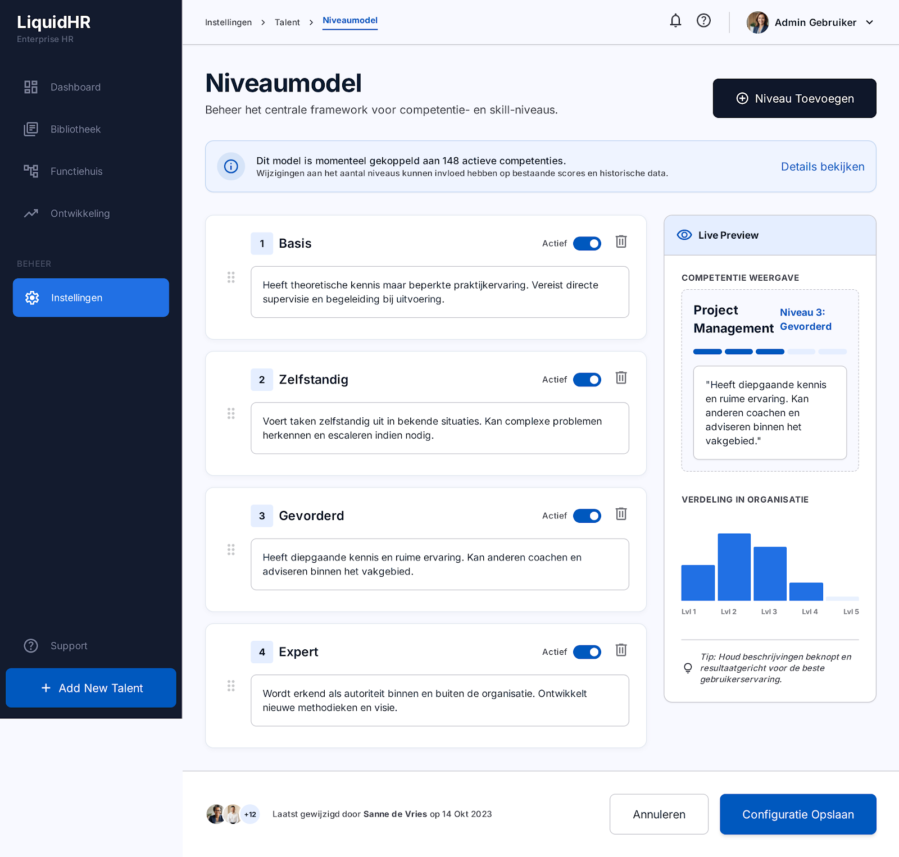

**Doel:** configuratie van het ene tenantbrede Talent Level Model.

**Gebruik uit mockup:**

- geordende level cards;
- description per level;
- drag/reorder vóór gebruik;
- duidelijke saveactie en preview.

**Blueprint-correcties:**

- dynamisch aantal levels;
- na In Use volledig structureel locked;
- geen organisatiedistributiegrafiek in fase 1;
- preview mag uitsluitend de levelpresentatie tonen;
- geen hardcoded “5-niveaumodel”.

---

## UI-010 — Senioriteit

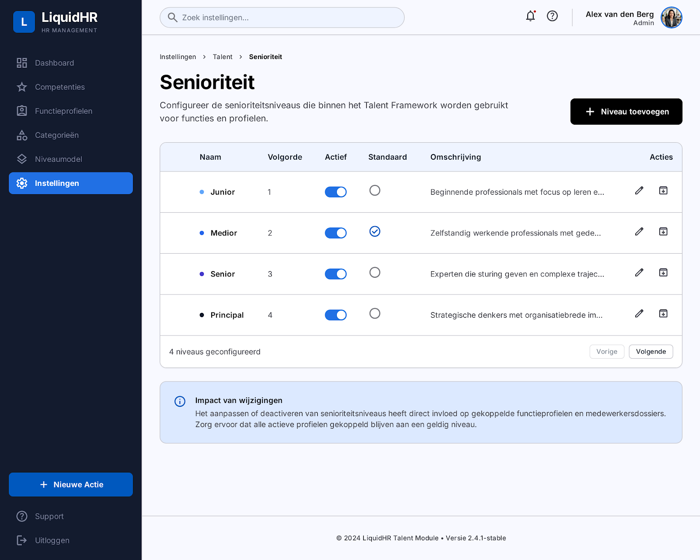

**Doel:** beheer van tenantbrede seniorities.

**Gebruik uit mockup:**

- table met naam, volgorde, status, omschrijving en actions;
- impactinformatie;
- duidelijke addactie.

**Blueprint-correcties:**

- geen “Standaard”-radio of automatische default seniority;
- Junior/Medior/Senior zijn bewerkbare seeds;
- gekoppelde functions en impact moeten zichtbaar zijn;
- seniority is optioneel per Function.

---

## UI-011 — Competentie toevoegen

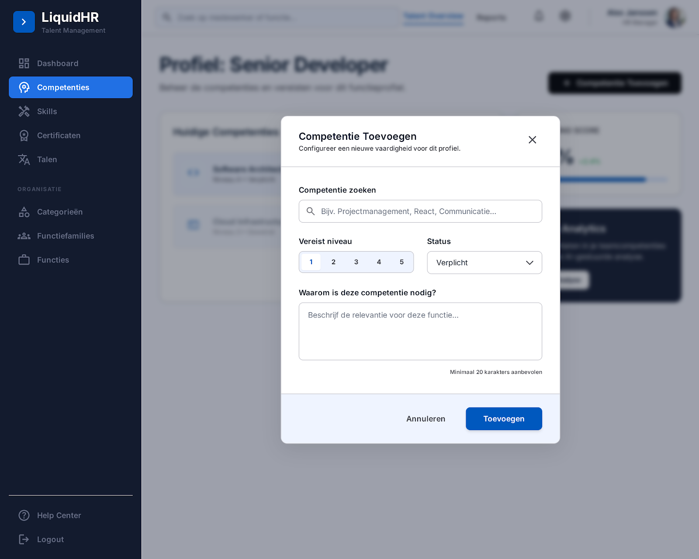

**Doel:** capability requirement aan Draft Profile Version toevoegen.

**Gebruik uit mockup:**

- zoekveld;
- niveaukeuze;
- importance/statusselectie;
- rationale/toelichting;
- compacte dialogflow.

**Blueprint-correcties:**

- levelselector is dynamisch en niet hardcoded 1–5;
- classification is Required, Important of Optional;
- type bepaalt levelveld: Talent Level, CEFR of certificate semantics;
- inactieve/reeds gekoppelde capability kan niet opnieuw worden toegevoegd.

---

## UI-012 — Functiefamilies

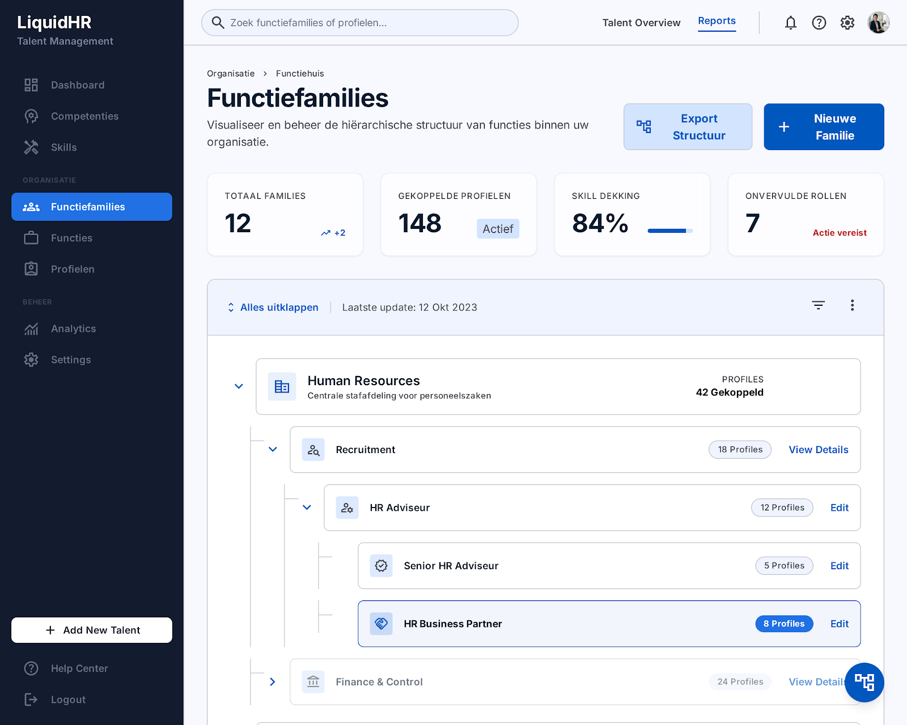

**Doel:** optionele family/group/function explorer.

**Gebruik uit mockup:**

- hiërarchische cards/tree;
- collapse/expand;
- duidelijke relationele context.

**Blueprint-correcties:**

- Functiefamilie is optioneel;
- KPI’s als skill coverage en unfilled roles vallen buiten fase 1;
- Senioriteit is een property van Function;
- “profielen per family” is alleen een echte telling als datamodel en query dit ondersteunen.

---

## UI-013 — Functieprofiel Detail

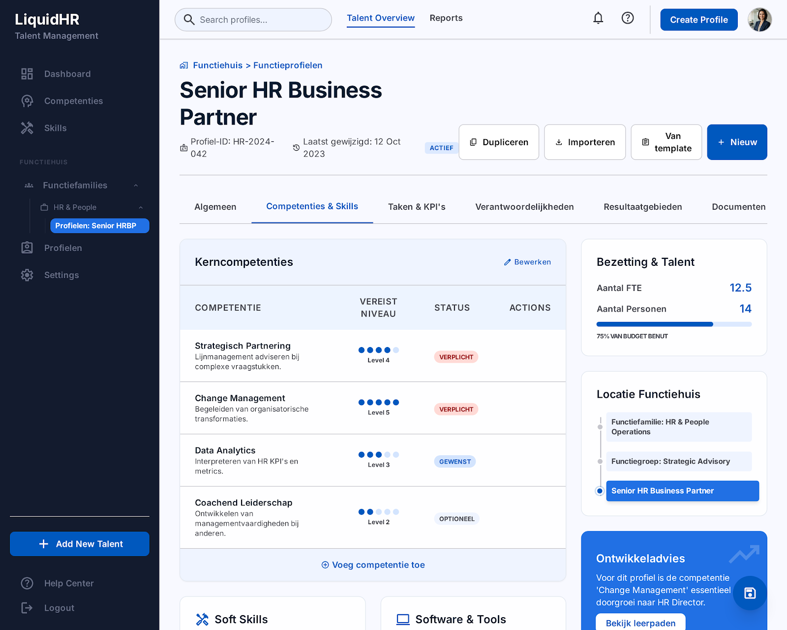

**Doel:** capabilitygerichte profile detailweergave.

**Gebruik uit mockup:**

- profile header;
- tabs;
- requirement table;
- function house context.

**Blueprint-correcties:**

- importactie niet in fase 1;
- bezetting, FTE, budget en ontwikkeladvies alleen wanneer bestaande modules echte data leveren; niet onderdeel van fase 1;
- capability levels zijn dynamisch;
- versie wordt met geldigheidsdatum gepresenteerd;
- geen AI-ontwikkeladvies.

---

# 3. Extra aangeleverd concept

## ALT-UI-002A — Alternatief Talent Dashboard

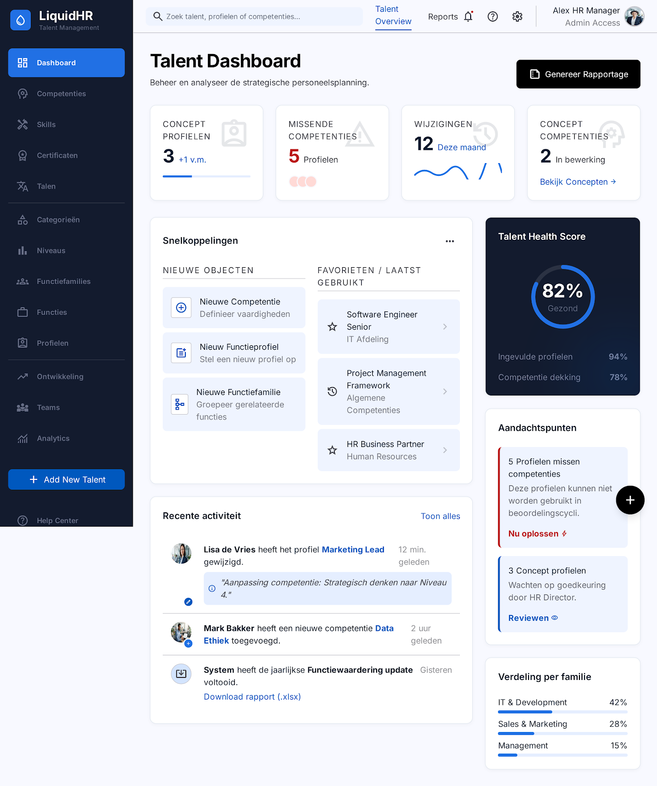

Dit extra aangeleverde dashboardconcept is bewaard voor inspiratie, maar maakt geen deel uit van de officiële UI-ID-set.

Elementen die niet in fase 1 worden overgenomen:

- Talent Health Score;
- approval/reviewcopy;
- profile analytics zonder bron;
- function-family verdelingen zonder duidelijke productdefinitie;
- rapportagegenerator;
- AI/automatische insights.

Bruikbare visuele ideeën:

- snelle acties;
- recente activiteit;
- aandachtspunten in een zijpaneel;
- favorieten/laatst gebruikt, indien het bestaande platform dit generiek ondersteunt.

---

# 4. Consistentiecheck voor implementatie

Voor ieder nieuw scherm moet het team controleren:

1. Past het scherm in Settings, Workforce of Employee Dashboard?
2. Is de rol en permission helder?
3. Komt alle weergegeven data uit een echte bron?
4. Zijn alle acties in fase 1 toegestaan?
5. Is het Tenant Level Model dynamisch toegepast?
6. Is Functiefamilie optioneel gebleven?
7. Is Senioriteit als functieproperty gemodelleerd?
8. Is profile date-versioning zichtbaar en correct?
9. Zijn loading, empty, error, conflict en permission states ontworpen?
10. Worden bestaande LiquidHR-components hergebruikt?
11. Is de interface toetsenbord- en screenreaderbruikbaar?
12. Is Product Blueprint-logica boven mockupdetails gesteld?

---

**Einde UI Reference Library**
