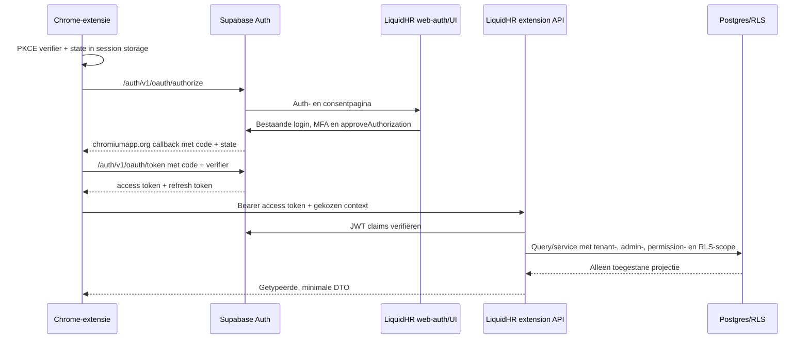

# LiquidHR Chrome Extension — technische architectuur

**Status:** CONCEPT — technisch/non-functioneel ontwerpvoorstel
**Datum:** 1 augustus 2026
**Eigenaar:** LiquidHR-platform
**Doel:** een veilige Manifest V3 Chrome-extensie waarmee medewerkers, managers en HR-admins een kleine, doelgerichte LiquidHR-projectie kunnen bekijken en beperkte acties kunnen uitvoeren.

Dit document beschrijft de technische oplossing, beveiligingsgrenzen, authenticatiekeuzes, headstart en verificatie. Het is nog geen functionele backlog en introduceert nog geen schema, migration of productieconfiguratie.

## 1. Kernbesluit

De extensie wordt een **publieke OAuth 2.1-client** van LiquidHR/Supabase Auth:

1. De gebruiker klikt in de extensie op **Inloggen met LiquidHR**.
2. De extensie start via Chrome `identity.launchWebAuthFlow()` een browser-authenticatiestroom.
3. Supabase Auth gebruikt de bestaande LiquidHR-login, uitnodigingsregels en MFA.
4. De gebruiker ziet in LiquidHR een expliciet toestemmingsscherm voor de extensie.
5. Supabase geeft na goedkeuring een kortlevende authorization code terug naar de extensie.
6. De extensie wisselt die code met **Authorization Code + PKCE** om voor Supabase access- en refresh-tokens.
7. De extensie gebruikt daarna uitsluitend de beperkte `api/extension/v1/*`-API van LiquidHR. Die API controleert opnieuw user, tenant, administratie, permission, managementscope en RLS.

De extensie krijgt **geen `service_role`/secret key**, geen kopie van webcookies en geen directe vrije toegang tot alle tabellen. Een publieke Supabase publishable key mag technisch in clientcode staan; de key is geen autorisatie. RLS en server-side permissionchecks zijn de autorisatie.

### QR-besluit

Een QR-code is **niet** de primaire loginmethode. Een QR-code met een bearer-token, refresh-token, magic link of gebruikerssessie is onveilig en wordt niet gebouwd.

QR kan later als optionele **cross-device pairing-flow** worden toegevoegd. Dat vereist een eigen, kortlevende device-authorisation broker met eenmalige codes, polling/backchannel, replaybescherming, rate limiting, MFA en audit. Supabase OAuth ondersteunt volgens de actuele documentatie authorization-code- en refresh-tokenflows; het ondersteunt niet standaard de OAuth Device Authorization Grant. Daarom is QR een fase-2-optie, niet de headstart.

## 2. Doelgroep en autorisatiemodel

De extensie heeft geen aparte rolmodus. De server geeft een getypeerde capability-projectie terug op basis van de bestaande LiquidHR-rechten. De UI toont alleen wat de server als toegestaan teruggeeft; iedere API-route controleert het opnieuw.

| Actor | Typische scope | Voorbeeld van veilige extensieprojectie |
|---|---|---|
| Medewerker | Eigen medewerker en eigen dienstverband | Eigen profiel, contractsamenvatting, verlofsaldo, beperkte selfserviceactie |
| Manager | Directe/afdelingsscope volgens effective-dated managementtoewijzing | Teamoverzicht, openstaande teamactie, goedkeuring waarvoor exact permission en scope bestaan |
| HR-admin | Expliciete tenant-/administratiescope volgens `user_access` | Beperkte HR-status, kleine administratieve actie, auditbare bevestiging |

De extensie gebruikt dezelfde canonieke permissions als LiquidHR: `resource:action` en `self:resource:action`. Voorbeelden moeten vóór implementatie worden vastgesteld per domein; de extensie mag geen nieuwe wildcard zoals `extension:all` introduceren.

Belangrijke bestaande grenzen blijven ongewijzigd:

- `tenant_id` is de absolute klantgrens.
- `administration_id` is de juridische/operationele grens voor contract, salaris, rooster, verlof, verzuim en payroll.
- Een lege administratie-ID geeft nooit automatisch toegang tot alle administraties.
- De actieve context in de extensie is een verzoekparameter, geen bewijs van toegang.
- Een gebruiker met een dienstverband in twee administraties ziet niet automatisch de gegevens van beide; iedere projectie valideert de gekozen administratie opnieuw.

## 3. Hoe de technische flow werkt



### Browser- en extensiecomponenten

De eerste versie gebruikt Manifest V3 met:

- een kleine popup voor status en snelle acties;
- een side panel voor de echte interactie;
- één service worker voor auth, token refresh, netwerkcalls en message routing;
- geen content script in fase 1;
- geen toegang tot browsertabs, browsing history, cookies, `webRequest` of willekeurige pagina-inhoud;
- alleen HTTPS-host-permissions voor de LiquidHR-app/API en het Supabase Auth-endpoint, exact begrensd.

De extensie leest dus niet mee op websites. Zij is een beveiligde companion-app in Chrome, geen scraper of injectielaag.

## 4. Authenticatievarianten onderzocht

| Variant | Gebruikerservaring | Beveiliging | Technische beoordeling |
|---|---|---|---|
| Rechtstreeks `signInWithPassword`/Google in de extensie | Bekend loginformulier in popup | Auth-flow wordt gedupliceerd; tokens moeten zelf worden beheerd; geen nette consentlaag | Alleen als tijdelijke spike; niet de voorkeursarchitectuur |
| Supabase OAuth 2.1 + Authorization Code + PKCE | Browserlogin, daarna één duidelijke “LiquidHR wil toegang”-bevestiging | Geschikt voor een public client zonder client secret; code is kortlevend, eenmalig en aan PKCE gebonden | **Voorkeur** |
| QR met loginlink/token | Lijkt eenvoudig | Tokenlek, phishing, replay en cross-device callbackproblemen; token in QR is een bearer credential | Niet toestaan |
| QR als eigen device pairing | Zeer gebruiksvriendelijk op een tweede apparaat | Veilig te maken, maar vereist extra broker, state machine, expiry, polling, MFA, audit en herstelpaden | Fase 2 na behoefteonderzoek |
| TOTP-authenticator-QR | Goede MFA-enrollment | QR bevat een gedeeld TOTP-secret; dit is voor MFA-inrichting, niet voor extensie-login | Alleen gebruiken binnen Supabase MFA-flow |

### Waarom PKCE de juiste keuze is

Een Chrome-extensie kan geen geheim client-secret veilig bewaren: de package en runtime zijn inspecteerbaar. Daarom registreert LiquidHR de extensie als **public OAuth client** met `token_endpoint_auth_method = none`. PKCE voorkomt dat een onderschepte authorization code zonder de oorspronkelijke verifier kan worden ingewisseld.

De extensie:

1. genereert een cryptografisch willekeurige verifier en challenge (`S256`);
2. genereert een cryptografisch willekeurige `state`;
3. bewaart verifier en state alleen in `chrome.storage.session`;
4. gebruikt `chrome.identity.getRedirectURL('oauth/callback')` als exacte redirect;
5. controleert de callback-state vóór token exchange;
6. wisselt de code één keer om en verwijdert verifier/state daarna.

De Supabase OAuth-consentpagina in LiquidHR toont minimaal de extensienaam, uitgever, aangevraagde scopes/capabilities en het feit dat de extensie LiquidHR-data kan lezen of beperkte acties kan uitvoeren. De gebruiker kan weigeren. Een bestaande LiquidHR-sessie op dezelfde browser maakt deze flow snel; MFA wordt afgedwongen wanneer de policy dat vereist.

### Bestaande LiquidHR-authenticatie als bron van waarheid

De actuele LiquidHR-code gebruikt Google OAuth en e-mailadres/wachtwoord; de bestaande ADR beschrijft dezelfde richting. Een oudere generieke UI-blauwdruk noemt magic links, maar dat is niet de actuele implementatie. De extensie mag dit verschil niet zelf oplossen met een derde loginmethode. Eerst moet de web-authcontractkeuze in LiquidHR als één actuele bron van waarheid worden bevestigd; daarna hergebruikt de extensie die flow via de OAuth-consentpagina.

## 5. Token- en sessiebeheer

### Opslag

- Access token en refresh token: `chrome.storage.session`, niet `storage.sync`.
- PKCE verifier, state en tijdelijke context: `chrome.storage.session`.
- UI-voorkeuren: eventueel `storage.sync`, maar nooit HR-data of tokens.
- Geen gevoelige data in URL-fragmenten, logs, analytics, error reports of `storage.local`.

`chrome.storage.session` is in-memory en wordt gewist bij browserrestart, extension reload, disable en update. Dat is een bewuste veiligheidskeuze. Na een browserrestart herhaalt de extensie de browserflow; bij een bestaande Google-/LiquidHR-sessie is dat voor de gebruiker meestal een korte herautorisatie.

### Verloop en intrekken

- De service worker ververst een verlopen access token uitsluitend via de refresh-tokenflow.
- Bij `401`, invalid refresh token, gewijzigde toestemming of accountdeactivatie worden tokens verwijderd en krijgt de gebruiker een duidelijke herloginactie.
- Uitloggen wist alle extension storage, stopt polling en meldt de sessie af.
- LiquidHR krijgt een webscherm “Verbonden apps en sessies” waarmee de gebruiker de extensieautorisatie kan intrekken.
- HR-admins kunnen bij een medewerker- of accountincident bestaande extensiesessies server-side blokkeren; uitloggen op de extensie is niet de enige intrekkingsmaatregel.

## 6. Veilige data-toegang

### API-ontwerp

De extensie praat niet met willekeurige tabellen. Er komt een kleine, versieerbare facade:

```text
GET  /api/extension/v1/bootstrap
GET  /api/extension/v1/me/summary
GET  /api/extension/v1/team/summary
POST /api/extension/v1/leave-requests/:id/approve
POST /api/extension/v1/actions/:action/confirm
```

De exacte routes en acties worden per domein ontworpen. Elke route voert deze volgorde uit:

1. Bearer JWT uitlezen en cryptografisch/issuer/audience/expiry controleren;
2. `auth.uid()` en eventueel OAuth `client_id` vaststellen;
3. `user_access`, actieve rollen, permissions en employee-koppeling laden;
4. door de extensie meegestuurde tenant-/administratiecontext server-side valideren;
5. `requirePermission()` plus target-/managementscope uitvoeren;
6. input valideren met hetzelfde strikte schema aan client- en serverkant;
7. alleen een vaste, minimale projectie lezen of de centrale domein-writeweg aanroepen;
8. bij mutatie een idempotency key, bevestiging, audit-event en consistente foutresponse gebruiken.

De huidige LiquidHR-`requireAuthContext()` is primair cookie-/webcontext-gericht. Die helper mag daarom niet blind in de extensie-API worden hergebruikt. Maak een expliciete Bearer-variant die de JWT uit `Authorization` leest en daarna dezelfde `AuthContext`-semantiek teruggeeft. De extensie stuurt de gekozen context mee als data; de server valideert die keuze tegen `user_access` en RLS. CORS/Origin wordt, waar nodig, beperkt tot de vaste productie- en development-extension-ID's; nooit tot `*` in combinatie met credentials.

De API gebruikt niet automatisch de service-roleclient. Als een privileged serverquery ooit onvermijdelijk is, gebeurt dat alleen na expliciete autorisatie en met een tweede, controleerbare scopefilter. RLS blijft actief waar dat mogelijk is.

### RLS en OAuth-clientgrens

Supabase OAuth-tokens bevatten een `client_id`. Dat maakt het mogelijk om de extensie als afzonderlijk kanaal in RLS te herkennen. Dit vervangt de gewone user-/tenant-/administratiechecks niet; het is een extra grens.

Belangrijk: OAuth-scopes zoals `email` of `profile` bepalen niet welke Postgres-tabellen toegankelijk zijn. De database gebruikt RLS voor die beslissing. Voor gevoelige tabellen kan een aanvullende restrictive policy gelden die de extension-client uitsluit of alleen een specifieke read/write-projectie toestaat.

Nieuwe tabellen of extension-specifieke brokerdata volgen LiquidHR-regels:

- migration bevat tabel, RLS, policies, grants, indexen en constraints in samenhang;
- `tenant_id` is verplicht waar de data tenant-owned is;
- administratiegebonden data gebruikt tenant + administratie als samengestelde grens;
- interne helpers staan in `internal_security`, niet in `public`;
- geen autorisatiebeslissing op `user_metadata`;
- cross-tenant en cross-administration negatieve tests zijn verplicht;
- na schemawerk: advisors, gegenereerde DB-types en isolatietests.

### Data-minimalisatie

De extension-DTO's zijn allowlists, geen “select *”. In fase 1 worden uitgesloten:

- BSN en andere secure identifiers;
- bankrekening- en betaalinformatie;
- medische/verzuimdetails en vrije medische tekst;
- volledige documenten, dossierinhoud en downloads;
- salaris- of contractdetails zonder expliciet domeinpermission;
- volledige medewerkerlijsten voor een medewerker die alleen selfservice heeft.

Een manager krijgt alleen een samenvatting van medewerkers binnen de bestaande managementscope. Een HR-admin krijgt alleen de administratie-/tenantgegevens waarvoor de bestaande accessregels gelden. De browser mag nooit zelf employee-ID's combineren om een bredere lijst te reconstrueren.

## 7. Headstart: repository en eerste verticale slice

### Voorgestelde structuur

```text
apps/
  hr-suite/                         bestaande LiquidHR-webapp
  liquidhr-extension/               nieuwe Manifest V3-workspace
    src/
      auth/                          PKCE, OAuth callback, refresh, logout
      background/                    service worker en message router
      api/                           typed client voor extension/v1
      components/                    popup/side-panel UI
      manifest.ts                    minimale permissions en CSP
packages/
  extension-contracts/              publieke DTO's en Zod-contracten
```

De extensie importeert geen `lib/supabase/server`, `lib/auth/admin` of andere server-only LiquidHR-code. Alleen stabiele, publieke API-contracten mogen gedeeld worden. `packages/db/types.ts` blijft een server-/database-afgeleide en wordt niet de UI-datastructuur van de extensie.

### Bouwvolgorde

1. **Auth-contract:** bevestig OAuth 2.1 Server, public client, redirect-ID, client registration, consentroute en MFAgedrag.
2. **Schema:** alleen indien nodig voor OAuth-client/session audit, device registration of pairing; RLS en negatieve tests in dezelfde migration.
3. **API:** bouw eerst `bootstrap` en één read-only selfserviceprojectie met Bearer-auth.
4. **UI:** bouw popup/side panel met echte DTO's; geen fake employee- of reminderdata.
5. **Eerste actie:** voeg pas daarna één kleine, idempotente, auditbare write-action toe.

### Eerste technische mijlpaal

De eerste slice is geslaagd wanneer een echte uitgenodigde medewerker:

- de extensie installeert zonder brede browserwaarschuwing;
- via de webbrowser met de bestaande LiquidHR-auth inlogt;
- de OAuth-consent expliciet ziet en accepteert;
- alleen de eigen, vooraf gedefinieerde samenvatting ontvangt;
- bij een gemanipuleerde tenant-, administratie- of employee-ID `403`/lege toegestane projectie krijgt;
- na logout geen bruikbare token of HR-data in extension storage achterlaat.

Daarna dezelfde matrix voor manager en HR-admin uitvoeren, met twee administraties en een persoon met twee employments.

## 8. Niet-functionele eisen en dreigingsmodel

### Dreigingen

- gecompromitteerde of kwaadwillende webpagina die content-scriptberichten namaakt;
- XSS of dependency compromise in de extension package;
- onderschepte OAuth code, replay van `state` of PKCE-verifier;
- gestolen refresh token uit browserprofiel of logging;
- cross-tenant IDOR/BOLA via gemanipuleerde URL/body;
- te brede managerquery of gevoelige DTO;
- extension-update of publisher-account compromise;
- QR-phishing of een QR die een sessie/token overdraagt.

### Verplichte controls

- Manifest V3, alle uitvoerbare code gebundeld; geen remote JavaScript/CDN-code.
- Content Security Policy met `default-src 'self'` voor extension pages.
- HTTPS-only netwerk; exacte host permissions en geen wildcard-hosts.
- Geen `innerHTML`, `eval`, `new Function` of dynamische codegeneratie.
- Berichten tussen popup, side panel en service worker hebben een gesloten union-type; sender en actie worden gevalideerd.
- Alle responses worden als tekst/gestructureerde data gerenderd, nooit als HTML.
- Dependencyversies en lockfile worden vastgelegd; build-output wordt gecontroleerd op remote code.
- Chrome Web Store publisher-accounts gebruiken MFA/security key; releases zijn reviewbaar en reproduceerbaar.
- API's hebben rate limiting, request-size limits, timeouts, correlation ID zonder tokens en auditlogging zonder PII-overexposure.
- Geen sensitive data in telemetry; bewaartermijn en verwijdering worden vastgelegd vóór productie.

### Prestatie, beschikbaarheid en UX

- Bootstrap en normale selfservice-read blijven klein en begrensd; geen onbegrensde lijsten.
- Fouten zijn herstelbaar: “sessie verlopen”, “geen toegang”, “tijdelijk niet beschikbaar” en “actie al verwerkt” zijn verschillende toestanden.
- Offline toont de extensie hoogstens niet-gevoelige UI-voorkeuren; HR-data wordt niet als betrouwbare offline cache gebruikt.
- De gebruiker ziet altijd de actieve tenant/administratiecontext en een laatste-ververstijd bij data die niet realtime is.
- Nieuwe API-projecties krijgen een gerichte route-/browsermeting; de bestaande LiquidHR-budgetten voor detailnavigatie en warme tabwissels blijven het referentiepunt.

## 9. Verificatie en releasegate

### Auth- en securitytests

- PKCE: verkeerde verifier, verkeerde state, verlopen code, hergebruikte code en verkeerde redirect worden geweigerd.
- Sessies: refresh, logout, accountdeactivatie, intrekking en browserrestart.
- RLS: eigen medewerker, tweede medewerker, directe manager, ancestor-manager, deputy en HR-admin.
- Tenant/admin: twee tenants, twee administraties, één persoon met twee employments, verkeerde administratie en verkeerde tenant.
- API: ontbrekende bearer, malformed JWT, verkeerde `client_id`, ongeldige action, replayed idempotency key en rate-limit.
- Privacy: geen BSN/bank/medische/documentdata in DTO, logs, storage of screenshots.
- Extension: CSP, geen remote hosted code, minimale permissions, geen content-script data leak en geen brede message-handler.

### Projectchecks

Voor een wijziging aan auth, routing, API, schema/RLS of kritieke action geldt de brede LiquidHR-gate: strict typecheck, lint, relevante tests, i18n-pariteit, production build, lokale browsercontrole, remote migration parity, Supabase advisors en positieve/negatieve database-isolatietests. Een succesvolle build of Chrome-installatie is geen bewijs van autorisatie.

## 10. Besluiten/open punten vóór implementatie

1. Bevestig de actuele web-authmethoden als bron van waarheid: Google, password en eventuele toekomstige passkey; magic link niet opnieuw introduceren zonder ADR-wijziging.
2. Bevestig of Supabase OAuth 2.1 Server in het LiquidHR-project beschikbaar en geschikt is voor een first-party Chrome-client en welke plan-/dashboardinstellingen nodig zijn.
3. Leg de exacte extension OAuth-client, productie-redirect en vaste development extension key vast.
4. Maak per domein een capability- en DTO-allowlist; begin met één read-only selfserviceprojectie.
5. Besluit of OAuth `client_id` alleen als extra RLS-grens dient of ook als aparte extension-channel policy wordt gebruikt.
6. Maak alleen een QR-pairing ADR wanneer de gebruikersbehoefte cross-device login aantoonbaar maakt dat de extra brokercomplexiteit waard is.

## Bronnen

### LiquidHR-bronnen

- [Architectuurblauwdruk](../../architecture/BLUEPRINT.md)
- [Autorisatie en rechten](../authorization/AUTORISATIE_EN_RECHTEN.md)
- [Multitenancy en multi-administratie](../multitenancy/MULTITENANCY_EN_MULTI_ADMINISTRATIE.md)
- [Entiteiteigendom en koppeling](../multitenancy/ENTITEIT_EIGENAARSCHAP_EN_KOPPELMODEL.md)
- [ADR-0001 — tenant- en administratiegrenzen](../../decisions/ADR-0001-tenant-en-administratiegrenzen.md)
- [ADR-0002 — authenticatie](../../decisions/ADR-0002-authenticatie-i18n-en-persoonlijke-themas.md)

### Actuele primaire bronnen

- [Supabase OAuth 2.1 Server](https://supabase.com/docs/guides/auth/oauth-server)
- [Supabase OAuth 2.1 flows](https://supabase.com/docs/guides/auth/oauth-server/oauth-flows)
- [Supabase token security en RLS](https://supabase.com/docs/guides/auth/oauth-server/token-security)
- [Supabase PKCE-flow](https://supabase.com/docs/guides/auth/sessions/pkce-flow)
- [Supabase Google-login voor Chrome Extensions](https://supabase.com/docs/guides/auth/social-login/auth-google)
- [Supabase MFA](https://supabase.com/docs/guides/auth/auth-mfa)
- [Supabase redirect URL's](https://supabase.com/docs/guides/auth/redirect-urls)
- [Chrome `identity` API](https://developer.chrome.com/docs/extensions/reference/api/identity)
- [Chrome storage API](https://developer.chrome.com/docs/extensions/reference/api/storage)
- [Chrome veilig bouwen voor extensies](https://developer.chrome.com/docs/extensions/develop/security-privacy/stay-secure)
- [Chrome Manifest V3](https://developer.chrome.com/docs/extensions/develop/migrate/what-is-mv3)
- [RFC 8252 — OAuth voor native/public clients](https://datatracker.ietf.org/doc/rfc8252/)
- [RFC 8628 — OAuth Device Authorization Grant en QR](https://datatracker.ietf.org/doc/rfc8628/)
